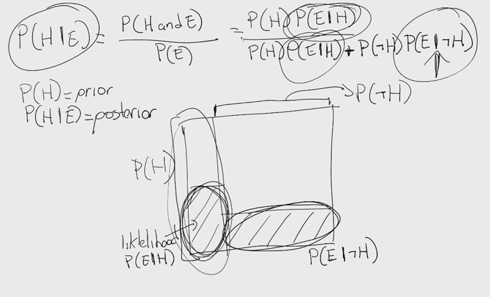

# Ciencia de datos con Python <!-- omit in toc -->

> Python es sin duda un lenguaje que permite hacer muchas cosas, por lo que también es bastante extenso y me he dado a la tarea de organizar mejor el repositorio

## Tabla de Contenido<!-- omit in toc -->
- [Algoritmos de Optimización](#algoritmos-de-optimizaci%c3%b3n)
  - [El problema del morral](#el-problema-del-morral)
- [Programación dinámica y estocástica](#programaci%c3%b3n-din%c3%a1mica-y-estoc%c3%a1stica)
  - [Programación dinámica](#programaci%c3%b3n-din%c3%a1mica)
    - [La optimizacion se basa en la memorizacion](#la-optimizacion-se-basa-en-la-memorizacion)
    - [Fibonacci](#fibonacci)
- [Matemáticas para programar](#matem%c3%a1ticas-para-programar)
- [Pensamiento y Programación probabilística](#pensamiento-y-programaci%c3%b3n-probabil%c3%adstica)
  - [Algunos ejemplos](#algunos-ejemplos)
  - [Subconjuntos y universos](#subconjuntos-y-universos)
  - [Probabilidades condicionales](#probabilidades-condicionales)
  - [Teorema de Bayes](#teorema-de-bayes)
    - [Entendiendo el teorema de bayes](#entendiendo-el-teorema-de-bayes)
    - [Análisis de síntomas](#an%c3%a1lisis-de-s%c3%adntomas)
    - [Aplicaciones del teorema de bayes](#aplicaciones-del-teorema-de-bayes)
  - [Mentiras estadísticas](#mentiras-estad%c3%adsticas)
    - [Garbage in, garbage out (principio GIGO, basura entra, basura sale)](#garbage-in-garbage-out-principio-gigo-basura-entra-basura-sale)
    - [Imágenes engañosas](#im%c3%a1genes-enga%c3%b1osas)
    - [Cum Hoc Ergo Propter Hoc](#cum-hoc-ergo-propter-hoc)
    - [Prejuicio en el muestreo](#prejuicio-en-el-muestreo)
    - [Falacia del francotirador de texas](#falacia-del-francotirador-de-texas)
    - [Porcentajes confusos](#porcentajes-confusos)
    - [Falacia de regresión](#falacia-de-regresi%c3%b3n)
  - [Introducción al Machine Learning](#introducci%c3%b3n-al-machine-learning)
    - [Future vectors](#future-vectors)
    - [Métricas de distancia](#m%c3%a9tricas-de-distancia)
  - [Agrupamiento y clusterización](#agrupamiento-y-clusterizaci%c3%b3n)
    - [Introducción](#introducci%c3%b3n)
    - [Agrupamiento jerárquico](#agrupamiento-jer%c3%a1rquico)

# Algoritmos de Optimización
* Permite resolver muchos problemas de manera computacional
* Una función objetivo que debemos maximizar o minimizar, el input que nos da el resultado más alto y bajo
* Una serie de limitantes que debemos respetar, po ejemplo algunas reglas de negocio

> “P versus NP” es algo más que un rompecabezas matemático abstracto. Su objetivo es determinar —de una vez por todas— qué tipo de problemas se pueden resolver con ordenadores, y cuáles no. 
> 
> Los problemas de clase “P” son “fáciles” de resolver para los ordenadores; es decir, las soluciones a estos problemas pueden ser calculadas en una cantidad razonable de tiempo, en comparación con la complejidad del problema.

[Problema P vs NP](https://www.youtube.com/watch?v=UR2oDYZ-Sao)

## El problema del morral
Obtener el mayor valor en una mochila

# Programación dinámica y estocástica

## Programación dinámica
> “[El nombre] Programacion Dinamica se escogio para esconder a patrocinadores gubernamentales el hecho de que en realidad estaba haciendo Matematicas. La frase Programacion Dinamica es algo a lo que ningun congresiste puede oponerse” - 
> 
> **Richard Bellman**

Los problemas que esta técnica puede optimizar son los que tienen una subestructura optima y ademas tiene ser un tipo de problema empalmado (ejem: Fibonacci)

* **Subestructura Optima:** una solucion optima local se puede encontrar al combinar soluciones optimas de subproblemas locales.

* **Problemas empalmados:** Una solucion optima que involucra resolver el mismo problema en varias ocaciones

### La optimizacion se basa en la memorizacion

* Es una tecnica para guardar computos previos con el fin de no realizarlos nuevamente
* Normalmente se utiliza un diccionario donde las consultas se pueden hacer en O(1)
* Intercambia Tiempo por Espacio

### Fibonacci
Fn = Fn-1 + Fn-2

# Matemáticas para programar
https://blog.thedojo.mx/2019/12/25/las-matematicas-que-debes-saber-para-programar.html

# Pensamiento y Programación probabilística
* Utiliza probabiliades y modelos probabilísticos para ejecutar computos
* Se utiliza en una gran cantidad de campos
  * Investigación científica
  * Inteligencia artificial
  * Medicina
* Extisten lenguajes y librerias especialidades para ejecutar este tipo de computo como Pyro de Uber

Obtener evidencia de si nuestras hipotesis son verdaderas o falsas

Diferencia entre la programación probabilistica y la estócastica: Incorpoa directamente la aleatoridad mientras que la primera trabaja directamente con la probabilidad

https://pyro.ai/

## Algunos ejemplos

> Uber necesita unir conductores con clientes para determinar cuanto va a tardar el conductor en llegar del punto a al punto b, para ello se usa un modelo probabilistico

> Filtro de spam, son de los años 90 realizando un modelo probabilistico, mientras los usuarios reportaban que era y que no era SPAM

> Para la medicina cuando le platicas al medico tus sintomas, se le da muy poca información y son malestares muy comúnes con los que el médico se genera hipótesis en su cabeza y te hace un Test con cierto margen de error, dependiendo de la importancia de la enfermedad se aumenta la sencibilidad del Test para evitar Falsos Positivos. **No son exactos** y se pueden llegar a resultados distintos

## Subconjuntos y universos
Juan es un músico, se desvela todas las noches y a menudo se va de parranda, que es más probable que sea músico o que sea músico y consuma drogas

El segundo es muy pequeño, el **(y)** reduce el número de probabilidades

<div align="center">
  
</div>

Al meter una nueva condición el universo se hace aún más pequeño

<div align="center">
  
</div>

Siempre que haya una condición **(y)** se van a reducir las probabilidades

## Probabilidades condicionales

Para la probabilidad independiente comunmente se **consideran eventos que no están relacionados unos con otros**, por ejemplo cada que se tira una moneda o gira una ruleta cada evento es independiente. El principal trabajo es contar

Por ejemplo al tirar una moneda **la probabilidad de que caíga dos veces cruz de de 1/4**

<div align="center">
  
</div>

**Pero al tomar probabilidades condicionales hay que considerar el evento anterior**

Para la probabilidad de A y B, se toma en consideración la influencia de un evento en conjunto con otro. **Se toma en consideración todo el universo**

<div align="center">
  
</div>

> **Glosario**
| (Dado que)
.- (no suceda)

## Teorema de Bayes

Es uno de los más importantes, hay que tatuarselo.

> Nos permite actualizar evidencia para mejorar nuestras creencias con respecto a algo. Doctrina de la aleatoriedad

Julian es un estudiante timido que le gusta estudiar, que es más probable que sea ingeniero o estudiante de negocios

<div align="center">
  
</div>

> Sí analizamos el universo y proporciones nuestra perspectiva cambia. Hay una proporción mayor de estudiantes de negocios y nuestra decisión no debe ser influenciada por nuestros prejuicios. (Subconjuntos de universos)

Hay que pensar en toda la probabilidad de la población. El teorema de valles se describe de la siguiente manera

<div align="center">
  
</div>

### Entendiendo el teorema de bayes

> La probabilidad de una hipótesis dado un evento es la probabilidad de que la hipotesis y el evento suscedan en conjunto dividido entre la probabilidad de que suceda el evento y tengamos evidencia

**P(H) prior** A la probabilidad de la hipotesis se le conoce como prior, o al conocimiento previo que tenemos de una situación, cuál es la hipótesis que tenemos antes de tener evidencia. Likelihood (Probabilidad)

**P(H|E) posterior**. A la probabilidad de la hipótesis dada la evidencia se le conoce como el posterior. Actualización de nuestras creencias

**Ecosograma.** Es la representación gráfica. Nos ayuda a identificar las proporciones

<div align="center">
  
</div>

> **Piensa en proporciones. Cuantas veces puedo ver algo, dentro de la totalidad**

> Cuándo analizamos a una persona que piensa de forma matemática, pensamos que tienen un buen pensamiento lógico, pero lo que hacen es activar la corteza visual del cerebro. Primero entender para después aplicar

### Análisis de síntomas

<div align="center">
  
</div>

Ejemplo de ejercicio

```python
def calc_bayes(prior_A, prob_B_dado_A, prob_B):
    return (prior_A * prob_B_dado_A / prob_B)

if __name__ == "__main__":
    prob_cancer = 1 / 100000
    prob_sintoma_dado_cancer = 1
    prob_sintoma_dado_no_cancer = 10 / 99999
    prob_no_cancer = 1 - prob_cancer

    prob_sintoma = (prob_sintoma_dado_cancer * prob_cancer) + (prob_sintoma_dado_no_cancer * prob_no_cancer)

    prob_cancer_dado_sintoma = calc_bayes(prob_cancer, prob_sintoma_dado_cancer, prob_sintoma)

    print(prob_cancer_dado_sintoma)
```

<div align="center">
  
</div>

### Aplicaciones del teorema de bayes
* **Turing y el código enigma de los Nazis.** Fue utilizado para romper el código, para descifrar un segmento de un mensaje, calculaba las probabilidades iniciales y  actualizaba las probabilidades cuando una nueva evidencia era encontrada
* **Finanzas.** Una de las decisiones más difíciles cuando estás manejando un protafolio de inversión es determinar si un instrumento financiero (acciones, vaores, bonos, etc) se va a apreciar en el futuro y por cuanto, o si, por el contrario se debe vender el instrumento. Puedes determinar las probabilidades iniciales basándote en el rendimiento previo de tu portafolio en el rendimiento de toda la bolsa y luego añadir evidencia (estados financieros, proyecciones de mercado, etc) para tener una mayor confianza en las decisiones de venta o compra
* **Derecho.** Es uno de los campos más fértiles para aplicar el pensamiento bayesiano. Para defender a un cliente, puedes comenzar a evaluar una probabilidad de ganar (basada en su experiencia previa o en las estadísticas sobre el número de juicios y condenados con respecto del tema legal que competa) y actualizar su probabilidad conforme vayan sucediendo los eventos del proceso jurisdiccional
* **Inteligencia artificial.** Es central en el desarrollo de sistemas modernos de inteligencia artificial. Cómo un coche autónomo que se encuentra navegando en las calles, filtro de spam, reconocimiento de voz, motores de búsqueda, analisis de riesgo crediticio, ofertas automáticas, etc

> **John Maynard Keynes**
> Cuando los hechos cambian, yo cambio mi opinion. ¿QUé hace usted señor?

## Mentiras estadísticas
### Garbage in, garbage out (principio GIGO, basura entra, basura sale)

* **TERCER NIVEL DE BUGS**

* La calidad de nuestros datos es igual de fundamental que la precision de nuestros cómputos
* Cuando los datos son errados, aunque tengamos un computo correcto nuestros resultados serán erróneos
* En pocas palabras, con datos errados las conclusiones serán erradas

> **Charles Babbage**
> En dos ocasiones me han preguntado (miembros del parlamento) 'Disculpe, Sr. Babbage, si introduce en la maquina números incorrectos, la respuesta correcta saldrá'. Me cuesta trabajo apreciar la confusión de ideas que puede provocar dichas preguntas

### Imágenes engañosas
* Las visualizaciones son muy importantes para entender un conjunto de datos
* Sin embargo, cuando se juega con la escala se puede llegar a conclusiones incorrectas
* Nunca se debe confiar en una gráfica sin escalas o etiquetas

La escala debe de empezar dónde tenga sentido para no engañar

<div align="center">
  
</div>

### Cum Hoc Ergo Propter Hoc
* Dos variables están positivamente correlacionadas cuando se mueven en la misma dirección y negativamente correlacionadas cuando se mueven en direcciones opestas
* Correlación no significa causalidad
* Pueden existir variables escondidas que generen la correlación
* > **Después de esto, eso; entonces a consecuencia de esto, eso**

Ejemplo
* Un molino puede moverse por diferentes cosas
* Niños que se vuelven violentos por ver TV
* En la edad media se creía que los piojos eran de personas saludables o beneficiosos para la salud y que cuando te enfermabas, los piojos se iban, siendo que los piojos son sencibles a la temperatura

> Qué otras causas pueden ocasionar lo que yo estoy observando, encuentra variables que no estas viendo antes de arrojar un resultado

Correlaciones de este tipo
https://www.tylervigen.com/spurious-correlations

### Prejuicio en el muestreo
* Para que un muestreo pueda servir como base para la inferencia estadística tiene que ser aleatorio y representativo
* El prejuicio en el muestreo elimina la representatividad de las muestras
* A veces conseguir muestras es difícil, por lo que se utiliza a la población de más fácil acceso (estudios universitarios)

### Falacia del francotirador de texas
* Se da cuando no se toma la aleatoriedad en consideración
* Tambien sucede cuando uno se enfoca en las similitudes e ignora las diferencias
* Cuando fallamos al tener una hipótesis antes de recolectar datos estamos en alto riesgo de caer en esta falacia

> Primero la hipótesis, después los datos
> Muestras aleatorias y representativas
> Los datos se adaptan a la hipótesis y no al revés como debería de ser
> Se deben de tomar todas las consideraciones en la ecuación

<div align="center">
  
</div>

### Porcentajes confusos

* Cuando no sabemos la cuenta total del cual se obtiene un porcentaje tenemos el riesgo de concluir falsos resultados
* Siempre es importante ver el contexto
* Los porcentajes, en vacio, no significan mucho

<div align="center">
  
</div>

> No es lo mismo tener el dato final que los datos completos para sacar conclusiones

### Falacia de regresión
* Muchos eventos fluctuán naturalmente, por ejemplo, la temperatura promedio de una ciudad, el rendimiento  de un atleta, los rendimientos de un portafolio de inversión, etc
* Cuando algo fluctua y se aplican medidas correctivas se puede creer que existe un vínculo de causalidad en lugar de una gresión a la media

## Introducción al Machine Learning

Pensar para implementar el algoritmo 

> Es el campo de estudio que le da a las computadoras la habilidad de aprender sin ser explicitamente programadas
> **Arthur Samuel**

¿Qué no es Machine Learnin?
* No es Terminator
* Son algoritmos matemáticos

¿Cómo nacio?
* Teorema de bayes
* Ayuda a encontrar patrones
* Inclorporar datos del mundo real para encontrar aproximaciones más correctas
* Maquina aprende a jugar
* Aprender necesita de memorizar y generalizar
* Se inventa el perceptron
* Red dónde las computadoras juegan para entender como automatizar las reglas de un juego Tic Tac Toe
* Algoritmo K means, patrones con datos que ya existen, ciudades cercanas (Google maps)
* 97 paso a la IA moderna con Deep Blue de IBM

¿Qué es?
* Se utiliza para programar un algoritmo imposible
* El problema es muy complejo o no se conocen algoritmos para resolverlo
* Ayuda a los humanos a entender patrones (data mining)
* Aprendizaje supervisado, no supervisado y semisupervisado (Etiquetado o no)
* Batch (modelo se genera una vez y se aplica) vs online learning (el modelo se actualiza con los datos)

### Future vectors
* Se utiliza para representar características simbólicas o numéricas llamadas features
* Permite analizar un objeto desde una perspectiva matemática
* Los algoritmos de machine learning tipicamente requieren representaciones numéricas para poder ejecutar el computo
* Uno de los más conocidos es la representación del color a través de  RGB
  * color = [R, G, B]

Convierte lo que conocemos de la vida real en números, los algoritmos se encuentran en librerias, el labor es **encontrar lo que importa de lo que no importa**

Ejemplos

* Procesamiento de imágenes
  * Gradientes, bordes, áreas, colores
* Reconocimiento de voz
  * Distancia de sonidos, nivel de ruido / señal
* Spam
  * Dirección IP, estructura de texto, frecuencia de palabras, encabezados


### Métricas de distancia
* Muchos pueden clasificarse como algoritmos de optimización
  * Distancia entre vectores
* Lo que desean optimizar es una función que en muchas ocasiones se refiere a la distancia entre features
  * x = (a,b) y = (c,d)
* Distancia euclidiana
* Distancia de Manhathan

## Agrupamiento y clusterización

### Introducción
* Es un proceso mediante el cuál se **agrupan objetos similares** en clusters que los identifican
* Se clasifica como **aprendizaje no supervisado** ya que no requiere la utilización de etiquetas
* **Permite entender la estructura de los datos y la similitud** entre los mismos
* Es utilizado en motores de recomendación, análisis de redes sociales, análisis de riesgo crediticio, clasificación de genes, riesgos medicos, etc.

<div align="center">
  
</div>

### Agrupamiento jerárquico
* Es un algoritmo que **agrupa objetos** **similares** en grupos llamados clusters
* Trata a cada objeto como un **cluster individual** y luego realiza los siguientes pasos de manera recursiva
  * **Identifica los dos clusters con menor distancia** (los más similares)
  * **Agrupa los dos clusters en uno nuevo**
* El **output** final es un **dendrograma** que muestra la **relación entre objetos y grupos**
* Es importante **determinar qué medida de distancia vamos a utilizar y los puntos a utilizar en cada cluster** (Linkage criteria)

<div align="center">
  
</div>