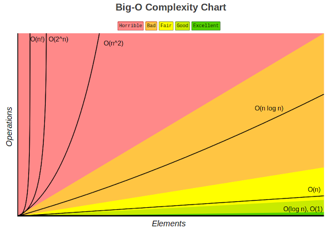

# Mundo Python <!-- omit in toc -->

Apuntes sobre pensamiento computacional con Python

## Tabla de Contenido<!-- omit in toc -->
- [Computo](#computo)
- [Python](#python)
  - [Elementos básicos](#elementos-b%c3%a1sicos)
  - [Asiganción de variables](#asiganci%c3%b3n-de-variables)
  - [Operaciones en cadenas](#operaciones-en-cadenas)
  - [Entrada de datos](#entrada-de-datos)
  - [Ramificación de programas](#ramificaci%c3%b3n-de-programas)
  - [Iteraciones](#iteraciones)
    - [Iterators](#iterators)
  - [Strings y String literals](#strings-y-string-literals)
    - [Accediendo a elementos](#accediendo-a-elementos)
    - [Slices](#slices)
    - [String Methods](#string-methods)
- [Programas númericos](#programas-n%c3%bamericos)
  - [Enumeración exhaustiva](#enumeraci%c3%b3n-exhaustiva)
  - [Aproximación de soluciones](#aproximaci%c3%b3n-de-soluciones)
  - [Búsqueda binaria](#b%c3%basqueda-binaria)
  - [Representaciones de flotantes](#representaciones-de-flotantes)
- [Funciones, alcance y abstracción](#funciones-alcance-y-abstracci%c3%b3n)
- [Funciones](#funciones)
  - [Específicaciones de código](#espec%c3%adficaciones-de-c%c3%b3digo)
  - [Recursividad](#recursividad)
    - [Factorial](#factorial)
    - [Serie de fibbonachi](#serie-de-fibbonachi)
- [Tipos estructurados, mutabilidad y funciones de alto nivel](#tipos-estructurados-mutabilidad-y-funciones-de-alto-nivel)
  - [Tuplas](#tuplas)
  - [Rangos](#rangos)
  - [Listas y mutabilidad](#listas-y-mutabilidad)
    - [Clonación](#clonaci%c3%b3n)
  - [List comprehension](#list-comprehension)
  - [Funciones en Python](#funciones-en-python)
    - [Funciones de expresiones](#funciones-de-expresiones)
  - [Diccionarios](#diccionarios)
- [Pruebas y debugging](#pruebas-y-debugging)
  - [Pruebas de caja negra](#pruebas-de-caja-negra)
  - [Pruebas de caja de cristal](#pruebas-de-caja-de-cristal)
  - [Debugging](#debugging)
    - [Diseño de experimentos](#dise%c3%b1o-de-experimentos)
    - [Errores comúnes](#errores-com%c3%banes)
  - [Exepciones y afirmaciones](#exepciones-y-afirmaciones)
    - [Manejo de excepciones](#manejo-de-excepciones)
      - [Excepciones como control de flujo](#excepciones-como-control-de-flujo)
  - [Afirmaciones](#afirmaciones)
- [POO](#poo)
  - [Conceptos](#conceptos)
    - [Clases](#clases)
    - [Instancias](#instancias)
    - [Atributos de la instancia](#atributos-de-la-instancia)
    - [Métodos de instancia](#m%c3%a9todos-de-instancia)
  - [Tipos de datos abstractos](#tipos-de-datos-abstractos)
  - [Decomposición](#decomposici%c3%b3n)
  - [Abstracción](#abstracci%c3%b3n)
  - [Encapsulación](#encapsulaci%c3%b3n)
  - [Herencia](#herencia)
  - [Polimorfismo](#polimorfismo)
- [Complejidad algorítmica](#complejidad-algor%c3%adtmica)
  - [Aproximaciones](#aproximaciones)
  - [Notación asintotica / Big O Notation](#notaci%c3%b3n-asintotica--big-o-notation)
    - [Crecimiento asintótico](#crecimiento-asint%c3%b3tico)
    - [Clases de complejidad algorítmica](#clases-de-complejidad-algor%c3%adtmica)
- [Búsqueda y ordenamiento](#b%c3%basqueda-y-ordenamiento)
  - [Búsqueda lineal](#b%c3%basqueda-lineal)
  - [Búsqueda binaria](#b%c3%basqueda-binaria-1)
  - [Ordenamiento burbuja](#ordenamiento-burbuja)
  - [Ordenamiento por inserción](#ordenamiento-por-inserci%c3%b3n)
- [Ambientes virtuales](#ambientes-virtuales)
  - [Pip](#pip)
- [Graficado](#graficado)
  - [Gráficado simple](#gr%c3%a1ficado-simple)
- [Optimización](#optimizaci%c3%b3n)
- [El problema del morral](#el-problema-del-morral)

# Computo
* Conocimiento declarativo
  * Formula matemática
* Conocimiento imperativo
  * Cómo llegar a un resultado
  * Algoritmos (Lista finita de instrucciones de describen un computo que se ejecuta con ciertas entradas y ejecuta pasos intermedios para llegar a un resultado)
  * Lenguajes de programación
    * Sintaxis (Secuencia de símbolos bien formada)
    * Semántica estática (Define que enunciados con sintaxis correcta tiene significado)
    * Semantica (Define el significado. Sólo hay un significado)
    * Alto nivel o bajo nivel
    * General o de dominio específico
    * Interpretado o compilado

# Python
## Elementos básicos
* Literales
* Operadores
* Objetos
* Tipos de dato
* Escalares vs no escalares

  ```python
  a = 2
  ```

## Asiganción de variables
Operador de asignación (=)

```python
base = 2
altura = 4
area = (base * altura) / 2
```

Las variables deben tener nombres que signifiquen algo para los humanos

## Operaciones en cadenas
```python
* y +
# Formato de cadenas
f'{"Hip "*3} hurra'
# Acceso
my_str = 'Hola'
len(my_str)
my_str[0]
# Las últimas 2
my_str[2:]
# Primeras 3
my_str[3:]
# Sin las últimas 2
my_str[:-2]
# Saltando de dos en dos
my_str[::2]
# Cadenas
'Hola' + ' mundo'
f'{my_str} mundo' * 100
```

Crear una operación de forma eficiente con una computadora

## Entrada de datos
```python
numero = input('Escribe un número: ')
type(numero)
numero = int(input('Escribe un número: '))
```

## Ramificación de programas
```python
if <condicion>:
  <expresion> :
elif <condicion>:
  <expresion>
else:
  <expresion>
```

## Iteraciones
```python
contador = 0

while contador < 10:
    print(contador)
    contador += 1
    if(contador == 3):
        break

frutas = ['manzana', 'pera', 'mango']
for fruta in frutas:
        print(fruta)

# iterables
iter('cadena') # cadena
iter(['a', 'b', 'c']) # lista
iter(('a', 'b', 'c')) # tupla
iter({'a', 'b', 'c'}) # conjunto
iter({'a': 1, 'b': 2, 'c': 3}) # diccionario
```

Todas las llamadas anteriores regresan un objeto de tipo iterator.

### Iterators
Un iterator es un objeto que regresa sucesivamente los valores asociados con
el iterable.

```python
frutas = ['manzana', 'pera', 'mango']
iterador = iter(frutas)
next(iterador)
next(iterador)
next(iterador)
```

## Strings y String literals
Son cadenas con funciones especiales, una cadena es inmutable
```python
mystr1 = 'cadena'
mystr2 = "cadena"
mystr3 = """
esto es un texto con varias
lineas
en el código

"""
```

### Accediendo a elementos
```python
mystr1[1]
```

### Slices
Permite jugar con rangos, el tercer campo es para saltos, y también puede indicar que sea todo al revés
```python
mystr1[1:5]
```

Longitud
```python
len(mystr1)
```

### String Methods
Strip limpia de caracteres
```python
mystr1.strip()
```

lower (es más sencilla) / casefold (forza todo a minuscula para cualquier idioma)
```python
mystr1.lower()
mystr1.casefold()
```

upper
```python
mystr1.upper()
```

capitalize (primera letra a mayuscula de la oración) / title (todas las palabras)

```python
mystr1.capitalize()
mystr1.title()
```

replace
```python
mystr1.replace('a','uo')
```

split parte con un separador
```python
mystr1.split(',')
```

center para uso en terminal, undica cuantos caracteres y rellena con un caracter
```python
mystr1.center(30,'-')
```

count cuenta apariciones de un caracter
```python
mystr1.count('l')
```

endswith / startwith
```python
mystr1.endswith('ld')
mystr1.startwith('ld')
```

find / index
-1 indica que no encontro el substring con index falla
```python
mystr1.find('a')
mystr1.index('a')
```

isMethods()
retorna verdadero o falso
```python
mystr1.isalpha() # solo letras
mystr1.isnumeric()
mystr1.isidentifier()
mystr1.isspace()
mystr1.islower()
mystr1.isupper()
mystr1.istitle()
```

join
es el opuesto a split
```python
separator = ' '
mylist = ['1','2','3']
print(mylist)

ex = separator.join(mylist)
print(ex)
```

# Programas númericos
## Enumeración exhaustiva
Prueba todas las posibilidades hasta que encuentres la respuesta para la mayoria de los casos el rendimiento no es importante, las computadoras son muy rápidas

```python
objetivo = int(input('Escoge un entero'))
respuesta = 0

while respuesta**2 < objetivo:
    respuesta += 1

if respuesta**2 == objetivo :
    print(f'La raíz cuadrada de {objetivo} es {respuesta}')
```

## Aproximación de soluciones
No se necesita una respuesta exacta
Podemos aproximar la solución con un margen de error que llamaremos epsilon

```python
objetivo = int(input('Escoge un número'))
epsilon = 0.01
paso = epsilon**2 # 0.0001
respuesta = 0.0

while abs(respuesta**2 - objetivo) >= epsilon and respuesta <= objetivo : 
    print(respuesta**2 - objetivo, respuesta)
    respuesta += paso

if abs(respuesta**2 - objetivo) >= epsilon:
    print(f'No se encontro la raíz cuadrada de {objetivo}')
else :
    print(f'La raíz cuadrada de {objetivo} es {respuesta}')
```

## Búsqueda binaria
Cuándo la respuesta se encuentra en un conjunto ordenado, se puede usar búsqueda binaria
Corta la operación en 2 en cada iteración, lo que lo hace bastante eficiente

## Representaciones de flotantes
[Problema Python para decimales](http://docs.python.org.ar/tutorial/3/floatingpoint.html)

# Funciones, alcance y abstracción
**Abstracción:** No se necesita saber como funciona algo para poder operarlo.
**Decomposición:** Dividir algo en componentes que colaboren con un fin común 

# Funciones 

```python
def suma(a,b):
    total = a + b
    print(total)
    return total

suma(2,2)
```

## Específicaciones de código

Documentar docstrings en el código

```python
def suma(a,b):
    """ Suma dos valores a y b.
    param int a cualquier entero
    param int b cualquier entero
    returns la sumatoria de a y b
    """
    total = a + b
    print(total)
    return total
```

Ver documentación:
```python
help(suma)
```

## Recursividad
Es una forma de crear soluciones con el principio de divide y venceras. Es una técnica mediante la cual una función es llamada a si misma

### Factorial

Todas las combinaciones posibles

<div align="center">
  
  <small><p>Factorial metemático</p></small>
</div>

```bash
n! = n * (n - 1)!

def factorial(n):
    """Calcula el factorial de n
    n int > 0
    return n!
    """

    if n == 1:
        return 1

    return n * factorial(n - 1)
```

Python restringe el número de veces que puede hacer recursividad, al momento de hacer este ejemplo permitió hasta el número 998

### Serie de fibbonachi

```python
def fibonacci(n):
    if n == 0 or n == 1:
      return 1
    a = fibonacci(n - 1) + fibonacci(n - 2)
    print(a)
    return a
```

# Tipos estructurados, mutabilidad y funciones de alto nivel

## Tuplas
* Son secuencias inmutables de objetos
* Pueden contener cualquier tipo de objeto
* Pueden devolver varios valores en una función

```python
my_tuple = (1, 'dos', True)
my_tuple[0]
my_tuple(1,)
my_other_tuple = (2, 3, 4)
my_tuple += my_other_tuple

x, y, z = my_other_tuple

def coordenadas():
  return(5, 4)

coordenada = coordenadas()
x, y = coordenadas()
```

## Rangos

* Representan una secuencia de enteros
* `range(comienzo,fin,pasos)`
* Son inmutables
* Eficientes en uso de memoria y utilizados en for loops

```python
my_range = range(1, 5)
for i in my_range:
  print(i)
my_range = range(0,7,2)
my_other_range = range(0,8,2)
my_range == my_other_range
id(my_range)
my_range is my_other_range
for i in range(0, 101, 2):
    print(i)
```

## Listas y mutabilidad
* Son secuencias de objetos, pero mutables
* Cuándo modificas unas lista, pueden existir efectos secundarios
* Es posible iterar con ellas
* Se pueden asignar via indice
* Utilizar métodos: append, pop, remove, insert

```python
my_list = [1,2,3]
my_list[0]
my_list.append(4)
my_list[0] = 'a'
my_list.pop()

for element in my_list:
 print(element)

a = [1,2,3]
b = a
id(a)
id(b)
c = [a , b]
a.append(5)
c
```

### Clonación
* Casi siempre es mejor clonar una lista en vez de mutarla
* Para ello podemos usar slices o la funcion list

```python
a = [1,2,3]
b = a
id(a)
id(b)
c = list(a)
d = a[::]
```

## List comprehension
* Forma concisa de aplicar operaciones a los valores de una secuencia
* También se pueden mostrar condiciones para filtrar

```python
my_list = list(range(100))
double = [i * 2 for i in my_list]
double
pares = [i for i in my_list if i % 2 == 0]
pares
```

## Funciones en Python
* Tienen un tipo
* Se pueden pasar como argumentos de otras funciones
* Se pueden utilizar en expresiones
* Se pueden incluir en estructuras de datos

### Funciones de expresiones
`lambda <vars> : <expresion>`

## Diccionarios
* Son como listas, pero en lugar de indices se utilizan mapas
* No tienen orden interno
* Son mutables 
* Pueden iterarse

```python
for element in dict.values():
  print(element)
for element in dict.items():
  print(element)

'David' in dict
'Tom' in dict
```

# Pruebas y debugging
## Pruebas de caja negra
* Se basan en la especificación de la función o el programa
* Prueba inputs y valida outputs
* Unit testing o integration testing

## Pruebas de caja de cristal
* Se basan en el flujo del programa
* Prueba todos los caminos posibles de una función: Ramificaciones, bucles for y while, recursión
* Regression testing o mocks

## Debugging
* No te molestes con el debugger. Aprende a utilizar el print statement.
* Estudia los datos disponibles
* Utiliza los datos para crear hipótesis y experimentos. Método científico
* Ten una mente abierta. Si entendieras el programa, probablemente no habrían buggs
* LLeva un registro de lo que has tratado, preferentemente en la forma de test

### Diseño de experimentos
* Debuggear es un proceso de búsqueda. Cada prueba debe acotar el espacio de busqueda
* Búsqueda binaria con print statements

### Errores comúnes
* Encuentra los sospechosos comunes
* En lugar de preguntarte por qué un programa no funciona preguntate por que está funcionando de está manera
* Es posible que el bug no se encuentre donde crees que está
* Explicale el problema a otra persona. De preferencia que no tenga contexto
* Lleva un registro de lo que has tratado, preferentemente en la forma de test
* Vete a dormir

## Exepciones y afirmaciones
Programación defensiva
* Son muy comunes en la programación. No tienen nada excepcional
* Se relacionan con errores de semántica
* Se pueden crear excepciones propias
* Cuándo una excepción no se maneja, el programa termina en error

### Manejo de excepciones
* Se manejan con ``try, except, finally``
* Se pueden utilizar también para ramificar programas
* No deben manejarse de manera silenciosa (con print statement)
* Para aventar tu propia excepción utiliza el keyword ``raise``

#### Excepciones como control de flujo
La razón de usarlo en lugar del if es por EAFP(easier to ask for forgiveness than permission)
Mientras que otros lenguajes utilizan LBYL(look before you leap)

```javascript
// Javascript
/*
* Paises es un objeto. Pais es la llave
* Código con el principio LBYL
*/

function buscaPais(paises, pais){
  if(!Object.keys(paises).includes(paises)){
    return null
  }
  return paises[pais];
}
```

## Afirmaciones
* Programación defensiva
* Pueden utilizarse pra verificar que los tipos sean correctos en una función
* Sirven para debuguear

# POO

La clave es pensar en objetos como agrupaciones de datos y los métodos que operan en dichos datos. Estos pueden tener **propiedades** y **comportamientos**.

La programación orientada a objetos nos permite modelar cosas reales y concretas del mundo y sus relaciones con otros objetos

## Conceptos

### Clases
* Sirven para definir cosas complejas
* Permiten organizar el código
* Sólo proveen estructura

### Instancias
Mientras que las clases proveen la estrucutra, las instancias son los objetos reales que creamos en nuestro programa: un hotel llamado Hilton

Otra forma de pensarlo es que las clases son como un formulario y una vez que se llena cada copia del formulario tenemos las instancias que pertenecen a cada clase. Cada copia puede tener datos distintos. Al igual que cada instancia es distinta a las demás

* Los atributos de clase nos permiten
  * Representar datos
  * Procedimientos para interactuar con los métodos
  * Esconder la representación interna
* Se accede a los atributos con la notación de punto
* Puede tener atributos privados. Por convención comienza con _

```python
class Hotel
  pass
```

Una vez teniendo la clase, podemos generar una instancia llamando al constructor de la clase
```python
hotel = Hotel()
```

### Atributos de la instancia
Todas las clases crean objetos y todos los objetos tienen atributos. Se usa el método especial ``__init__`` para definir el estado inicial de la instancia. Recibe como primer parametro obligatorio ``self`` (es simplemente una referencia a la instancia)

```python
class Hotel:
  def __init__(self, numero_maximo_de_huespedes, lugares_de_estacionamiento):
    self.numero_maximo_de_huespedes = numero_maximo_de_huespedes
    self.lugares_de_estacionamiento = lugares_de_estacionamiento
    self.huespedes = 0

hotel = Hotel(numero_maximo_de_huespedes=50, lugares_de_estacionamiento=20)

print(hotel.lugares_de_estacionamiento)
```

### Métodos de instancia
Mientras que los atributos de la instancia describen lo que representa el objeto, los métodos de instancia nos indican que podemos hacer con las instancias de dicha clase y normalmente operan en los mencionados atributos.

Los métodos son equivalentes a funciones dentro de la definición de la clase, pero todos reciben ``self`` como primer argumento

## Tipos de datos abstractos
* Todo es un objeto en Python y tiene un tipo
  * Representan datos y formas de interactuar con ellos

* Formas de interactuar con un objeto
  * Creación
  * Manipulación
  * Destrucción

* Ventajas
  * Decomposición
  * Abstracción
  * Encapsulación 

## Decomposición
* Partir un problema en problemas más pequeños
* Las clases permiten crear mayores abstracciones en forma de componentes
* Cada clase se encarga de una parte del problema y el programa se vuelve más fácil de mantener

## Abstracción
* Enfocarnos en la información relevante
* Separar la información central de los detalles
* Podemos utilizar variables y métodos (privados o públicos)

## Encapsulación
* Permite agrupar datos y su comportamiento
* Controlar el acceso a dichos datos
* Previene modificaciones no autorizadas

## Herencia
* Permite modelar **jerarquias de clases (Arbol)**
* Permite compartir comportamiento común
* Al padre se le conoce como Superclase y al hijo como SubClase

## Polimorfismo
* Habilidad de tomar varias formas
* Nos permite cambiar el comportamiento de una superclase para adaptarlo a la subclase

# Complejidad algorítmica
* Comparar algorítmos
* Complejidad temporal (Cuánto se tarda) vs complejidad espacial (Cuánto espacio necesita)
* Podemos definirla como T(n)

## Aproximaciones
* Conometrar el tiempo que corre un algoritmo
* Contar con los pasos con una medida abstracta de operación
* Contar los pasos conforme nos aproximamos al infinito **Forma estándar**

Se pueden generar ecuaciones matemáticas para evaluar el rendimiento por medio de la estructura del algorítmo
```python
1002 + x + 2x**
```

## Notación asintotica / Big O Notation
### Crecimiento asintótico
* No importan variaciones pequeñas
* El enfoque se centra en lo que pasa conforme el tamaño del problema se acerca a infinito
* Mejor de los caso, promedio, peor de los casos
* Big O
* Nada más importa el término de mayor tamaño

### Clases de complejidad algorítmica
* O(1) Constante
* O(n) Lineal
* O(log n) Logaritmica
* O(n log n) log lineal
* O(n**2) Polinomial
* O(2**n) Exponencial

<div align="center">
  
  <small><p>Big O</p></small>
</div>

# Búsqueda y ordenamiento
## Búsqueda lineal
* Busca en todos los elementos de manera secuencial
* ¿Cuál es el peor caso?


## Búsqueda binaria
Asume que la lista está ordenada
* Divide y conquista
* El problema se divide en 2 en cada iteración
* ¿Cuál es el peor caso?
* Funciona en listas ordenadas
* Intercambia tiempo por espacio, guarda la lista ordenada en disco

## Ordenamiento burbuja
Es un algoritmo que recorre repetidamente una lista que necesita ordenarse. Compara sus elementos adyacentes y los intercambia si están en el orden incorrecto. Este es un procedimiento que se repite hasta que no se requieren más intercambios, lo que indica que la lista se encuentra ordenada

## Ordenamiento por inserción
El ordenamiento por inserción es uno de los algoritmos más comunes que estudian
los Científicos del Cómputo. Es intuitivo y fácil de implementar, pero es muy
ineficiente para listas de gran tamaño.

Una de las características del ordenamiento por inserción es que ordena en “su
lugar.” Es decir, no requiere memoria adicional para realizar el ordenamiento
ya que simplemente modifican los valores en memoria.

# Ambientes virtuales
* Permiten aislar el ambiente para poder instalar diversas versiones de paquetes
* A partir de Python 3 se incluye en la libreria estandar en el modulo venv
* Ningún ingeniero profesional de Python trabaja sin ellos

## Pip
* Permite descargar paquetes de terceros para utilizar en nuestro programa
* Permite compartir nuestros paquetes con terceros
* Permite especificar la version del paquete que necesitamos

```bash
python -m venv env
cd env
cd Scripts
activate.bat
pip install bokeh
pip freeze
deactivate
python3 freeze
```

# Graficado
* Reconocimiento de patrones
* Predicción de una serie
* Simplifica la interpretación y las conclusiones acerca de los datos

## Gráficado simple
* Bokeh permite construir gráficas complejas de manera rápida con comando simples
* Permite exportar a varios formatos como html, notebooks, imagenes
* Bokeh se puede utilizar en el servidor con Flask y Django

[Documentación de Bokeh](https://docs.bokeh.org/en/latest/index.html)

# Optimización
* Permite resolver muchos problemas de manera computacional
* Una función objetivo que debemos maximizar o minimizar, el input que nos da el resultado más alto y bajo
* Una serie de limitantes que debemos respetar, po ejemplo algunas reglas de negocio

> “P versus NP” es algo más que un rompecabezas matemático abstracto. Su objetivo es determinar —de una vez por todas— qué tipo de problemas se pueden resolver con ordenadores, y cuáles no. 
> 
> Los problemas de clase “P” son “fáciles” de resolver para los ordenadores; es decir, las soluciones a estos problemas pueden ser calculadas en una cantidad razonable de tiempo, en comparación con la complejidad del problema.

[Problema P vs NP](https://www.youtube.com/watch?v=UR2oDYZ-Sao)

# El problema del morral
Obtener el mayor valor en una mochila