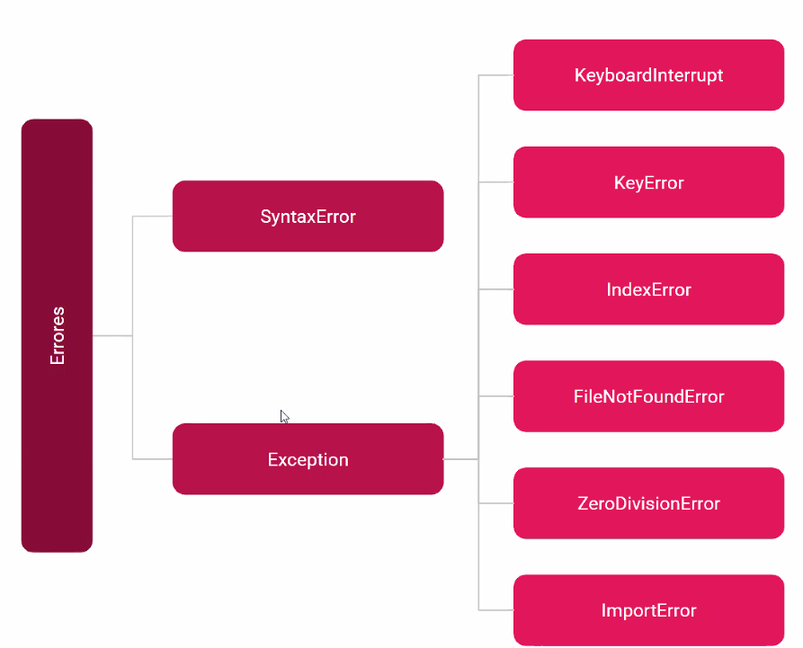

# Mundo Python <!-- omit in toc -->

Apuntes con Python

# Python Projects

Proyectos realizados con Python

[CRUD CLI](https://github.com/eocode/Python-Clients-CLI)

## Tabla de Contenido<!-- omit in toc -->
- [Python Projects](#python-projects)
- [Pensamiento Computacional](#pensamiento-computacional)
- [Python](#python)
  - [Aplicaciones de Python](#aplicaciones-de-python)
    - [Ciencias](#ciencias)
    - [CLI](#cli)
    - [Aplicaciones web](#aplicaciones-web)
  - [Paradigmas de programación](#paradigmas-de-programaci%c3%b3n)
    - [Programación estructurada:](#programaci%c3%b3n-estructurada)
    - [Programación por procedimientos](#programaci%c3%b3n-por-procedimientos)
      - [Programación funcional](#programaci%c3%b3n-funcional)
    - [Programación orientada a objetos](#programaci%c3%b3n-orientada-a-objetos)
  - [El Zen de Python](#el-zen-de-python)
  - [Elementos básicos](#elementos-b%c3%a1sicos)
  - [Variables y expresiones](#variables-y-expresiones)
    - [Reglas de Variables:](#reglas-de-variables)
    - [Palabras reservadas](#palabras-reservadas)
    - [Prioridad de operadores PEMDAS](#prioridad-de-operadores-pemdas)
  - [Asiganción de variables](#asiganci%c3%b3n-de-variables)
  - [Operaciones en cadenas](#operaciones-en-cadenas)
  - [Entrada de datos](#entrada-de-datos)
  - [Ramificación de programas](#ramificaci%c3%b3n-de-programas)
  - [Iteraciones](#iteraciones)
    - [Iterators](#iterators)
    - [Generators](#generators)
  - [Ayuda de Python](#ayuda-de-python)
  - [Con variables](#con-variables)
  - [Con funciones](#con-funciones)
  - [Strings y String literals](#strings-y-string-literals)
    - [Accediendo a elementos](#accediendo-a-elementos)
    - [Slices](#slices)
    - [String Methods](#string-methods)
  - [ASCII vs Unicode](#ascii-vs-unicode)
- [Programas númericos](#programas-n%c3%bamericos)
  - [Enumeración exhaustiva](#enumeraci%c3%b3n-exhaustiva)
  - [Aproximación de soluciones](#aproximaci%c3%b3n-de-soluciones)
  - [Búsqueda binaria](#b%c3%basqueda-binaria)
  - [Representaciones de flotantes](#representaciones-de-flotantes)
- [Funciones, alcance y abstracción](#funciones-alcance-y-abstracci%c3%b3n)
  - [Funciones](#funciones)
    - [Funciones anonimas (Lamdas)](#funciones-anonimas-lamdas)
    - [Funciones en Python](#funciones-en-python)
      - [Función de ordenamiento](#funci%c3%b3n-de-ordenamiento)
    - [Argumentos dinámicos](#argumentos-din%c3%a1micos)
    - [Específicaciones de código](#espec%c3%adficaciones-de-c%c3%b3digo)
    - [Recursividad](#recursividad)
      - [Factorial](#factorial)
      - [Serie de fibbonachi](#serie-de-fibbonachi)
- [Tipos estructurados, mutabilidad y funciones de alto nivel](#tipos-estructurados-mutabilidad-y-funciones-de-alto-nivel)
  - [Tuplas](#tuplas)
  - [Rangos](#rangos)
- [Estructuras de datos](#estructuras-de-datos)
  - [Listas y mutabilidad](#listas-y-mutabilidad)
    - [Copiar una lista](#copiar-una-lista)
    - [Operaciones con listas](#operaciones-con-listas)
    - [Listas con slices](#listas-con-slices)
    - [Modificacion de listas](#modificacion-de-listas)
    - [Clonación](#clonaci%c3%b3n)
  - [Sets o conjuntos](#sets-o-conjuntos)
    - [Operaciones con sets](#operaciones-con-sets)
  - [Diccionarios](#diccionarios)
    - [Iteración de diccionarios](#iteraci%c3%b3n-de-diccionarios)
  - [Comprehensions](#comprehensions)
    - [List comprehension](#list-comprehension)
    - [Dictionary comprehensions](#dictionary-comprehensions)
    - [Set comprehensions](#set-comprehensions)
  - [Collections](#collections)
    - [Contadores](#contadores)
  - [Otros usos](#otros-usos)
    - [Diccionarios ordenados](#diccionarios-ordenados)
    - [Tuplas con nombre](#tuplas-con-nombre)
- [Pruebas y debugging](#pruebas-y-debugging)
  - [Pruebas de caja negra](#pruebas-de-caja-negra)
  - [Pruebas de caja de cristal](#pruebas-de-caja-de-cristal)
  - [Debugging](#debugging)
    - [Diseño de experimentos](#dise%c3%b1o-de-experimentos)
    - [Errores comúnes](#errores-com%c3%banes)
- [Exepciones y afirmaciones](#exepciones-y-afirmaciones)
  - [Manejo de excepciones](#manejo-de-excepciones)
  - [Generación de errores propios](#generaci%c3%b3n-de-errores-propios)
    - [Excepciones como control de flujo](#excepciones-como-control-de-flujo)
  - [Jerarquía de errores](#jerarqu%c3%ada-de-errores)
  - [Afirmaciones](#afirmaciones)
- [POO](#poo)
  - [Identificadores](#identificadores)
  - [Namespaces y Scope](#namespaces-y-scope)
  - [Conceptos](#conceptos)
    - [Clases](#clases)
    - [Instancias](#instancias)
    - [Atributos de la instancia](#atributos-de-la-instancia)
    - [Métodos de instancia](#m%c3%a9todos-de-instancia)
  - [Tipos de datos abstractos](#tipos-de-datos-abstractos)
  - [Decomposición](#decomposici%c3%b3n)
  - [Abstracción](#abstracci%c3%b3n)
  - [Encapsulación](#encapsulaci%c3%b3n)
  - [Herencia](#herencia)
  - [Polimorfismo](#polimorfismo)
- [Context managers](#context-managers)
- [Decoradores](#decoradores)
  - [Framework CLick](#framework-click)
- [Librerias interesantes](#librerias-interesantes)
  - [Turtle](#turtle)
- [Complejidad algorítmica](#complejidad-algor%c3%adtmica)
  - [Aproximaciones](#aproximaciones)
  - [Notación asintotica / Big O Notation](#notaci%c3%b3n-asintotica--big-o-notation)
    - [Crecimiento asintótico](#crecimiento-asint%c3%b3tico)
    - [Clases de complejidad algorítmica](#clases-de-complejidad-algor%c3%adtmica)
- [Búsqueda y ordenamiento](#b%c3%basqueda-y-ordenamiento)
  - [Búsqueda lineal](#b%c3%basqueda-lineal)
  - [Búsqueda binaria](#b%c3%basqueda-binaria-1)
  - [Ordenamiento burbuja](#ordenamiento-burbuja)
  - [Ordenamiento por inserción](#ordenamiento-por-inserci%c3%b3n)
- [Ambientes virtuales](#ambientes-virtuales)
  - [Pip](#pip)
    - [Archivo de dependencias](#archivo-de-dependencias)
- [Manejo de archivos con Python](#manejo-de-archivos-con-python)
  - [Context Managers](#context-managers-1)
  - [Módulo CSV](#m%c3%b3dulo-csv)
- [Graficado](#graficado)
  - [Gráficado simple](#gr%c3%a1ficado-simple)
- [Optimización](#optimizaci%c3%b3n)
  - [El problema del morral](#el-problema-del-morral)
- [Programación dinámica y estocástica](#programaci%c3%b3n-din%c3%a1mica-y-estoc%c3%a1stica)
  - [Programación dinámica](#programaci%c3%b3n-din%c3%a1mica)
    - [La optimizacion se basa en la memorizacion](#la-optimizacion-se-basa-en-la-memorizacion)
    - [Fibonacci](#fibonacci)

# Pensamiento Computacional
* Conocimiento declarativo
  * Formula matemática
* Conocimiento imperativo
  * Cómo llegar a un resultado
  * Algoritmos (Lista finita de instrucciones de describen un computo que se ejecuta con ciertas entradas y ejecuta pasos intermedios para llegar a un resultado)
  * Lenguajes de programación
    * Sintaxis (Secuencia de símbolos bien formada)
    * Semántica estática (Define que enunciados con sintaxis correcta tiene significado)
    * Semantica (Define el significado. Sólo hay un significado)
    * Alto nivel o bajo nivel
    * General o de dominio específico
    * Interpretado o compilado

# Python

## Aplicaciones de Python
### Ciencias
* Astropy
* Biopython
* Sympy
* Numpy
* Pandas
* Matplotlib
* Scipy
* Sunpy
* Tomopy

### CLI
* aws
* gcloud
* rebound
* geeknote

### Aplicaciones web
* Django
* Flask
* Bottle
* Chalice
* Webapp2
* Gunicorn
* Tornado

## Paradigmas de programación

### Programación estructurada: 
> Es un paradigma de programación **orientado a mejorar la claridad, calidad y tiempo de desarrollo** de un programa de computadora recurriendo únicamente a subrutinas y tres estructuras básicas: secuencia, selección (if y switch) e iteración (bucles for y while)

### Programación por procedimientos

> La programación procedimental o programación por procedimientos es un paradigma de la programación. Muchas veces es aplicable tanto en lenguajes de programación de bajo nivel como en lenguajes de alto nivel. En el caso de que esta técnica se aplique en lenguajes de alto nivel, recibirá el nombre de programación funcional. Esta técnica consiste en basarse de un número muy bajo de expresiones repetidas, englobarlas todas en un procedimiento o función y llamarlo cada vez que tenga que ejecutarse.

#### Programación funcional
> Es un paradigma de **programación declarativa** basado en el uso de **funciones matemáticas**, en contraste con la programación imperativa, que enfatiza los cambios de estado mediante la mutación de variables.

### Programación orientada a objetos

> Es un paradigma de programación que **usa objetos y sus interacciones**, para diseñar aplicaciones y programas informáticos. Está basado en varias técnicas, incluyendo herencia, abstracción, polimorfismo y encapsulamiento.
> 
> Los objetos manipulan los datos de entrada para la obtención de datos de salida específicos, donde cada objeto ofrece una funcionalidad especial.

## El Zen de Python
* Hermoso es mejor que feo.
* Explícito es mejor que implícito.
* Simple es mejor que complejo.
* Complejo es mejor que complicado.
* Sencillo es mejor que anidado.
* Escaso es mejor que denso.
* La legibilidad cuenta.
* Los casos especiales no son lo suficientemente * Especiales para romper las reglas.
* Lo práctico le gana a la pureza.
* Los errores no debe pasar en silencio.
* A menos que sean silenciados.
* En cara a la ambigüedad, rechazar la tentación de adivinar.
* Debe haber una - y preferiblemente sólo una - manera obvia de hacerlo.
* Aunque esa manera puede no ser obvia en un primer momento a menos que seas holandés.
* Ahora es mejor que nunca.
* Aunque “nunca” es a menudo mejor que “ahora mismo”.
* Si la aplicación es difícil de explicar, es una mala idea.
* Si la aplicación es fácil de explicar, puede ser una buena idea.
* Los espacios de nombres son una gran idea ¡hay que hacer más de eso!

## Elementos básicos
* Literales
* Operadores
* Objetos
* Tipos de dato
* Escalares vs no escalares

  ```python
  a = 2
  ```

## Variables y expresiones

### Reglas de Variables:
* Pueden contener números y letras
* Pueden reasignarse cuantas veces se necesite
* No pueden comenzar con numeros
* No se pueden utilizar las palabras reservadas de Python como variable.
* Se utiliza snake_case (guión bajo) para dividir las * palabras de las variables multipalabra

Expresiones son instrucciones para el interprete para evaluar la expresión. Los enunciados tienen efectos dentro del programa, como print que genera un output.

### Palabras reservadas

| and | del | for | is | raise | assert |
| if | else | elif | from | lambda | return |
| break | global | not | try | class | except |
| or | while | continue | exec | import | yield |
| def | finally | in | print |

**CONSTANTES:** Una variable toda en mayuscula no debería de modificarse

**_privada: Single Leading Underscore:** ` _var : una variable que empieza con guion bajo ( “_” )` se deberá tratar como _privada y no se deberá de acceder fuera de la clase

``__importante: Double Leading Underscore:__`` variables que empiezan con doble guion bajo ( “__”) son variables importantes, si se llegara a modificar es provable que se pierda estabilidad del programa, así que mejor no tocarla mucho

**var_: Single Trailing Underscore:** var_: A veces, el nombre más apropiado para una variable lo toma una palabra clave. Por lo tanto, los nombres como class o def no se pueden usar como nombres de variables en Python. 

En este caso, puede agregar un solo guión bajo ("_") para romper el conflicto de nombres:
__main__: Double Leading and Trailing Underscore: __var__: 

Las variables rodeadas por un prefijo de subrayado doble y un postfix quedan reservadas por el intérprete de Python.

### Prioridad de operadores PEMDAS
* Parentesis
* Exponenciales
* Multiplicación
* División
* Adición
* Substracción

## Asiganción de variables
Operador de asignación (=)

```python
base = 2
altura = 4
area = (base * altura) / 2
```

Las variables deben tener nombres que signifiquen algo para los humanos

## Operaciones en cadenas
```python
* y +
# Formato de cadenas
f'{"Hip "*3} hurra'
# Acceso
my_str = 'Hola'
len(my_str)
my_str[0]
# Las últimas 2
my_str[2:]
# Primeras 3
my_str[3:]
# Sin las últimas 2
my_str[:-2]
# Saltando de dos en dos
my_str[::2]
# Cadenas
'Hola' + ' mundo'
f'{my_str} mundo' * 100
```

Crear una operación de forma eficiente con una computadora

## Entrada de datos
```python
numero = input('Escribe un número: ')
type(numero)
numero = int(input('Escribe un número: '))
```

## Ramificación de programas
```python
if <condicion>:
  <expresion> :
elif <condicion>:
  <expresion>
else:
  <expresion>
```

## Iteraciones
```python
contador = 0

while contador < 10:
    print(contador)
    contador += 1
    if(contador == 3):
        break

frutas = ['manzana', 'pera', 'mango']
for fruta in frutas:
        print(fruta)

# iterables
iter('cadena') # cadena
iter(['a', 'b', 'c']) # lista
iter(('a', 'b', 'c')) # tupla
iter({'a', 'b', 'c'}) # conjunto
iter({'a': 1, 'b': 2, 'c': 3}) # diccionario
```

Todas las llamadas anteriores regresan un objeto de tipo iterator.

### Iterators
Un iterator es un objeto que regresa sucesivamente los valores asociados con
el iterable.

Un iterador es por ejemplo
```python
for i in range(10):
  print(i)
```

```python
frutas = ['manzana', 'pera', 'mango']
iterador = iter(frutas)
next(iterador)
next(iterador)
next(iterador)
```

### Generators
Son una forma rápida de crear iterables sin la necesidad de declarar una clase que implemente el protocolo de iteración. Para crear un generator simplemente declaramos una función y utilizamos el keyword **yield** en vez de return para regresar el siguiente valor en una iteración.

Es importante recalcar que una vez se ha agotado un generator ya no podemos utilizarlo y debemos crear una nueva instancia

```python
def fibonacci(max):
  a, b = 0, 1
  while a < max:
    yield  a
    a, b = b, a+b

fib1 = fibonacci(20)
fib_nums = [num for num in fib1]
double_fib_nums = [num * 2 for num in fib1]
double_fib_nums = [num * 2 for num in fibonacci(30)]
```

## Ayuda de Python

## Con variables
Para ver que podemos hacer con un String, basta con poner:

Ejemplo:

`a = 'Hola'`
`dir(a)`

## Con funciones
Para ver la documentación
`help(len)`

Para tus propias funciones usa docstring

```python
def m():
  """Este es un texto de ayuda para la función"""
  pass
```

## Strings y String literals

Son cadenas con funciones especiales, una cadena es inmutable
```python
mystr1 = 'cadena'
mystr2 = "cadena"
mystr3 = """
esto es un texto con varias
lineas
en el código

"""
```

### Accediendo a elementos
```python
mystr1[1]
```

### Slices
Permite jugar con rangos, el tercer campo es para saltos, y también puede indicar que sea todo al revés
```python
mystr1[1]
mystr1[1:]
mystr1[1:3]
mystr1[1:6:2]
mystr1[::-1]
```

Longitud
```python
len(mystr1)
```

### String Methods
Strip limpia de caracteres
```python
mystr1.strip()
```

lower (es más sencilla) / casefold (forza todo a minuscula para cualquier idioma)
```python
mystr1.lower()
mystr1.casefold()
```

upper
```python
mystr1.upper()
```

capitalize (primera letra a mayuscula de la oración) / title (todas las palabras)

```python
mystr1.capitalize()
mystr1.title()
```

replace
```python
mystr1.replace('a','uo')
```

split parte con un separador
```python
mystr1.split(',')
```

center para uso en terminal, undica cuantos caracteres y rellena con un caracter
```python
mystr1.center(30,'-')
```

count cuenta apariciones de un caracter
```python
mystr1.count('l')
```

endswith / startwith
```python
mystr1.endswith('ld')
mystr1.startwith('ld')
```

find / index
-1 indica que no encontro el substring con index falla
```python
mystr1.find('a')
mystr1.index('a')
```

isMethods()
retorna verdadero o falso
```python
mystr1.isalpha() # solo letras
mystr1.isnumeric()
mystr1.isidentifier()
mystr1.isspace()
mystr1.islower()
mystr1.isupper()
mystr1.istitle()
```

join
es el opuesto a split
```python
separator = ' '
mylist = ['1','2','3']
print(mylist)

ex = separator.join(mylist)
print(ex)
```

## ASCII vs Unicode
* Ambos son codificadores de caracteres
* ASCII (American Standart Code for Information Interchange) toma en cuenta solamente el lenguaje inglés
* UNICODE incluye la mayoria de alfabetos del mundo

Python 3 por defecto usa Unicode

# Programas númericos
## Enumeración exhaustiva
Prueba todas las posibilidades hasta que encuentres la respuesta para la mayoria de los casos el rendimiento no es importante, las computadoras son muy rápidas

```python
objetivo = int(input('Escoge un entero'))
respuesta = 0

while respuesta**2 < objetivo:
    respuesta += 1

if respuesta**2 == objetivo :
    print(f'La raíz cuadrada de {objetivo} es {respuesta}')
```

## Aproximación de soluciones
No se necesita una respuesta exacta
Podemos aproximar la solución con un margen de error que llamaremos epsilon

```python
objetivo = int(input('Escoge un número'))
epsilon = 0.01
paso = epsilon**2 # 0.0001
respuesta = 0.0

while abs(respuesta**2 - objetivo) >= epsilon and respuesta <= objetivo : 
    print(respuesta**2 - objetivo, respuesta)
    respuesta += paso

if abs(respuesta**2 - objetivo) >= epsilon:
    print(f'No se encontro la raíz cuadrada de {objetivo}')
else :
    print(f'La raíz cuadrada de {objetivo} es {respuesta}')
```

## Búsqueda binaria
Cuándo la respuesta se encuentra en un conjunto ordenado, se puede usar búsqueda binaria
Corta la operación en 2 en cada iteración, lo que lo hace bastante eficiente

## Representaciones de flotantes
[Problema Python para decimales](http://docs.python.org.ar/tutorial/3/floatingpoint.html)

# Funciones, alcance y abstracción
**Abstracción:** No se necesita saber como funciona algo para poder operarlo.
**Decomposición:** Dividir algo en componentes que colaboren con un fin común 

## Funciones 

* Tienen un tipo
* Se pueden pasar como argumentos de otras funciones
* Se pueden utilizar en expresiones
* Se pueden incluir en estructuras de datos

```python
def suma(a,b):
    total = a + b
    print(total)
    return total

suma(2,2)
```

### Funciones anonimas (Lamdas)
`lambda <vars> : <expresion>`

Son funciones de una única instrucción de código, en una única línea.

```python
def mifuncion(nombre):
  return "Hola %s!" % nombre
```

```python
mifuncion = lambda nombre: "Hola %s!" % nombre
```

### Funciones en Python

<div align="center">
  
  <small><p>Funciones nativas en Python</p></small>
</div>

#### Función de ordenamiento
Devuelve una lista sin modificar la original
`sorted()`
Modifica la lista
`lista.sort()`

### Argumentos dinámicos

Se pueden pasar argumentos dinámicos a las funciones para evitar crear varias funciones de un mismo tipo

```python
def suma2(n, n2):
    return n + n2

def suma3(n, n2, n3):
    return n + n2 + n3

def suma4(valor_uno):
    print(valor_uno)

suma4(valor_uno=4)
```

* ***args:** n valores -> tuplas
* ****kwargs:** n valores -> diccionarios1

```python
# Crea una tupla
def sumadinamica(*argumento):
    print(argumento)
    print(type(argumento))

def sumadinamica2(*args):
    resultado = 0
    for valor in args:
        resultado += valor
    return resultado

# Crea un diccionario
def sumadinamica3(**kwargs):
    valor = kwargs.get('valor','No contiene el valor')
    print(valor)

resultado = sumadinamica3(valor='Eduardo', x=2, y=9, z=True)
print(resultado)
```

### Específicaciones de código

Documentar docstrings en el código

```python
def suma(a,b):
    """ Suma dos valores a y b.
    param int a cualquier entero
    param int b cualquier entero
    returns la sumatoria de a y b
    """
    total = a + b
    print(total)
    return total
```

Ver documentación:
```python
help(suma)
```

### Recursividad
Es una forma de crear soluciones con el principio de divide y venceras. Es una técnica mediante la cual una función es llamada a si misma

#### Factorial

Todas las combinaciones posibles

<div align="center">
  
  <small><p>Factorial metemático</p></small>
</div>

```bash
n! = n * (n - 1)!

def factorial(n):
    """Calcula el factorial de n
    n int > 0
    return n!
    """

    if n == 1:
        return 1

    return n * factorial(n - 1)
```

Python restringe el número de veces que puede hacer recursividad, al momento de hacer este ejemplo permitió hasta el número 998

#### Serie de fibbonachi

```python
def fibonacci(n):
    if n == 0 or n == 1:
      return 1
    a = fibonacci(n - 1) + fibonacci(n - 2)
    print(a)
    return a
```

# Tipos estructurados, mutabilidad y funciones de alto nivel

## Tuplas
* Son secuencias inmutables de objetos
* Son secuencias de valores indexadas por enteros
* Se crean separando los valores por comas
  * Se encierran los valores por parentesis
* Pueden contener cualquier tipo de objeto
* ``Se pueden utilizar para devolver más de un valor en una función o crear estructuras de datos ligeras``
* También se puede usar la función `tuple`

```python
my_tuple = (1, 'dos', True)
my_tuple[0]
my_tuple(1,)
my_other_tuple = (2, 3, 4)
my_tuple += my_other_tuple

x, y, z = my_other_tuple

def coordenadas():
  return(5, 4)

coordenada = coordenadas()
x, y = coordenadas()

a = (1,2,3,1,1,1,2,3,4)
dir(a)
a.count(2)
a.count(1)
a.index(1)
a.index(3)
```

## Rangos

* Representan una secuencia de enteros
* `range(comienzo,fin,pasos)`
* Son inmutables
* Eficientes en uso de memoria y utilizados en for loops

```python
my_range = range(1, 5)
for i in my_range:
  print(i)
my_range = range(0,7,2)
my_other_range = range(0,8,2)
my_range == my_other_range
id(my_range)
my_range is my_other_range
for i in range(0, 101, 2):
    print(i)
```

# Estructuras de datos
Nos permiten agrupar de distintas maneras varios valores y elementos para poderlos manipular con mayor facilidad

## Listas y mutabilidad

* Son secuencias de objetos, pero mutables
* Cuándo modificas unas lista, pueden existir efectos secundarios
* Es posible iterar con ellas
* Se pueden asignar via indice
* Utilizar métodos: append, pop, remove, insert

Se inician con `[]` o con la built-in function `list`

```python
my_list = [1,2,3]
my_list[0]
my_list.append(4)
my_list[0] = 'a'
my_list.pop()

for element in my_list:
 print(element)

a = [1,2,3]
b = a
id(a)
id(b)
c = [a , b]
a.append(5)
c
```

### Copiar una lista
```python
import copy
a = [1,2,3,4]
b = copy.copy(a)
a[0] = 0
a
b
```

### Operaciones con listas

```python
lista = ['a']
lista2 = lista * 10
lista2
```

Suma (+) Concatena dos o más listas:
```python
a=[1,2]
b=[3,4]
a + b --> [1,2,3,4]
```

Multiplicación (*) Repite la misma lista:

```python
a=[1,2]
a * 2 —> [1,2,1,2]
```

Añadir elemento al final de la lista:

```python
a=[1]
a.append(2)=[1,2]
```

Eliminar elemento al final de la lista:

```python
a=[1,2]
b=a.pop()
a=[1]
```

Eliminar elemento dado un indice:
```python
a=[1,2]
b=a.pop(1)
a=[2]
```

Ordenar lista de menor a mayor, esto modifica la lista inicial
```python
a=[3,8,1]
a.sort() —> [1,3,8]
```

Ordenar lista de menor a mayor, esto NO modifica la lista inicial
```python
a=[3,8,1]
a.sorted() —> [1,3,8]
```

Eliminar elementos de lista Elimina el elemento de la lista dado su indice
```python
a=[1,2,3]
del a[0] —> a[2,3]
```

Eliminar elementos de lista Elimina el elemento de la lista dado su valor
```python
a=[0, 2, 4, 6, 8]
a.remove(6)
a=[0, 2, 4, 8]
```

Range creacion de listas en un rango determinado
```python
a=(list(range(0,10,2))) -->crea un conteo desde 0 hasta 10 en pasos de 2 en 2.
a=[0,2,4,6,8]
```

Tamaño lista len Devuelve el valor del tamaño de la lista:
```python
a=[0,2,4,6,8]
len(a)=5
```

### Listas con slices
Al igual que con los strings las listas se pueden rebanar
```python
lista = [1,2,3,4,5,6]
lista[1:]
lista[1:3]
lista[1:6:2]
lista[::-1] 
```

### Modificacion de listas
```python
lista = ['juan','pedro','pepe']
lista[0] = 'laura'
lista.append('estela')
nombre = lista.pop()
nombre == 'estela'
```

### Clonación
* Casi siempre es mejor clonar una lista en vez de mutarla
* Para ello podemos usar slices o la funcion list

```python
a = [1,2,3]
b = a
id(a)
id(b)
c = list(a)
d = a[::]
```

## Sets o conjuntos
Son similares a las listas pero no permiten elementos repetidos
* (S) y (T), teoria de conjuntos
* Se inicializan con la función ``set``
* Para añadir elementos se usa ``add``
* Para eliminar se usa ``remove``

```python
a = set{[1,2,3]}
b = {3,4,5}
type(a)
type(b)
a.add(3)
a.add(20)
a.remove(20)
dir(a)
```

### Operaciones con sets
* Unión. Todos los elementos
* Intersección. Elementos en común
* Diferencia. Elementos que no se comparten

```python
s = set([1,2,3])
t = set([]3,4,5)
s.union(t)
s.intersection(t)
s.difference(t)
1 in s
1 not in s
```

Es mejor realizar operaciones con conjuntos que con listas

## Diccionarios
Son mapas de llaves a valores. Los valores pueden ser de cualquier tipo
* Se crean con llaves o con el keyword dict
* Se añaden elementos al diccionario señalando la llave y el valor
* Son como listas, pero en lugar de indices se utilizan mapas
* No tienen orden interno
* Son mutables 
* Pueden iterarse

```python
d = {}
d['llave'] = 'valor'
d.get('helado',None)
d.keys()
d.values()
d.items()
```

### Iteración de diccionarios
* Al iterar de forma predeterminada se obtienen las llaves
* Es posible iterar sobre los valores
* Se pueden obtener llaves y valores al mismo tiempo

```python
d = {}
d['primero'] = 'Hola'
d['segundo'] = 'adios'
d['primero']
for element in dict.keys():
  print(element)
for element in dict.values():
  print(element)
for element in dict.items():
  print(element)

'David' in dict
'Tom' in dict
```

## Comprehensions
Son constructors que nos permiten generar una secuencia a partir de otra secuencia

### List comprehension
* Forma concisa de aplicar operaciones a los valores de una secuencia
* También se pueden mostrar condiciones para filtrar
* Sintaxis más natural

`[element for element in element_list if condition]`

```python
pares = [x for x in range(100) if x % 2 == 0]

nones = [x for x in range(100) if x % 2 != 0]

cuadrados = {x: x**2 for x in range(100)}

my_list = list(range(100))
double = [i * 2 for i in my_list]
double

pares = [i for i in my_list if i % 2 == 0]
pares
```

### Dictionary comprehensions

`{key: element for element in element_list if condition}`

```python
student_uid = [1,2,3]
students = ['juan','pedro','jose']
students_with_uid = {uid: student for uid, student in zip(student_uid, students)}
```

### Set comprehensions

`{element for element in element_list if condition}`

```python
import random
random_numbers = []
for i in range(10):
  random_numbers.append(random.randint(1,3))

non_repeat = {number for number in random_numbers}
```

## Collections

El módulo collections nos proveé otros tipos o mejoras de las colecciones clásicas

### Contadores
 ```python
from collections import Counter
l = [1,2,3,4,1,2,3,1,2,1]
Counter(l)
Counter("palabra")
animales = "gato perro canario perro canario perro"
c = Counter(animales.split())
print(c.most_common(1)) # Primeros elementos más repetidos
print(c.most_common(2)) # Primeros dos elementos más repetidos
print(c.most_common())  # Ordenados por repeticiones

l = [10,20,30,40,10,20,30,10,20,10]
c = Counter(l)
print(c.items())
print(c.keys())
print(c.values())

print(sum(c.values()))

print(list(c))
print(dict(c))
print(set(c))
 ```

## Otros usos

### Diccionarios ordenados
La clase ``OrderedDict`` es otra subclase de diccionario, pero está vez con la capacidad de conservar el orden en que añadimos los registros

```python
from collections import OrderedDict
n = OrderedDict()
n['uno'] = 'one'
n['dos'] = 'two'
n['tres'] = 'three'
print(n)

# con diccionarios normales
n1 = {}
n1['uno'] = 'one'
n1['dos'] = 'two'
n2 = {}
n2['dos'] = 'two'
n2['uno'] = 'one'

print(n1 == n2) # Los elementos aparentemente están en el mismo orden

n1 = OrderedDict()
n1['uno'] = 'one'
n1['dos'] = 'two'
n2 = OrderedDict()
n2['dos'] = 'two'
n2['uno'] = 'one'

print(n1 == n2) # Los elementos aparentemente están en el mismo orden
```

### Tuplas con nombre

NamedTuple es utilizada para crear pequeñas estructuras inmutables parecidas a una clase y sus objetos, pero mucho más simples:

```python
from collections import namedtuple
Persona = namedtuple('Persona', ('nombre apellido edad'))
p = Persona(nombre='Hector', apellido='Costa', edad=27)
print(p)
# Son accesibles como objetos o por indices
print(p.nombre)
print(p.edad)
print(p[0])
print(p[-1])
```

```python
Coffee = collection.NamedTuple('Coffee', ('Size','Bean', 'Price'))
def get_coffee(cofee_type):
  if coffee_type == 'HouseBlend':
    return Coffee('large','premium',10)
```

```python
class SecretDict(collections.UserDict):
  def _password_is_valid(self, password):
    pass
  def _get_item(self, key):
    pass
  def __getitem__(self, key):
    password, key.split(':')
    if self._password_is_valid(password):
      return self._get_item(key)

    return None

my_secret_dict = SecretDict(...)
my_secret_dict['password:key']
```

# Pruebas y debugging
## Pruebas de caja negra
* Se basan en la especificación de la función o el programa
* Prueba inputs y valida outputs
* Unit testing o integration testing

## Pruebas de caja de cristal
* Se basan en el flujo del programa
* Prueba todos los caminos posibles de una función: Ramificaciones, bucles for y while, recursión
* Regression testing o mocks

## Debugging
* No te molestes con el debugger. Aprende a utilizar el print statement.
* Estudia los datos disponibles
* Utiliza los datos para crear hipótesis y experimentos. Método científico
* Ten una mente abierta. Si entendieras el programa, probablemente no habrían buggs
* LLeva un registro de lo que has tratado, preferentemente en la forma de test

### Diseño de experimentos
* Debuggear es un proceso de búsqueda. Cada prueba debe acotar el espacio de busqueda
* Búsqueda binaria con print statements

### Errores comúnes
* Encuentra los sospechosos comunes
* En lugar de preguntarte por qué un programa no funciona preguntate por que está funcionando de está manera
* Es posible que el bug no se encuentre donde crees que está
* Explicale el problema a otra persona. De preferencia que no tenga contexto
* Lleva un registro de lo que has tratado, preferentemente en la forma de test
* Vete a dormir

# Exepciones y afirmaciones


Programación defensiva
* Son muy comunes en la programación. No tienen nada excepcional
* Se relacionan con errores de semántica
* Se pueden crear excepciones propias
* Cuándo una excepción no se maneja, el programa termina en error

## Manejo de excepciones
* Cuando se avienta (**throw**) un error, si el error no se atrapa el programa se detiene
* Se manejan con ``try, except, else, finally``
* Se pueden utilizar también para ramificar programas
* No deben manejarse de manera silenciosa (con print statement)
* Para aventar tu propia excepción utiliza el keyword ``raise``

<div align="center">
  
  <small><p>Excepciones</p></small>
</div>

```python
def divide(numerador,denominador):
  if denominador == 0:
    raise ZeroDivisionError

try:
  airplane.takeoff()
except TakeOffError as error:
  airplane.land()
```

## Generación de errores propios

Necesitamos extender de BaseException

```python
class TakeOffError(BaseException):
  pass
```

### Excepciones como control de flujo
La razón de usarlo en lugar del if es por EAFP(easier to ask for forgiveness than permission)
Mientras que otros lenguajes utilizan LBYL(look before you leap)

```javascript
// Javascript
/*
* Paises es un objeto. Pais es la llave
* Código con el principio LBYL
*/

function buscaPais(paises, pais){
  if(!Object.keys(paises).includes(paises)){
    return null
  }
  return paises[pais];
}
```

## Jerarquía de errores

Python maneja una jerarquia de errores

https://docs.python.org/3.5/reference/compound_stmts.html#try

```python
try:
  # run this code
  pass
except:
  # execute this code when there is an exception
  pass
else:
  # no exceptions? Run this code
  pass
finally:
  # Always run this code
  pass
```

## Afirmaciones
* Programación defensiva
* Pueden utilizarse pra verificar que los tipos sean correctos en una función
* Sirven para debuguear

# POO

Otorga los medios para estructurar programas de tal manera que las propiedades y comportamientos esten envueltos en objetos individuales

La clave es pensar en objetos como agrupaciones de datos y los métodos que operan en dichos datos. Estos pueden tener **propiedades** y **comportamientos**.

La programación orientada a objetos nos permite modelar cosas reales y concretas del mundo y sus relaciones con otros objetos

Principios básicos:
* Encapsulación
* Abstracción
* Herencia
* Polimorfismo

<div align="center">
  
  <small><p>Resumen</p></small>
</div>

## Identificadores

Es la forma de acceder al objeto en memoria y el name es el nombre que se le da al objeto, ya sean variables o funciones

```python
my_var = 5
id(my_var)
id(5)
```

## Namespaces y Scope

Es un conjunto de names, existe una relación que liga los nombre definidos con sus respectivos objetos. Por ejemplo, existe un namespace especifico que agrupa todas las variables globales (por eso pueden utilizarse varias funciones sin tener que importar los modulos correspondientes), cada vez que declaramos un módulo o una función, dicho módulo o función tiene asignado otro namespace

> Scope es la parte del programa en el que podemos tener acceso a un namespace sin necesidad de prefijos

* Scope dentro de una funcion (con nombres locales)
* Scope del modulo (con nombres globales)
* Scope raíz (que tiene los built in names)

Python busca los objetos primero en el scope local, luego en el global y por último en el raíz

```python
def outer_function(some_local_name):
  def inner_function(other_local_name):
    # Tiene acceso a la built-in function print y al nombre local some_local_name
    print(some_local_name)
    # También tiene acceso a su scope local
    print(other_local_name)
```

**Para poder manipular una variable que se encuentra fuera del scope local** podemos utilizar los keywords global y nonlocal

```python
some_var_in_other_scope = 10
def some_function():
  global some_var_in_other_scope
  some_var_in_other_scope += 1
```

## Conceptos

### Clases
* Sirven para definir cosas complejas
* Permiten organizar el código
* Sólo proveen estructura
* Pueden tener variables de clase, instancia y locales
* Aunque python no maneja variables privadas es común declararlas con ``_``
* Para determinar si pertenece a una clase especifica ``isinstance`` o si tiene un atributo específico ``hasattr``
* Casi toda clase debe tener el metodo ``__init_`` o ``__str__``

### Instancias
Mientras que las clases proveen la estrucutra, las instancias son los objetos reales que creamos en nuestro programa: un hotel llamado Hilton

Otra forma de pensarlo es que las clases son como un formulario y una vez que se llena cada copia del formulario tenemos las instancias que pertenecen a cada clase. Cada copia puede tener datos distintos. Al igual que cada instancia es distinta a las demás

* Los atributos de clase nos permiten
  * Representar datos
  * Procedimientos para interactuar con los métodos
  * Esconder la representación interna
* Se accede a los atributos con la notación de punto
* Puede tener atributos privados. Por convención comienza con _

```python
class Hotel
  pass
```

Una vez teniendo la clase, podemos generar una instancia llamando al constructor de la clase
```python
hotel = Hotel()
```

### Atributos de la instancia
Todas las clases crean objetos y todos los objetos tienen atributos. Se usa el método especial ``__init__`` para definir el estado inicial de la instancia. Recibe como primer parametro obligatorio ``self`` (es simplemente una referencia a la instancia)

```python
class Hotel:
  def __init__(self, numero_maximo_de_huespedes, lugares_de_estacionamiento):
    self.numero_maximo_de_huespedes = numero_maximo_de_huespedes
    self.lugares_de_estacionamiento = lugares_de_estacionamiento
    self.huespedes = 0

hotel = Hotel(numero_maximo_de_huespedes=50, lugares_de_estacionamiento=20)

print(hotel.lugares_de_estacionamiento)
```

### Métodos de instancia
Mientras que los atributos de la instancia describen lo que representa el objeto, los métodos de instancia nos indican que podemos hacer con las instancias de dicha clase y normalmente operan en los mencionados atributos.

Los métodos son equivalentes a funciones dentro de la definición de la clase, pero todos reciben ``self`` como primer argumento

## Tipos de datos abstractos
* Todo es un objeto en Python y tiene un tipo
  * Representan datos y formas de interactuar con ellos

* Formas de interactuar con un objeto
  * Creación
  * Manipulación
  * Destrucción

* Ventajas
  * Decomposición
  * Abstracción
  * Encapsulación 

## Decomposición
* Partir un problema en problemas más pequeños
* Las clases permiten crear mayores abstracciones en forma de componentes
* Cada clase se encarga de una parte del problema y el programa se vuelve más fácil de mantener

## Abstracción
* Enfocarnos en la información relevante
* Separar la información central de los detalles
* Podemos utilizar variables y métodos (privados o públicos)

## Encapsulación
* Permite agrupar datos y su comportamiento
* Controlar el acceso a dichos datos
* Previene modificaciones no autorizadas
* Esconde la complejidad

## Herencia
* Permite modelar **jerarquias de clases (Arbol)**
* Permite compartir comportamiento común
* Al padre se le conoce como Superclase y al hijo como SubClase

## Polimorfismo
* Habilidad de tomar varias formas
* Nos permite cambiar el comportamiento de una superclase para adaptarlo a la subclase

# Context managers
Son objetos de Python que proveen información contextual adicioal al bloque de código. Consiste en correr una función (o cualquier callable) cuando se inicia el contexto con el keyword with; al igual que correr otra función cuando el código dentro del bloque with concluye

```python
with open('some_file.txt') as f:
  lines = f.readlines()
```

Existen dos formas de implementar un context manager: 
* Con una clase
* Con un generador

```python
class CustomOpen(object):
  def __init__(self, filename):
    self.file = open(filename)

  def __enter__(self):
    return self.file

  def __exit__(self, ctx_type, ctx_value, ctx_traceback)
    self.file.close()

with CustomOpen('file') as f:
  contents = f.read()
```

El ejemplo anterior es una clase con dos métodos adicionales **enter** y **exit**. Estos métodos son utilizados por el keyword **with** para determinar las acciones de inicialización, entrada y salida del contexto

El mismo código puede implementarse usando el módulo **contextlib** que forma parte de la librería estándar de Python

```python
from contextlib import contextmanager

@contextmanager
def custom_open(filename):
  f = open(filename)
  try:
    yield f
  finally:
    f.close()

with custom_open('file') as f
  contents = f.read()
```

Yield retorna una secuencia de valores y no un valor final

# Decoradores
* Permite agregar mayor funcionalidad a una función
* Un decorador es una función que recibe otra función y regresa una tercera función.
* Para reconocer un decorador, puedes ver que tienes un arroba sobre la declaración de una función.

> A, B y C son funciones
> A recibe como parametro B para poder crear C

## Framework CLick

Click es un framework que nos permite crear aplicaciones de línea de comandos

* Utiliza decoradores para implementar su funcionalidad
  * @click.group
  * @click.command
  * @click.argument
  * @click.option
* Nos otorga una interfaz personalizable
* Realiza las conversiones de tipo por nosotros

La documentación oficial se puede ver aquí

https://click.palletsprojects.com/en/7.x/

# Librerias interesantes

## Turtle

Es una pizarra para poder dibujar

https://opentechschool.github.io/python-beginners/es_CL/simple_drawing.html

# Complejidad algorítmica
* Comparar algorítmos
* Complejidad temporal (Cuánto se tarda) vs complejidad espacial (Cuánto espacio necesita)
* Podemos definirla como T(n)

## Aproximaciones
* Conometrar el tiempo que corre un algoritmo
* Contar con los pasos con una medida abstracta de operación
* Contar los pasos conforme nos aproximamos al infinito **Forma estándar**

Se pueden generar ecuaciones matemáticas para evaluar el rendimiento por medio de la estructura del algorítmo
```python
1002 + x + 2x**
```

## Notación asintotica / Big O Notation
### Crecimiento asintótico
* No importan variaciones pequeñas
* El enfoque se centra en lo que pasa conforme el tamaño del problema se acerca a infinito
* Mejor de los caso, promedio, peor de los casos
* Big O
* Nada más importa el término de mayor tamaño

### Clases de complejidad algorítmica
* O(1) Constante
* O(n) Lineal
* O(log n) Logaritmica
* O(n log n) log lineal
* O(n**2) Polinomial
* O(2**n) Exponencial

<div align="center">
  
  <small><p>Big O</p></small>
</div>

# Búsqueda y ordenamiento
## Búsqueda lineal
* Busca en todos los elementos de manera secuencial
* ¿Cuál es el peor caso?

## Búsqueda binaria
Asume que la lista está ordenada
* Divide y conquista
* El problema se divide en 2 en cada iteración
* ¿Cuál es el peor caso?
* **Funciona en listas ordenadas**
* Intercambia tiempo por espacio, guarda la lista ordenada en disco

## Ordenamiento burbuja
Es un algoritmo que recorre repetidamente una lista que necesita ordenarse. Compara sus elementos adyacentes y los intercambia si están en el orden incorrecto. Este es un procedimiento que se repite hasta que no se requieren más intercambios, lo que indica que la lista se encuentra ordenada

## Ordenamiento por inserción
El ordenamiento por inserción es uno de los algoritmos más comunes que estudian
los Científicos del Cómputo. Es intuitivo y fácil de implementar, pero es muy
ineficiente para listas de gran tamaño.

Una de las características del ordenamiento por inserción es que ordena en “su
lugar.” Es decir, no requiere memoria adicional para realizar el ordenamiento
ya que simplemente modifican los valores en memoria.

# Ambientes virtuales
* Permiten aislar el ambiente para poder instalar diversas versiones de paquetes
* A partir de Python 3 se incluye en la libreria estandar en el modulo venv
* Ningún ingeniero profesional de Python trabaja sin ellos

## Pip
* Permite descargar paquetes de terceros para utilizar en nuestro programa
* Permite compartir nuestros paquetes con terceros
* Permite especificar la version del paquete que necesitamos

```bash
# Python 3 ya tiene virtualenv en el core, ya no es necesario instalarlo
pip install virtualenv
virtualenv env
# Forma actual
python -m venv env
cd env
cd Scripts
activate.bat
pip install bokeh
pip freeze
deactivate
python3 freeze
```

### Archivo de dependencias
En Python es posible tener las dependencias en un fichero requirements.txt

```bash
pip install -r requirements.txt
```

# Manejo de archivos con Python
* Python puede leer y escribir con la funcion ``open``
  * ``f = open('file')``
* Es importante cerrar el archivo para que se guarden los datos y no se desperdicie memoria
  * `f.close()`
* La funcion open regresa un objeto de tipo archivo (file)
* El archivo se debe cerrar con el método close

## Context Managers
Está función permite garantizar que el archivo se cierre de forma automática

```python
with open(filename) as f:
  # do something with the file
```

Existen varios metodos para abrir un archivo se específica con el atributo ``mode=''`` dentro de open
* Se tiene que especificar el modo en que se maneja el archivo
  * 'r' = read
  * 'w' = write
  * 'a' = append
  * 'r+' = read and write

## Módulo CSV
Nos permite manipular archivos separados por comas
* Almacena archivos de forma tabular
* Basta con importarlo `import csv`

Existen dos readers y dos writers
* csv.reader y csv.writer, permiten manipular los valores a través de listas que representan filas
  * Solo se puede acceder por indice a los valores
* csv.DictReader y csv.DictWriter nos permiten maniplar los valores a través de diccionarios que representan filas
  * Se puede acceder a traves de llaves a los valores

# Graficado
* Reconocimiento de patrones
* Predicción de una serie
* Simplifica la interpretación y las conclusiones acerca de los datos

## Gráficado simple
* Bokeh permite construir gráficas complejas de manera rápida con comando simples
* Permite exportar a varios formatos como html, notebooks, imagenes
* Bokeh se puede utilizar en el servidor con Flask y Django

[Documentación de Bokeh](https://docs.bokeh.org/en/latest/index.html)

# Optimización
* Permite resolver muchos problemas de manera computacional
* Una función objetivo que debemos maximizar o minimizar, el input que nos da el resultado más alto y bajo
* Una serie de limitantes que debemos respetar, po ejemplo algunas reglas de negocio

> “P versus NP” es algo más que un rompecabezas matemático abstracto. Su objetivo es determinar —de una vez por todas— qué tipo de problemas se pueden resolver con ordenadores, y cuáles no. 
> 
> Los problemas de clase “P” son “fáciles” de resolver para los ordenadores; es decir, las soluciones a estos problemas pueden ser calculadas en una cantidad razonable de tiempo, en comparación con la complejidad del problema.

[Problema P vs NP](https://www.youtube.com/watch?v=UR2oDYZ-Sao)

## El problema del morral
Obtener el mayor valor en una mochila}

# Programación dinámica y estocástica

## Programación dinámica
> “[El nombre] Programacion Dinamica se escogio para esconder a patrocinadores gubernamentales el hecho de que en realidad estaba haciendo Matematicas. La frase Programacion Dinamica es algo a lo que ningun congresiste puede oponerse” - 
> 
> **Richard Bellman**

Los problemas que esta técnica puede optimizar son los que tienen una subestructura optima y ademas tiene ser un tipo de problema empalmado (ejem: Fibonacci)

* **Subestructura Optima:** una solucion optima local se puede encontrar al combinar soluciones optimas de subproblemas locales.

* **Problemas empalmados:** Una solucion optima que involucra resolver el mismo problema en varias ocaciones

### La optimizacion se basa en la memorizacion

* Es una tecnica para guardar computos previos con el fin de no realizarlos nuevamente
* Normalmente se utiliza un diccionario donde las consultas se pueden hacer en O(1)
* Intercambia Tiempo por Espacio

### Fibonacci
Fn = Fn-1 + Fn-2