# Lenguaje Audiovisual <!-- omit in toc -->

## Tabla de Contenido<!-- omit in toc -->
- [Introducción](#introducci%c3%b3n)
  - [Comunicación](#comunicaci%c3%b3n)
  - [Lenguaje audiovisual](#lenguaje-audiovisual)
- [Aspecto morfológico](#aspecto-morfol%c3%b3gico)
  - [La imagen](#la-imagen)
  - [Elementos sonoros](#elementos-sonoros)
- [Aspecto sintáctico](#aspecto-sint%c3%a1ctico)
  - [Planos descriptivos](#planos-descriptivos)
  - [Planos narrativos](#planos-narrativos)
  - [Planos expresivos](#planos-expresivos)
  - [Ángulos](#%c3%81ngulos)
  - [Composición](#composici%c3%b3n)
  - [Fibonacci: la proporción áurea y la regla de los tercios](#fibonacci-la-proporci%c3%b3n-%c3%a1urea-y-la-regla-de-los-tercios)
    - [¿De qué se trata la sucesión de Fibonacci?](#%c2%bfde-qu%c3%a9-se-trata-la-sucesi%c3%b3n-de-fibonacci)
  - [Reglas básicas de composición](#reglas-b%c3%a1sicas-de-composici%c3%b3n)
  - [Profundidad de campo](#profundidad-de-campo)
  - [Ritmo](#ritmo)
  - [Iluminación](#iluminaci%c3%b3n)
    - [Interiores](#interiores)
  - [Color](#color)
  - [Movimientos de cámara](#movimientos-de-c%c3%a1mara)
    - [Físicos](#f%c3%adsicos)
    - [Opticos](#opticos)
- [Aspecto semantico](#aspecto-semantico)
- [Glosario](#glosario)


# Introducción

Vivimos en una civilización de la imagen

## Comunicación

* Emisor - Quien comunica
* Receptor - Quién recibe
* Mensaje - Lo que se quiere decir

Entender la intención de los mensajes, lo que los creadores y directores nos quieren transmitir

<div align="center">
  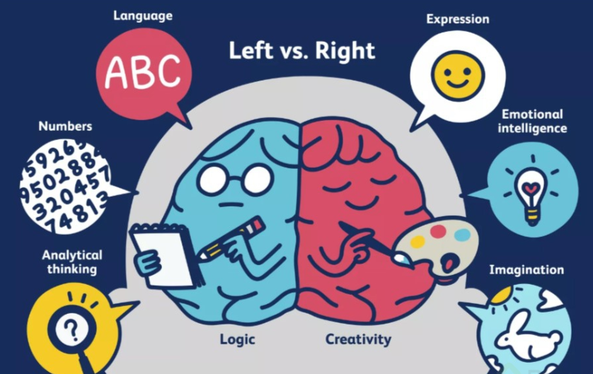
</div>

## Lenguaje audiovisual

El lenguaje tiene la capacidad de **generar mensajes artificiales que estimulen al receptor** de manera muy similar a como lo haría la naturaleza u otros elementos

* Sistema de comunicación multisensorial
* Experiencia unificada
* Lenguaje sintético
* Sensibilidad

Tanto en el lenguaje verbal, como en el lenguaje audiovisual, existen varios tipos de elementos o dimensiones que nos ayudan a comunicar mejor una idea o mensaje. Estas dimensiones son:

**Morfológica** - Forma
  * Visual 
    * Figurativos, esquematicos, abstractos
  * Sonoro
    * Voz, música, efectos, silencio


**Sintáctica** - Normas muy claras del mensaje
  * Planos, ángulos, composición, profundidad
  * Ritmo, continuidad, signos de puntuación
  * Iluminación, colores, intensidad del sonido, textos
  * Movimiento del objetivo, fisicos y opticos


**Semántica** - Significado que queremos transmitir
  * Recursos estilísticos y recursos didácticos


**Didáctica** - Estimular sentidos y emociones


**Estética** - Que quiero y que puedo enseñar

# Aspecto morfológico

<div align="center">
  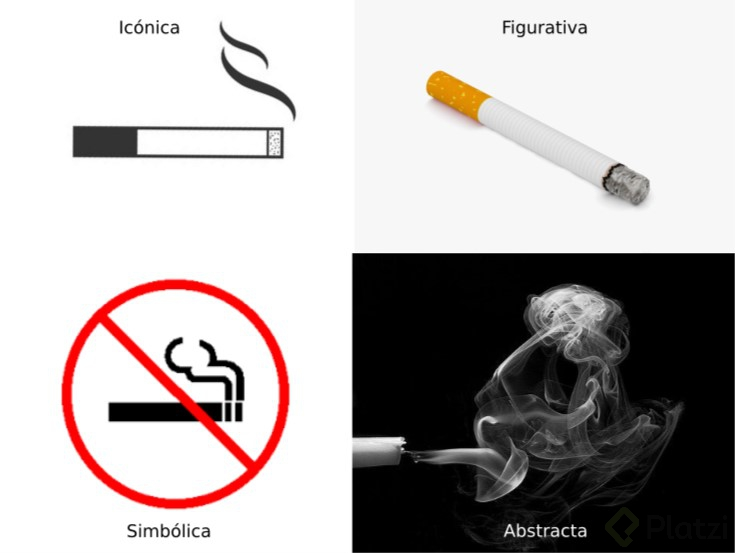
</div>

* Informativa
* Testimonial
* Formativa
* Recreativa
* Expresiva
* Sugestiva
* Propagandística

## La imagen

* Iconicidad o abstracción
* Figurativas
* Esquemáticas o simbólicas
* Abstractas

<div align="center">
  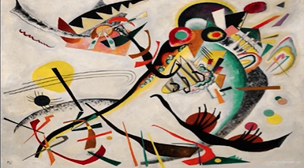
</div>

**Pelicula Amelie 2001**

**Iconica**

<div align="center">
  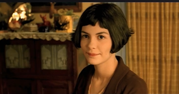
</div>

**Abstracta**

<div align="center">
  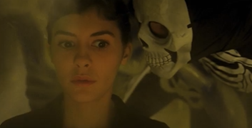
</div>

**Denotación y connotación**

Los que el director quiere dar a entender vs lo que la audiencia entienda

<div align="center">
  
</div>

**Simplicidad o complejitad**

El significado puede ser diferente / mayor o menor profundo dependiendo de la ubicación

<div align="center">
  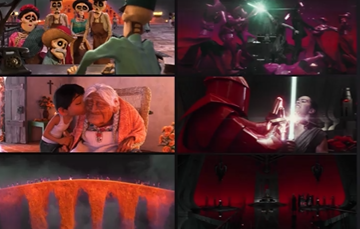
</div>

**Originalidad o redundancia**

<div align="center">
  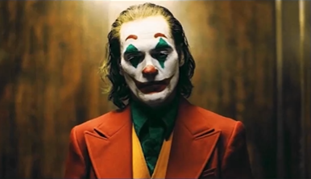
</div>

## Elementos sonoros

* Música
* Efectos de sonido
* Palabras
* Silencio

# Aspecto sintáctico

## Planos descriptivos

* Gran plano general

<div align="center">
  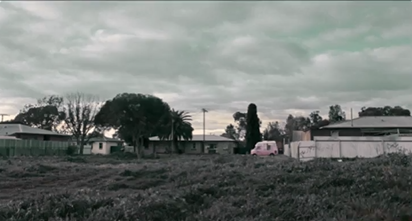
</div>

<div align="center">
  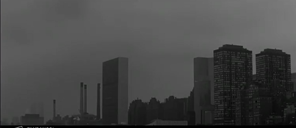
</div>

* Plano general

<div align="center">
  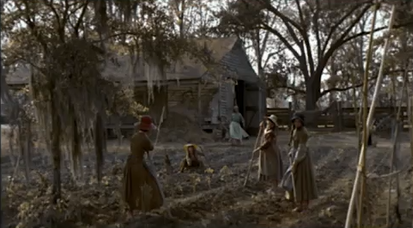
</div>

## Planos narrativos

* Plano entero

<div align="center">
  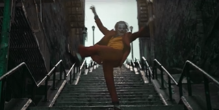
</div>

<div align="center">
  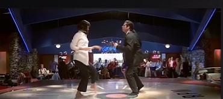
</div>

* Plano americano

<div align="center">
  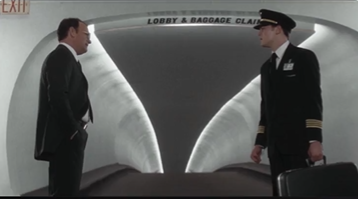
</div>

* Plano medio (El recurso más utilizado)

<div align="center">
  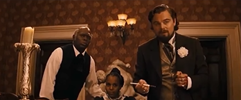
</div>

## Planos expresivos

Entender lo que siente el personaje para comunicarlo

* Primer plano (Seria el adjetivo)

<div align="center">
  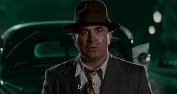
</div>

<div align="center">
  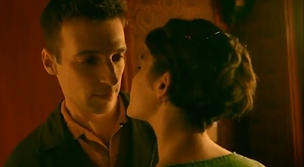
</div>

* Primerisimo primer plano

<div align="center">
  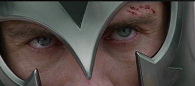
</div>

* Plano a detalle (Contexto con objetos o personas)

<div align="center">
  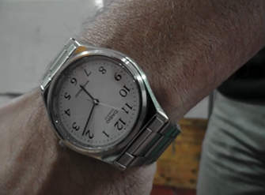
</div>

* Camara subjetiva (Lo que ve el personaje)

<div align="center">
  
</div>

El plano

<div align="center">
  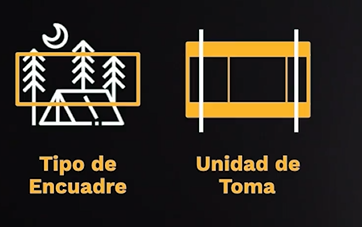
</div>

## Ángulos

Qué tan alto o bajo se posiciona la camara

<div align="center">
  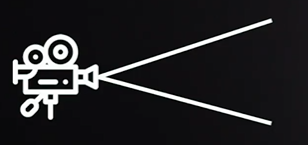
</div>

* Ángulo normal

<div align="center">
  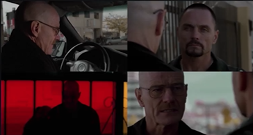
</div>

* Ángulo cenital

<div align="center">
  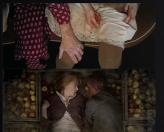
</div>

<div align="center">
  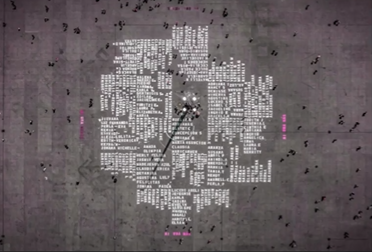
</div>

* Ángulo picado

<div align="center">
  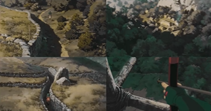
</div>

<div align="center">
  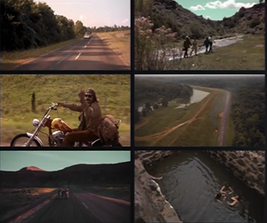
</div>

* Ángulo contrapicado

<div align="center">
  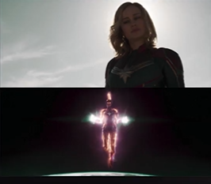
</div>

* Nadir

<div align="center">
  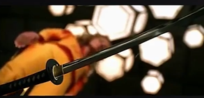
</div>

* Inclinación lateral

<div align="center">
  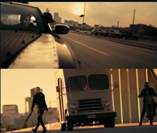
</div>

## Composición

<div align="center">
  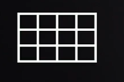
</div>

* Líneas verticales

Vida, quietud, tranquilidad, estabilidad

<div align="center">
  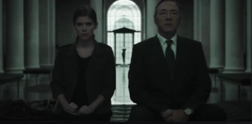
</div>

* Líneas horizontales

Estabilidad, rigidez

<div align="center">
  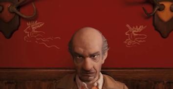
</div>

* Líneas inclinadas

Dinamismo y movimiento

<div align="center">
  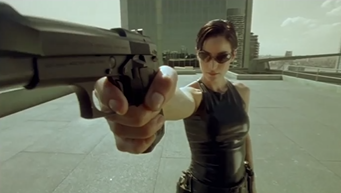
</div>

* Lineas curvas

Continuidad, mantener inmerso

<div align="center">
  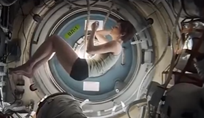
</div>

* El aire

<div align="center">
  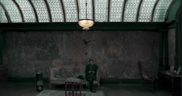
</div>

* Regla de los tercios

<div align="center">
  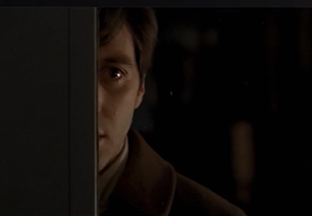
</div>

* Proporción Áurea

<div align="center">
  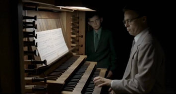
</div>

<div align="center">
  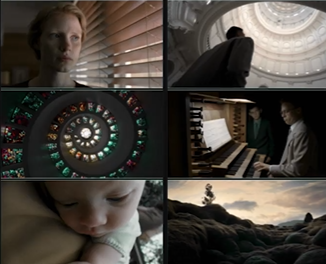
</div>

* Simetría

<div align="center">
  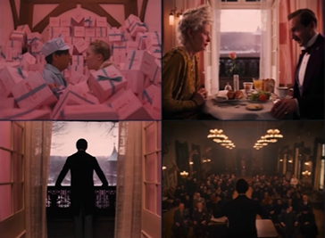
</div>

## Fibonacci: la proporción áurea y la regla de los tercios

### ¿De qué se trata la sucesión de Fibonacci?


La serie de Fibonacci se popularizó alrededor del año 1200 A.C. y fue creada por el famoso matemático italiano Leonardo Pisano. Esta sucesión de números daría origen a la proporción áurea.

Cuando hablamos de este término nos referimos a una **serie numérica** **infinita** en la que la **suma de dos números consecutivos de la serie da como resultado el número siguiente**, por ejemplo:

```
1+1=2
34+55=89
```

En este caso, al sumar 1+1 obtendremos 2 como resultado, que sería el siguiente número en la sucesión. O al sumar 34 +55 obtendremos 89.

<div align="center">
  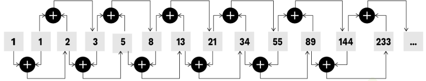
</div>

> **El cociente entre dos números consecutivos de esta sucesión es aproximadamente 1.618033**, a esto le llamamos número áureo, también identificado como la **letra Phi (Φ)** del alfabeto griego.

**Fibonacci** encontró que hay una razón absoluta que aparece frecuentemente en la naturaleza y que resulta agradable para el ojo humano, es por eso que usamos esta sucesión en la composición audiovisual.

> Veamos esto con imágenes. Dibujemos un rectángulo y que el tamaño de sus lados sean dos números consecutivos de la serie de Fibonacci.

<div align="center">
  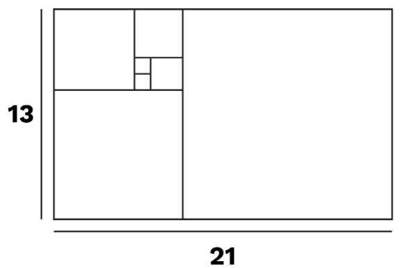
</div>

<div align="center">
  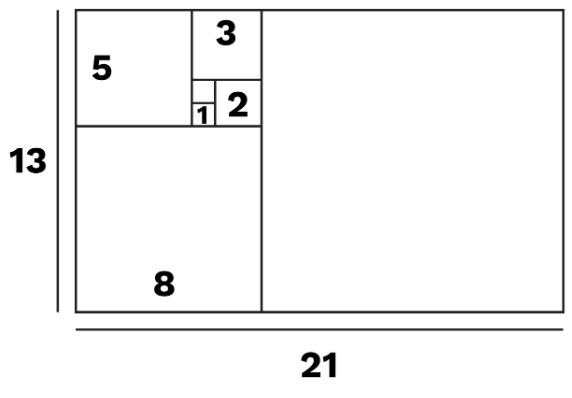
</div>

Si dibujamos una línea que una todos los cuadrados desde sus vértices obtendríamos algo parecido a esto:

<div align="center">
  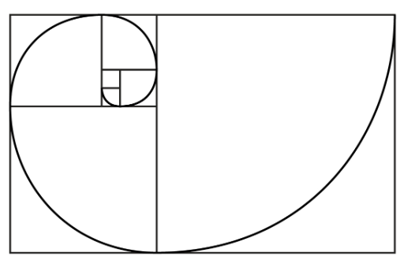
</div>

Esta espiral la podemos encontrar en la naturaleza presente en algunas plantas como los cactus o las rosas. También la encontramos en partes del cuerpo humano como los dedos de la mano.

<div align="center">
  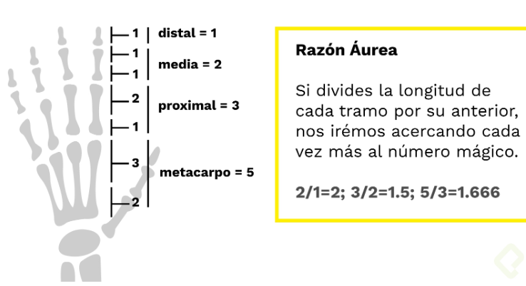
</div>

Debido a la armonía que aporta esta serie, **utilizando la espiral vemos como diversos artistas y arquitectos la empezaron a implementar desde el Renacimiento, la podemos ver en obras como La Mona Lisa o La última Cena**.

Debido a todo esto, hoy la podemos ver implementada en diversas escenas de cine, justamente porque hace que utilizar esta espiral nos sea más fácil tener una imagen agradable al ojo humano.

Si continuamos con nuestro rectángulo y colocamos 4 espirales áureas, donde cada una tiene su origen en una de las esquinas, encontraremos lo siguiente:

<div align="center">
  
</div>


Si decidimos marcar en otro color el centro de cada espiral, notaremos esto:

<div align="center">
  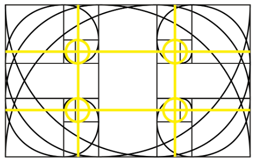
</div>

Los círculos que encontramos, son los que se conocen como puntos áureos. Básicamente esto es la intersección de lo que también conocemos como la regla de los tercios.

<div align="center">
  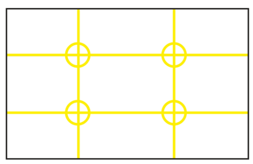
</div>

## Reglas básicas de composición

<div align="center">
  
</div>

## Profundidad de campo

Lo que se ve delante y atras, enfoque y desenfoque

<div align="center">
  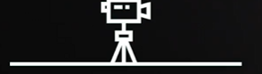
</div>

* Gran profundidad de campo

<div align="center">
  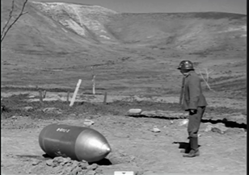
</div>


* Poca profundidad de campo

<div align="center">
  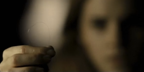
</div>

* Distancia focal

Se mide a traves de un objetivo

<div align="center">
  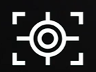
</div>

<div align="center">
  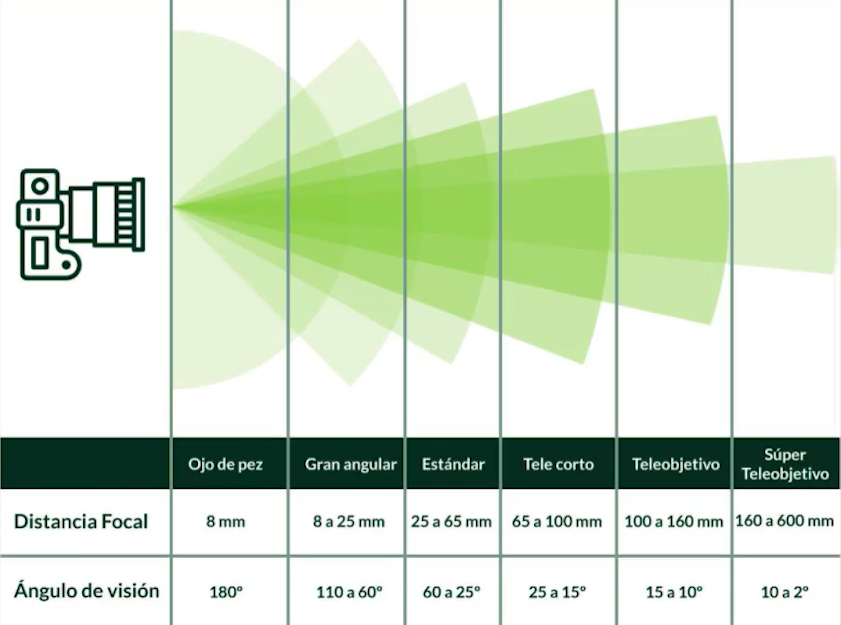
</div>

* Gran Ángular

<div align="center">
  
</div>

* Estandar

<div align="center">
  
</div>

* Teleobjetivos

<div align="center">
  
</div>

<div align="center">
  
</div>

## Ritmo

Puede darse por imagen o por sonido

* Ritmo dinámico

<div align="center">
  
</div>

<div align="center">
  
</div>

Por sonido

<div align="center">
  
</div>

* Ritmo suave

<div align="center">
  
</div>

* Ritmo interno

Sucede en el momento

<div align="center">
  
</div>

<div align="center">
  
</div>

* Ritmo externo

Sucede en el montaje y la producción la forma en la que se quiere contar

<div align="center">
  
</div>

<div align="center">
  
</div>

## Iluminación

### Interiores

* Principal
  * Difusores para dirigir la luz
* De relleno
* Posterior
* De fondo

* Iluminación suave

<div align="center">
  
</div>

<div align="center">
  
</div>

* Iluminación dura (claro - obscuro)

<div align="center">
  
</div>

<div align="center">
  
</div>

## Color

Se produce por la luz que reflejan

* Temperatura del color
  * Tonos calidos vs frios

* Colores cálidos
  * Exitantes y estimulantes, espacios grandes, cercanos y pesados
  * Blanco, amarillo, naranja, rojo

<div align="center">
  
</div>

* Colores frios
  * Sedantes, lugares pequeños y lejanos
  * Verde, azul, violeta, gris y negro

<div align="center">
  
</div>

## Movimientos de cámara

### Físicos
  * Panoramico
<div align="center">
  
</div>

  * Paneo
<div align="center">
  
</div>

  * Tilt
<div align="center">
  
</div>

  * Travel
<div align="center">
  
</div>

### Opticos

* Zoom

<div align="center">
  
</div>

* Foco

<div align="center">
  
</div>

# Aspecto semantico

* Recursos visuales y linguisticos
  * **Elipsis** - Omisión de un elemento, pero que el espectador lo entiende. Sol sale y se va
  * **Metonímia** - Substituir un elemento por otro que se puede quitar el objeto dejando el contexto
  * **Hipérbole** - Exagerar para dar a entender que paso algo
  * **Comparación**
  * **Metáfora** - Quitamos un elemento y lo exageramos
  * **Hipérbaton** - Alteración del orden lógico
  * **Repetición** -  Iteración y redundancia para dar una intención

# Glosario

A -
ACCIÓN ALTERNA: Forma de montaje que presenta dos secuencias que se alternan de manera simultánea a medida que progresa la acción, haciéndola evolucionar.

ACCIÓN CONTINUADA: Manera de hacer progresar la narración fílmica sin interrupciones ni saltos detrás.

ACCIÓN PARALELA: Presenta de manera alterna lo que está sucediendo en dos o más escenas diferentes dentro de la misma acción, y que o bien se complementan o bien la una puntúa a la otra.

ANALEPSIS: Escena retrospectiva que traslada la acción al pasado.

ÁNGULO: Diferencia que hay entre el nivel de la toma y el objeto o figura humana que se filma.

ANALÓGICO: Una información analógica es la que viene representada mediante elementos de tipo concreto, similares a la realidad (imágenes, dibujos realistas…). Por lo tanto las informaciones analógicas son fácilmente interpretables porque las relacionamos con elementos tangibles del mundo que nos rodea.

ANTICLÍMAX: Momento de bajo interés o emoción en la acción del film, que sigue el desenlace a manera de complemento o de aclaración.

ARGUMENTO: Historia o asunto que trata el film a partir de una idea esquemática o general. Puede ser original o bien adaptado de otra obra. Las cuatro fases de creación de un argumento son: sinopsis, tratamiento, continuidad y guion técnico.

ASINCRONISMO: Efecto que se produce cuando no concuerdan el montaje visual y el sonoro.

ATREZZO: Conjunto de instrumentos, herramientas y todo tipo de objetos que se usan en decoración.

B -
BANDA DE EFECTOS: Banda magnética separada que ha de ir sincronizada con la imagen para la obtención del “master de sonido,” o banda completa de sonido o mezcla final.

BANDA DE IMÁGENES: Zona de celuloide que contiene los fotogramas.

BANDA DE SONIDO: Contiene el sonido del film, es decir, el resultado de la mezcla de las bandas separadas de diálogos, música y efectos.

BARRIDO: Paso de un plano a otro por medio de una imagen intermedia casi difusa, que resulta de un movimiento rapidísimo y seco de la cámara, de tipo panorámico.

C -
CÁMARA RÁPIDA/ACELERADA: Efecto que se produce cuando se filma a una cadencia inferior a la normal (24 fps).

CÁMARA LENTA: Es cuando se filma a una cadencia superior a la normal (24 fps).

CAMPO: Espacio visual que toma la cámara desde el punto de vista en que se halla y según el ángulo de encuadre; la imagen que aparece en la pantalla.

CÁMARA SUBJETIVA: Es una técnica que consiste en mostrar mediante la cámara lo que ve el personaje. Es decir, la cámara muestra lo que está observando el personaje, actúa como si fuesen sus ojos.

CAMPO VISUAL: Se denomina campo visual a la parte del espacio, medido en grados, que el objetivo de la cámara es capaz de captar. Los objetivos gran angular tienen mucho campo visual y los objetivos tipo teleobjetivo ofrecen un campo visual reducido.

CLAQUETA: Pizarra con brazo articulado empleada para identificar cada toma en el laboratorio y en el proceso de montaje, y necesaria en las tomas rodadas con sonido directo para sincronizar después la imagen con el sonido, emparejando el primer fotograma de cierre de la claqueta con el sonido del “clac” registrado en la cinta de sonido correspondiente. La información que incluye la claqueta suele ser el título de la producción, el nombre del director y el director de fotografía, y la identificación de la toma (secuencia - escena - número de toma). En los últimos años se ha extendido el uso de la claqueta electrónica, que sustituye el chasquido del brazo por una pantalla digital donde se lee el código de tiempo que la cinta de sonido (normalmente un DAT) graba en ese instante.

CLÍMAX: Momento del más alto interés o emoción en la acción del film, en especial de tono dramático o espectacular, que se crea antes del desenlace.

CÓDIGO DE TIEMPO: Señal codificada digitalmente que se graba en las cintas de vídeo para rotular cada fotograma con el formato de “horas : minutos : segundos : fotograma”. Esta identificación es esencial para todo el trabajo de montaje a partir de cinta.

CONNOTACIÓN: Nuestras interpretaciones y valoraciones de una imagen o de una palabra. Las connotaciones no son iguales para todo el mundo. En nuestras interpretaciones intervienen nuestros valores, pautas sociales, experiencias previas, contexto, etc. Que nos llevarán a establecer unas asociaciones y proyecciones particulares. Las connotaciones que realizamos de las palabras e imágenes pueden reforzar los mensajes que nos quieren transmitir o entrar en contradicción con ellos.

CONTRACAMPO: Espacio visual simétrico al campo, o sea, el campo contrario, al revés.

CONTRAPICADO: Ángulo que se obtiene cuando la cámara filma desde abajo hacia arriba, y se agranda el objeto o la figura humana que toma.

CORTINILLA: Efecto óptico que permite sustituir de manera gradual una imagen por otra, en diferentes direcciones.

CONTINUIDAD: Fluidez de movimiento o coherencia de acción, decoración, vestuario, maquillaje, iluminación o sonido entre dos planos montados consecutivos. El principal valor en el montaje de secuencias clásico y académico en el que se impone la “invisibilidad” del corte (por ejemplo, el movimiento de un personaje debe continuar fluidamente al cambiar de plano, sin omisiones ni repeticiones). Los errores de continuidad, responsabilidad del Plan de Rodaje, se reflejan por ejemplo en el cambio súbito de algún detalle de vestuario o de decoración al cortar a otra toma: el clásico caso de la vela que presenta dos alturas distintas en el plano general y el plano medio.

CORTE: Paso o unión de un plano con otro, por medio del enlace o empalme directo sin que haya ningún otro plano entremedio.

CORTOMETRAJE: Película de corta duración, típicamente menos de 60 minutos.

D -
DENOTACIÓN: Lo que literalmente muestra una imagen o significa una palabra, es decir, lo que percibimos sin hacer valoraciones.

DESENLACE: Momento del argumento que pronto conducirá al final de la historia que se quiere narrar; pone en orden las distintas piezas que han intervenido hasta entonces y prepara, pues, el final.

DIAFRAGMA: Es un aro de amplitud variable de la cámara fotográfica que hay detrás del objetivo y que limita la entrada de los rayos de luz que impresionarán la película y formarán la imagen. Los valores del diafragma más frecuentes (del más cerrado al más abierto) son: 22, 16, 11, 8, 5.6, 2.8 y 1.4.

DISOLVENCIA: Acción de desvanecer gradualmente una escena, cosa que indica el paso del tiempo de una escena a otra, al pasar de un plano a otro.

E -
ECO, UMBERTO: Italiano, novelista y escritor especialista en Mass Media.

EJE DE LA ACCIÓN: Línea imaginaria a lo largo de la cual se desarrolla la acción de los personajes en el espacio. Este eje viene determinado, en las acciones estáticas, por la dirección de las miradas de los personajes.

EJE ÓPTICO: Línea imaginaria que une el centro del encuadre con el centro del objetivo de la cámara.

ELIPSIS: Espacio, o también tiempo, que vemos simplemente sugeridos, sin que se muestre de forma clara, evidente o nítido.

EMPLAZAMIENTO: Situación de la cámara, punto de vista o ángulo que adopta a la hora de captar una escena.

ENFOQUE: Consiste en ajustar la cámara a la distancia a la que está el objeto que se toma como elemento principal. El enfoque se realiza modificando la distancia entre el objetivo y la película hasta obtener una imagen nítida del objeto principal.

ENCUADRE: Constituye el marco de referencia (que se ve por el visor de la cámara) dentro del cual se sitúan los objetos que se quieren registrar con la cámara y con la perspectiva que se quiere captar. En la fotografía o en la película saldrán solo los elementos seleccionados al encuadrar la realidad con la cámara.

ENCADENADO: Paso de un plano a otro por medio de una serie de fotogramas intermedios en que las imágenes se superponen.

ESCENA: Acción continuada que se desarrolla dentro de un mismo ambiente o escenario; dividida en varias tomas.

ESCORZO: Efecto que se produce cuando un objeto o una figura humana es tomada en un gran primer plano y, por tanto, queda desfigurada a causa del encuadre.

ESTÉTICA: Relacionado con lo que es bonito y armónico. Función del lenguaje que tiene la finalidad de atender la manera de decir las cosas. Disciplina que estudia la teoría y la filosofía del arte.

ESPACIO FÍLMICO: La suma del campo y el fuera de campo (lo que se ve más lo que no se ve).

F -
FOTOGRAMA: Mínima unidad de contenido del celuloide. Fotografía estática, en película de 16mm o 35mm (formato comercial estándar de proyección) flanqueada por perforaciones que permiten el arrastre en cámara, proyector o moviola. La velocidad estándar de proyección es de 24 fotogramas (imágenes) por segundo (fps), al margen de la velocidad de cámara en el rodaje, que puede ser por ejemplo de 48/50 fps o más (obteniendo luego en proyección efecto de Cámara Lenta) o de 12 fps o menos (efecto de Cámara Rápida). Un segundo de vídeo está compuesto de diversos números de fotogramas, según la norma de grabación. En la norma PAL, utilizada en la mayoría de países europeos, un segundo contiene 25 fotogramas. En la norma NTSC, estándar norteamericano, un segundo contiene aproximadamente 30 fotogramas.

FUERA DE CAMPO: Acción o diálogo que tiene lugar fuera del campo visual de la cámara, pero que se sugiere o se imagina.

FUNDIDO (EN NEGRO, EN BLANCO O COLOR): Plano que se va haciendo cada vez más oscuro (o blanco o de color), hasta que en la pantalla se hace el negro (el blanco o el color) total. Hay fundido de cierre y de apertura.

G -
GRAN PLANO GENERAL: Muestra un paisaje o un gran decorado donde las figuras humanas y los objetos no tienen prácticamente ningún relieve.

GUION LITERARIO: Narración argumental del film que contiene los personajes, los decorados, la ambientación, el vestuario, etc. Así como los diálogos y el “off”.

GUION TÉCNICO: Especifica lo que se ha de ver y se ha de escuchar durante la proyección del film, y en el mismo orden en que aparecerá en la pantalla.

I -
IDEA: Punto de partida para elaborar el argumento.

INSERTO: Plano que se intercala en medio de otros dos para destacar un detalle o describir un aspecto.

ILUMINACIÓN PRINCIPAL: Es la que proporciona la mayor parte de luz a la escena. Los focos que proporcionan esta iluminación se sitúan ligeramente por encima y a un lado de la cámara.

ILUMINACIÓN DE RELLENO: Tiene la función de suavizar los contrastes que origina el foco principal y así eliminar algunas sombras. El foco de relleno está situado al otro lado de la cámara en relación con el foco principal y se dispone en una posición más alejada.

ILUMINACIÓN POSTERIOR: Tiene la función de dar relieve al sujeto y separarle del fondo. El foco posterior está situado detrás del personaje y actúa a manera de contraluz.

ILUMINACIÓN DE FONDO: Ilumina el escenario y da relieve al decorado.

L -
LARGOMETRAJE: Película cuya duración sobrepasa los 60 minutos.

M -
MISE EN SCÈNE: Escenificación; fondo de un escenario o de un decorado.

MOVIMIENTO DE BALANCEO: Es el obtenido cuando la cámara se mueve de derecha a izquierda y al revés, sin pararse.

MONTAGE: Conjunto de imágenes, a menudo enlazadas mediante fundidos encadenados o con un fondo musical continuo, que suelen emplearse para ilustrar un periodo de tiempo entre les secuencias anterior y posterior, o una serie de recuerdos.

MONTAJE: Proceso de escoger, ordenar y empalmar todos los planos rodados según una idea previa y un ritmo determinado.

O -
OBJETIVO: En una cámara, es la lente por donde entran los rayos luminosos reflejados por los objetos exteriores y que formarán la imagen en una película fotográfica o cinta de vídeo situada a una determinada distancia de su centro óptico (distancia focal).

OBTURADOR: Es el dispositivo de una cámara fotográfica que abre durante una fracción de tiempo el paso a los rayos de luz que inciden sobre el objetivo hacia la película fotográfica para que puedan impresionarla y formar la imagen. Según la rapidez con la que se abre y se cierra, es decir, según el tiempo que se mantiene abierto el paso de los rayos de luz, la imagen resultará más o menos iluminada. Las velocidades del obturador acostumbran a ser de fracciones de segundo, las más frecuentes son: 1/250, 1/125, 1/60 y 1/30.

ÓRGANOS PERCEPTIVOS: Son los órganos a través de los cuales captamos informaciones del mundo que nos rodea: la vista, el oído, el olfato, el gusto y el tacto.

P -
PANORÁMICA: Movimiento de rotación de la cámara. Puede ser horizontal, vertical, oblicua (combinación de las otras dos) y circular.

PICADO: Ángulo obtenido cuando la cámara filma de arriba a abajo, y que hace que el objeto o la figura humana filmada se empequeñezca.

PLAN DE RODAJE: Planificación del proceso de rodaje, elaborado entre responsables de producción y el ayudante de dirección, en el que se especifica el calendario de trabajo según localizaciones de rodaje, requisitos de cada secuencia o disponibilidad de actores y equipo, de cara a optimizar al máximo el tiempo y dinero invertidos en la película; o sencillamente hacer posible que se ruede todo lo necesario con los medios y plazos disponibles. El montaje puede solaparse o no con el Plan de Rodaje, aunque suele ser deseable que el montador trabaje sobre la marcha según vaya recibiendo el material rodado, de cara a posibles rectificaciones o solicitud de planos adicionales; una vez toda la maquinaria de rodaje ha terminado, volver a citar a equipo y actores para rodar por ejemplo un inserto indispensable para que cierta secuencia funcione puede resultar profundamente antieconómico.

PLANIFICACIÓN: Desglose del guion en planos.

PLANO: Dimensión de objeto/sujeto dentro del cuadro. Conjunto de imágenes que constituyen una misma toma; la unidad de toma. Hay de diferentes tipos según el ángulo de la cámara.

PLANO AMERICANO: Muestra la figura humana desde la cabeza hasta las rodillas.

PLANO DETALLE: Abarca un objeto determinado o una parte específica.

PLANO DE REFERENCIA: Muestra un objeto/sujeto en referencia a otro.

PLANO GENERAL: Abarca todo el escenario. Es el que muestra las figuras y los objetos de una manera total, incluyendo la escena donde se hallan.

PLANO GENERAL CORTO: Abarca un cuerpo entero.

PLANO INCLINADO: Se obtiene cuando la posición de la cámara no es vertical.

PLANO “MASTER”: Secuencia que se rueda en un solo plano para presentar la continuidad de una acción y que será enriquecida con insertos.

PLANO MEDIO: Muestra la figura humana desde la cabeza hasta la cintura.

PLANO MEDIO CORTO: Presenta la figura humana desde la cabeza hasta la mitad del pecho, abarca el busto del personaje.

PLANO PUNTO DE VISTA: La mirada del personaje; la línea de visión del personaje se dirige hacia los espectadores.

PLANO SECUENCIA: Secuencia que se rueda en un solo plano, en una única toma, sin ningún tipo de montaje, directamente y sin interrupción, y por eso conserva las unidades espacial y temporal.

PLANO SUBJETIVO: La visión del personaje; muestra lo mismo que ven los ojos de un personaje. A veces el plano tiene el mismo movimiento que el intérprete.

PLANTEAMIENTO: Inicio o arranque de la historia que se quiere narrar.

PRIMER PLANO: Muestra el pecho/el hombro y la cabeza de la figura humana, o bien un objeto globalmente.

PRIMERÍSIMO PRIMER PLANO: Muestra desde la barbilla hasta la frente del rostro de la figura humana, o acerca una zona, o bien solo una porción de un objeto.

PROFUNDIDAD DE CAMPO: Espacio entre el primer término y el último que se enfocan en un mismo encuadre.

PROLEPSIS: Escena prospectiva que enseña acontecimientos futuros, típicamente dejando ver detalles del desenlace de la película.

R -
RACCORD: Enlace o continuidad de un plano a otro sin que se produzca ningún salto. Hay por movimiento, color, luz, contenido, sonido e incluso por combinación de algunos de estos aspectos.

RETROVISIÓN: Salto atrás en el tiempo.

RITMO: Impresión dinámica dada por la duración de los planos, las intensidades dramáticas y, en último término, por efecto del montaje.

S -
SECUENCIA: Unidad dramática y temática con sentido completo (equivalente de “un acto” en el drama); dividida en varias escenas.

SONIDO DIEGÉTICO: Sonido que se escucha en el mundo del personaje (voces y diálogos de personajes, sonidos emitidos por objetos en el espacio fílmico, música tocada por personajes).

SONIDO EXTRADIEGÉTICO: Sonido que el espectador escucha pero no se percibe en el mundo del personaje (voz de narrador, efectos de sonido, música de fondo, canciones de la banda sonora); se usa para establecer un ambiente o evocar emociones.

T -
TOMA: Acción ininterrumpida de la cámara, desde que se prende hasta que se apaga.

TRAVELING: Movimiento mecánico de translación de la cámara en el espacio cuando esta se desplaza encima de un móvil o bien sobre el hombro del operador.

V -
VALOR DESCRIPTIVO: Un plano tiene valor descriptivo cuando su función principal es describir los personajes o el entorno en el que se desenvuelve su actuación. Los planos lejanos (gran plano general y plano general) son eminentemente descriptivos.

VALOR EXPRESIVO: Un plano tiene valor expresivo cuando su función principal es mostrar las emociones de los personajes. Los planos cercanos (plano medio, primer plano, plano de detalle) son los que aportan mayor carga expresiva a las imágenes.

VALOR NARRATIVO: Un plano tiene valor narrativo cuando su función principal es narrar la acción que desenvuelve el personaje. Los planos entero y americano son los que tienen mayor potencial narrativo.

Z -
ZOOM: Cuando un objetivo o dispositivo fotográfico tienen una óptica ajustable que permite disponer de una distancia focal variable.