# Engineering Management <!-- omit in toc -->

## Tabla de Contenido<!-- omit in toc -->
- [Introducción](#introducción)
  - [Roles](#roles)
  - [Trayectorias de carrera en equipos técnicos](#trayectorias-de-carrera-en-equipos-técnicos)
  - [Niveles en organizaciones de ingeniería](#niveles-en-organizaciones-de-ingeniería)
  - [Camino técnico](#camino-técnico)
  - [Camino gerencial](#camino-gerencial)
    - [Diferencia en agendas](#diferencia-en-agendas)
  - [¿Estás lista para ser gerente?](#estás-lista-para-ser-gerente)
    - [Tú como mentorá](#tú-como-mentorá)
  - [Tú como líder técnica](#tú-como-líder-técnica)
  - [Gerente o no gerente](#gerente-o-no-gerente)
- [Primeros 30 días: ¿Qué hago aquí?](#primeros-30-días-qué-hago-aquí)
  - [Conociendo a tu equipo](#conociendo-a-tu-equipo)
    - [1:1](#11)
- [Dïa 30 a 60](#dïa-30-a-60)
  - [Delega](#delega)
  - [Conectando estrategia y ejecución](#conectando-estrategia-y-ejecución)
- [Manejo de estado de trabajo y de equipos](#manejo-de-estado-de-trabajo-y-de-equipos)
  - [Días 1 a 60: ¿Cómo te sientes?](#días-1-a-60-cómo-te-sientes)

# Introducción

* Tecnicas de gerencia y de desarrollo de software

> La gerencia no es una ciencia exacta, y técnicas o procesos que funcionan en mis equipos pueden tener resultados diferentes en el tuyo. Piensa que tipo de gerente quieres ser o no ser

**Revisa el contexto corporativo**

* Esto sirve para equipos pequeños para startups
* A cargo de personas, sirve mucho la empatía

## Roles

* **Ingeniera de software** - Responsable de implementaciones técnicas, escribe el código
* **Líder técnica** - Ve con quien hay que coordinar y negocia, comunica riesgos
* **Arquitecta de software** - Mira el futuro de como mantener el software en el tiempo y que sea escalable y aplicable a actualizaciones
* **Gerente de software** - Interacción de todas las tareas
* **Gerente de producto** - Qué hay que hacer y por que debemos hacerlo
* **Gerente de ingenieria** - A cargo del personal técnico, influencias el software a través de personas

## Trayectorias de carrera en equipos técnicos

Decidir entre el camino técnico y el gerencial

  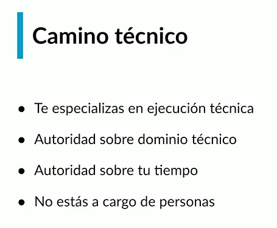

  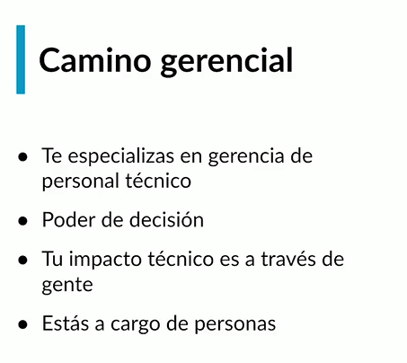

## Niveles en organizaciones de ingeniería

  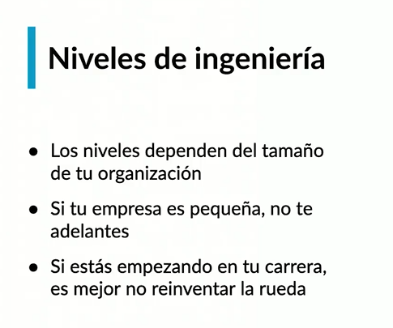

https://docs.google.com/spreadsheets/d/11ya4acUE2x8iJ5BDbRlXJLko8L_fLicWDY_PxoyKNYY/edit#gid=0

https://docs.google.com/spreadsheets/d/1k4sO6pyCl_YYnf0PAXSBcX776rNcTjSOqDxZ5SDty-4/edit

https://www.levels.fyi/

## Camino técnico

  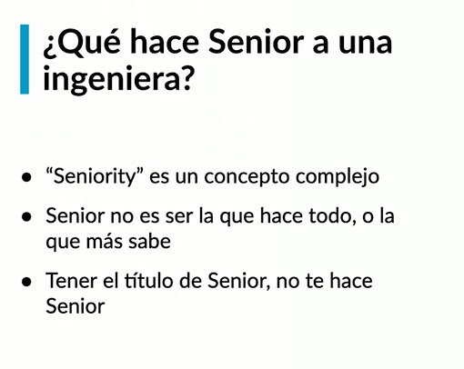

  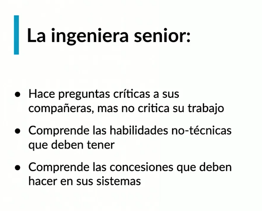

  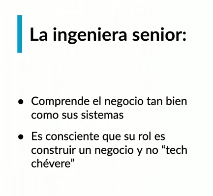

  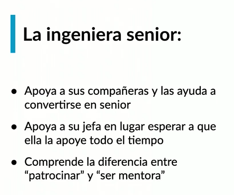

  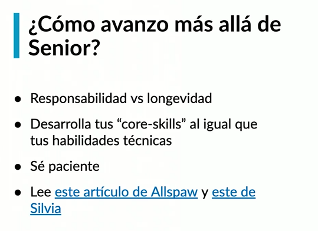

Artículos para revisar

https://www.kitchensoap.com/2012/10/25/on-being-a-senior-engineer/

https://blog.dbsmasher.com/2019/01/28/on-being-a-principal-engineer.html

## Camino gerencial

  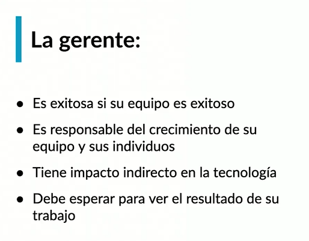

### Diferencia en agendas

  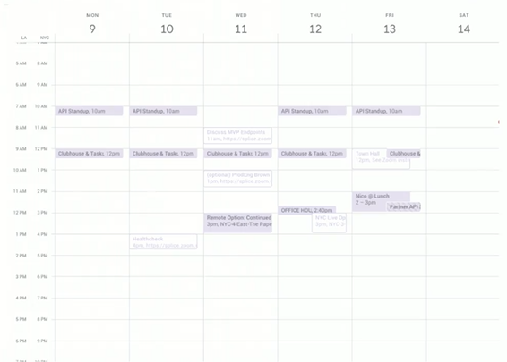

  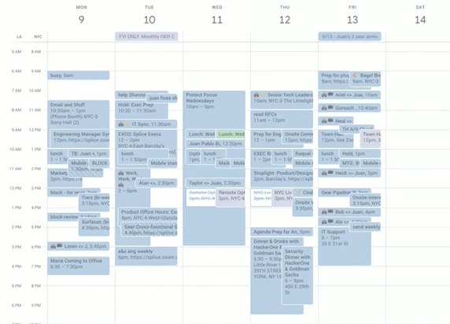

## ¿Estás lista para ser gerente?

### Tú como mentorá

  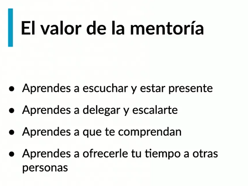

  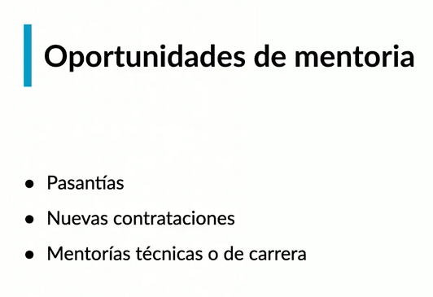

## Tú como líder técnica

> El trabajo **profesional** de ingeniería de software es construir negocios a través de tecnología, y no simplemente crear tecnología. 
> **–Juan Pablo Buriticá.**

  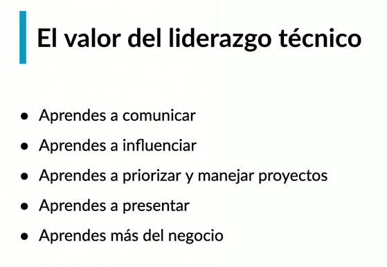

  

  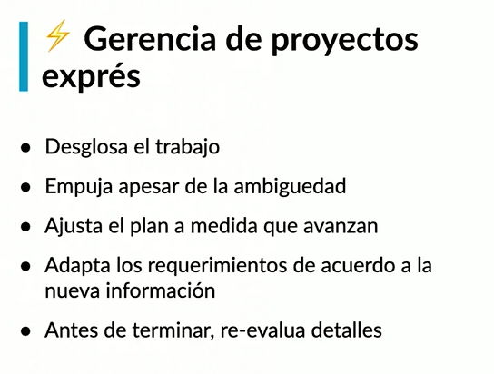

## Gerente o no gerente

  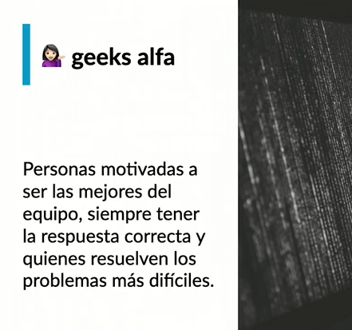

  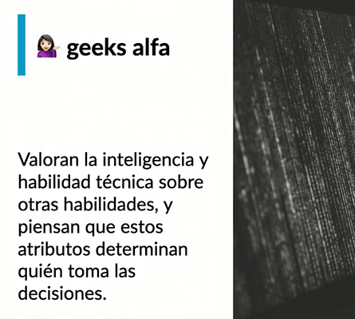

  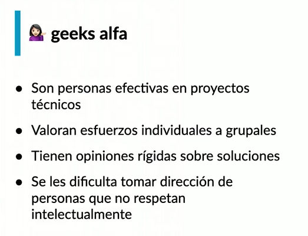

  

  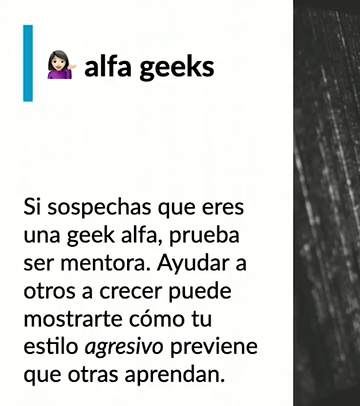

  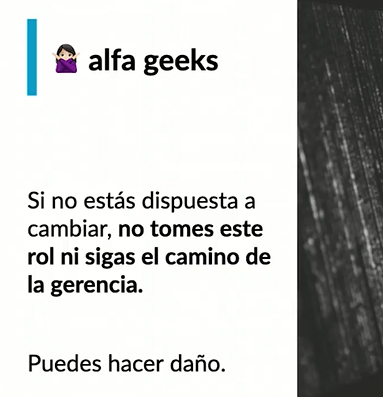

  

  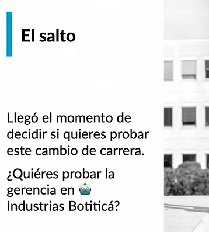

  

  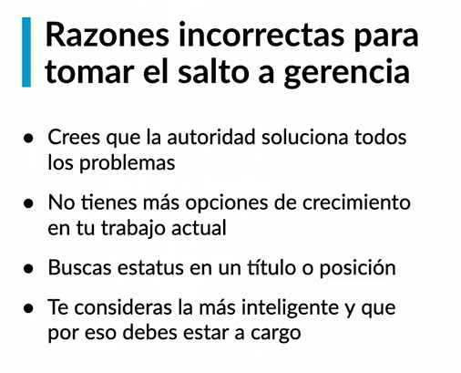

  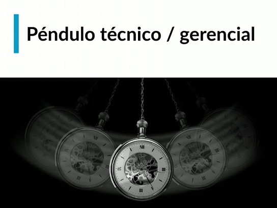

# Primeros 30 días: ¿Qué hago aquí?

> Consulta  a tu equipo antes de tomar una decisión

  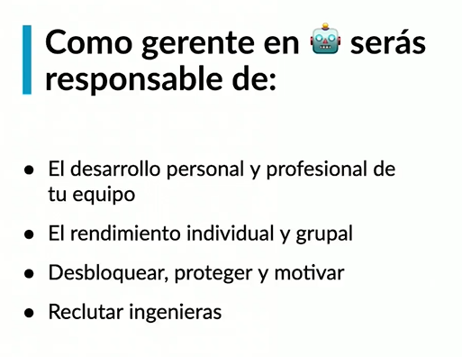

  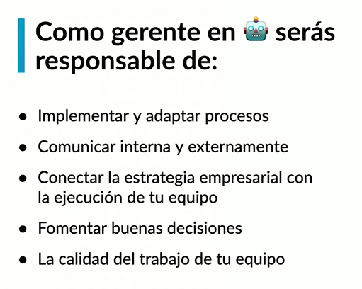

  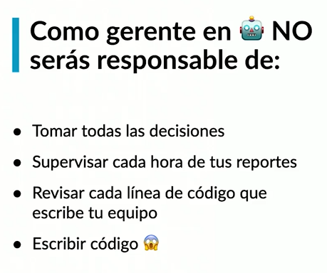

## Conociendo a tu equipo

  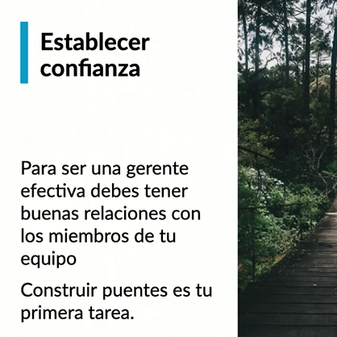

  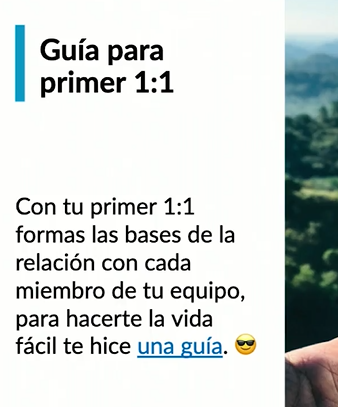

https://github.com/buritica/mgt/blob/master/es/primer-uno-a-uno.md

https://github.com/buritica/collaboration-guides

### 1:1

> Es tú principal herramienta

  

  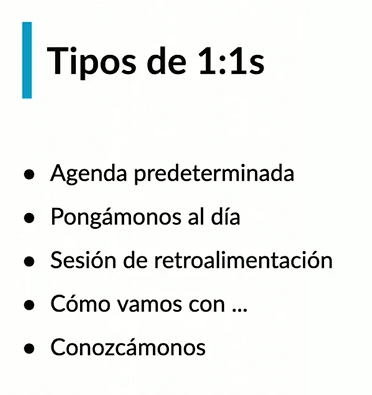

  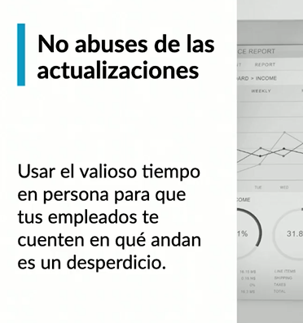

# Dïa 30 a 60

## Delega

> Escala tú impacto

  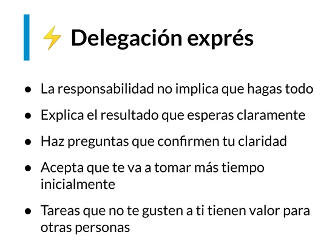

  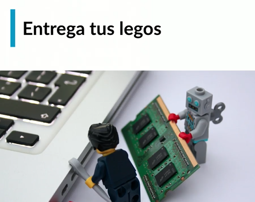

  

## Conectando estrategia y ejecución

> ¿Para dónde vamos?

https://www.tesla.com/es_MX/blog/master-plan-part-deux?redirect=no

https://www.cnbc.com/2018/04/18/why-elon-musk-wants-his-employees-to-use-a-strategy-called-first-principles.html

https://medium.com/the-mission/elon-musks-3-step-first-principles-thinking-how-to-think-and-solve-difficult-problems-like-a-ba1e73a9f6c0

  

  

  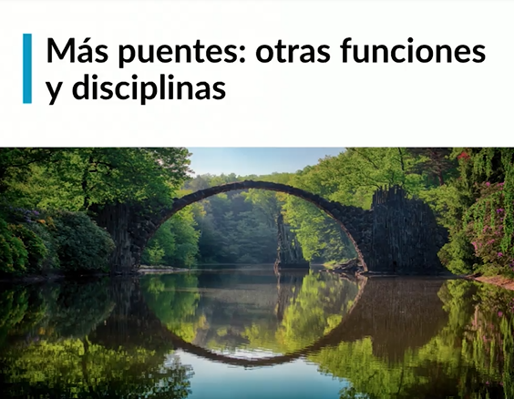

# Manejo de estado de trabajo y de equipos

* ¿Cómo vamos?

  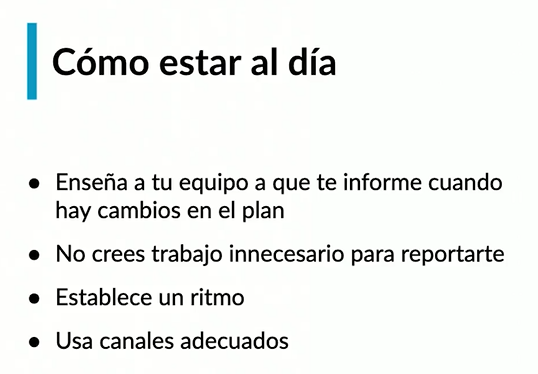

**Como responder al ¿Como vas?**

* Establece un plan (Durante los próximos 15 días) y enséñale a tu equipo a que te informe cuando hay cambios en el plan.
* No crees trabajo innecesario para reportarte.
* Crea un ritmo como el plan del punto uno.
* Utiliza canales adecuados. (Comunica la información del estado que te llega, hacia arriba y hacia los lados.)

  

**Como mantener al día**

* Sienta expectativas al comienzo.
* Comunica cambios en el plan.
* Comunica riesgos tan pronto como surja.
* Usa los canales adecuados
* Establece un ritmo.
* **No micro-gerencies:** Dale espacio a tu equipo de responder, a que falle, con calma.

> No seas la jefe a la que nadie quiere darle malas noticias. Cuando recibas malas noticias, sé neutral o positiva.

  

https://github.com/buritica/mgt/blob/master/es/guia-estado.md

* Crea un canal de emergencia

## Días 1 a 60: ¿Cómo te sientes?

* Toma el control
* ¿Cómo ingeniero funciona o no funciona?
* Con personas, hay más insertidumbre y no tienes control
