# Engineering Management <!-- omit in toc -->

## Tabla de Contenido<!-- omit in toc -->
- [Introducción](#introducción)
  - [Roles](#roles)
  - [Trayectorias de carrera en equipos técnicos](#trayectorias-de-carrera-en-equipos-técnicos)
  - [Niveles en organizaciones de ingeniería](#niveles-en-organizaciones-de-ingeniería)
  - [Camino técnico](#camino-técnico)
  - [Camino gerencial](#camino-gerencial)
    - [Diferencia en agendas](#diferencia-en-agendas)
  - [¿Estás lista para ser gerente?](#estás-lista-para-ser-gerente)
    - [Tú como mentorá](#tú-como-mentorá)
  - [Tú como líder técnica](#tú-como-líder-técnica)
  - [Gerente o no gerente](#gerente-o-no-gerente)
- [Primeros 30 días: ¿Qué hago aquí?](#primeros-30-días-qué-hago-aquí)
  - [Conociendo a tu equipo](#conociendo-a-tu-equipo)
    - [1:1](#11)
- [Dïa 30 a 60](#dïa-30-a-60)
  - [Delega](#delega)
  - [Conectando estrategia y ejecución](#conectando-estrategia-y-ejecución)
- [Manejo de estado de trabajo y de equipos](#manejo-de-estado-de-trabajo-y-de-equipos)
  - [Días 1 a 60: ¿Cómo te sientes?](#días-1-a-60-cómo-te-sientes)
  - [El tiempo de ingeniería](#el-tiempo-de-ingeniería)
    - [Categorización](#categorización)
    - [Distribución ideal](#distribución-ideal)
- [Tips](#tips)
  - [Sé la trabajadora que te gustaría tener](#sé-la-trabajadora-que-te-gustaría-tener)
  - [Desarrollo de producto](#desarrollo-de-producto)
  - [El ciclo de desarrollo](#el-ciclo-de-desarrollo)
  - [Itera rápido y ágil](#itera-rápido-y-ágil)
  - [¿Qué es velocidad en ingeniería?](#qué-es-velocidad-en-ingeniería)
  - [Productividad](#productividad)
  - [Estructurando a tu equipo](#estructurando-a-tu-equipo)
  - [Estrategias de comunicación](#estrategias-de-comunicación)
  - [¿Cómo tomar decisiones?](#cómo-tomar-decisiones)
  - [Performance, contratación y siguientes pasos](#performance-contratación-y-siguientes-pasos)
    - [El rendimiento grupal](#el-rendimiento-grupal)
    - [Rendimiento individual](#rendimiento-individual)
    - [Conversaciones difíciles ¿Cómo despedir a alguien?](#conversaciones-difíciles-cómo-despedir-a-alguien)
    - [Conversaciones chéveres (Crecimiento y promoción)](#conversaciones-chéveres-crecimiento-y-promoción)

# Introducción

* Tecnicas de gerencia y de desarrollo de software

> La gerencia no es una ciencia exacta, y técnicas o procesos que funcionan en mis equipos pueden tener resultados diferentes en el tuyo. Piensa que tipo de gerente quieres ser o no ser

**Revisa el contexto corporativo**

* Esto sirve para equipos pequeños para startups
* A cargo de personas, sirve mucho la empatía

## Roles

* **Ingeniera de software** - Responsable de implementaciones técnicas, escribe el código
* **Líder técnica** - Ve con quien hay que coordinar y negocia, comunica riesgos
* **Arquitecta de software** - Mira el futuro de como mantener el software en el tiempo y que sea escalable y aplicable a actualizaciones
* **Gerente de software** - Interacción de todas las tareas
* **Gerente de producto** - Qué hay que hacer y por que debemos hacerlo
* **Gerente de ingenieria** - A cargo del personal técnico, influencias el software a través de personas

## Trayectorias de carrera en equipos técnicos

Decidir entre el camino técnico y el gerencial

  

  

## Niveles en organizaciones de ingeniería

  

https://docs.google.com/spreadsheets/d/11ya4acUE2x8iJ5BDbRlXJLko8L_fLicWDY_PxoyKNYY/edit#gid=0

https://docs.google.com/spreadsheets/d/1k4sO6pyCl_YYnf0PAXSBcX776rNcTjSOqDxZ5SDty-4/edit

https://www.levels.fyi/

## Camino técnico

  

  

  

  

  

Artículos para revisar

https://www.kitchensoap.com/2012/10/25/on-being-a-senior-engineer/

https://blog.dbsmasher.com/2019/01/28/on-being-a-principal-engineer.html

## Camino gerencial

  

### Diferencia en agendas

  

  

## ¿Estás lista para ser gerente?

### Tú como mentorá

  

  

## Tú como líder técnica

> El trabajo **profesional** de ingeniería de software es construir negocios a través de tecnología, y no simplemente crear tecnología. 
> **–Juan Pablo Buriticá.**

  

  

  

## Gerente o no gerente

  

  

  

  

  

  

  

  

  

  

  

# Primeros 30 días: ¿Qué hago aquí?

> Consulta  a tu equipo antes de tomar una decisión

  

  

  

## Conociendo a tu equipo

  

  

https://github.com/buritica/mgt/blob/master/es/primer-uno-a-uno.md

https://github.com/buritica/collaboration-guides

### 1:1

> Es tú principal herramienta

  

  

  

# Dïa 30 a 60

## Delega

> Escala tú impacto

  

  

  

## Conectando estrategia y ejecución

> ¿Para dónde vamos?

https://www.tesla.com/es_MX/blog/master-plan-part-deux?redirect=no

https://www.cnbc.com/2018/04/18/why-elon-musk-wants-his-employees-to-use-a-strategy-called-first-principles.html

https://medium.com/the-mission/elon-musks-3-step-first-principles-thinking-how-to-think-and-solve-difficult-problems-like-a-ba1e73a9f6c0

  

  

  

# Manejo de estado de trabajo y de equipos

* ¿Cómo vamos?

  

**Como responder al ¿Como vas?**

* Establece un plan (Durante los próximos 15 días) y enséñale a tu equipo a que te informe cuando hay cambios en el plan.
* No crees trabajo innecesario para reportarte.
* Crea un ritmo como el plan del punto uno.
* Utiliza canales adecuados. (Comunica la información del estado que te llega, hacia arriba y hacia los lados.)

  

**Como mantener al día**

* Sienta expectativas al comienzo.
* Comunica cambios en el plan.
* Comunica riesgos tan pronto como surja.
* Usa los canales adecuados
* Establece un ritmo.
* **No micro-gerencies:** Dale espacio a tu equipo de responder, a que falle, con calma.

> No seas la jefe a la que nadie quiere darle malas noticias. Cuando recibas malas noticias, sé neutral o positiva.

  

https://github.com/buritica/mgt/blob/master/es/guia-estado.md

* Crea un canal de emergencia

## Días 1 a 60: ¿Cómo te sientes?

* Toma el control
* ¿Cómo ingeniero funciona o no funciona?
* Con personas, hay más insertidumbre y no tienes control

## El tiempo de ingeniería

* El valor del tiempo de ingeniería y sus tipos
* El tiempo es $$$

### Categorización
* **Soporte** - Tiempo sirviendole a otras personas, tiempo no planeado al que toca reaccionar
* **Mantenimiento** - Tiempo dedicado a mejorar y mantener sistemas. Actualizaciones
* **Desarrollo de funcionalidad nueva** - Creación de productos y servicios nuevos

### Distribución ideal

  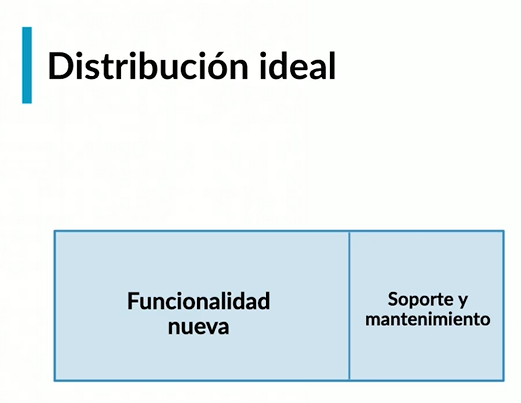

  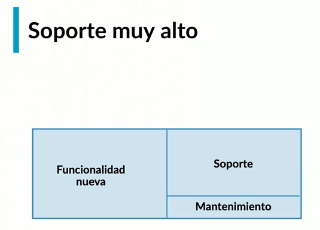

  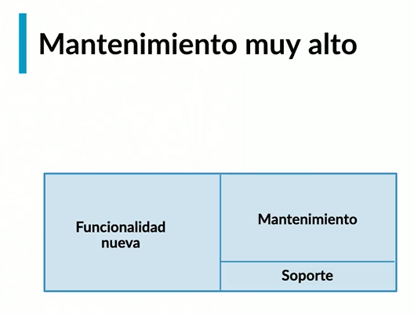

  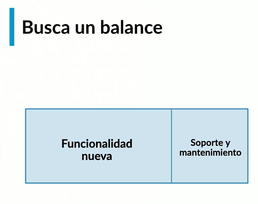

  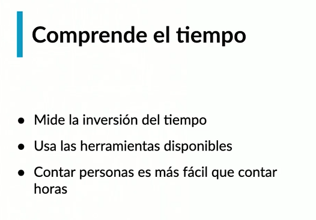

Es más fácil contar gente que horas
* 1 Soporte
* 1 Mantenimiento
* 3 Desarrollo

> No poder desarrollar producto es un riesgo

  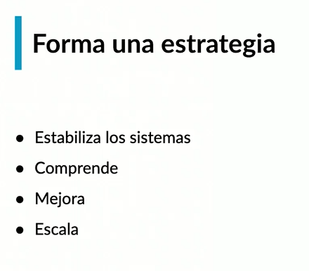

Entiende por que sucede y genera una estrategia

Expande tus conocimientos

> Haz un plan para poder tomar mejores decisiones y con base a eso estima

  

Finalmente comunica el progreso

# Tips

## Sé la trabajadora que te gustaría tener

Cuándo le enseñes algo a tu equipo nuevo, evalua si lo estás haciendo hacia tu jefa, Hazle la vida fácil

  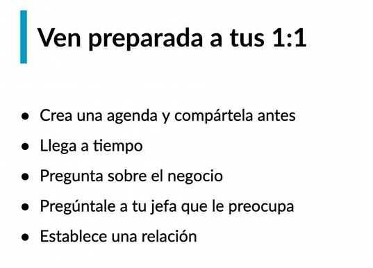

Haz preguntas

* Cuánto nos cuesta adquirir un usuario, margenes, competencia, más impacto en el negocio
* ¿Qué te preocupa?
* Pregunta sobre los miembros del equipo
* ¿Qué problemas tiene?
* Establece una relación viendo el lado humano

  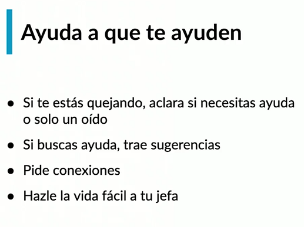

¿Cómo le vas a hacer la vida más fácil a tu jefe la próxima semana?

## Desarrollo de producto

  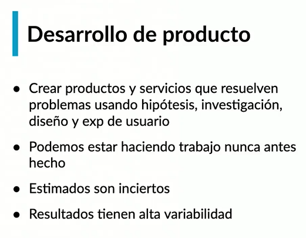

  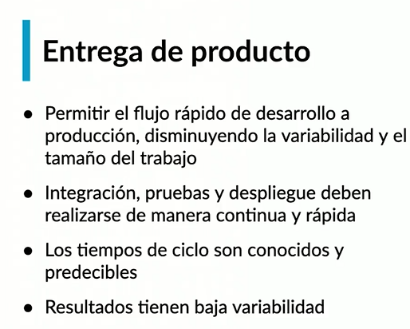

* El desarrollo de producto es una sociación
  * Se trae experiencia y muchas habilidades e ideas para construir
* La entrega del producto es responsabilidad de ingeniería

## El ciclo de desarrollo

  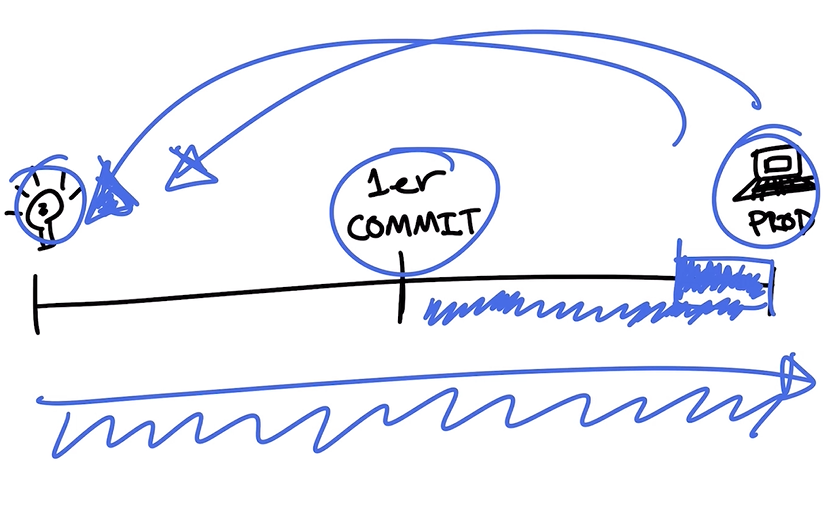

> Desarrollo iterativo

Scrum y el manifesto ágil no necesariamente te hace mejor

## Itera rápido y ágil

> No necesitas una certificación

  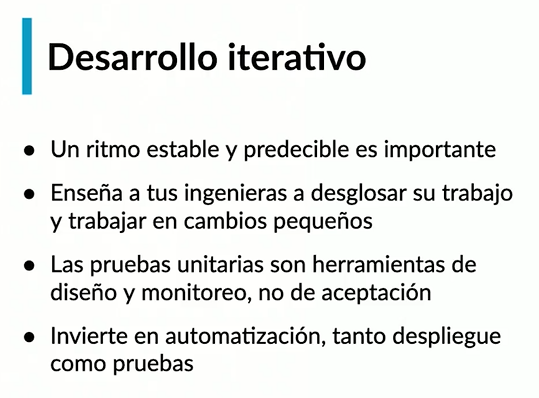

  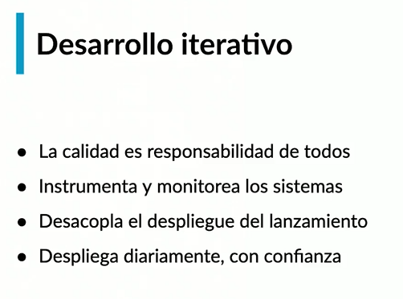

* Esconder a través de banderas, habilitar y desabilitar
* Reducir errores
* Adapta tus procesos y no te obsesiones con ellos

## ¿Qué es velocidad en ingeniería?

Se interpreta de manera diferente en cada empresa

  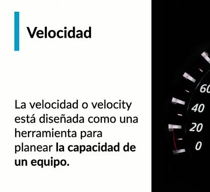

Es de capacidad, cuanto podemos hacer

  

La velocidad es relativa y no puedes comparar una con la de otro

  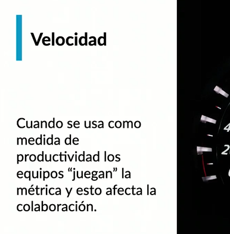

  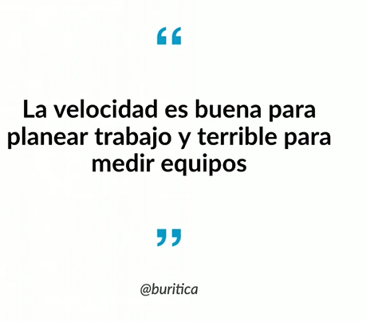

No funciona para medir equipos
* No midas líneas de código, ni horas trabajadas

> Considero que se puede medir con base a resultados de equipo. Hacer acuerdos. Y tal vez medir la productividad con ciertos factores durante ese tiempo, como bugs y lanzamientos a producción. 
> 
>De esa manera podemos estimar que tan avanzado quedp el proyecto, si está al 100% o a un nivel menor y ver datos como cuántos despliegues nos costo realizar por cada feature, analizando su complejidad. Así mismo ver cuáles fueron los errores que se tuvieron y ver los aprendizajes. Hacer una retrospectiva de que fue lo que sucedió.
>
>Me dí cuenta que herramientas como GitLab a nivel de desarrollo te da muchos datos al respecto y en cierta manera son públicos para los integrantes del equipo. Eso mismo orienta a querer ir a alcanzar el resultado y cumplir los objetivos acordados.

## Productividad

  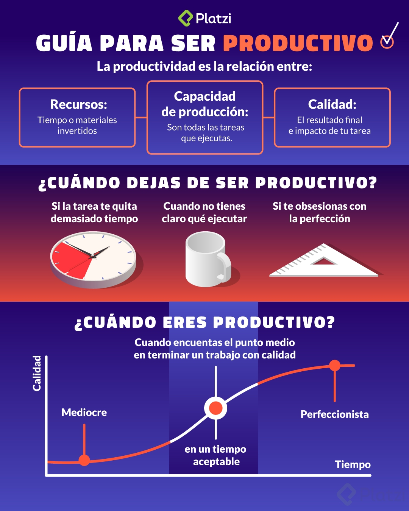

## Estructurando a tu equipo

* Tú equipo te reporta a tí, y es tu responsabilidad decidir cómo se organiza de acuerdo a las prioridades

---

* No crees barreras artificiales o imaginarias, deja que se autoorganizen
* Motiva a que aprendan de varias cosas
* Enfócate en dar objetivos claros, y no en decidir cómo se soluciona el problema
* Balancea la ejecución inmediata con el crecimiento a largo plazo, toma en cuenta presente y futuro
* Rota las responsabilidades, da oportunidad a que alguien este en áreas diferentes, genera un equipo unido

¿Generalistas o especialistas?

* Organismo Cigoto, es generalista, eventualmente se van a especializar, ambos caben
* La individualidad impacta el rendimiento y conocimiento Previene errores.

## Estrategias de comunicación

* La comunicación no es lo que dices sino lo que te entienden
* Comunicación sincrónica vs asincrónica
  

  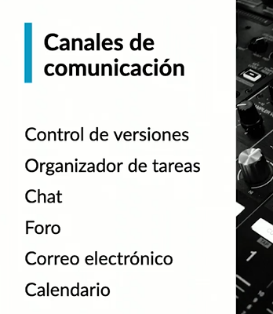

* Sé intencional y explícita al elegir los mecanismos
* No crees una prisión de presencia
* La comunicación es el fundamento de la confianza

## ¿Cómo tomar decisiones?

> "No tomar decisión, es mucho peor que tomar una mala decisión" **Juan Pablo Buriticá**

* Tu trabajo ya no es tomar decisiones técnicas

* RFCs cómo mecanismos de decisión de equipos, **viene de los commits y proyectos open source**

  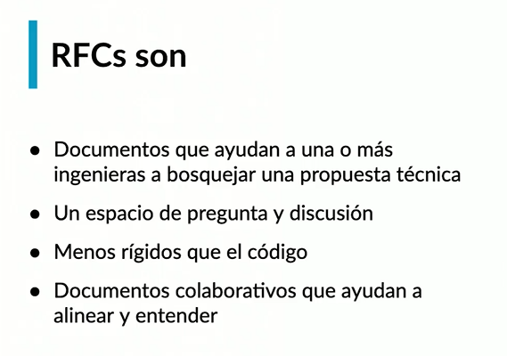

Es mejor discutir en texto que en código

  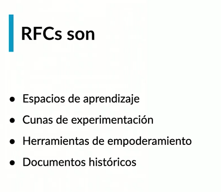

https://github.com/buritica/mgt/blob/master/es/guia-de-rfcs.md

## Performance, contratación y siguientes pasos

### El rendimiento grupal

Un equipo es como andar a cargo de una banda de música, cada persona hace algo diferente, hay una guitarra, piano, bajo... pero todos deben sonar muy bien, las bandas práctican y aprenden

* Rendimiento grupal
* No es común ni deseable que todos los miembros del equipo sean estrellas
* Miden los resultados a partir del resultado del grupo
  * No líneas de código

### Rendimiento individual

**Un junior**

* Responsabilidades son pocas
* Tiene que aprender lenguajes
* Aprender a comunicarse
* Poco a poco va ganando experiencia
* Confia en tu equipo
* Lo que importan son los resultados
* Retroalimentación continúa

Planes de mejora (Performance improvement plan)

* Se claró

**3 consejos**

* Delinea que tiene la persona para mejorar
* Cuánto tiempo tiene para mejorar
* Hazlo por escrito y haz un acuerdo

### Conversaciones difíciles ¿Cómo despedir a alguien?

> Se humano, nunca debe ser una sorpresa cuando despides a alguien

* Sí es por rendimiento debiste haber intentado el plan de mejora
* Práctica la conversación varias veces
* Nunca se improvisa, siempre se práctica
* Siempre ten esta conversación en persona, nunca despidas a alguien por correo, ni por texto ni por whatsapp
* La persona dedico tiempo a la empresa y a tí

### Conversaciones chéveres (Crecimiento y promoción)

Platicas para dar buenas noticias