# Gerencia de TI <!-- omit in toc -->

## Tabla de Contenido<!-- omit in toc -->
- [El software como core](#el-software-como-core)
  - [El mapa de un gerente de tecnología](#el-mapa-de-un-gerente-de-tecnología)
  - [La tecnología es software en su mínima expresión](#la-tecnología-es-software-en-su-mínima-expresión)
  - [Contratación de perfiles técnicos](#contratación-de-perfiles-técnicos)
  - [ADN](#adn)
  - [Comprar tecnología o crear tecnología](#comprar-tecnología-o-crear-tecnología)
    - [Servicios](#servicios)
    - [Hay 3 componentes a tener en cuenta](#hay-3-componentes-a-tener-en-cuenta)
  - [El ciclo real del desarrollo de software](#el-ciclo-real-del-desarrollo-de-software)
  - [Tesla](#tesla)
  - [Accenture](#accenture)
- [El ciclo de vida de la tecnología en las empresas](#el-ciclo-de-vida-de-la-tecnología-en-las-empresas)
  - [Roles en proyectos de tecnología: diseño, data science, devops, backend, front-end y mobile devs](#roles-en-proyectos-de-tecnología-diseño-data-science-devops-backend-front-end-y-mobile-devs)
  - [Líderes técnicos: stakeholders, product owners, product managers](#líderes-técnicos-stakeholders-product-owners-product-managers)
  - [Metodologías de cumplimiento de fechas de entrega](#metodologías-de-cumplimiento-de-fechas-de-entrega)
  - [Líderes vs. equipos](#líderes-vs-equipos)
    - [Líderes](#líderes)
    - [Equipos](#equipos)
  - [Cuánto pagar por un proyecto de tecnología](#cuánto-pagar-por-un-proyecto-de-tecnología)
- [Seguridad para roles no técnicos](#seguridad-para-roles-no-técnicos)
  - [Cifrado de disco duro](#cifrado-de-disco-duro)
  - [Los NO rotundos de seguridad informática corporativa](#los-no-rotundos-de-seguridad-informática-corporativa)
  - [Niveles de permisos y manejos de información](#niveles-de-permisos-y-manejos-de-información)
- [Infraestructura](#infraestructura)
  - [Certificaciones](#certificaciones)
- [Recursos humanos y gestion de talento](#recursos-humanos-y-gestion-de-talento)
  - [Salario](#salario)
  - [Cómo motivar ingenieros y estructuras de compensación](#cómo-motivar-ingenieros-y-estructuras-de-compensación)
  - [Junior y Senior](#junior-y-senior)
  - [Organigrama de equipos de ingenieria](#organigrama-de-equipos-de-ingenieria)

# El software como core

## El mapa de un gerente de tecnología

En el mundo moderno la tecnología mueve TODA la industria y no es opcional no saber cómo está integrado.

  

## La tecnología es software en su mínima expresión

El celular ya es un comodity, lo de valor ahora es el software

Todo se está digitalizando

* Contratos
* Monitores de salud smarwatches
* Pagos
* Automóviles

> El software es el centro de todo. La civilización moderna funciona con software y telecomunicaciones
> **Nuestra civilización funciona con software**

## Contratación de perfiles técnicos

  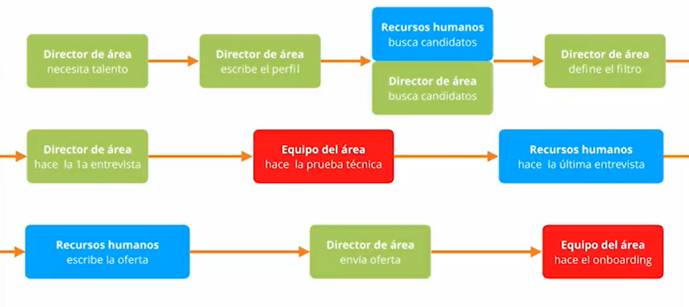

  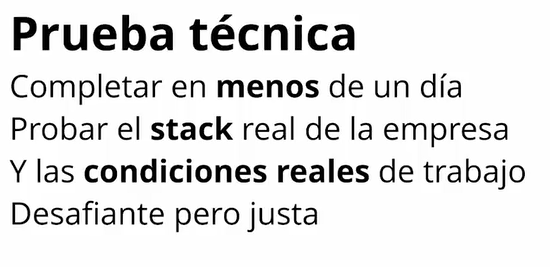

  

## ADN

  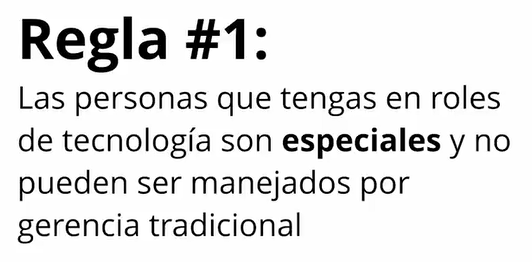

  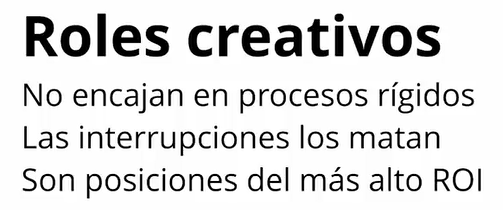

Cuatro grandes perfiles en los roles creativos:

* **Vendedores:** hiper optimistas. “Todo es posible”. Dan opciones poco realistas de cómo se puede lograr. Son poco pragmáticos y el hiper optimismo a veces ciega su capacidad de ejecución. Son extremadamente apasionados por la tecnología pero se vuelven peligrosos cuando les apasiona más la tecnología como tal que la solución (quieren volver a hacer todo desde cero, quieren probar las últimas tecnologías aunque no sean las correctas…)
* **Creadores:** quieren convertir ideas en realidad, quieren ser alimentados de la visión más grande y con esto se emocionan para crear las soluciones.
* **Arrogantes:** casi siempre combinados con los perfiles magos. Se sienten indispensables, son intocables (porque manejan permisos y responsabilidades únicos)
* **Magos:** pueden hacer lo que sea, solucionar los problemas más extraños que se puedan imaginar.

  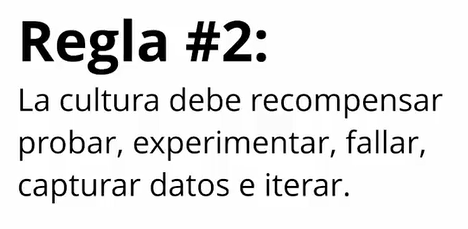

  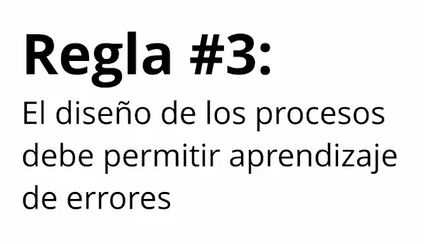

  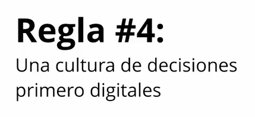

  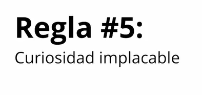

  

  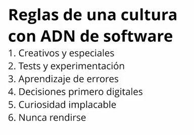

## Comprar tecnología o crear tecnología

  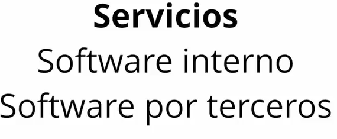

### Servicios
* Sistema operativo
* Google Suite
* Slack
* Trello
* Excel
* Dashboards (Puede ser necesario hacerlo)
* SAP
* Siigo
* Salesforce
* Oracle Netsuite

### Hay 3 componentes a tener en cuenta

* Conocimiento interno estratégico
* Velocidad de iteración
* Protección anti-disrupción

## El ciclo real del desarrollo de software

* Ventaja competitiva (**Construyelo**)
* Mejora iterativa (**Delegalo**)
* Automatización probada (**Compralo**)

## Tesla

  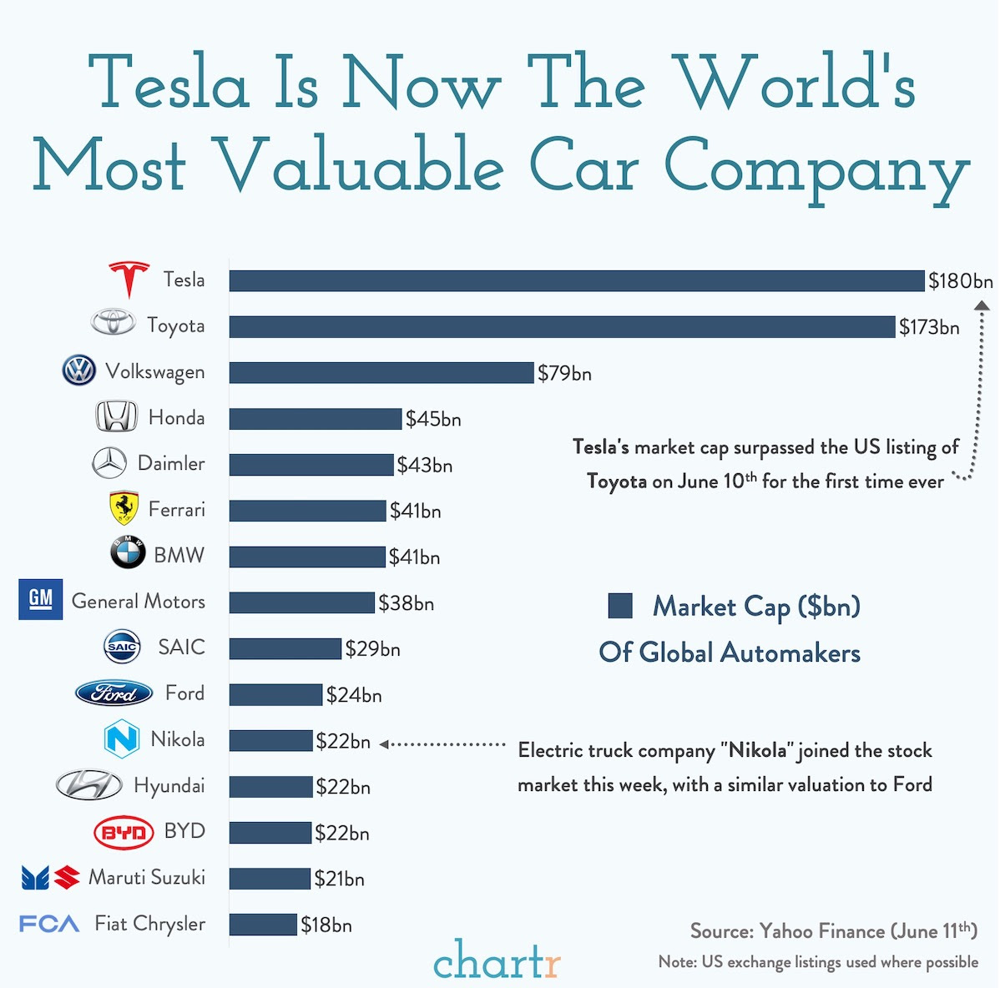

* 100% eléctricos
* Piloto automático
* Baterías grandes
* Lindos*

> **Las personas actúan más fuerte por miedo que por éxito.**
> Si tu puedes ganar algo, es menos probable que actúes
> Si tu puedes perder algo, es más probable que actúes

* Range Anxiety (Baterias de largo alcance)
* Seguridad vehícular (Seguros)
* Sexy (Experiencia de usuario)

Inversión en innovación y desarrollo
Inversión en la empresa

  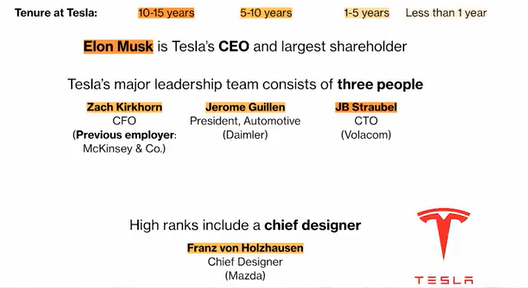

  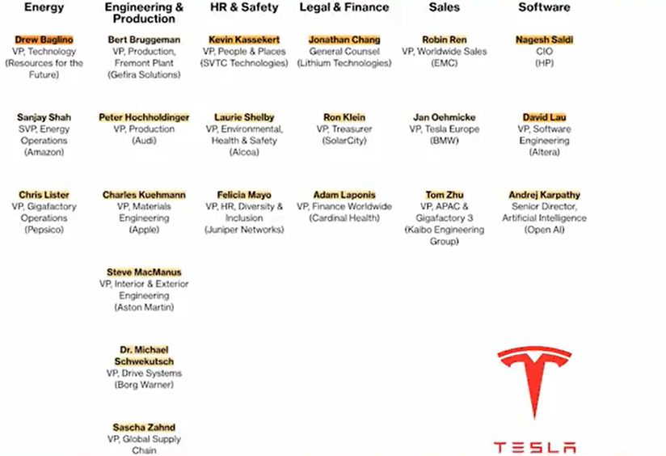

## Accenture

Errores de Hertz

Ceder el control del proyecto a un tercero.
No haber creado un equipo interno para controlar el desarrollo del proyecto.
No haber valorizado adecuadamente los entregables del Accenture. De haberse asesorado se hubiese protegido de desembolsar millones. En construcción, la ingeniería solo vale el 10% del valor total del proyecto; es decir que en el supuesto de que el proyecto valiera 32 MM USD, solo se deberia haber desembolsado 3.2 MM USD y no 7 MM USD (Item 29. de la demanda).
Errores de Accenture

No contratar un leader de proyecto que tuviera claro como realizar la integración de los sistemas de Hertz con la pagina web y el app.
Recomendar un producto propio, “Rapid”, que no estuviera probada su eficiencia para este proyecto.
Los códigos Java no se redactaron segun estandares Java lo que hizo dificil el mantenimiento del mismo.
El FED era inseguro y el AEM su arquitectura no conversaba con el arquetipo.
No se hicieron pruebas a los componentes.
Se reemplazó al “owner product” y al microservices arquitech en la Fase 2, perdiendose tiempo en la transicion.

https://regmedia.co.uk/2019/04/23/hertz-accenture-website.pdf

# El ciclo de vida de la tecnología en las empresas

Los 5 por qué

  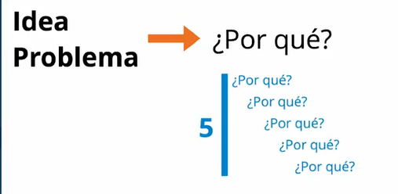

  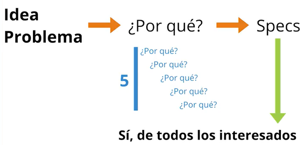

  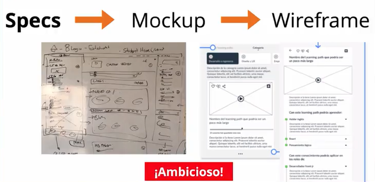

  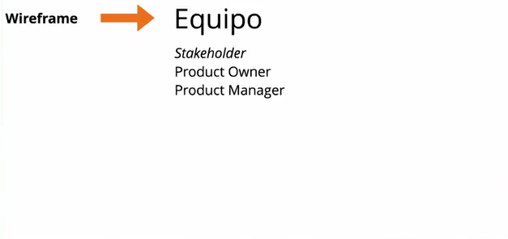

  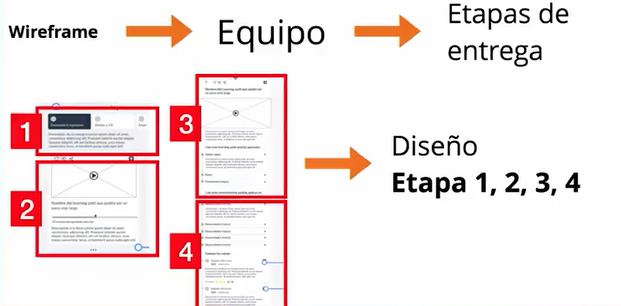

  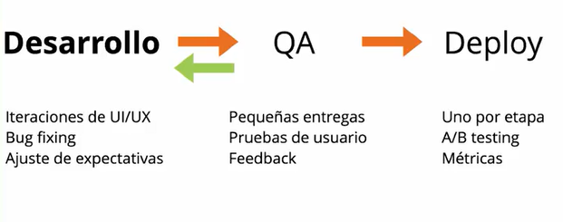

  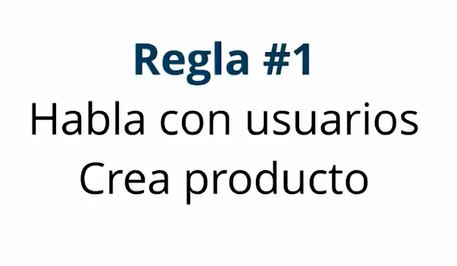

  

## Roles en proyectos de tecnología: diseño, data science, devops, backend, front-end y mobile devs

  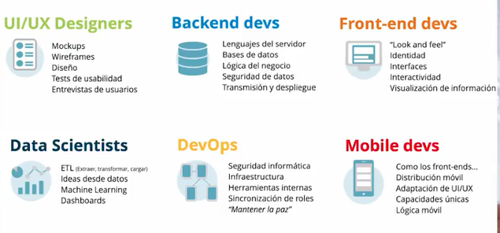

  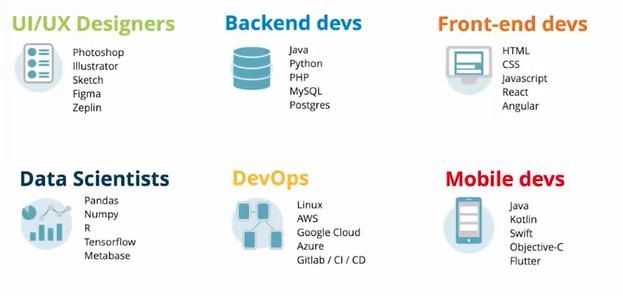

## Líderes técnicos: stakeholders, product owners, product managers

  

  

  

  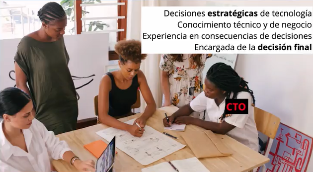

  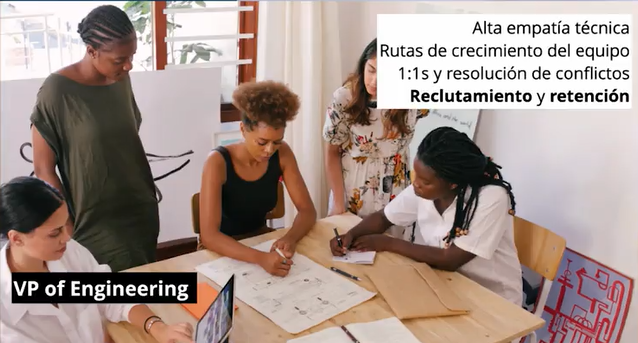

## Metodologías de cumplimiento de fechas de entrega

  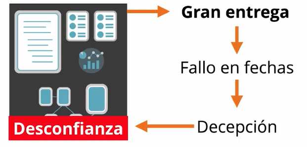

  

* Tú no sabes lo que no sabes
* Iteración continúa > Megaproyecto

> Divide algo grande en cosas pequeñas

  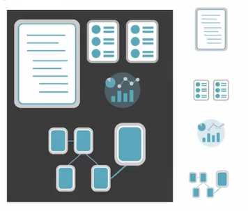

  

  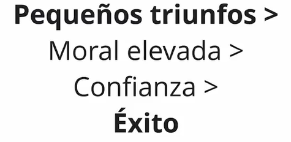

## Líderes vs. equipos

### Líderes

  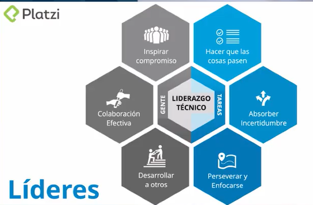

### Equipos

  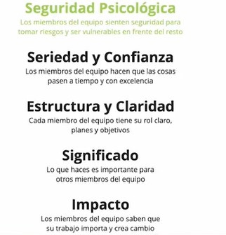

## Cuánto pagar por un proyecto de tecnología

  

> Hacer tecnología es caro
> ¿Qué es lo peor que puede pasar?
> ¿Qué es lo mejor que puede pasar?

  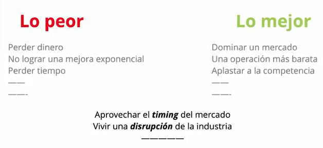

  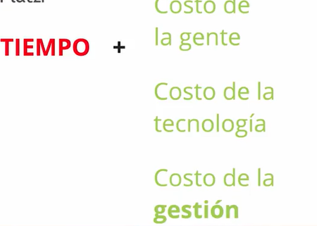

  

  

  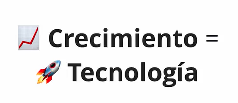

# Seguridad para roles no técnicos

* Fuerza bruta

Uso de gestor de contraseñas

https://bitwarden.com/ Gratuita.
https://keepass.info/ Gratuita.
https://www.yubico.com/ Pago Hardware
https://1password.com/ Pago
https://www.lastpass.com/es Gratuita.

## Cifrado de disco duro

* Fit locker **Windows 10 profesional**
* File vault
* No imprimas nada (Dumpster Diving (Mirar en la basura)) Netflix serie el mecanismo
* Jaula de Faraday para reuniones privadas

https://www.hscott.net/hack-rifle/

## Los NO rotundos de seguridad informática corporativa

* Cuidado con los backups
* No tener un wifi normal
* Contraeña fuerte
* MAC address whitelist
* Solo ethernet
* Tapa webcam y microfono
* No confies solo en el pentesting de la empresa
* Usa Signal > Telegram > Whatsapp
* Email solo es externo
* Internamente usa slack o teams
* Documentación interna usa notion
* No uses usb
* No uses sistemas con contraseñas de 4 digitos

## Niveles de permisos y manejos de información

  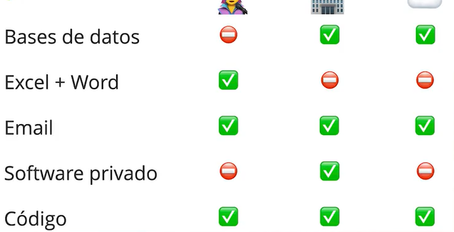

  

https://haveibeenpwned.com/

  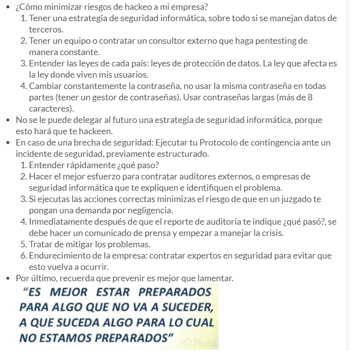

# Infraestructura

  

  

  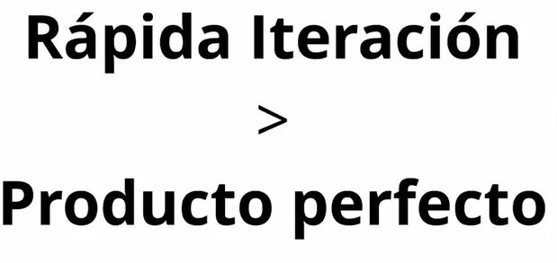

## Certificaciones

PCI Compliance Pagos
HIPAA Salud
ISO 27001

  

  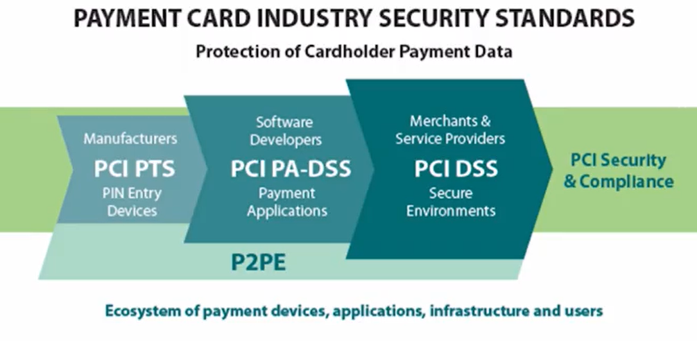

  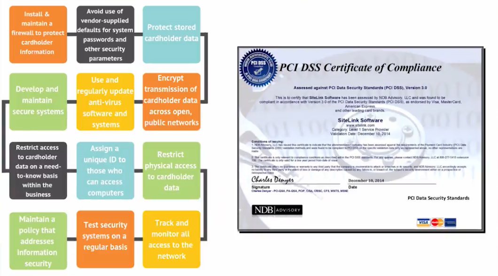

  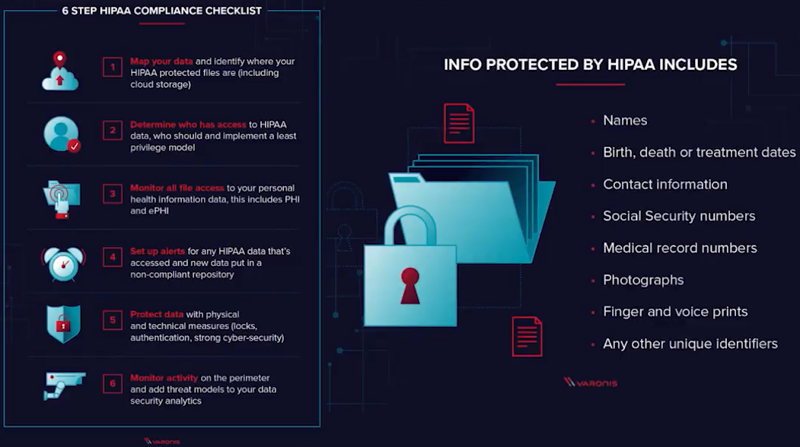

  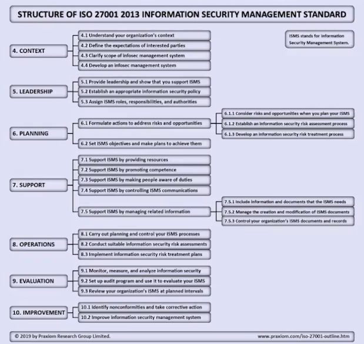

  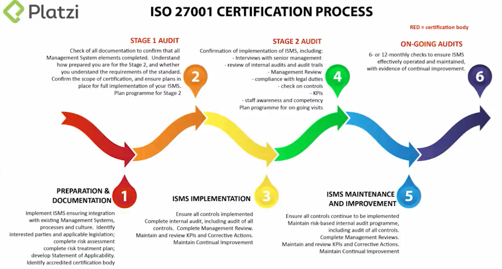

# Recursos humanos y gestion de talento

## Salario

  

  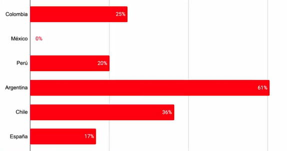

  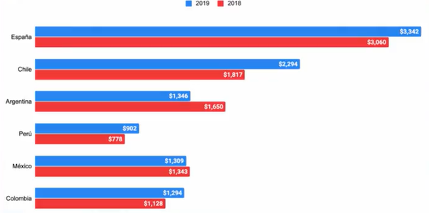

  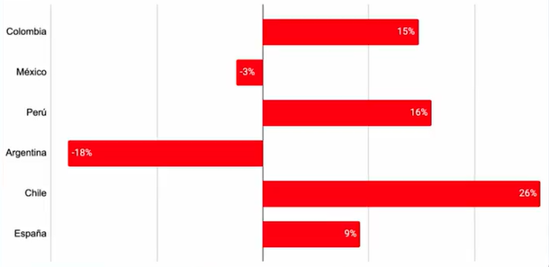

  

  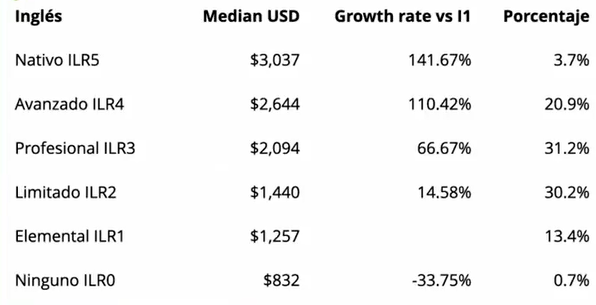

https://sg.com.mx/buzz/reporte-salarios-y-mejores-empresas-2017

https://sg.com.mx/buzz/datos-previos-del-estudio-de-salarios-2018

https://sg.com.mx/revista/58/estudio-de-salarios-sg-2019

## Cómo motivar ingenieros y estructuras de compensación

* Crecer
* Aprender
* Hacer cosas difíciles*

> La ingeniería es ciencia aplicada
> Porque se puede

  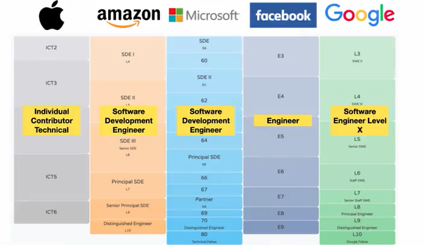

  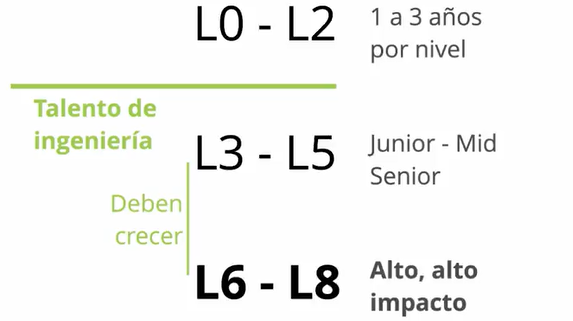

  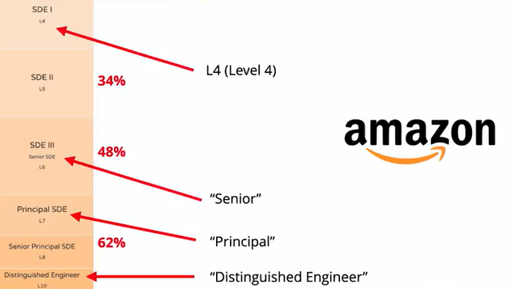

  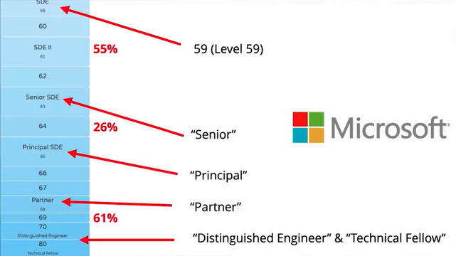

  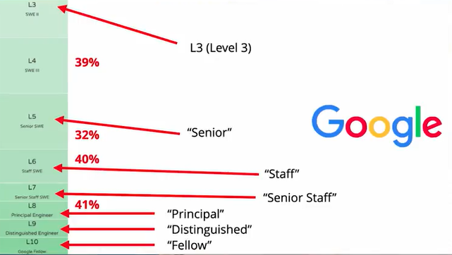

## Junior y Senior

  

  

## Organigrama de equipos de ingenieria

  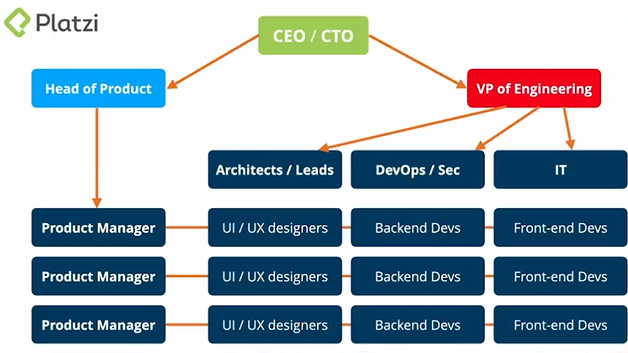

  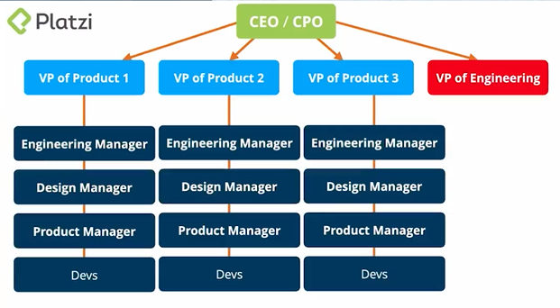

https://blind.com/
