# Algoritmos con Python <!-- omit in toc -->

> Mejora de habilidades como programador

## Tabla de Contenido<!-- omit in toc -->
- [Tipos de soluciones de problemas](#tipos-de-soluciones-de-problemas)
- [Complejidad algorítmica](#complejidad-algor%c3%adtmica)
  - [Aproximaciones](#aproximaciones)
  - [Notación asintotica / Big O Notation](#notaci%c3%b3n-asintotica--big-o-notation)
    - [Crecimiento asintótico](#crecimiento-asint%c3%b3tico)
    - [Clases de complejidad algorítmica](#clases-de-complejidad-algor%c3%adtmica)
- [Programas númericos](#programas-n%c3%bamericos)
  - [Enumeración exhaustiva](#enumeraci%c3%b3n-exhaustiva)
  - [Aproximación de soluciones](#aproximaci%c3%b3n-de-soluciones)
  - [Búsqueda binaria](#b%c3%basqueda-binaria)
  - [Representaciones de flotantes](#representaciones-de-flotantes)
- [Búsqueda y ordenamiento](#b%c3%basqueda-y-ordenamiento)
  - [Búsqueda lineal](#b%c3%basqueda-lineal)
  - [Búsqueda binaria](#b%c3%basqueda-binaria-1)
  - [Ordenamiento burbuja](#ordenamiento-burbuja)
  - [Ordenamiento por inserción](#ordenamiento-por-inserci%c3%b3n)
- [Algoritmos de Optimización](#algoritmos-de-optimizaci%c3%b3n)
  - [El problema del morral](#el-problema-del-morral)
- [Programación dinámica y estocástica](#programaci%c3%b3n-din%c3%a1mica-y-estoc%c3%a1stica)
  - [Programación dinámica](#programaci%c3%b3n-din%c3%a1mica)
    - [La optimizacion se basa en la memorizacion](#la-optimizacion-se-basa-en-la-memorizacion)
    - [Fibonacci](#fibonacci)
  - [Caminos aleatorios](#caminos-aleatorios)
    - [Camino de borrachos](#camino-de-borrachos)
- [Programación Estocástica](#programaci%c3%b3n-estoc%c3%a1stica)
  - [Aplicaciones](#aplicaciones)
  - [Cálculo de probabilidades](#c%c3%a1lculo-de-probabilidades)
    - [Probabilidades](#probabilidades)
  - [Inferencia estadística](#inferencia-estad%c3%adstica)
    - [Proceso](#proceso)
    - [Ley de los grandes números](#ley-de-los-grandes-n%c3%bameros)
    - [Falacia del apostador](#falacia-del-apostador)
    - [Medidas de tendencia central](#medidas-de-tendencia-central)
      - [Media](#media)
      - [Varianza](#varianza)
      - [Desviación estándar](#desviaci%c3%b3n-est%c3%a1ndar)
      - [Distribución normal](#distribuci%c3%b3n-normal)
        - [Regla empírica](#regla-emp%c3%adrica)
  - [Simulaciones de Montecarlo](#simulaciones-de-montecarlo)
    - [Cálculo de PI](#c%c3%a1lculo-de-pi)
  - [Muestreo](#muestreo)
    - [Teorema del límite central](#teorema-del-l%c3%admite-central)
  - [Datos experimentales](#datos-experimentales)
  - [Regresión lineal](#regresi%c3%b3n-lineal)

# Tipos de soluciones de problemas

* **Deterministicas**. Una entrada misma salida
* **Estocásticas**. Los resultados varian acorde a las probabilidades

# Complejidad algorítmica
* Comparar algorítmos
* Complejidad temporal (Cuánto se tarda) vs complejidad espacial (Cuánto espacio necesita)
* Podemos definirla como T(n)

## Aproximaciones
* Conometrar el tiempo que corre un algoritmo
* Contar con los pasos con una medida abstracta de operación
* Contar los pasos conforme nos aproximamos al infinito **Forma estándar**

Se pueden generar ecuaciones matemáticas para evaluar el rendimiento por medio de la estructura del algorítmo
```python
1002 + x + 2x**
```

## Notación asintotica / Big O Notation
### Crecimiento asintótico
* No importan variaciones pequeñas
* El enfoque se centra en lo que pasa conforme el tamaño del problema se acerca a infinito
* Mejor de los caso, promedio, peor de los casos
* Big O
* Nada más importa el término de mayor tamaño

### Clases de complejidad algorítmica
* O(1) Constante
* O(n) Lineal
* O(log n) Logaritmica
* O(n log n) log lineal
* O(n**2) Polinomial
* O(2**n) Exponencial

<div align="center">
  
  <small><p>Big O</p></small>
</div>


# Programas númericos
## Enumeración exhaustiva
Prueba todas las posibilidades hasta que encuentres la respuesta para la mayoria de los casos el rendimiento no es importante, las computadoras son muy rápidas

```python
objetivo = int(input('Escoge un entero'))
respuesta = 0

while respuesta**2 < objetivo:
    respuesta += 1

if respuesta**2 == objetivo :
    print(f'La raíz cuadrada de {objetivo} es {respuesta}')
```

## Aproximación de soluciones
No se necesita una respuesta exacta
Podemos aproximar la solución con un margen de error que llamaremos epsilon

```python
objetivo = int(input('Escoge un número'))
epsilon = 0.01
paso = epsilon**2 # 0.0001
respuesta = 0.0

while abs(respuesta**2 - objetivo) >= epsilon and respuesta <= objetivo : 
    print(respuesta**2 - objetivo, respuesta)
    respuesta += paso

if abs(respuesta**2 - objetivo) >= epsilon:
    print(f'No se encontro la raíz cuadrada de {objetivo}')
else :
    print(f'La raíz cuadrada de {objetivo} es {respuesta}')
```

## Búsqueda binaria
Cuándo la respuesta se encuentra en un conjunto ordenado, se puede usar búsqueda binaria
Corta la operación en 2 en cada iteración, lo que lo hace bastante eficiente

## Representaciones de flotantes
[Problema Python para decimales](http://docs.python.org.ar/tutorial/3/floatingpoint.html)

# Búsqueda y ordenamiento
## Búsqueda lineal
* Busca en todos los elementos de manera secuencial
* ¿Cuál es el peor caso?

## Búsqueda binaria
Asume que la lista está ordenada
* Divide y conquista
* El problema se divide en 2 en cada iteración
* ¿Cuál es el peor caso?
* **Funciona en listas ordenadas**
* Intercambia tiempo por espacio, guarda la lista ordenada en disco

## Ordenamiento burbuja
Es un algoritmo que recorre repetidamente una lista que necesita ordenarse. Compara sus elementos adyacentes y los intercambia si están en el orden incorrecto. Este es un procedimiento que se repite hasta que no se requieren más intercambios, lo que indica que la lista se encuentra ordenada

## Ordenamiento por inserción
El ordenamiento por inserción es uno de los algoritmos más comunes que estudian
los Científicos del Cómputo. Es intuitivo y fácil de implementar, pero es muy
ineficiente para listas de gran tamaño.

Una de las características del ordenamiento por inserción es que ordena en “su
lugar.” Es decir, no requiere memoria adicional para realizar el ordenamiento
ya que simplemente modifican los valores en memoria.


# Algoritmos de Optimización
* Permite resolver muchos problemas de manera computacional
* Una función objetivo que debemos maximizar o minimizar, el input que nos da el resultado más alto y bajo
* Una serie de limitantes que debemos respetar, po ejemplo algunas reglas de negocio

> “P versus NP” es algo más que un rompecabezas matemático abstracto. Su objetivo es determinar —de una vez por todas— qué tipo de problemas se pueden resolver con ordenadores, y cuáles no. 
> 
> Los problemas de clase “P” son “fáciles” de resolver para los ordenadores; es decir, las soluciones a estos problemas pueden ser calculadas en una cantidad razonable de tiempo, en comparación con la complejidad del problema.

[Problema P vs NP](https://www.youtube.com/watch?v=UR2oDYZ-Sao)

## El problema del morral
Obtener el mayor valor en una mochila

# Programación dinámica y estocástica

## Programación dinámica
> “[El nombre] Programacion Dinamica se escogio para esconder a patrocinadores gubernamentales el hecho de que en realidad estaba haciendo Matematicas. La frase Programacion Dinamica es algo a lo que ningun congresiste puede oponerse” - 
> 
> **Richard Bellman**

Los problemas que esta técnica puede optimizar son los que tienen una subestructura optima y ademas tiene ser un tipo de problema empalmado (ejem: Fibonacci)

* **Subestructura Optima:** una solucion optima local se puede encontrar al combinar soluciones optimas de subproblemas locales.

* **Problemas empalmados:** Una solucion optima que involucra resolver el mismo problema en varias ocaciones

### La optimizacion se basa en la memorizacion

* Es una tecnica para guardar computos previos con el fin de no realizarlos nuevamente
* Normalmente se utiliza un diccionario donde las consultas se pueden hacer en O(1)
* Intercambia Tiempo por Espacio

### Fibonacci
Fn = Fn-1 + Fn-2

## Caminos aleatorios

* **Es un tipo de simulación que elige aleatoriamente una decisión dentro de un conjunto de decisiones validas**
* Se utiliza en muchos campos del conocimiento cuando los sistemas no son deterministas e incluyen elementos de aleatoriedad

Ayuda a crear simulaciones

https://www.washingtonpost.com/graphics/2020/world/corona-simulator/

### Camino de borrachos

A mayor número de pasos, mayor distancia del punto original

Las simulaciones se corren multiples veces y se genera una media

# Programación Estocástica

https://economipedia.com/definiciones/proceso-estocastico.html

* Un **programa es determinístico si cuando se corre con el mismo input produce el mismo output**
* Los programas deterministicos son muy importantes, pero existen problemas que no puedden resolverse de esa manera
* La programación estocástica permite introducir aleatoriedad a nuestro programas para crear simulaciones que permiten resolver otro tipo de problemas
* Se aprovechan de que las **distribuciones probabilísticas** de un problema se conocen o pueden ser estimadas

> Se apoya de la inferencia estadística para obtener datos como la media, desviación estándar e intervalos de confianza
> Automatización de soluciones para un problema específico

## Aplicaciones
* Trafico
* **Control de semaforos tradicional vs estocástico**
* Simulaciones físicas y financieras
* Efecto de diferentes drogas o medicamentos
* Vehículos autonomos
* Predicción de desastres naturales

## Cálculo de probabilidades
* La probabilidad es una medida de la certidumbre asociada a un evento o suceso futuro y suele expresarse como un número entre 0 y 1
* Una probabilidad de 0 significa que un suceso jamás sucederá
* Una probabilidad de 1 significa que un suceso está garantizado a suceder en el futuro

### Probabilidades
* Preguntamos qué fracción de todos los posibles eventos tiene la propiedad que buscamos
* Por eso es importante poder calcular todas las posibilidades de un evento para entender su probabilidad
* La probabilidad de que un evento suceda y de que no suceda es siempre 1

<div align="center">
  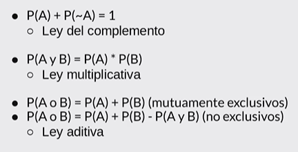
  <small><p>Probabilidades</p></small>
</div>

**Probabilidades en los dados**

* ¿Cuál es la probabilidad de obtener un 1?
* ¿Cuál es la probabilidad de obtener un 1 y un 2?
* ¿Cuál es la probabilidad de no obtener un 1?
* ¿Cuál es la probabilidad de no obtener un 1 en 10 tiros?
* ¿Cuál es la probabilidad de por lo menos obtener un 1 en 10 tiros?

<div align="center">
  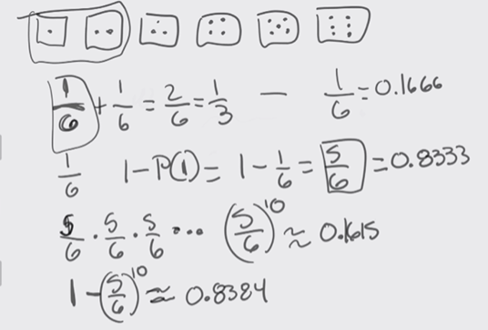
  <small><p>Probabilidades con dados</p></small>
</div>

A mayor número de simulaciones, los datos teoricos y los prácticos son más semejantes

<div align="center">
  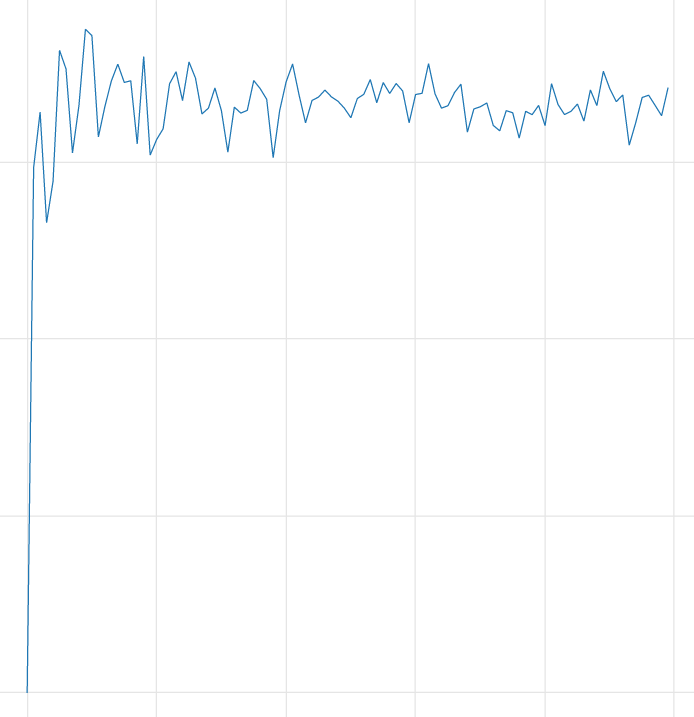
  <small><p>Simulación 1 - 10000</p></small>
</div>


## Inferencia estadística

* Con las simulaciones podemos calcular las probabilidades de eventos complejos sabiendo las probabilidades de eventos simples
* ¿Qué pasa cuando no sabemos las probabilidades de los eventos simples?
* Las técnicas de la inferencia estadística nos **permiten inferir/concluir las propiedades de una población a partir de una** **muestra aleatoria**

> El principio guía de la Inferencia Estadística es que una muestra aleatoria tiende a exhibir las mismas propiedades que la población de la que fue extraída
> **John Guttag**

### Proceso
<div align="center">
  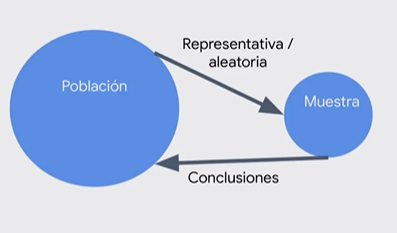
  <small><p>Proceso de muestreo</p></small>
</div>

<div align="center">
  
  <small><p>Obtención de muestras</p></small>
</div>

### Ley de los grandes números
* **En pruebas independientes repetidas** con la misma probabilidad p de un resultado, la fracción de desviaciones de p converge a cero conforme la cantidad de pruebas se acerca al infinito

<div align="center">
  
  <small><p>Ley de los grandes números</p></small>
</div>

### Falacia del apostador
* Señala que despues de un evento extremo, ocurrirán eventos menos extremos para nivelar la media
* **La regresión a la media señala que después de un evento aleatorio extremo, el siguiente evento probablemente será menos extremo**

> Cada evento es independiente

<div align="center">
  
  <small><p>Falacia del apostador</p></small>
</div>

### Medidas de tendencia central

#### Media
* Es una medida de tendencia central
* Comúnmente es **conocida como promedio**

> Nos indica dónde se encuentra la mayoría de los valores

<div align="center">
  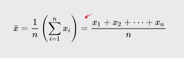
  <small><p>Media</p></small>
</div>

#### Varianza
* La varianza **mide que tan propagados se encuentran un conjunto de valores** **aleatorios de su media**
* Siempre debe entenderse con respecto a la media

<div align="center">
  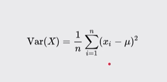
  <small><p>Varianza</p></small>
</div>

#### Desviación estándar
* **La desviación estándar es la raíz cuadrada de la varíanza**
* Nos permite entender, también, la propagación y se debe entender siempre relacionado a la media
* La ventaja sobre la varianza es que la desviación estándar está en las mismas unidades que la media

> Nos ayuda a conocer la dispersión de los datos

<div align="center">
  
  <small><p>Desviación estándar</p></small>
</div>

#### Distribución normal
* Es una de las distribuciones más recurrentes en cualquier ámbito
* **Se define completamente por su media y su desviación estándar**
* Permite **calcular intervalos de confianza** con la **regla empírica**

<div align="center">
  
  <small><p>Distribución normal</p></small>
</div>

> **Mientras la desviación estándar sea más pequeña la variabilidad de los datos es menor.** Se usa en las finanzas para calcular la inversión

<div align="center">
  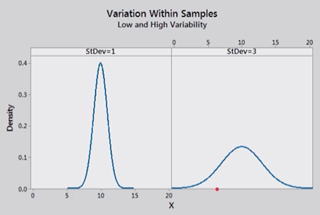
  <small><p>Variación de los datos</p></small>
</div>

##### Regla empírica
* También conocida como la regla 68-95-99.7
* Señala cuál es la dispersión de los datos en una distribución normal a uno, dos y tres sigmas
* Permite calcular probabilidades con la densidad de la distribución normal

> Permite analizar como se distribuye a través de una distribución normal los datos. Cuales son los datos que podemos encontrar a 1, 2 y 3 sigmas (desviaciones estándar) de distancia

<div align="center">
  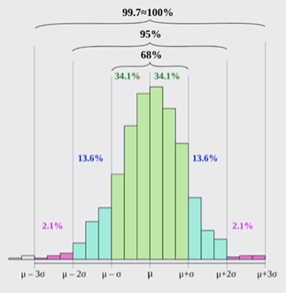
  <small><p>Regla empirica</p></small>
</div>

## Simulaciones de Montecarlo

> Se uso por primera vez para simular el juego de solitario en la computadora ENIAC

* **Permite crear simulaciones para predecir el resultado de un problema**
* Permite convertir problemas determinísticos en problemas estocásticos
* Es utilizado en una gran diversidad de áreas desde la ingeniearía hasta la biología y el derecho

> Juego de cartas

### Cálculo de PI

> PI es la cantidad de veces que cabe el diametro de un circulo en su circunferencia

https://www.youtube.com/watch?v=WJjDr67frtM

<div align="center">
  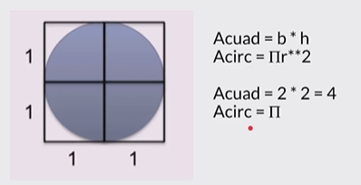
  <small><p>Calcular PI</p></small>
</div>

> Convertir un problema complejo en uno sencillo

<div align="center">
  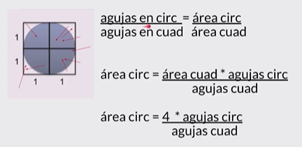
  <small><p>Calcular PI</p></small>
</div>

https://www.youtube.com/watch?v=pvimAM_SLic

<div align="center">
  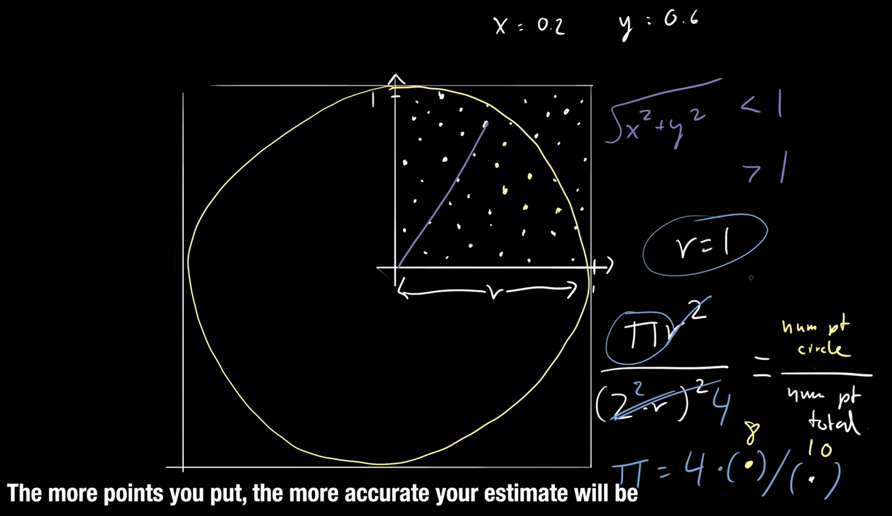
  <small><p>Calcular PI</p></small>
</div>

Cálculo del intervalo de confianza

https://www.youtube.com/watch?v=2wugQGs1GNY

https://es.wikipedia.org/wiki/Intervalo_de_confianza

## Muestreo
* Hay ocasiones en la que no tenemos acceso a toda la población que queremos explorar
* Uno de los grandes descubrimientos de la estadística es que **las muestras aleatorias tienden a mostrar las mismas propiedades de la población objetivo**
* El tipo de muestreo que hemos hecho hasta ahora es muestreo probabilistico
* En un muestreo aleatorio cualquier miembro de la población tiene la misma probabilidad de ser escogido
* En un **muestreo estratificado** tomamos en consideración las características de la población para **partirla en subgrupos y luego tomamos muestras de cada subgrupo**
  * Incrementa la probabilidad de que el muestreo sea representativo de la población


### Teorema del límite central
* Es uno de los teoremas más importantes de la estadística
* Establece que **muestras aleatorias de cualquier distribución van a tener una distribución normal**
*** Permite entender cualquier distribución como la distribución normal de sus medias** y eso nos permite aplicar todo lo que sabemos de distribuciones normales

<div align="center">
  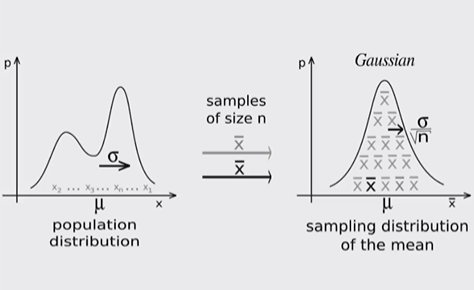
  <small><p>Teorema del limite central</p></small>
</div>

http://195.134.76.37/applets/AppletCentralLimit/Appl_CentralLimit2.html

https://www.youtube.com/watch?v=z2V1LX8tK7U&feature=youtu.be

https://www.youtube.com/watch?v=EC1bTDBz46k

## Datos experimentales
* Es la aplicación del método científico
* **Es necesario comenzar con una teoría o hipótesis sobre el resultado al que se quiere llegar**
* **Basado en la hipótesis se debe crear un experimento** para validar o falsear la hipótesis
* **Se valida o falsea una hipótesis midiendo la diferencia entre las mediciones** **experimentales y aquellas mediciones predichas por la hipótesis**

## Regresión lineal
* **Permite aproximar una función a un conjunto de datos** obtenidos de manera experimental
* No necesariamente permite aproximar funciones lineales, sino que sus variantes permiten aproximar cualquier funcion polinómica