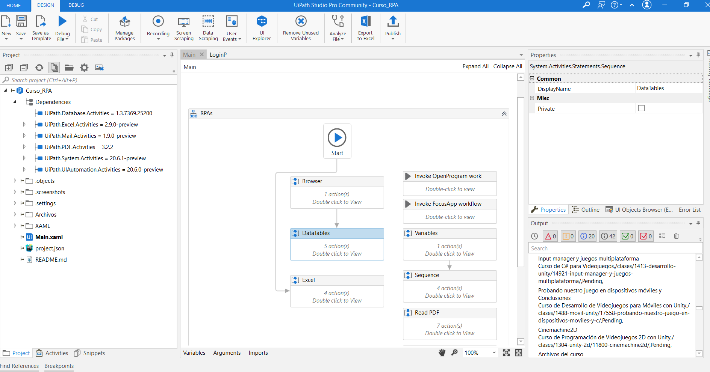

# RPAs con UiPath <!-- omit in toc -->

## Tabla de Contenido<!-- omit in toc -->
- [¿Quiénes participan en un proyecto RPA?](#quiénes-participan-en-un-proyecto-rpa)
- [Instalar y explorar UIPath](#instalar-y-explorar-uipath)
- [Introducción a REF](#introducción-a-ref)
  - [Ejemplos:](#ejemplos)

# ¿Quiénes participan en un proyecto RPA?

Para realizar una automatización de un proceso, existen múltiples involucrados, cada uno con una función específica, así mismo hay una relación muy estrecha entre los participantes. Ya que al ser una automatización de un proceso la mayor parte del desarrollo conlleva interactuar directamente con el dueño del proceso.

Los participantes se pueden dividir en 2 grupos:

**Solicitante de la Automatización:**

* Infraestructura de TI.
* Soporte de TI.
* Seguridad de la Información.
* Dueño del Proceso.

**Equipo de Desarrollo:**

* Desarrollador RPA.
* Arquitecto RPA.
* Analista de Negocio RPA.
* Ingeniero de Infraestructura RPA.

---

Funciones principales de los participantes.

**Infraestructura de TI:**

* Despliegan la infraestructura para los robots.
* Administran la infraestructura.
* Administran las redes de la infraestructura.
* Refrescan la información para las pruebas.
* Instalan las aplicaciones de la automatización.

**Soporte de TI:**

* Administración de credenciales.
* Dar permisos de acceso.
* Monitoreo de robots y procesos.
* Atención de incidentes.
* Solucionar problemas de la Aplicación.
* Seguridad de la Información:
* Certificación de la plataforma ¿Funciona como deseamos?

**Dueño del Proceso:**

* Son los solicitantes de una automatización.
* Quienes proporcionan toda la información del proceso (catálogo de datos,  reglas de negocio, etc).
* Proporcionan demostración en vivo del proceso (se recomienda grabarla) al Arquitecto, Analista y Ing. de Infraestructura RPA. (muchas veces es recomendable llevar al Desarrollador a esta demostración).

**Desarrollador RPA:**

* Desarrollador de la solución RPA.
* Trabaja de manera muy cercana al Analista y al Arquitecto.
* Mueve los procesos de etapa: de Desarrollo a Pruebas de Calidad cuando el desarrollo es finalizado.
* Provee asistencia nivel 1 al soporte de la aplicación durante las etapas de * Prueba de Calidad.

**Arquitecto RPA:**

El encargado de definir la solución ¿Cuántos módulos crearemos por proceso? ¿Cuál será la dependencia de ejecución de estos módulos?
Trabaja en conjunto con el Analista de Negocio.
Analista de Negocio RPA:

> ¿El proceso deseado cumple los requerimientos para ser automatizado? ¿Cuáles son los riegos de automatizar este proceso? ¿Robots atendidos o desatendidos?
Ingeniero de Infraestructura RPA:
> Definir la infraestructura para el robot ¿Cuántos robots necesitamos? ¿Cuántos orquestadores? ¿Equipos físicos o Servidores AWS?

# Instalar y explorar UIPath

https://cloud.uipath.com/

Se compone de 3 partes

* UiPath Robot - Servicio que windows ejecuta
* Orchestrator - Control y monitoreo
* Studio - Desarrollo drag and drop

  

# Introducción a REF

* Robotic Enterprise Framework
* Plantilla del proyecto
* Integrada al orquestador
* Basada en estados
* Basado en las mejores prácticas

## Ejemplos:

Automatizar pagos
Automatizar generación de gráficos
Automatizar minado de datos