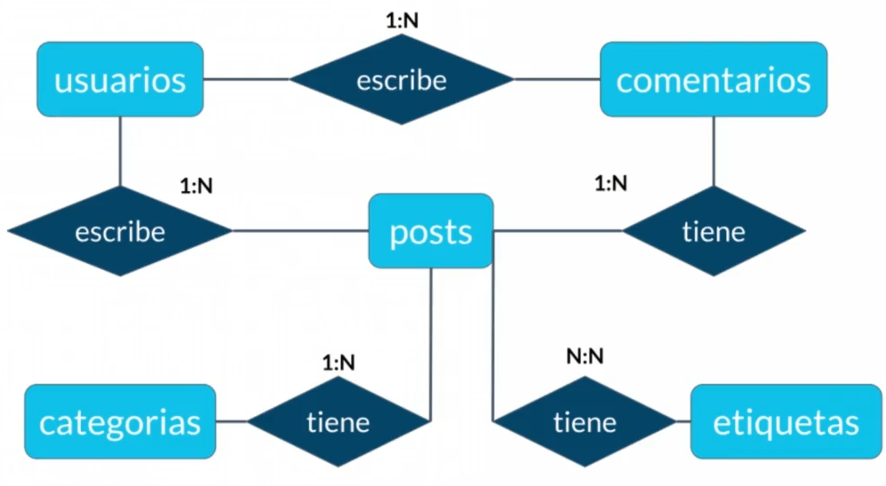
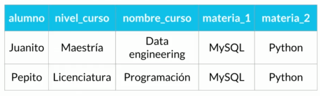
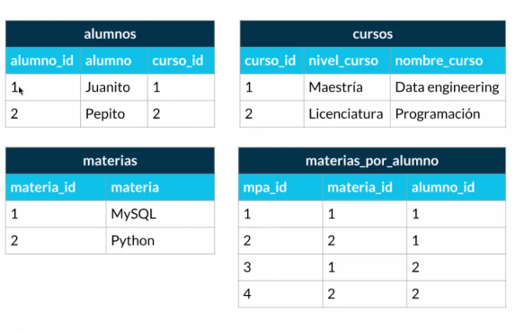
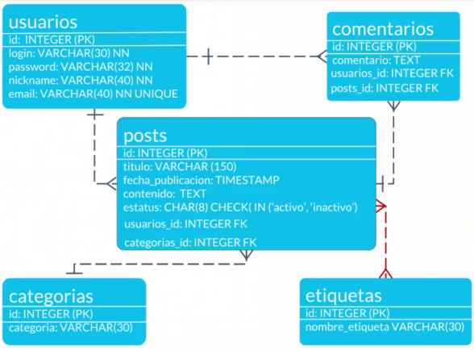
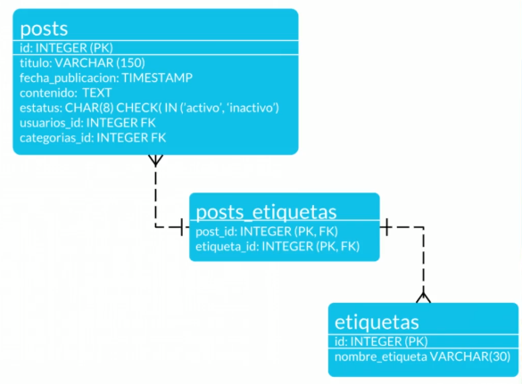
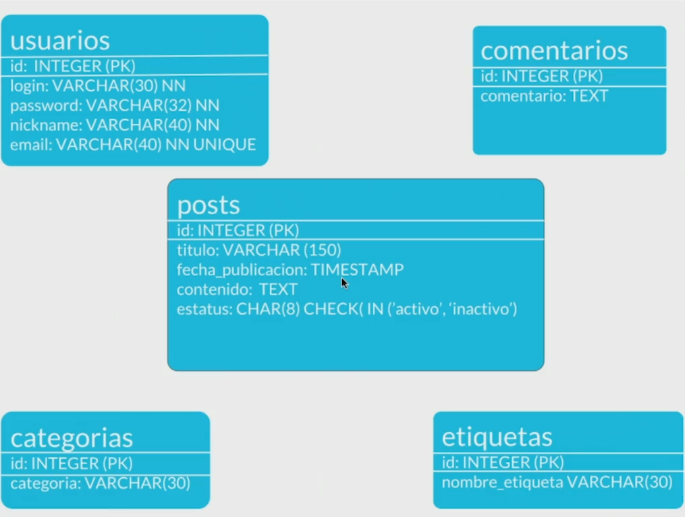

# Fundamentos de bases de datos<!-- omit in toc -->

## Tabla de Contenido<!-- omit in toc -->
- [Bases de datos relacionales](#bases-de-datos-relacionales)
  - [Aplicaciones de modelado de datos](#aplicaciones-de-modelado-de-datos)
  - [12 reglas de Codd](#12-reglas-de-codd)
    - [Reglas](#reglas)
  - [Conceptos fundamentales](#conceptos-fundamentales)
  - [Relaciones](#relaciones)
  - [Diagrama ER (Entidades y cardinalidades)](#diagrama-er-entidades-y-cardinalidades)
  - [Diagrama Físico (Tipos de datos y Restricciones)](#diagrama-f%c3%adsico-tipos-de-datos-y-restricciones)
    - [Diagrama Físico: normalización](#diagrama-f%c3%adsico-normalizaci%c3%b3n)
    - [Esquema del diagrama físico](#esquema-del-diagrama-f%c3%adsico)
  - [RDBMS](#rdbms)
    - [Acceso](#acceso)
  - [Lenguaje SQL](#lenguaje-sql)
    - [DDL](#ddl)
    - [DML](#dml)
    - [¿Qué tan Standard es SQL?](#%c2%bfqu%c3%a9-tan-standard-es-sql)
    - [Consultas a una base de datos](#consultas-a-una-base-de-datos)
    - [De una pregunta a un Query](#de-una-pregunta-a-un-query)
- [Bases de datos no relacionales](#bases-de-datos-no-relacionales)
  - [Firestore (Base de datos documental)](#firestore-base-de-datos-documental)
    - [Reglas](#reglas-1)

# Bases de datos relacionales

## Aplicaciones de modelado de datos

* Visual paradigm
https://online.visual-paradigm.com/
* Lucid chard
https://www.lucidchart.com/

## 12 reglas de Codd

Las 12 reglas de Codd son un sistema de reglas (numeradas del 0 al 12) propuestas por Edgar F. Codd, del modelo relacional para las bases de datos, diseñado para definir qué requiere un sistema de administración de base de datos.

Codd se percató de que existían bases de datos en el mercado las cuales decían ser relacionales, pero lo único que hacían era guardar la información en tablas, sin estar estas tablas literalmente normalizadas; entonces publicó 13 reglas que un verdadero sistema relacional debería cumplir, aunque en la práctica algunas de ellas son difíciles de realizar. Un sistema podrá considerarse "más relacional" cuanto más siga estas reglas.

### Reglas
* Regla 0: Regla de fundación. Cualquier sistema que se proclame como relacional, debe ser capaz de gestionar sus bases de datos enteramente mediante sus capacidades relacionales.
* Regla 1: Regla de la información. Toda la información en la base de datos es representada unidireccionalmente por valores en posiciones de las columnas dentro de filas de tablas. Toda la información en una base de datos relacional se representa explícitamente en el nivel Lógico exactamente de una manera: con valores en tablas.
* Regla 2: Regla del acceso garantizado. Todos los datos deben ser accesibles sin ambigüedad. Esta regla es esencialmente una nueva exposición del requisito fundamental para las llaves primarias. Dice que cada valor escalar individual en la base de datos debe ser lógicamente direccionable especificando el nombre de la tabla, la columna que lo contiene y la llave primaria.
* Regla 3: Regla del tratamiento sistemático de valores nulos. El sistema de gestión de base de datos debe permitir que haya campos nulos. Debe tener una representación de la "información que falta y de la información inaplicable" que sea sistemática y distinta de todos los valores regulares.
* Regla 4: Catálogo dinámico en línea basado en el modelo relacional. El sistema debe soportar un catálogo en línea, el catálogo relacional, que da acceso a la estructura de la base de datos y que debe ser accesible a los usuarios autorizados.
* Regla 5: Regla comprensiva del sublenguaje de los datos. El sistema debe soportar por lo menos un lenguaje relacional que:
Tenga una sintaxis lineal.
Puede ser utilizado de manera interactiva.
Tenga soporte de operaciones de definición de datos, operaciones de manipulación de datos (actualización así como la recuperación), de control de la seguridad e integridad y operaciones de administración de transacciones.
* Regla 6: Regla de actualización de vistas. Todas las vistas que son teóricamente actualizables deben poder ser actualizadas por el sistema.
* Regla 7: Alto nivel de inserción, actualización y borrado. El sistema debe permitir la manipulación de alto nivel en los datos, es decir, sobre conjuntos de tuplas. Esto significa que los datos no solo se pueden recuperar de una base de datos relacional a partir de filas múltiples y/o de tablas múltiples, sino que también pueden realizarse inserciones, actualización y borrados sobre varias tuplas y/o tablas al mismo tiempo y no solo sobre registros individuales.
* Regla 8: Independencia física de los datos. Los programas de aplicación y actividades del terminal permanecen inalterados a nivel lógico aunque realicen cambios en las representaciones de almacenamiento o métodos de acceso.
* Regla 9: Independencia lógicas de los datos. Los programas de aplicación y actividades del terminal permanecen inalterados a nivel lógico aunque se realicen cambios a las tablas base que preserven la información. La independencia de datos lógica es más difícil de lograr que la independencia física de datos.
* Regla 10: Independencia de la integridad. Las restricciones de integridad se deben especificar por separado de los programas de aplicación y almacenarse en la base de datos. Debe ser posible cambiar esas restricciones sin afectar innecesariamente a las aplicaciones existentes.
* Regla 11: Independencia de la distribución. La distribución de porciones de base de datos en distintas localizaciones debe ser invisible a los usuarios de la base de datos. Los usos existentes deben continuar funcionando con éxito:
cuando una versión distribuida del SGBD se carga por primera vez
cuando los datos existentes se redistribuyen en el sistema.
* Regla 12: La regla de la no subversión. Si el sistema proporciona una interfaz de bajo nivel de registro, aparte de una interfaz relacional, esa interfaz de bajo nivel no debe permitir su utilización para subvertir el sistema. Por ejemplo para sortear las reglas de seguridad relacional o las restricciones de integridad. Esto es debido a que a algunos sistemas no relacionales previamente existentes se les añadió una interfaz relacional pero, al mantener la interfaz nativa, seguía existiendo la posibilidad de trabajar no relacionalmente.

## Conceptos fundamentales
* **ENTIDAD:** Es un objeto o una cosa.
  * Se escriben en plural
    * Entidades fuertes: No dependen de ninguna otra entidad para existir.
    * Entidades débiles: No pueden existir sin una entidad fuerte. Se representan con un cuadrado de doble línea.
      * Débiles identidad:No se diferencien entre sí más que por la clave.
      * Débiles por existencia: Significa que aunque agregues un ID propio a esta entidad, si por contexto depende de una entidad fuerte, es débil por existencia.

Por ejemplo libros(fuerte) y ejemplares (debíl)

* **ATRIBUTO:** Es una característica o parte de una entidad, que juntos los diferentes atributos forman una entidad.
  * Compuestos: Poseen atributos en sí mismos
  * Llave: Son atributos que identifican a las entidades de los demás. Las llaves pueden ser naturales o artificiales.
    * Naturales: Son aquellas identificaciones que por su naturaleza identifican al atributo como el ISBN de un libro.
    * Clave artificial: Son las identificaciones que se asignan arbitrariamente para identificar un atributo.
  * Multivaluados: Atributos que poseen muchos de sí mismo se encierra en un doble círculo.

  <small><a href="#tabla-de-contenido">🡡 volver al inicio</a></small>

## Relaciones

Las relaciones nos permiten ligar o unir nuestras diferentes entidades y se representan con rombos. Por convención se definen a través de verbos.

Las relaciones tienen una propiedad llamada cardinalidad y tiene que ver con números. Cuántos de un lado pertenecen a cuántos del otro lado:

0 a 1: Puede que exista un elemento sin asociar
1 a 1: Solo un elemento puede tener otro elemento asociado.
1 a n: Un elemento tiene muchos otros elementos asociados.
0 a n: Un elemento puede estar asociado a muchos elementos.
n a n: Muchos elementos asociados a muchos elementos

## Diagrama ER (Entidades y cardinalidades)

  
  <small>
Diagrama ER
</small>

## Diagrama Físico (Tipos de datos y Restricciones)
Para llevar a la práctica un diagrama debemos ir más allá y darle detalle con parámetros como:

**Tipos de dato:**

* Texto: CHAR(n), VARCHAR(n), TEXT
* Números: INTEGER, BIGINT, SMALLINT, DECIMAL(n,s), NUMERIC(n,s)
* Fecha/hora: DATE, TIME, DATETIME, TIMESTAMP
* Lógicos: BOOLEAN

**Constraints (Restricciones)**

* NOT NULL: Se asegura que la columna no tenga valores nulos
* UNIQUE: Se asegura que cada valor en la columna no se repita
* PRIMARY KEY: Es una combinación de NOT NULL y UNIQUE
* FOREIGN KEY: Identifica de manera única una tupla en otra tabla
* CHECK: Se asegura que el valor en la columna cumpla una condición dada
* DEFAULT: Coloca un valor por defecto cuando no hay un valor especificado
* INDEX: Se crea por columna para permitir búsquedas más rápidas

### Diagrama Físico: normalización

  
  <small>
Desnormalizado
</small>

La normalización como su nombre lo indica nos ayuda a dejar todo de una forma normal. Esto obedece a las 12 reglas de Codd y nos permiten separar componentes en la base de datos:

* **Primera forma normal (1FN):** Atributos atómicos (Sin campos repetidos)
  * Todos los atributos son atómicos. Un atributo es atómico si los elementos del dominio son simples e indivisibles.
  * No debe existir variación en el número de columnas.
  * Los campos no clave deben identificarse por la clave (dependencia funcional).
  * Debe existir una independencia del orden tanto de las filas como de las columnas; es decir, si los datos cambian de orden no deben cambiar sus significados.
* **Segunda forma normal (2FN):** Cumple 1FN y cada campo de la tabla debe depender de una clave única.
  * Está en 1FN
  * Sí los atributos que no forman parte de ninguna clave dependen de forma completa de la clave principal. Es decir, que no existen dependencias parciales.
  * Todos los atributos que no son clave principal deben depender únicamente de la clave principal.
* **Tercera forma normal (3FN):** Cumple 1FN y 2FN y los campos que NO son clave, NO deben tener dependencias.
  * Esta FN nos ayuda a separar conceptualmente las entidades que no son dependientes.
* **Cuarta forma normal (4FN):** Cumple 1FN, 2FN, 3FN y los campos multivaluados se identifican por una clave única.
  * Esta FN nos trata de atomizar los datos multivaluados de manera que no tengamos datos repetidos entre rows.

  
  <small>
Normalizado
</small>

### Esquema del diagrama físico

  
  <small>
Diagrama físico
</small>

  
  <small>
Relación muchos a muchos
</small>

## RDBMS

RDBMS significa **Relational Database Management System o sistema manejador de bases de datos relacionales**. Es un programa que se encarga de seguir las reglas de Codd y se puede utilizar de manera programática.

### Acceso

Hay dos maneras de acceder a manejadores de bases de datos:

* Instalar en máquina local un administrador de bases relacional.
* Tener ambientes de desarrollo especiales o servicios cloud.
* En este curso usaremos MySQL porque tiene un impacto histórico siendo muy utilizado y además es software libre y gratuito. La versión 5.6.43 es compatible con la mayoría de aplicaciones y frameworks.

Root es el usuario principal que tendrá todos los permisos y por lo tanto en ambientes de producción hay que tener mucho cuidado al configurarlo.

## Lenguaje SQL

**SQL significa Structured Query Language** y tiene una estructura clara y fija. Su objetivo es hacer un solo lenguaje para consultar cualquier manejador de bases de datos volviéndose un gran estándar.

Ahora existe el **NOSQL o Not Only Structured Query Language** que significa que no sólo se utiliza SQLen las bases de datos no relacionales.

* Cassandra
* Big Query

SQL tiene dos grandes sublenguajes

### DDL
DDL o **Data Definition Language** que nos ayuda a crear la estructura de una base de datos. Existen 3 grandes comandos:

* Create: Nos ayuda a crear bases de datos, tablas, vistas, índices, etc.
* Alter: Ayuda a alterar o modificar entidades.
* Drop: Nos ayuda a borrar. Hay que tener cuidado al utilizarlo.

3 objetos que manipularemos con el lenguaje DDL:

* Database o bases de datos
* Table o tablas. Son la traducción a SQL de las entidades
* View o vistas: Se ofrece la proyección de los datos de la base de datos de forma entendible.

### DML
DML trata del contenido de la base de datos. Son las siglas de **Data Manipulation Language** y sus comandos son:

* Insert: Inserta o agrega nuevos registros a la tabla.
* Update: Actualiza o modifica los datos que ya existen.
* Delete: Esta sentencia es riesgosa porque puede borrar el contenido de una tabla.
* Select: Trae información de la base de datos.

### ¿Qué tan Standard es SQL?

Su utilidad fue unificar la forma en la que pensamos y hacemos preguntas a un repositorio de datos. Bases de datos que nacen siguen tomando elementos de SQL.

En muchas ocasiones el código funciona en varios manejadores

* MySql
* PostgreSQL

### Consultas a una base de datos
Son fundamentales ya que podrían salvar a un negocio o empresa.

Los usos se podrían dar en varias especialidades como:

* Business Intelligence
* Machine Learning
* Data Science

  
  <small>
Teoría de conjuntos
</small>

### De una pregunta a un Query
* Lo que quieres mostrar = SELECT
* De dónde voy a tomar los datos = FROM
* Los filtros de los datos que quieres mostrar = WHERE
* Los rubros por los que me interesa agrupar = GROUP BY
* El orden en que quiero presentar la información = ORDER BY
* Los filtros que quiero que mis datos agrupados  = HAVING

Funciones con group

* GROUP_CONCAT MySQL
* string_agg(DISTINCT t.name, ',') PostgreSQL

# Bases de datos no relacionales

Respecto a las bases de datos no relacionales, no existe un solo tipo aunque se engloben en una sola categoría.

Tipos de bases de datos no relacionales:

* **Clave - valor:** Son ideales para almacenar y extraer datos con una clave única. Manejan los diccionarios de manera excepcional. Ejemplos: DynamoDB, Cassandra.
* **Basadas en documentos:** Son una implementación de clave valor que varía en la forma semiestructurada en que se trata la información. Ideal para almacenar datos JSON y XML. Ejemplos: MongoDB, Firestore.
* **Basadas en grafos:** Basadas en teoría de grafos, sirven para entidades que se encuentran interconectadas por múltiples relaciones. Ideales para almacenar relaciones complejas. Ejemplos: neo4j, TITAN.
* **En memoria:** Pueden ser de estructura variada, pero su ventaja radica en la velocidad, ya que al vivir en memoria la extracción de datos es casi inmediata. Ejemplos: Memcached, Redis.
* **Optimizadas para búsquedas:** Pueden ser de diversas estructuras, su ventaja radica en que se pueden hacer queries y búsquedas complejas de manera sencilla. Ejemplos: BigQuery, Elasticsearch.

## Firestore (Base de datos documental)

Una base de datos como FireStore es útil para guardar el estado, pero no es recomendable para hacer consultas complejas

https://console.firebase.google.com/project/platziblog-8cedd/database?hl=es

  
  <small>
Diagrama
</small>

**Diferencias**

* Tablas -> colecciones
* Tuplas -> Documentos

Dentro de las colecciones existen dos grupos:1
* Top level collection o colecciones de nivel superior
* Subcolecciones que van dentro de un documento padre

### Reglas

* Piensa en la vista de tu aplicación: la estructura de base de datos debe ser un espejo que al menos contenga los datos necesarios para llenar las necesidades de la parte visual de la aplicación
* La colección tine vida propia: Se refiere cuando tenemos un caso en que la entidad que tiene necesidad de vivir y modificarse constantemente independiente a las otra colecciones