# PostgreSQL<!-- omit in toc -->

## Tabla de Contenido<!-- omit in toc -->
- [Introducción](#introducci%c3%b3n)
  - [Instalación](#instalaci%c3%b3n)
- [PostgreSQL](#postgresql)
  - [Consola de comandos](#consola-de-comandos)
    - [Comandos de navegación y consulta](#comandos-de-navegaci%c3%b3n-y-consulta)
    - [Comandos de inspección](#comandos-de-inspecci%c3%b3n)
    - [Debug y optimización](#debug-y-optimizaci%c3%b3n)
    - [Comandos para cerrar la consola](#comandos-para-cerrar-la-consola)
    - [Práctica en consola](#pr%c3%a1ctica-en-consola)
  - [PgAdmin](#pgadmin)
  - [Tipos de datos](#tipos-de-datos)
  - [Jerarquía de Base de Datos](#jerarqu%c3%ada-de-base-de-datos)
  - [Acciones](#acciones)
- [Particiones](#particiones)
    - [Roles en unsa base de datos](#roles-en-unsa-base-de-datos)
  - [LLaves foraneas](#llaves-foraneas)
  - [Inserción masiva de datos con Mockaroo](#inserci%c3%b3n-masiva-de-datos-con-mockaroo)
  - [Funciones especiales](#funciones-especiales)
    - [Principales](#principales)
    - [Avanzadas](#avanzadas)
  - [Vistas](#vistas)
  - [PL/PgSQL](#plpgsql)
    - [Triggers o disparadores](#triggers-o-disparadores)
  - [Obtener datos de Host remotos con DBLink](#obtener-datos-de-host-remotos-con-dblink)
  - [Transacciones](#transacciones)
  - [Otras extensiones de PgSQL](#otras-extensiones-de-pgsql)
    - [Funciones para comparar texto](#funciones-para-comparar-texto)
  - [Backup y restauración](#backup-y-restauraci%c3%b3n)
  - [Mantenimiento](#mantenimiento)
  - [Replicas (Solución al problema de lectura y escritura)](#replicas-soluci%c3%b3n-al-problema-de-lectura-y-escritura)
    - [Implementación de replicas](#implementaci%c3%b3n-de-replicas)
- [Proyecto de transporte masivo](#proyecto-de-transporte-masivo)

# Introducción

<div align="center">
  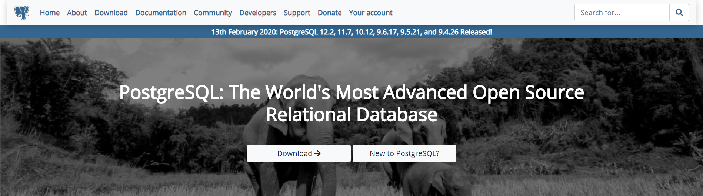
  <small><p>Postgress</p></small>
</div>

 Es un sistema de gestión de bases de datos relacional orientado a objetos y de código abierto, publicado bajo la licencia PostgreSQL,​ similar a la BSD o la MIT.

Características
* Open Source
* Objeto-Relacional
* Usa SQL
* Se creo en 1986
* PostGIS Servicio de geolocalización para procesar mapas y puntos
* PL/PgSQL Lenguaje dentro de la base de datos

Estandart ACID
* Atomicity - Atomicidad | Desarrollar las funciones en pequeñas tareas y hacer que funcionen como un todo
* Consistency - Consistencia | Los datos son congruentes
* Isolation - Aislamiento | Se pueden tener varias tareas al mismo tiempo, aislando las funciones que se realizan
* Durabiliad - Durabilidad | Seguridad de que la información no se va a perder

Por que PostgreSQL
* Tipos de datos
* Integridad de datos
* Concurrencia. Rendimiento
* Fiabilidad
* Seguridad
* Extensibilidad
* Internacionalidazación y búsquedas de texto

## Instalación

Descarga
https://www.postgresql.org/

# PostgreSQL

## Consola de comandos
Abrir SQL Shell (pgsql)

<div align="center">
  
  <small><p>Consola pgsql</p></small>
</div>

Ayuda
``\?``

Crear base de datos
``create database Transporte;``

> No olvides el **;**

### Comandos de navegación y consulta

Listar bases de datos
`\l`

<div align="center">
  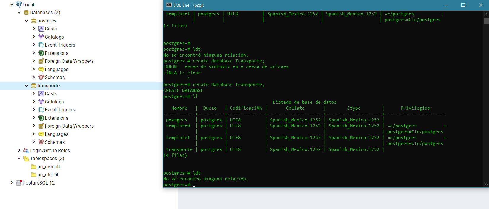
  <small><p>PGAdmin & Shell Console</p></small>
</div>

Acceder a una base de datos

`\c transporte`

Ver tablas
`\dt`

Describir una tabla
``\d viajero``

Lista esquemas de la base de datos actual
`\dn`

Lista las funciones disponibles en la bd
`\df`

Lista las vistas
`\dv`

Lista los usuarios y roles de la bd
`\du`

Ver comandos de SQL que podemos hacer en la base de datos
``\h``

Version de Postgress
``SELECT version();``


### Comandos de inspección

Muestra los comandos ejecutados en la bd de todos los usuarios
``\g``

Muestra el historial de comandos
``\s``

Envia la lista de comandos a un archivo
`\s <archivo>`

Ejecuta los comandos desde un archivo
`\i <archivo>`

Permite abrir un texto plano, escriir comandos y ejecuta en lote. Luego de guardar y cerrar se ejecutaran todos los comandos
`\e`

Equivalente al comando anterior pero permite editar también funciones en PostgreSQL
`\ef`

### Debug y optimización

Activa el tiempo de ejecución de comandos
``\timing``

### Comandos para cerrar la consola

Cerrar la consola
`\q`

### Práctica en consola

Crear una tabla

```sql
CREATE TABLE tren(
    id serial not null, 
    modelo character varying, 
    capacidad integer,
    CONSTRAINT tren_pkey PRIMARY KEY (id));
```

Insertar datos

```sql
INSERT INTO tren(
    modelo, capacidad
) VALUES ('Volvo 1', 100);
```

Seleccionar los datos

```sql
SELECT * FROM tren;
```

Modificar

```sql
UPDATE tren SET modelo = 'Honda 0726' WHERE id = 1;
```
Eliminar

```sql
DELETE FROM tren WHERE id = 1;
```

Medición de tiempo
```sql
SELECT MD5('Vamos a encriptar un texto como el que lees');
```

## PgAdmin

Es la interfaz gráfica para administrar la base de datos

<div align="center">
  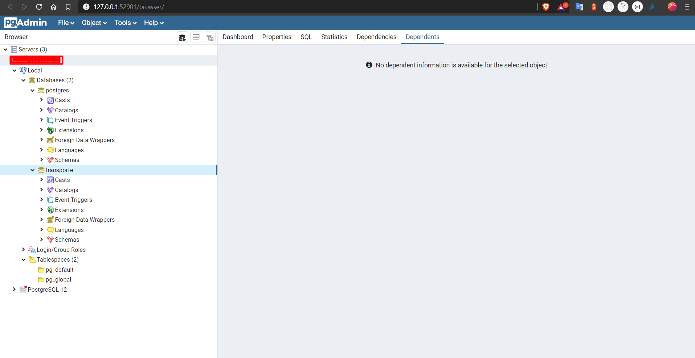
  <small><p>PGAdmin & Shell Console</p></small>
</div>

Estructura

<div align="center">
  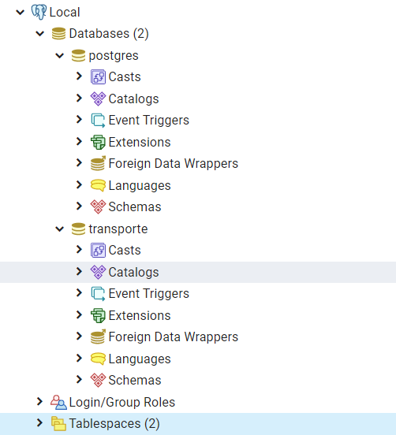
  <small><p>Estructura de PGAdmin</p></small>
</div>

Las bases de datos template 0 y template 1 son modelos de bases de datos privadas, mientras que la de postgress es interna para que trabaje el motor

Dashboard y opciones

<div align="center">
  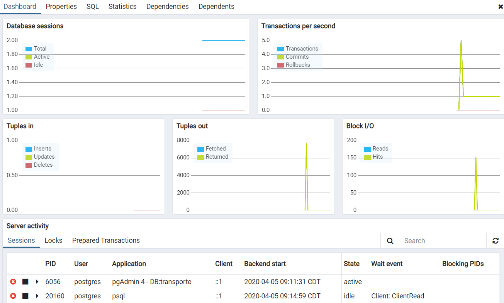
  <small><p>Dashboard de uso</p></small>
</div>

Ejecución de Querys

<div align="center">
  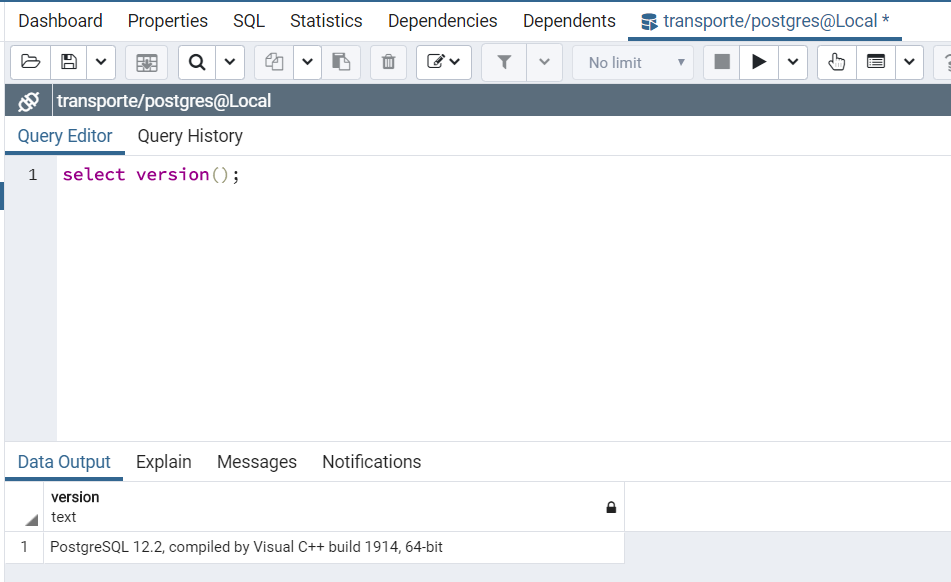
  <small><p>Querys</p></small>
</div>

Archivos de configuración:
* postgresql.conf - Configuración general de postgres, múltiples opciones referentes a direcciones de conexión de entrada, memoria, cantidad de hilos de procesamiento, replicación, etc
* pg_hba.conf - Roles y tipos de acceso a la base de datos
* pg_ident.conf - Permite realizar el mapeo de usuarios

Para ver la ruta ejecutar:

`show config_file;`

## Tipos de datos

Documentación oficial: https://www.postgresql.org/docs/9.2/datatype.html

Principales
* Numéricos
* Monetarios
* Texto
* Binarios
* Fecha / Hora
* Boolean

Especiales
* Geométricos
* Dirección de red
* Texto tipo bit / Exadesimal o binario
* XML/JSON
* Arreglos - Vectores y matrices

## Jerarquía de Base de Datos

Toda jerarquía se basa en los siguientes elementos

* Servidor de base de datos. Computador que tiene un motor de base de datos instalado en ejecución
* Motor de BD. Software que provee un conjunto de servicios encargados de administrar una base de datos
* Base de datos. Grupo de datos que pertenece a un mismo contexto
* Esquema de bd en pgsql. Grupo de objetos de bd que guarda un relación entre sí (tablas, funciones, relaciones, secuencias)
* Tablas de base de datos. Estructura que organiza los datos en filas y columnas formando una matriz

## Acciones
* Create
* Alter
* Drop

# Particiones
Utiles cuando la información es bastante en una tabla y el motor recorrera toda la tabla

* Separación física de datos. Guarda varias partes de la tabla en varias partes de disco
* Estructura lógica. Funciona con el mísmo select

Se pueden crear particiones por mes para optimizar las consultas

> Al momento de crear tablas particionadas no es posible usar PK, ya que la información está dividida
> Su uso es para casos donde queramos acceder a información en masa
> Estas tablas acceden a tablas en las que si existe un PK
> Funciona para información historica

```sql
CREATE TABLE public."History_Trips"
(
    id serial,
    id_trip integer,
    date date
) PARTITION BY RANGE (date) ;

ALTER TABLE public."History_Trips"
    OWNER to postgres;

CREATE TABLE history_trips_202000401 PARTITION OF history_trips
FOR VALUES FROM ('2020-04-01') TO ('2020-04-30');

-- Test partition

INSERT INTO history_trips(
	id_trip, date)
	VALUES (1, '2020-04-05');
	
SELECT * FROM history_trips;
```

### Roles en unsa base de datos
* Crear y eliminar
* Asignar atributos
* Agrupar con otros  roles
* Roles predeterminados

Lo optimo es crear un usuario con los niveles de seguridad necesarios

`\h CREATE ROL`

Un usuario y un rol es lo mismo en postgres

```sql
CREATE USER usuario_consulta;
```

Ver información de usuarios

`\dg`

<div align="center">
  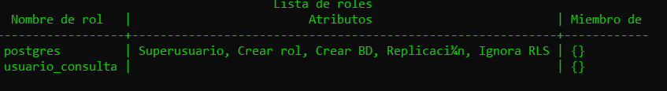
  <small><p>Roles</p></small>
</div>

```sql
ALTER USER usuario_consulta WITH LOGIN;
ALTER USER usuario_consulta WITH SUPERUSER;
ALTER USER usuario_consulta WITH PASSWORD 'hola';
DROP USER usuario_consulta;

CREATE ROLE elias WITH
	LOGIN
	NOSUPERUSER
	NOCREATEDB
	NOCREATEROLE
	INHERIT
	NOREPLICATION
	CONNECTION LIMIT -1
	PASSWORD 'xxxxxx';
```

Permisos

<div align="center">
  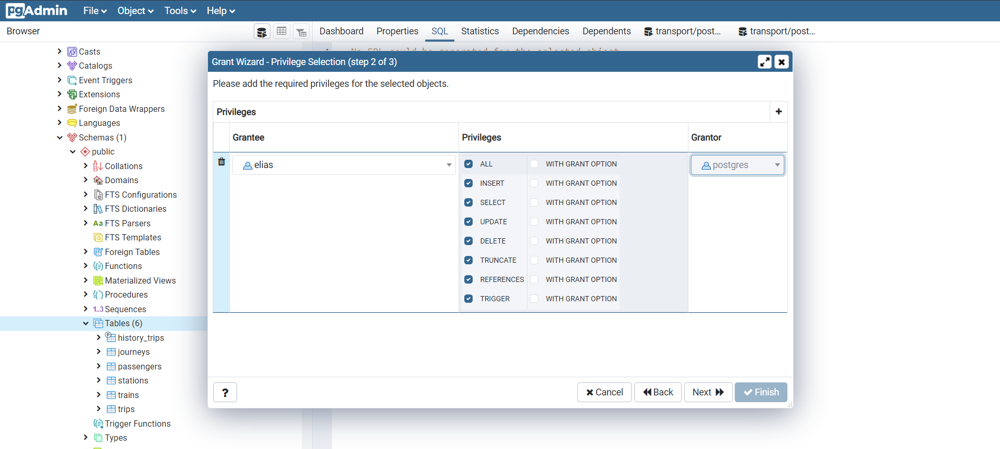
  <small><p>Asignación de permisos</p></small>
</div>

```sql
GRANT INSERT, SELECT, UPDATE ON TABLE public.history_trips TO elias;

GRANT INSERT, SELECT, UPDATE ON TABLE public.history_trips_202000401 TO elias;

GRANT INSERT, SELECT, UPDATE ON TABLE public.journeys TO elias;

GRANT INSERT, SELECT, UPDATE ON TABLE public.passengers TO elias;

GRANT INSERT, SELECT, UPDATE ON TABLE public.stations TO elias;

GRANT INSERT, SELECT, UPDATE ON TABLE public.trains TO elias;

GRANT INSERT, SELECT, UPDATE ON TABLE public.trips TO elias;
```

## LLaves foraneas
* Estructura
  * Tabla origen
  * Tabla destino
  * Acciones

## Inserción masiva de datos con Mockaroo

https://www.mockaroo.com/

## Funciones especiales

### Principales
* On conflict do. Si hay conflicto permite actualizar o no hacer nada al insertar
* Returning. Inserta y regresa la tupla
* Like / Ilike. Permite buscar por expresiones regulares
* Is / Is not. Permite buscar entre nulos

Commands

```sql
insert into stations(id, name, address) values(2, 'A name', 'Dir') on conflict(id) do update set name='A Name', address='dir'

insert into stations(name, address) values('A name', 'Dir') RETURNING *;

select name from passengers where name ilike '%Ale%'
select * from trains where model is not null;
```

### Avanzadas 
* Coalesce. Cambia un null en un select por un texto
* Nullif. Si dos campos son iguales retorna null
* Greatest. Retorna el mayor de una secuencia de numeros separados por comas
* Least. Retorna el menor de una secuencia de numeros peparados por comas
* Bloques anonimos. Condiciones dentro de consultas

```sql
select * from passengers order by name desc
select COALESCE(name, 'No aplica'),* from passengers where id = 2

select 1/nullif(0,0) as a;

select GREATEST(0,1,2,3,4,5,6,7,7);
select LEAST(0,1,2,3,4,5,6,7,7);

select GREATEST(0,1,2,3,4,5,6,7,7);
select LEAST(0,1,2,3,4,5,6,7,7);

select *, 
case when birthday > '2005-01-01' then 'niño' else 'mayor' end
from passengers

select *, 
case when name ilike 'p%' then 'Empieza con P' else 'Otra letra' end as P, 
case when birthday <= (current_date - interval '18 year') then 'Mayor de edad' else 'Menor de edad' end as Mayor 
from passengers
```

## Vistas
* Volatil. Siempre que la consulta se haga la vista va a hacer la consulta a la base de datos
* Materializada persistente. Queda almacenada en memoria hasta que no se actualice

```sql
CREATE OR REPLACE VIEW rangeview
 AS
select *, 
case when name ilike 'p%' then 'Empieza con P' else 'Otra letra' end as P, 
case when birthday <= (current_date - interval '18 year') then 'Mayor de edad' else 'Menor de edad' end as Mayor 
from passengers;

ALTER TABLE rangeview
    OWNER TO postgres;

select * from rangeview

select * from trips where start_trip > '2019-01-01'

CREATE MATERIALIZED nightsview_mv
AS
select * from trips where start_trip > '2019-01-01'
WITH NO DATA;

ALTER TABLE nightsview_mv
    OWNER TO postgres;
	
REFRESH MATERIALIZED VIEW nightsview_mv;
	
select * from nightsview_mv;
```

## PL/PgSQL
* Lenguaje de procedimientos almacenados

Procedimientos almacenados

```sql
DO $$
BEGIN
	RAISE NOTICE 'Algo está pasando';
END
$$
```

```sql
DO $$
DECLARE
	rec record;
	contador integer := 0;
BEGIN
	FOR rec IN SELECT * FROM passengers LOOP
		RAISE NOTICE 'Un pasajer se llama %', rec.name;
		contador:= contador+1;
	END LOOP;
	RAISE NOTICE 'Conteo es %', contador;
END
$$
```

```sql
CREATE FUNCTION mypl()
	RETURNS void
AS $$
DECLARE
	rec record;
	contador integer := 0;
BEGIN
	FOR rec IN SELECT * FROM passengers LOOP
		RAISE NOTICE 'Un pasajer se llama %', rec.name;
		contador:= contador+1;
	END LOOP;
	RAISE NOTICE 'Conteo es %', contador;
END
$$
LANGUAGE PLPGSQL;

select mypl();
```

```sql
DROP FUNCTION mypl;
CREATE OR REPLACE FUNCTION mypl()
	RETURNS integer
AS $$
DECLARE
	rec record;
	contador integer := 0;
BEGIN
	FOR rec IN SELECT * FROM passengers LOOP
		RAISE NOTICE 'Un pasajer se llama %', rec.name;
		contador:= contador+1;
	END LOOP;
	RAISE NOTICE 'Conteo es %', contador;
	RETURN contador;
END
$$
LANGUAGE PLPGSQL;

select mypl();
```

```sql
CREATE FUNCTION public.mypl()
    RETURNS integer
    LANGUAGE 'plpgsql'
    
    
AS $BODY$
DECLARE
	rec record;
	contador integer := 0;
BEGIN
	FOR rec IN SELECT * FROM passengers LOOP
		RAISE NOTICE 'Un pasajer se llama %', rec.name;
		contador:= contador+1;
	END LOOP;
	RAISE NOTICE 'Conteo es %', contador;
	RETURN contador;
END
$BODY$;

ALTER FUNCTION public.mypl()
    OWNER TO postgres;
```

### Triggers o disparadores
Son acciones que ocurren cuando ocurre algo
* Insert
* Update
* Delete

```sql
-- FUNCTION: public.mypl()

-- DROP FUNCTION public.mypl();

CREATE OR REPLACE FUNCTION public.mypl(
	)
    RETURNS trigger
    LANGUAGE 'plpgsql'    
AS $BODY$
DECLARE
	rec record;
	contador integer := 0;
BEGIN
	FOR rec IN SELECT * FROM passengers LOOP
		RAISE NOTICE 'Un pasajer se llama %', rec.name;
		contador:= contador+1;
	END LOOP;
	INSERT INTO count_passengers (total,time)
	VALUES (contador, now());
	-- RETURN OLD Para no hacer modificaciones
	RETURN NEW;
END
$BODY$;

CREATE TRIGGER mitrigger
AFTER INSERT
ON passengers
FOR EACH ROW
EXECUTE PROCEDURE mypl();

INSERT INTO passengers(name, address, birthday) VALUES('Name trigger', 'DIr ACa', '2000-09-10')

SELECT * FROM count_passengers;
```

## Obtener datos de Host remotos con DBLink

Puedes acceder a datos de otras bases de otros servidores usando DBLink

```sql
CREATE EXTENSION dblink;

select * from passengers
JOIN
dblink('dbname=remote 
		 port=5432 
		 host=127.0.0.1 
		 user=elias 
		 password=qwerty',
		 'SELECT id, date from vip_users') as remote_data(id integer, date date)
USING (id);
```

## Transacciones
Procesos complejos seguros

```sql
BEGIN;

INSERT INTO trains(model, capacity)
VALUES('Model Trans', 123);

INSERT INTO stations(id, name, address)
VALUES(108,'Station Transact', 'Address Transact');

COMMIT;

SELECT * FROM stations order by id desc
SELECT * FROM trains order by id desc
```

## Otras extensiones de PgSQL

Lista de todas las extensiones para PostgreSQL
https://www.postgresql.org/docs/11/contrib.html

### Funciones para comparar texto

Letras que hay que cambiar para que coincida

```sql
CREATE EXTENSION fuzzystrmatch;

select levenshtein('oswaldo','osvaldo');

select difference ('oswaldo','osvaldo');

select soundex('oswaldo'), soundex('osvaldo');

select soundex('beard'), soundex('bird');
select levenshtein('beard','bird');
select difference ('beard','bird');
```

## Backup y restauración
* PgDump
* PgRestore
  
<div align="center">
  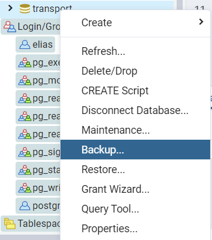
  <small><p>Respaldo</p></small>
</div>

<div align="center">
  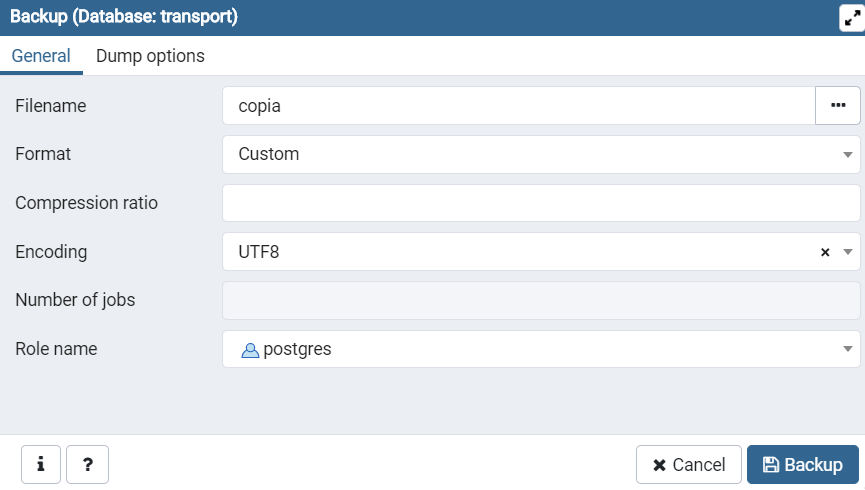
  <small><p>Respaldo</p></small>
</div>

<div align="center">
  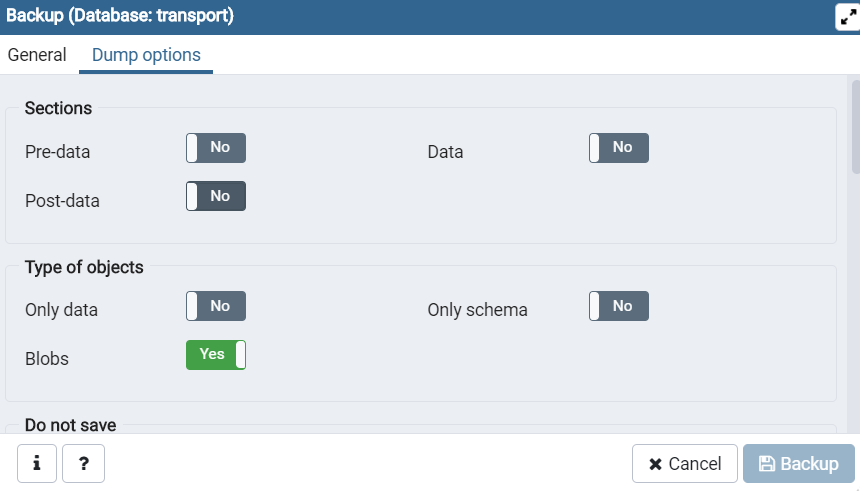
  <small><p>Respaldo</p></small>
</div>

Para restaurar crear una base de datos nueva y ejecutar el asistente de restauración

## Mantenimiento

Postgres gestiona mantenimiento en segundo plano
* Vacuum. Quita todas las filas columnas e items que no están funcionando

Limpiado liviano (las hace constantemente) y completo donde bloquea las tablas para hacer la limpieza

<div align="center">
  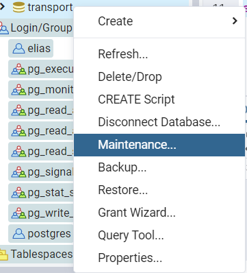
  <small><p>Mantenimiento</p></small>
</div>

<div align="center">
  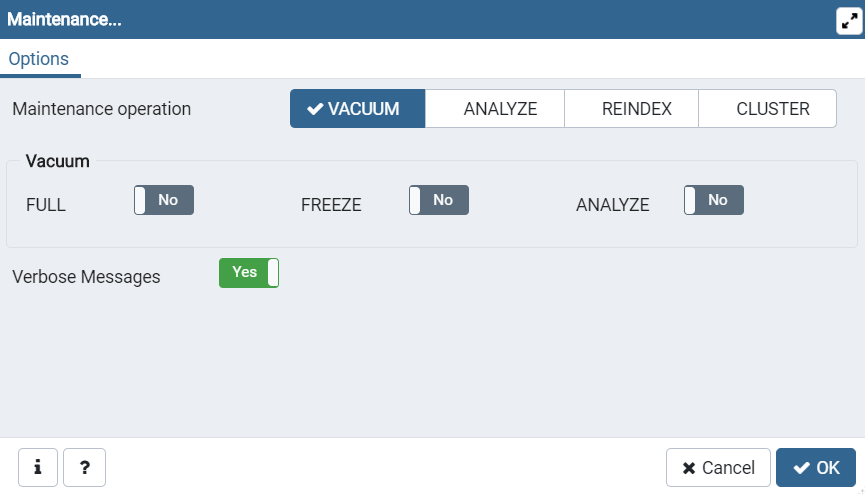
  <small><p>Opciones de mantenimiento</p></small>
</div>

* Full. La tabla quedará limpia en su totalidad
* Freeze. Durante el proceso la tabla se congela y no permite modificaciones hasta terminar la limpieza
* Analyze. No hace cambios en la tabla. Sólo hace una revision y la muestra. No hace cambios en la tabla. Solo hace una revisión maestra
* Reindex. Aplica para tablas con numerosos registros con indices como por ejemplo las llaves primarias
* Cluster. Especificamos al motor de base de datos que reorganice la información en el disco
 
## Replicas (Solución al problema de lectura y escritura)
* Existen dos tipos de personas, los que ya usan replicas y los que las van a usar. Piensa siempre en modo replica

Limites de física y electrónica, no pueden ser sobrepasados los recursos de tu servidor

Contar por lo menos con dos servidores un maestro y un esclavo

* Una para lecturas (Esclavo)
* Otra para cambios (Maestro)

### Implementación de replicas

Servicio en la nube
https://cloudify.co/

Se necesitan dos instancias de PgSQL y se configura en PgAdmin

Modificación en Master
Se modifica postgresql.conf


# Proyecto de transporte masivo

Base de datos para un sistema de transporte

* Pasajero
* Trayecto
* Estación
* Tren
* Viaje

<div align="center">
  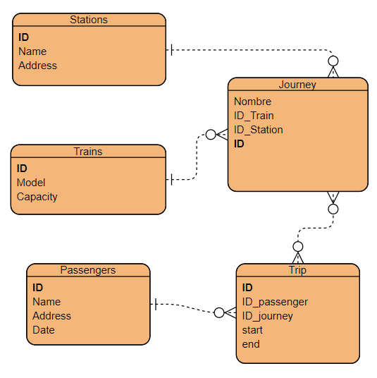
  <small><p>Diagrama ER</p></small>
</div>

Código del proyecto en está carpeta