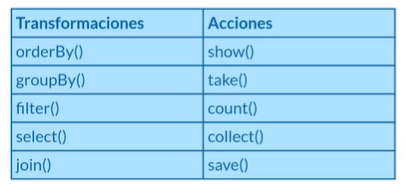
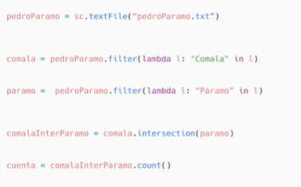
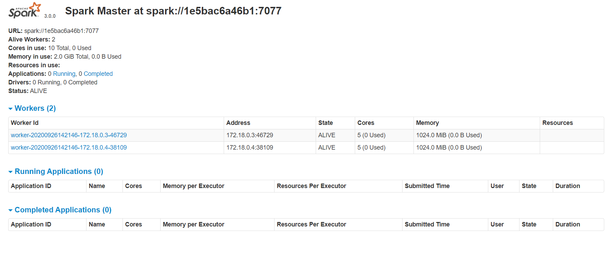

# Spark <!-- omit in toc -->

## Tabla de Contenido<!-- omit in toc -->
- [Introducción](#introducción)
  - [Lenguajes](#lenguajes)
  - [¿Qué no es apache spark?](#qué-no-es-apache-spark)
  - [Historia](#historia)
  - [Spark vs Hadoop](#spark-vs-hadoop)
- [Introducción a los RDDs y DataFrames](#introducción-a-los-rdds-y-dataframes)
  - [Caracteristicas de los RDD](#caracteristicas-de-los-rdd)
    - [Transformaciones y acciones](#transformaciones-y-acciones)
  - [DataFrame](#dataframe)
  - [¿Cuándo usar un RDD?](#cuándo-usar-un-rdd)
  - [¿Cuándo usar DataFrames?](#cuándo-usar-dataframes)
  - [Instalación](#instalación)
- [Operaciones RDDs](#operaciones-rdds)
  - [RDD](#rdd)
  - [DataFrames](#dataframes)
  - [Monitoreo](#monitoreo)

# Introducción

Es un framework de desarrollo de procesos de Big Data

* Preocupado por la velocidad del proceso (continuos y en tiempo real)
* Hadoop se preocupa por almacenar grandes cantidades de datos

## Lenguajes

* Java
* Scala
* Python
* R

## ¿Qué no es apache spark?

* No es una base de datos
  * OLAP - Base de datos transaccional
  * OLTP - Bases de datos para Datawarehouse

## Historia

* Nace en 2009
* Heredera de Hadoop es el paso siguiente a la tecnología Hadoop
* La versión 3 fue liberada el 10 de Junio de 2020

## Spark vs Hadoop

* Spark se enfoca en procesamiento de datos desde RAM
* Posee naturalmente un módulo para ML, Streaming y grafos
* No depende de un sistema de archivos

# Introducción a los RDDs y DataFrames

Son las dos principales estructuras que soporta spark
Los RDD son el componente m[inimo con el cual podemos comunicarnos en spark

## Caracteristicas de los RDD

* Principal abstracción de datos (Abstracción básica)
* Distribuidos en todo el clúster
* Creación simple. No poseen estructura formalmente adoptan la más intuitiva
* Inmutabilidad. Posterior a su creción no se pueden modificar
* Ejecución perezosa. A menos que se realice una acción

### Transformaciones y acciones

<div align="center">
  
</div>

<div align="center">
  
</div>

## DataFrame

* Tienen un formato, poseen columnas con tipos de datos
* Optimización. Tienen una mejor implementación, lo cual los hace preferibles
* Facilidad de creación. Se pueden crear desde una base de datos externa o RDD externa

## ¿Cuándo usar un RDD?

* Cuando te interese controlar el flujo de Spark
* Si eres usuario de Python, convertir a RDD un conjunto permite mejor control de los datos
* Estás conectándote a versiones antiguas de Spark

## ¿Cuándo usar DataFrames?

* Si poseemos semánticas de datos complicados
* Vamos a realizar tareas de alto nivel como filtros, mapeos, agregaciones, promedios o sumas
* Si vamos a usar sentencias SQL-like

## Instalación

**Manual:**

```sh
sudo add-apt-repository ppa:openjdk-r/ppa
sudo apt-get -y update
sudo apt-get -y install openjdk-8-jre
sudo apt-get -y install python3
sudo apt-get -y install scala
sudo apt-get -y install python3-pip
sudo pip3 install py4j
```

py4j

Ver documentación del paquete: Traduce Python a Java

https://pypi.org/project/py4j/
https://www.py4j.org

Descarga desde aquí: https://spark.apache.org/downloads.html

```sh
tar -xvf spark-2.4.6-bin-hadoop2.7.tgz
mv spark-2.4.6-bin-hadoop2.7 spark
mv spark ~/
rm spark-2.4.6-bin-hadoop2.7
ls ~/
```

Para anaconda

```sh
wget https://repo.anaconda.com/archive/Anaconda3-2020-02-Linux-x86_64.sh
ls
sh Anaconda3-2020-02-Linux-x86_64.sh -b
rm -rf /home/spark/anaconda3

export PATH=/home/spark/anaconda3/bin:$PATH
condata install py4j
```

Variables de entorno para que puedan ser utilizables

```sh
pwd
# home/spark
nano .bashrc
```

Agrega lo siguiente al archivo

```txt
## Path Java
export JAVA_HOME="/usr/lib/jvm/java-8-openjdk-amd64"
export PATH=$JAVA_HOME/bin:$PATH
## SPARK
export SPARK_HOME="/home/spark/spark"
export PATH=$SPARK_HOME:$PATH
export PYTHONPATH=$SPARK_HOME/python:$PYTHONPATH
export PYSPARK_PYTHON=python3
```

Refrescar configuraciones

```sh
source .bashrc
```

```sh
cd spark/bin/
# pyspark (CLI) y spark-submit (EXEC)
```

Ejecutar un ejemplo que lee un csv

```sh
../spark/bin/spark-submit yourcode.py yourdata.csv
```

**Con Docker:**

https://github.com/big-data-europe/docker-spark

<div align="center">
  
</div>

# Operaciones RDDs

**Todas las aplicaciones en Spark poseen un manejador central de programa (Driver) y varios ejecutores** que se crean a lo largo del clúster, estas son las computadoras que realizarán las tareas en paralelo y finalmente devolverán los valores al driver, la aplicación central.

## RDD

Para poder realizar estas tareas, Spark posee desde su versión 1.0 los **RDD (Resilient Distributed Dataset)**, los cuales son tolerantes a fallos y pueden ser distribuidos a lo largo de los nodos del clúster.

**Los RDD pueden ser creados al cargar datos de manera distribuida**, como es desde un HDFS, Cassanda, Hbase o cualquier sistema de datos soportado por Hadoop, pero también por **colecciones de datos de Scala o Python**, **además de poder ser leídos desde archivos en el sistema local.**

En visión general, **un RDD puede ser visto como un set de datos** los cuales soportan solo dos tipos de operaciones: **transformaciones y acciones.**

**Las transformaciones permiten crear un nuevo RDD a partir de uno previamente existente**, mientras que las acciones retornan un valor al driver de la aplicación. **El núcleo de operación del paradigma de Spark es la ejecución perezosa** **(Lazy)**, es decir que las transformaciones solo serán calculadas posterior a una llamada de acción.

Además, los RDD poseen una **familiaridad con el paradigma orientado a objetos**, lo cual permite que podamos realizar operaciones de bajo nivel a modo. **Map, filter y reduce son tres de las operaciones más comunes.**

Una de las grandes ventajas que ofrecen los RDD es la **compilación segura**; por su particularidad de ejecución perezosa, se calcula si se generará un error o no antes de ejecutarse, lo cual permite identificar problemas antes de lanzar la aplicación. El pero que podemos encontrar con los RDD es que no son correctamente tratados por el Garbage collector y cuando las lógicas de operación se hacen complejas, su uso puede resultar poco práctico, aquí entran los DataFrames.

## DataFrames

Esos componentes fueron agregados en la versión 1.3 de Spark y pueden ser invocados con el contexto espacial de Spark SQL. Como indica su nombre, **es un módulo especialmente desarrollado para ser ejecutado con instrucciones parecidas al SQL estándar.**

> De la misma forma, como los RDD, estos pueden ser creados a partir de archivos, tablas tipo Hive, bases de datos externas y RDD o DataFrames existentes.

El primer detalle que salta cuando creamos un DataFrame es que poseen **columnas nombradas**, lo que a nivel conceptual es como trabajar con un **DataFrame de Pandas**. Con la excepción que a nivel interno **Spark trabaja con Scala, lo cual le asigna a cada columna el tipo de dato Row, un tipo especial de objeto sin tipo definido.**

Pero no es todo, los DataFrames implementan un sistema llamado **Catalyst**, el cual es un motor de optimización de planes de ejecución, parecido al que usan las bases de datos, pero diseñado para la cantidad de datos propia de Spark, aunado a eso, se tiene implementado un optimizador de memoria y consumo de CPU llamado **Tungsten**, el cual determina cómo se convertirán los planes lógicos creados por Catalyst a un plan físico.

## Monitoreo

https://spark.apache.org/docs/latest/monitoring.html