# Big Data Tools <!-- omit in toc -->

## Tabla de Contenido<!-- omit in toc -->
- [Introducción](#introducción)
  - [¿Qué proveedor elegir?](#qué-proveedor-elegir)
- [Arquitecturas](#arquitecturas)
  - [Lambda](#lambda)
  - [Kappa](#kappa)
  - [Batch](#batch)
- [AWS](#aws)
  - [Extracción de información](#extracción-de-información)
    - [Llevar tu información al cloud](#llevar-tu-información-al-cloud)
    - [IDE en la nube con Python - Boto3](#ide-en-la-nube-con-python---boto3)

# Introducción

Algunos puntos para tomar en cuenta al momento de iniciar en el manejo de datos en la nube, sin importar qué servicio utilices, son:

  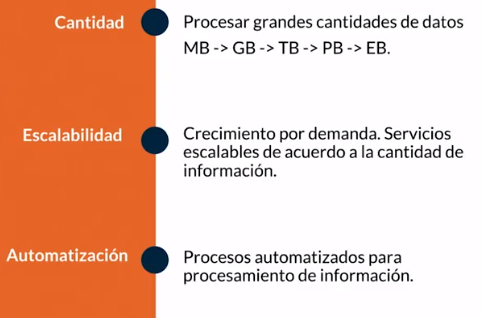

  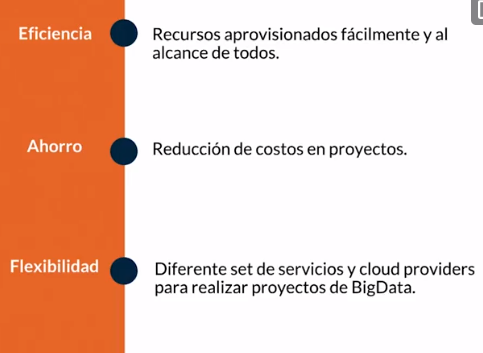

Hay algunos puntos importantes que debemos tener en cuenta al momento de manejar nuestra data en un servicio en la nube:

* Debemos seleccionar el servicio que mejor se ajuste a nuestras necesidades de almacenamiento.
* Lo primero que debemos hacer es extraer de otras fuentes la información que vamos a necesitar.
* Debemos validar nuestra información, verificar que sea consistente.
Verificar los tipos de datos que vamos a extraer.
* Al momento de realizar pruebas a nuestra información debemos utilizar un subset de la data.

  

  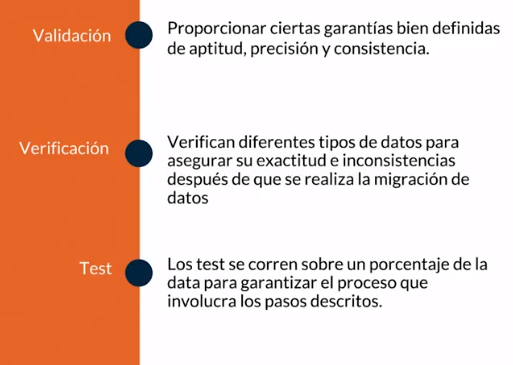

## ¿Qué proveedor elegir?

Actualmente el mercado de Cloud Computing tiene varios actores compitiendo entre sí por atraer la mayor cantidad de clientes a sus nubes

Dentro de esta variedad de proveedores muchas veces es complejo tomar decisiones de cuál utilizar, el criterio para esta decisión puede estar dado por diferentes factores como:

1. **Costo:** Valor de los servicios que serán utilizados en el proyecto.
2. **Tipo de pricing:** Por demanda (por hora, minuto o segundo), subasta, reservado.
3. **Servicios:** Variedad de servicios provistos por el cloud provider. ¿Cuál servicio se ajusta mejor a mis necesidades?
4. **Ubicación:** Distribución de las regiones/zonas donde el cloud provider preste servicios por temas de latencia y experiencia usuario esto puede ser decisivo.
5. **Niveles de Servicio:** Consultar la documentación por servicio y los niveles ofrecidos de disponibilidad.
6. **Soporte:** Tipos de soporte, costo, tiempos de respuesta y nivel de soporte (basic, business, enterprise).
7. **Estudios de mercado:** Revisar los diferentes estudios de mercado, por ejemplo: el cuadrante mágico de Gartner, en los cuales se evalúan en diferentes aspectos los servicios provistos.
8. **Documentación:** Consultar la documentación de los cloud provider, muchas veces no es muy clara o está incompleta referente a sus servicios.

  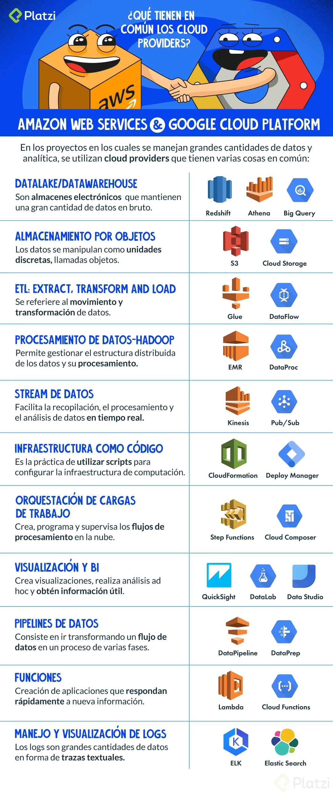

# Arquitecturas

## Lambda

La arquitectura Lambda es atribuida a Nathan Marz, diseñada para ser escalable, tolerante a fallos y de alto procesamiento de datos.

Tiene una gran robustez, puede procesar una alta cantidad de datos. Está compuesta por tres capas:

* **Batch:** En esta capa vamos a procesar toda la información almacenada con anterioridad, desde el día anterior hasta meses.
* **Serve:** Dentro de esta capa es posible visualizar la data procesada de la capa batch.
* **Speed:** Conforme llega la data se va a ir procesando.

  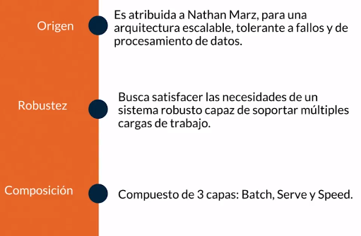

  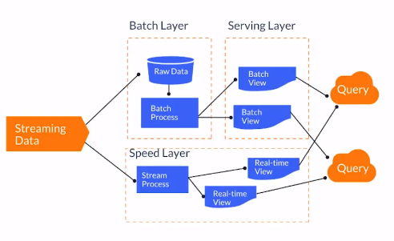

## Kappa

Fue presentada por Jay Krepsen en el 2014 como una evolución de la arquitectura lambda. Elimina la capa batch haciendo que todo se procese en tiempo real.

La arquitectura Kappa sigue los siguientes pilares:

Todo es un stream.
Información de origen no modificada.
Solo un flujo de procesamiento.
Capaz de reprocesar.

  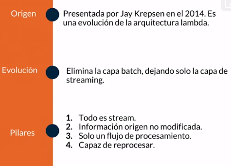

  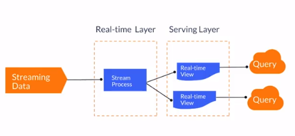

## Batch

Esta arquitectura es una parte específica de la arquitectura Lambda.

Es importante comprender que en esta arquitectura vamos a tener un Input, un proceso y un Output, estos tres orquestados por un sistema donde el Input y Output deben de conectarse a una base de datos.

  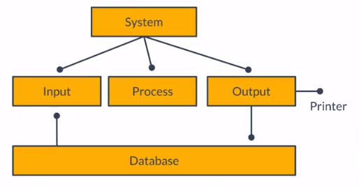

# AWS

## Extracción de información

### Llevar tu información al cloud

Existen distintas formas de conectar tu sistema en la nube con la fuente de origen de datos que necesitas, algunas opciones son:

* Utilizar el SDK de la nube utilizando el lenguaje de programación de tu preferencia.
* Usar el CLI para conectarse a la nube.
* Utilizar servicios especializados para la tarea.
* Es posible combinar esas opciones para llevar la información que necesites a tu cloud provider.

  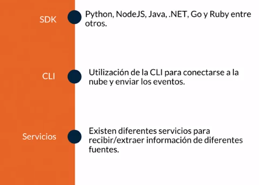

### IDE en la nube con Python - Boto3

Python es una gran opción para procesamiento de datos ya que cuenta con librerías como Pandas, Anaconda PyBrain, NumPy.

  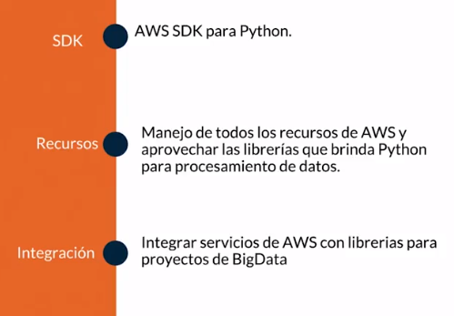

https://boto3.amazonaws.com/v1/documentation/api/latest/index.html