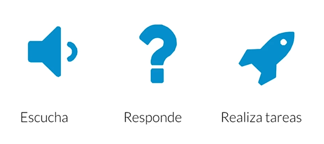

# Celery <!-- omit in toc -->

> Conceptos clave de Django

## Tabla de Contenido<!-- omit in toc -->
- [Introducción](#introducción)
  - [Brokers de tareas](#brokers-de-tareas)
    - [Algunos brokers de tareas:](#algunos-brokers-de-tareas)
  - [Cuándo debemos usar celery](#cuándo-debemos-usar-celery)
  - [Casos de uso de Celery](#casos-de-uso-de-celery)
- [Bots](#bots)
  - [Casos de uso:](#casos-de-uso)
  - [¿Cómo lo hace?](#cómo-lo-hace)
  - [Aplicaciones que admiten Bots](#aplicaciones-que-admiten-bots)
  - [API de Slack para bots](#api-de-slack-para-bots)
  - [¿Cómo crear un bot reactivo?](#cómo-crear-un-bot-reactivo)
  - [Posibles aplicaciones de un bot](#posibles-aplicaciones-de-un-bot)
  - [Creación de los bots](#creación-de-los-bots)
- [Brokers de mensajeria](#brokers-de-mensajeria)
  - [¿Qué es un broker de mensajería y cuándo debe usarse?](#qué-es-un-broker-de-mensajería-y-cuándo-debe-usarse)
  - [Conceptos](#conceptos)
  - [Brokers de mensajería open source](#brokers-de-mensajería-open-source)

# Introducción

Celery es una biblioteca en Python para **gestionar colas de tareas distribuidas.** Es software libre y está liberado con una licencia BSD. Cuenta con con más de diez mil commits en este momento en Github.

No es la única. Tiene ciertos equivalentes en otros lenguajes, pero no hay ninguna que sea igual

**Ventajas**

* Escabilidad
* Eficiencia
* Orden de transacciones garantizado
* Resistencia a fallos
* Aguantar picos de mensajes

**Sirve para**

* Dividir el Backed de una aplicación en receptor y realizadores de tareas
* Uniformizar la respuestas del backend
* Crear arquitecturas de microservicios

<div align="center">
  
</div>

https://swapps.com/es/blog/como-integrar-tu-aplicacion-python-a-slack-usando-bots/

## Brokers de tareas

Colas de tareas, brokers de mensajes o brokers de tareas son servicios de mensajes que actúan como intermediarios, son servicios que están trabajando en recibir y emitir mensajes todo el tiempo. **Enrutan, agregan y permiten crear servicios de publicación/suscripción(pubsub).**

### Algunos brokers de tareas:

* RabbitMQ escrito en Erlang
* Kafka escrito en Scala y Java
* Redis escrito en C
* ActiveMQ escrito en Java
* También tenemos sistemas de mensajería privativos en la nube: AWS SQS, Azure Service Bus, Google Cloud Messaging, Firebase Cloud Messaging.

**Usos y ventajas:**

* Sincronización de datos entre diferentes partes de un sistema
* Eliminación del almacenamiento central de datos
* Activación segura de microservicios
* Almacenamiento persistente de datos.
* Redundancia.

> Sal del monolito con arquitectura basadas en eventos.

## Cuándo debemos usar celery

Cuando vayas a escribir una arquitectura basada en Python, cuando trabajes con **Django, Flask o una aplicación de Ciencia de Datos con Panda o Scikit** puedes usar Celery porque es la única herramienta que nos ofrece estas posibilidades.

**Celery en Producción:**

* Registro y almacenamiento (sin repuesta al origen)
* Intermediar entre servicio web (Flask, Django) y otros microservicios
* Ejecución retrasadas de tareas

**Celery frente a otras alternativas:**

* Modelo genérico y abstracto(frente a Pika, Django-carrot)
* Más usada que Dramatiq.
* Soporte para más brokers y más configurables que RQ
* Más configurable que Huey

> Celery es única en su género y su uso es aconsejable casi siempre.

## Casos de uso de Celery

Casos de usos actuales:

* CKAN, el almacén para datos abiertos, lo usa para ejecutar tareas y procesar webhooks.
* Airflow es un sistema de flujos de trabajo o workflow que usa Celery para mensajería
* Uso con Django.

# Bots

**Un bot es un programa que actúa como interlocutor en un software de mensajería**, es una **nueva interfaz de usuario**, es una nueva forma de interacción. El software debe estar preparado para reaccionar a una orden y dar una respuesta inmediata.

> Un Bot siempre está escuchando sin perder ningún mensaje, responde lo que necesitas y realiza tareas.

<div align="center">
  
</div>

## Casos de uso:

* **Atención inmediata** al cliente.
* Solicitudes de **información de búsquedas**.
* **Comprobaciones de identidad y de seguridad**.
* **Información de otro lugar y alertas.**
* Juegos.

## ¿Cómo lo hace?
* A través de una API provista por la aplicación
* Bibliotecas que abstraen la API
* Backend que procesa las peticiones y responde a las mismas
* Interacción con el usuario

## Aplicaciones que admiten Bots
* Slack
* Telegram
* FB Messenger

## API de Slack para bots

1. Crea una app con Slack: https://api.slack.com/apps/new
2. Agregar ganchos de entrada
   * Add features and functionality
   * Bots
   * Permission - Obteneer fichas para usar desde nuestro programa

https://cookiecutter-project.slack.com/apps

## ¿Cómo crear un bot reactivo?

**Celery es una biblioteca en Python para gestionar colas de tareas distribuidas.** Es software libre y está liberado con una licencia BSD. Cuenta con con más de diez mil commits en este momento en Github. Cuenta con algunas ventajas como escabilidad, eficiencia, orden de transacciones garantizado, resistencia a fallos, aguantar picos de mensajes

```python
git clone https://github.com/JJ/slack-bot-platzi.git 
cd slack-bot-platzi
sudo pip install -r requirements.txt
touch .env
```

## Posibles aplicaciones de un bot

* **Un bot puede escuchar**, almacenar información de conversaciones, analizar esas conversaciones para realizar análisis de sentimientos

* Puede responder, Inteligencia Artificial en las conversaciones, acceder a información fija y almacenada, juegos conversacionales. 

* Puede realizar tareas como búsquedas en motores de búsqueda, consultar a base de datos o almacenes de imágenes, consultar agendas o agendar.

## Creación de los bots
* Decidir que comandos va a usar
* Crear la infraestructura para que respondan a ese comando
* Programar el comando específio

# Brokers de mensajeria

## ¿Qué es un broker de mensajería y cuándo debe usarse?
Un broker de mensajería o message-oriented middleware es algo que está en medio, un intermediario. El broker de mensajería se va asegurar de que lo mensajes lleguen a su destino y esos mensajes tendrán una serie de cliente.

Nunca hacen una interacción directa de uno a otro ya que sería una interacción síncrona.

## Conceptos

En el mundo de los brokers de mensajería se utilizan principalmente dos tipos de metáforas. Unas vienen del mundo del correo, donde hay mensajes que tienen un emisor y un receptor, como una carta. Pero no todos los mensajes son de este tipo: hay mensajes que se emiten y puede recibir mucha gente: usamos en este caso metáforas del mundo de la radio.

En la radio tenemos un emisor que es el que emite el mensaje. Ese mensaje se retransmite, es decir, se hace un broadcast, de forma que todo el mundo puede recibirlo. En este caso no importa demasiado que quien escuche acuse recibo del mensaje, simplemente que haya un mecanismo eficiente que permita hacer llegar, a todos los que lo deseen, el mensaje que se emita.

**¿Y quién va a recibir ese mensaje?**

En el mundo de la radio, diferentes canales tienen diferente programación, y los oyentes seleccionan un canal para escuchar. En el mundo de los brokers de mensajería, los canales permiten concentrar los mensajes y que no se mezclen los relativos a diferentes tareas o partes de la aplicación, y adicionalmente los canales pueden tener suscriptores que serán los que únicamente reciban un mensaje que se envíe a este canal.

A este mecanismo se le denomina también pub/sub, o **publicación/suscripción**. Cuando el emisor publica, lo hace en un canal. Los posibles receptores son suscriptores del canal y simplemente tienen que indicar el canal al que quieren escuchar para ser alertados y funcionar de forma reactiva cada vez que un nuevo mensaje se emita en el canal.

**Las estafetas**

Las estafetas, intercambiadores o exchanges permiten regular este tráfico de publicación y suscripción y asignar a diferentes canales dependiendo de una serie de reglas. Los intercambiadores son fundamentales y le añaden flexibilidad a este tipo de sistemas, permitiendo el envío programable de mensajes dependiendo en metadatos de los mismos o incluso en su contenido.

La mayor parte de los brokers de mensajería pueden trabajar de las dos formas. **Los brokers siguen protocolos tales como AMQP (Advanced Queue Messaging Protocol)** que permite trabajar como correos y emisora de radio. **AMQP se implementa en diferentes brokers de mensajería tales como RabbitMQ o ActiveMQ.**

Otros protocolos se centran sólo en una parte de este mundo de la mensajería: **MQTT, Message Queuing Telemetry Transport es un protocolo pub/sub, de publicación y suscripción.**

**Las colas de tareas**

Por la variedad de protocolos y diferencia de implementaciones, muchas veces lo que se busca por parte del desarrollador es una biblioteca de alto nivel que abstraiga esto y permita trabajar con conceptos que estén en el dominio del problema. Celery, por ejemplo, usa principalmente el concepto de cola de tareas. Esto permite al usuario diseñar la aplicación en función de qué tareas se quiere que se ejecuten y de qué forma (con qué periodicidad, con qué prioridad) se van a ejecutar.

A la vez, Celery tiene acceso a los mecanismos básicos (intercambiadores, colas de mensajes), que se pueden programar de la forma que desee. Partiendo de una aplicación básica, Celery te permite crecer hasta hacer una verdadera aplicación avanzada de cómputo distribuido.

## Brokers de mensajería open source

**Características comunes:**

* Protocolos de mensajerías usados.
* Soporte de estándares de mensajería, cómo se envían, reciben y procesan los mensajes.
* Licencias libres.
* API REST, a parte de usarlos con una librería puedes trabajar con ellos con un simple API.
* Soporte Activo.

**Principales Brokers**

* **RabbitMQ**: Cola de tareas distribuida y robusta.
* **ActiveMQ/Apollo**: Cola de mensajes de altas prestaciones con soporte de JMS.
* **RocketMQ**: Message-oriented middleware con MQTT y JMS
* **Apache Kafka**: Sistema orientado a procesamiento de streams en tiempo real.
* **NATS**: Sistema de mensajería distribuido.

> **RabbitMQ:** Es el más popular y el que tiene más soporte de bibliotecas. Es relativamente simple de instalar y mantener, tiene una buena comunidad para soportarlo.