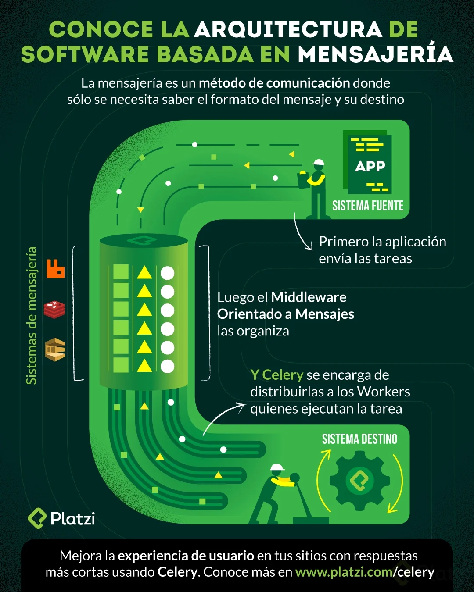

# Celery <!-- omit in toc -->

> Conceptos clave de Django

## Tabla de Contenido<!-- omit in toc -->
- [Introducción](#introducción)
- [Brokers de tareas](#brokers-de-tareas)
  - [Algunos brokers de tareas:](#algunos-brokers-de-tareas)
- [Cuándo debemos usar celery](#cuándo-debemos-usar-celery)
- [Casos de uso de Celery](#casos-de-uso-de-celery)

## Introducción

Celery es una biblioteca en Python para **gestionar colas de tareas distribuidas.** Es software libre y está liberado con una licencia BSD. Cuenta con con más de diez mil commits en este momento en Github.

No es la única. Tiene ciertos equivalentes en otros lenguajes, pero no hay ninguna que sea igual

**Ventajas**

* Escabilidad
* Eficiencia
* Orden de transacciones garantizado
* Resistencia a fallos
* Aguantar picos de mensajes

**Sirve para**

* Dividir el Backed de una aplicación en receptor y realizadores de tareas
* Uniformizar la respuestas del backend
* Crear arquitecturas de microservicios

  

## Brokers de tareas

Colas de tareas, brokers de mensajes o brokers de tareas son servicios de mensajes que actúan como intermediarios, son servicios que están trabajando en recibir y emitir mensajes todo el tiempo. **Enrutan, agregan y permiten crear servicios de publicación/suscripción(pubsub).**

### Algunos brokers de tareas:

* RabbitMQ escrito en Erlang
* Kafka escrito en Scala y Java
* Redis escrito en C
* ActiveMQ escrito en Java
* También tenemos sistemas de mensajería privativos en la nube: AWS SQS, Azure Service Bus, Google Cloud Messaging, Firebase Cloud Messaging.

**Usos y ventajas:**

* Sincronización de datos entre diferentes partes de un sistema
* Eliminación del almacenamiento central de datos
* Activación segura de microservicios
* Almacenamiento persistente de datos.
* Redundancia.

> Sal del monolito con arquitectura basadas en eventos.

## Cuándo debemos usar celery

Cuando vayas a escribir una arquitectura basada en Python, cuando trabajes con **Django, Flask o una aplicación de Ciencia de Datos con Panda o Scikit** puedes usar Celery porque es la única herramienta que nos ofrece estas posibilidades.

**Celery en Producción:**

* Registro y almacenamiento (sin repuesta al origen)
* Intermediar entre servicio web (Flask, Django) y otros microservicios
* Ejecución retrasadas de tareas

**Celery frente a otras alternativas:**

* Modelo genérico y abstracto(frente a Pika, Django-carrot)
* Más usada que Dramatiq.
* Soporte para más brokers y más configurables que RQ
* Más configurable que Huey

> Celery es única en su género y su uso es aconsejable casi siempre.

## Casos de uso de Celery

Casos de usos actuales:

* CKAN, el almacén para datos abiertos, lo usa para ejecutar tareas y procesar webhooks.
* Airflow es un sistema de flujos de trabajo o workflow que usa Celery para mensajería
* Uso con Django.