# Entrenamiento Google Cloud Platform <!-- omit in toc -->

## Tabla de Contenido<!-- omit in toc -->
- [Validar mejor zona](#validar-mejor-zona)
- [Introducción](#introducción)
  - [Laboratorios oficiales de Google](#laboratorios-oficiales-de-google)
- [Computo en la nube](#computo-en-la-nube)
    - [La nube pública](#la-nube-pública)
    - [¿Por qué Google?](#por-qué-google)
  - [Opciones de cómputo en la nube](#opciones-de-cómputo-en-la-nube)
  - [Maquinas virtuales (Compute Engine)](#maquinas-virtuales-compute-engine)
    - [Laboratorios](#laboratorios)
  - [Plataforma como servicio (App Engine)](#plataforma-como-servicio-app-engine)
    - [Contenedores](#contenedores)
      - [Docker](#docker)
    - [Laboratorios](#laboratorios-1)
  - [Cómputo contenerizado (App Engine Flex)](#cómputo-contenerizado-app-engine-flex)
    - [Acceso a VPC](#acceso-a-vpc)
    - [Sabores de App Engine](#sabores-de-app-engine)
  - [Serverless](#serverless)
    - [Serverles y contenedores](#serverles-y-contenedores)
    - [Cloud functions](#cloud-functions)
      - [Evento detonador (Triggers)](#evento-detonador-triggers)
- [Continous Integration](#continous-integration)
  - [Pipelines](#pipelines)
  - [Prácticas](#prácticas)
  - [Estrategias de Despliegue](#estrategias-de-despliegue)
  - [Repositorios](#repositorios)
  - [Infraestructura como código](#infraestructura-como-código)
  - [Despliegue en Servicios Serverless](#despliegue-en-servicios-serverless)
- [Kubernetes](#kubernetes)
  - [DEMO](#demo)
  - [Planeación de tus ambientes](#planeación-de-tus-ambientes)
  - [Anthos](#anthos)
  - [Cloud Run for Anthos](#cloud-run-for-anthos)
  - [Anthos Service MESH](#anthos-service-mesh)
- [Machine learning](#machine-learning)


# Validar mejor zona

http://www.gcping.com/

# Introducción

Apuntes del entrenamiento en Google - Platzi

<div align="center">
  
</div>

<div align="center">
  
</div>

## Laboratorios oficiales de Google

Material oficial para realizar prácticas
https://www.qwiklabs.com/

# Computo en la nube

<div align="center">
  
</div>

### La nube pública

Según NIST (Instituto Nacional de Estándares y Tecnología)

* Autoservicio bajo demanda
* Acceso de red amplio
* Recursos compartidos
* Elasticidad acelerada
* Medición de servicio
* Amigable con el ambiente* Energía renovable y huella de carbono 0

### ¿Por qué Google?
<div align="center">
  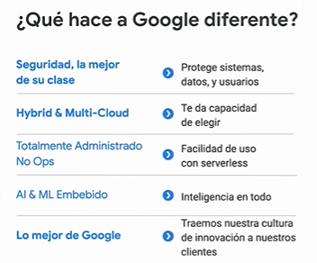
</div>

Compañia enfocada en IA

<div align="center">
  
</div>

<div align="center">
  
</div>

**Seguridad en multiples capas**

* Chips, servidores, almacenamiento, red y centros de datos a la medida
* Cifrado por defecto en tránsito y en descanso
* Una de las redes más extensas del mundo, minimizando el riesgo del internet público

130 puntos de presencia en más de 35 países que carga el 40% de Internet

<div align="center">
  
</div>

**Compromiso con el código libre**

Tecnología que más se adapte a tus necesidades

<div align="center">
  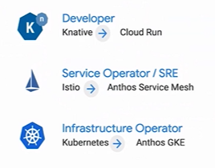
</div>

<div align="center">
  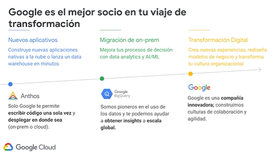
</div>

## Opciones de cómputo en la nube

<div align="center">
  
</div>

* **Compute engine.** Son maquinas virtuales
  * https://cloud.google.com/compute/?hl=es-419
* **Kubernetes.** Abstrae la infraestructura y las aplicaciones
  * https://cloud.google.com/kubernetes-engine?hl=es
* **App Engine.** Le damos el código y Google se encarga
  * https://cloud.google.com/appengine?hl=es-419
* **Cloud Run y Cloud Functions.** Serverless, funciones, microservicios que hacen cosas especificas
  * https://cloud.google.com/serverless?hl=es

<div align="center">
  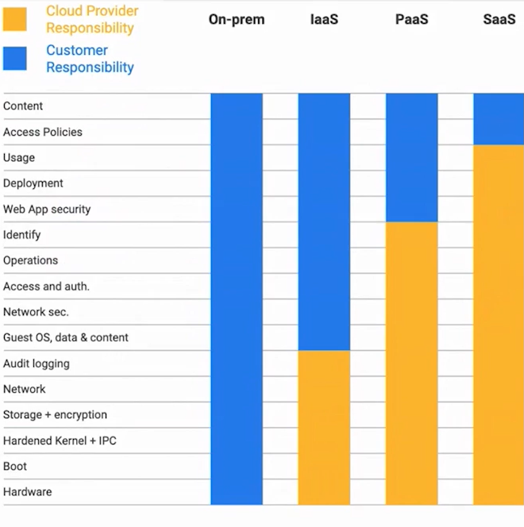
</div>

## Maquinas virtuales (Compute Engine)

Permite crear maquinas virtuales predeterminadas y a la medida con diferentes modelos de consumo y precio

<div align="center">
  
</div>

Google tiene inteligencia para poder reducir tus costos en maquinas virtuales y que está se pueda adaptar

<div align="center">
  
</div>

Acorde a tu aplicativo, cuenta con imagenes optimizadas para contenedores

<div align="center">
  
</div>
<div align="center">
  
</div>

Cuentas con descuento sostenido por uso

<div align="center">
  
</div>

### Laboratorios

* Cómo crear una máquina virtual
* Compute Engine: Qwik Start - Windows
* Cómo comenzar a usar Cloud Shell y gcloud

## Plataforma como servicio (App Engine)

* Fue el primer servicio de computo en la nube de Google

<div align="center">
  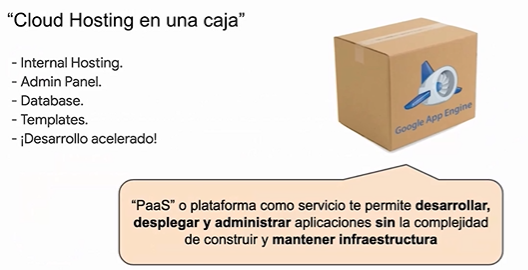
</div>

Default service

<div align="center">
  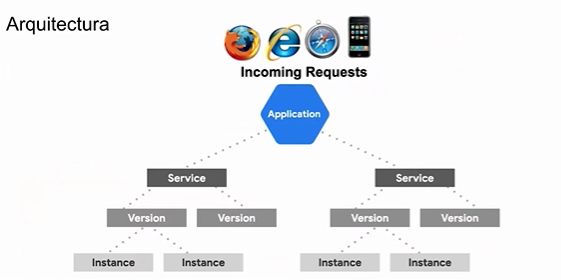
</div>

**Que ofrece hoy**

* Auto escalamiento
* Bifurcación de tráfico
* Balanceo de carga global
* Alta disponibilidad
* SSL y Dominios
* Chequeos de Salud
* Cloud Task
* Monitoreo
* Logueo

<div align="center">
  
</div>

Despliega con un click

<div align="center">
  
</div>

App engine viene en dos sabores
* Se puede crear con contenedores

<div align="center">
  
</div>

<div align="center">
  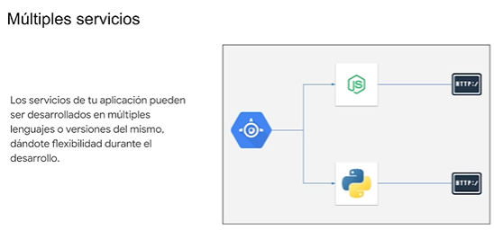
</div>

Maneja 320 billones de peticiones hoy en día

### Contenedores

Pasamos desde:
* Montar servidores propios en las empresas
* Virtualizar maquinas en multiples servidores con diferentes sistemas operativos
* Contenedor. En el que se virtualiza el S.O. otorgando portabilidad en cualquier sistema operativo, añadiendo ligeresa y simplicidad

<div align="center">
  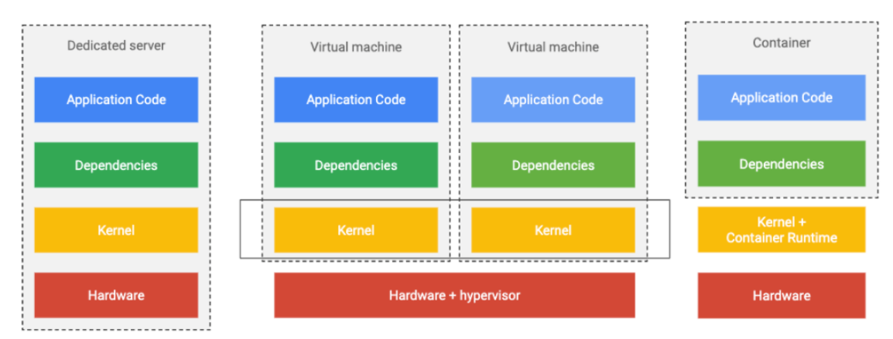
</div>

Webinar: Modernizando su aplicación - una jornada desde el monolito a los microservicios

https://cloudonair.withgoogle.com/events/cloud-tech-solutions-es/watch?talk=talk-6

#### Docker

Docker es una tecnología que te permite construir, correr y monitorear contenedores. Los contenedores de Docker utilizan Containerd como runtime, hoy en día el estándar de la industria.

https://containerd.io/

<div align="center">
  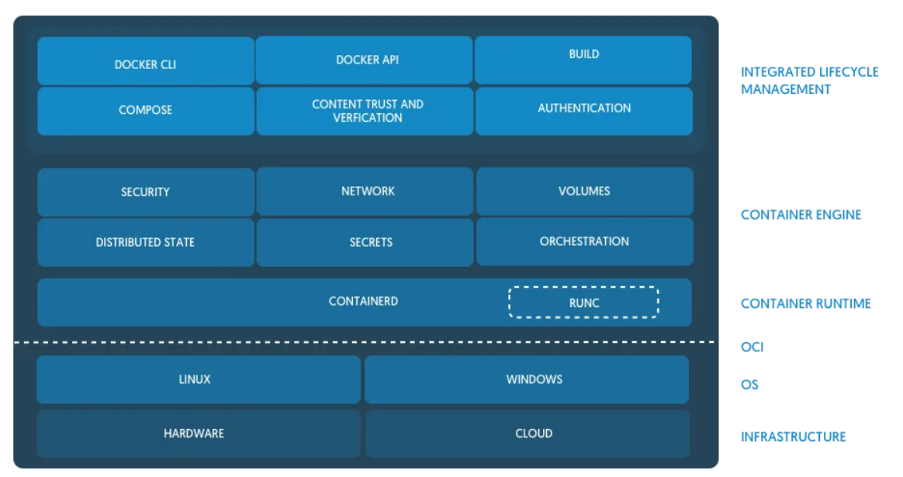
</div>

Los contenedores usan el concepto de un sistema de capas, similar a los sistemas de versionamiento de código, para reutilizar capas base o comunes entre contenedores. Cuando necesitas actualizar una imagen, únicamente tienes que descargar las diferencias desde la última revisión.

<div align="center">
  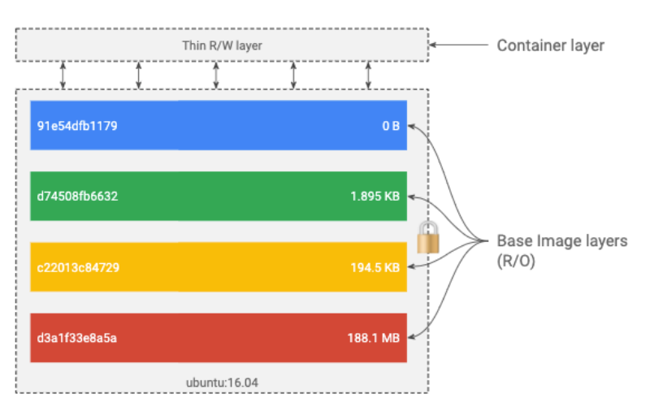
</div>

Las instrucciones que definen estas capas están descritas en un archivo base. En el caso de Docker, en un Dockerfile. Cada instrucción presente en este archivo, por lo general, representa una capa adicional para tu contenedor.

Existen repositorios para que guardes de manera segura y escalable las imágenes de tus aplicaciones. Esto te da control de regresar a una versión previa en caso de alguna falla o regresión de funcionalidad. Es muy común que las organizaciones tengan repositorios privados de imágenes en donde almacenan tanto las imágenes base que los aplicativos utilizan (previamente validadas) como las imágenes de cada aplicación desplegada. En la nube de Google puedes utilizar Container Registry.

https://cloud.google.com/container-registry

Puedes desplegar un contenedor de Docker a cualquier host que tenga el runtime instalado, pero es muy común que a medida de que incrementa el número de contenedores a administrar, las organizaciones adopten orquestadores que les aligeren esta labor. 

El estándar en la industria es **Kubernetes**, creado por Google y donado como código libre a la CNCF hace unos años. Google continúa liderando el desarrollo de Kubernetes y ofrece una experiencia de entorno administrado, **Google Kubernetes Engine**, para que te enfoques en la creación de valor y no en la administración de Kubernetes.

<div align="center">
  
</div>

### Laboratorios

https://cloud.google.com/appengine/docs/standard/java11/runtime

https://cloud.google.com/appengine/docs/standard/java11/quickstart

## Cómputo contenerizado (App Engine Flex)

* Quiero instalar una libreria externa
* Quiero utilizar un lenguaje o runtime que no es soportado
* Quiero que mi código sea portable
* Quiero estandarizar los procesos de CI

### Acceso a VPC
* **Ambiente estándar**
  * Comunicación de una sola via por medio de un conector Serverless VPC access
* **Ambiente flexible**
  * Puedes especificaar la red en la que quieres desplegar tu servicio

### Sabores de App Engine
* **Ambiente estándar**
  * Runtimes específicos
  * Escala a cero y escala más rápida
  * Tu aplicación vive en una sandbox que restringe lo que se puede hacer
  * Despliegue en una sola zona. Si hay error se despliega en otra zona
* **Ambiente flexible**
  * Tu aplicación corre en un contenedor de Docker en una VM, que da más flexibilidad(escribir a disco, librerias, etc)
  * Minimo una instancia desplegada
  * Instanacias más grandes (CPU y memoria)
  * Utiliza grupos de instancias regionales, las instancias son distribuidas en múltiples regiones
  * Haciendo borrosa la línea del PaaS

Bifurcación de tráfico para diferentes versiones de despliegue

## Serverless

<div align="center">
  
</div>

### Serverles y contenedores
* **Contenedores**
  * Cualquier lenguaje
  * Cualquier libreria
  * Cualquier binario
  * Ecosistema de imagenes base
  * Estandar de la industria

<div align="center">
  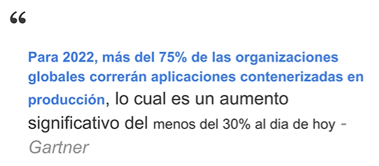
</div>

Es bueno combinar Serverless y contenedores

<div align="center">
  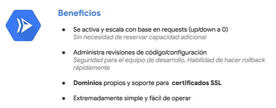
</div>

https://knative.dev/
https://cloud.google.com/run

* Knative es un cluster que ejecuta workloads sobre kebernetes
  * Opensource
  * Bloque Faas y Paas
  * Abstracción de cubernetes
  * Google corre todo en contenedores

### Cloud functions

* Permite construir y conectar servicios de la nube
* Orientado a eventos
* Ambiente totalmente administrado
* Pagas por lo que usas
* Escala automaticamente con el uso

<div align="center">
  
</div>

<div align="center">
  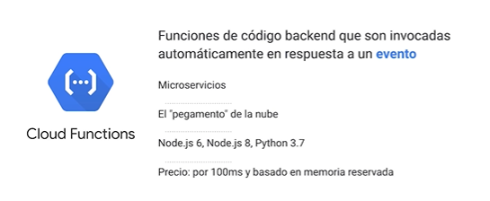
</div>

Son el pegamento en la nube

<div align="center">
  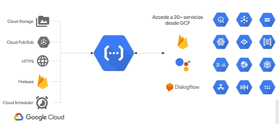
</div>

#### Evento detonador (Triggers)

Al almacenar un archivo

<div align="center">
  
</div>

<div align="center">
  
</div>

<div align="center">
  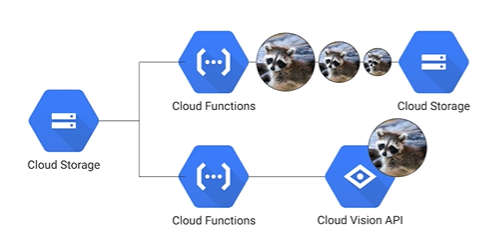
</div>

Mensajería empresarial asincrona

<div align="center">
  
</div>

<div align="center">
  
</div>

Para calendarización

<div align="center">
  
</div>

Controlar el escalamiento

<div align="center">
  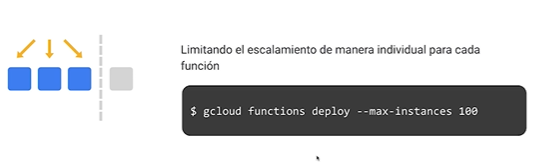
</div>

<div align="center">
  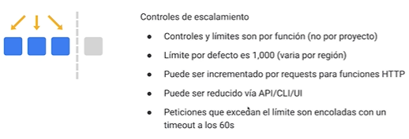
</div>

Pool de conexiones a una Cloud functions, para que reutilize llamadas a la base de datos por ejemplo

<div align="center">
  
</div>

https://firebase.google.com/docs/functions

https://cloud.google.com/functions

# Continous Integration

<div align="center">
  
</div>

## Pipelines

<div align="center">
  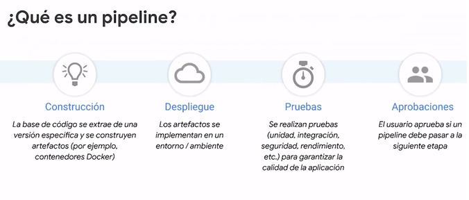
</div>

<div align="center">
  
</div>

## Prácticas

<div align="center">
  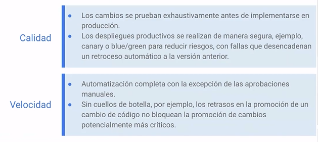
</div>

<div align="center">
  
</div>

<div align="center">
  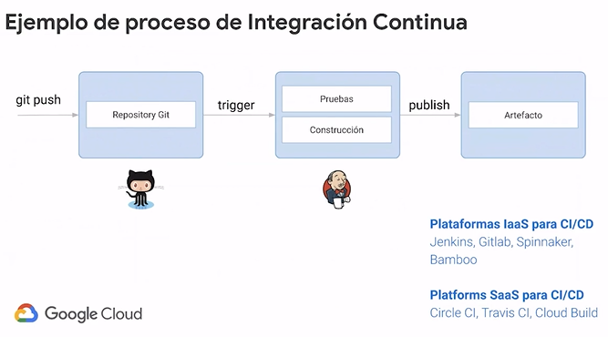
</div>

Creado por Netflix: https://spinnaker.io/

https://www.atlassian.com/es/software/bamboo

Creado en Java: https://www.jenkins.io/

## Estrategias de Despliegue

<div align="center">
  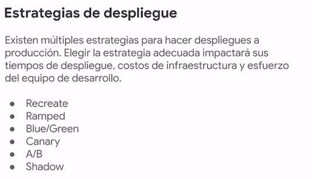
</div>

<div align="center">
  
</div>

<div align="center">
  
</div>

<div align="center">
  
</div>

<div align="center">
  
</div>

<div align="center">
  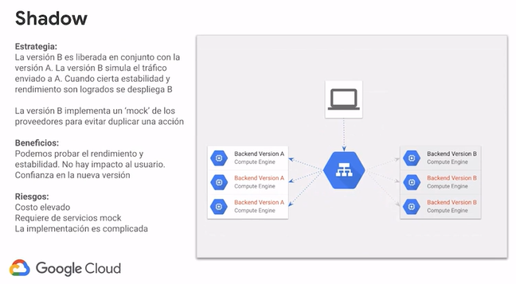
</div>

<div align="center">
  
</div>

## Repositorios

<div align="center">
  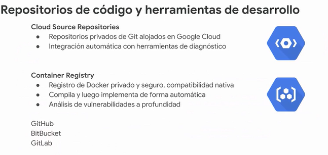
</div>

Funciona muy similar y todo se gestiona por comandos

<div align="center">
  
</div>

<div align="center">
  
</div>

```shell
gcloud source repos create demo_CI-CD
gcloud source repos clone demo_CI-CD
```

https://cloud.google.com/source-repositories
https://cloud.google.com/container-registry

<div align="center">
  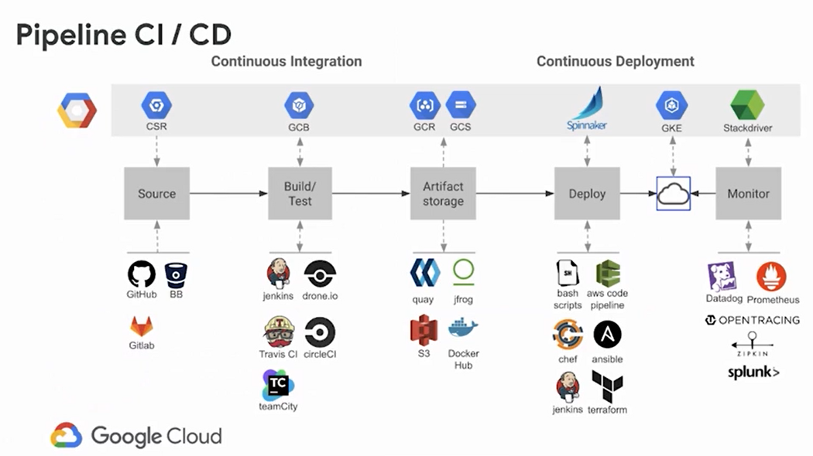
</div>

https://www.jetbrains.com/es-es/teamcity/

<div align="center">
  
</div>

<div align="center">
  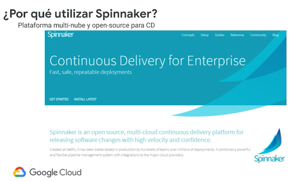
</div>

<div align="center">
  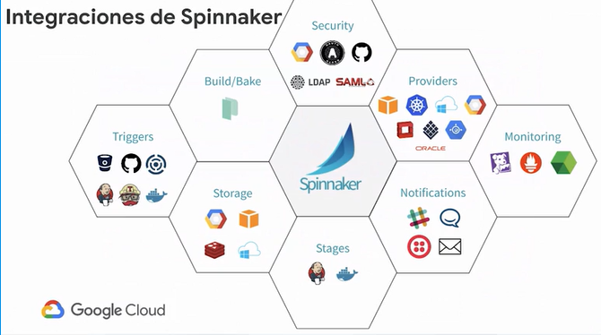
</div>

<div align="center">
  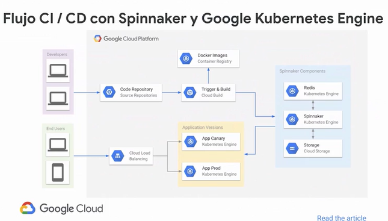
</div>

<div align="center">
  
</div>

<div align="center">
  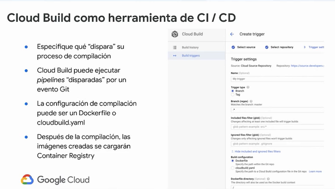
</div>

<div align="center">
  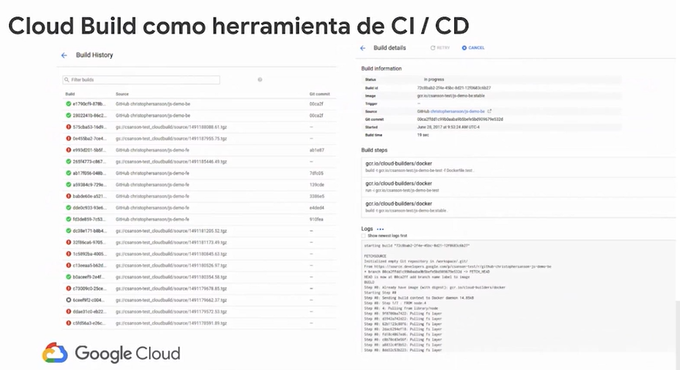
</div>

<div align="center">
  
</div>

Lab

https://google.qwiklabs.com/focuses/552?catalog_rank=%7B%22rank%22%3A2%2C%22num_filters%22%3A0%2C%22has_search%22%3Atrue%7D&parent=catalog&search_id=5868947

## Infraestructura como código

<div align="center">
  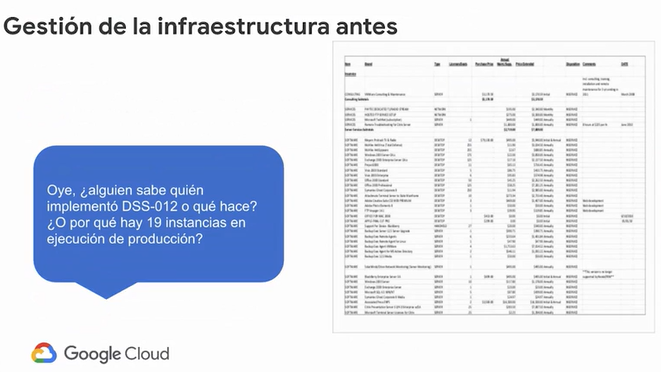
</div>

<div align="center">
  
</div>

<div align="center">
  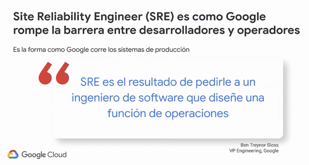
</div>

<div align="center">
  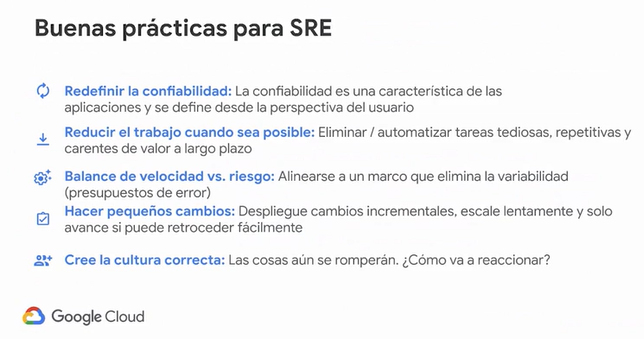
</div>

<div align="center">
  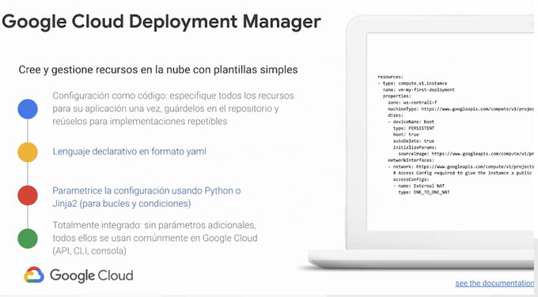
</div>

<div align="center">
  
</div>

<div align="center">
  
</div>

https://www.terraform.io/

https://cloud.google.com/deployment-manager

<div align="center">
  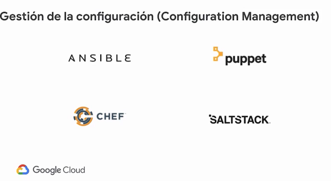
</div>

## Despliegue en Servicios Serverless

<div align="center">
  
</div>

<div align="center">
  
</div>

<div align="center">
  
</div>

<div align="center">
  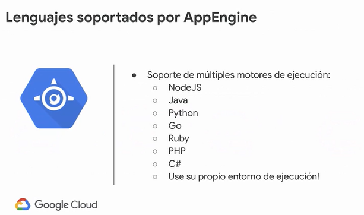
</div>

<div align="center">
  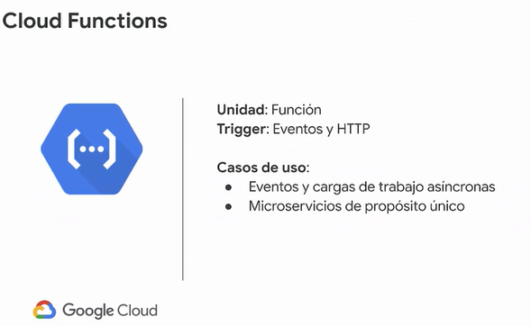
</div>

<div align="center">
  
</div>

<div align="center">
  
</div>

<div align="center">
  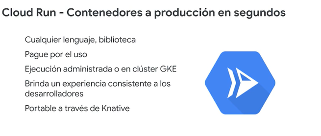
</div>

<div align="center">
  
</div>

# Kubernetes

<div align="center">
  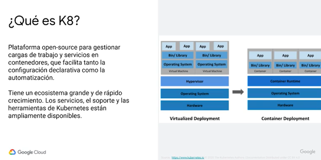
</div>

<div align="center">
  
</div>

* Un **pod** es un contenedor o un conjunto de contenedores, no tienen estado
* Los **servicios** son una abstracción de la puerta de red
* El **volumen** puede almacenar la información
* Los **namespaces** hacen subdivición de clusters con multitenant

<div align="center">
  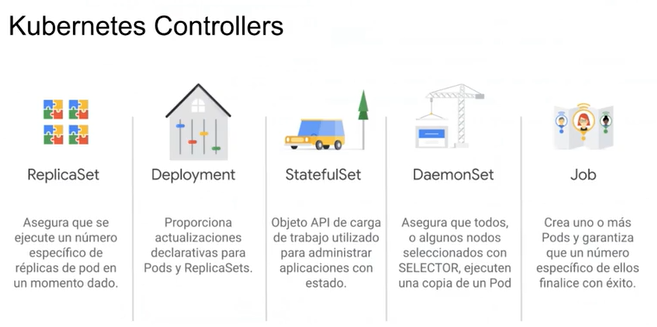
</div>

* **Replicaset**, replica pots, una actualización requiere actualizar cada replica, no es recomendable
* **Deployment** define un pot y replicaset para mantener el despliegue
* **Statefullset** Es un desplique pero cuando requieres guardar un estado, para mantener trasabilidad de los pots
* **Deamonset** Replicación en nodos
* **Job** Realizar trabajos específicos

<div align="center">
  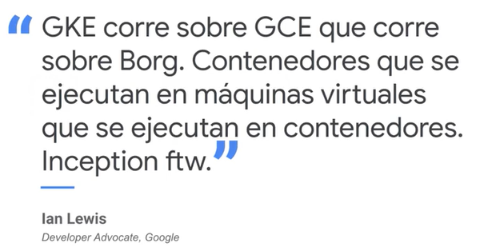
</div>

Se debe usar kubectl

<div align="center">
  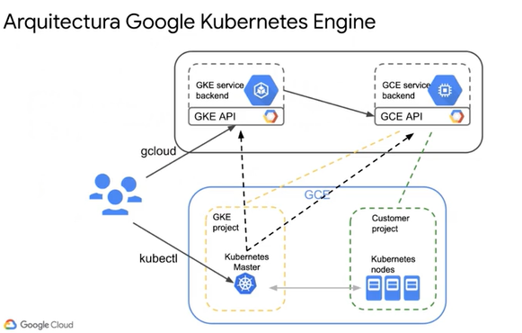
</div>

Ejemplo

<div align="center">
  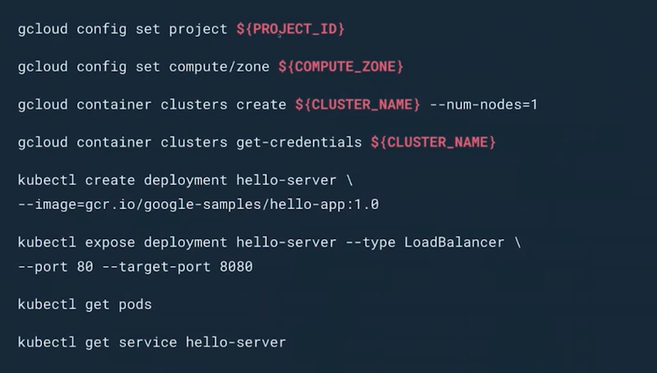
</div>

## DEMO

https://codelabs.developers.google.com/codelabs/cloud-orchestrate-with-kubernetes/#0

```sh
gcloud init
gcloud auth list
# Name of cluster
export CLUSTER=platzi-cluster
echo $CLUSTER
#Set config Zone. South Carolina, USA us-east1
#You can check the media latency from your region in  http://www.gcping.com/
export ZONE=us-central1-a
echo $ZONE

gcloud container clusters create $CLUSTER --addons HorizontalPodAutoscaling,HttpLoadBalancing,CloudRun --enable-ip-alias --enable-stackdriver-kubernetes --machine-type n1-standard-2 --zone $ZONE
```

* Create a cluster with name platzi-cluster: gcloud container clusters create $CLUSTER
* Add the following addons (Complementos) and enable them:
  * HorizontalPodAutoscaling: Automatically scales the number of pods in a replication controller, deployment, replica set or stateful set based on observed CPU utilization. Ref https://kubernetes.io/docs/tasks/run-application/horizontal-pod-autoscale/
  * HttpLoadBalancing.
  * CloudRun
* Set alias, it is a good idea NOT use IP, it is better alias: –enable-stackdriver-kubernetes
* Mandatory set machine type: –machine-type n1-standard-2
* Mandatory set zone: –zone $ZONE

```sh
gcloud config set project ${PROJECT_ID}
gcloud config set compute/zone ${COMPUTE_ZONE}
gcloud container clusters create ${CLUSTER_NAME} --num-nodes=1
gcloud container clusters get-credentials ${CLUSTER_NAME}

kubectl create deployment hello-server \ --image=gcr.io/google-samples/hello-app:1.0kubectl expose deployment hello-server --type LoadBalancer \--port 80 --target-port 8080
kubectl get pods
kubectl get service hello-server
```

## Planeación de tus ambientes

<div align="center">
  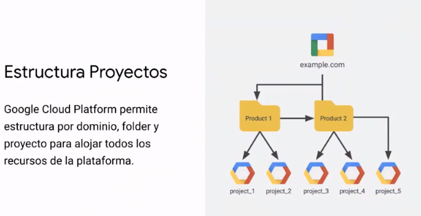
</div>

<div align="center">
  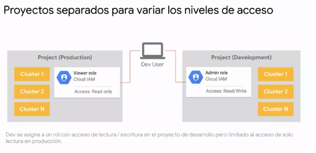
</div>

<div align="center">
  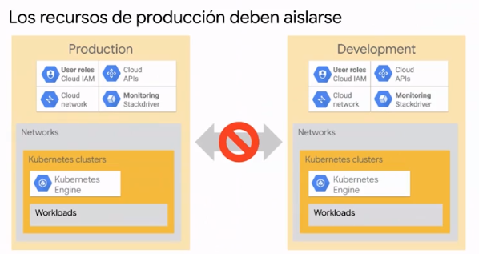
</div>

<div align="center">
  
</div>

<div align="center">
  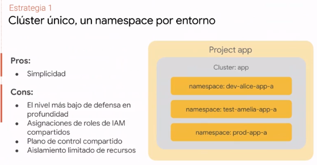
</div>

<div align="center">
  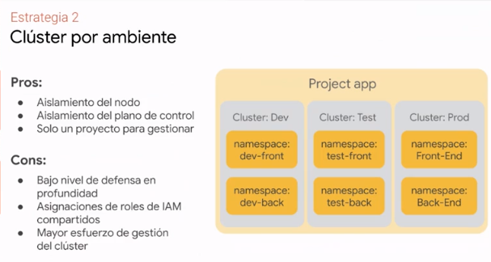
</div>

<div align="center">
  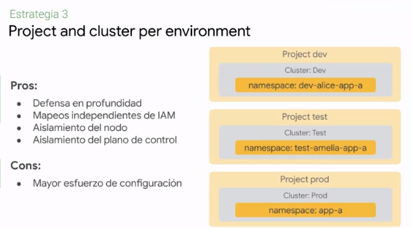
</div>

<div align="center">
  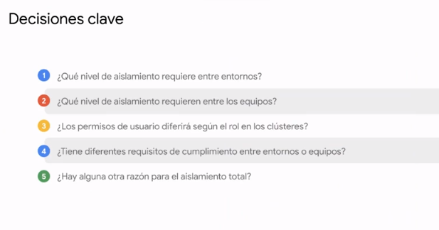
</div>

<div align="center">
  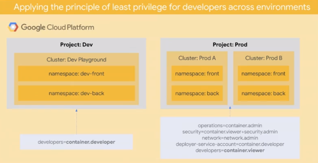
</div>

## Anthos

https://cloud.google.com/anthos/?hl=es-419


<div align="center">
  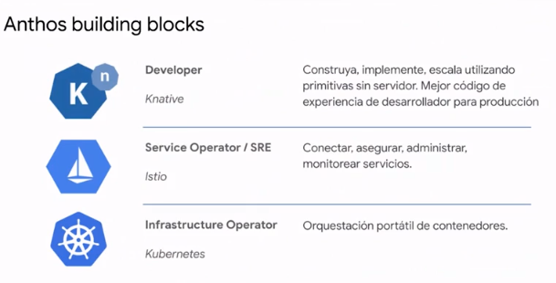
</div>

<div align="center">
  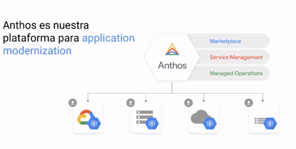
</div>

Anthos multinube es única en la industria

<div align="center">
  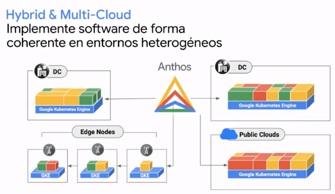
</div>

<div align="center">
  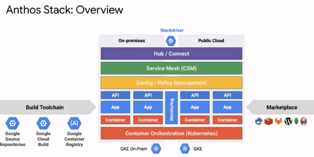
</div>

## Cloud Run for Anthos

La plataforma Anthos simplifica la entrega de servicios de forma global, desde la gestión del tráfico y la telemetría en malla hasta la protección de la comunicación entre los servicios. De esta forma, facilita el trabajo a los equipos de operaciones y desarrollo. Anthos Service Mesh, la malla de servicios totalmente gestionada de Google, te permite gestionar estos entornos complejos de forma muy sencilla y disfrutar de las ventajas que ofrecen.

Kubernetes es una abstracción sobre infraestructura y un conjunto de APIs declarativas

<div align="center">
  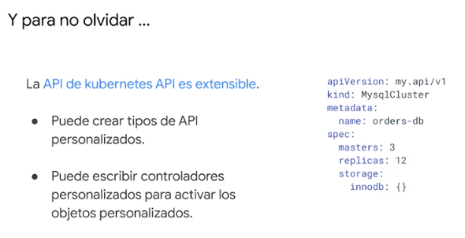
</div>

<div align="center">
  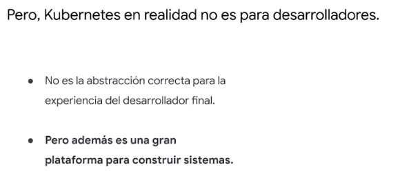
</div>

<div align="center">
  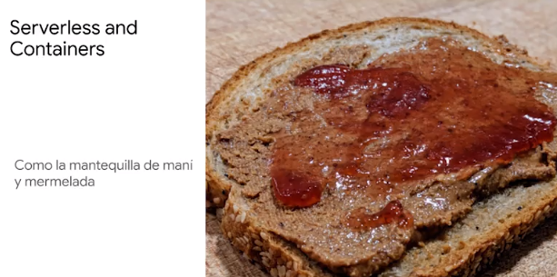
</div>

<div align="center">
  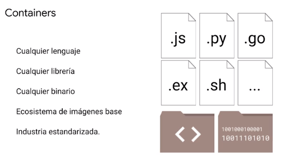
</div>

<div align="center">
  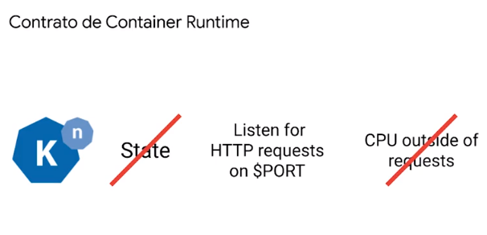
</div>

<div align="center">
  
</div>

<div align="center">
  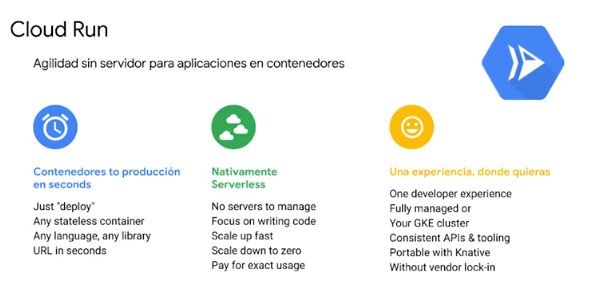
</div>

<div align="center">
  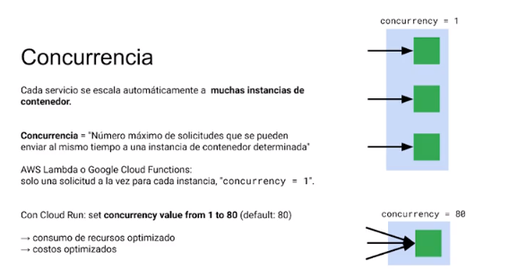
</div>

<div align="center">
  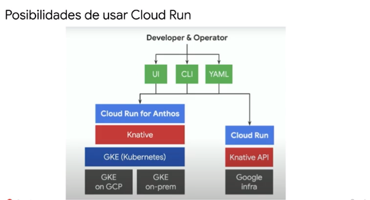
</div>

<div align="center">
  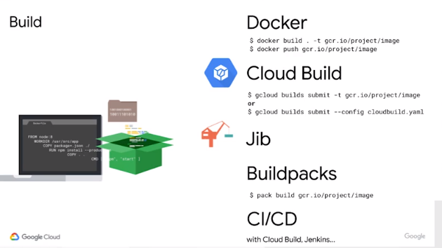
</div>

<div align="center">
  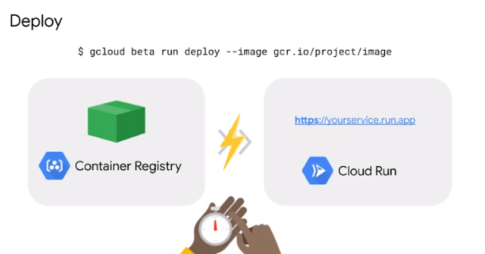
</div>

## Anthos Service MESH

<div align="center">
  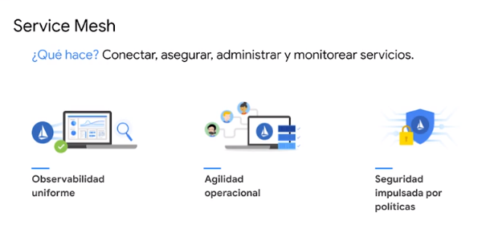
</div>

<div align="center">
  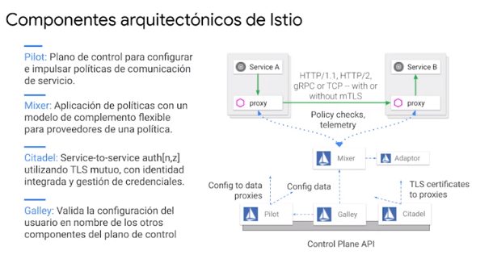
</div>

<div align="center">
  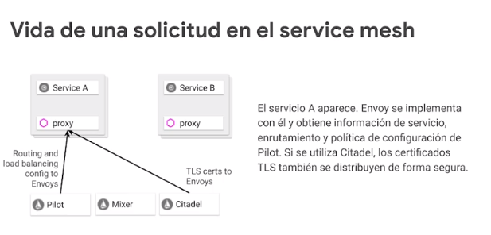
</div>

<div align="center">
  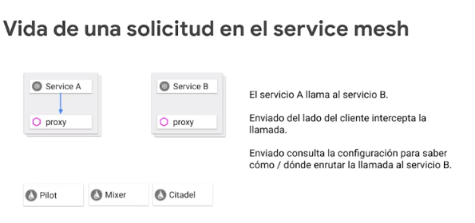
</div>

<div align="center">
  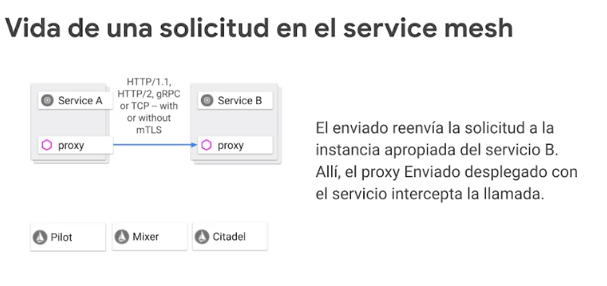
</div>

<div align="center">
  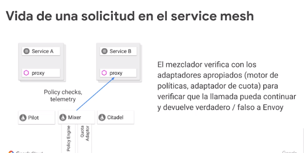
</div>

<div align="center">
  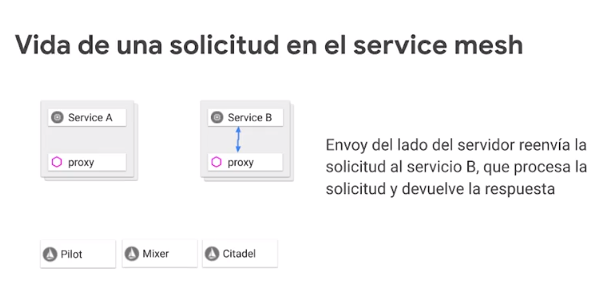
</div>

<div align="center">
  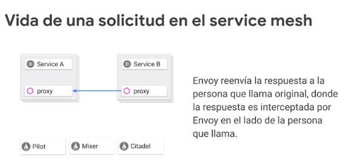
</div>

<div align="center">
  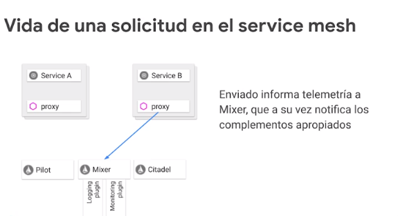
</div>

# Machine learning

