# Google Kubernetes Engine <!-- omit in toc -->

## Tabla de Contenido<!-- omit in toc -->
- [Introducción](#introducción)
  - [Contenedores](#contenedores)
  - [Docker](#docker)
  - [Comandos Básicos de Docker](#comandos-básicos-de-docker)
- [Kubernetes conceptos básicos](#kubernetes-conceptos-básicos)
  - [Clúster y nodos](#clúster-y-nodos)
  - [Pods](#pods)
  - [Deployments](#deployments)
  - [Servicios](#servicios)
  - [Archivos descriptivos de infraestructura teoria y práctica](#archivos-descriptivos-de-infraestructura-teoria-y-práctica)
  - [Labels](#labels)
  - [Namespaces](#namespaces)
  - [Labels y Namespaces](#labels-y-namespaces)
  - [Deployment Avanzado (Blue-green y Canary Deployment)](#deployment-avanzado-blue-green-y-canary-deployment)
  - [Volumenes](#volumenes)
- [Arquitecturas](#arquitecturas)
  - [Desplegar una aplicación Stateful](#desplegar-una-aplicación-stateful)


# Introducción

**Kubernetes Engine** es la solución administrada de Google en la plataforma de Google Cloud Platform. Su función es administrar el cluster de máquinas, la instalación de los clientes y todos los procesos para el despliegue de nuestras aplicaciones. Google se encarga de todo.

[**Esta herramienta tiene las siguientes funcionalidades:**](https://cloud.google.com/kubernetes-engine/kubernetes-comic/)

* **Formato Docker:** Nuestras máquinas y contenedores deben usar este formato para poder ser desplegadas.
* **Auto-escalado:** La performance de nuestra aplicación no se verá afectada cuando entren muchísimos usuarios al mismo tiempo. Podrás soportar toda esta carga sin necesidad de generar tus máquinas virtuales a mano.
* **Stackdriver:** La solución de monitoreo y control de Google. Nos ayuda a entender muy fácilmente qué está pasando en la infraestructura: logs, alertas, monitoreo de la CPU y la memoria, etc.
* **Cloud VPN:** Nos permite tener una nube híbrida con la cual tendremos nuestros datos y aplicaciones segregados en la nube y utilizando información de nuestros servidores locales. Todos estos procesos de forma segura.
* **Cloud IAM:** Administración de usuarios gracias al soporte de autenticación de Google. Podemos asignar permisos y roles de lectura, escritura y administración sobre nuestro cluster.

**Ventajas de Kubernetes Engine:**

Actualizaciones automáticas
Reparación automática
Registro privado de contenedores
Versiones uniformes y rápidas
Soporte para GPU

**Alternativas:**

Redhat Openshift
Docker Swarm
Amazon Elastic Container Service for Kubernetes
IBM Cloud Kubernetes Service
Azure Kubernetes Service (AKS)

https://cloud.google.com/kubernetes-engine/kubernetes-comic/

<div align="center">
  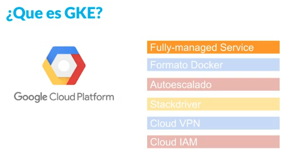
</div>

<div align="center">
  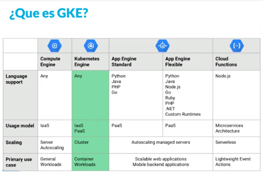
</div>

## Contenedores

El nombre de contenedores viene de los r**ecipientes de carga estandarizados que se utilizan en barcos**, camiones y trenes, que permiten cargar, descargar y apilar los containers durante largas distancias facilitando el transbordo de un medio de transporte a otro.

Estos contenedores han supuesto una verdadera revolución en el mundo del transporte, reduciendo costes, tiempos de carga/descarga, daños en mercancías, etc.

**Docker lleva este mismo concepto al mundo del software**, permitiendo encapsular cualquier arquitectura, convirtiéndola en un contenedor portable y autosuficiente, de forma que se pueda manipular mediante operaciones establecidas y ejecutar de manera consistente en cualquier hardware.

<div align="center">
  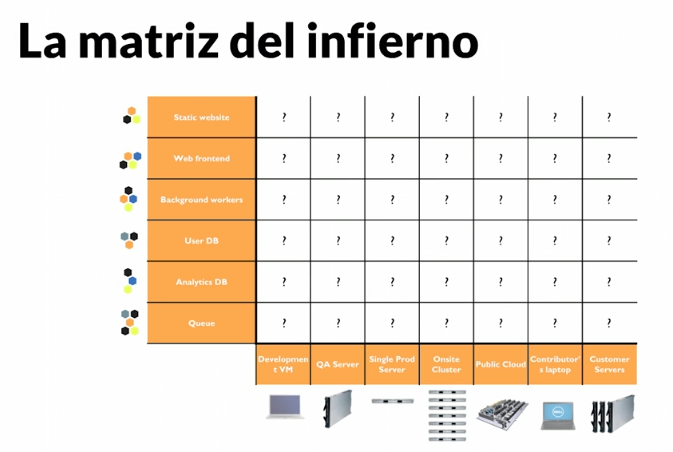
</div>

## Docker

Docker es una tecnología open source, **desarrollada en el lenguaje de programación GO**, utilizando la licencia Apache 2.0 (podemos desplegar nuestra aplicación en cualquier servidor, sin que nuestro código fuente sea open source).

Docker utiliza las características de los sistemas operativos tipo UNIX para administrar los contenedores y el despliegue de nuestras aplicaciones en el area de memoria del sistema operativo Linux.

<div align="center">
  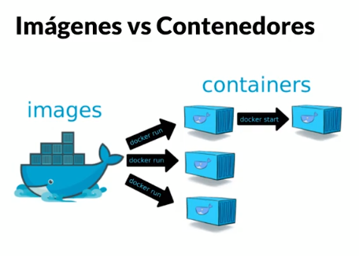
</div>

<div align="center">
  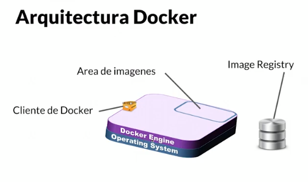
</div>

## Comandos Básicos de Docker

**docker pull:** Descargar y guardar las imágenes de nuestra aplicación
**docker images:** Listar las imágenes descargas en nuestra máquina
**docker ps:** Listar los contenedores corriendo en nuestra máquina (id, puerto, etc)
**docker ps -a:** Listar los contenedores apagados de nuestra máquina_
**docker exec:** Ingresar a nuestro contenedor y listar las carpetas dentro de el
**docker stop:** Detener la ejecución de nuestro contenedor
**docker rm:** Borrar nuestro contenedor

# Kubernetes conceptos básicos

## Clúster y nodos

**Un cluster es una agrupación de máquinas que corren una cierta cantidad de servicios** para que nuestra aplicación pueda funcionar sobre Kubernetes.

**El endpoint o nodo maestro es una máquina dentro de nuestro cluster**, es la puerta de entrada a todo el cluster. Tiene las APIs de Kubernetes, los servicios REST, el agendamiento de pods y la sincronización servicios. Tambien cuenta con integración a los servicios de Google Cloud Platform.

**Un Nodo es un worker machine, osea, una maquina dentro de un cluster.** 

Esta máquina tiene todas las herramientas para el despliegue de nuestras aplicaciones. Puede ser una maquina virtual o una máquina física con todos los servicios necesarios para correr pods.

Las direcciones, condiciones, capacidad e información de nuestros nodos se llaman estados y podemos acceder a ellos desde la terminal.

## Pods

> **Un pod es un conjunto de contenedores que se despliegan en nuestros nodos. Más adelante aprenderemos más a detalle cómo funcionan.**

<div align="center">
  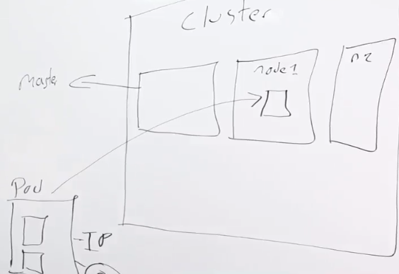
</div>

<div align="center">
  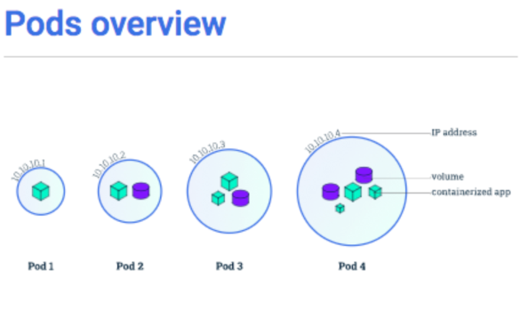
</div>

## Deployments

**Los deployments son una abstracción de nuestra aplicación** que nos permite crear una arquitectura e **indicar la cantidad de pods** que se van a necesitar. Con esto, haremos un despliegue de nuestra aplicación en nuestro cluster, tomando **la cantidad de pods y replicas** que indicamos previamente.

<div align="center">
  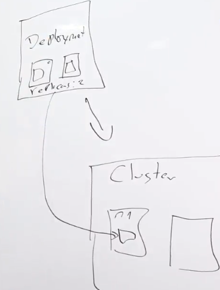
</div>

<div align="center">
  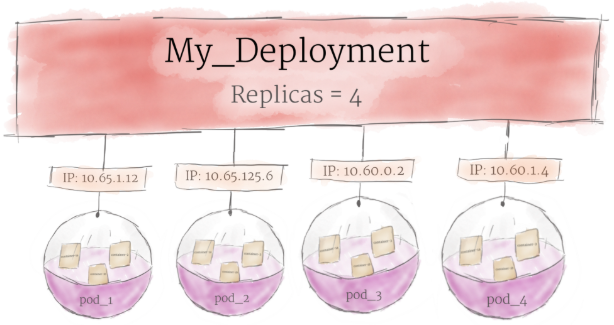
</div>

https://kubernetes.io/docs/tutorials/kubernetes-basics/explore/explore-intro/

## Servicios

Los servicios **nos permiten ingresar tráfico y conectar los diferentes servicios de nuestra aplicación.** Los 3 tipos de servicios disponibles son: **Cluster IP, Node Port y Load Balancer.**

<div align="center">
  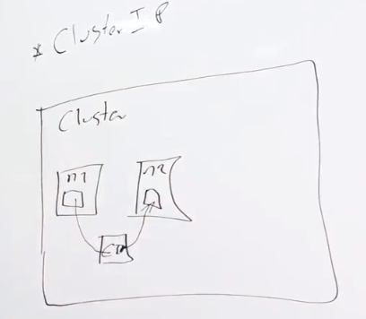
</div>

<div align="center">
  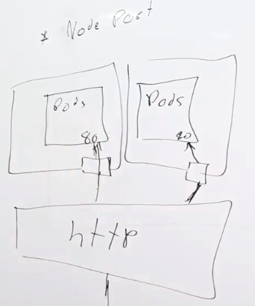
</div>

<div align="center">
  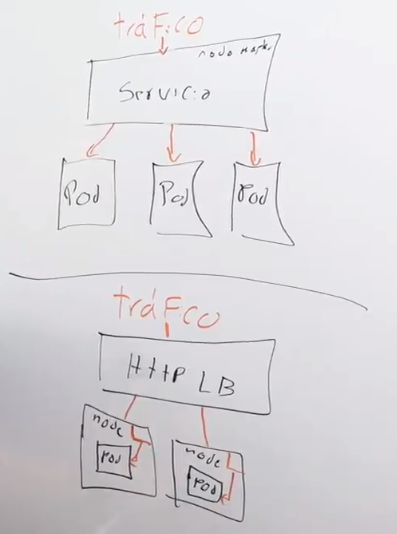
</div>

https://medium.com/google-cloud/kubernetes-nodeport-vs-loadbalancer-vs-ingress-when-should-i-use-what-922f010849e0

## Archivos descriptivos de infraestructura teoria y práctica

Los archivos descriptivos nos permiten hacer despliegues de nuestras aplicaciones, pero en este caso, escribiendo nosotros mismos los archivos de configuración. **No vamos a usar la interfaz gráfica.** **Estos archivos los escribimos en formato .yaml.**

En estos archivos vamos a describir toda la parte lógica de nuestra aplicación: **Pods, Deployments, Services e incluso las conexión entre aplicaciones. Recuerda que en estos archivos no podemos configurar ni los clusters ni lo nodos.**


## Labels

**Los Labels son una metadata arbitraria, esto quiere decir que podemos poner los nombre que queramos para generar una identidad a cualquier objeto** (servicios, deployments, etc). Pueden ser de tipo Queryable (buscables o seleccionables), lo que nos permite agruparlos para generar despliegues de forma más fácil y hacer segregación de nuestros servicios.

Los selectores son una herramienta que nos permite utilizar los labels para saber cuándo comenzar a utilizar unos pods u otros en nuestros despliegues.

<div align="center">
  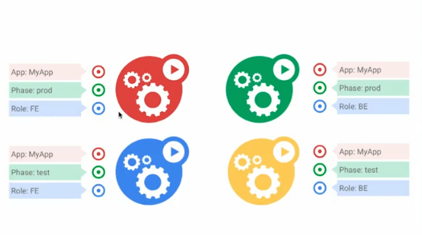
</div>

<div align="center">
  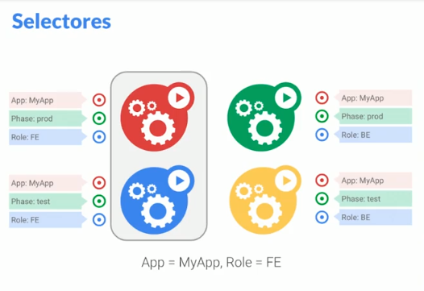
</div>

## Namespaces

**Los Namespaces son una separación virtual dentro de nuestro cluster con el fin de hacer un aislamiento de nuestros datos y tener ambientes completamente separados.** Podemos tener multiples namespaces dentro de nuestros clusters.

* default
* kube-system
* kube-public

## Labels y Namespaces

<div align="center">
  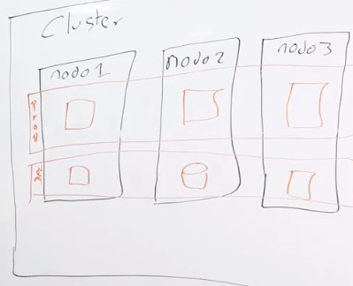
</div>

```sh
kubectl get namespace
```

```sh
kubectl create namespace desarrollo
```

## Deployment Avanzado (Blue-green y Canary Deployment)

* **Blue-green:** Es una técnica de despliegues que **nos ayuda a tener actualizaciones de nuestra aplicación con cero down time**. Para esto necesitamos, **un ambiente el tráfico (para el entorno de producción) y un segundo ambiente con las nuevas características de tu aplicación.**

* **Canary:** **Nos sirve para hacer pruebas de nuevas versiones a un público pequeño**, esto con el fin de averiguar cómo se comportan los usuarios frente a esta nueva versión.


Tipos de despliegues
https://blog.container-solutions.com/kubernetes-deployment-strategies
https://github.com/ContainerSolutions/k8s-deployment-strategies

## Volumenes

**Los volúmenes nos ayudan a implementar un almacenamiento persistente, en el que podamos acoplar y desacoplar los nodos sin que esta información desaparezca.** Pueden ser de tipo persistente, NFS o cluster, pero dependiendo de la integración con diferentes nubes se podrán implementar nuevos tipos de volúmenes.

Los volúmenes son **ideales para guardar la información de nuestros usuarios, archivos, configuraciones y compartir esta información con diferentes pods.**

# Arquitecturas

## Desplegar una aplicación Stateful

Las aplicación Stateful **son aplicaciones que guardan el estado de los datos para ser consultados posteriormente.** Buenos ejemplos de aplicaciones Stateful son: las Bases de Datos, Data Warehouse, Modelos predictivos de IA, Gestores documentales, entre otros.

https://kubernetes.io/blog/2017/01/running-mongodb-on-kubernetes-with-statefulsets/