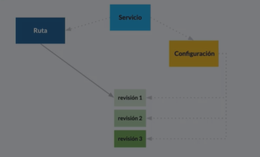
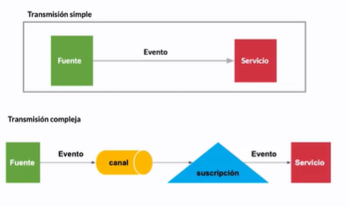
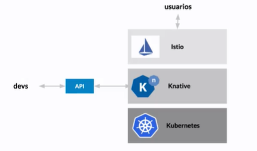
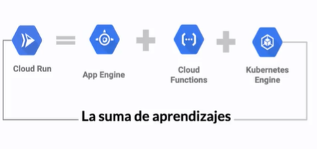

# Serverless<!-- omit in toc -->

## Tabla de Contenido<!-- omit in toc -->
- [Introducción](#introducción)
  - [Kubernetes](#kubernetes)
  - [Knative](#knative)
    - [Servicing](#servicing)
    - [Eventing](#eventing)
- [Cloud Run](#cloud-run)
  - [Managed Service](#managed-service)
  - [Cloud Run for Anthos](#cloud-run-for-anthos)

# Introducción

## Kubernetes

Kubernetes (K8s) es una plataforma de código abierto para automatizar la implementación, el escalado y la administración en contenedores.

Process
Recursos manejados por el sistema operativo que tiene su propia memoria virtual.

Namespaces
Alcances: Qué elementos son visibles, qué IPs puedo ver, qué árbol de directorios a los cuales tengo acceso.

CGroups
Cuánto CPU, Cuánta Memoria voy a ocupar

Union File System
Mecanismo que permite que se construya nuestra aplicación a través de capas en las que se definen las relaciones con las bibliotecas.

## Knative

https://cloud.google.com/knative

Sirve para administrar cargas de trabajo basadas en Kubernetes

* Funciona en cualquier nube

### Servicing

* Atiende y distribuye las peticiones entre los múltiples servicios y sus reviciones
* Usa Lstio
* Permite que sea funcional aunque haya escalado a cero

  

### Eventing

* Mecanismo que permite consumir y producir eventos según la especificación de CloudEvents
* Sigue los principios básicos de Pub/Sub

  

  

# Cloud Run

  

## Managed Service

* Gestionado por Google Cloud
* Listo para usarse
* Ellos despliegan y mantienen saludables y activas las instancias
* Manejan escalabilidad
* Actualizaciones provistas por el proveedor

## Cloud Run for Anthos

Anthos es la solución hibrida y multinube

* Gestionado 'manualmente'
* Despliegue y gestión del cluster de kubernetes
* Actualizaciones son nuestra responsabilidad
* La escalabilidad recae parcialmente en nosotros
* Recomendable cuando ya tienes inversiones hechas en kubernetes