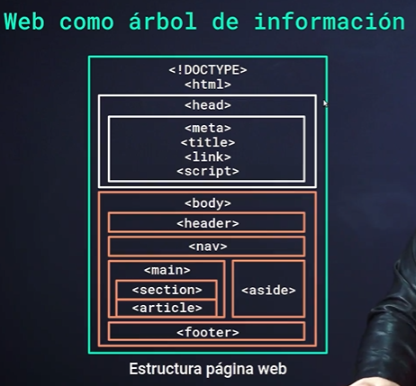
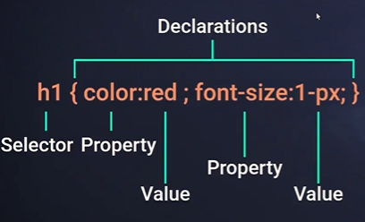
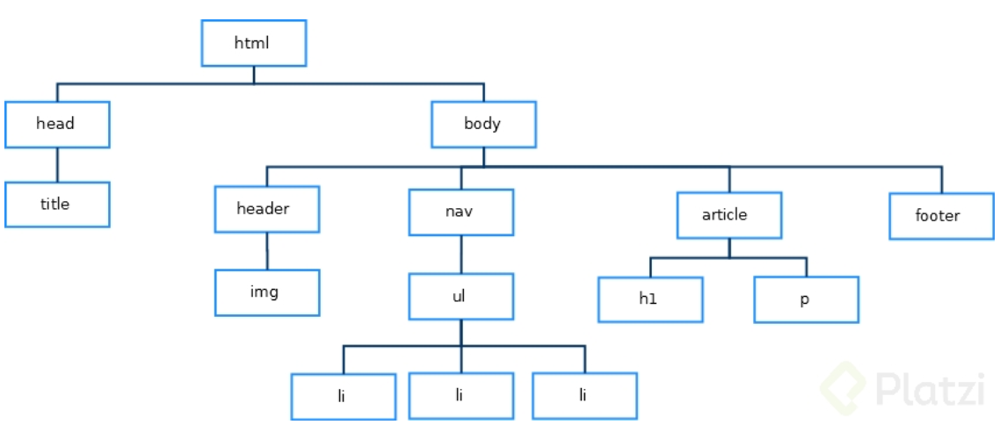
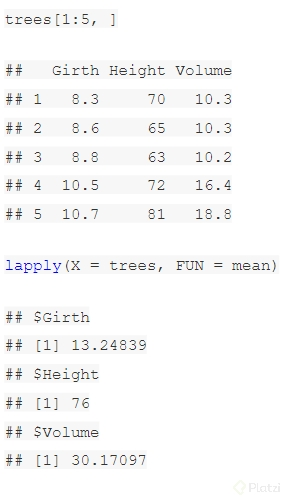
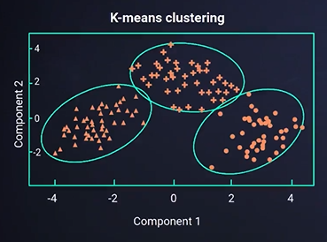
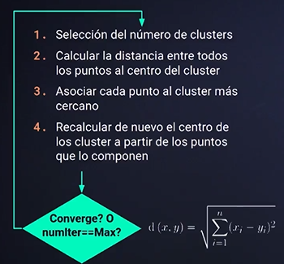
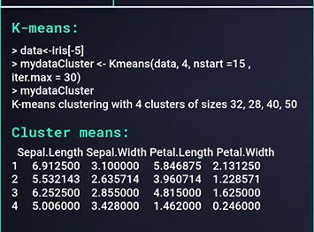
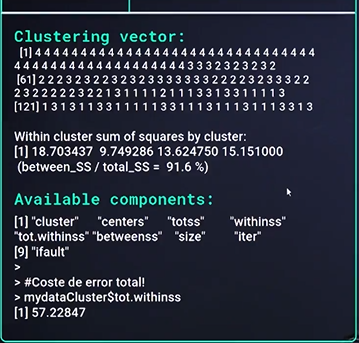
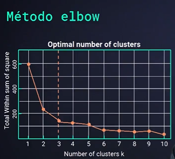
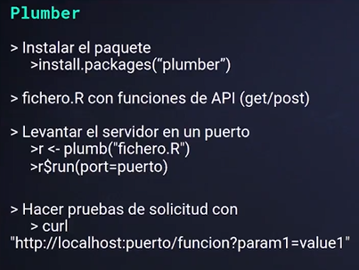

# Ciencia de datos con R <!-- omit in toc -->

## Tabla de Contenido<!-- omit in toc -->
- [Introducción a la ciencia de datos](#introducci%c3%b3n-a-la-ciencia-de-datos)
  - [¿Qué es un Data Scientist?](#%c2%bfqu%c3%a9-es-un-data-scientist)
  - [¿Qué es lo primero que debe hacer un Científico de datos en su flujo de trabajo?](#%c2%bfqu%c3%a9-es-lo-primero-que-debe-hacer-un-cient%c3%adfico-de-datos-en-su-flujo-de-trabajo)
  - [Flujo de trabajo de un científico de datos](#flujo-de-trabajo-de-un-cient%c3%adfico-de-datos)
  - [Nombre los 4 factores importantes a considerar en la adquisición de los datos:](#nombre-los-4-factores-importantes-a-considerar-en-la-adquisici%c3%b3n-de-los-datos)
  - [Web Scraping](#web-scraping)
  - [Visualización de datos](#visualizaci%c3%b3n-de-datos)
- [Web Scraping](#web-scraping-1)
  - [Apply en R](#apply-en-r)
    - [apply(X, Margin, FUN)](#applyx-margin-fun)
    - [lapply(X, FUN)](#lapplyx-fun)
- [Adecuación y análisis de los datos](#adecuaci%c3%b3n-y-an%c3%a1lisis-de-los-datos)
- [Algoritmo K-means](#algoritmo-k-means)
  - [Implementación en R](#implementaci%c3%b3n-en-r)
    - [Elegir el número de clústers](#elegir-el-n%c3%bamero-de-cl%c3%basters)
- [Cómo hacer un punto de API con plumber en R](#c%c3%b3mo-hacer-un-punto-de-api-con-plumber-en-r)
- [Shiny](#shiny)


# Introducción a la ciencia de datos

* Web scrapping
* Visualización de datos
* Operación de datos
* Transformación de datos
* Exponer los datos a través de un API
* El mundo del data science no es algo nuevo, desde los años 60 existían los mineros de datos: Personas dedicadas a analizar grandes cantidades de datos con estadística. Los mineros de datos tenían una limitante tecnológica pues demasiados datos eran difíciles de procesar, hoy en día gracias a toda la mejora en el hardware es que el mundo de data science se ha expandido.

> El trabajo de un data scientist lleva varios pasos:

* Obtención de datos.
* Enriquecimiento de los datos.
* Adecuación e interpretación de datos.
* Aplicación del modelo.
* Interpretación de los resultados.
* Puesta en producción del modelo.

## ¿Qué es un Data Scientist?

Un data scientist es el encargado en una organización que busca **encontrar verdades a través del análisis masivo de datos para poder guiar al equipo en la toma de decisiones**

El flujo de trabajo de data un data science tiene muchos factores que deben ser tomados en cuenta.

## ¿Qué es lo primero que debe hacer un Científico de datos en su flujo de trabajo?

* La primero es Entender el negocio que analizara. ¿Qué vendes? ¿Cómo lo búscan tus clientes? ¿Cómo lo llevas al mercado?
* Con el fin de conocer que datos necesitas almacenar

## Flujo de trabajo de un científico de datos

* **Entender el negocio**
* **Adquisición de datos**, Patrones de datos, Cómo obtener los datos, limpiarlos y asegurarse de que sean útiles
* **Modelado** (Interpretar de los datos) Caracterísicas importantes de los datos, fechas con eventos importantes, encontrar y relacionar los datos de forma que nos permitan encontrar las respuestas a las preguntas realizadas inicialmente. ¿Por que se subscriben mis usuarios? ¿Qué producto necesito lanzar?. Entrenar el modelo para que pueda interpretar los datos y generar predicciones
  * Cross Validation
  * Calificación

## Nombre los 4 factores importantes a considerar en la adquisición de los datos:

* La fuente de los datos (Origenes)
* El flujo de los datos (Transformaciones y Destinos )
* Frecuencia de actualización
* Limpieza de datos


> Un data scientist es quien busca soluciones a un problema a través del análisis de datos, utilizando herramientas como los lenguajes de programación (Python, R, java, SQL, etc), las matemáticas (Algebra lineal, cálculo, probabilidad, estadística, etc.) y además tiene la capacidad de hacer sugerencias sobre el resultado del estudio para implementar una estrategia o mejora. Esto puede ser aplicado en diferentes campos finanzas, mercadotecnia, medicina, biología, arquitectura, etc.

## Web Scraping

Web scraping es una técnica para recopilar información utilizando la estructura de HTML de una página web. Con esta técnica podemos automatizar procesos para obtener datos y llenarlos en una base de datos.


## Visualización de datos

Visualizar datos es muy importante para poder representar los datos y contar historias a partir de ellos

https://www.r-graph-gallery.com/cartogram

# Web Scraping

En R se realiza con RVest

* **read_html():** Esta función crea un objeto que va a contener toda la estructura HTML del sitio que le indiquemos.
* **html_nodes(, ):** Nos va a devolver la sección o elemento que le indiquemos.
* **html_name():** Nos devuelve el nombre de un elemento HTML.
* **html_text():** Nos va a regresar el texto del elemento.
* **html_attr():** Nos devuelve el atributo que le indiquemos de un elemento.
* **html_table():** Convierte una tabla HTML en una estructura de datos en R.

<div align="center">
  
</div>

<div align="center">
  
</div>

Las web tienen una estructura interna en forma de árbol donde se van almacenando diferentes tipos de objetos:

<div align="center">
  
</div>

De tal forma que podríamos definir una ruta por ejemplo para llegar a un elemento “li” de la imagen anterior:

> html->body->nav->ul->li

Al igual que esta identificación mediante la posición dentro del árbol de la web los elementos están caracterizados también por clases CSS que definen la estética en clases que deben tener los elementos que lo contienen.

Un combinado entre la ruta html y la clase CSS de estilo que tiene un determinado elemento de la web es lo que nos permite definir el Selector asociado a un elemento de la web.

CSS permite la combinación de uno o más tipos de selectores para restringir el alcance de las reglas CSS.

## Apply en R

La familia de funciones apply es usada para **aplicar una función a cada elemento de una estructura de datos.** En particular, es usada para aplicar funciones en matrices, data frames, arrays y listas.

> No solo reciben parámetros como entradas sino también funciones.

### apply(X, Margin, FUN)
Para este apply:
* **X**= Matriz
* **Margin**= 1 filas, 2 columnas
* **FUN**=Función que aplicar sobre los datos

Cuando ponemos en uso este apply sucedería esto:

```r
matriz <- matrix(1:14, nrow = 4)
apply(X = matriz, MARGIN = 1, FUN = sum)
## [1] 28 32 22 26
```

### lapply(X, FUN)

lapply() es un caso especial de apply(), diseñado para aplicar funciones a todos los elementos de una lista. La l de su nombre se refiere a lista.

* **X=** Lista u objeto coercible
* **FUN=** Función que aplicar sobre los datos

Ejemplo:

<div align="center">
  
</div>

Puedes encontrar más información en:

https://bookdown.org/jboscomendoza/r-principiantes4/la-familia-apply.html

# Adecuación y análisis de los datos

* Tipos de datos
* Eliminación de caracteres no interesantes
* Consideraciones para análisis
* Eliminación de NAs
  * Entender el contexto de NA en el proyecto
  * ¿Por qué valores sustituimos?
    * Media, 0s, 1s -1s
* Preparación para K-means
  * Convertir tipos de datos a números
* Selección de variables
* Separado de columnas

# Algoritmo K-means

https://towardsdatascience.com/k-means-clustering-from-a-to-z-f6242a314e9a

El algoritmo K-means es una técnica de clusterización que se basa en un aprendizaje no supervisado para agrupar elementos con atributos similares.

El algoritmo sigue los siguientes pasos hasta converger:

* Selecciona el número de clusters.
* Calcula la distancia entre todos los puntos al centro del cluster.
* Asocia cada punto al cluster más cercano.
* Recalcula de nuevo el centro de los cluster a partir de los puntos que lo componen.

<div align="center">
  
</div>

<div align="center">
  
</div>

## Implementación en R

<div align="center">
  
</div>

<div align="center">
  
</div>

En R solamente **corremos la función Kmeans()**y le pasamos los parámetros necesarios:

Dataframe que va a utilizar.
* Número de clusters.
* El número de inicios aleatorios.
* El máximo de iteraciones.

La función de Kmeans() nos va a regresar:

* Los clusters asociados a cada columna de datos.
* Un vector de cómo ha clasificado a cada dato del dataframe.
* La suma de la distancia de los elementos al centro del cluster, esto sirve para medir el error.
* Los componentes disponibles.
* El coste de error total.

### Elegir el número de clústers

Método elbow o del codo

<div align="center">
  
</div>

https://github.com/sergio2526/Modelo-Accidentes/blob/master/Codigo/m%C3%A9todo_del_codo.ipynb

Elegir el número óptimo de clusters para nuestro dataframe no es sencillo, pero utilizando el método elbow podemos elegirlo de manera adecuada.

Este método lo que hace es:

* Ejecutamos el K-mean para distintos clusters, por ejemplo del 1 al 10.
* Calculamos la distancia de error que hay a los centros de los clusters.
* Graficamos la distancia de error con el número de clusters.
* El punto donde cambie la tendencia va a parecerse a un codo (elbow), ese número de clusters es el adecuado para nuestro dataframe.

# Cómo hacer un punto de API con plumber en R

https://www.rplumber.io/

La librería Plumber nos permite crear un servidor de manera sencilla utilizando R. Para instalar esta librería recuerda que debemos correr la función install.packages("plumber").

> Solamente **debemos crear un archivo con la función de la API que queramos**, luego en un archivo principal corremos la función plumb(<dirección del archivo>) y levantamos el servidor con $run(port=puerto).

Al declarar nuestra función que se encontrará en nuestra API debemos indicarle la ruta y los parámetros que necesitemos a través de #*, quedando de la siguiente manera:

```r
#* @param msg
#* @get /echo
```

<div align="center">
  
</div>

# Shiny

https://shiny.rstudio.com/gallery/kmeans-example.html

Shiny es una librería de R que tiene su propio código y **permite crear páginas web con código embebido de R**, se estructura en 2 archivos que deben estar en un mismo directorio:

* **Server.R:** Es la lógica de nuestra aplicación, esto se va a mandar a la parte visual.
* **ui.R:** Es la parte visual de nuestra aplicación.