# Excel para análisis de datos <!-- omit in toc -->

> * Uso de Excel para procesar, administrar y analizar información

## Tabla de Contenido<!-- omit in toc -->
- [Introducción](#introducci%c3%b3n)
  - [Atajos de teclado](#atajos-de-teclado)
    - [Documentación](#documentaci%c3%b3n)
    - [Manipulación de Hojas](#manipulaci%c3%b3n-de-hojas)
    - [Pegar](#pegar)
    - [Comandos generales](#comandos-generales)
    - [Manejo de datos](#manejo-de-datos)
  - [Estructura de un libro de Excel](#estructura-de-un-libro-de-excel)
  - [Proteger información](#proteger-informaci%c3%b3n)
  - [Listas desplegables simples](#listas-desplegables-simples)
  - [Listas desplegables dependientes unas de otras](#listas-desplegables-dependientes-unas-de-otras)
  - [Imprimir en Excel](#imprimir-en-excel)
  - [Conceptos](#conceptos)
- [Preparando la información](#preparando-la-informaci%c3%b3n)
  - [Base de datos](#base-de-datos)
  - [Búsquedas, filtros y ordenamiento](#b%c3%basquedas-filtros-y-ordenamiento)
  - [Separar texto y unir texto](#separar-texto-y-unir-texto)
  - [Formulas básicas (Númericas y de texto)](#formulas-b%c3%a1sicas-n%c3%bamericas-y-de-texto)
  - [Formulas de texto](#formulas-de-texto)
  - [Condicionales](#condicionales)
  - [Nombrar rangos y operaciones](#nombrar-rangos-y-operaciones)
  - [Promedio ponderado y fijación de datos](#promedio-ponderado-y-fijaci%c3%b3n-de-datos)
  - [Pegado especial](#pegado-especial)
  - [Buscar V(vertical)](#buscar-vvertical)
  - [Buscar H(horizontal)](#buscar-hhorizontal)
  - [Formulas condicionales](#formulas-condicionales)
- [Análisis de información](#an%c3%a1lisis-de-informaci%c3%b3n)
  - [Formatos condicionales](#formatos-condicionales)
  - [Semaforos, celdas de colores y formulación](#semaforos-celdas-de-colores-y-formulaci%c3%b3n)
  - [Tablas dinámicas](#tablas-din%c3%a1micas)
  - [TIpos de gráficas](#tipos-de-gr%c3%a1ficas)
  - [Gráficas](#gr%c3%a1ficas)
  - [Gráficas dinámicas](#gr%c3%a1ficas-din%c3%a1micas)
  - [Formulación con tablas dinámicas](#formulaci%c3%b3n-con-tablas-din%c3%a1micas)
  - [Búscar un objetivo](#b%c3%bascar-un-objetivo)
  - [Macros](#macros)

# Introducción

Se verán las siguietes áreas

* Conocer los datos
* Recolectar información
* Preparar información
* Construir modelos para analizarla

  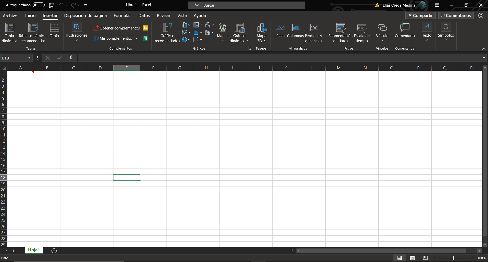

## Atajos de teclado 

### Documentación
* Agregar comentarios 
> SHIFT+F2

### Manipulación de Hojas
* Moverte entre páginas de Excel
> CTRL + FN + RePag/AvPag
* Selecciona toda la fila
> SHIFT + SPACE
* Seleccionar toda la columna
> CRTL + SPACE
* Agregar/eliminar filas
> CTRL + +/-
* Formato de celdas
> CTRL + 1
* Desplegar una lista
> ALT + Abajo

### Pegar
* CTRL + ALT + V

### Comandos generales
* Imprimir
> CTRL + P
* Seleccionar todo
> CTRL + E
* Abrir archivos
> CTRL + A
* Guardar información
> CTRL + G
* Buscar
> CTRL + B

### Manejo de datos
* Filtrar
> CTRL + SHIFT + L

## Estructura de un libro de Excel
* Filas y columnas
* Libro
* Hojas (Colorea y nombra las hojas) 

## Proteger información

* Proteger hoja
  * Revisar->ProtegerHoja
    * Asignar una contraseña
    * Bloquea celdas y hojas específicas
  * Seleccionar celdas
* Proteger libro
  * Impide que se edite la estructura del libro, no se pueden crear ni ver hojas ocultas
* Quitar lineas de cuadricula

  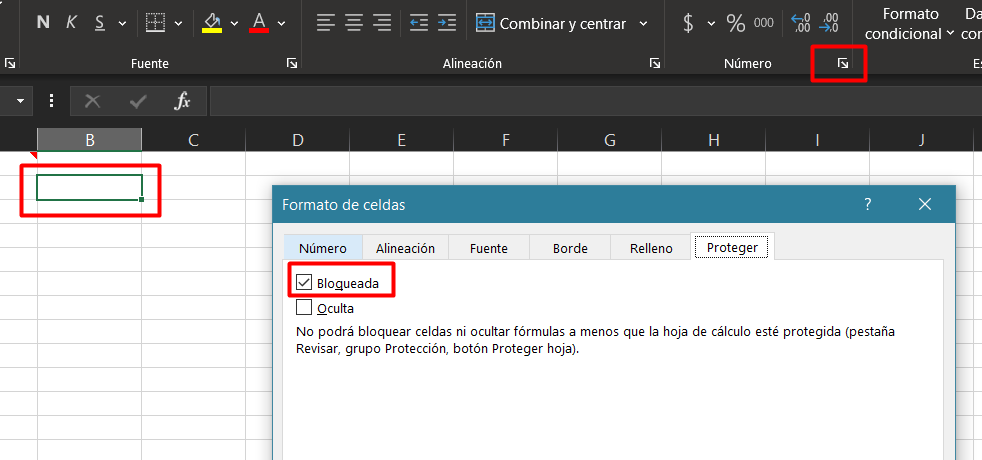

## Listas desplegables simples

  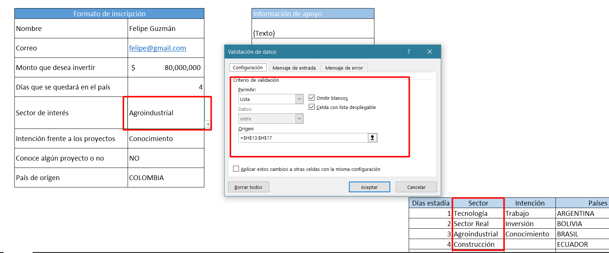

## Listas desplegables dependientes unas de otras

  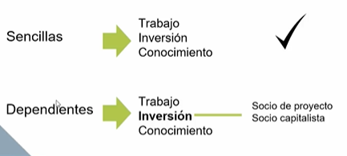

Etiquetar las columnas para hacer referencia a ellas

  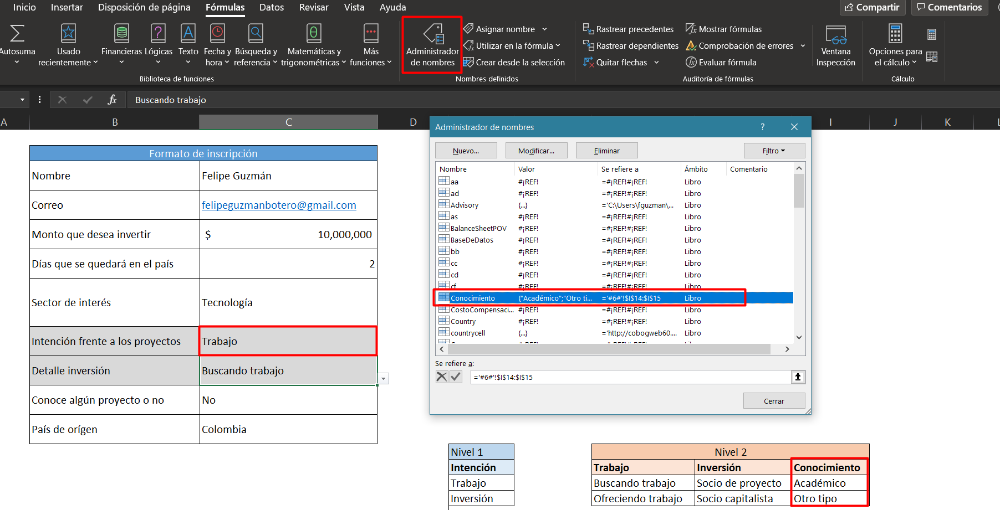

Función indirecto

  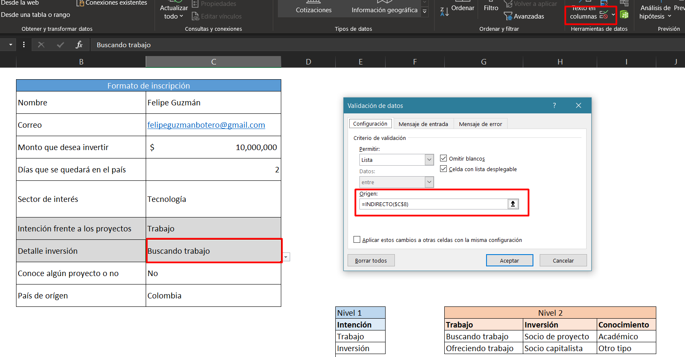

## Imprimir en Excel

La impresión empieza a cortar, pero se tienen diferentes opciones para configurar y adaptar a lo que necesitemos

* Vista -> Vista de salto de página
  * Permite ver como lo vería en la impresión

## Conceptos
* Combinar celdas y ajustar texto
* Estilos en las celdas
* Ancho y alto de filas/columnas

# Preparando la información
## Base de datos
## Búsquedas, filtros y ordenamiento
* Congelar columnas (inmovilizar)
  * Vista->Inmobilizar paneles
* Manejo de filtros
  * Búscar y seleccionar -> Filtrar
  * Los filtros se suman
* Ordenamiento
  * Ordenes personalizados
    * Ordenar y filtrar -> Criterios
## Separar texto y unir texto

**Formulas**
Unir texto
> =C5&" "&D5
> =concatenar(C5;" ";D5)

Separar texto
* Seleccionar rango
* Datos->Texto en Columnas ->Configurar

## Formulas básicas (Númericas y de texto)

Operaciones básicas
> =I4+J4+K4
> =SUMA(I4:K4)

Promedio
> =(I4+J4+K4)/3
> =PROMEDIO(I4+J4+K4)

Redondear
> REDONDEAR(O4,0)
> REDONDEAR(PROMEDIO(I4+J4+K4),0)

Búscar
> Buscar y reemplazar

## Formulas de texto
Mayusculas y minusculas
> =MAYUSC(R13)
> =MINUSC(R13)

Fechas
Se pueden realizar operaciones entre frecha de forma natural sumando y restando celdas
> =HOY()

## Condicionales
SumarSI (rango, criterio, rangoaoperar)
> =SUMAR.SI($D$4:$D$103,O5,$K$4:$K$103) 
> =CONTAR.SI($E$4:$E$103,O14)
> =PROMEDIO.SI($D$4:$D$103,O35,$I$4:$I$103)

## Nombrar rangos y operaciones

Cuándo uses frecuentemente rangos, puedes nombrar las celdas para realizar operaciones

## Promedio ponderado y fijación de datos

Promedio ponderado. Diferentes pesos porcentuales
> ``=(C4*70%)+(C5*30%)``
> =SUMAPRODUCTO(F4:F5,G4:G5)

Fijar elementos con el simbolo $
> =SUMAPRODUCTO($C$11:$E$11,C12:E12)

## Pegado especial

* Pegado especial
* Valores
* Formulas

  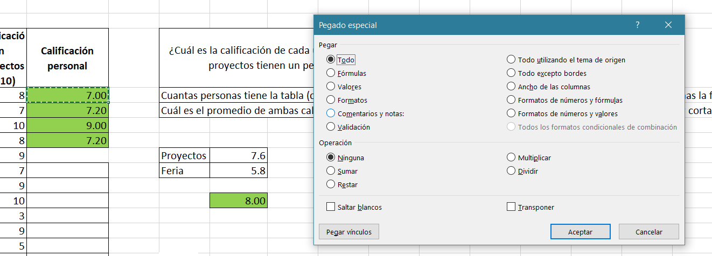

La opción de transponer puede ser útil en varios casos

https://exceltotal.com/diseno-de-bases-de-datos/

## Buscar V(vertical)

El valor buscado debe de estar en la primera columna de la matriz a búscar

  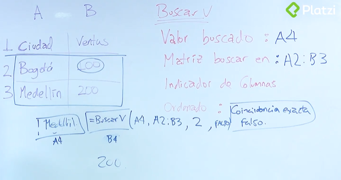

>=BUSCARV(B10,$B$4:$C$6,2,FALSO)
>=SI.ERROR(BUSCARV(B10,$B$4:$C$6,2,FALSO),"")

* Celdas formuladas es mejor práctica que indicar el valor de la columna directamente

## Buscar H(horizontal)

  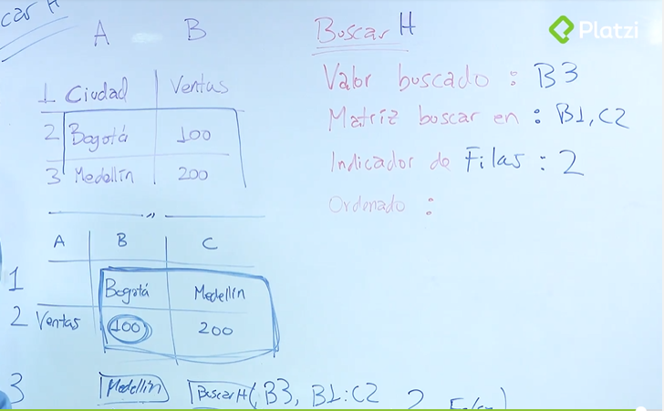

> =BUSCARH(B5,$C$8:$E$11,3,FALSO)
> =BUSCARH(B28,C30:E33,BUSCARV(C27,B31:F33,5,FALSO),FALSO)

## Formulas condicionales

Prueba lógica, verifica si el criterio se cumple

>=SI(C5="J","Platzi","Rojo")
>=SI(C25>=10,"Platzi",SI(C25>=7,"Amarillo","Rojo"))
>=SI(C3>=7,"aprobo","reprobo")
>=SI(F4="Platzi",SI(G4="Excel","Valido","Invalido"),"Invalido")

# Análisis de información

## Formatos condicionales

  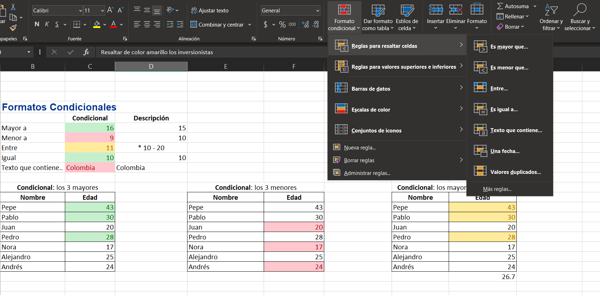

## Semaforos, celdas de colores y formulación

## Tablas dinámicas

https://support.office.com/es-es/article/consolidar-varias-hojas-de-c%C3%A1lculo-en-una-tabla-din%C3%A1mica-3ae257d2-ca94-49ff-a481-e9fc8adeeeb5

## TIpos de gráficas

* Pestaña Diseño
  * Cambiar entre filas y columnas
  * Seleccionar datos
  * Modificar etiquetas

  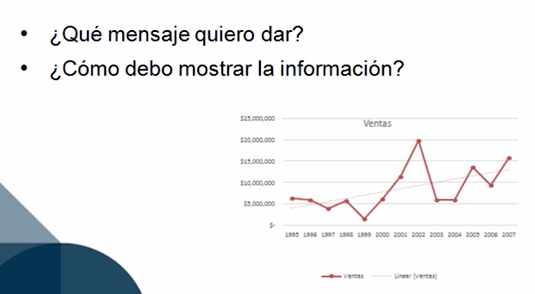

* **Gráficas de barras**
  * Permiten ver diferencias
* **Gráficas de líneas**
  * Cambios de un lado a otro
  * Tendencias
  * Diferencias entre elementos
* Gráfica de Pie
  * Permite ver proporciones
  * Analisis de porcentajes

## Gráficas

  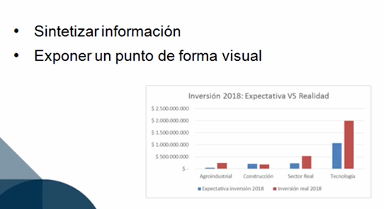

## Gráficas dinámicas

* Insertar -> Gráfico dinámico

  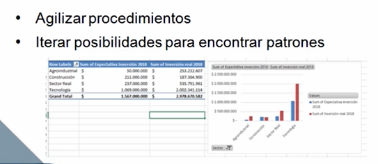

https://exceltotal.com/para-que-sirven-las-tablas-dinamicas/

## Formulación con tablas dinámicas

Alterar la formula al seleccionar un elemento en la tabla dinámica

  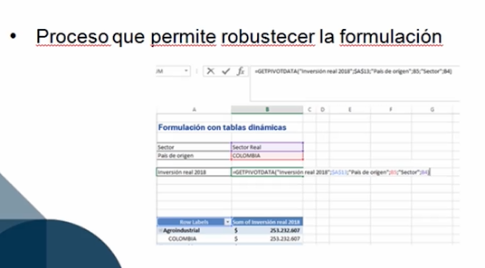

## Búscar un objetivo
* Herramientas para buscar una respuesta entre muchas posibilidades
* Deatos -> Análisis de hipotesis -> búscar objetivo
    * Celda resultado
    * Valor a obtener
    * Celda a cabiar

## Macros
* Escribiendo código
* Grabando la macro y modificando el código
