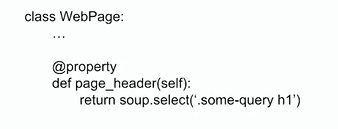
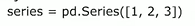
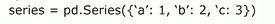

# Ingeniería de datos <!-- omit in toc -->

> * Flujo de extracción y preparación de los datos

## Tabla de Contenido<!-- omit in toc -->
- [Introducción](#introducci%c3%b3n)
  - [¿Qué es la Ciencia e Ingeniería de Datos?](#%c2%bfqu%c3%a9-es-la-ciencia-e-ingenier%c3%ada-de-datos)
  - [Roles](#roles)
  - [Ambiente](#ambiente)
    - [Anaconda](#anaconda)
      - [Jupyter notebooks](#jupyter-notebooks)
    - [Google colab](#google-colab)
  - [Tipos de datos](#tipos-de-datos)
  - [Fuentes de datos](#fuentes-de-datos)
    - [Herramientas para encontrar DataSets](#herramientas-para-encontrar-datasets)
  - [ETL](#etl)
- [Web Scrapping](#web-scrapping)
  - [Requests](#requests)
  - [Beautiful Soup](#beautiful-soup)
  - [Solicitudes a la web: Requests](#solicitudes-a-la-web-requests)
  - [Page Object Patter (Patrón de diseño)](#page-object-patter-patr%c3%b3n-de-dise%c3%b1o)
- [Pandas](#pandas)
  - [Estructuras de datos: Series](#estructuras-de-datos-series)
  - [Estructura de datos: DataFrames](#estructura-de-datos-dataframes)
  - [Índices y selección](#%c3%8dndices-y-selecci%c3%b3n)
    - [Dictionary like:](#dictionary-like)
    - [Numpy like:](#numpy-like)
    - [Label based:](#label-based)
  - [Data wrangling o domado de datos](#data-wrangling-o-domado-de-datos)
  - [Trabajar con datos faltanntes](#trabajar-con-datos-faltanntes)
- [Sistemas de información](#sistemas-de-informaci%c3%b3n)
  - [SQLite](#sqlite)
- [Nube](#nube)

# Introducción

La ingeniería de datos sigue un proceso de obtención de datos y datasets del mundo real de diferentes fuentes y lugares. Casi siempre estos datos vienen en un formato o estructura que no esta lista para el análisis adecuado.

> La ingeniería de datos se preocupan principalmente por implementar los pipelines que permiten automatizar la obtención de datos y su posterior limpieza para que otros profesionales de los datos(científicos de datos o expertos en machine learning) puedan realizar su labor. Son la primera parte de la cadena.
> 
<div align="center">
  
</div>

## ¿Qué es la Ciencia e Ingeniería de Datos?

La Ciencia de Datos es la **disciplina que se encarga de extraer conocimiento de los datos disponibles.** Casi siempre cuando te realizas una pregunta sobre datos estas fuentes se encuentran escondidas, ocultas o de difícil acceso. A nuestro alrededor hay datos en tu computadora, mesa, reloj, etc.

> Los datos están por todas partes.

**La Ciencia de datos es multidisciplinaria.** A diferencia de muchos otros ámbitos profesionales dentro del mundo de la tecnología cuando hablamos de un científico de datos es una persona que sabe de matemáticas, ingeniería de software y sabe de negocios.

* **Ciencia de la computación (Programación)**
  * Estructura de datos
  * Algoritmos
  * Visualización
  * Big Data
  * Programación
* **Estadística (Matemáticas)**
  * Regresiones
  * Inferencias
* **Conocimiento del dominio (Negocio)**
  * Preguntar lo correcto
  * Interpretar los resultados

> Se apoya en la Computer science, Matemáticas(Regresiones e Inferencias),

También se auxilia de:

* Bases de Datos (SQL - NoSQL)
* Análisis de texto y procesamiento de lenguaje natural
* Análisis númerico de datos y minado de datos
* Análisis de redes
* Visualización de datos
* Machine learning e Inteligencia Artificial
* Análisis de señales digitales
* Análisis de datos en la nube(Big Data)

## Roles

Por lo menos requiere 3 roles de datos

Existen por lo menos tres diferentes roles para tener un pipeline completo de ciencia de datos. Este curso trata sobre el primer rol:

* **Data engineer:** Se encarga de obtener los datos, Limpiarlos y estructurarlos para posterior análisis, crear pipelines de análisis automatizado, utilización de herramientas en la nube, análisis descriptivo de los datos.

* **Data scientist:** Una vez tiene los datos se encarga de **generar el análisis matemático de ellos, encontrar las relaciones entre las variables, las correlaciones, las causas y por último genera los modelos predictivos y prescriptivos.**

* **Machine Learning engineer:** Se encarga de **llevar las predicciones a escala, de subirlos a la nube y allí generar muchas predicciones.** Se encarga de mantener la calidad del modelo.

<div align="center">
  
</div>

## Ambiente

### Anaconda

Instalar:
https://www.anaconda.com/products/individual

```shell
conda --version
conda --help
conda list
```

Para actualizar la versión de anaconda

```shell
conda update -n base -c defaults conda
```

Para crear un nuevo ambiente virtual

```shell
conda create --name data beautifulsoup4 requests numpy pandas matplotlib yaml

conda activate data
conda env list
conda deactivate
conda remove --name data all
```

#### Jupyter notebooks

Jupyter Notebooks es un **entorno de programación en el cual podemos mezclar ejecución de código en vivo, visualizaciones y añadir markdown.**

Jupyter Notebook tiene diferentes tipos de celdas en las cuales podemos escribir código o markdown. Si queremos ejecutar nuestro código hacemos ctrl + enter y si queremos ejecutar y añadir una nueva celda shift + enter.

> Jupyter Notebook tiene dos modalidades, la modalidad de edición y navegación.

Para ejecutarlo necesitamos lo siguiente

```shell
jupyter notebook
```

Comandos básicos para usar Jupyter

* CTRL + ENTER Ejecuta celda
* SHIFT + ENTER Nueva línea
* ESC Sale de la celda
* K y J Navegación
* En las celdas con letra M, se pasa a modo Markdown
* Para ver la lista de comandos se necesita ejecutar P
* C, X, V

Es posible convertir notebooks a un PDF

https://nbconvert.readthedocs.io/en/latest/install.html

```shell
jupyter nbconvert your_notebook.ipynb --to pdf
```

Para mayor documentación

https://jupyter-notebook.readthedocs.io/en/stable/index.html

### Google colab

Colab es la versión de Jupyter en la nube impulsado por Google

https://colab.research.google.com/notebooks/intro.ipynb

## Tipos de datos

Los datos vienen en muchas formas y estas formas las podemos clasificar de diferentes maneras, permitiéndonos poder aplicar técnicas distintas a cada uno de los tipos de datos.

* Los primeros datos son los primitivos.
    * int, str, bool, float, hex, oct, datetime, objetos especiales
* Estructurados
  * SQL
  * DatawareHouses
* Semi estructurados 
  * APIs
  * Tabulares (CSV/Excel)
* No estructurados.
  * HTML
  * Texto libre
  * CVs
  * Imagenes, audio, social media
  * Datos cientificos
* Cualitativos vs cuantitativos
* Tiempo real vs historicos

Los estructurados son los más fáciles de acceder a su información, los semis estructurados donde podemos usar las APIs y los No estructurados son la mayoría de los datos que te vas a encontrar en tu desarrollo profesional.

## Fuentes de datos
* **Web**
  * Finanzas
  * Statups
  * Negocios
  * Clima
* **APIs**
  * Google
  * Facebook
  * Twitter
* **Logs**
* **User analytics**
  * Google analytics
* **IOT**
  * Sensores
  * Automóviles
* **Datos abiertos del gobierno**

### Herramientas para encontrar DataSets

* Google Data Search
https://datasetsearch.research.google.com/

* Data.World
https://data.world/

* Kaggle
https://www.kaggle.com/

* Nasa
https://data.nasa.gov/browse

* NOAA
https://www.ncdc.noaa.gov/cdo-web/datasets

* Datos abiertos México
https://datos.gob.mx/

## ETL

ETL = Extract Transform Load

* **Extract:** Es el proceso de lectura de datos de diversas fuentes
  * Base de datos
  * CRM
  * Archivos CSV
  * Datasets públicos
* **Transform:** En este momento cuando nosotros tenemos que transformar los datos, tenemos que identificar datos faltantes o datos erróneos o una edad negativa. En esta etapa donde tenemos que identificar todos los problemas y solucionarlos.
  * Limpieza
  * Estructurado
  * Enriquecimiento.
* **Load:** Una vez transformados debemos insertarlos en el **data warehouse**

> Depende del tipo de solución que se haya escogido

# Web Scrapping

Las tecnologías web en principio podemos pensarlas como el internet, pero el internet es mucho más grande, es la red de redes, la forma en la que millones de computadores se conectan entre ellas para transferirse información.

El internet también se compone de otros pedazos como telefonía(voip), mail(pop3, imap), compartir archivos(ftp). **El internet es una red que une varias redes públicas, privadas, académicas, de negocios, de gobiernos, etc.**

<hr>

**La web específicamente es un espacio de información** en el cual varios documentos(y otros recursos web) se pueden acceder a través de URLs y vínculos(links). La comunicación se da a través del protocolo HTTP.

Elementos básicos de la web:

* **HTML:** nos da la estructura de la información. Es un lenguaje para anotar pedazos de información para que el navegador o otros tipos de programa puedan interpretar que tipo de información se encuentra ahí.
* **CSS:** nos permite darle colores, arreglar el texto y añadir diferentes elementos de presentación.
* **Javascript:** nos permite añadir interactividad y cómputo a nuestra web.
* **JSON:** Simplemente es una forma de transmitir datos entre servidores y clientes. Es la forma estándar en las que en la web y las aplicaciones se comunican con los servidores backend.

Conceptos clave

> **Pipeline** en su definición más sencilla es una serie de pasos para **convertir una entrada en algo diferente**, el automatizar estos pipelines es disminuir la intervención humana para que se ejecuten estos pipelines.

Resumiendo web scrapping

> **Web Scrapping** es **tomar la información publica de un sitio web, manipularla (transformarla, analizarla) para poder obtener otra información**, esta transformación y análisis se hacen por medio de pipelines para descargar la información, revisarla y poder convertirla en información útil para lo que necesitas.

## Requests

https://requests.readthedocs.io/es/latest/

Para poder experimentar con la web necesitamos un método programático para solicitar URLs y obtener HTML

> **Requests:** Nos permite **generar solicitudes a la web dentro de Python y utilizar los diferentes verbos HTTP**, normalmente utilizaremos el método **GET** porque vamos a traer datos.

* requests.get('url') para hacer una solicitud a la web y nos devolverá un objeto response

> Todas las solicitudes HTTP tienen metadatos para que los diferentes sistemas y computadoras puedan entender de qué va la solicitud.

## Beautiful Soup

https://www.crummy.com/software/BeautifulSoup/bs4/doc/

En el caso de Python la **librería estándar para manipular los documentos HTML se llama BeautifulSoup.**

BeautifulSoup nos ayuda a **organizar gramaticalmente(parsear) el documento HTML** para que tengamos una estructura con la cual podamos manejar y extraer información. **BeautifulSoup convierte el string de HTML en un árbol de nodos para poder manipularlo.**

Para manipularlo podemos usar los selectores CSS con **soup.select()**


## Solicitudes a la web: Requests

**Un buen Data engineer utiliza los conceptos de la ingeniería de software para poder desarrollar sus programa.** En nuestro caso para poder desarrollar nos apoyaremos de un patrón.

## Page Object Patter (Patrón de diseño)

> Es un patrón que consiste en esconder los queries especificos que se utilizan para manipular un documento HTML detrás de un objeto que representa la página web.

**Si estos queries se añaden directamente al código principal, el código se vuelve frágil** y va a depender mucho de la modificación que hagan a la web otras personas y arreglarlo se vuelve muy complicado

https://medium.com/tech-tajawal/page-object-model-pom-design-pattern-f9588630800b

<div align="center">
  
</div>

# Pandas

**Pandas nos otorga diversas facilidades para el ““domado de datos””. Nos otorga dos estructuras de datos:**

* **Series:** Es un **array** unidimensional que representa una **columna**.
* **DataFrame:** Es un **conjunto de series que forman una tabla.** Se pueden acceder a través de indices como una etiqueta(label) o pueden ser posicionales es decir 0 o índice 100. 

> También pueden ser rangos o slices
Estas estructuras de datos no son contenedores de datos. En Pandas **las utilizamos para transformar y enriquecer nuestros datos, manipularlos, manejar los faltantes, realizar operaciones aritméticas, combinar diferentes dataframes en uno solo para obtener una nueva tabla.**

https://likegeeks.com/es/tutorial-de-python-pandas/

https://www.learnpython.org/es/Pandas%20Basics

https://s3.amazonaws.com/assets.datacamp.com/blog_assets/PandasPythonForDataScience.pdf

## Estructuras de datos: Series

Series es un **vector unidimensional**, para poder acceder a esta lista **podemos usar posiciones o labels**, siendo este último el preferido para manipular las series. **Una diferencia importante sobre las listas de Python es que los datos son homogéneos**, es decir solo podemos tener un tipo de dato por cada Serie.

> Las Series se pueden crear a partir de cualquier secuencia(listas, tuplas, arrays de numpy y diccionarios).

En Python tenemos la **filosofía del Duck Typing, si se ve como un pato y hace cuac, a ese animal le llamamos pato,** si una serie se comporta una lista, se accede como una lista en principio deberíamos llamarla lista, pero esto no es así.

> Una mejor aproximación para inicializar Series es utilizar **diccionarios**.

<div align="center">
  
</div>

<div align="center">
  
</div>


## Estructura de datos: DataFrames

DataFrames **son simplemente una tabla donde las filas y las columnas tienen etiquetas**, se puede construir de diferentes formas pero siempre debemos considerar que la estructura que necesitamos construir para inicializarla tiene que ser bidimensional. 

> Una matriz y puede ser una lista de listas, lista de tuplas, un diccionario de Python u otro DataFrame.

**Si solo tenemos una dimensión a eso no le llamamos DataFrame, le llamamos Serie**. Cuando utilizamos un diccionario las llaves se convierten en las llaves de la columna.

## Índices y selección
Existen muchas formas de manipular los DataFrames y de seleccionar los elementos que queremos transformar.

### Dictionary like:

```python
df['col1'] 
df[['col1', 'col3']]
```

### Numpy like:

```python
iloc = index location
df.iloc[:]
df.iloc[:,:]
```

### Label based:
```python
loc = location
df.loc[:]
df.loc[:,:]
```
|
Existe una gran diferencia en la forma en la que utilizamos estos slices porque varia de la forma tradicional de Python. loc va a incluir el final del que necesitamos.


## Data wrangling o domado de datos

**Data wrangling es una de las actividades más importantes de todos los profesionales de datos.** Simplemente es limpiar, transformar y enriquecer el dataset para objetivos posteriores.

Pandas es una de las herramientas más poderosas para realizar este ““domado”” de datos. Recordemos que Pandas trae muchas de sus abstracciones del lenguaje R, pero nos otorga lo mejor de ambos mundos, por eso es tan popular.

Nos permite:

* Generar transformaciones con gran facilidad.
* Trabajar rápidamente con datasets grandes
* Detectar y reemplazar faltantes
agrupar y resumir nuestros datos
* Visualizar nuestros resultados.

## Trabajar con datos faltanntes

Los datos faltantes representan un verdadero problema sobre todo cuando estamos realizando agregaciones. **Imagina que tenemos datos faltantes y los llenamos con 0, pero eso haría que la distribución de datos se modificaría radicalmente.** Podemos eliminar los registros, pero la fuerza de nuestras conclusiones se debilita.

Pandas nos otorga varias funcionalidades para identificarlas y para trabajar con ellas. 

**Existe el concepto que se llama NaN, cuando existe un dato faltante simplemente se rellena con un NaN y en ese momento podemos preguntar cuáles son los datos faltantes con .isna().**

* **notna()** para preguntar dónde hay datos completos.
* **dropna()** para eliminar el registro.

Para reemplazar:

* **fillna()** donde le damos un dato centinela
* **ffill()** donde utiliza el último valor.

https://www.geeksforgeeks.org/difference-between-map-applymap-and-apply-methods-in-pandas/

https://www.geeksforgeeks.org/how-to-get-a-list-of-class-attributes-in-python/

# Sistemas de información

**Los sistemas de datos vienen en muchos sabores y colores, SQL, NoSQL especializados en procesamiento en bloque, chorro y streaming.** Este tipo de sistema nos permite realizar queries sofisticadas y compartir nuestro trabajo con otros miembros del equipo.

* **Procesamiento de bloque:** Estamos hablando de datos históricos, qué sucedió ayer, en el trimestre pasado, cuáles fueron las ventas del año anterior o de los últimos cinco años. Nos permite realizar el procesamiento de manera eficiente.

* **Procesamiento en chorro:** Significa que estamos procesando los datos conforme van llegando, las transformaciones se realizan en tiempo real, Este tipo de sistema nos sirven para cuando queremos realizar decisiones en donde la importancia del tiempo es fundamental.

El criterio principal a tener en cuenta: **El tiempo que tienes.** Si bien los sistemas open source son gratis, para poderlos implementar necesitas tener conocimientos de cloud, debes poder saber trabajar y mantener máquinas.

SQL vs NoSQL

La discusión más relevante en el mundo de las aplicaciones web y móvil, donde dependiendo de la aplicación, la decisión puede ser fundamental para el crecimiento de la app.
La verdad es que para los profesionales de los datos, especialmente los profesionales de los datos. Es necesario saber ambos.

## SQLite

# Nube

La nube nos da un poder de cómputo casi inimaginable, nos permite procesar terabytes de datos en segundos. La nube se puede usar en dos grandes ocasiones. Cuando los datos ya no caben en tu computadora loca o cuando el tiempo de procesamiento esta siendo muy extenso, es en ese momento donde deberías usar la nube.

Si estas en un entorno de producción, si estas trabajando en una empresa y los datos de esa empresa ya viven en la nube, lo lógico es realizar el trabajo en la nube. Automatizar los scripts en ese mismo ambiente.

Diversas nubes ya ofrecen paquetes completos para el ciclo de datos, como Google Cloud:

* Dataflow
* Pub/Sub
* Cloud Storage
* Datalab
* BigQuery
* Dataproc
* Firestore
