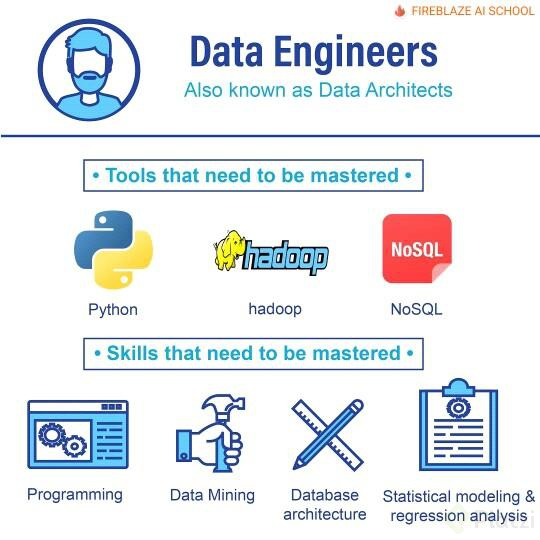

# Ingeniería de datos <!-- omit in toc -->

> * Flujo de extracción y preparación de los datos

## Tabla de Contenido<!-- omit in toc -->
- [Introducción](#introducci%c3%b3n)
  - [¿Qué es la Ciencia e Ingeniería de Datos?](#%c2%bfqu%c3%a9-es-la-ciencia-e-ingenier%c3%ada-de-datos)
  - [Roles](#roles)
  - [Ambiente](#ambiente)
    - [Anaconda](#anaconda)
      - [Jupyter notebooks](#jupyter-notebooks)
    - [Google colab](#google-colab)
  - [Tipos de datos](#tipos-de-datos)
  - [Fuentes de datos](#fuentes-de-datos)
    - [Herramientas para encontrar DataSets](#herramientas-para-encontrar-datasets)
  - [ETL](#etl)
- [Web Scrapping](#web-scrapping)
- [Pandas](#pandas)
- [Sistemas de información](#sistemas-de-informaci%c3%b3n)
- [Nube](#nube)

# Introducción

La ingeniería de datos sigue un proceso de obtención de datos y datasets del mundo real de diferentes fuentes y lugares. Casi siempre estos datos vienen en un formato o estructura que no esta lista para el análisis adecuado.

> La ingeniería de datos se preocupan principalmente por implementar los pipelines que permiten automatizar la obtención de datos y su posterior limpieza para que otros profesionales de los datos(científicos de datos o expertos en machine learning) puedan realizar su labor. Son la primera parte de la cadena.
> 
<div align="center">
  
</div>

## ¿Qué es la Ciencia e Ingeniería de Datos?

La Ciencia de Datos es la **disciplina que se encarga de extraer conocimiento de los datos disponibles.** Casi siempre cuando te realizas una pregunta sobre datos estas fuentes se encuentran escondidas, ocultas o de difícil acceso. A nuestro alrededor hay datos en tu computadora, mesa, reloj, etc.

> Los datos están por todas partes.

**La Ciencia de datos es multidisciplinaria.** A diferencia de muchos otros ámbitos profesionales dentro del mundo de la tecnología cuando hablamos de un científico de datos es una persona que sabe de matemáticas, ingeniería de software y sabe de negocios.

* **Ciencia de la computación (Programación)**
  * Estructura de datos
  * Algoritmos
  * Visualización
  * Big Data
  * Programación
* **Estadística (Matemáticas)**
  * Regresiones
  * Inferencias
* **Conocimiento del dominio (Negocio)**
  * Preguntar lo correcto
  * Interpretar los resultados

> Se apoya en la Computer science, Matemáticas(Regresiones e Inferencias),

También se auxilia de:

* Bases de Datos (SQL - NoSQL)
* Análisis de texto y procesamiento de lenguaje natural
* Análisis númerico de datos y minado de datos
* Análisis de redes
* Visualización de datos
* Machine learning e Inteligencia Artificial
* Análisis de señales digitales
* Análisis de datos en la nube(Big Data)

## Roles

Por lo menos requiere 3 roles de datos

Existen por lo menos tres diferentes roles para tener un pipeline completo de ciencia de datos. Este curso trata sobre el primer rol:

* **Data engineer:** Se encarga de obtener los datos, Limpiarlos y estructurarlos para posterior análisis, crear pipelines de análisis automatizado, utilización de herramientas en la nube, análisis descriptivo de los datos.

* **Data scientist:** Una vez tiene los datos se encarga de **generar el análisis matemático de ellos, encontrar las relaciones entre las variables, las correlaciones, las causas y por último genera los modelos predictivos y prescriptivos.**

* **Machine Learning engineer:** Se encarga de **llevar las predicciones a escala, de subirlos a la nube y allí generar muchas predicciones.** Se encarga de mantener la calidad del modelo.

<div align="center">
  
</div>

## Ambiente

### Anaconda

Instalar:
https://www.anaconda.com/products/individual

```shell
conda --version
conda --help
conda list
```

Para actualizar la versión de anaconda

```shell
conda update -n base -c defaults conda
```

Para crear un nuevo ambiente virtual

```shell
conda create --name data beautifulsoup4 requests numpy pandas matplotlib yaml

conda activate data
conda env list
conda deactivate
conda remove --name data all
```

#### Jupyter notebooks

Jupyter Notebooks es un **entorno de programación en el cual podemos mezclar ejecución de código en vivo, visualizaciones y añadir markdown.**

Jupyter Notebook tiene diferentes tipos de celdas en las cuales podemos escribir código o markdown. Si queremos ejecutar nuestro código hacemos ctrl + enter y si queremos ejecutar y añadir una nueva celda shift + enter.

> Jupyter Notebook tiene dos modalidades, la modalidad de edición y navegación.

Para ejecutarlo necesitamos lo siguiente

```shell
jupyter notebook
```

Comandos básicos para usar Jupyter

* CTRL + ENTER Ejecuta celda
* SHIFT + ENTER Nueva línea
* ESC Sale de la celda
* K y J Navegación
* En las celdas con letra M, se pasa a modo Markdown
* Para ver la lista de comandos se necesita ejecutar P
* C, X, V

Es posible convertir notebooks a un PDF

https://nbconvert.readthedocs.io/en/latest/install.html

```shell
jupyter nbconvert your_notebook.ipynb --to pdf
```

Para mayor documentación

https://jupyter-notebook.readthedocs.io/en/stable/index.html

### Google colab

Colab es la versión de Jupyter en la nube impulsado por Google

https://colab.research.google.com/notebooks/intro.ipynb

## Tipos de datos

Los datos vienen en muchas formas y estas formas las podemos clasificar de diferentes maneras, permitiéndonos poder aplicar técnicas distintas a cada uno de los tipos de datos.

* Los primeros datos son los primitivos.
    * int, str, bool, float, hex, oct, datetime, objetos especiales
* Estructurados
  * SQL
  * DatawareHouses
* Semi estructurados 
  * APIs
  * Tabulares (CSV/Excel)
* No estructurados.
  * HTML
  * Texto libre
  * CVs
  * Imagenes, audio, social media
  * Datos cientificos
* Cualitativos vs cuantitativos
* Tiempo real vs historicos

Los estructurados son los más fáciles de acceder a su información, los semis estructurados donde podemos usar las APIs y los No estructurados son la mayoría de los datos que te vas a encontrar en tu desarrollo profesional.

## Fuentes de datos
* **Web**
  * Finanzas
  * Statups
  * Negocios
  * Clima
* **APIs**
  * Google
  * Facebook
  * Twitter
* **Logs**
* **User analytics**
  * Google analytics
* **IOT**
  * Sensores
  * Automóviles
* **Datos abiertos del gobierno**

### Herramientas para encontrar DataSets

* Google Data Search
https://datasetsearch.research.google.com/

* Data.World
https://data.world/

* Kaggle
https://www.kaggle.com/

* Nasa
https://data.nasa.gov/browse

* NOAA
https://www.ncdc.noaa.gov/cdo-web/datasets

* Datos abiertos México
https://datos.gob.mx/

## ETL

ETL = Extract Transform Load

* **Extract:** Es el proceso de lectura de datos de diversas fuentes
  * Base de datos
  * CRM
  * Archivos CSV
  * Datasets públicos
* **Transform:** En este momento cuando nosotros tenemos que transformar los datos, tenemos que identificar datos faltantes o datos erróneos o una edad negativa. En esta etapa donde tenemos que identificar todos los problemas y solucionarlos.
  * Limpieza
  * Estructurado
  * Enriquecimiento.
* **Load:** Una vez transformados debemos insertarlos en el **data warehouse**

> Depende del tipo de solución que se haya escogido

# Web Scrapping

Las tecnologías web en principio podemos pensarlas como el internet, pero el internet es mucho más grande, es la red de redes, la forma en la que millones de computadores se conectan entre ellas para transferirse información.

El internet también se compone de otros pedazos como telefonía(voip), mail(pop3, imap), compartir archivos(ftp). **El internet es una red que une varias redes públicas, privadas, académicas, de negocios, de gobiernos, etc.**

<hr>

**La web específicamente es un espacio de información** en el cual varios documentos(y otros recursos web) se pueden acceder a través de URLs y vínculos(links). La comunicación se da a través del protocolo HTTP.

Elementos básicos de la web:

* **HTML:** nos da la estructura de la información. Es un lenguaje para anotar pedazos de información para que el navegador o otros tipos de programa puedan interpretar que tipo de información se encuentra ahí.
* **CSS:** nos permite darle colores, arreglar el texto y añadir diferentes elementos de presentación.
* **Javascript:** nos permite añadir interactividad y cómputo a nuestra web.
* **JSON:** Simplemente es una forma de transmitir datos entre servidores y clientes. Es la forma estándar en las que en la web y las aplicaciones se comunican con los servidores backend.

# Pandas

# Sistemas de información

# Nube