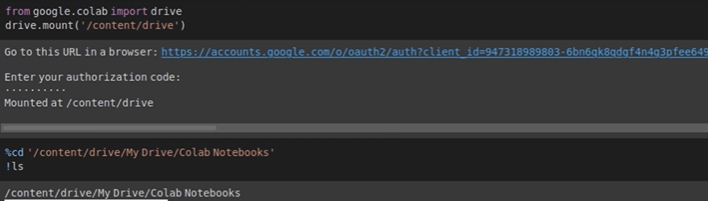
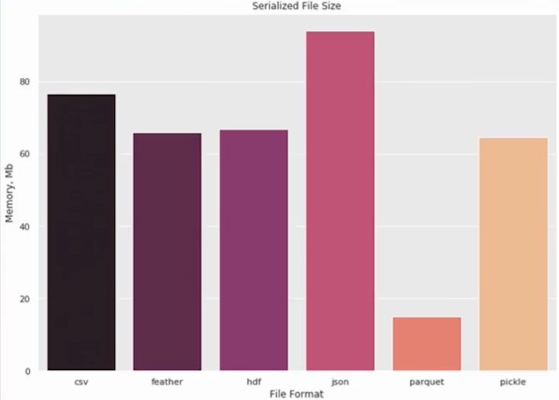
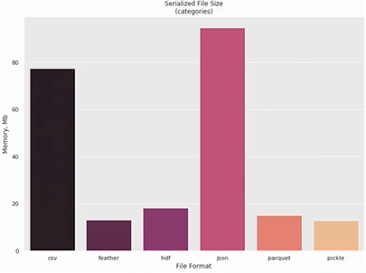
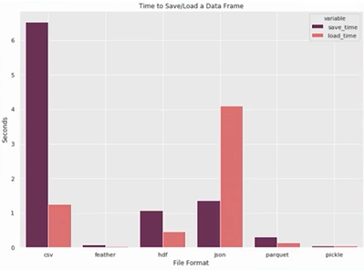
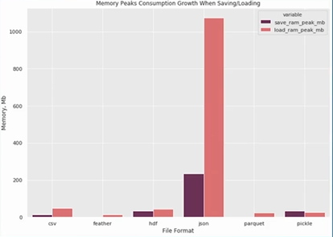
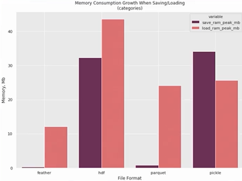
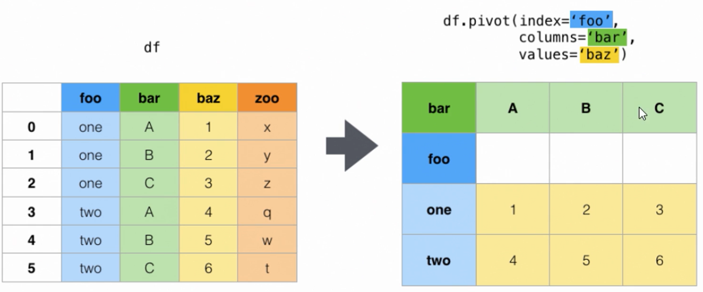

# Python Pandas <!-- omit in toc -->

## Tabla de Contenido<!-- omit in toc -->
- [Introducción](#introducci%c3%b3n)
  - [Ventajas](#ventajas)
  - [Desventajas](#desventajas)
- [Code](#code)
- [Conectar colab con Google Drive](#conectar-colab-con-google-drive)
- [Formatos para guardar información](#formatos-para-guardar-informaci%c3%b3n)
  - [Conexión a SQL](#conexi%c3%b3n-a-sql)
    - [SQL Alchemy](#sql-alchemy)
  - [Otros formatos de entrada y salida de datos](#otros-formatos-de-entrada-y-salida-de-datos)
- [Funcionalidades especiales de pandas](#funcionalidades-especiales-de-pandas)
  - [Formatos de lectura para cargar y guardar DataFrames](#formatos-de-lectura-para-cargar-y-guardar-dataframes)
  - [Tipos de Variables que componen un data frame](#tipos-de-variables-que-componen-un-data-frame)
  - [Pandas aplicado](#pandas-aplicado)
  - [Merge](#merge)
  - [Pivot](#pivot)
  - [Interpolación líneal](#interpolaci%c3%b3n-l%c3%adneal)


# Introducción

Es la librería más utilizada por todos los cientificos de datos.

El término **pandas** proviene de **paneles de datos**.

Un panel de datos es una estructura de datos organizado por categorías dónde podemos tener cadenas, números, booleanos que podemos utilizar

Inventada en el 2008 para analizar los mercados financieros

**Pandas**

https://pandas.pydata.org/docs/

<div align="center">
  
</div>

## Ventajas
* Reduce las líneas de código
* Diseñada especialmente para análisis
* API fácil y consisa
* Multiples funciones

## Desventajas
* Incompatibilidad con matrices 3D (numpy)
* Curva de aprendizaje lenta

# Code

Disponible en los archivos de la sección desde Jupyter

# Conectar colab con Google Drive

<div align="center">
  
</div>

# Formatos para guardar información

* Texto plano
* SQL

## Conexión a SQL

Pandas cuenta con una funcionalidad que facilita el acceso a tus bases de datos tipo SQL, para ello te mostrare algunos ejemplos:

Valida que tengas la librería psycopg2 usando el comando import. Si no está instalada en tu ambiente, usa el comando ``!pip install psycopg2`` en la terminal de python para instalarlo.

Comenzamos cargando las librerías:

```python
import pandas as pd
import psycopg2
```

Luego creamos el elemento de conexión con el siguieente código:

```python
conn_sql = psycopg2.connect(user = "user_name",
                            password = "password",
                            host = "xxx.xxx.xxx.xxx",
                            port = "5432",
                            database = "postgres_db_name")
```

Seguido simplemente definimos nuestra query en SQL:

```python
query_sql = '''
select *
from table_name
limit 10
'''
```

Y creamos nuestro dataframe:

```python
df = pd.read_sql(query_sql, sql_conn)
df.head(5)
```

### SQL Alchemy

Valida que tengas la librería sqlalchemy usando el comando import, si no está instalada en tu ambiente, usa el comando ``!pip install sqlalchemy`` en la terminal de python para instalarlo.

Comenzamos cargando las librerías:

```python
import pandas as pd
import sqlalchemy as sql
```

Escogemos nuestra base de datos, Oracle, MySql o la de tu preferencia:

```python
database_type = 'mysql'
database_type = 'oracle'
```

Luego creamos el elemento de conexión con el siguiente código:

```python
user = 'user_name'
password = 'password'
host = 'xxx.xxx.xxx.xxx:port'
database = 'database_name'

conn_string = '{}://{}:{}@{}/{}'.format(
database_type, user, password, host, database)

sql_conn = sql.create_engine(conn_string)
```

Seguido simplemente definimos nuestra query en SQL:

```python
query_sql = '''
select *
from table_name
limit 10
'''
```
Y creamos nuestro dataframe con:

```python
df = pd.read_sql(query_sql, sql_conn)
df.head(5)
```

La libreria sqlalchemy también soporta PostgreSQL y otras fuentes de datos.

## Otros formatos de entrada y salida de datos

https://pandas.pydata.org/pandas-docs/stable/user_guide/io.html

# Funcionalidades especiales de pandas

## Formatos de lectura para cargar y guardar DataFrames

<div align="center">
  
</div>

Si categorizamos las variables

<div align="center">
  
</div>

Tiempo de carga y lectura

<div align="center">
  
</div>

En cuanto a consumo de memoria RAM

<div align="center">
  
</div>

<div align="center">
  
</div>

## Tipos de Variables que componen un data frame

https://datasetsearch.research.google.com/

Base de datos de la NASA

https://data.nasa.gov/Space-Science/Meteorite-Landings/gh4g-9sfh

## Pandas aplicado

https://www.kaggle.com/hmavrodiev/london-bike-sharing-dataset

https://data.worldbank.org/

https://www.kaggle.com/sudalairajkumar/novel-corona-virus-2019-dataset?select=covid_19_data.csv

## Merge

<div align="center">
  
</div>

## Pivot

<div align="center">
  
</div>

## Interpolación líneal

https://matematica.laguia2000.com/general/interpolacion-lineal