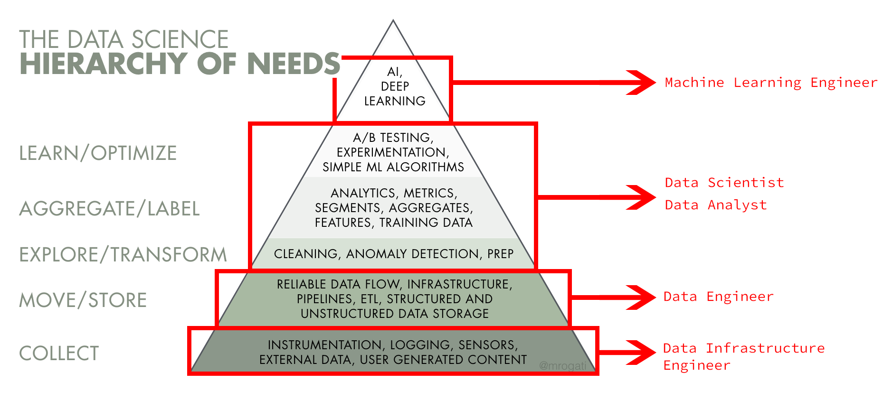

# Ciencia de datos <!-- omit in toc -->

> La ciencia de datos es un campo interdisciplinario que **utiliza métodos, procesos, algoritmos y sistemas científicos para extraer valor de los datos**. Los científicos de datos combinan una variedad de habilidades, entre ellas **estadísticas, informática y conocimiento empresarial**, para analizar datos recopilados de la web, de teléfonos inteligentes, de clientes, sensores y otras fuentes.

La ciencia de datos **revela tendencias y genera información que las empresas pueden utilizar para tomar mejores decisiones y crear productos y servicios más innovadores.** Los datos son el cimiento de la innovación, pero su valor proviene de la información que los científicos pueden extraer y luego utilizar a partir de los mismos.

## Tabla de Contenido<!-- omit in toc -->
- [Temas](#temas)
- [Flujo en el tratamiento de datos](#flujo-en-el-tratamiento-de-datos)
- [Perfiles para el tratamiento de datos](#perfiles-para-el-tratamiento-de-datos)

# Temas

* [Matemáticas aplicadas](/learn/DataScience/Matematicas%20Aplicadas)
* [Ingenieria de datos](/learn/DataScience/Ingenieria%20de%20datos)
* [Aprendizaje supervisado: Regresiones](/learn/DataScience/Regresiones)
* [Estadistica y análisis de datos](/learn/DataScience/StatsAndDataAnalysis)
* [Excel análisis de datos](/learn/DataScience/Excel)
* [DataScience con R](/learn/DataScience/Datascience)
* [PostgreSQL para Ciencia de Datos](/learn/DataScience/PostgreSQL)
* [Python - Pandas](/learn/DataScience/Pandas)

# Flujo en el tratamiento de datos

  

# Perfiles para el tratamiento de datos

**1 – Chief Data Officer (CDO):** es el responsable de asegurar que la organización es data driven. Lidera la gestión de datos y analítica asociada por el negocio y, por tanto, es responsable de los diferentes equipos especialidades en datos.

**2 – Data Scientists (científico de los datos):** son los miembros clave del equipo de ciencia de datos. Permiten extraer conocimiento e información valiosa de los datos. Tienen visión general del proceso de extremo a extremo y pueden resolver problemas de ciencias datos, la construcción de modelos analíticos y algoritmos. Combinan diversas habilidades relacionadas con las matemáticas, la estadística, la programación y visualización, pero también deben tener habilidades comunicativas, para explicar los resultados obtenidos en la organización.

**3 – Citizen Data Scientist:** es la persona dentro de la organización que típicamente no está formada específicamente para ser Data Scientist, pero que puede extraer valor, a través de su experiencia, explorando los datos, desde las unidades de negocio. Pueden ejecutar una serie simple de tareas analíticas utilizando herramientas de descubrimiento de datos.

**4 – Data Engineer (ingeniero de datos):** Se encarga de proporcionar los datos de una manera accesible y apropiada a los usuarios y Deata scientists. Es un perfil especializado en infraestructura Big Data. Desarrolla y explota técnicas, procesos, herramientas y métodos que deben servir para el desarrollo de aplicaciones Big Data. Tiene un gran conocimiento en gestión de bases de datos, arquitecturas de clusters, lenguajes de programación y sistemas de procesamiento de datos.

**5 – Data Steward (administrador de datos):** es responsable de mantener la calidad, disponibilidad y seguridad de los datos. Persigue mejorar el almacenamiento y presentación de los datos en toda la empresa. Tiene conocimientos de los procesos de negocio y de cómo los datos se utilizan dentro de estos procesos.

**6 – Business Data Analyst (analista de datos):** participa en las iniciativas y proyectos de análisis de datos. Es la persona que recoge las necesidades de los usuarios de negocio para los Data Scientist y presenta resultados obtenidos.

**7 – Data Artist:** son expertos en Business Analytics y son los responsables de crear los gráficos, infografías y otras herramientas visuales para ayudar a las diferentes personas de la organización a comprender datos complejos.

  

