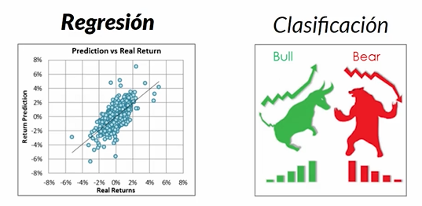
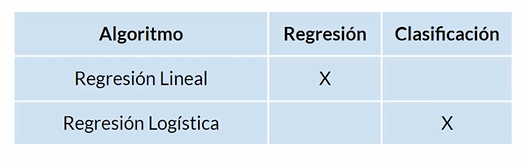
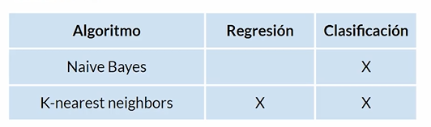
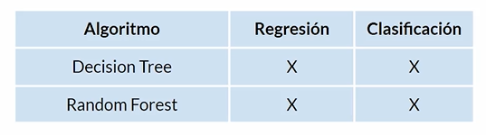
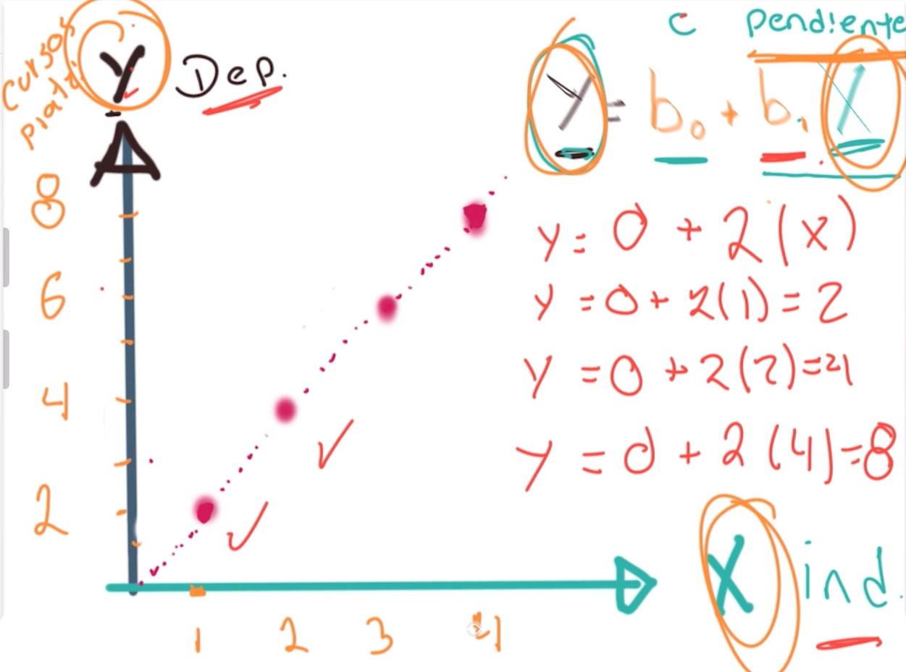
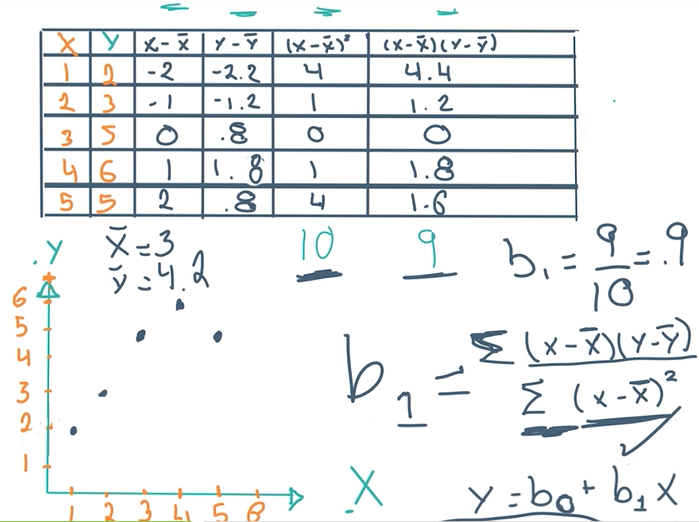
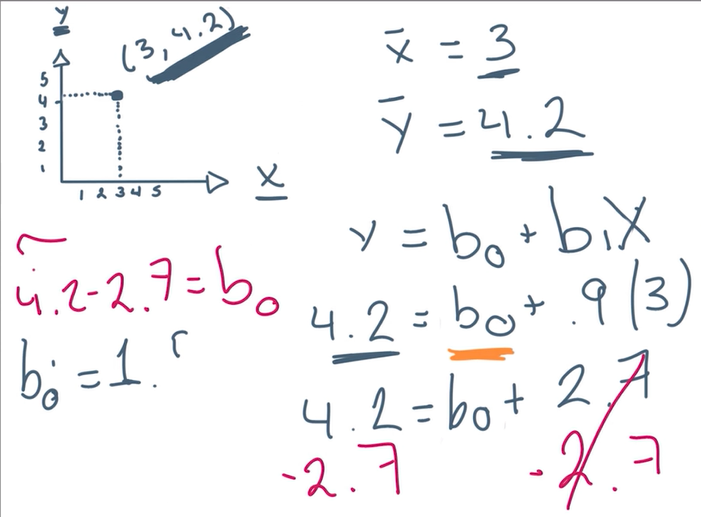
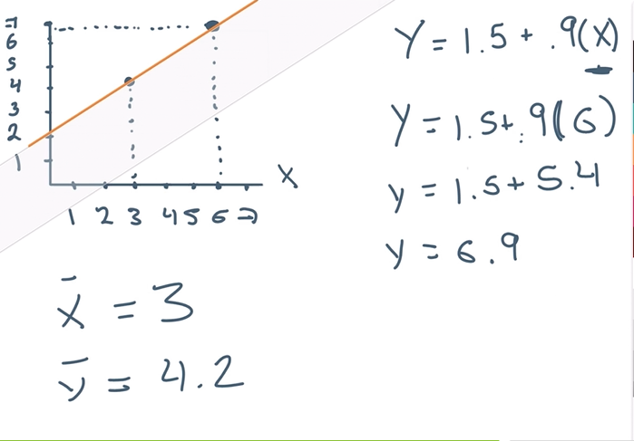

# Regresiones líneales <!-- omit in toc -->

> * Análisis de datos mediante regresiones líneales

## Tabla de Contenido<!-- omit in toc -->
- [Introducción al ML y modelos predictivos](#introducci%c3%b3n-al-ml-y-modelos-predictivos)
  - [Clasificación](#clasificaci%c3%b3n)
  - [Algoritmos de aprendizaje supervisado](#algoritmos-de-aprendizaje-supervisado)
- [La matemática detras de la regresión lineal](#la-matem%c3%a1tica-detras-de-la-regresi%c3%b3n-lineal)
  - [Método de mínimos cuadrados](#m%c3%a9todo-de-m%c3%adnimos-cuadrados)

# Introducción al ML y modelos predictivos

* Necesita de un dataset con observaciones etiquetadas
* Contar con un set de entrenamiento y un set de pruebas para validar si el entrenamiento es eficiente o no
* Modelo de machine learning
* Modelo predictivo al que se le ponen datos nuevos y comienza a predecir
* Reajustar y entrenar el modelo

  

> Ej. Precios de vienes raíces año por año de una zona. X año, Y costo de la casa en la zona. Tienes los datos de 1920 hasta la fecha y quieres predecir cuanto va a ser el costo de una casa en 2025

Predecir datos futuros o previos utilizando una línea que pase por la mayoría de los datos

* Son algoritmos supervisados
* Predicción de datos nuevos

  

* Estimar crecimiento de la población
* Predicción del clima
* Predicción del mercado

## Clasificación

* Retención de clientes
* Diagnósticos
* Clasificación de imagenes

## Algoritmos de aprendizaje supervisado

  

  

  

# La matemática detras de la regresión lineal

Modelo matemático que nos va a ayudar a encontrar la relación entre una variable dependiente e independiente

* X **La variable independiente** es una variable que controlamos
* Y **La variable dependiente** está fuera de nuestro control, influyen más factores

También dispones de una **constante** y una **pendiente**

  

## Método de mínimos cuadrados

  

  

  

