# Estadística y análisis de datos <!-- omit in toc -->

> * Análisis de datos con Python

## Tabla de Contenido<!-- omit in toc -->
- [Practicas](#practicas)
- [Introducción](#introducci%c3%b3n)
- [Conceptos clave de estadística](#conceptos-clave-de-estad%c3%adstica)
  - [Experimento de Bernoulli](#experimento-de-bernoulli)
- [Distribución binomial](#distribuci%c3%b3n-binomial)
  - [Distribución de probabilidad](#distribuci%c3%b3n-de-probabilidad)
- [Caraterizar información a traves de análisis exploratorio](#caraterizar-informaci%c3%b3n-a-traves-de-an%c3%a1lisis-exploratorio)
  - [Medidas de tendencia central](#medidas-de-tendencia-central)
  - [Estadística descriptiva (Diagramas de frecuencia)](#estad%c3%adstica-descriptiva-diagramas-de-frecuencia)
    - [Histogramas](#histogramas)
  - [Teorema de bayes](#teorema-de-bayes)
  - [Funciones de distribución continua y discreta](#funciones-de-distribuci%c3%b3n-continua-y-discreta)
    - [Distribución de probabilidad discreta](#distribuci%c3%b3n-de-probabilidad-discreta)
  - [Distribuciones discretas de mayor aplicación](#distribuciones-discretas-de-mayor-aplicaci%c3%b3n)
  - [Distribuciones continuas de mayor aplicación](#distribuciones-continuas-de-mayor-aplicaci%c3%b3n)
  - [Estandarización de covarianza y correlación](#estandarizaci%c3%b3n-de-covarianza-y-correlaci%c3%b3n)
- [Conceptos estadísticos análiticos](#conceptos-estad%c3%adsticos-an%c3%a1liticos)
  - [Estimadores](#estimadores)
- [Estimadores de máxima verosimilitud](#estimadores-de-m%c3%a1xima-verosimilitud)
  - [Distribuciones muestrales](#distribuciones-muestrales)
  - [Teorema de límite central](#teorema-de-l%c3%admite-central)
  - [Inferencia estadística a través de una hipótesis](#inferencia-estad%c3%adstica-a-trav%c3%a9s-de-una-hip%c3%b3tesis)
  - [Errores estadísticos](#errores-estad%c3%adsticos)
  - [Intervalos de confianza](#intervalos-de-confianza)
- [Modelos estadísticos y de predicción](#modelos-estad%c3%adsticos-y-de-predicci%c3%b3n)
  - [Regresión líneal](#regresi%c3%b3n-l%c3%adneal)
  - [Regresión lógistica](#regresi%c3%b3n-l%c3%b3gistica)
  - [Árboles de decisión](#%c3%81rboles-de-decisi%c3%b3n)
- [Proyecto estádistico](#proyecto-est%c3%a1distico)

# Practicas

* [Acceso a las prácticas](practicas/)

# Introducción

https://www.youtube.com/user/arturoerdely/playlists

Estadística
* Estadística en papel, spreadsheets
* Estadística en open source: big data y capacidad de cómputo, memoria ram, procesador, ambientes virtuales (paralelización - spark/apache)

# Conceptos clave de estadística
1. Tipos de datos:
   * Númericos
     * Continuos, porcentajes, enteros
   * Categóricos
     * Categóricas ordinales(¡fechas!) y clases sin sentido ordinal (Países, colores)
2. Variables determinísticas vs aleatorias
   * Determinista: Asume un valor puntual
   * Incertidumbre
   * Aleatoriedad: Puede tomar una serie de valores, asume que podemos conocer todos esos valores posibles

  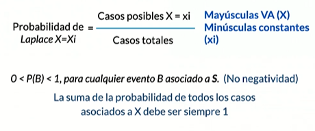

## Experimento de Bernoulli

# Distribución binomial
Suma de n elementos independientes de Bernouli

## Distribución de probabilidad
Algunos valores van a tener mayor probabilidad que otros dentro de la distribución

# Caraterizar información a traves de análisis exploratorio

## Medidas de tendencia central
* **Medidas de tendencia**
  * Media o promedio geométrico y aritmético
  * Mediana
  * Moda
  * Error típico o desviación estándar
* **Criterios de aplicación**
  * Según el tipo de variables y susceptibilidad a valores extremos

## Estadística descriptiva (Diagramas de frecuencia)

### Histogramas
Son una representación categórica y númerica de la distribución de los datos
* Variables categóricas: Tablas de frecuencia
* Variables númericas: Percentiles, Deciles, Quintiles y Quartiles, Outliers o valores extremos

## Teorema de bayes

  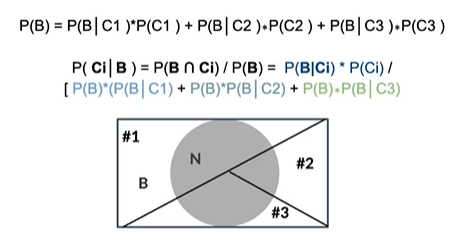

## Funciones de distribución continua y discreta

### Distribución de probabilidad discreta

  

  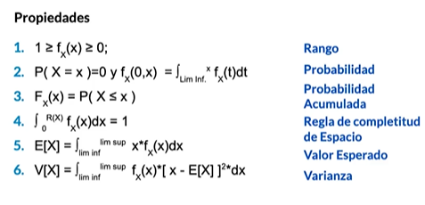

  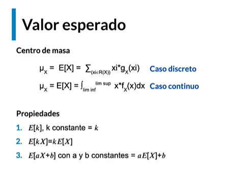

  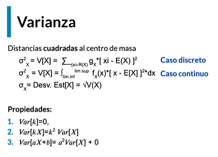

## Distribuciones discretas de mayor aplicación
* **Distribución de Bernoulli** (Experimento binario asociado a Éxito(1) o fracaso(0))
* **Distribución Binomial** (Número de éxitos x en N ensayos)
* **Distribución Geométrica:** Número de ensayos x hasta 1 éxito
* **Distribución Binomial negativa:** Número de ensayos x hasta el k-ésimo éxito
* **Distribución de Poisson:** Número de llegadas(eventos) en N a una longitud de tiempo t

## Distribuciones continuas de mayor aplicación

* Distribución Exponencial (tiempo en llegar a un evento)
* Distribución Normal (campana)
* Distribución Uniforme (distribución de eventos on una misma probabilidad)

## Estandarización de covarianza y correlación

Estandarzación o tipificación de variables

* Estandarizar una variable implica centrar y reducir.
  * Centrar: Al restat cada valor con respecto a la media, los valores quedan centralizado con respecto a ésta.
  * Reducir: El valor centralizado es normalizado con respecto a la desviación estándar, es decir, la diferencia del valor y la media es después dividida entre la desviación estándar.

El resultado es una variable aleatoria adimensional (llamada generalmente Z), que tendrá como valor esperado (media) 0 y una varianza y desviación estándar de 1.

  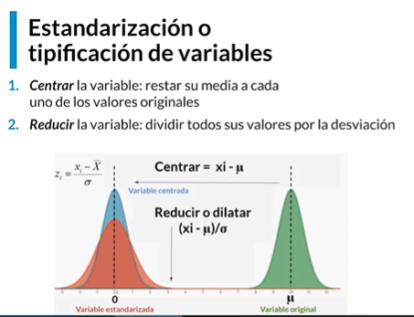

  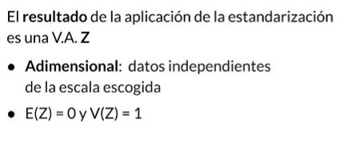

  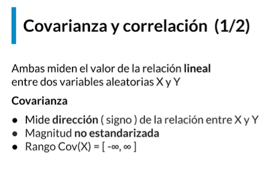

  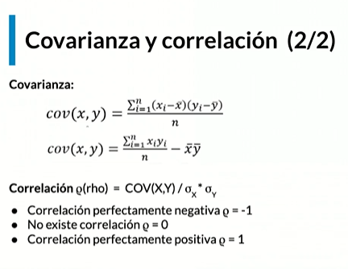

# Conceptos estadísticos análiticos

## Estimadores

  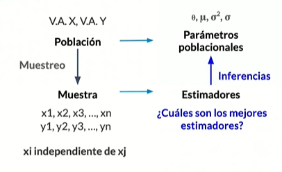

Criterios para elegir un estimador

Una variable aleatoria que viene de una población puede ser muestreada y calculada utilizando una pequeña porción de la misma.

  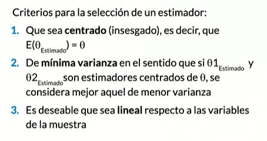

# Estimadores de máxima verosimilitud

  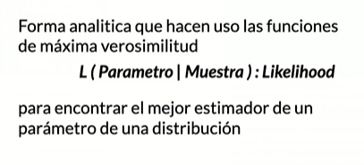

  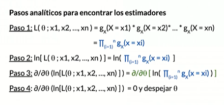

  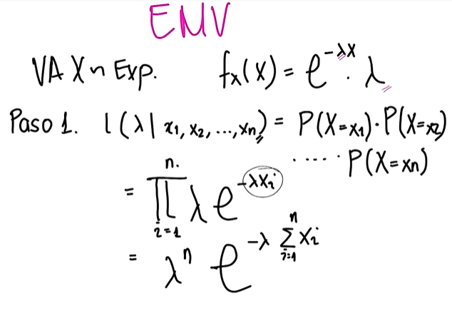

  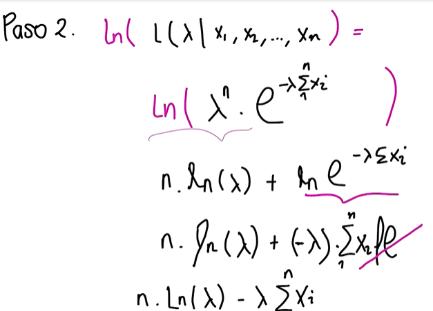

  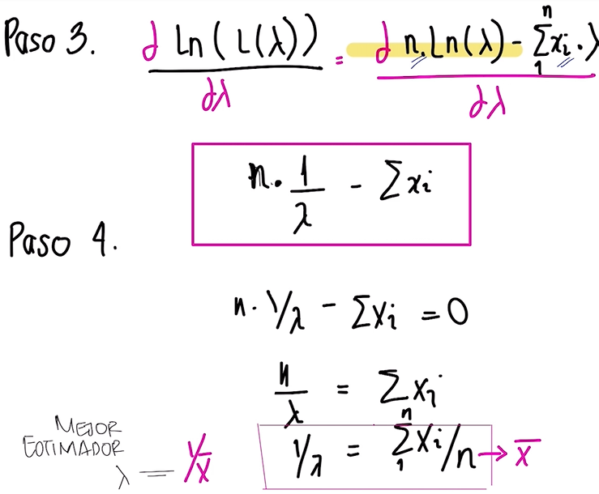

  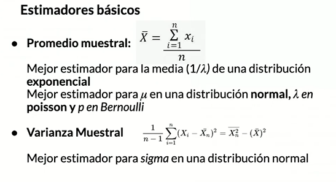

https://www.youtube.com/watch?v=1uW3qMFA9Ho&list=PLUl4u3cNGP60hI9ATjSFgLZpbNJ7myAg6

## Distribuciones muestrales

  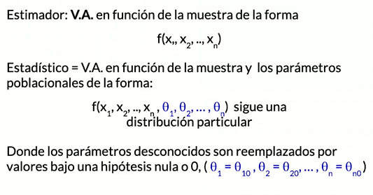

  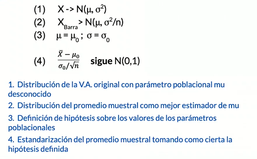

  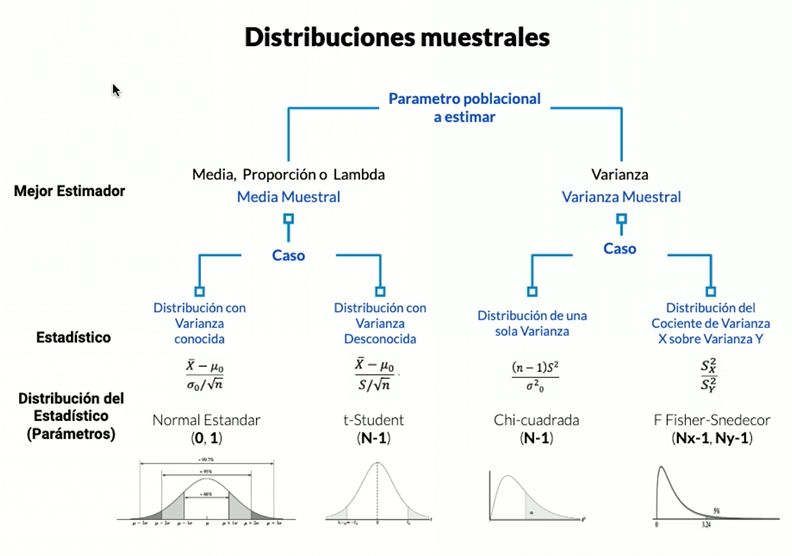

## Teorema de límite central

  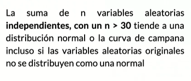

## Inferencia estadística a través de una hipótesis

  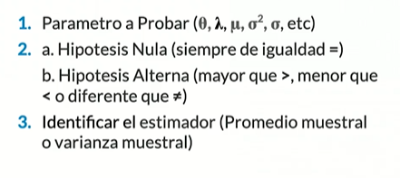

  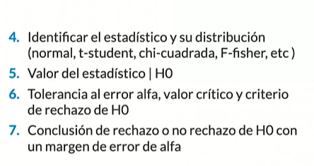

  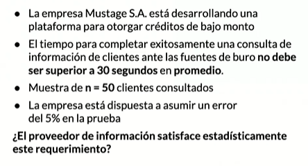

  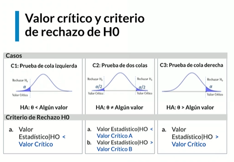

## Errores estadísticos

  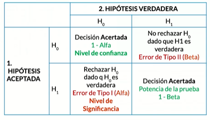

  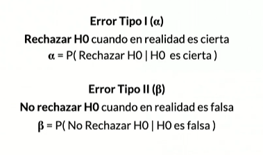

## Intervalos de confianza

  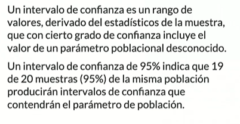

  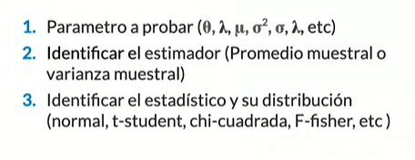

  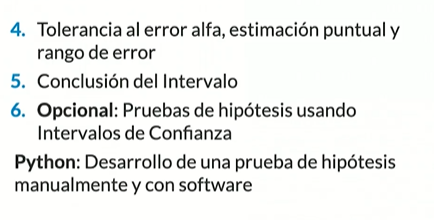

# Modelos estadísticos y de predicción
## Regresión líneal

  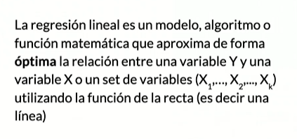

  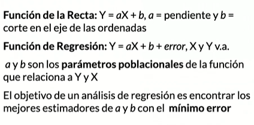

  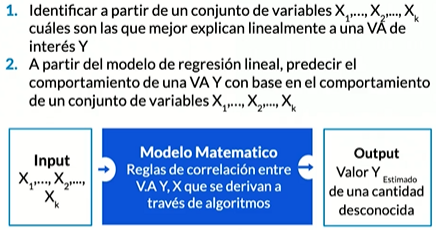

  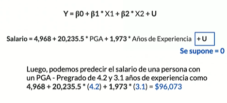

## Regresión lógistica

  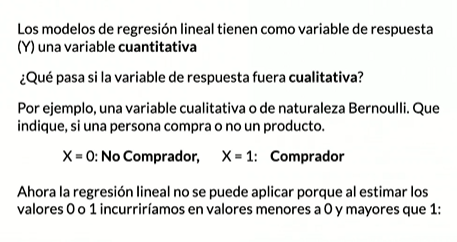

  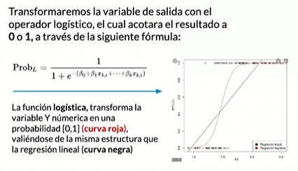

## Árboles de decisión

  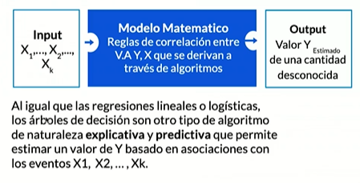

  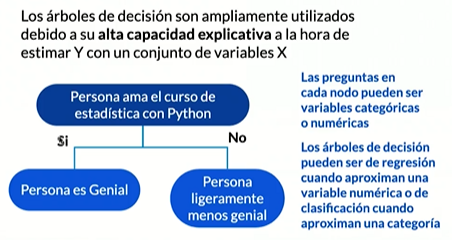

pip install graphviz

# Proyecto estádistico

https://www.kaggle.com/c/titanic/data

  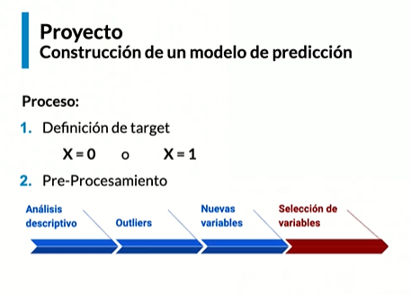

