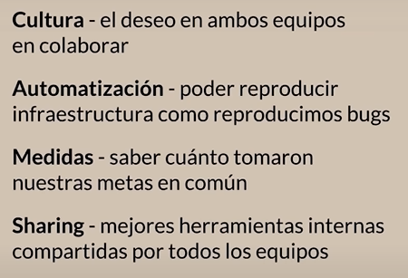

# Fundamentos de DevOps<!-- omit in toc -->

## Tabla de Contenido<!-- omit in toc -->
- [Introducción](#introducción)

# Introducción

  

* Más deployments con menos errores

DevOps es

* Para operaciones
* Para desarrolladores
* Para la empresa