# DevOps<!-- omit in toc -->

## Tabla de Contenido<!-- omit in toc -->
- [Introducción](#introducción)
  - [¿Qué es DevOps?](#qué-es-devops)
  - [Ciclo de vida del DevOps](#ciclo-de-vida-del-devops)
  - [GitLab](#gitlab)
  - [Gitlab vs Github](#gitlab-vs-github)
- [Administración](#administración)
  - [Autenticación](#autenticación)
    - [Recomendaciones](#recomendaciones)
    - [Generar llave SSH](#generar-llave-ssh)
  - [Grupos](#grupos)
  - [Autorización](#autorización)
  - [Auditoria](#auditoria)
  - [Proyectos](#proyectos)
- [Planificación](#planificación)
  - [Tipos de desarrollo](#tipos-de-desarrollo)
  - [Issues](#issues)
  - [Etiquetas](#etiquetas)
  - [Pesos (Estimación de tiempo/trabajo)](#pesos-estimación-de-tiempotrabajo)
  - [Milestones](#milestones)
  - [Boards](#boards)
  - [Service Desk](#service-desk)
  - [Quick actions](#quick-actions)
- [Verificación](#verificación)
  - [Inicialización del repositorio](#inicialización-del-repositorio)
  - [Merge request](#merge-request)
  - [Continuous Integration-CI](#continuous-integration-ci)
  - [Gitlab CI](#gitlab-ci)
    - [Verificar](#verificar)
    - [Empaquetar](#empaquetar)
    - [Lanzar](#lanzar)
  - [Automatizacion con GitLab Cl](#automatizacion-con-gitlab-cl)
  - [Validacion de la configuracion con GitLab Cl](#validacion-de-la-configuracion-con-gitlab-cl)
  - [gitlab-ci.yml](#gitlab-ciyml)
- [gitlab-ci.yml](#gitlab-ciyml-1)
  - [Gitlab pages](#gitlab-pages)
  - [¿Qué es el desarrollo ágil?](#qué-es-el-desarrollo-ágil)
  - [Autodevops](#autodevops)
    - [Habilitar autodevops](#habilitar-autodevops)
- [Empaquetación](#empaquetación)
  - [Introducción a los contenedores](#introducción-a-los-contenedores)
  - [Gitlab container registry](#gitlab-container-registry)
- [Seguridad](#seguridad)
  - [Introducción a DevSecOps](#introducción-a-devsecops)
  - [Firmas de seguridad (Evita usurpar identidad)](#firmas-de-seguridad-evita-usurpar-identidad)
  - [Pruebas estáticas de seguridad](#pruebas-estáticas-de-seguridad)
  - [Escaneo de contenedores](#escaneo-de-contenedores)
  - [Escaneo de dependencias](#escaneo-de-dependencias)
  - [Pruebas dinámicas de seguridad](#pruebas-dinámicas-de-seguridad)
  - [Gitlab security dashboard](#gitlab-security-dashboard)
- [Distribución](#distribución)
  - [Continuous Delivery (CD)](#continuous-delivery-cd)
  - [Ambientes](#ambientes)
  - [Review apps](#review-apps)
  - [Estrategias de Distribución](#estrategias-de-distribución)
    - [Big bang deployment](#big-bang-deployment)
    - [Rolling deployment](#rolling-deployment)
    - [Blue Green deployment](#blue-green-deployment)
    - [Canary deployment](#canary-deployment)
    - [Distribución en Gitlab](#distribución-en-gitlab)
    - [Feature Flags](#feature-flags)
    - [Tipos de Feature Flags](#tipos-de-feature-flags)
    - [Feature Flags en Gitlab](#feature-flags-en-gitlab)
    - [Rollback](#rollback)
- [Monitoreo](#monitoreo)

# Introducción

Todas las computadores que tienes a tu alrededor corren software que nosotros como desarrolladores escribimos, sin embargo las prácticas tradicionales han hecho que tanto las entregas, seguridad, entre otras no sean óptimas o no podamos movernos a la velocidad que nos gustaría cuando automatizamos.

**DevOps es una serie de prácticas culturales, pero también de herramientas que nos permiten llevar software de manera ágil a los usuarios.** Cuentas con herramientas como manejo de repositorio(Github o **Gitlab**), **CI** o **CD**(CircleCI, TravisCI o **Gitlab**), manejo de proyectos (Trello, Asana o **Gitlab**).

> **Gitlab** es una herramienta que nos permite utilizar las buenas prácticas del DevOps en un solo lugar.

## ¿Qué es DevOps?

<div align="center">
  
</div>

**Si desarrollas software tú debes ser el encargado y el responsable de que ese programa corra muy bien en producción.** No existe el "corre en mi máquina"

Un desarrollador **escribe el código** que alimenta a la aplicación, se encarga de la **seguridad** y que no existan huecos de seguridad. También **empaqueta** el código mediante contenedores para correr en la infraestructura especificada.

**Un DevOps se asegura de que el código corra configurando servidores, redes, infraestructura del internet y más.** Se encarga de que las máquinas funcionen y puedan dar el servicio escrito por los desarrolladores.

<div align="center">
  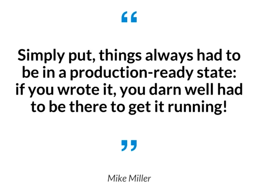
</div>


Un DevOps es un superhéroe, se encarga que desde el momento en que se escribe el código hasta cuando corre en el **dispositivo de nuestros clientes, todo el proceso sea seguro, automatizado y con prácticas de calidad.**

* **Pruebas automatizadas:** Las unit test que deberías estar escribiendo.
* **Continuous Integration:** Automatiza los procesos de calidad.
* **Continuous Delivery:** Se trata de enviar continuamente código a nuestros cliente.
* **Monitoreo y logging:** Es la forma de saber qué es lo que sucede dentro de nuestro programa y detectar problemas oportunamente.
* **Microservicios:** Separa las funcionalidades de la aplicaciones en servicios independientes.
* **Comunicación y colaboración:** Muy importante en la cultura DevOps.

## Ciclo de vida del DevOps

El modelo de DevOps no es una receta de cocina donde sigues las instrucciones y obtendrás un resultado. Este modelo es iterativo, un infinite loop y si lo detenemos nuestra compañía muere.

**El modelo de DevOps se entiende como un loop donde existen diferentes etapas y consideraciones que atienden algunas etapas en especifico.**

* **Plan:** Acá definimos las labores, los requerimientos que se necesitan para implementar en nuestra plataforma y para esto usamos herramientas como issues o boards.
* **Create:** Es escribir el código necesario para resolver el problema de negocio que tenemos. Todo este código podemos tenerlo en un solo lugar para colaborar y se hace uso de repositorios, también branchs o tags.
* **Verify:** Se corren nuestras pruebas automatizadas donde definimos las reglas a probar.
* **Package:** Empaquetamos nuestro código para correr en una infraestructura determinada. Normalmente se hace en un contenedor de Docker.
* **Release:** Una nueva versión de nuestro código y llega a producción.
* **Configure:** Se puede cambiar nuestro cluster de kubernetes, mandar instrucciones para manejar el nuevo estado de nuestra aplicación.
* **Monitor:** Cómo nuestro código esta funcionando, qué tipo de performance ocurre en los dispositivos de nuestros clientes.

<div align="center">
  
</div>

<div align="center">
  
</div>

* **Velocidad:** Es lento hacer las cosas manuales
* **Rápida distribución:** Poder comparar cambios diariamente ayuda mucho
* **Confiabilidad:** Cuando tenemos procesos manuales, nos podemos equivocar como humanos, al hacer bien nuestro trabajo de devops, bajamos ese error.
* **Escala:** Al automatizar bajamos el tiempo y hace que podamos crecer nuestra infraestructura a una escala antes no imaginada
* **Colaboración:** Al estar todo el equipo en comunicación se mejora la colaboración
* **Seguridad:** Las máquinas se ponen a hacer revisones de seguridad constantes cada que realizamos un cambio.

## GitLab

Gitlab es una compañía que realiza un proyecto open source, **un producto especializado en el ciclo de vidas del DevOps.**

* **Administración:** Nos da opciones de autenticación, autorización, analytics y self hosted gitlab.
* **Planificación:** Nos da issues, milestones, burndown charts, discusiones, boards, service desk, to-dos, etc.
* **Creación:** Generar proyectos, grupos, repositorios de código, merge request, integración y automatización.
* **Verificación:** Correr pruebas automatizadas, calidad del código, review apps y code coverage.
* **Empaquetación:** Container registry, paquetes privados.
* **Distribución(release):** Deployment strategies, ambientes, Gitlab pages, feature flags.
* **Configuración:** Existe la posibilidad de que debas cambiar la configuración de tu sistema. Auto DevOps, integración con Kubernetes, Knative serverless, manejo de secreto, chatops.
* **Monitoreo:** Prometheus, Jaeger, Sentry.
* **Seguridad:** Container scanning, dependency scanning, dynamic security testing, static security testing, manejo de licencias, security dashboard.
* **Defensa:** Gitlab está trabajando en herramientas para esta etapa como Firewalls, threat detection, data loss prevention y más.

<div align="center">
  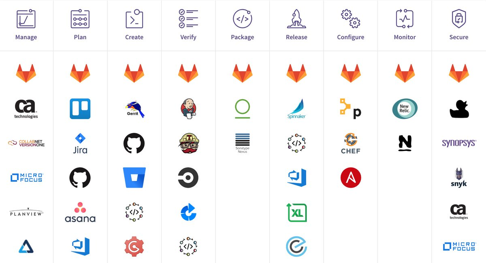
</div>

## Gitlab vs Github

Github y Gitlab son plataformas que comparten algunas funcionalidades aunque tienen objetivos diferentes.

**Github** nace como un repositorio en la nube colaborativo basado en Git para permitir participar en proyectos. En Github una persona fuera de una organización puedan colaborar en estos proyectos, es como una red social de programadores. Fue adquirido por Microsoft.

**Gitlab** nació como una versión open source de Github y a lo largo del tiempo ha encontrado un nicho en agregar herramientas y generar integraciones directamente al producto. **Tiene una visión de que su cliente principal es alguien especializado en DevOps**

# Administración

## Autenticación

GItlab te ofrece varias formas de autenticación tales como:

* **Username y Password**
* **Two factor authentication(2FA)** (Claves unicas)
  * OTP One Time Password
  * FIDO U2F Hace que el browser sea inmune a fishing
* **SSH Key**
  * Push

### Recomendaciones

* Google authenticator (OTP)
* Authy
  * https://authy.com/
* Yubico

### Generar llave SSH


Generar una llave ssh

``ssh-keygen -o -t rsa -b4096 -C "tu.correo@mail.com"``

Para copiar tu llave al porta papeles

mac
``pbcopy < ~/.ssh/id_rsa.pub``
linux (previamente debemos instalar xclip)
``xclip -sel clip < ~/.ssh/id_rsa.pub``
windows (desde git bash)
``cat ~/.ssh/id_ed25519.pub | clip``

Pega tu llave SSH en github

## Grupos

Los grupos te permiten **compartir recursos entre varios miembros del equipo** y organizar la forma en la que trabajas.

* **Agrupar proyectos:** dónde va a vivir nuestro código y los recursos asociados.
* **Otorgar permisos de acceso:** qué usuarios de qué equipo van a poder acceder a los recursos de la compañía.
* **Compartir recursos:** Si tienes cluster de Kubernetes, templates o runners para correr el CI lo puedes compartir entre varios grupos.

Los grupos se utilizan en Gitlab a través de los **Namespaces** que nos dan una url única para nuestro usuario, grupo y subgrupo.

**Reserved project and group names**

https://docs.gitlab.com/ee/user/reserved_names.html

**Visibilidad**

* Público
* Interno
* Private

## Autorización

Existen diferentes formas de autorizar un usuario dentro de un grupo y estos mismos modelos se utilizan para los proyectos:

* **Guest:** Es Read-only, solo tiene permisos de lecturas. No puede modificar código, crear o comentar issues.
* **Reporter:** Solo puede crear y comentar en los issues. No puede añadir código.
* **Developer:** Puede añadir código, también da acceso a los Pipelines de CI, branchs y más, pero no da la capacidad de agregar nuevos miembros.
* **Owner / Maintainer:** Eres Owner cuando creas un proyecto y Maintainer cuando alguien más te da permisos para administrar ese proyecto.

## Auditoria

Gitlab nos permite generar rastro de auditoría cuando se realizan cambios que pueden modificar el grupo, el proyecto o la instancia.

**Eventos**

* Grupo
* Proyecto
* Instancia

Configuración -> Eventos de auditoria

## Proyectos

Los proyectos tienen tres componentes fundamentales:

* **Issue tracker:** No es uno genérico para cualquier compañía, es específico para equipos que desarrollan software y adentro encontrarás conceptos como **agile**, **milestone**, **estimados de tiempo** y más.
* **Code repository:** Es el lugar centrar que nos va a permitir compartir y colaborar alrededor del código.
* **Gitlab CI**: Nos muestra la posibilidad de automatización con la inclusión de **Continuous Integration**.
* Wikis
* Dashboards de seguridad
* etc ...

# Planificación

## Tipos de desarrollo

Las principales diferencias entre **Agile y Waterfall** es que en el primero encontramos un proceso iterativo y en el segundo utilizamos un proceso previamente definido.**En Agile estamos realizando sprints**, **pequeños esfuerzos de trabajo para al final tener un entregable y mandarlo a producción.**

En Waterfall tenemos nuestro entregable hasta el final del proyecto, como crear una casa de manera modular.

<div align="center">
  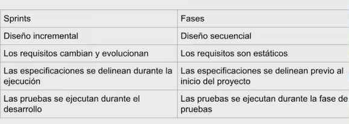
</div>

**Waterfall**

<div align="center">
  
</div>

**Agile**

<div align="center">
  
</div>

## Issues

Los issues son el punto donde inicia una conversación sobre el código.

Los issues permiten:

* Discutir la implementación de una nueva idea.
* Sugerir propuestas de features.
* Hacer preguntas.
* Reportar bugs y fallos.
* Obtener soporte.
* Planear nuevas implementaciones de código.

Puedes añadir **templates** a tus issues para poder estandarizar la forma en la que se abren, podemos incluirlo de cualquier tipo. Debes crear un archivo o una estructura de carpeta como:

``.gitlab/issue_templates/Bug.md``

<div align="center">
  
</div>

Gestionar el tiempo

``/estimate 1d``
``/spend 4hrs``

https://docs.gitlab.com/ee/user/project/issues/

## Etiquetas

El siguiente paso **es clasificar los issues basados en etiquetas**, suele salirse de control la forma en la que se reportan y una manera sencilla de organizar es con etiquetas.

Las etiquetas nos permiten:

* **Categorizar issues** o merge request con títulos descriptivos.
* **Filtrar** y buscar en Gitlab
* **Seguir temas** a través de notificaciones.

> Te puedes subscribir a las etiquetas

**Tipos**

* Grupo
* Proyecto
* Infraestructura

https://docs.gitlab.com/ee/user/project/labels.html

**Labels recomendados**

* Seguridad
* Feature

> Se pueden promover las etiquetas
> Se pueden priorizar

## Pesos (Estimación de tiempo/trabajo)

Uno de los puntos más complejos del desarrollo de Software es la estimación. 

Gitlab nos ofrece para poder **estimar la cantidad de trabajo que un issue requiere**, qué ventajas tiene agregar pesos a los issues y algunas de las buenas prácticas relacionadas con este ejercicio.

**Gitlab ofrece la funcionalidad de agregar pesos a los issues.** Estos pesos se representan de manera numérica (con el límite de que los números deben poderse representar en 4-bytes). Los pesos aparecen en el menú derecho del Issue, junto al nombre del issue en la lista de issues y sirven para determinar la cantidad de trabajo ejecutado en los **Burndown Charts de los Milestones.**

<div align="center">
  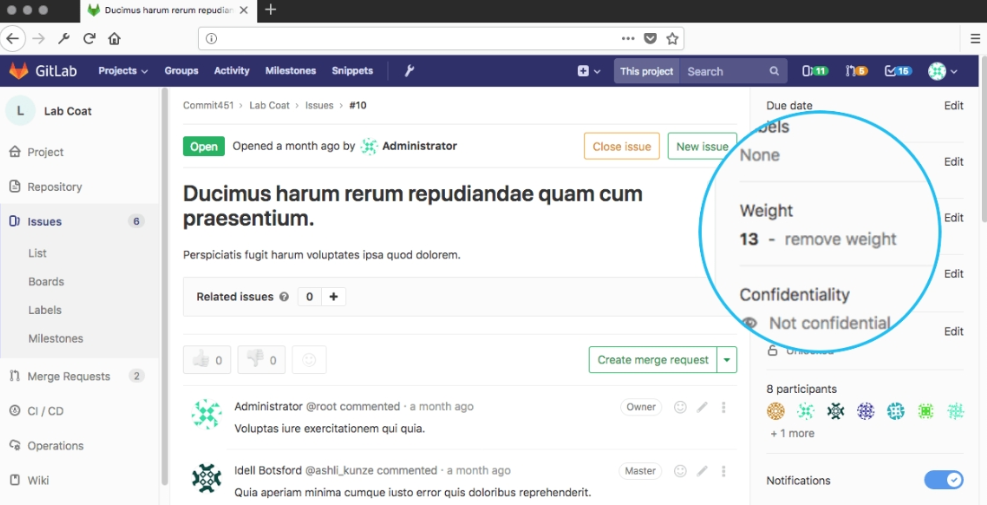
</div>

Ahora bien, estimar es algo difícil. Para los desarrolladores de software es una de las tareas –quizá la tarea más difícil– de nuestro trabajo. Se deben tomar en cuenta muchísimos factores, muchos de ellos desconocidos, para tomar decisiones que afectarán al resto del equipo y a la compañía misma. Por eso, muchos desarrolladores y product owners son reacios a estimar; **pero hay que recordar que la estimación es tan solo eso: un estimado.** No es un juramento de sangre ni una declaración solemne ante autoridad judicial. **En pocas palabras, jamás trabajes fines de semana y vacaciones para cumplir un estimado.**

No obstante lo anterior, existen un par de buenas prácticas que te ayudarán a ser más preciso y ayudar a los product owners a priorizar el trabajo pendiente.

**El primer punto que debes tener en cuenta es que la estimación es un trabajo de equipo.** Es importante que diversos equipos de trabajo colaboren en la estimación. **Los Desarrolladores, Diseñadores, Product Managers, etc.** **tienen diversas perspectivas sobre lo que implica desarrollar una nueva funcionalidad.** Cuando la estimación se realiza tomando en cuenta estas perspectivas existe una mayor probabilidad de que la estimación se acerque a la realidad.

Otro punto importante es que las estimaciones funcionan mejor cuando son relativas. **Es decir es mejor encontrar un trabajo relativamente sencillo en el que todo el equipo se encuentre de acuerdo y estimar a partir de ese punto.** Por ejemplo, si todo el equipo está de acuerdo en que añadir verificación a los campos de un formulario es un 2, entonces estimemos con base en ese acuerdo.

Es importante recordar que cuando estimamos, es buena práctica tener un sistema de estimación en el que el equipo esté de acuerdo. Un ejemplo muy usado en la industria son los puntos Fibonacci. Es decir, se utiliza la secuencia de Fibonacci para asignar pesos a issues (1, 2, 3, 5, 8, 13, etc.). **Otra forma, es utilizar tallas de camisas (S, M, L, XL, XXL, etc.).** En todo caso, lo importante es que el equipo entienda estos sistemas y los adopte en sus prácticas.

Por último, cuando incluímos a varios miembros del equipo en la estimación es importante que sus opiniones no se vean sesgadas por el resto de sus compañeros. **Por eso, una práctica que me gusta mucho es la de jugar “Estimation Poker”.** En esta modalidad de estimación, todo el equipo tiene barajas que representan los puntos y cuando se pone a discusión un issue, los miembros del equipo revelan su estimado con las barajas. **Si todos están de acuerdo, perfecto. Pero si existen grandes discrepancias es momento de escuchar y de volver a evaluar con la nueva información que nos ha sido proporcionada.** En todo caso, lo importante es mejorar con el paso de los sprints y que las estimaciones, quizá nunca perfectas, sean lo más realistas posibles.

## Milestones

Los Milestones **permiten agrupar issues para completarlos en un tiempo determinado.**

* Milestone como agile sprint
  * Sprint 5
* Milestone como release
  * V1.1.2

**Brundown chart** nos permite determinar qué tan avazando vamos dentro de un sprint y nos permite tomar acciones cuando todavía es relevante.

https://docs.gitlab.com/ee/user/project/milestones/

<div align="center">
  
</div>

Un burndown chart muestra la velocidad a la que se está completando los objetivos/requisitos. Permite extrapolar si el Equipo podrá completar el trabajo en el tiempo estimado.

Se pueden utilizan los siguientes burndown charts:


* **Product burndown chart:** Son los días pendientes para completar los requisitos del producto o proyecto, realizado a partir del Product Backlog (lista de requisitos priorizada).

https://proyectosagiles.org/lista-requisitos-priorizada-product-backlog/

* **Sprint burndown chart:** Horas pendientes para completar las tareas de la iteración, realizado a partir del Iteration Backlog (lista de tareas de la iteración).

https://proyectosagiles.org/lista-tareas-iteracion-sprint-backlog/

Este tipo de gráfico permite realizar diversas simulaciones, ver cómo se aplazan las fechas de entrega si se le añaden requisitos, ver cómo se avanzan si se le quitan requisitos o se añade otro equipo, etc.

## Boards

**Los boards son una forma de visualizar los flujos de trabajo**, de ver quién está trabajando en qué issues y son unas de las herramientas más importantes que existen dentro de Gitlab.

Se puede utilizar para **Kanban o Scrum**.

**Une los mundos de los issue tracking y Project managment.**

**Servicio similar**

https://taiga.io/

## Service Desk

**El Service Desk es la capacidad que te da Gitlab de abrir issues a través de correo electrónico.**

Permite dar **soporte a través de email a tus clientes directamente desde Gitlab.**

Permite que el equipo no técnico reporte bugs o abra issue sin necesidad de que tengan una cuenta de Gitlab.
Cuando se activa el servicio, se genera un email único para el proyecto.

## Quick actions

Las Quick Actions son atajos textuales para acciones comunes en **issues, epics, merge request y commits que normalmente son ejecutadas a través de la UI de Gitlab.** Los comandos se pueden agregar al momento de crear un issue o un merge request o en los comentarios de los mismos. Cada comando debe incluirse en una línea separada para que se detecten y ejecuten. Una vez ejecutados, los comandos se retiran del texto y no pueden verse en el comentario o descripción del issue.

<div align="center">
  
</div>

<div align="center">
  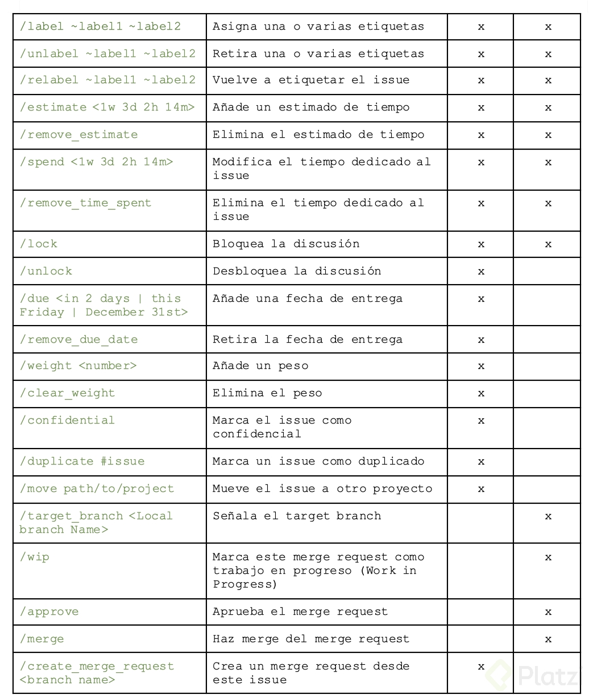
</div>

https://docs.gitlab.com/ee/user/project/quick_actions.html

# Verificación

## Inicialización del repositorio

* Agrega el repositorio a tu proyecto con ``git remote``

* Vincula tu key generada

``git config core.sshCommand "ssh -o IdentitiesOnly=yes -i yourkey -F /dev/null"``

## Merge request

Los Merge Requests so**n la puerta de entrada a nuestro código**, es el momento en donde definimos que un cambio sugerido por otra persona será unido a nuestra rama master o rama principal. Para tomar esta decisión se necesita mucha información: si los cambios fueron correctos, resuelven el issue, si surgen problemas de seguridad, si mejora nuestro performance.

El título del merge requests tiene prefijado WIP que significa 

* Pipeline status
* Security reports
* Performance impact
* Code changes (diffs)
* Review apps

Al generar un issue, puedes generar un merge request para resolverlo

<div align="center">
  
</div>

## Continuous Integration-CI

> Integra código en cada commit

El Continuous Integration es una práctica en la que los desarrolladores **envían sus cambios a un repositorio central, lo cual detona builds y pruebas automatizadas.**

* Ayuda a **encontrar bugs** de manera oportuna
* Aumenta la **velocidad** de los releases
* **Automatiza el pipeline que lleva código** desde la computadora del desarrollador hasta el dispositivo del cliente.

## Gitlab CI

Gitlab CI **es el hub central de automatización de Gitlab**, es el pedazo que podemos configurar libremente para generar las automatizaciones necesarias para que nuestro flujo de trabajo requiera poca o ninguna interacción humana.

**Continuamente construye**, **prueba y despliega cambios pequeños al código.**

* Se configura con el archivo **gitlab-ci.yml**
* También nos permite realizar Continuous Delivery y Continuous Deployment.

<div align="center">
  
</div>

### Verificar
* Crear y probar automáticamente la aplicación con la integración continua.
* Analizar la calidad del código con GitLab Code Quality.
* Determinar el impacto en el rendimiento de los cambios de código con las Prueba de rendimiento en el navegador.
* Realice una serie de pruebas, como Escaneo de contenedores, Escaneo de dependencias, y JUnit tests.
* Implemente sus cambios para obtener una vista previa de los cambios de la aplicación en cada sucursal.

### Empaquetar
* Almacenar las imágenes de Docker con Container Registry.
* Almacene paquetes NPM con NPM Registry.
* Almacene los repositorios Maven con Repositorio Maven.
* Almacene Conan Repositories con Conan Repository.

### Lanzar
* Continuous Deployment, implementando automáticamente la aplicación en producción.
* Continuous Delivery, haga clic manualmente para implementar su aplicación en producción.
* Implemente sitios web estáticos con GitLab Pages.
* Envíe funciones a solo una parte de sus pods y permita que un porcentaje de su base de usuarios visite la función implementada temporalmente con Canary Deployments.
* Implementación de funciones detrás de * Indicadores de funciones.
* Agregue notas de lanzamiento a cualquier etiqueta de Git con GitLab Releases.
* Vista del estado actual y el estado de cada entorno de CI que se ejecuta en Kubernetes con Deploy Boards.
* Implementa tu aplicación en un entorno de producción en un clúster de Kubernetes con Auto Deploy.

https://docs.gitlab.com/ee/user/project/pages/getting_started_part_four.html

<div align="center">
  
</div>

<div align="center">
  
</div>

<div align="center">
  
</div>

<div align="center">
  
</div>

https://docs.gitlab.com/ee/ci/yaml/#before_script-and-after_script

## Automatizacion con GitLab Cl

* Creamos un issue
* Creamos un archivo gitlab-ci.yml dentro del repo en la raíz

https://docs.gitlab.com/ee/ci/examples/

## Validacion de la configuracion con GitLab Cl

* Linter para verificar sintaxis del archivo de configuración

https://gitlab.com/eocode-group/devops/-/ci/lint

## gitlab-ci.yml

**El archivo .gitlab-ci.yml sirve para configurar el comportamiento de Gitlab CI en cada proyecto.** En el archivo define la estructura y el orden de los pipelines y determina qué ejecutar con el Gitlab runner y qué decisiones tomar cuando condiciones específicas se cumplen (como cuando un proceso falla o termina exitosamente).

El archivo tiene muchas opciones de configuración, pero aquí nos vamos a enfocar en tres: **image, stages y jobs.**

**La primera opción de configuración es image**. image nos sirve para determinar qué imagen de **Docker** vamos a utilizar para ejecutar el runner. Hay que recordar que, en su nivel más básico, **los trabajos de CI son simplemente automatización de scripts.** Con esto en mente, tenemos que determinar qué ambiente necesita nuestro script para correr de manera exitosa. ¿Necesitas instalar dependencias desde NPM y ejecutar scripts de package.json? Entonces es muy probable que la imagen de Node te sirva como base. **Quizá necesitas correr pruebas unitarias de una aplicación de Python e instalar dependencias desde PyPi; entonces deberías instalar la imagen de Python.**

Al final del día, el keyword image nos permite **“preinstalar”** los paquetes que nuestro script necesitará para correr: desde sistema operativo y lenguajes de programación, hasta software específico como bases de datos.

Un último punto, image puede utilizarse de manera global o por cada job que ejecutemos. **Es decir, si nuestro proyecto lo requiere podemos utilizar una imagen de Node para un job y otra de Ruby para otro.**

```yml
# gitlab-ci.yml
image: node:11.1.0

# ó

job1:
  image: python:3.7
```

Por su parte, **los stages nos permiten definir las etapas que atravesará nuestro pipeline cuando corra.** **Cada stage (etapa) puede contener uno o más jobs que correrán en paralelo.** Los stages permiten agrupar los jobs que pertenezcan a una categoría y permiten crear diversas dependencias entre cada job. Un ejemplo de un pipeline multietapa sería el siguiente:

``Install -> Test -> Build -> Deploy
``

Dicho pipeline lo podríamos configurar en .gitlab-ci.yml de la siguiente manera:

# gitlab-ci.yml

```yml
stages:
  - install
  - test
  - build
  - deploy

job1:
  stage: install
…
```

Es importante recordar que para configurar nuestros pipelines de manera correcta, **tenemos que declarar el nombre de nuestras etapas como una lista bajo el keyword stages y luego indicar en cada job a qué etapa pertenece con el keyword stage.**

Por último, los jobs son los encargados de ejecutar los scripts de automatización en cada etapa. En este sentido, **un job puede tener casi cualquier nombre (aunque siempre debes intentar nombrar de acuerdo a la función de lo que estás nombrando) y debe contener un script que se ejecutará.** Los jobs se ejecutan por los runners cuando se encuentran disponibles. Gran parte de la configuración adicional de los jobs está relacionada con las condiciones sobre las cuales se debe ejecutar y que artefactos exporta para otros jobs en el pipeline.


```yml
# gitlab-ci.yml

job1:
  script:
    - echo “Hello, world”
    - npm install
    - echo “etc.”
…
```

https://gitlab.com/group/proyect/-/ci/lint

## Gitlab pages

* Hosting estático
* Integración con gitlab CI
* Dominios personalizados

<div align="center">
  
</div>

**Dominios**

<div align="center">
  
</div>

**Configuración y automatización**

<div align="center">
  
</div>

<div align="center">
  
</div>

```yml
image: node:11.1.0
stages:
  - install
  - test
  - build
  - deploy

install-dependencies:
  stage: install
  script:
    - npm install
  artifacts:
    expire_in: 1hr
    paths:
      - node_modules/
  cache:
    paths:
      - node_modules/

test-apps:
  stage: test
  variables:
    CHROME_BIN: google-chrome
  dependencies:
    - install-dependencies
  before_script:
    - apt-get update && apt-get install -y apt-transport-https
    - wget -q -O - https://dl-ssl.google.com/linux/linux_signing_key.pub | apt-key add -
    - sh -c 'echo "deb https://dl.google.com/linux/chrome/deb/ stable main" >> /etc/apt/sources.list.d/google.list'
    - apt-get update && apt-get install -y google-chrome-stable
  script:
    - npm run test:ci

build-app:
  stage: build
  variables:
    BUILD_CONFIGURATION: 'production'
  dependencies:
    - install-dependencies
  script:
    - npm run build
  artifacts:
    expire_in: 1hr
    paths:
    - dist/

pages:
  stage: deploy
  dependencies:
    - build-app
  script:
    - mkdir public
    - mv ./dist/GitlabCurso/* ./public
  artifacts:
    paths:
      - public
  environment:
    name: production
  only:
    - branches
```

## ¿Qué es el desarrollo ágil?

El Desarrollo ágil de software viene del concepto básico de **agilidad**, la capacidad de responder a cambios.

En el "Agile Manifest" la biblia del desarrollo ágil eligen el término por su adaptabilidad.

**Los cuatro valores del desarrollo Agile:**

* A los individuos y su interacción, por encima de los procesos y las herramientas.
* El software que funciona, por encima de la documentación exhaustiva.
* La colaboración con el cliente, por encima de la negociación contractual.
* La respuesta al cambio, por encima del seguimiento de un plan.

Pero… ¿qué es el desarrollo ágil?
El desarrollo ágil abarca todo un **set de frameworks y prácticas basadas en los 12 principios** del manifiesto ágil, en los que tú eliges cuáles de estos principios son los mejores para tu desarrollo.

1. Nuestra principal prioridad es **satisfacer al cliente** a través de la entrega temprana y continua de software de valor.
2. Son bienvenidos los **requisitos cambiantes**, incluso si llegan tarde al desarrollo. Los procesos ágiles se doblegan al cambio como ventaja competitiva para el cliente.
3. Entregar con frecuencia **software que funcione**, en periodos de un par de semanas hasta un par de meses, con preferencia en los periodos breves.
4. Las personas del **negocio y los desarrolladores deben trabajar juntos** de forma cotidiana a través del proyecto.
5. C**onstrucción de proyectos en torno a individuos motivados**, dándoles la oportunidad y el respaldo que necesitan y procurándoles confianza para que realicen la tarea.
6. La forma más eficiente y efectiva de comunicar información de ida y vuelta dentro de un equipo de desarrollo es mediante la **conversación cara a cara**.
7. El **software que funciona** es la principal medida del progreso. **Programación en pares**, 4 ojos
8. Los procesos ágiles promueven el **desarrollo sostenido.** Los patrocinadores, desarrolladores y usuarios deben mantener un **ritmo constante** de forma indefinida.
9. La atención continua a la excelencia técnica enaltece la agilidad. **Excelencia lograda a través de la reflexión.**
10. La **simplicidad** como arte de maximizar la cantidad de trabajo que se hace, es esencial.
11. Las mejores arquitecturas, requisitos y diseños emergen de **equipos que se autoorganizan.**
12. En intervalos regulares, el equipo reflexiona sobre la forma de ser más efectivo y ajusta su conducta en consecuencia. **Cambio constante a circunstancias variables**

## Autodevops

Gitlab autodevops es una **solución que te permite generar un flujo de devops** inmediato con la creación del proyecto que incluye todas las mejores prácticas.

**Features:**

* Auto build
* Auto test
* Auto Code Quality
* Auto SAST
* Auto dependency scanning
* Auto container scanning
* Auto review apps
* Auto Dast
* Auto Deploy
* Auto performance
* Auto testing

**Prerequisitos**

* Gitlab Runner
* Kubernetes
* Base domain
* Prometheus. 

https://docs.gitlab.com/ee/topics/autodevops/

**Personalización**

* Dockerfile
* variables
* .gitlab-ci.yml

<div align="center">
  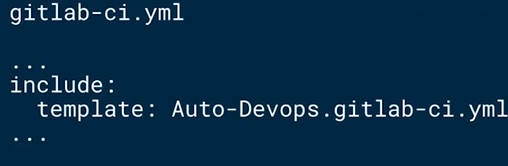
</div>

<div align="center">
  
</div>

https://docs.gitlab.com/ee/topics/autodevops/

Levantar un clúster de Kubernetes desde gitlab

* Conectar con cuenta de google
  * Configurar instancia
* Instalar Helm Tiller, (Gestor de paquetes(charts))
* Instalar ingress (Balanceador de carga) Obtiene una IP estática
* CertManager (Certificados de seguridad automáticos)
* Prometeus (Monitoreo del cluster)

* VPC networks
  * Volver estática la IP

### Habilitar autodevops

* Para revisar la instalación basta con revisar la sección de operaciones y en kubernetes
* Ahora ir a ci/cd dónde podemos habilitarlo
* Ahora el pipeline tiene más pasos
  * Build
  * Test Production
  * Performance
* Se puede configurar un dominio proporcionado por gitlab hacia nip.io
* En enviroments vamos a tener nuestro ambiente en producción a travez de nip.io, también tenemos acceso al monitoreo
* Generar un pipeline para cada commit en ambientes de prueba

# Empaquetación

## Introducción a los contenedores

Tanto los contenedores como las máquinas virtuales tienen un objetivo común: aislar a la aplicación y sus dependencias en una unidad que pueda ejecutarse en cualquier lugar. Más aún, tanto los contenedores como las máquinas virtuales eliminan la necesidad de proveer a nuestros servicios con hardware físico. Esto significa que se pueden utilizar de manera más eficiente los recursos computacionales que tenemos a nuestra disposición. La gran diferencia entre ambos es el enfoque arquitectónico que toman.

Una máquina virtual es esencialmente una emulación de una computadora con la capacidad de ejecutar procesos y programas. Las máquinas virtuales requieren de un hypervisor para poderse ejecutar sobre una host machine o directamente sobre “el metal”.

El hypervisor es un componente de software o hardware que permite a la host machine compartir recursos (RAM y procesadores) entre varias máquinas virtuales. Esto es importante, porque si el sistema está corriendo una aplicación de cómputo intensivo, se le pueden asignar más recursos que otras aplicaciones corriendo en el mismo sistema.

En este sentido, la máquina virtual que corre sobre un hypervisor se le conoce como la guest machine (máquina invitada). Esta guest machine contiene todo lo necesario para correr la aplicación (por ejemplo, binarios y librerías de sistema). También contiene toda una pila de hardware virtualizado (adaptadores de redes, almacenamiento, CPU, etc.). Desde el interior, la guest machine se comporta exactamente como una unidad de cómputo. Desde afuera, sabemos que está utilizando recursos compartidos que le otorga la host machine.

<div align="center">
  
</div>

A diferencia de las máquinas virtuales –que proveen virtualización de hardware–, los contenedores proveen **virtualización al nivel del sistema operativo** (al abstraer el user space).

A primera vista, los contenedores se parecen mucho a las máquinas virtuales. Por ejemplo, tienen un espacio dedicado al procesamiento, pueden ejecutar comandos como root, tienen interfaces de red privadas y direcciones IP, permiten configurar reglas de ruteo y iptables, tienen la posibilidad de montar file systems, etc.

La gran diferencia es que los contenedores comparten el kernel de la host machine con otros contenedores.

<div align="center">
  
</div>

El diagrama anterior muestra que los contenedores sólo empaquetan el user space, y no el kernel o hardware virtual como lo hace una máquina virtual. Podemos ver que toda la arquitectura del sistema operativo se comparte entre todos los contenedores. Lo único que se crea cada vez son la aplicación y las librerías y binarios. Esto es lo que hace a los contenedores tan ligeros.
Existen muchas tecnologías para crear contenedores, pero la más importante hoy en día es Docker. Docker es un proyecto open source que utiliza tecnologías de Linux para crear la abstracción de un contenedor. Sin embargo, esta no es la única tecnología en el mercado. Empresas como Google, llevan más de una década utilizando contenedores. Otros contendientes son: Solaris Zones, BSD jails, LXC, etc. Entonces, ¿qué fue lo que hizo que Docker tomara tanta relevancia?

Lo primero, es la facilidad de uso. Docker permite que cualquier usuario (desarrolladores, sysadmins, etc.), pueda empaquetar su aplicación rápidamente en su computadora personal y la misma aplicación puede correr ahora en cualquier nube pública, datacenter privado o directamente en hardware.

Una segunda ventaja es su velocidad. Los contenedores son bastante ligeros (comparados con las máquinas virtuales), pues son simplemente ambientes contenidos corriendo en el kernel. Las imágenes de Docker se crean en segundos, mientras que las máquinas virtuales toman más tiempo pues necesitan inicializar un sistema operativo completo cada vez.

Por último, Docker cuenta con el Docker Hub lo que permite compartir imágenes con mucha facilidad. Docker Hub tiene miles de imágenes públicas que han sido creadas por la comunidad para satisfacer casi cualquier necesidad. Puedes escoger entre decenas de sistemas operativos, lenguajes de programación y librerías para utilizar como base en tu aplicación.

Los contenedores son importantes en el mundo de Gitlab pues nos permiten aprovechar integraciones con clusters de Kubernetes y Gitlab Container Registry, y utilizar AutoDevOps para crear flujos inmediatos de DevOps que podrían tomarnos semanas si hiciéramos una integración ad hoc. Estas herramientas asumen que utilizas Docker y contenedores para empaquetar tu aplicación.

## Gitlab container registry

Gitlab container registry permite almacenar imágenes de Docker para uso posterior. En un caso tradicional, cada vez que el CI tiene un build exitoso, una nueva imagen se envía al container registry

<div align="center">
  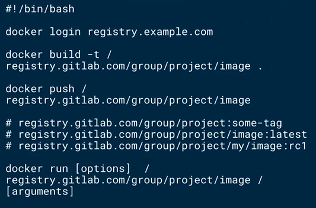
</div>

# Seguridad

## Introducción a DevSecOps

En el pasado, el equipo de Seguridad actuaba aislado y actuaba únicamente al final del proceso de desarrollo, un flujo de waterfall. Esto funcionaba porque eran ciclos de desarrollo que llevaban meses o años.

DevSecOps significa pensar en la seguridad de la aplicación a lo largo del proceso, desde el principio. Se trata de automatizar la seguridad e incluirla en el ciclo de vida de la aplicación (no más seguridad externa y en perímetros)

https://docs.gitlab.com/ee/integration/jenkins.html

<div align="center">
  
</div>

https://www.redhat.com/en/topics/devops/what-is-devsecops

## Firmas de seguridad (Evita usurpar identidad)

**GPG permite identificar**, sin lugar a dudas, **de quién proviene un commit;** añade una capa adicional de seguridad a Git para prevenir "#caballos de troya".

Gitlab despliega un banner junto a los commits para mostrar que dichos commits están verificados.

<div align="center">
  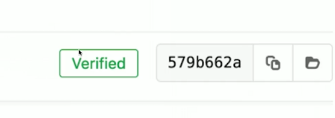
</div>

Programa gpg para validar los commits

<div align="center">
  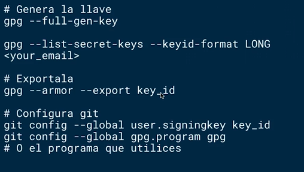
</div>

https://gitlab.com/help/user/project/repository/gpg_signed_commits/index.md

> Se configura en Configuración -> GPG Keys

## Pruebas estáticas de seguridad

Las pruebas estáticas de seguridad analizan nuestros archivos buscando patrones inseguros de código.

Crean un reporte que es añadido como widget al merque request
Utilizan la imagen de **Docker SAST de Gitlab**

**Tipos de vulnerabilidades**

* **Critical:** Existe un falla de código que da acceso de root o a los sistemas sin necesidad de ingeniería social. Debes atenderla de inmediato.
* **High:** Si se explota este tipo de vulnerabilidad estamos en riesgo de perder datos. Es difícil de explotar.
* **Medium:** El hacker va a tener que realizar trabajo adicional para obtener el acceso deseado.
* **Low:** No representan un riesgo de pérdida de datos.
* **Unknow:** No han sido clasificadas todavía y debes evaluarlas una por una.

<div align="center">
  
</div>

## Escaneo de contenedores

https://github.com/quay/clair

* Utiliza Clair y clair-Scanner para verificar los contenedores
* Si deseas omitir vulnerabilidades, las puedes incluir en el archivo clari-whitelist.yml
* Verifica que los paquetes instalados a nivel contenedor no tengan vulnerabilidades de seguridad

<div align="center">
  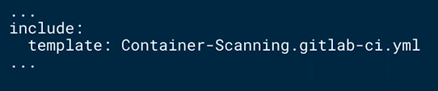
</div>

## Escaneo de dependencias

El Dependency scanning analiza estáticamente las dependencias del proyecto para encontrar vulnerabilidades. Puede generar un reporte que se añade al merge request y utiliza la imagen de Docker Dependency Scanning de Gitlab

<div align="center">
  
</div>

<div align="center">
  
</div>

## Pruebas dinámicas de seguridad

Las pruebas dinámicas de seguridad asumen que es un atacante externo y la aplicación es un blackbox para así correrle ciertas pruebas.

* Utiliza OWASP ZAP proxy y ZAP baseline.
* Corre análisis pasivo.
* Genera un reporte que puede ser verificado en el merge request

<div align="center">
  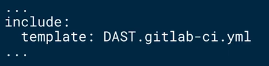
</div>

## Gitlab security dashboard

El Gitlab security dashboard es un hub centralizado de información donde tienes visibilidad de las vulnerabilidades que actualmente están corriendo en producción.

Permite acceder rápidamente a los riesgos detectados y aceptados para el ambiente de producción, permite marcar una vulnerabilidad como inválida o no aplicable, genera vínculos a los reportes de seguridad externos para entender mejor una vulnerabilidad.

# Distribución

## Continuous Delivery (CD)

Enviar código a producción

<div align="center">
  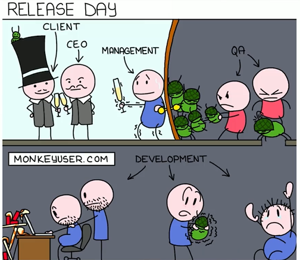
</div>

* Los deployments se pueden regular en caso de que se tengan SLAs
* Gitlab permite generar estrategías
* Podemos modificar la estrategía de autodevops

## Ambientes

Los Ambientes **se suelen utilizar para determinar si el código escrito cumple con las expectativas del negocio** y los requisitos impuestos con antelación para que así las personas puedan aprobarlos o no.

* Permiten realizar pruebas en diferentes ambientes antes de enviar el código a nuestros usuarios.
* Se integran con Gitlab CI para hacer realidad el Continuous Deployment.
* Gitlab lleva el historial de todos los deployments que se han realizado a un ambiente específico.
* Permiten verificar que el Deployment process se encuentre intacto y da la oportunidad de hacer QA

Tenemos algunos tipos como:

* Estáticos
* Dinámicos
* Protegidos

> En operations se pueden generar los ambientes

## Review apps

Las Reviews apps permiten ver los cambios de un feature branch al activar un ambiente para ejecutar el código con cada merge request.

**Los diseñadores y los product managers pueden ver los cambios sin necesidad de levantar un ambiente local** en sus computadoras

Cuando el merge request se aprueba y el feature branch se borra, se detiene el review app y se destruye la infraestructura

Completamente integrado con GitlabCI y merge request.

<div align="center">
  
</div>

<div align="center">
  
</div>

## Estrategias de Distribución

Uno de los temas que más ha cambiado en los últimos años en el mundo de la Ingeniería de Software es la velocidad a la que se distribuyen cambios en nuestros aplicaciones. Los equipos de desarrolladores distribuyen cambios más temprano y más rápido que antes. 

Mientras que antes los ciclos naturales tomaban meses o años, hoy en día los cambios suceden varias veces al día. Los beneficios son claros:

* El tiempo requerido para comercializar productos o servicios se disminuye drásticamente.
* Los clientes obtienen el valor del producto en menos tiempo.
* La retroalimentación de los clientes también fluye a velocidades aceleradas, lo que permite al equipo de desarrollo iterar de manera más rápida.
* La moral del equipo aumenta, pues pueden ver el fruto de su trabajo en producción.

Sin embargo, no todo es felicidad. Con este tipo de estrategias aceleradas, existe un mayor riesgo de introducir cambios que pueden afectar negativamente la experiencia del usuario; o peor aún, traer downtime a nuestro sistema. Por eso, es importante incluir prácticas que permitan minimizar el riesgo de que lo anterior se materialice.

### Big bang deployment

Como lo sugiere su nombre, los despliegues de Big Bang, **actualizan todas las partes del sistema en una sola barrida.** Esta estrategia encuentra sus orígenes en los días en que el software se distribuía en medios físicos y el cliente lo instalaba manualmente en su máquina.

Este tipo de despliegues requieren que el negocio ejecute una enorme cantidad de pruebas durante una fase específica del desarrollo, antes de aprobar el despliegue. Este tipo de pruebas, normalmente se asocian con el modelo waterfall en el que el desarrollo se ejecuta en etapas secuenciales.

Las aplicaciones modernas tienen la ventaja de poderse actualizar automáticamente, en el cliente o el servidor, por lo que este tipo de estrategias han sido casi completamente abandonadas por equipos que siguen las metodologías ágiles.

### Rolling deployment

Los rolling deployments, o despliegue en fases, tienen la ventaja de mitigar algunas de las desventajas de los big bang deployments. Esto es así, porque disminuye el riesgo de downtime al desplegar la aplicación a lo largo del tiempo.

Es importante resaltar que el despliegue consiste en **reemplazar una versión de la aplicación con otra en fases**; de tal manera que existe un tiempo en el que ambas aplicaciones pueden existir. En el caso de un despliegue a Kubernetes, por ejemplo, el reemplazo consiste en destruir el contenedor con la versión anterior y descargar la última versión de la imagen **desde el container registry** en el cual la alojemos.

Y es aquí donde se alcanza a ver otra ventaja de **contenerizar nuestra aplicación:** que los rollbacks resultan ser muy sencillos, cuando antes (en el modelo del Big Bang) resultaban imposibles. Hacer rollback es tan sólo destruir de nueva cuenta el pod, y descargar la versión previa (o cualquier otra versión que queramos) desde nuestro container registry.

### Blue Green deployment

Esta estrategia, también conocida como **A/B deployment**, consiste en tener **dos ambientes de producción paralelos (uno llamado blue y el otro llamado green) en el cual se despliegan las nuevas versiones de las aplicaciones de manera alternativa.** Es decir, si blue tiene instalada la V1 de nuestra aplicación, entonces green tendrá instalada la V2, y cuando se despliegue se la siguiente versión (V3) se utilizará el ambiente blue, nuevamente. ¿Dónde se desplegará el ambiente V4? En green, por supuesto; y la secuencia alternativa continúa indefinidamente.

Una de las ventajas de esta estrategia es que facilita realizar un rollback a la versión anterior, de manera sencilla, cuando nuestra aplicación no se encuentra habilitada para trabajar dentro de contenedores. **En caso de que exista una falla en la nueva versión, simplemente se rutea al ambiente previo.**

**Es importante mencionar, que únicamente el ambiente de la capa de la aplicación se replica.** Las bases de datos, al igual que el almacenamiento de archivos binarios (fotos, imágenes, vídeos, por ejemplo), son compartidas por ambos ambientes.

### Canary deployment

Existe otra modalidad de los despliegues blue green que se conoce como **canary deployment.** El canary deployment en lugar de rutear todo el tráfico de inmediato, se utiliza una **aproximación incremental.** Es decir, se comienza a rutear a la nueva versión progresivamente. Por ejemplo, 25% 50% 75% 100% ó 33% 66% 100%, etc.

Una de las ventajas de adoptar esta estrategia es que se puede probar la nueva versión con un subconjunto de los usuarios para determinar si se encuentra estable, y en caso de confirmarse, se rutea todo el tráfico al ambiente green o blue.

### Distribución en Gitlab

En Gitlab, cuando utilizamos AutoDevOps, **podemos configurar nuestra estrategia de despliegue a través de opciones predeterminadas en el UI o a través de variables de ambiente de Gitlab CI.**

Las variables que podemos configurar son las siguientes:
**STAGING_ENABLED** activa el ambiente staging cuando se le asigna el valor 1.
**CANARY_ENABLED** activa el ambiente canary cuando se le asigna el valor 1.
**INCREMENTAL_ROLLOUT_MODE** define la forma en el que el despliegue incremental se realizará. Acepta los valores manual y timed.

Este es el resultado de la algunas combinaciones de configuración:

Sin la declaración de **INCREMENTAL_ROLLOUT_MODE ni STAGING_ENABLED.**

<div align="center">
  
</div>

Sin la declaración de **INCREMENTAL_ROLLOUT_MODE**, pero con **STAGING_ENABLED** asignado el valor de 1.

<div align="center">
  
</div>

Con INCREMENTAL_ROLLOUT_MODE en modo manual, y sin STAGING_ENABLED.

<div align="center">
  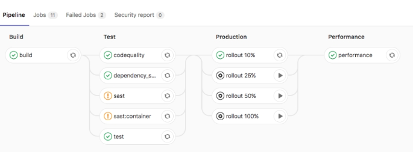
</div>

Con INCREMENTAL_ROLLOUT_MODE en modo manual, ySTAGING_ENABLED asignado el valor de 1…

<div align="center">
  
</div>

Para modificar la opción de despliegue a través de la UI, navega a Settings > CI/CD > Auto DevOps y selecciona una de la siguientes opciones:

* **Continuous deployment to production:** Habilita el despliegue continuo del branch master al ambiente de producción.
* **Continuous deployment to production using timed incremental rollout:** Asigna el valor timed a la variable de Gitlab CI INCREMENTAL_ROLLOUT_MODE. Esto significa que el despliegue se realizará cada vez que existe un cambio en el branch master, pero de manera incremental en lapsos de 5 minutos.
* **Automatic deployment to staging, manual deployment to production:** Asigna el valor de 1 a la variable STAGING_ENABLED y el valor de manual a la variable INCREMENTAL_ROLLOUT_MODE. El resultado es que la rama master se despliega de manera continua al ambiente de staging, y se activan las acciones manuales para el despliegue a producción.

### Feature Flags

Los feature flags son una técnica poderosa, que permite a los equipos **modificar el comportamiento de su sistema sin necesidad de modificar código o realizar un despliegue.** Esto aumenta la velocidad del equipo sin sacrificar la estabilidad del sistema.

Sin embargo, no todo es color rosa: **los feature flags introducen gran complejidad a nuestro sistema**, y si no somos cuidadosos, podemos construir un sistema en el cual sea imposible escribir pruebas unitarias (por la explosión combinatoria de posibilidades que los feature flags introducen). Por eso, como regla general, debemos mantener los feature flags en un mínimo.

Ahora sí, a entrarle de lleno. Para trabajar correctamente con los feature flags, es indispensable reconocer que existen diversas categorías, y el tratamiento que le damos a cada una debe ser distinto.

### Tipos de Feature Flags

La primera categoria se conoce como 

* **Release Flags.** Este tipo de bandera nos permite implementar una estrategia de **Continuous Deliver**y, dónde los diferentes features se activan de manera manual e independiente. Este tipo de estrategia **es importante cuando se requiere lanzar una funcionalidad compleja que requiere estar concluida al 100% para ser lanzada o cuando se necesita** coordinar un evento externo junto con el despliegue de la funcionalidad (por ejemplo, cuando el feature se lanza en coordinación con una campaña de marketing).

* La segunda categoría son los **Experiment Flags.** Este tipo de flag se utiliza cuando nuestra aplicación permite la realización de experimentos A/B. **Cada usuario de la aplicación es segmentado en cohortes y se muestran diferentes funcionalidades dependiendo del cohorte al que pertenezcan.** Este tipo de flags tiene un periodo de vida muy corto, pues una vez que se ha determinado el resultado del experimento, se opta por una u otra versión, y se estandariza el uso en el sistema. También, es importante tener duraciones cortas porque cuando se corren diversos experimentos **A/B de manera simultánea**, **existen altas posibilidades que los experimentos interfieran el uno con el otro, eliminando así la validez estadística del resultado.**
* Por su parte, los **Ops Flags**, permiten crear switches que facilitan controlar el comportamiento del sistema en runtime. **Existen ocasiones, por ejemplo, en el que los sistemas reciben cargas inusuales y es necesario optimizar los recursos que tenemos disponibles para servir nuestra aplicación.** En este caso, a través de feature flags es posible deshabilitar temporalmente servicios no críticos (como quizá un proceso que utiliza mucha memoria o procesamiento), para después habilitarlos una vez que la carga se haya normalizado.

* Por último, los **Permission Flags** nos permiten habilitar funcionalidades para usuarios específicos de nuestra aplicación. Un ejemplo de lo anterior acontece cuando una compañía decide hacer **dogfooding para probar internamente funcionalidades antes de habilitarlas para todos los clientes.** En este caso, se puede utilizar una lista de Ids de usuarios para determinar si es necesario mostrar la funcionalidad o no.

### Feature Flags en Gitlab

**Gitlab ofrece la funncionalidad de manejar feature flags directamente desde la interfaz del proyecto.** Detrás de bambalinas, Gitlab utiliza el proyecto open source **Unleash. Unleash** tiene dos componentes: **un servidor (que permite definir y administrar feature flags), y librerías para el cliente para que pueda consultar el estado de un flag específico.** Gitlab implementa el servidor, y deja que los desarrolladores implementen la parte del cliente, según su lenguaje de programación.

Para crear un feature flag, es necesario realizar lo siguientes pasos:

Navega al menú Operations > Feature Flags
Da click en el botón que dice New Feature Flag
Escoge un nombre y una descripción para tu feature flag
Y da click en el botón Create feature flag

<div align="center">
  
</div>

Un punto importante son los **Environment Specs**, los cuales permiten activar el feature en diferentes ambientes (por ejemplo, staging y producción). También se puede habilitar el ambiente * que aplica para todos los ambientes. Gitlab toma por default el ambiente más específico.

<div align="center">
  
</div>

Por último, para generar la **integración del lado del cliente es necesario utilizar una de las múltiples librerías que ofrece Unleash.** Para configurarlo, es necesario obtener los datos de configuración desde la interfaz de Gitlab y añadirlos al momento de inicializar nuestra librería. Para eso, navega a **Operations > Feature Flags y da click en el botón Configure**. En ese momento aparecerá un popup con la información que necesitas.

<div align="center">
  
</div>

### Rollback

Rollback es un mecanismo que **nos permite regresar a la versión anterior o donde estés seguro de que la aplicación sigue funcionando.** Esto con tan solo un click.

Gitlab ofrece la funcionalidad de "re deploy" para correr cualquier pipeline que haya sido ligado a ambiente.
**Permite automatizar el regreso a ambientes libres de bugs.**

# Monitoreo

