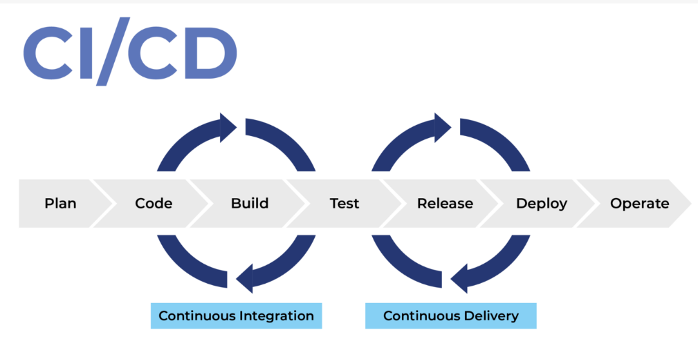

# DevOps con GitLab<!-- omit in toc -->

## Tabla de Contenido<!-- omit in toc -->
- [Introducción](#introducción)
  - [CLI client](#cli-client)

# Introducción

Se requiere tener una cuenta en: https://travis-ci.com/

Documentación: https://docs.travis-ci.com/
https://docs.travis-ci.com/user/languages/python/

<div align="center">
  
</div>

Archivo travis.yml

Opciones para trabajar

```yml
# trabajamos con javascript
language: node_js
# os: osx
# hay mas configuraciones
git:
  # 3 niveles de git
  depth:3

branches:
  # branches que no queremos implementar
  except:
  - legacy
  - experimental

branches:
  # solo las ramas que queremos
  only:
  - master
  - stable

before_install:#antes de hacerlo
  - python

install:
  - yarn install
# - apt install curl

script:
  - yarn deploy
  - yarn test

before_script:
  - clean

after_script:
  - yarn clean

cache:
  directories:
    - node_modules # mantener en cache node_modules
```

```yml
jobs:
  include:
    - stage: test
      script: yarn test
      script: yarn eslint
    - stage: deploy
      script: yarn deploy

# deploy github page y heroku

deploy:
  provider: heroku
  on
    repo: danibarria/platzistore
```

## CLI client

https://github.com/travis-ci/travis.rb

Buenas practicas de seguridad: En este curso utilizamos información sensible que deberíamos ocultar. Para eso travis-cli nos ofrece el siguiente comando:

``travis encrypt tu_clave``

para encriptar tu información sensible y que solo travis pueda entender.
Luego de ejecutar este comando, travis genera lo siguiente

``secure:"..."``

luego eso lo integrarias de la siguiente manera

Ejemplo con api key

``api_key:
	secure:"..."``

y de esa manera aseguramos nuestras claves y/o información sensible.