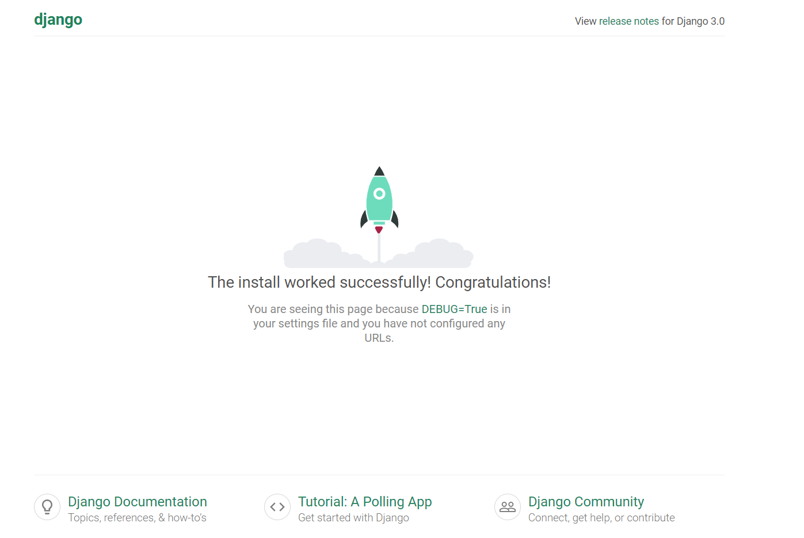
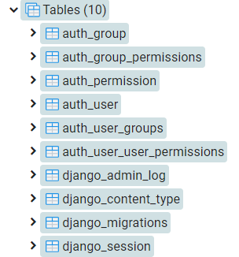
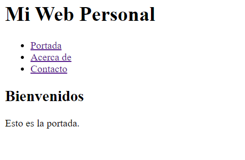
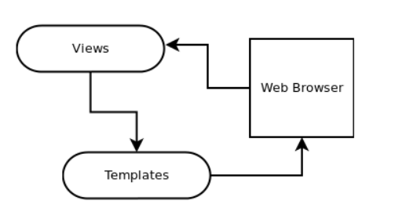
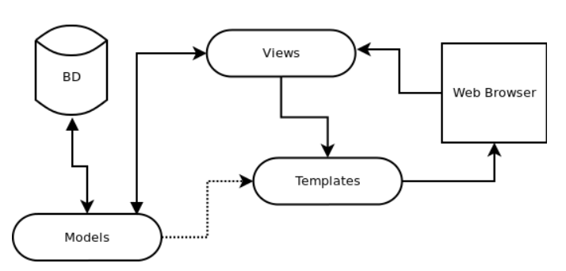

# Django <!-- omit in toc -->

> Conceptos clave de Django

## Tabla de Contenido<!-- omit in toc -->
- [Pycharm](#pycharm)
- [Python Hosting](#python-hosting)
- [¿Qué es Django?](#%c2%bfqu%c3%a9-es-django)
  - [Crear un proyecto nuevo](#crear-un-proyecto-nuevo)
  - [Jerarquía de ficheros](#jerarqu%c3%ada-de-ficheros)
- [Django APPS](#django-apps)
  - [HttpResponse](#httpresponse)
- [Templates](#templates)
  - [Herencia de templates](#herencia-de-templates)
  - [Template tag ](#template-tag--url)
  - [Imagenes](#imagenes)
- [Modelos](#modelos)
- [Panel de administrador](#panel-de-administrador)
  - [Nombre de la app](#nombre-de-la-app)
  - [Campos en español](#campos-en-espa%c3%b1ol)
  - [Campos especiales](#campos-especiales)
  - [Ficheros multimedia](#ficheros-multimedia)
  - [Patrón MVT Modelo-Vista-Template](#patr%c3%b3n-mvt-modelo-vista-template)
- [Relaciones (ORM)](#relaciones-orm)
- [Internacionalización con Django](#internacionalizaci%c3%b3n-con-django)
  - [Dependencias necesarias](#dependencias-necesarias)
  - [Marcar texto para traducir](#marcar-texto-para-traducir)
  - [Generar archivos de traducción](#generar-archivos-de-traducci%c3%b3n)
  - [Compilar archivos de traducción](#compilar-archivos-de-traducci%c3%b3n)
  - [Traducción de modelos](#traducci%c3%b3n-de-modelos)
- [Integrar Django + React](#integrar-django--react)

# Pycharm

Descarga el mejor editor de código para Python

https://www.jetbrains.com/es-es/pycharm

# Python Hosting

https://www.pythonanywhere.com/
https://heroku.com

# ¿Qué es Django?

* Django es un **framework web** programado en Python, gratuito y libre.
* Su nombre viene dado en alusión al **guitarrista de jazz Django Reinhardt**.
* Fue creado en **2003** cuando los desarrolladores web del diario Lawrence Journal-World migraron la arquitectura de su versión online a Python.
* **En 2005 fue liberado al público bajo la licencia BSD y desde 2008 es la DSF (Django Software Foundation)** quien se hace cargo del proyecto con la intención de apoyar el desarrollo, promover su uso, proteger su propiedad intelectual y asegurar su viabilidad a largo plazo.
* Es ámpliamente utilizado por grandes sitios web, entre los que destacan **Mozilla, Pinterest, Instagram, Bitbucket, Eventbrite, el diario Washington Times** y muchos otros.
* Promueve el **desarrollo ágil y extensible**, aplicando el principio **DRY (don’t repeat yourself).**

Algunas de sus características más importantes son:

* Un sistema basado en **componentes reutilizables llamados “apps”.**
* Un **mapeador ORM para manejar registros de la base de datos** como si fueran objetos, junto a una API muy robusta para su acceso. 
* **Un panel de administrador** para gestionar esos objetos a través de formularios.
* **Un potente sistema de plantillas** extensibles con herencia basado en etiquetas.
* Y mil cosas más: sesiones, formularios, internacionalización, middlewares, testing, caché…

> Para acabar destacar también la gran documentación oficial, un lugar perfecto para aprender, así como a su cada día más extensa comunidad de usuarios, lo que confirma su buen momento y el futuro que tiene por delante.

## Crear un proyecto nuevo

Consulta la documentación

https://www.djangoproject.com/start/

## Jerarquía de ficheros

Al crear un proyecto nuevo se creará una carpeta con el **nombre de la aplicación** **junto a un fichero llamado manage.py**. Este fichero es un script que sirve para gestionar todo nuestro proyecto desde la terminal.

La carpeta contiene los siguientes archivos, 
* El fichero __init.py__ nos indica que la carpeta es un paquete
* **Settings.py** es el que contiene la configuración del proyecto
* **urls.py** es el fichero encargado de manejar las direcciones de la web (sí esas que se escribirán en la barra del navegador) 
* y por último **wsgi.py**, un script que contiene la información para desplegar el proyecto en producción.

Para ejecutar el servidor de desarrollo ejecutar:
``python manage.py runserver``

<div align="center">
  
  <small><p>Django App</p></small>
</div>

Django nos muestra **DEBUG está en True** variable que se encuentra en el settings.

Ahí vamos a encontrar una configuración muuuy extensa, llena de variables, listas, directorios… Por ahora quedémonos con la de DEBUG = Truem, nos indica una descripción justo encima "AVISO DE SEGURIDAD: no poner en marcha con el debug en producción".

El modo DEBUG, es un modo de ejecución especial en el que siempre que ocurra un fallo, Django nos mostrará un montón de información para analizarla y poder solucionarlo.

Podemos cambiar el idioma por defecto cambiando la variable del fichero settings: **LANGUAGE_CODE a es_mx**. Si queréis algo más específico consultad la documentación del enlace justo encima:

El siguiente paso que tenemos que llevar a cabo, justo después de crear un proyecto, es crear la base de datos inicial. Lo tenemos que hacer para que Django pueda gestionar un montón de cosas por nosotros, como por ejemplo las sesiones, los usuarios o los grupos. Para hacerlo vamos de vuelta al fichero settings.py y buscaremos el diccionario llamado DATABASES.

https://docs.djangoproject.com/en/3.0/ref/settings/#databases

```python
DATABASES = {
    'default': {
        'ENGINE': 'django.db.backends.postgresql',
        'NAME': 'mydatabase',
        'USER': 'mydatabaseuser',
        'PASSWORD': 'mypassword',
        'HOST': '127.0.0.1',
        'PORT': '5432',
    }
}
```

Migración de datos

```shell
python manage.py migrate
```

<div align="center">
  
  <small><p>Tablas por defecto</p></small>
</div>

# Django APPS

Django apuesta por un **sistema de reutilización de código organizado en apps**, algo así como **aplicaciones internas que implementan funcionalidades específicas**.

Las Apps activas en un proyecto de Django, las encontramos definidas en el fichero de configuración settings.py, en la lista **INSTALLED_APPS**:

```python
INSTALLED_APPS = [
    'django.contrib.admin',
    'django.contrib.auth',
    'django.contrib.contenttypes',
    'django.contrib.sessions',
    'django.contrib.messages',
    'django.contrib.staticfiles',
]
```

Por lo tanto podríamos concluir en que, mientras una app es una aplicación web que implementa una funcionalidad y por sí misma no sirve para nada, un proyecto es un conjunto de configuraciones a las que se "conectan" esas apps para que todo unido de lugar a un sitio web completo. Un proyecto puede contener múltiples apps, y una app puede ser incluida en múltiples proyectos.

Para crear apps basta con ejecutar el siguiente comando:

```shell
python manage.py startapp core
```

**De todos estos ficheros el que nos interesa es ese llamado views.py**. Este fichero es uno de los más importantes y en él se definen las vistas de la app. Una vista hace referencia a la lógica que se ejecuta cuando se hace una petición a nuestra web, y lo que vamos a hacer es crear una vista para procesar la petición a la raíz de nuestro sitio, lo que sería la portada.

## HttpResponse

Este método que nos permite contestar a una petición devolviendo un código, así que vamos a definir una vista para la portada y devolveremos algo de HTML de ejemplo:

```shell
from django.shortcuts import render, HttpResponse

def home(request):
    return HttpResponse("<h1>Mi Web Personal</h1><h2>Portada</h2>")
```

Cada vista se corresponde con una función del fichero views.py.

Recibe un argumento llamado **request**

Para decirle a Django en qué URL tiene que mostrarla yourapp/urls.py

```python
from django.contrib import admin
from django.urls import path
from core import views

urlpatterns = [
    path('', views.home, name="home"),
    path('admin/', admin.site.urls),
]
```

¿Qué significa esto? Pues que del package core (__init.py__) **importamos el módulo views**, es decir, **de la app core importamos las vistas**. Y a continuación **creamos un patrón url**, justo en la raíz del sitio (cadena vacía) desde el que llamaremos a la vista views.home a la que damos el nombre home.

```python
def home(request):
    html_response = "<h1>Mi Web Personal</h1>"
    for i in range(10):
        html_response += "<p>Esto es la portada</p>"
    return HttpResponse(html_response)
```

# Templates

Django nos ofrece la posibilidad de utilizar plantillas HTML mucho más cómodas y repletas de funcionalidades.

Lo primero es **crear un directorio templates en nuestra app**, que dentro debe contener otro directorio con el mismo nombre que la app. Los archivos tienen **extensión .html**

Ahora necesitamos cambiar nuestra vista para que funcione con el template

```python
def home(request):
    return render(request, "core/home.html")
```

**Por defecto Django optimiza el uso de la memoria** así que no carga las plantillas de una app que no esté instalada en **settings.py.** Para cargar la app core y sus plantillas en memoria debemos ir al fichero settings.py y añadir la app en la lista INSTALLED_APPS justo abajo del todo:

```python
INSTALLED_APPS = [
    'django.contrib.admin',
    'django.contrib.auth',
    'django.contrib.contenttypes',
    'django.contrib.sessions',
    'django.contrib.messages',
    'django.contrib.staticfiles',
    'core',  # <====
]
```
Ahora el home estará cargando desde un template

<div align="center">
  
  <small><p>Template</p></small>
</div>

## Herencia de templates

> En programación, si estás repitiendo código, es que lo estás haciendo mal.

Podemos crear un archivo base.html para usar como base

```python
<!DOCTYPE html>
<html lang="en">
<head>
    <meta charset="UTF-8">
    <meta name="viewport" content="width=device-width, initial-scale=1.0">
    <meta http-equiv="X-UA-Compatible" content="ie=edge">
    <title>Mi Web Personal</title>
</head>
<body>
    <h1>Mi Web Personal</h1>
    <ul>
        <li><a href="/">Portada</a></li>
        <li><a href="/about/">Acerca de</a></li>
        <li><a href="/portfolio/">Portafolio</a></li>
        <li><a href="/contact/">Contacto</a></li>
    </ul>

    

</body>
</html>
```

Esto es un **template tag**, una etiqueta de template, y sirve para añadir lógica de programación dentro del propio HTML.

> En este caso el **template tag block sirve para definir un bloque de contenido con un nombre.**

Ahora podemos heredar en el template home.html
```python



    <h2>Mi Web Personal</h2>

    <p>Bienvenidos.</p>

```

## Template tag 

Se usa para enlazar templates

```python
{% url 'nombre_en_el_path %'}
```

En la práctica es lo mismo, pero si vamos a nuestro urls.py y cambiamos una dirección, por ejemplo about por about-me

Sin cambiar absolutamente nada en el template, la url del menú se habrá actualizado y seguirá funcionando perfecto:

> Nunca utilices hard-code para tus enlaces, en su lugar usa el template tag url.

## Imagenes
Para manejar imagenes Django necesita Pillow

```shell
pip install Pillow
```

# Modelos

Para definir un nuevo modelo Proyecto nos vamos a dirigir al fichero **models.py**, pero no podemos hacerlo de cualquier forma, debemos seguir unas pautas.

Crear un modelo es fácil, sólo tenemos que crear una clase heredando de una clase padre llamada **models.Model**.

> **Es importante que el nombre de la clase siempre sea en singular**:

```python
from django.db import models

class Project(models.Model):
    title = models.CharField(max_length=200)
    description = models.TextField()
    image = models.ImageField()
    created = models.DateTimeField(auto_now_add=True)
    updated = models.DateTimeField(auto_now=True)
```

Esta clase representará una tabla dentro de la base de datos. Lo siguiente será crear sus columnas, que no serán otra cosa que los atributos de la clase.

**Para migrar la app necesitaremos dos comandos:**

El primero es **makemigrations**, que sirve para indicarle a Django que hay cambios en algún modelo, de manera que creará un fichero de migraciones. Si en el futuro tenemos algún problema, siempre podremos restaurar una migración anterior.

```shell
python manage.py makemigrations portfolio
```

> Sólo nos falta aplicarla a la base de datos, que lo haremos con el **comando migrate**:

```shell
python manage.py migrate portfolio
```

Cada vez que hagamos un cambio en nuestro ficheros models.py ejecutaremos estos dos comandos para crear una migración y posteriormente aplicarla.

# Panel de administrador

El panel de administrador de Django es una funcionalidad que viene creada por defecto. Para acceder tenemos que entrar a la dirección /admin de nuestra página

<div align="center">
  
  <small><p>Admin</p></small>
</div>

Sí abres el **urls.py** del proyecto veréis que ya está configurado por defecto para abrirse en esa dirección como si se tratara de otra app:

No tenemos ningún usuario creado. Vamos a crear uno, pero no uno cualquiera, sino el superusuario.

```shell
python manage.py createsuperuser
```

Para que nuestro modelo aparezca en el administrador tenemos que registrarlo en el fichero **{your module app}/admin.py**

```python
from django.contrib import admin
from portfolio.models import Project


admin.site.register(Project)
```

## Nombre de la app
Nuestra aplicación se llama Portfolio en inglés y quizá queremos que en el administrador aparezca Portafolio en español. Para lograrlo hay que cambiar dos cosas, primero añadir un campo verbose_name en el fichero portfolio/apps.py

```python
from django.apps import AppConfig

class PortfolioConfig(AppConfig):
    name = 'portfolio'
    verbose_name = 'Portafolio'
```

De esta forma podemos establecer una configuración extendida.

**Lo segundo es establecer esta configuración en settings.py**, lo cual se hace **llamando a esta clase PortfolioConfig** en lugar de portfolio a secas:

```python
INSTALLED_APPS = [
    'django.contrib.admin',
    'django.contrib.auth',
    'django.contrib.contenttypes',
    'django.contrib.sessions',
    'django.contrib.messages',
    'django.contrib.staticfiles',
    'core',
    'portfolio.apps.PortfolioConfig',  # <====
]
```

## Campos en español
Vamos de vuelta a nuestro fichero de modelos e introduciremos dos nuevos conceptos para nuestros modelos, la subclase Meta y el método especial __str__.

Al crear la clase Proyecto hemos decidido ponerle Project para seguir una lógica en todo el proyecto, pero podemos cambiar el nombre a mostrar en el panel de forma muy sencilla creando una subclase con Meta información:

```python
from django.db import models

class Project(models.Model):
    title = models.CharField(max_length=200)
    description = models.TextField()
    image = models.ImageField()
    created = models.DateTimeField(auto_now_add=True)
    updated = models.DateTimeField(auto_now=True)

    class Meta:
        verbose_name = "proyecto"
        verbose_name_plural = "proyectos"
        ordering = ["-created"]  # <===
```

Ordering es una lista porque permite ordenar con prioridades entre distintos campos. Además si añadimos un guión delante del nombre del campo, es posible ordenar de forma revertida. Al hacer -created, le indicamos que nos muestre primero los proyectos de más actuales a más antiguos.

> Ahora **para que nos aparezca el nombre del proyecto en el desplegable simplemente podemos redefinir el método especial __str__ para que devuelva la cadena que nosotros queramos:**

```python
from django.db import models

class Project(models.Model):
    title = models.CharField(max_length=200)
    description = models.TextField()
    image = models.ImageField()
    created = models.DateTimeField(auto_now_add=True)
    updated = models.DateTimeField(auto_now=True)

    class Meta:
        verbose_name = "proyecto"
        verbose_name_plural = "proyectos"
        ordering = ["-created"] 

    def __str__(self):
        return self.title  # <=====
```

En cuanto a los nombres de los campos, también podemos utilizar el atributo verbose_name para cambiarlos:

```python
from django.db import models

class Project(models.Model):
    title = models.CharField(max_length=200, 
        verbose_name="Título")
    description = models.TextField(
        verbose_name="Descripción")
    image = models.ImageField(
        verbose_name="Imagen")
    created = models.DateTimeField(auto_now_add=True, 
        verbose_name="Fecha de creación")
    updated = models.DateTimeField(auto_now=True,
        verbose_name="Fecha de edición")

    class Meta:
        verbose_name = "proyecto"
        verbose_name_plural = "proyectos"
        ordering = ["-created"]

    def __str__(self):
        return self.title
```

## Campos especiales

Como podréis observar los campos de fecha y hora automatizados no aparecen en el adminstrador, Django los esconde para que no se puedan modificar, pero podemos mostrarlos como campos de tipo "sólo lectura".

Para hacerlo tenemos que extender un poco la configuración base del administrador de la siguiente forma:

```python
from django.contrib import admin
from .models import Project

class ProjectAdmin(admin.ModelAdmin):
    readonly_fields = ('created', 'updated')

admin.site.register(Project, ProjectAdmin)
```

## Ficheros multimedia

Por defecto se cargan en la raíz del proyecto.

Para que Django pueda servir ficheros Media durante el desarrollo, necesitaremos crear un directorio donde almacenar todos estos archivos. Normalmente le llamaremos media y lo crearemos en la raíz de nuestro proyecto.

Ahora nos dirigiremos al fichero settings.py y abajo del todo añadiremos estas dos variables, una para indicar indicar la URL externa y otra para el directorio interno donde se encuentran los ficheros media (unido al core_dir del proyecto):

```python
# Media files

MEDIA_URL = '/media/'
MEDIA_ROOT = os.path.join(BASE_DIR, "media")
```

Ahora vamos a nuestro modelo Proyecto y vamos a añadir a la imagen un atributo llamado upload_to:

```python
from django.db import models

class Project(models.Model):
    title = models.CharField(max_length=200, 
        verbose_name="Título")
    description = models.TextField(
        verbose_name="Descripción")
    image = models.ImageField(upload_to="projects",  # <=====
        verbose_name="Imagen")
    created = models.DateTimeField(auto_now_add=True, 
        verbose_name="Fecha de creación")
    updated = models.DateTimeField(auto_now=True,
        verbose_name="Fecha de edición")

    class Meta:
        verbose_name = "proyecto"
        verbose_name_plural = "proyectos"
        ordering = ["-created"]

    def __str__(self):
        return self.title
```

Ahora fijaos en una cosa, si abrimos nuestro primer proyecto no podemos acceder a la imagen:

Vamos a nuestro fichero settings/urls.py y vamos a editarlo de la siguiente manera:

```python
from django.contrib import admin
from django.urls import path
from core import views

from django.conf import settings  # <=====

urlpatterns = [
    path('', views.home, name="home"),
    path('about-me/', views.about, name="about"),
    path('portfolio/', views.portfolio, name="portfolio"),
    path('contact/', views.contact, name="contact"),
    path('admin/', admin.site.urls),
]

if settings.DEBUG:
    from django.conf.urls.static import static
    urlpatterns += static(settings.MEDIA_URL, 
        document_root=settings.MEDIA_ROOT)
```

Lo que hemos hecho es cargar el módulo de ficheros estáticos genérico y hacer que Django sirva ficheros como algo excepcional, sólo si tenemos el modo DEBUG activo.

## Patrón MVT Modelo-Vista-Template

Hasta ahora lo que hemos hecho no requería de interactuar con la base de datos Podríamos decir que simplemente se recibe una petición del navegador, se ejecuta la vista correspondiente y se renderiza el Template para que el navegador muestre el HTML resultante:

<div align="center">
  
  <small><p>Admin</p></small>
</div>

Sin embargo en el momento en que aparecen las base de datos y los modelos, este proceso se extendiende. Ahora se recibirá la petición, se pasará a la vista, en la vista recuperaremos los datos del modelo correspondiente, y finalmente la renderizaremos el Template pero esta vez integrando los datos dinámicos recuperados del modelo, antes de enviar el HTML final al navegador:

<div align="center">
  
  <small><p>Admin</p></small>
</div>

Es buena práctica separar las vistas como aplicaciones

```python
from django.contrib import admin
from django.urls import path

from core import views as core_views
from portfolio import views as portfolio_views

from django.conf import settings

urlpatterns = [
    path('', core_views.home, name="home"),
    path('about-me/', core_views.about, name="about"),
    path('portfolio/', portfolio_views.portfolio, name="portfolio"),
    path('contact/', core_views.contact, name="contact"),
    path('admin/', admin.site.urls),
]

if settings.DEBUG:
    from django.conf.urls.static import static
    urlpatterns += static(settings.MEDIA_URL,
        document_root=settings.MEDIA_ROOT)
```

Separar las apps siempre viene bien. Nos permite organizar mejor el código y prepararlo para escalarlo en el futuro.

De vuelta a nuestra vista portfolio, necesitamos hacer referencia a nuestro modelo Project para recuperar sus instancias y enviarlas al template:

```python
from django.shortcuts import render
from .models import Project

def portfolio(request):
    projects = Project.objects.all()  
    return render(request, "portfolio/portfolio.html", 
        {'projects':projects})  # <=====
```

Con esto, en el template ya se podrá visualizar la información:

```python




Portafolio




    <h1>Portafolio</h1>
    <span class="subheading">Currículo</span>



    
        Proyecto: {{project.title}} creado {{project.created}} <br>
    

```

Probamos la página y mostrará algo llamado **QuerySet**, como una lista y dentro aparece nuestro proyecto.

**Un QuerySet es la representación del resultado de una consulta a la base de datos**, pero devuelta como una lista de instancias. Al ser una especie de lista, lo bueno que tiene es que podemos iterarla con otro templatetag llamado for, y dentro de cada iteración mostrar para cada Proyecto sus atributos.

# Relaciones (ORM)

Hay varios tipos de relaciones que podemos hacer

```python
# Relación por llave foranea
    author = models.ForeignKey(User, on_delete=models.CASCADE,
                               verbose_name=_("Autor"))
# Relación 1 a muchos
    categories = models.ManyToManyField(Category,
                                        verbose_name=_("Categorías"))
```

# Internacionalización con Django

https://github.com/iris9112/WWCode-python

Django ofrece un robusto framework de internacionalización y localización para ayudarte a desarrollo aplicaciones para múltiples idiomas y regiones del mundo.

* **Internacionalización:** proceso de diseñar programas para el uso potencial de cualquier localidad (ciudad, país). Es decir poder traducir a diferentes idiomas elementos de la interfaz, texto, mensajes de error, y además configurar elementos como fechas y horas, de manera que sea posible respetar diferentes estándares locales. Generalmente hecho por desarrolladores.

> **Dato curioso:** Encontrarás a menudo "internacionalización" abreviada como **I18N** dónde el número 18 se refiere al número de letras omitidos entre la I inicial y la N final.

* **Localización:** proceso específico de traducir un programa internacionalizado para su uso en una localidad en particular. Generalmente hecho por traductores.

> Encontrarás a menudo "localización" abreviada como **L10N**

## Dependencias necesarias

```python
python-gettext==4.0
django>=2.2.4
django-parler==2.0.1
```

https://django-parler.readthedocs.io/en/stable/quickstart.html#installing-django-parler


https://steemit.com/utopian-io/@mateo.vergara/como-usar-el-sistema-de-traducciones-en-django-i18

Editar el Settings
```python
from django.utils.translation import ugettext_lazy as _
...
MIDDLEWARE = [
    ...
    'django.contrib.sessions.middleware.SessionMiddleware',
    'django.middleware.locale.LocaleMiddleware',
    'django.middleware.common.CommonMiddleware',
    ...
]

...

TEMPLATES = [
    {
        ...{
            'context_processors': [
                ...
                'django.contrib.messages.context_processors.messages',
                'django.template.context_processors.i18n',  # Util para internacionalizacion
            ],
        },
    },
]

...

# Internationalization
# https://docs.djangoproject.com/en/3.0/topics/i18n/

LANGUAGE_CODE = 'es-mx'

TIME_ZONE = 'America/Mexico_City'

USE_I18N = True

USE_L10N = True

USE_TZ = True

LANGUAGES = [
    ('es', ('Español')),
    ('en', ('English'))
]

LOCALE_PATHS = [
    os.path.join(BASE_DIR, 'locale')
]

# configuraciones django-parler
PARLER_LANGUAGES = {
    None: (
        {'code': 'es', },
        {'code': 'en', },
    ),
    'default': {
        'fallback': 'es',
        'hide_untranslated': True,
    }
}

PARLER_DEFAULT_LANGUAGE = 'es'
PARLER_SHOW_EXCLUDED_LANGUAGE_TABS = True

```

Para todas las cadenas de traducción utiliza lo siguiente, aplica en el settings, modelos y vistas

```python
from django.utils.translation import ugettext_lazy as _

# _("label")
```

Además en el archivo global de urls agregar:

```python
path('i18n/', include('django.conf.urls.i18n')),
```


## Marcar texto para traducir

Lo primero es cargar la etiqueta  en el template de django, para una línea sencilla utilizamos el templatetag  pero si tenemos contenido un poco más complejo, por ejemplo que incluya multiples elementos HTML o variables, utilizaremos los templatetag blocktrans / endblocktrans.

Ejemplo:

```python


Translators: por favor se creativo
<h1></h1>
<p>
   
       Conoce nuestro servicio del mes {{ service.name }}
   
</p>
```

https://docs.djangoproject.com/en/3.0/topics/i18n/translation/#gettext-on-windows
* Debes tener instalado en Windows: 
https://mlocati.github.io/articles/gettext-iconv-windows.html

* En linux apt-get install gettext

* Requiere reiniciar IDE

## Generar archivos de traducción

```python
django-admin makemessages -l en_us
```

## Compilar archivos de traducción

```python
django-admin makemessages -l es_mx
```

## Traducción de modelos

Django-parler ofrece la clase TranslatedModel para los modelos y el wrapper TranslatedFields para envolver los campos de los modelos que se quieren traducir.

```python
# models.py
from django.db import models
from django.utils.translation import ugettext_lazy as _
from parler.models import TranslatableModel, TranslatedFields

class Category(TranslatableModel):
    translations = TranslatedFields(
        name=models.CharField(max_length=200, verbose_name=_('Nombre Categoría'))
    )
    created = models.DateTimeField(auto_now_add=True, verbose_name=_("Fecha de creación"))
    updated = models.DateTimeField(auto_now=True, verbose_name=_("Fecha de edición"))

    class Meta:
        verbose_name = _('Categoría')
        verbose_name_plural = _('Categorías')
```

# Integrar Django + React

https://fedeg.gitlab.io/django-react-workshop/#/es/

Crear un proyecto Django
```shell
django-admin startproject ejemplo
```

Creamos una aplicación
```shell
django-admin startapp demo
```

Creamos una vista simple
```python
from django.http import HttpResponse

def index(request):
    return HttpResponse('Hola mundo')
```

Crear un componente en React con ES6, Clases, JSX, props
Funciona como un template
```js
import React from "react"

export default class HelloWorld extends React.Component{
    render(){
        return(<div>Hola mundo</div>)
    }
}
```

WebPack
Instalamos Django WebPack Loader / React Code Spliting
```shell
pip install django-webpack-loader
```

Una vez instalado el paquete se agrega en INSTALLED_APPS y en el settings.py la dirección de webpack