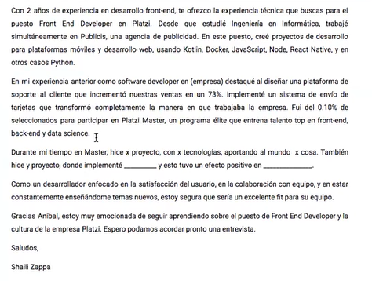

# Empleo <!-- omit in toc -->

## Tabla de Contenido<!-- omit in toc -->
- [Carta de presentación](#carta-de-presentación)
  - [¿Qué es?](#qué-es)
  - [Contenido](#contenido)
  - [Que no debe tener](#que-no-debe-tener)
  - [Algunos tips](#algunos-tips)
  - [Ejemplo de cover letter](#ejemplo-de-cover-letter)
  - [Recursos y plantillas](#recursos-y-plantillas)
- [Emails](#emails)

# Carta de presentación

## ¿Qué es?

* Brinda información de por qué eres la persona indicada para el trabajo al que está aplicando
* Incluye información específica que describe tus fortalezas e indica cómo tus fortalezas y experiencia laboral son relevantes para este trabajo
* Es una primera impresión
* Es un pitch de ventas sobre tí

## Contenido
* Información de contacto
* Contacto de la empresa
* Saludo
* Introducción que atrape la atención del lector
* Razones del por qué eres perfecto para la compañia
* Razones por las que la compañia es perfecta para ti
* Conclusión que resume tus pruntos principales
* Despedida

## Que no debe tener
* Faltas gramaticales y de ortografía
* Nombre equivocado de empresa o de contacto de la empresa
* Mentiras
* Párrafos demasiado largos y oraciones demasiado largas
* Pretensión salarial
* Temas personales
* Excusas por haber dejado otros trabajos
* Ni demasiado intenso ni desinteresado - balance

> "No construyes una reputación de lo que vas a hacer, sino de lo que ya estás haciendo" **Anonimo**

## Algunos tips

* **Personaliza tu carta**
* Usa el nombre del reclutador si lo tienes
* **Atrápalos con una primera oración fuerte ("Estoy muy emocionado por postularme al puesto de software developer")**
* En vez de describir tu CV --- ¡Platica sobre lo que lograste!
* **Resalta las experiencias relevantes**
* Si no tienes experiencia laboral, resalta tus habilidades y proyectos
* **No resaltes tus carencias ("Sé que tengo falta de experiencia en")**
* Usa porcentajes y números si tienes
* Usa feedback breve "Mis compañeros de trabajo me consideran alguien curioso y colaborador"
* **Es más importante sonar motivado que formal**
* Entiende la voz de la empresa para adaptar tu estilo
* **Mejor breve y bueno que largo y aburrido**
* Que tu conclusión sea fuerte
* **Leer, revisar y cuando se pueda, que alguien más lea la carta también**

## Ejemplo de cover letter

  

## Recursos y plantillas
* Zety
* Kick Resume
* Monster.com
* Balance Careers

> "Recuerda por qué empezaste" **Anonimo**

# Emails

* Muestra interés en la vacante
* Muestra que eres una persona responsable y organizada
* Muestra tus super soft skills
* Son efectivos
* Sirven para que la empresa te tenga en top of mind
* Tendrás información actualizada sobre tu proceso de selección

