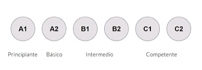
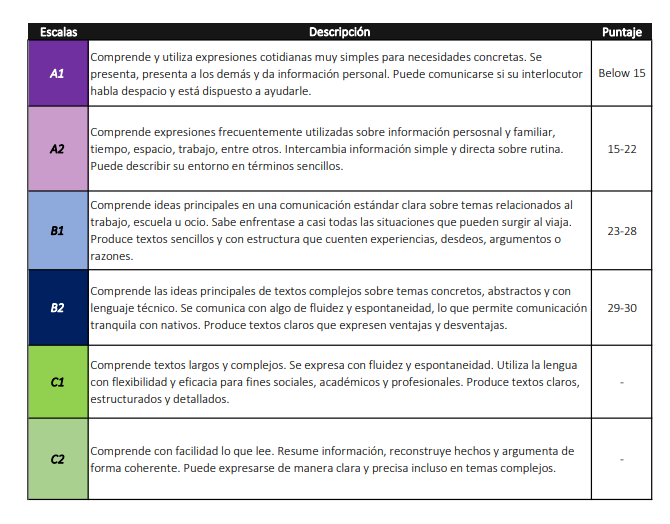
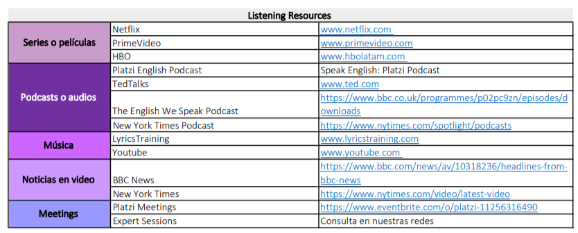
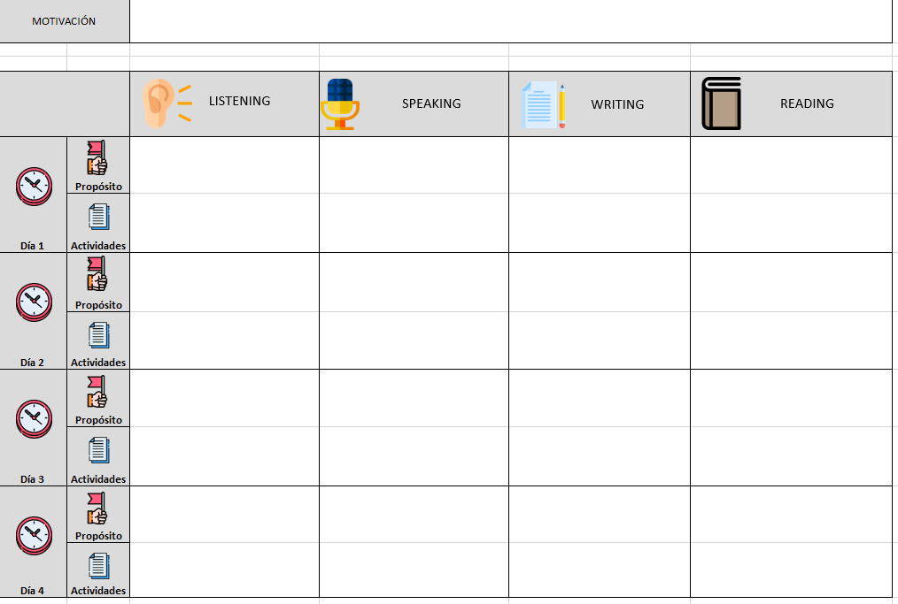

# Estrategias para aprender inglés<!-- omit in toc -->

## Tabla de Contenido<!-- omit in toc -->
- [Introducción](#introducción)
  - [Ventajas, desafíos y herramientas para estudiar inglés por internet](#ventajas-desafíos-y-herramientas-para-estudiar-inglés-por-internet)
  - [Motivación](#motivación)
    - [Habilidades clave para aprender inglés y cómo priorizarlas: listening, speaking, writing y reading](#habilidades-clave-para-aprender-inglés-y-cómo-priorizarlas-listening-speaking-writing-y-reading)
  - [Diagnostico: ¿cuál es tu nivel de inglés?](#diagnostico-cuál-es-tu-nivel-de-inglés)
- [Fortalecer competencias](#fortalecer-competencias)
  - [Listening](#listening)
  - [Reading: ¿cómo puedes leer mejor en inglés?](#reading-cómo-puedes-leer-mejor-en-inglés)
  - [Fortalece tus habilidades de speaking en inglés](#fortalece-tus-habilidades-de-speaking-en-inglés)
  - [Writing: ¿has practicado tu escritura y gramática en inglés?](#writing-has-practicado-tu-escritura-y-gramática-en-inglés)
- [Crea un plan de estudio](#crea-un-plan-de-estudio)
  - [Tiempo y recursos](#tiempo-y-recursos)
  - [Cómo darle seguimiento a tu proceso de aprendizaje](#cómo-darle-seguimiento-a-tu-proceso-de-aprendizaje)
    - [¡Conócete!](#conócete)
    - [¡Confróntate!](#confróntate)
    - [¡Evalúa tu inglés!](#evalúa-tu-inglés)
    - [Finalización](#finalización)

# Introducción

## Ventajas, desafíos y herramientas para estudiar inglés por internet

* Autonomía
* Recursos
* Incertidumbre

## Motivación

Se necesita práctica sostenida

* Delimita tus espectativas, anticipate a los fracasos
* Encuentra una motivación
  * Intrinseca
    * Viajar
    * Leer
    * Hablar
  * Extrinsecas
    * Trabajo
    * Cierta edad

### Habilidades clave para aprender inglés y cómo priorizarlas: listening, speaking, writing y reading

* Listening
* Speaking
* Writing
* Reading

Ejemplo / Herramienta

[Board](/learn/English/learn/board.pdf)

## Diagnostico: ¿cuál es tu nivel de inglés?

Mar común europeo

  

  

# Fortalecer competencias

## Listening

* Comprender lo que escuchamos
* Competencia pasiva
* ¿Por qué nos cuesta el listening?
  * Sonidos distintos
  * Velocidad o entonación
  * Vocabulario
  * Linking. Se juntan palabras

**Para mejorar el listening**

* Peliculas o series
* Podcasts
* Música
* Noticias
* Meetups
* Clubes de conversación

https://www.ted.com
https://es.lyricstraining.com

## Reading: ¿cómo puedes leer mejor en inglés?

* Comprender un texto escrito
* Competencia pasiva
* ¿Por qué nos cuesta el reading?
  * Vocabulario
  * Reglas gramáticales

**Mejora tu reading**

* Idioma de dispositivos
* Leer artículos o libros
* Listas de vocabulario
* Resúmenes
  * Capacidad de sintesis

https://www.newsinlevels.com/
https://www.eslfast.com/eslread/
https://learnenglish.britishcouncil.org/skills/reading
https://www.cambridgeenglish.org/learning-english/activities-for-learners/?skill=reading

## Fortalece tus habilidades de speaking en inglés

* Producir un mensaje oral completo
* Competencia activa
* ¿Por qué nos cuesta el speaking?
  * Vocabulario
  * Gramática
  * Sonido son diferentes a los de español
  * Falta de seguridad
  * Reproceso

**Mejora tu speaking**

* Practica tu listening
* Conferencias
* Pronunciación y conexiones
* Clubes de conversación
* Meetups
* ¡Habla!

  

## Writing: ¿has practicado tu escritura y gramática en inglés?

* Producir un texto coherente
* Competencia activa
* ¿Por qué nos cuesta el writing?
  * Pereza

https://www.grammarly.com
https://writeandimprove.com
https://languagetool.org/es

**Mejora el writing**

* Escribe mensajes
  * Crea situaciones hipoteticas
* Apuntes personales
* Estudia gramática
* Practica tu reading

# Crea un plan de estudio

* Objetivos
  * Causa y no consecuencia
  * Según tus skills
  * Concreto
  * Medible
* Tiempo
* Recursos y actividades
* Seguimiento

## Tiempo y recursos

* Conócete
* Planea tu semana

  

## Cómo darle seguimiento a tu proceso de aprendizaje

Aprender inglés en línea parte de la determinación que tengas por mejorar y adquirir nuevo conocimiento. Aunque es un proceso autónomo, no debería ser la excusa para que no tenga estructura ni sentido.

En este punto ya sabes cómo organizar tu plan con objetivos, tiempo y recursos. Ahora es el momento de aprender cómo lo vuelves un proceso iterativo.

Vamos a hacer que darle seguimiento a tu proceso sea sencillo y lo vuelvas un elemento transversal a cada paso sin importar si apenas empiezas o si eres casi un experto:

### ¡Conócete!

**Evaluar si estás aprendiendo o no inglés tiene mucho que ver con conocer cómo te sientes en el proceso**. Pueden aparecer nuevos sentimientos o reaparecer viejos fantasmas cuando te enfrentes a los retos de cada semana. Lo más importante es saber cuáles son e identificar por qué te afectan, tanto si son negativos como si son positivos.

La recomendación aquí es que siempre busques dar una solución pensada desde tu lado más racional. Veamos unos ejemplos:

----

* **Acción:** decidiste ver un capítulo completo de Stranger Things todo en inglés y sin subtítulos.
* **Sentimiento/Pensamiento**: estás frustrado porque no entendiste ni siquiera cuando Billy se sacrifica para salvar a Eleven.
* **Solución**: ¡sigue intentando!. La frustración se combate con práctica y sensatez. Ten en mente la satisfacción que sentirás cuando puedas entender a la perfección lo que digan todos los personajes con sus voces reales.

---

* **Acción**: terminaste de leer una noticia en la página del The New York Times.
* **Sentimiento/Pensamiento**: te sientes entusiasmado porque te diste cuenta de que leyendo noticias en tu periódico local nunca habrías podido enterarte de esos sucesos.
* **Solución**: ¡ya sabes algo que te gusta! No tendrás que buscar qué hacer cuando quieras aprender nuevo vocabulario o practicar tu reading y podrás incluirlo más seguido en tus planes semanales.

---

* **Acción**: después de ver la clase de writing corriste a escribir una carta contándole a tu próximo nuevo jefe el por qué eres el indicado para el puesto.
* **Sentimiento/Pensamiento**: te dio pereza seguir porque recordaste que la situación no era real y ni siquiera estás buscando trabajo.
* **Solución**: ¡cambia de actividad (para la próxima ocasión, por esta vez termínala)!. Si es que identificaste que no te gusta pensar en situaciones hipotéticas porque te genera ansiedad o sientes que pierdes tu tiempo, busca pensar en escribir un blogpost o en cambiar tu descripción personal de Linkedin. Pero si lo que pudiste ver es que simplemente eres una persona inconstante, ¡oblígate a terminar lo que empezaste! La disciplina es lo que queda cuando la motivación se va.

Esto va a ser muy útil para que cada semana actualices tu plan y puedas adaptarlo según tus preferencias.

### ¡Confróntate!

Saca unos minutos en el mes para hacerte algunas preguntas incómodas y escribir sus respuestas. Te he repetido a lo largo de este curso que escribir un pensamiento o idea es una buena forma de empezar a accionar.

**Piensa en tu tiempo:**

* ¿Estoy invirtiendo todo el tiempo que podría a aprender inglés?
* ¿Cómo puedo ser más organizado este mes para mejorar el proceso?

**Piensa en tu entorno:**

* ¿Qué elementos de mi entorno podría mejorar para poderme concentrar mejor?

**Piensa en tus objetivos: (adapta estas preguntas)**

* ¿Estoy en capacidad de contarle a alguien en inglés lo que hice la semana pasada? (así podrás saber cómo te sientes hablando en pasado)
* ¿Me siento cómoda si tengo que presentar de qué trata mi tesis o trabajo de grado? (aquí seguro estarás evaluando el uso del presente con vocabulario técnico)
* Antes de seguir, detente. Abre el calendario en tu celular. Programa un recordatorio una vez al mes para confrontarte. Listo, ya puedes seguir.

### ¡Evalúa tu inglés!

Viste que los exámenes no son lo único importante cuando estás haciendo seguimiento a tu proceso de aprendizaje en inglés.

No entraremos (en este momento) en la discusión de si una calificación te define, pero sí hablaremos de **la importancia de corroborar lo que sabes con el único propósito de identificar lo que tienes que mejorar.**

Si sigues las recomendaciones anteriores, **tendrás las bases necesarias para saber lo que tienes que corregir en tiempo, recursos y entorno**; mientras que, si atiendes este paso, sabrás en cuáles de las competencias (speaking, writing, listening, o reading) es necesario que enfoques tus esfuerzos.

**Veamos algunas herramientas:**

* **Toma los exámenes:** sabes que puedes intentarlo varias veces y te darán una calificación. Con esto podrás saber si necesitas más tiempo de práctica para avanzar. No corras hacia un nivel intermedio si sientes que debes reforzar mejor los conceptos básicos.
* **Completa nuevamente el examen diagnóstico**
* **Identifica personas que puedan ayudarte**: busca a alguien en la comunidad que quiera darle un ojo a tus escritos y darte un par de recomendaciones. Aunque no sea un experto, seguro tendrá algo que aportar. ¡También sé tú esa persona que ayuda a los demás!.

Pocas cosas aportan tanto a la motivación que el reconocer tu proceso cuando ves los resultados. Cuéntame en los comentarios de qué manera darás seguimiento a tu progreso y déjame saber si crees que una calificación es importante en el momento de aprender.

### Finalización

Frases útiles

* Could you speak slowly, please?
* Whar does that mean?
* Sorry, I don't understand what you are asking me to do
* Could you tell me how you learned to speak like that?
* Thank you for this opportunity
* What do you recommend for me to improve my english?
* When will the next meetup be?
* I would like to propose a theme for the next meetup