# English for beginners <!-- omit in toc -->

## Table of content<!-- omit in toc -->
- [Basics](#basics)
  - [The alphabet](#the-alphabet)
  - [Numbers](#numbers)
  - [What time is it?](#what-time-is-it)
  - [Days of the week](#days-of-the-week)
    - [TIMES OF THE DAY](#times-of-the-day)
    - [PREPOSITIONS OF TIME](#prepositions-of-time)
  - [Greetings and introductions](#greetings-and-introductions)
    - [Greetings](#greetings)
    - [Farewells](#farewells)
    - [Introducing yourself](#introducing-yourself)
  - [Jobs and personality](#jobs-and-personality)
    - [Verb to be](#verb-to-be)
  - [Places](#places)
    - [Prepositions of place](#prepositions-of-place)
    - [What do you like to do?](#what-do-you-like-to-do)
  - [Likes vs dislikes](#likes-vs-dislikes)
  - [Adverbs of frequency](#adverbs-of-frequency)
- [Pronunciation](#pronunciation)
  - [Exercise](#exercise)
  - [Introduction to IPA (International Phonetic Alphabet)](#introduction-to-ipa-international-phonetic-alphabet)
  - [Manage air flow](#manage-air-flow)
  - [Nasal sounds](#nasal-sounds)
  - [Lips](#lips)
  - [Vowels](#vowels)
- [Fundamentals](#fundamentals)
  - [Greetings](#greetings-1)
    - [Good by greetings](#good-by-greetings)
  - [Discussion: Introduce yourself](#discussion-introduce-yourself)
  - [Pronunciation: Numbers 1-10 / ABC](#pronunciation-numbers-1-10--abc)
  - [Personal Information](#personal-information)
  - [Creating your ID](#creating-your-id)
  - [Useful expressions](#useful-expressions)
  - [Jobs](#jobs)
    - [Where I live](#where-i-live)
    - [Professions](#professions)
    - [Verb to Be and Jobs](#verb-to-be-and-jobs)
  - [Useful expressions: Meeting and greeting](#useful-expressions-meeting-and-greeting)
  - [Vocabulary: Numbers 1-100](#vocabulary-numbers-1-100)
- [Grammar](#grammar)
  - [Can and can´t](#can-and-cant)
    - [Abilities](#abilities)
  - [Useful expressions: Love, adore, be crazy about](#useful-expressions-love-adore-be-crazy-about)
  - [WH questions](#wh-questions)
  - [Useful expressions: Frequency adverbs.](#useful-expressions-frequency-adverbs)
  - [Past sentences](#past-sentences)
    - [My childhood](#my-childhood)
    - [Vocabulary: Adjectives](#vocabulary-adjectives)

# Basics

## The alphabet

a: /ei/ is for **Avocado**
b: /bi/ is for **Basketball**
c: /ci/ is for **Candle**
d: /di/ is for **doughnut**
e: /i/ is for **Elephant**
f: /ef/ is for **Flowers**
g: /lli/ is for **Grass** 
h: /eich/ is for **Hand**
i: /ai/ is for **Ice Cream**
j: /llei/ is for **Jeans**
k: /quei/ is for **Keys**
l: /el/ is for **Lemon**
m: /em/ is for **Map**
n: /en/ is for **Notebook**
o: /ou/ is for **Orange**
p: /pi/ is for **Popcorn**
q: /quiu/ is for **Quiz**
r: /ar/ is for **Rose**
s: /es/ is for **Sand**
t: /ti/ is for **Taxi**
u: /iu/ is for **Umbrella**
v: /vi/ is for **Violin**
w: /dabol iu/ is for **Water**
x: /ex/ is for **X-ray**
y: /uai/ is for **Yoga**
z: /zi/ is for **Zebra**

---

**How do you spell that?**

**How do you spell your name?**

> My name is spelled _____ and my last name is spelled _____.

## Numbers

1 One 		11 Eleven		   21 Twenty-one
2 Two     12 Twelve		   22 Twenty-two
3 Three   13 Thirteen		 23 Twenty-three
4 Four		14 Fourtheen	 24 Twenty-four
5 Five		15 Fiveteen	 	 25 Twenty-five
6 Six		  16 Sixteen		 26 Twenty-six
7 Seven		17 Seventeen	 27 Twenty-seven
8 Eight		18 Eighteen		 28 Twenty-eight
9 Nine		19 Nineteen		 29 Twenty-nine
10 Teen		20 Twenty		   30 Thirty

**- How many dogs are there?**
There are three(3) dogs. 

**- How many books are there?**
There are eight(8) books.

**- How many billiard balls are there?**
There are fifteen(15) billiard balls.

**- How many color pencils are there?**
There are twenty one(21) pencils.

**- How many candles are there?**
There are seventeen(17) candles.

---

1. There are **four** kittens.
2. There are **twenty** apples.
3. There are **thirteen** golf balls.
4. There are **eight** cupcakes.
5. There are **five** robots.
6. There are **six** books.
7. There are **ten** hands.
8. There are **fourteen** roses.
9. There are **nineteen** cups.
10. There are **Thirty** balloons.

## What time is it?

It’s 8 A.M. (You can also say "it’s 8 o’clock in the morning)
It’s 9:14 P.M. (You can also say "it’s 09:14 at night)
It’s 7:30 P.M. (You can also say "it’s seven thirty at night)
It’s 4:30 A.M. (You can also say "it’s four thirty in the morning)
I’ts 3:12 P.M. (You can also say "it’s three twelve in the afternoon)

## Days of the week

* Lunes - Monday
* Martes - Tuesday
* Miercoles - Wednesday
* Jueves - Thursday
* Viernes - Friday
* Sabado - Saturday
* Domingo - Sunday

### TIMES OF THE DAY

* In the morning
* In the afternoon
* In the evening
* At night

### PREPOSITIONS OF TIME
in, on & at

"I go to the park on Saturday at ten in the morning"
"I go to school on Monday at nine in the morning"
"I go to the gym on Wednesday at two in the afternoon"
"I go to the restaurant on Friday at eight thirty at night"

  

## Greetings and introductions

### Greetings
Hi, Hello, How Are You?, Good Morning, Good Afternoon, Good Evening.
### Farewells
Bye,Good bye, see you later, Take care

### Introducing yourself

“_______________!
My name is _________.
My last name is spelled ______________
I am _____ years old. I am from ___________.”

## Jobs and personality

### Verb to be

  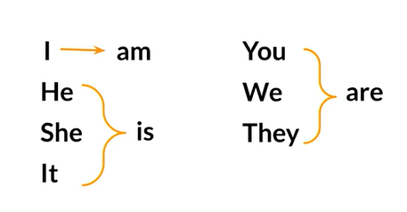

  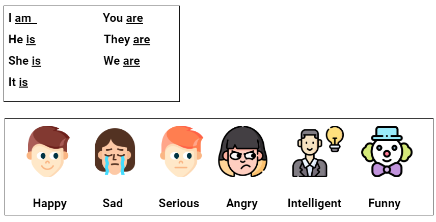

## Places

* This is a bakery
* This is a Hospital
* This is an airport
* This is a School
* This is a Pharmacy
* This is a Bank
* This is a Bookstore
* This is a Train.station

  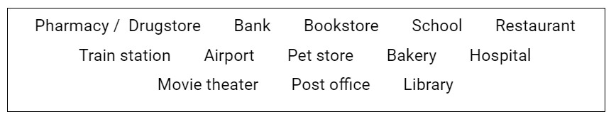

### Prepositions of place

  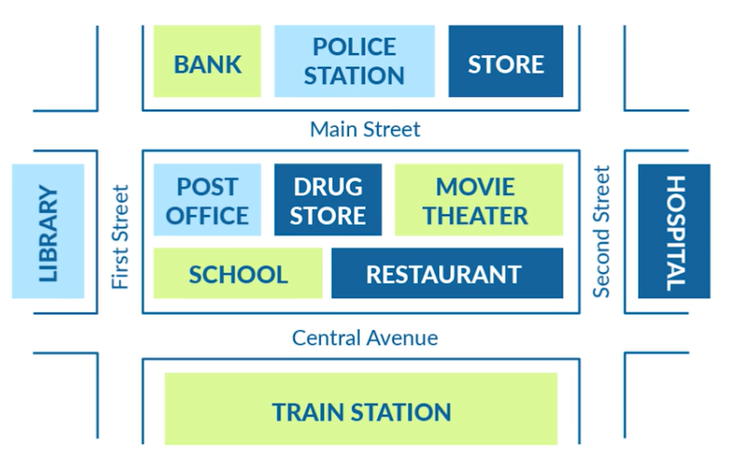

  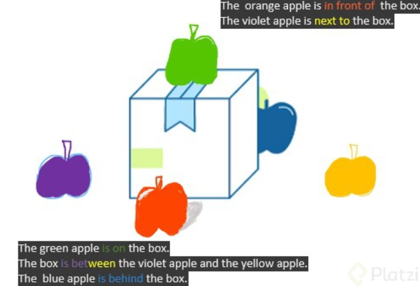

  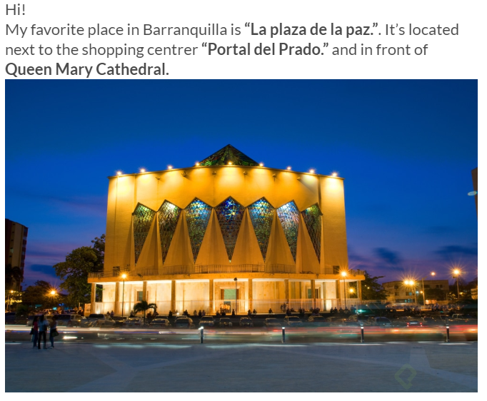

  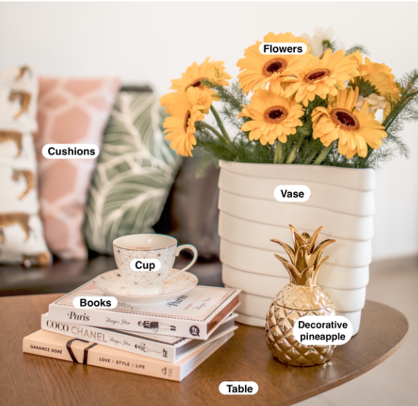

1. The flowers are in the vase.
2. The books are on the table.
3. The cushions are next to the cup.
4. The decorative pineapple is between the vase and the flowers.
5. The cup is in front of the cushions.
6. The vase is behind the decorative pineapple.

### What do you like to do?

* I like to watch TV
* I like to run in the park
* I lake to play guitar

  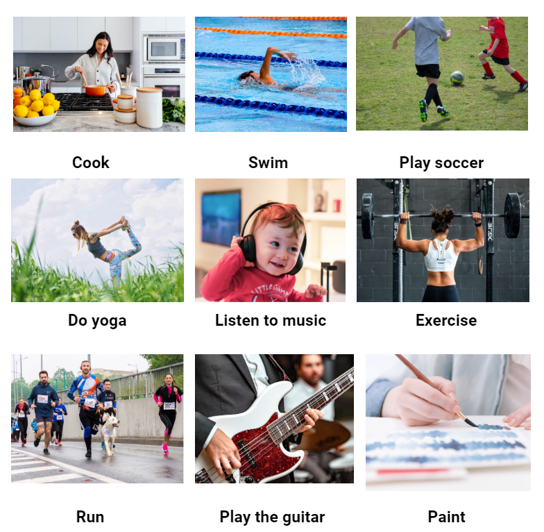

## Likes vs dislikes

* I like to read a books
* I don’t like to smoke.

* I like to study at Platzi.
* I don’t like to watch tv.

## Adverbs of frequency

Adverbs of frequency

* 100% Always
* 90% Usually
* 80% Frequently
* 70% Often
* 30% Occasionally
* 10% Seldom
* 5% Rarely
* 0% Never

  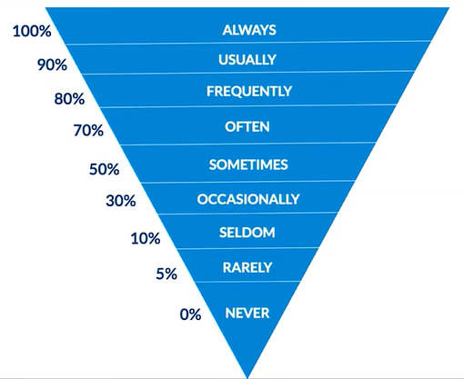

**Rules for adverbs of frequency:**
Noun + frequency + action
Example: I never drink coffe.

**There is one exception to this rule** --> Sometimes
Example: Sometimes I go to the beach.

  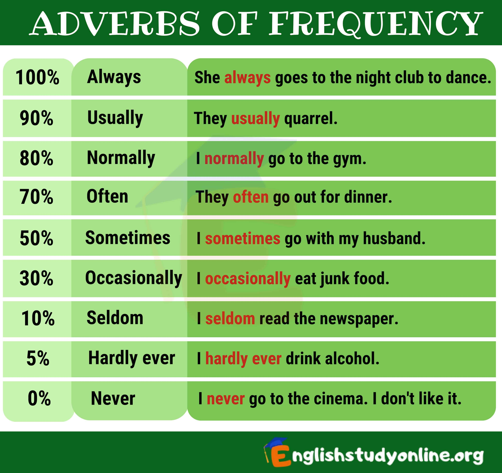

# Pronunciation

  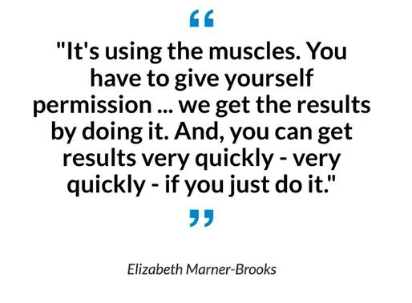

  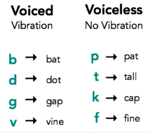

## Exercise

[Read and record your voice](/learn/English/school/beginners/strategies-to-learn-online.pdf)

## Introduction to IPA (International Phonetic Alphabet)

  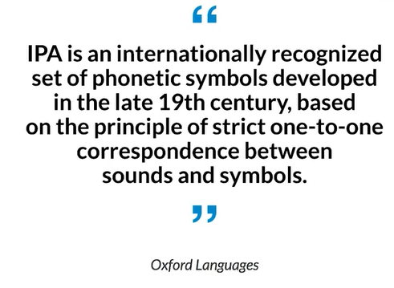

  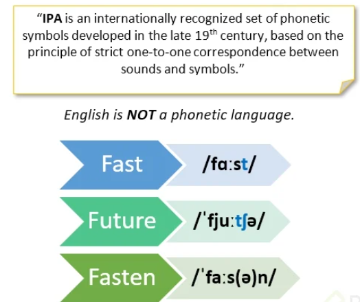

Guía de símbolos fonéticos utilizados en IPA

[Read and record your voice](/learn/English/school/beginners/IPA.pdf)

## Manage air flow

  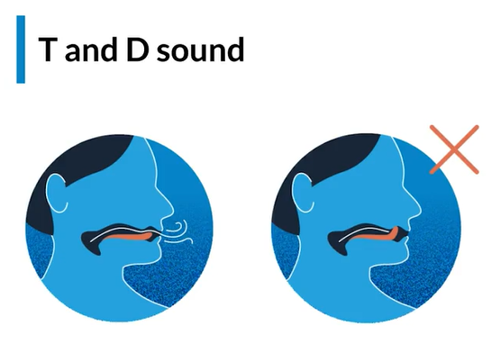

  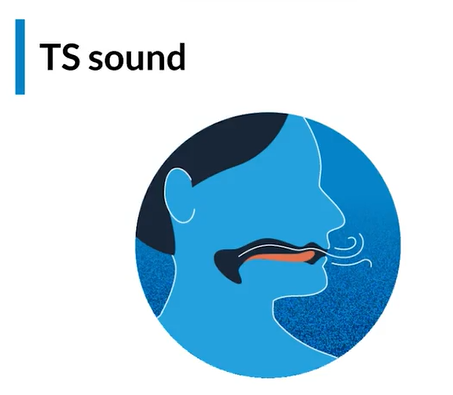

**T:**
* tawny
* thin
* tiny

**D:**
* dark
* date
* defeat

**TS:**
* abstracts
* pharmacists
* specialists

## Nasal sounds

  

  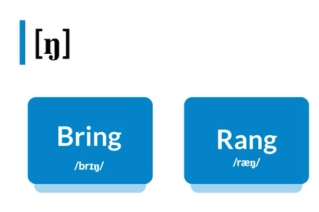

  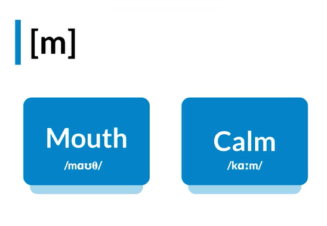

**N**
* Nested /ˈnɛstɪd/
* Number /ˈnʌmbə/
* New /njuː/

**ŋ**
* Long /lɒŋ/
* Sing /sɪŋ/
* toungue /tʌŋ/

**m**
* Mess /mɛs/
* Maybe /ˈmeɪbiː,ˈmeɪbi/
* Might /mʌɪt/

## Lips

https://dictionary.cambridge.org/us/dictionary/english/van

  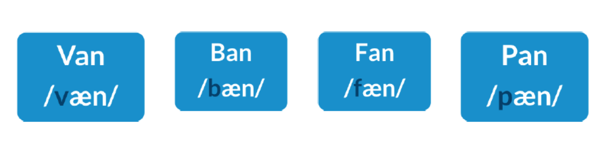

Los labios están en una posición similar para todas, sin embargo, la cantidad de presión que se aplica y la cantidad de aire que se escapa o no cambia el sonido.
El resultado puede ser la diferencia entre decir:

> "I need a frying pan.” y “I need a frying van."

La diferencia entre la “v” en “van” y “b” en “ban”, por ejemplo, se da con la cantidad de presión que se le aplica al labio inferior en la “v”. Junto con el sonido de las cuerdas vocales cuando se deja fluir el aire, se genera una vibración en el labio inferior. Practica manteniendo la vibración de la “v” por 5 segundos seguidos o lo más que puedas.

  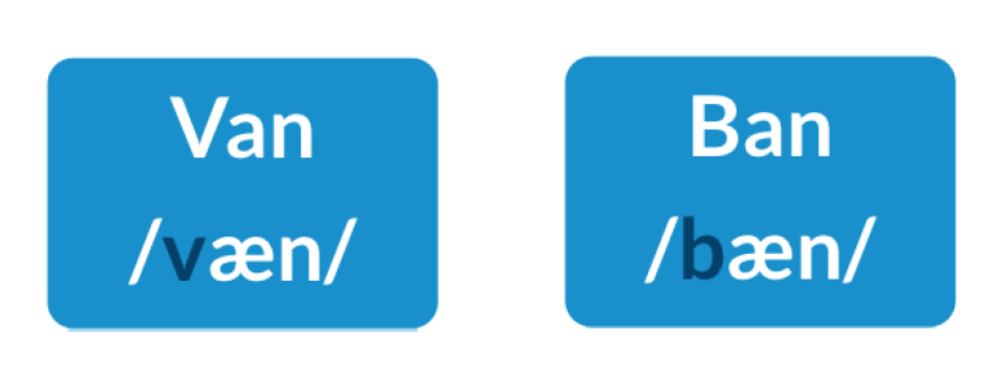

De las vocales más confundidas en la pronunciación, la /ɪ/ en “This” y la /iː/ en “These” se logran distinguir por la forma de los labios.

La siguiente gráfica es la que usaremos a lo largo del curso para guiarnos en la pronunciación de las vocales. La línea vertical marca qué tan abierta está la boca
y la horizontal, el posicionamiento de la lengua.

  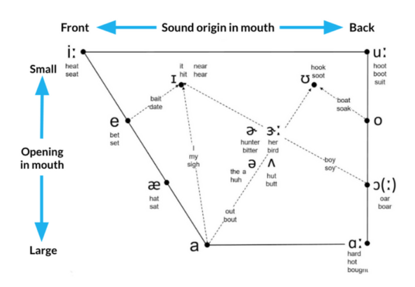

Para lograr la distinción del sonido de la /ɪ/ y la /iː/, los labios se extenderán más en la /iː/ y ayudan a formar ese sonido. Algo parecido sucede con los sonidos vocales /uː/ y /ɔː/; los labios forman el sonido y distingue éstos de los sonidos frontales.

Aunque la mayoría de factores en la pronunciación se encuentran detrás de los labios, éstos tienen una gran importancia en la formación de los sonidos fonéticos. Practicar frente a un espejo y fijarse en el movimiento de los labios puede ser lo que te hacía falta para por fin llegar a tu meta en pronunciación.

https://www.ipachart.com/

https://tophonetics.com/

https://www.internationalphoneticassociation.org/sites/default/files/IPA2005_3000px.png

https://www.internationalphoneticassociation.org/content/full-ipa-chart

**Video para pronunciar vocales**

https://www.youtube.com/watch?v=63xKUpuf0w8

## Vowels

https://ingles-americano.blogspot.com/2012/06/vowel-combinations.html

# Fundamentals

## Greetings

* Good morning. How's everything?
* Hi. How are you?
* Hello How is it going?
* Good morning
* Good evening
* Good afternoon

### Good by greetings

* Bye
* Good bye
* See you
* So long!
* See you later!

  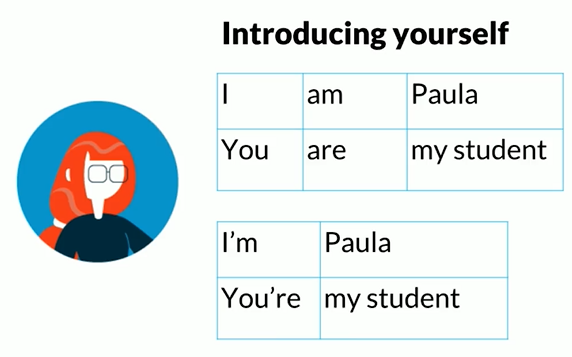

## Discussion: Introduce yourself

Read some of the most common questions to introduce yourself:

* What is your first name?
* How old are you?
* Where do you come from?
* What languages do you speak?
* Here are three examples:

My name is Alex. I come from Spain and I’m 26 years old. I speak Spanish, Portuguese and I’m learning English.

I am Anabella, but my friends call me Ana. I am 19 years old and I was born in Mexico. I speak Spanish and a little bit of English.

My name is Valeria. I am 32 years old and I come from Brazil. I speak Portuguese and I want to speak English.

## Pronunciation: Numbers 1-10 / ABC

  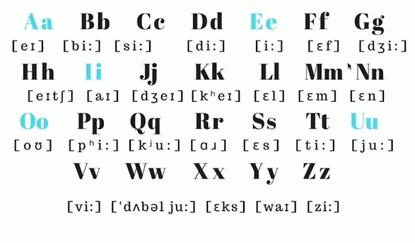

  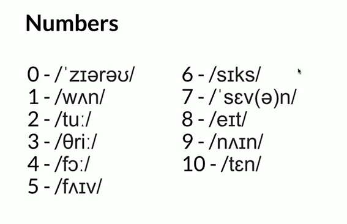

  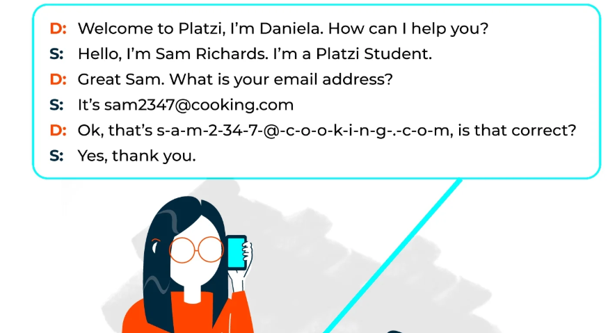

## Personal Information

Read the following e-mail and answer the questions:

Juliana Álvarez (julialvarezg@yeahhoo.com)
To me

Dear John,

My name is Juliana Álvarez. I’m from Argentina and I live in Buenos Aires. I’m twenty-one years old. I study accounting at Universidad de Buenos Aires. My email address is julialvarezg@yeahhoo.com you can reply back here. You can also contact me at 444-5068-4532. I want to learn Portuguese and Italian. I know you are a language teacher, can you help me?

Answer the questions:

Where is Juliana from?
Where does Juliana live?
How old is Juliana?
What does Juliana study?
Where is she studying?
What is her e-mail address?
What is her phone number?

## Creating your ID

  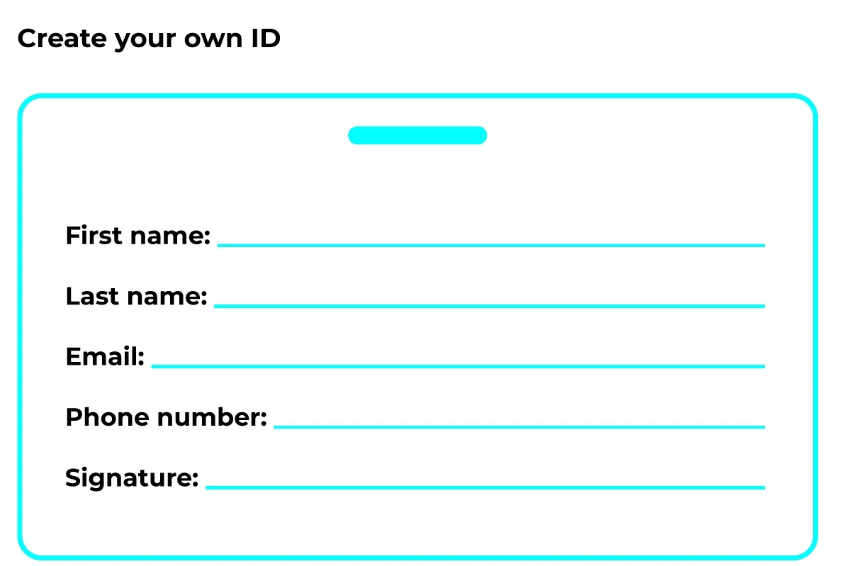

## Useful expressions

**I don’t understand.**

No comprendo.

**Can you repeat that?**

¿Puede repetir?

**Can you speak slowly, please?**

¿Puede hablar más lento, por favor?

**How do you spell that?**

¿Cómo se deletrea?

**What’s the meaning of ________?**

¿Qué significa _________?

**Thank you very much.**

Muchas Gracias.

## Jobs

### Where I live

  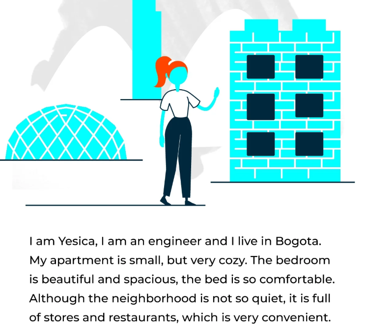

  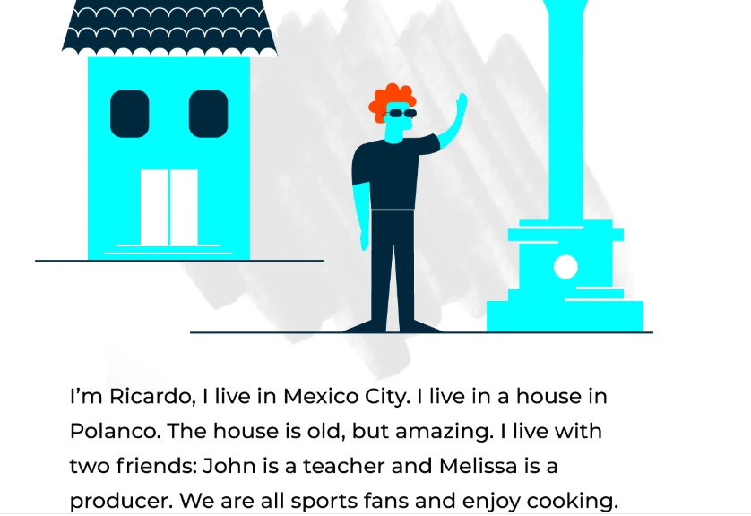

  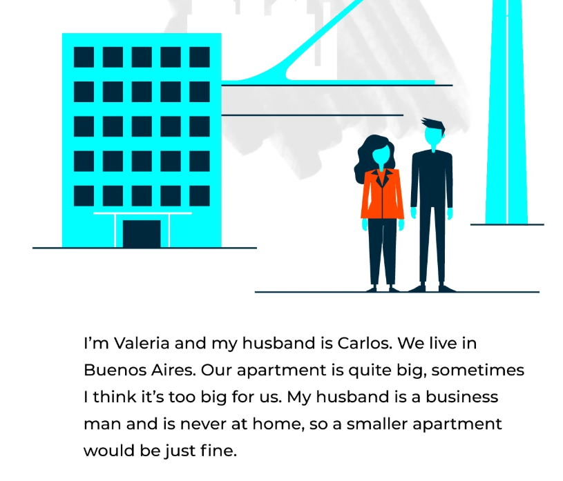

### Professions

Some more jobs / professions with their pronunciations:

ENGLISH	Phonetic	SPANISH
accountant	əˈkaʊn.t̬ənt 🔊	contable
architect	ˈɑːr.kə.tekt 🔊	arquitecto
astronaut	ˈæs.trə.nɑːt 🔊	astronauta
consultant	kənˈsʌl.tənt 🔊	asesor
cook	kʊk 🔊	cocinero
dentist	ˈden.t̬ɪst 🔊	dentista
developer	dɪˈvel.ə.pɚ 🔊	desarrollador
doctor	ˈdɑːk.tɚ 🔊	médico
driver	ˈdraɪ.vɚ 🔊	conductor
electrician	ˌɪl.ekˈtrɪʃ.ən 🔊	electricista
employee	ˌem.plɔɪˈiː 🔊	empleado
engineer	ˌen.dʒɪˈnɪr 🔊	ingeniero
fireman	ˈfaɪr.mən 🔊	bombero
freelancer	ˈfriːlænsər 🔊	freelancer
gardener	ˈɡɑːr.dən.ɚ 🔊	jardinero
hairdresser	ˈherˌdres.ɚ 🔊	peluquero
instructor	ɪnˈstrʌk.tɚ 🔊	monitor
jeweller	ˈdʒuː.ə.lɚ 🔊	joyero
journalist	ˈdʒɝː.nə.lɪst 🔊	periodista
judge	dʒʌdʒ 🔊	juez
laborer	ˈleɪ.bɚ.ɚ 🔊	obrero
lawyer	ˈlɑː.jɚ 🔊	abogado
mechanic	məˈkæn.ɪk 🔊	mecánico
nurse	nɝːs 🔊	enfermero
painter	ˈpeɪn.t̬ɚ 🔊	pintor
pilot	ˈpaɪ.lət 🔊	piloto
policeman	pəˈliːs.mən 🔊	policía
politician	ˌpɑː.ləˈtɪʃ.ən 🔊	político
postman	ˈpoʊst.mən 🔊	cartero
programmer	ˈproʊ.ɡræm.ɚ 🔊	programador
receptionist	rɪˈsep.ʃən.ɪst 🔊	recepcionista
reporter	rɪˈpɔːr.t̬ɚ 🔊	reportero
salesman	ˈseɪlz.mən 🔊	vendedor
scientist	ˈsaɪən.tɪst 🔊	científico
secretary	ˈsek.rə.ter.i 🔊	secretario
shoemaker	ˈʃuːˌmeɪ.kər 🔊	zapatero
singer	ˈsɪŋ.ɚ 🔊	cantante
soldier	ˈsoʊl.dʒɚ 🔊	soldado
student	ˈstuː.dənt 🔊	estudiante
surgeon	ˈsɝː.dʒən 🔊	cirujano
teacher	ˈtiː.tʃɚ 🔊	profesor
technician	tekˈnɪʃ.ən 🔊	técnico
translator	trænsˈleɪ.t̬ɚ 🔊	traductor
waiter	ˈweɪ.t̬ɚ 🔊	camarero
waitress	ˈweɪ.trəs 🔊	camarera
writer	ˈraɪ.t̬ɚ 🔊	escritor

### Verb to Be and Jobs

Read the following chart:

  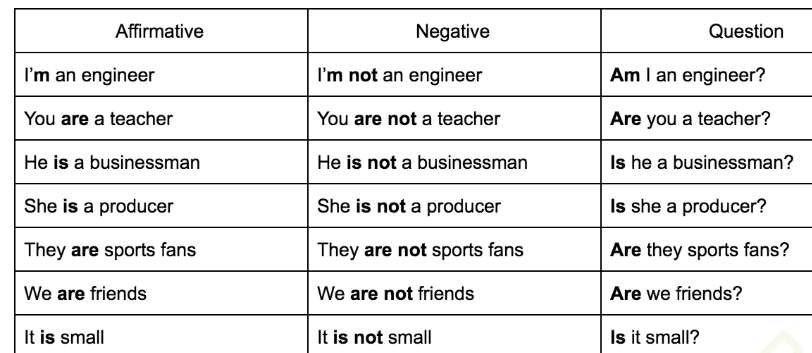

Complete the spaces:

He ______ a teacher and he ____ smart.
She ______ a nurse and she _____ nice.
They ______ producers and they _____ talented.
We ________ friends and we _____ sports fans.
It ________ big and it _______ cozy.

## Useful expressions: Meeting and greeting

Nice to meet you.
Hello, nice to meet you too.

Where are you from?
I’m from Colombia.

What do you do?
I’m a engineer

What do you like to do in your free time?
I’m play video games

What´s your phone number?
My phone number is 12547124588

## Vocabulary: Numbers 1-100

  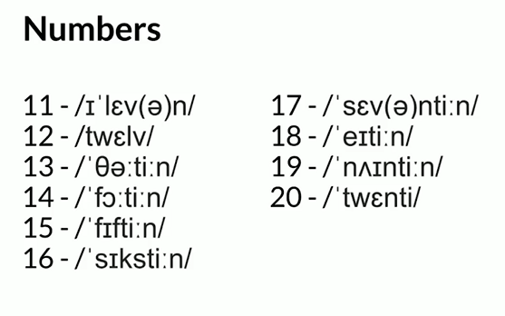

  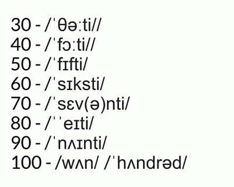

# Grammar

  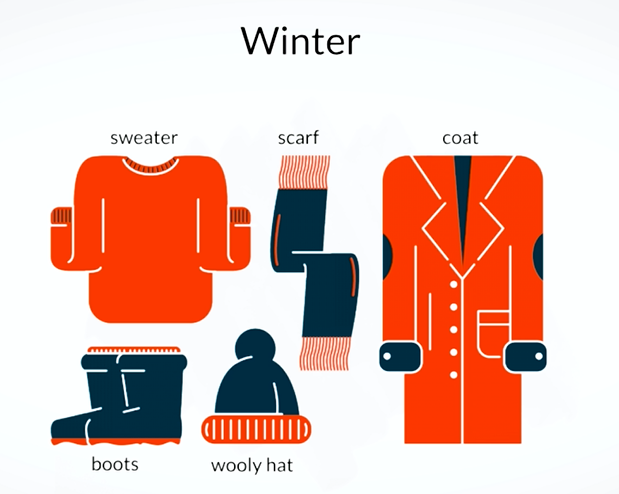

  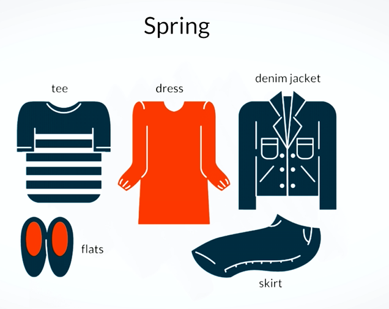

  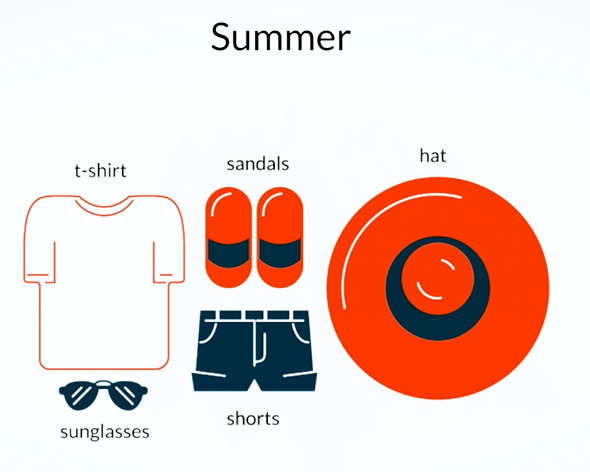

  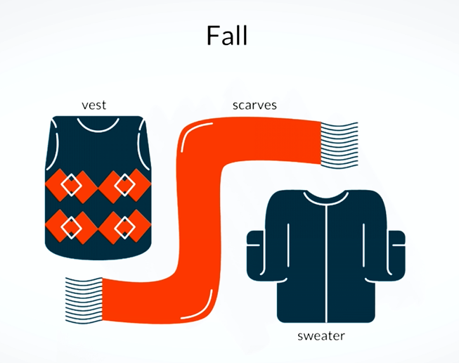

  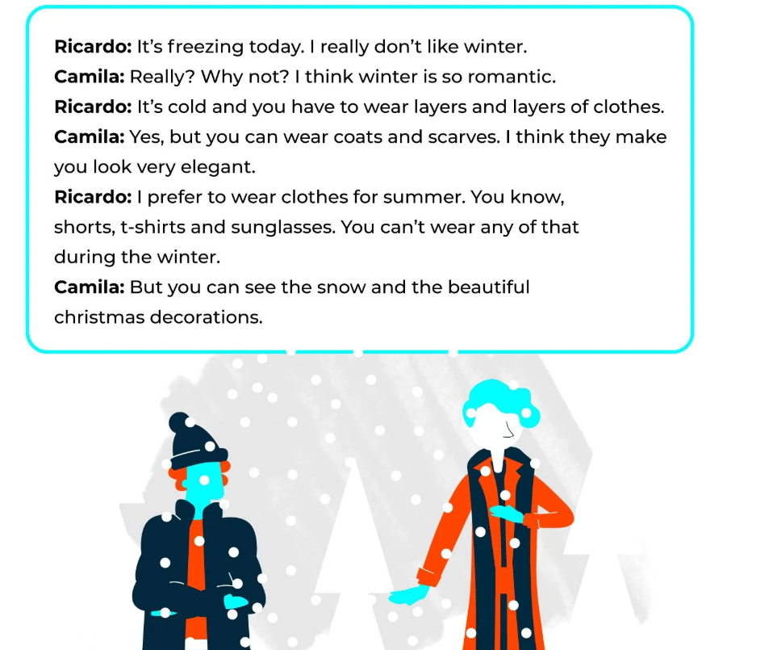

## Can and can´t

Seasons and clothes

  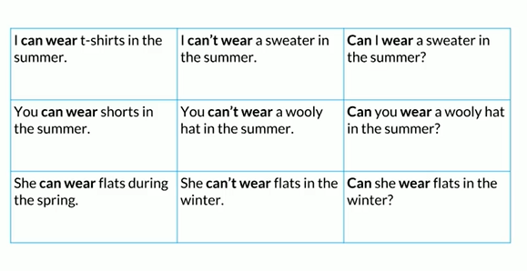

  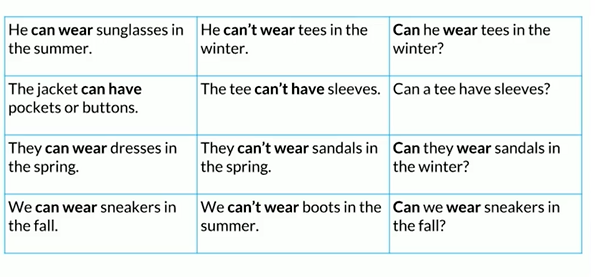

  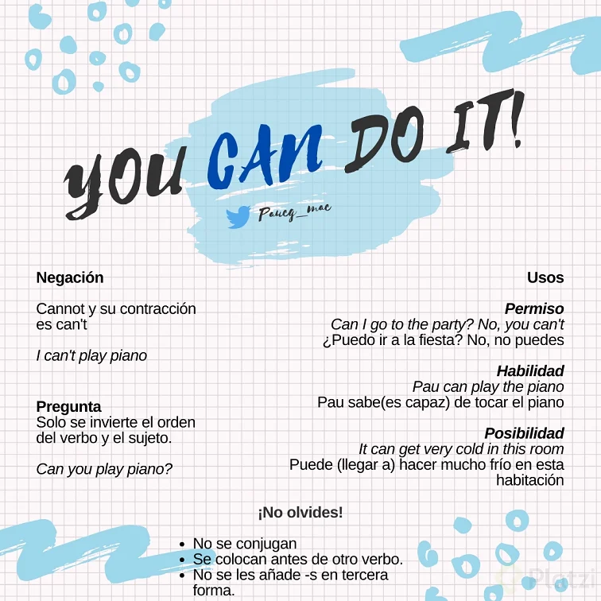

### Abilities

  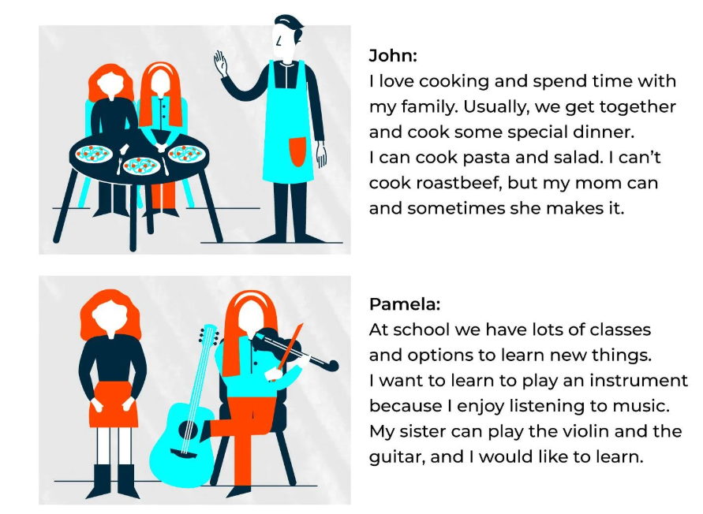

  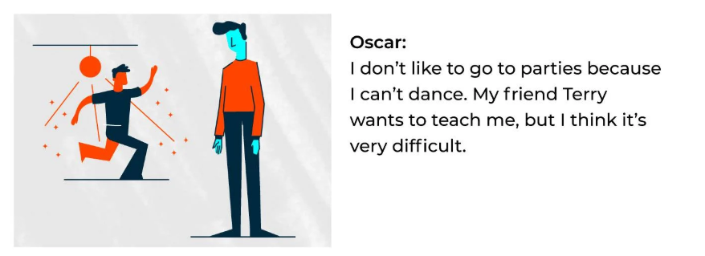

  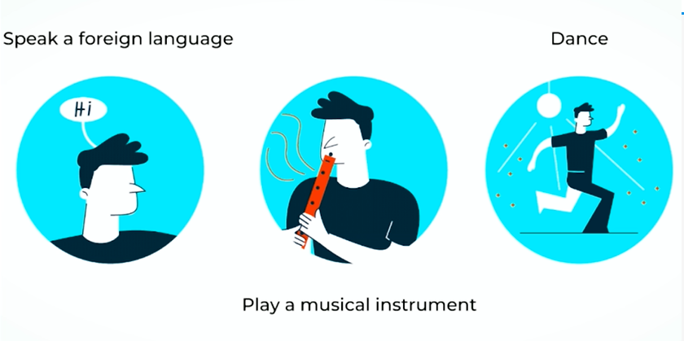

  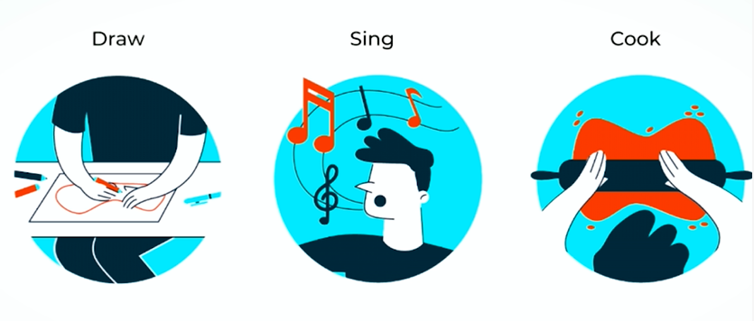

  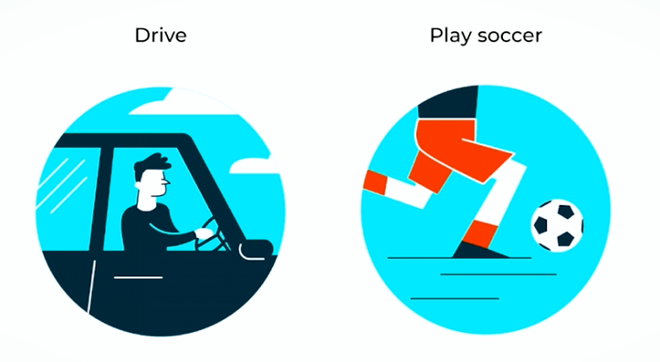

  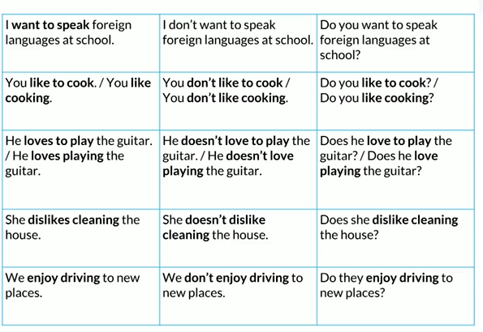

https://idiomas.gcfglobal.org/es/curso/ingles/gramatica/verb-patterns/

Write about your likes and dislikes:

Example:

My name is César, I like driving and reading literature. I don’t like washing the dishes, I do it a few times. She is María, my wife. She loves cooking and singing, she is an awesome singer. She doesn’t like going out with our dog, Tommy. She prefers to feed him and bathe him.

## Useful expressions: Love, adore, be crazy about

* Love
* Adore
* Be crazy about

  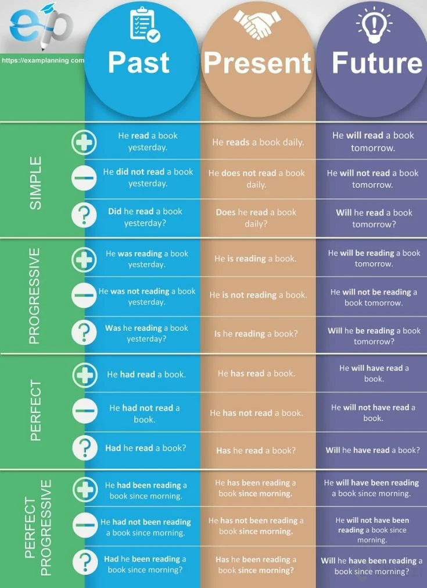

  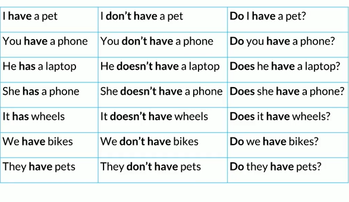

  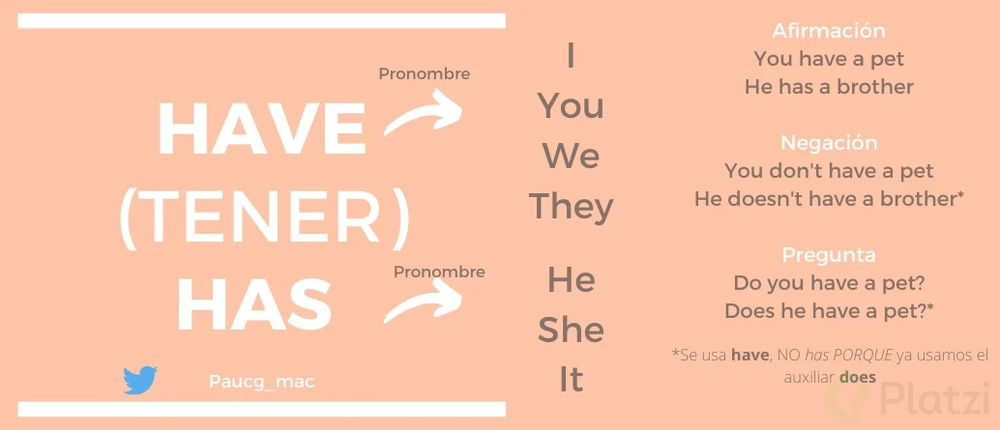

  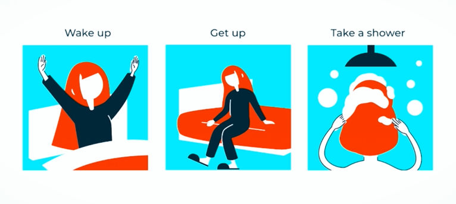

  

  

  

  

  

  

  

  

I
You
We
They
Examples:
I wake up at 6.00 am
We wake up at 6.00 am

Have an s in the conjugation of the verb:
He
She
It
Examples: He wakes up at 6.00 am
She wakes up at 6.00 am

Think about your own routine and create your schedule.

  

Read and complete the sentences:

I ______________ at 6:00 am. At 6:30 I ___________ a shower. At 7:00 I have breakfast.
John _________ breakfast at 7:00 am. He ___________ to work at 8:00 am. He _______ coffee at 10:00 am.
Andrea __________ dinner at 7:00 pm. She __________ tv and _________ her email at night.
We ____________ at 5:00 am. We ____________ our car to work.
They ______________ 8 hours every night.

Organize the sentences:

her / doesn’t / check / at / night. / She / email
he / a / take / in the morning? / Does / shower / early
lunch / They / at / don’t / cafeteria. / have / the
work / We / to / by / bus. / go
Reportar un problema
Task: Create your schedule

Task: Create your schedule and someone else’s schedule.

I wake up at 6:30 in the morning, then I get up at 6:35. At 6:40 I take a shower, after that I have breakfast. At 7:00 am I go to work by bus. I teach class and have some coffee. At noon I have lunch and I go to the office. In the afternoon I have coffee. At 5:00 pm I go home, have dinner and watch tv. I go to bed at 9:00 pm.

Yesica wakes up at 7:00, she takes a shower and has breakfast. At 8:00 she goes to work by taxi. At 1:00 pm she has lunch. In the afternoon she works. She goes home at 7:00 pm, she has dinner and goes to bed.

## WH questions

  

  

  

  

## Useful expressions: Frequency adverbs.

In this lesson you will learn useful expressions to talk about routines, these are Frequency Adverbs. Listen and repeat.

I **always** work late
She **almost always** cooks at home
They **sometimes** eat fish
We **seldom** go to the movies
I **almost** never watch TV
You **never** visit the doctor

Practice these expressions using your habits and routines and share them in the discussion board.

## Past sentences

### My childhood

  

  

Here are some examples of past tenses:

I was 5 years old in 1995.
My parents were sales representatives.
I was very talkative.
My sister was 10 years old.
My best friend was Amanda

### Vocabulary: Adjectives

  

  

  

  

**Tall** = Alto
**Short** = Persona baja( enanos v:)
**Heavy** = Corpulento (Gordo)
**Thin** = Delgado
**Blonde** = Rubia
**Brunette** = Morena, una persona, típicamente una mujer, con cabello castaño oscuro. pero puede ser varias cosas dependiendo del contexto: Brunette hair = Pelo castaño Brunette skin = Piel morena
**Nice** = Agradable, pero en este caso, en el que estamos hablando de personas puede ser Nice person = Persona simpática
**Talkative** = Hablador (Persona que habla mucho) 
**Annoying** = Fastidioso o que molesta mucho.
**Outgoing** = Extrovertido
**Shy** = Tímido
**Mean** = Puede significar molesto también no dispuesto a dar o compartir cosas, especialmente dinero; no generoso En otros casos puede ser intención de transmitir, indicar o referirse a (una cosa o idea en particular); significar
**Famous** = Famoso