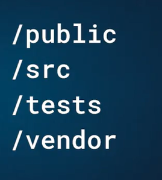
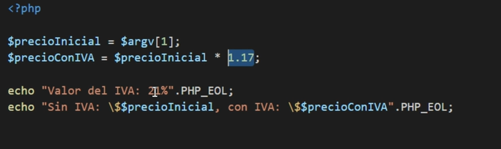
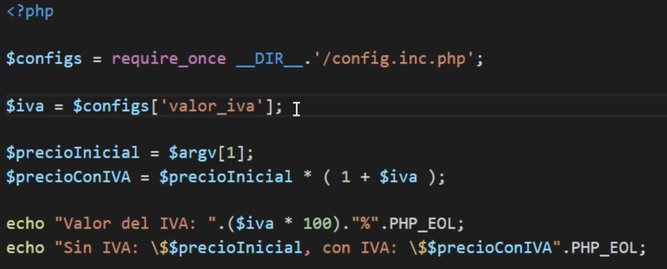
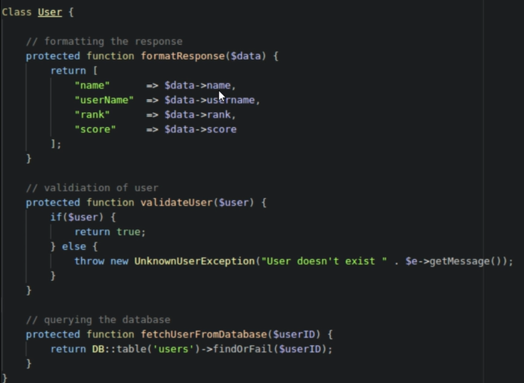
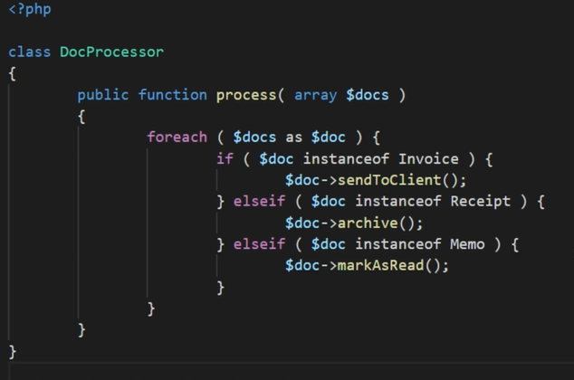
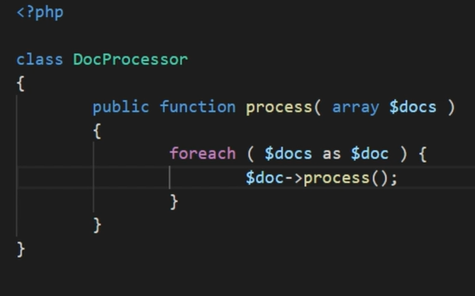
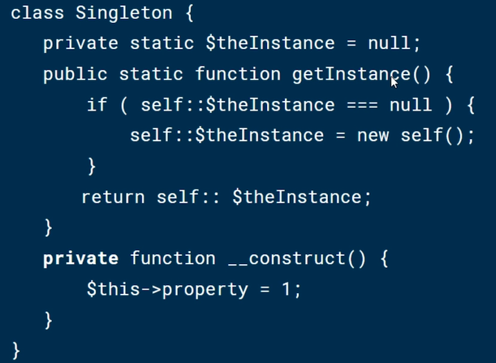
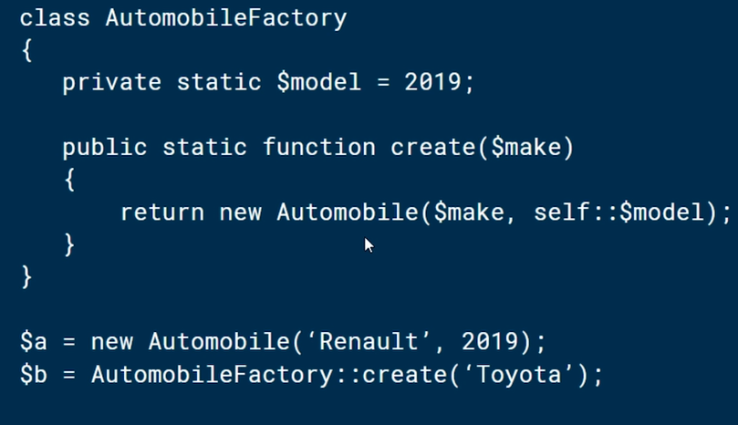
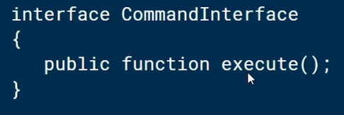

# Código limpio <!-- omit in toc -->

## Tabla de Contenido<!-- omit in toc -->
- [Tips](#tips)
  - [¿A quién beneficia contar con código bien escrito?](#a-quién-beneficia-contar-con-código-bien-escrito)
  - [Código prolijo](#código-prolijo)
  - [Zen de python](#zen-de-python)
  - [Identificadores mnemotécnicos, específicos y precisos](#identificadores-mnemotécnicos-específicos-y-precisos)
  - [Código reutilizable / Código modular](#código-reutilizable--código-modular)
  - [Código reutilizable](#código-reutilizable)
  - [Código organizado](#código-organizado)
  - [Evitar el hardcoding](#evitar-el-hardcoding)
  - [Evitar efectos colaterales](#evitar-efectos-colaterales)
- [SOLID](#solid)
  - [S Single Reponsibility Principle](#s-single-reponsibility-principle)
  - [O Open/Closed Principle](#o-openclosed-principle)
  - [Liskov Substitution Principle](#liskov-substitution-principle)
  - [Interface Segregation Principle](#interface-segregation-principle)
  - [Dependency Inversion Principle](#dependency-inversion-principle)
- [Patrones de diseño](#patrones-de-diseño)
  - [Singleton](#singleton)
  - [Factory](#factory)
  - [Command](#command)
- [Testing](#testing)

# Tips

## ¿A quién beneficia contar con código bien escrito?

> El código bien escrito beneficia a todos los involucrados en el proyecto.

**A tí**: Cuando retomemos un proyecto después de un largo tiempo nos beneficiará ya que sabremos cómo está ordenado y cómo está escrito todo.
**A cualquiera:** Cualquier persona que deba modificar el código después de tí.
**A tu cliente:** Aunque nunca lo sabrá, su negocio estará mejor atendido.

**Los siguientes elementos dotan de calidad al código:**
* **Legibilidad:** qué tan fácil es interpretar lo que el código dice.
* **Mantenibilidad:** cuánto esfuerzo supondrá adaptar el código a nuevos requerimientos.
* **Testeabilidad:** cuánto esfuerzo supondrá realizar pruebas sobre este código.

## Código prolijo

El código fuente lo escribimos para personas como tú y yo, para las computadoras tenemos las versiones compiladas.

Debemos seguir un estándar de codificación, el cual nos ayuda a:

* Generar código claro y consistente.
* Evitar perder tiempo en decisiones triviales.

**Tips para mejorar la legibilidad de nuestro código:**

* **Define un estándar:** Piénsalo una vez y déjalo por escrito.
* **Respétalo:** Haz un esfuerzo por adherir al estándar durante tu día a día.
* **Apóyate en algún linter:** Esta sencilla herramienta te ayudará a incorporar buenas prácticas.

## Zen de python

* Lindo es mejor que feo.
* Explícito es mejor que implícito.
* Simple es mejor que complejo.
* Complejo es mejor que complicado.
* Plano es mejor que anidado.
* Espaciado es mejor que denso.
* La legibilidad es importante.
* Los casos especiales no son lo suficientemente especiales como para romper las reglas.
* Sin embargo la practicidad le gana a la pureza.
* Los errores nunca deberían pasar silenciosamente.
* A menos que se silencien explícitamente.
* Frente a la ambigüedad, evitá la tentación de adivinar.
* Debería haber una, y solamente una, manera obvia de hacerlo.
* A pesar de que no sea obvio a menos que seas Holandés (como GvR)
* Ahora es mejor que nunca.
* A pesar de que nunca es muchas veces mejor que justo ahora.
* Si la implementación es dificil de explicar, es una mala idea.
* Si la implementación es fácil de explicar, quizás sea una buena idea.
* Los espacios de nombres son una gran idea, ¡tengamos más de esas!

## Identificadores mnemotécnicos, específicos y precisos

Los identificadores son variables, funciones, clases, módulos, componentes, etc. Elementos a los que nosotros debamos crearles un nombre propio.

Ejemplo sin un identificador mnemotécnico una función se vería así:

```php
function f( int $b, int $a ) : float {
        return ( $b * $a ) / 2;
}
```

Al leer este código no sabemos para qué funciona y hasta podríamos borrarlo por equivocación.

Ahora utilizando un identificador mnemotécnico se vería así:

```php
function areaRectangulo( int $base, int $altura ) : float {
        return ( $base * $altura ) / 2;
}
```

Ahora gracias a que el código es más legible sabemos para qué funciona esta función.

Atención a los identificadores que estableces.

## Código reutilizable / Código modular

El código modular son pedazos de códigos divididos que pueden ser utilizados en cualquier lugar para evitar tener un solo archivo con un bloque de código gigante.

> DIVIDE AND CONQUER

## Código reutilizable

Escribir código reutilizable nos va a ayudar a que en lugar de copiar y pegar una misma línea de código pero con diferentes parámetros lo hagamos a través de una función que retorne los valores que necesitamos y luego la podremos llamar en cualquier lugar del código que necesitemos pasándole los parámetros que deseamos.

* Mantén tu código DRY (O SECO, en español). Es decir “Don’t Repeat Yourself” (O “No te repitas”)
* Haz métodos o funciones que hagan solamente una cosa.
* Haz pruebas unitarias para tus métodos y que sean fáciles de testear
* Trata de pensar de forma abstracta, usa interfaces o clases abstractas
* Escribe código que se pueda extender fácilmente en un futuro (Básicamente que modificarlo no signifique prenderle fuego a medio código)
* No escribas código innecesario o que no hace falta en el momento.
* Reduce el acoplamiento (Acoplamiento hace referencia a que, el comportamiento de una función depende enteramente de lo que retorne otra función, y esta de otra, y otra, y otra…)
* Usa más código modular.
* Escribe tu código como si fuera una API externa (Que se pueda importar de otro código y sirva completamente)

## Código organizado
El código organizado se refiere a cómo tenemos distribuido nuestros archivos en la raíz (root) del proyecto. A mayor organización, mayor entendimiento del código.

<div align="center">
  
</div>

## Evitar el hardcoding

**El hardcoding es la práctica de escribir valores literales en lugar de identificadores.** No debe de usarse, ya que si el día de mañana debemos cambiar los valores eso significa que debemos cambiar el código en los lugares que esté ese valor estático por completo y luego mandar a producción, cuándo podríamos hacer el cambio más orgánico en una variable que afecte a todos los lugares que es llamada.

<div align="center">
  
</div>

<div align="center">
  
</div>

## Evitar efectos colaterales

Debemos analizar muy bien nuestro código para evitar efectos colaterales y evitar que nuestro código deje de funcionar. **No uses variables globales.**

# SOLID

SOLID son cinco principios básicos de la **programación orientada a objetos** que ayudan a crear software mantenible en el tiempo.

**SOLID significa:**

**S:** Single Reponsibility Principle
**O:** Open/Closed Principle
**L:** Liskov Substitution Principle
**I:** Interface Segregation Principle
**D:** Dependency Inversion Principle

## S Single Reponsibility Principle

La S se trata de una clase que debe tener **sólo una razón para cambiar.**

> Alta Cohesion

Se debe buscar separar las responsabilidades

<div align="center">
  
</div>

## O Open/Closed Principle

Open/Closed Principle establece que **una entidad de software debe quedarse abierta para su extensión**, pero cerrada para su modificación.

<div align="center">
  
</div>

<div align="center">
  
</div>

## Liskov Substitution Principle

El **Liskov Substitution Principle** establece que cada clase que hereda de otra puede usarse como su padre sin necesidad de conocer las diferencias entre ellas. 

Para que pueda darse este principio debe cumplir con dos puntos:

* El cliente debe usar métodos de la clase padre únicamente.
* La clase hija no debe alterar el comportamiento de los métodos de la clase padre.

https://www.youtube.com/watch?v=2X50sKeBAcQ

## Interface Segregation Principle

El Interface Segregation Principle establece que **los clientes de un programa sólo deberían conocer de éste los métodos que realmente usan.**

No tener una super clase con metodos que no se van a usar, mejor muchas clases específicas con código usable en nuestra aplicación, es mala práctica lanzar un error de un método que no se usa

## Dependency Inversion Principle

Dependency Inversion Principle detalla que **los módulos de alto nivel no deben depender de los de bajo nivel**, ambos deben depender de **abstracciones**.

Las abstracciones no deben depender de los detalles, los detalles deben depender de las abstracciones.

> Se debe de lograr bajo acoplamiento

**Una abstracción se enfoca en la visión externa de un objeto**, separa el comportamiento específico de un objeto, a esta división que realiza se le conoce como la barrera de abstracción, la cuál se consigue aplicando el principio de mínimo compromiso.

Pero… ¿Qué es el principio de mínimo compromiso? Se refiere al proceso por el cuál la interfaz de un objeto muestra su comportamiento específico y nada más, absolutamente nada más.

En otras palabras la abstracción se enfoca en “que hace” sin importar en “cómo lo hace”.

Es como solo fijarse en el nombre de una función calcularHorasDelAño(), sin importar el código que hay dentro, solo nos quedamos con el nombre, que ya nos dice “que hace”, y no "como lo hace".

# Patrones de diseño

Los patrones de diseño son soluciones de arquitectura de software aplicables a diferentes problemas.

<div align="center">
  
</div>

## Singleton

El patrón Singleton permite restringir la creación de objetos pertenecientes a una clase o al valor de un tipo a un único objeto.

<div align="center">
  
</div>

## Factory

El patron Factory es creacional, se utiliza para ayudar a la creación de nuevas instancias de objetos.

<div align="center">
  
</div>

## Command

El patrón Command **permite solicitar una operación a un objeto sin conocer realmente el contenido de esta operación**, ni el receptor real de la misma. Para ello se encapsula la petición como un objeto, con lo que además facilita la parametrización de los métodos.

<div align="center">
  
</div>

# Testing

Existen dos tipos de testing:

* **Unit Testing**: Evaluamos el funcionamiento de los componentes individualmente.
**Integration Testing**: Validar la interacción entre los componentes y el sistema completo.

Problemas del testing manual

* Costoso
* Lento
* Poco confiable