# Fundamentos de Diseño <!-- omit in toc -->

## Tabla de Contenido<!-- omit in toc -->
- [Fundamentos](#fundamentos)
  - [El proceso creativo](#el-proceso-creativo)
  - [Conceptos básicos de diseño](#conceptos-básicos-de-diseño)
  - [Responsive design](#responsive-design)
  - [Accesibilidad](#accesibilidad)
  - [Brief y requerimientos técnicos](#brief-y-requerimientos-técnicos)
- [Diseño de experiencia de usuario](#diseño-de-experiencia-de-usuario)
  - [Etapas UX](#etapas-ux)
  - [Diagramas de flujo](#diagramas-de-flujo)
    - [Sitemap](#sitemap)
    - [Userflow](#userflow)
    - [Wireframes y componentes](#wireframes-y-componentes)
- [Diseño de la interfaz](#diseño-de-la-interfaz)
  - [Moodboard y línea gráfica](#moodboard-y-línea-gráfica)
  - [Teoria del color](#teoria-del-color)
    - [En la web](#en-la-web)
    - [Paleta de color](#paleta-de-color)
  - [Tipografías](#tipografías)
  - [Layout y sistema de grillas](#layout-y-sistema-de-grillas)
  - [Sistemas de componentes UI](#sistemas-de-componentes-ui)

# Fundamentos

## El proceso creativo

  

  

  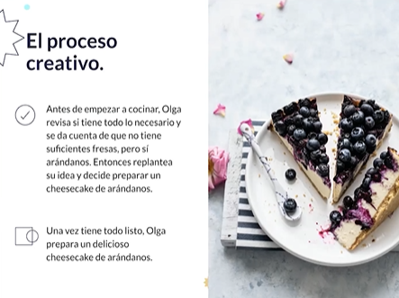

  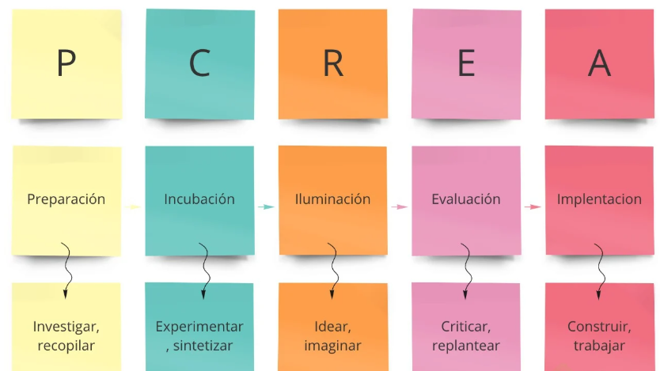

  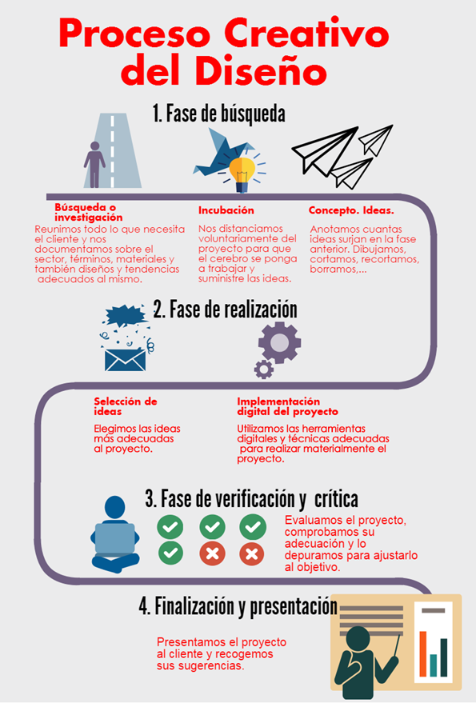

https://codepen.io/
https://www.behance.net/onboarding

## Conceptos básicos de diseño

* **Balance**: Posición de cada elemento está dada por su peso visual
    * a. Simétrico
      * 

        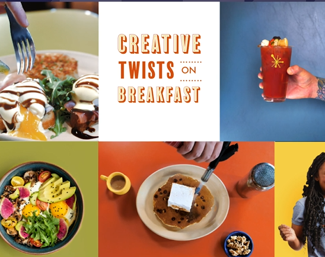
      

    * b. Asimétrico
      * 

        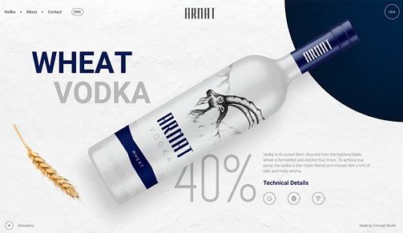
      

* **Contraste**: Señalar un concepto marcado por la diferencia entre 2 elementos distintos (claro obscuro, grande pequeño)
    * 

      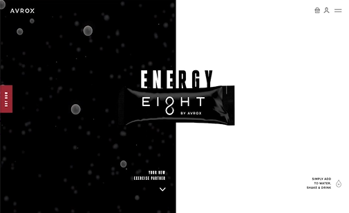
    

* **Alineación**: Crear rutas visuales
    * 

      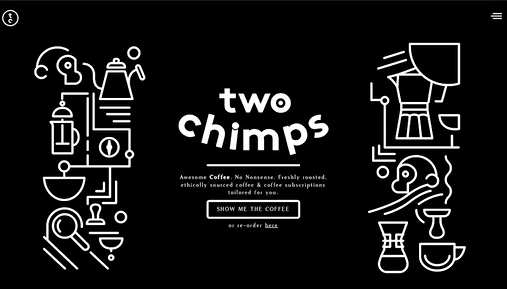
    

* **Proximidad**: Agrupar elementos
    * 

      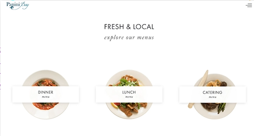
    

* **Repetición**: Concepto de marca
Espacio: Como hacerle uso
    * 

      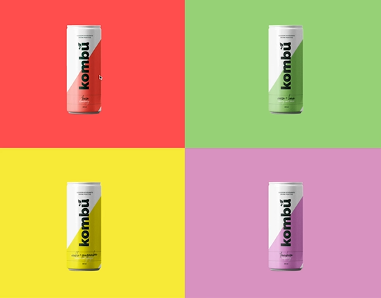
    

* **Espacio**: Darle uso al espacio
    * 

      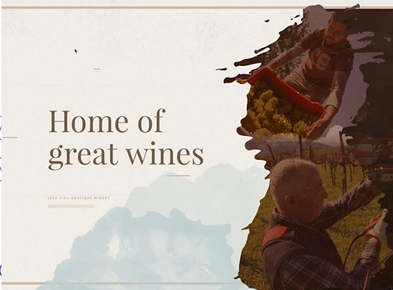
    

## Responsive design

    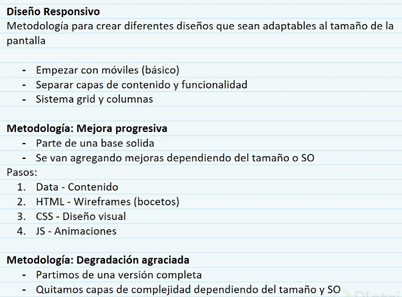

    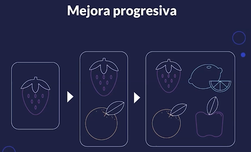

    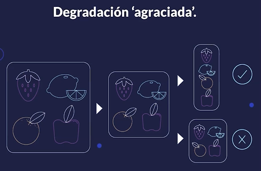

    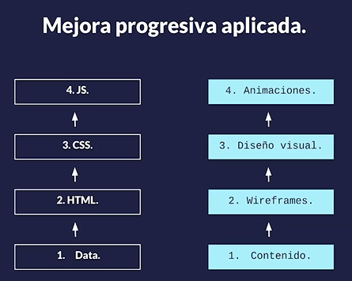

## Accesibilidad

> El poder de la web está en su universalidad. El acceso de todas las personas independientemente de la discapacidad es un aspecto esencial 
> **Tim Berners-Lee W3C Director**

* Utiliza encabezados de manera ordenada para organizar la estructura del contenido (HTML5 semantico) H1
* Utiliza tamaños de fuentes accesibles
* Utiliza colores que tengan un contraste adecuado
* Garantiza que el código de color no sea la única forma de relacionar contenido
* Diseña teniendo en cuenta los estados **focus** y **active** de los componentes
* Añade etiquetas y textos descriptivosa los campos de formulario (aria-labels)
* Escribe contenido descriptivo que pueda reemplazar videos e imagenes
* Garantiza que las animaciones no bloqueen el acceso al contenido

## Brief y requerimientos técnicos

* Es la hoja de ruta para empezar a diseñar. Es el resultado de las conversaciones con el cliente e incluye datos sobre marca, objetivos y requerimientos de un proyecto

    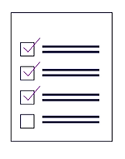

    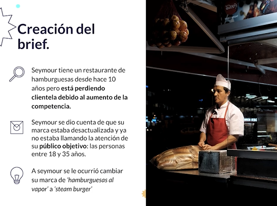

    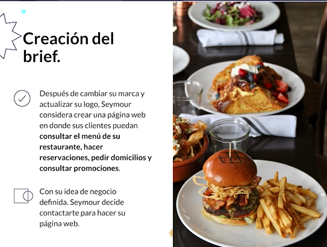

https://github.com/mssroboto/diseno-para-programadores

# Diseño de experiencia de usuario

    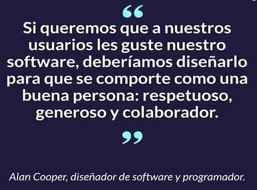

## Etapas UX

* **Investigacion** ⇒ Recopilar informacion para conocer que ocupan los usuarios principalmente. Es bueno apoyarse de aplicaciones ya existentes para crear un buen diseño UX
* **Analisis** ⇒ Una vez recopilada la informacion se analiza y se obtienen los puntos importantes que debemos tener en cuenta al momento de crear el diseño
* **Diseño** ⇒ Se crean prototipos o sketches para visualizar el resultado
* **Pruebas de usuario** ⇒ Por lo general se llevan a cabo en los sketches para poder realizar ajustes antes de llevar el diseño a codigo

## Diagramas de flujo

    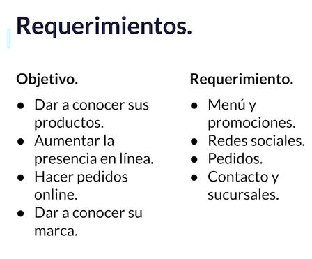

### Sitemap

    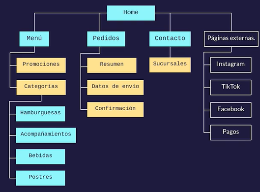

### Userflow

    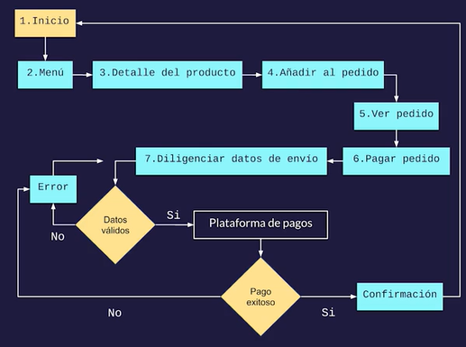

### Wireframes y componentes

    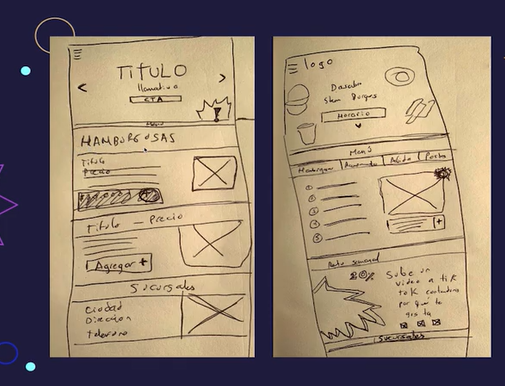

    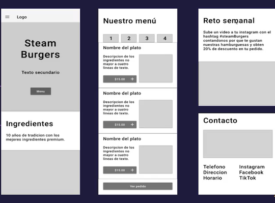

# Diseño de la interfaz

    

## Moodboard y línea gráfica

Moodboard es una colección de referencias visuales que se usa como fuente de inspiración para un diseño

Crearlo en Pinterest para tener referencias

    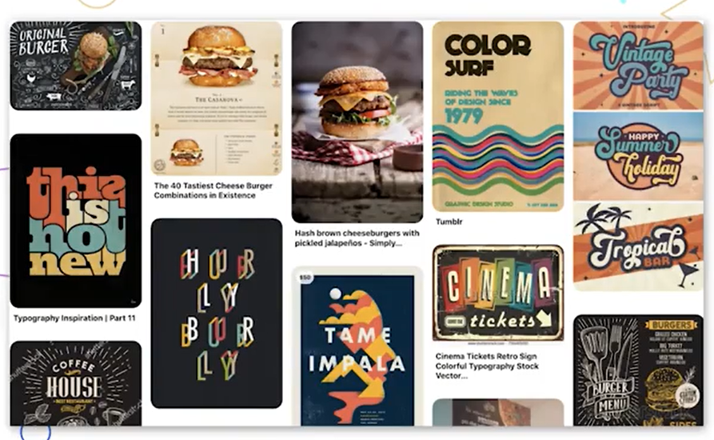

## Teoria del color

Área de estudio que se dedica a investigar la forma en la que el cerebro percibe los colores y los asocia a conceptos y sentimientos

    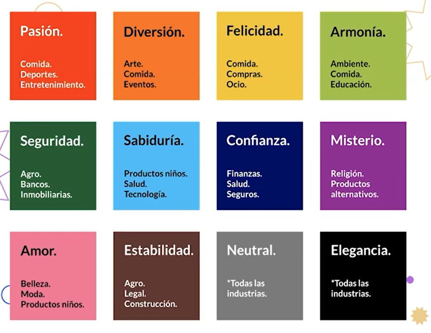

### En la web

* Color RGB y hexadecimal
* Código de color consistente
* Menos es más. El exceso de color hace que los usuarios no se puedan enfocar en una acción a la vez
* Asegurate de que tu elección de color sea accesible
* Define una paleta de color

### Paleta de color

https://color.adobe.com/explore

    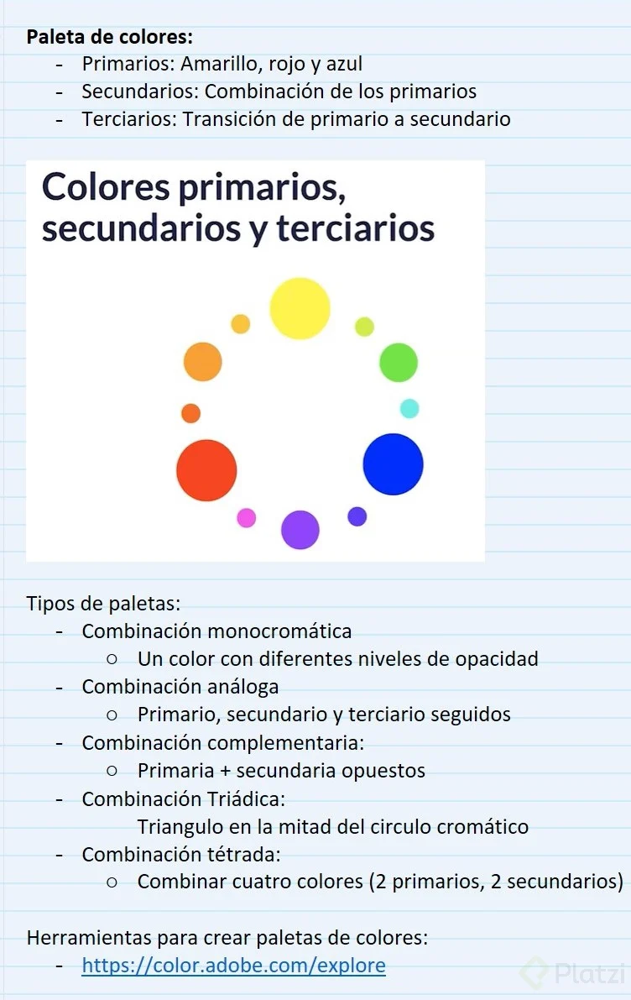

## Tipografías

* Menor cantidad de típografias
* Usa fuentes estándar
* Limita la cantidad de texto
* Tipografías legibles en diferentes tamaños
* Manten altos de línea espaciados
* Busca suficiente contraste
* Evita animaciones intermitentes

    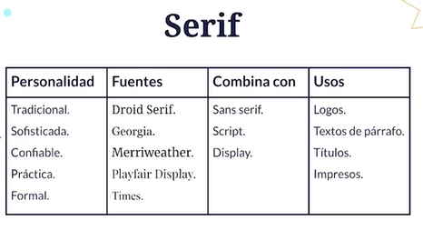

    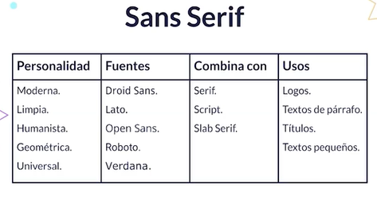

    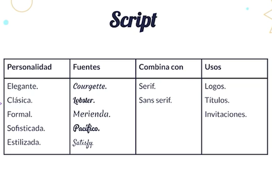

https://fonts.google.com/

## Layout y sistema de grillas

https://chrome.google.com/webstore/detail/css-grid-overlay/hajfilceeneohkmcakehndmaeonhlack?hl=en

    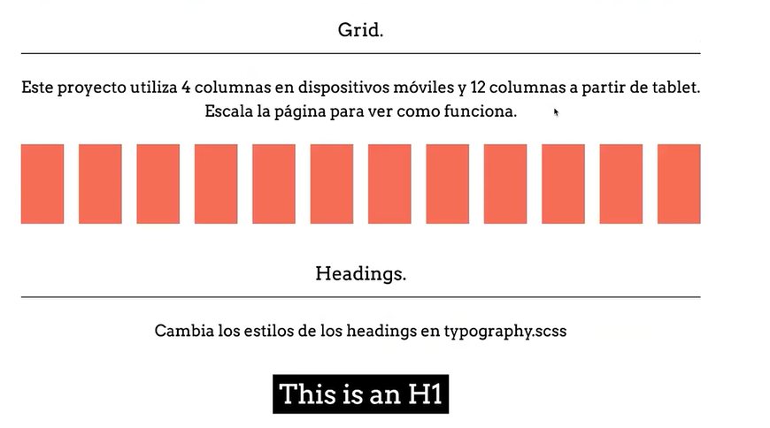

## Sistemas de componentes UI

Una de las metodologías que podemos usar es separar la funcionalidad por componentes.

Un sistema de componentes es un conjunto de componentes que vamos a usar par crear nuestra aplicación. Esos componentes funcionan como una librería.

Puedes usar cualquier tecnología que prefieras. Lo importante es encapsular las funcionalidades en componentes. Cada componente tendrá su propio css y funcionalidad dentro de su propia función.

Así podremos importar esas características a cualquier pantalla de nuestra aplicación, reutilizando el código y haciendo más eficiente nuestra aplicación.