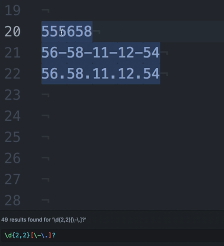
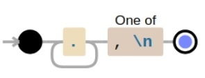
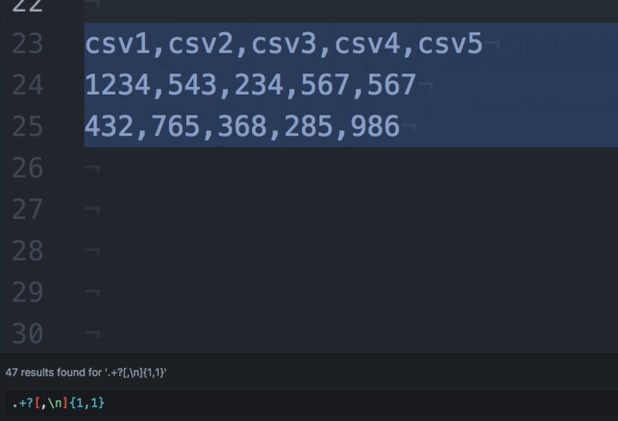
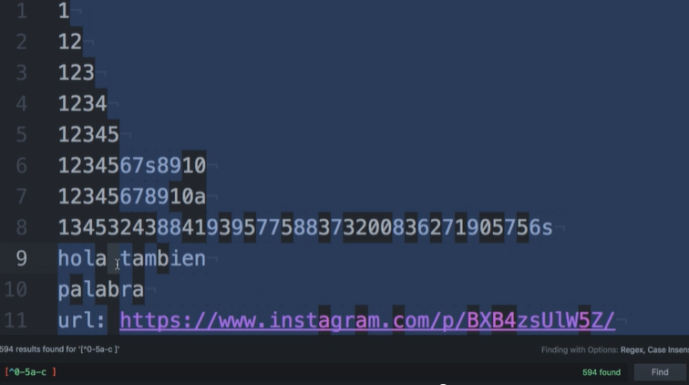
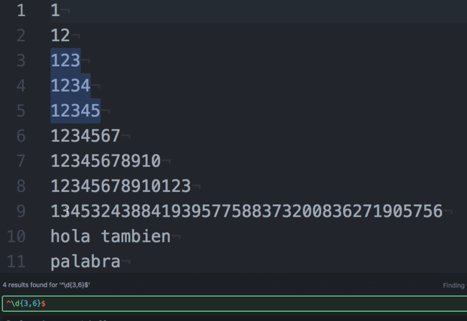

# Expresiones regulares <!-- omit in toc -->

## Tabla de Contenido<!-- omit in toc -->
- [Introducción](#introducción)
  - [Aplicaciones](#aplicaciones)
  - [Lenguaje de expresiones regulares](#lenguaje-de-expresiones-regulares)
- [El lenguaje](#el-lenguaje)
- [Caracter (.)](#caracter-)
- [Clases predefinidas y construídas](#clases-predefinidas-y-construídas)
  - [Dígitos: \d](#dígitos-d)
  - [Palabras: \w](#palabras-w)
  - [Espacios: \s](#espacios-s)
  - [Escapar caracteres \ .](#escapar-caracteres--)
- [Los delimitadores: +, *, ?](#los-delimitadores---)
- [Los contadores {1,4}](#los-contadores-14)
- [El caso de (?) como delimitador](#el-caso-de--como-delimitador)
- [Not (^), su uso y sus peligros](#not--su-uso-y-sus-peligros)
- [Otras clases preconstruidas](#otras-clases-preconstruidas)
- [Principio (^) y final de linea ($)](#principio--y-final-de-linea-)
- [RegEX Cheat Sheet](#regex-cheat-sheet)

# Introducción

Las expresiones regulares **son patrones de caracteres que te permiten ir seleccionando o descartando datos en un archivo de texto como por ejemplo csv, o en una línea o un input, según coincidan o nó con este patrón.**

Prácticamente todos los lenguajes de programación tienen librerías o módulos para manejar expresiones regulares.

Las expresiones regulares pueden ser muy complejas pero no son nada difíciles de entender.

A través de este curso, sin tecnicismos y con ejemplos puntuales, vamos a aprender a utilizarlas para que sean esa herramienta que siempre nos ayude, y sea la primera para solucionar problemas de grandes cantidades de datos en string.

## Aplicaciones

Buscar e investigar sobre Expresiones Regulares puede ser muy intimidante.

``/^(.){5}\w?[a-Z|A-Z|0-9]$/ig``

En serio pueden parecer muy, muy raras; pero la verdad es que no lo son.

* Buscar patrones entre palabras
* Encontrar solo numeros
* Encontrar solo ciertos caracteres
* Busquedas en grandes cantidades de texto
* Validaciones

## Lenguaje de expresiones regulares

Con las expresiones regulares vamos a solucionar problemas reales, problemas del día a día.

**¿Qué pasa si queremos buscar en un texto (txt, csv, log, cualquiera), todos los números de teléfonos que hay?**

Tendríamos que considerar por ejemplo, que un teléfono de México serían 10 dígitos; hay quienes los separan con guión, hay quienes los separan con puntos, hay quienes no los separan sino que tienen los 10 dígitos exactos, y este patrón puede cambiar para otros países.

Esto mismo sucede con números de tarjetas de crédito, códigos postales, dirección de correos, formatos de fechas o montos, etc.

# El lenguaje

**Archivo de texto**: Puede ser un csv o un txt

**Cadena de caracteres:** Es un carácter ASCII generalmente, seguido de otro carácter y de otro. No todos son visibles, el espacio por ejemplo. Cada carácter es un carácter.

# Caracter (.)

Encuentrame todo lo que sea un carácter

# Clases predefinidas y construídas

Las búsquedas en las expresiones regulares funcionan en múltiplos de la cantidad de caracteres que explícitamente indicamos.

## Dígitos: \d

Encuentra todos los dígitos de 0 a 9.
\d es equivalente a poner [0-9].

Si en vez de \d, usamos por ejemplo [0-2] nos encontrará solamente los dígitos de 0 a 2.

Podemos usar **\D** para encontrar justo lo contrario, todo lo que no son dígitos.

## Palabras: \w

Encuentra todo lo que puede ser parte de una palabra, tanto letras (minúsculas o mayúsculas) como números.

\w es equivalente a poner [a-zA-Z0-9_].

Si en vez de \w, usamos por ejemplo [a-zA-Z] nos encontrará solamente las letras.

Podemos usar **\W** para encontrar justo lo contrario, todos los caracteres que no son parte de palabras.

## Espacios: \s

Encuentra todos los espacios (los saltos de línea también son espacios).
Podemos usar **\S** para encontrar justo lo contrario, todo lo que no son espacios.

## Escapar caracteres \ .

\ escapa caracteres especiales

# Los delimitadores: +, *, ?

  

* **(*):** Cero o más veces
* **(?):** Cero o una sola vez
* **(+):** una o más veces.

Aplican al carácter o sentencia que preceden

* **[a-z]?:** Esto es que puede estar una sola vez o no estar una letra minuscula de la (a) a la (z).
* **\d\*:** Esto es que puede estar muchas veces o no estar un digito.
* **\d+:** Esto es que puede estar muchas veces o una sola vez un digito.

# Los contadores {1,4}

Podemos generalizar nuestras búsquedas, a ser específicos cubriendo grandes cantidades de caracteres sin tener que escribir de forma repetitiva como sería poner por ejemplo “\d\d\d\d\d\d\d\d…”

> Aplicando a un carácter que lo preceda se puede colocar entre llaves de esta forma, para indicarle que busque la cantidad deseada de caracteres.

{Cota inferiror, Cota superior}

Ejemplo:

\d{0,2}: Esto buscara 0, 1, 2 dígitos
\d{2,2}: Esto buscara 2 dígitos
\d{2}: Esto buscara 2 dígitos
\d{2,}: Esto buscara 2 o más dígitos.
\d{2,4}: Esto buscara 2, 3, 4 dígitos.

  

  

# El caso de (?) como delimitador

El ? indica al patrón que encuentre las coincidencias de manera rápida (o greedy); es decir, devolviendo el resultado más pequeño que haga match hasta donde se encuentra el delimitador, y esto lo haga tantas veces como sea posible dentro de la cadena.

``.+?[,\n]{1,1}``

  

  

# Not (^), su uso y sus peligros

Este caracter nos permite negar una clase o construir **anticlases**, vamos a llamarlo así, que es: toda la serie de caracteres que no queremos que entren en nuestro resultado de búsqueda.

Para esto definimos una clase, por ejemplo: **[ 0-9 ], y la negamos [ ^0-9 ] para buscar todos los caracteres que coincidan con cualquier caracter que no sea 0,1,2,3,4,5,6,7,8 ó 9**

  

Otra cosa es poner lo siguiente

  

# Otras clases preconstruidas

**\t** — Representa un tabulador.
**\r** — Representa el “retorno de carro” o “regreso al inicio” o sea el lugar en que la línea vuelve a iniciar.
**\n** — Representa la “nueva línea” el carácter por medio del cual una línea da inicio. Es necesario recordar que en Windows es necesaria una combinación de \r\n para comenzar una nueva línea, mientras que en Unix solamente se usa \n y en Mac_OS clásico se usa solamente \r.
**\a** — Representa una “campana” o “beep” que se produce al imprimir este carácter.
**\e** — Representa la tecla “Esc” o “Escape”
**\f** — Representa un salto de página
**\v** — Representa un tabulador vertical
**\x** — Se utiliza para representar caracteres ASCII o ANSI si conoce su código. De esta forma, si se busca el símbolo de derechos de autor y la fuente en la que se busca utiliza el conjunto de caracteres Latin-1 es posible encontrarlo utilizando “\xA9”.
**\u** — Se utiliza para representar caracteres Unicode si se conoce su código. “\u00A2” representa el símbolo de centavos. No todos los motores de Expresiones Regulares soportan Unicode. El .Net Framework lo hace, pero el EditPad Pro no, por ejemplo.
**\d** — Representa un dígito del 0 al 9.
**\w** — Representa cualquier carácter alfanumérico.
**\s** — Representa un espacio en blanco.
**\D** — Representa cualquier carácter que no sea un dígito del 0 al 9.
**\W** — Representa cualquier carácter no alfanumérico.
**\S** — Representa cualquier carácter que no sea un espacio en blanco.
**\A** — Representa el inicio de la cadena. No un carácter sino una posición.
**\Z** — Representa el final de la cadena. No un carácter sino una posición.
**\b** — Marca la posición de una palabra limitada por espacios en blanco, puntuación o el inicio/final de una cadena.
**\B** — Marca la posición entre dos caracteres alfanuméricos o dos no-alfanuméricos.

# Principio (^) y final de linea ($)

Estos dos caracteres indican en qué posición de la línea debe hacerse la búsqueda:

* el ^ se utiliza para indicar el principio de línea
* el $ se utiliza para indicar final de línea

``^ ------------- $``

  

# RegEX Cheat Sheet

  

  

https://www.debuggex.com/