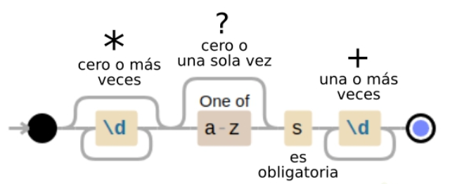

# Expresiones regulares <!-- omit in toc -->

## Tabla de Contenido<!-- omit in toc -->
- [Tips](#tips)

# Tips

El código organizado se refiere a cómo tenemos distribuido nuestros archivos en la raíz (root) del proyecto. A mayor organización, mayor entendimiento del código.

  

