# Programación Orientada a Objetos <!-- omit in toc -->

## Tabla de Contenido<!-- omit in toc -->
- [Introducción](#introducción)
  - [Qué resuelve la programación orientada a objetos](#qué-resuelve-la-programación-orientada-a-objetos)
  - [Paradigama Orientado a Objetos](#paradigama-orientado-a-objetos)
  - [Lenguajes orientados a objetos](#lenguajes-orientados-a-objetos)
    - [Java](#java)
    - [PHP](#php)
    - [Python](#python)
    - [Javascript](#javascript)
  - [Entorno de desarrollo](#entorno-de-desarrollo)
  - [Diagramas de modelado](#diagramas-de-modelado)
  - [UML](#uml)
    - [Las clases](#las-clases)
    - [Asociación](#asociación)
    - [Herencia](#herencia)
    - [Agregación](#agregación)
    - [Composición](#composición)
- [Orientación a objetos](#orientación-a-objetos)
  - [Objetos](#objetos)
    - [Identificar los objetos](#identificar-los-objetos)
  - [Abstracción y clases](#abstracción-y-clases)
  - [Modularidad](#modularidad)
  - [Analizando Uber en Objetos](#analizando-uber-en-objetos)
- [Conceptos POO](#conceptos-poo)
- [POO: Análisis](#poo-análisis)
  - [UML](#uml-1)
    - [Modelando objetos de Uber](#modelando-objetos-de-uber)
  - [¿Qué es la herencia?](#qué-es-la-herencia)
    - [Herencia en modelo Uber](#herencia-en-modelo-uber)
  - [Objetos](#objetos-1)
  - [Aplicando herencia con los lenguejes](#aplicando-herencia-con-los-lenguejes)
  - [Encapsulamiento](#encapsulamiento)

# Introducción

* Analizar
  * Observación
  * Entendimiento
  * Lectura
* Plasmar
  * Diagramas
* Programar
  * Lenguajes de programación

## Qué resuelve la programación orientada a objetos

La programación Orientada a Objetos **nace de los problemas creados por la programación estructurada** y nos ayuda a resolver cierto problemas como:

* **Código muy largo**: A medida que un sistema va creciendo y se hace más robusta el código generado se vuelve muy extenso haciéndose difícil de leer, depurar, mantener.
* **Si algo falla, todo se rompe:** Ya que con la programación estructurada el código se ejecuta secuencialmente al momento de que una de esas líneas fallara todo lo demás deja de funcionar.

> Difícil de mantener.

<div align="center">
  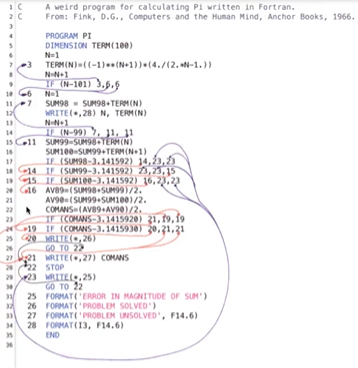
</div>

Ejemplos de código espaguetti

<div align="center">
  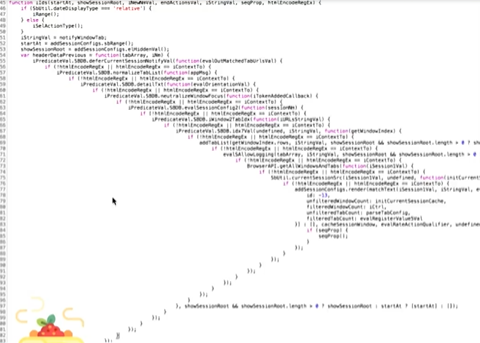
</div>

## Paradigama Orientado a Objetos

La Programación Orientada a Objetos viene de una filosofía o forma de pensar que es la Orientación a Objetos y esto **surge a partir de los problemas que necesitamos plasmar en código**.

> Es analizar un problema en forma de objetos para después llevarlo a código, eso es la Orientación a Objetos.

**Un paradigma es una teoría que suministra la base y modelo para resolver problemas.** La paradigma de Programación Orientada a Objetos se compone de 4 elementos:

* Clases
* Propiedades
* Métodos
* Objetos

Y 4 Pilares:

* Encapsulamiento
* Abstracción
* Herencia
* Polimorfismo

> **Paradigma** Teoría que suministra la base y modelo para resolver problemas

## Lenguajes orientados a objetos

<div align="center">
  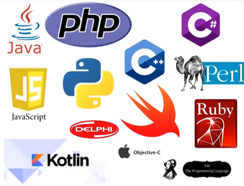
</div>

### Java
* Orientado a objetos naturalmente
* Android
* Server side

### PHP
* Lenguaje interpretado
* Pensado para la web

### Python
* Diseñado para ser fácil de usar
* Múltiples usos: Web, Server Side, Anállisis de Datos, Machine Leaning

### Javascript
* Lenguaje interpretado
* Orientado a objetos pero basado en prototipos
* Pensado para la web

## Entorno de desarrollo

* Visual Studio Code

https://code.visualstudio.com/

## Diagramas de modelado

* **OMT**: Object Modeling Techniques. Es una metodología para el análisis orientado a objetos.
* **UML**: Unified Modeling Language o Lenguaje de Modelado Unificado. Tomó las bases y técnicas de OMT unificándolas. Tenemos más opciones de diagramas como lo son **Clases, Casos de Uso, Objetos, Actividades, Iteración, Estados, Implementación.**

## UML

Como ya viste UML significa Unified Modeling Language el cual es un lenguaje estándar de modelado de sistemas orientados a objetos.

### Las clases

<div align="center">
  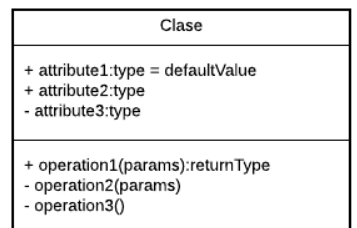
</div>

En la parte superior se colocan los atributos o propiedades, y debajo las operaciones de la clase. Notarás que el primer caracter con el que empiezan es un símbolo. Este denotará la visibilidad del atributo o método, esto es un término que tiene que ver con Encapsulamiento y veremos más adelante a detalle.

Estos son los niveles de visibilidad que puedes tener:

```
- private
+ public
# protected
~ default
```

Una forma de representar las relaciones que tendrá un elemento con otro es a través de las flechas en UML, y aquí tenemos varios tipos, estos son los más comunes:

### Asociación

<div align="center">
  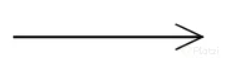
</div>

Como su nombre lo dice, notarás que cada vez que esté referenciada este tipo de flecha significará que ese elemento contiene al otro en su definición. La flecha apuntará hacia la dependencia.

<div align="center">
  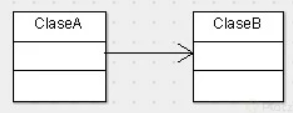
</div>

Con esto vemos que la ClaseA está asociada y depende de la ClaseB.

### Herencia

<div align="center">
  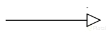
</div>

Siempre que veamos este tipo de flecha se estará expresando la herencia.
La dirección de la flecha irá desde el hijo hasta el padre.

<div align="center">
  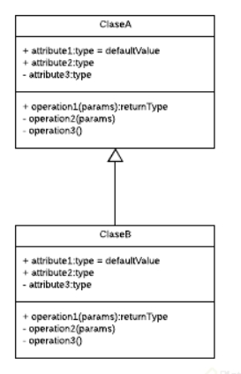
</div>

Con esto vemos que la ClaseB hereda de la ClaseA

### Agregación

<div align="center">
  
</div>

Este se parece a la asociación en que un elemento dependerá del otro, pero en este caso será: Un elemento dependerá de muchos otros. Aquí tomamos como referencia la multiplicidad del elemento. Lo que comúnmente conocerías en Bases de Datos como Relaciones uno a muchos.

<div align="center">
  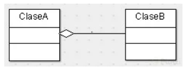
</div>

Con esto decimos que la ClaseA contiene varios elementos de la ClaseB. Estos últimos son comúnmente representados con listas o colecciones de datos.

### Composición

<div align="center">
  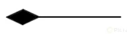
</div>

Este es similar al anterior solo que su relación es totalmente compenetrada de tal modo que conceptualmente una de estas clases no podría vivir si no existiera la otra.

<div align="center">
  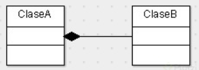
</div>

# Orientación a objetos

## Objetos

Los Objetos son aquellos que tienen propiedades y comportamientos, también serán **sustantivos**.

* Pueden ser Físicos o Conceptuales

**Las Propiedades también pueden llamarse atributos y estos también serán sustantivos.** Algunos atributos o propiedades son nombre, tamaño, forma, estado, etc. Son todas las características del objeto.

**Los Comportamientos serán todas las operaciones que el objeto puede hacer**, suelen ser verbos o sustantivos y verbo. Algunos ejemplos pueden ser que el usuario pueda hacer login y logout.

### Identificar los objetos

* Tienen propiedades y comportamientos
* Físicos o Conceptuales
* Sustantivos

<div align="center">
  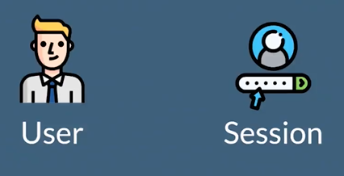
</div>

<div align="center">
  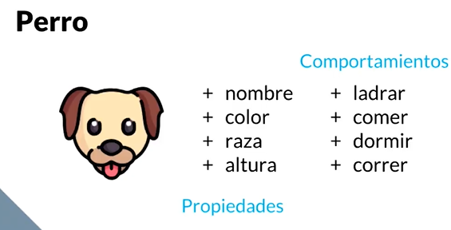
</div>

<div align="center">
  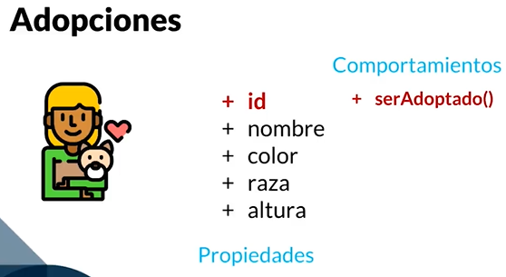
</div>

## Abstracción y clases

> Una Clase es el modelo por el cual nuestros objetos se van a construir y nos van a permitir generar más objetos.

**Analizamos Objetos para crear Clases.** Las Clases son los **modelos** sobres los cuales construiremos nuestros objetos.

<div align="center">
  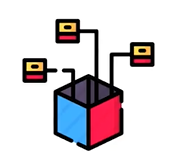
</div>

> Abstracción es cuando separamos los datos de un objeto para generar un molde.

<div align="center">
  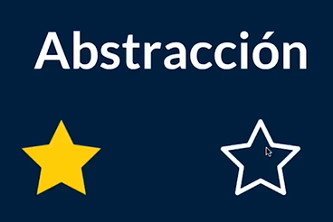
</div>

## Modularidad

La modularidad va muy relacionada con las clases y es un principio de la Programación Orientado a Objetos y va de la mano con el Diseño Modular que **significa dividir un sistema en partes pequeñas y estas serán nuestros módulos pudiendo funcionar de manera independiente.**

<div align="center">
  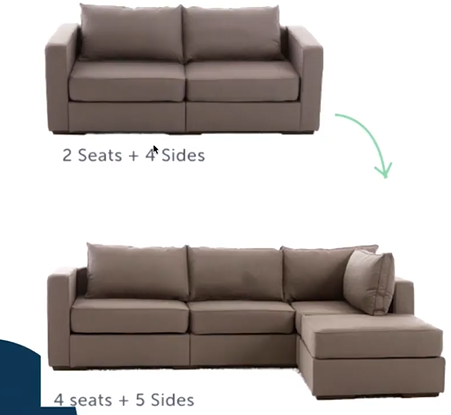
</div>

La modularidad de nuestro código nos va a permitir

<div align="center">
  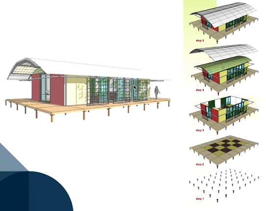
</div>

**Beneficios de modularizar**

* Reutilizar
* Evitar colapsos
* Hacer nuestro código más mantenible
* Legibilidad
* Resolución rápida de problemas

> Una buena práctica es separando las clases en archivos diferentes.

<div align="center">
  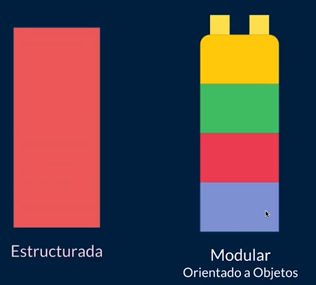
</div>

Tener una clase promueve
* Modularidad
* Divide el programa en diferentes partes o módulos / clases
* Separar las clases en archivos

## Analizando Uber en Objetos

<div align="center">
  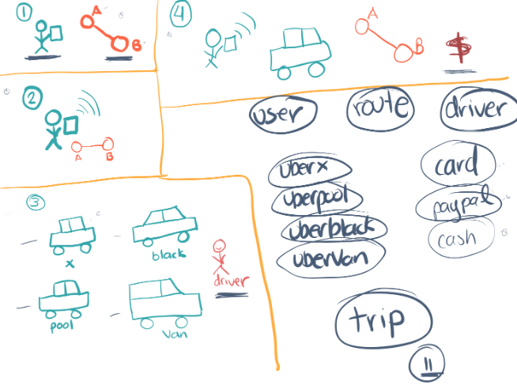
</div>

# Conceptos POO

<div align="center">
  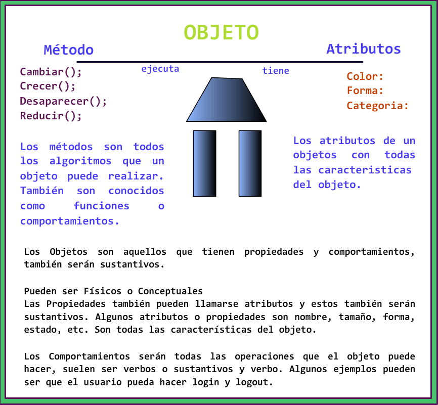
</div>

<div align="center">
  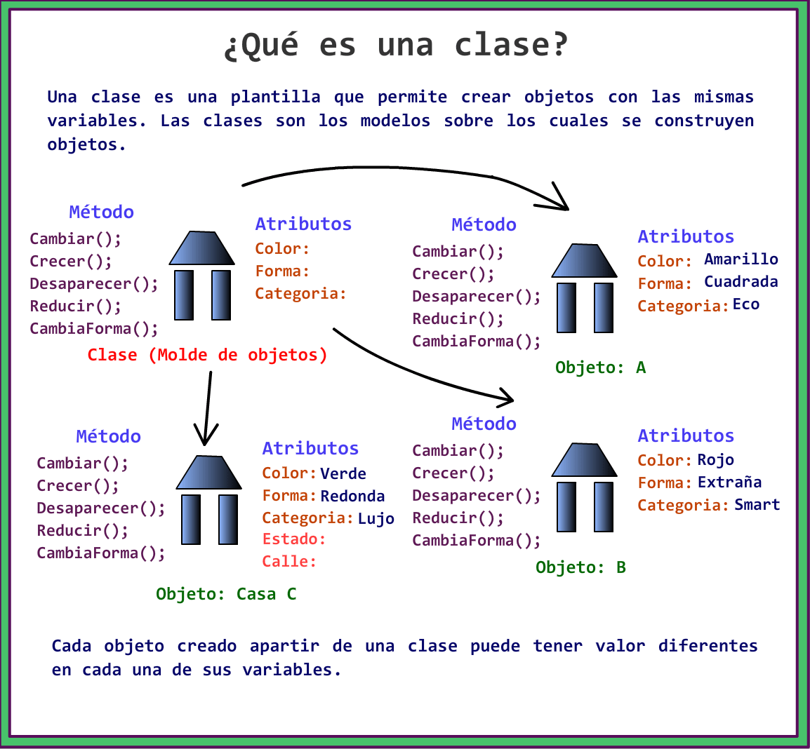
</div>

<div align="center">
  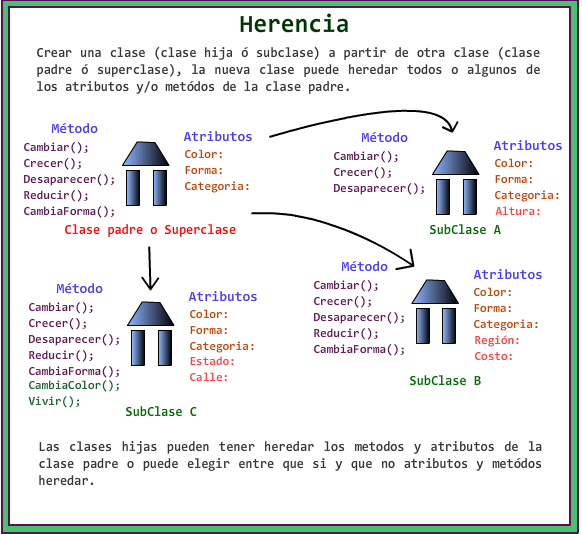
</div>

<div align="center">
  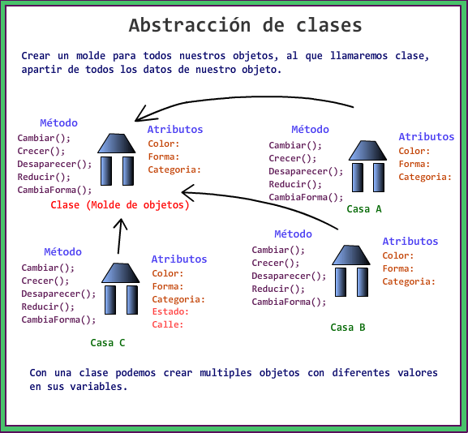
</div>

# POO: Análisis

## UML

<div align="center">
  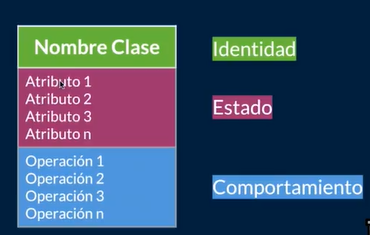
</div>

<div align="center">
  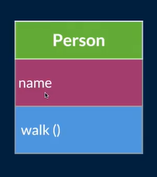
</div>

---

Declaración de una clase en varios lenguajes

<div align="center">
  
</div>

Javascript usa prototipos

<div align="center">
  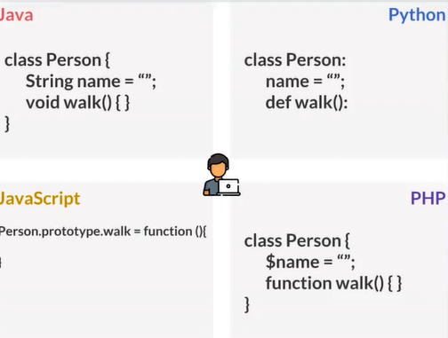
</div>

### Modelando objetos de Uber

<div align="center">
  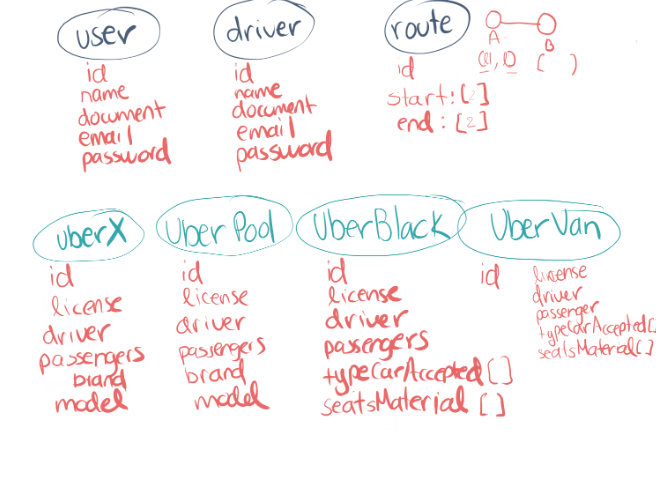
</div>

<div align="center">
  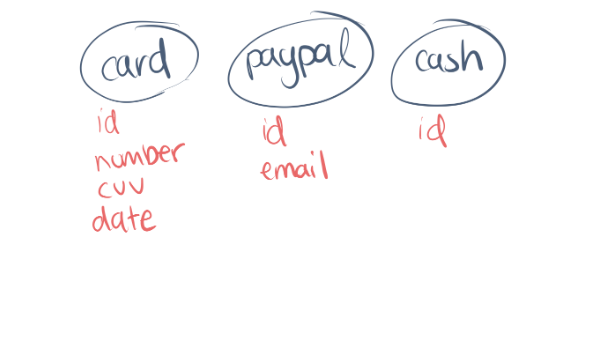
</div>

## ¿Qué es la herencia?

**Don’t repeat yourself** es una filosofía que promueve la reducción de duplicación en programación, esto nos va a inculcar que no tengamos líneas de código duplicadas.

> Toda pieza de información nunca debería ser duplicada debido a que incrementa la dificultad en los cambios y evolución

**La herencia nos permite crear nuevas clases a partir de otras**, se basa en modelos y conceptos de la vida real. También tenemos una jerarquía de padre e hijo.

<div align="center">
  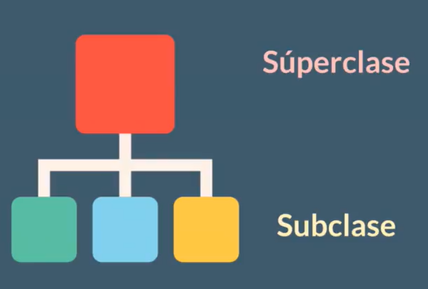
</div>

### Herencia en modelo Uber

<div align="center">
  
</div>

<div align="center">
  
</div>

<div align="center">
  
</div>

<div align="center">
  
</div>

## Objetos

**Los objetos nos ayudan a crear instancia de una clase**, el objeto es el resultado de lo que modelamos, de los parámetros declarados y usaremos los objetos para que nuestras clases cobren vida.

<div align="center">
  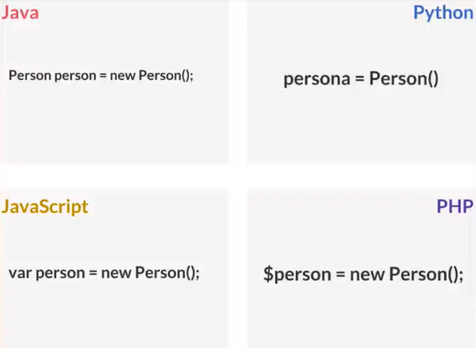
</div>

Los métodos constructores dan un estado inicial al objeto y podemos añadirle algunos datos al objeto mediante estos métodos. Los atributos o elementos que pasemos a través del constructor serán los datos mínimos que necesita el objeto para que pueda vivir.

<div align="center">
  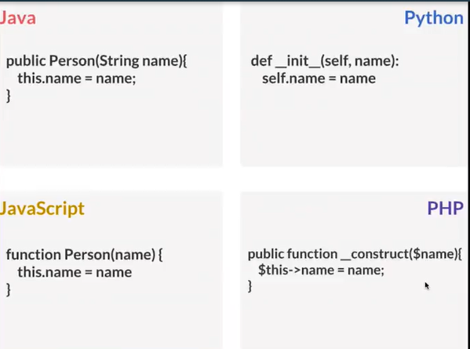
</div>

<div align="center">
  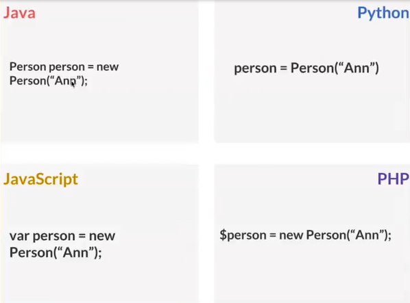
</div>

## Aplicando herencia con los lenguejes

<div align="center">
  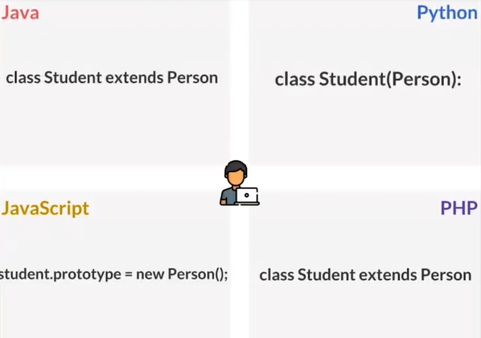
</div>

## Encapsulamiento

El Encapsulamiento es hacer que un dato sea inviolable, inalterable cuando se le asigne un modificador de acceso.

<div align="center">
  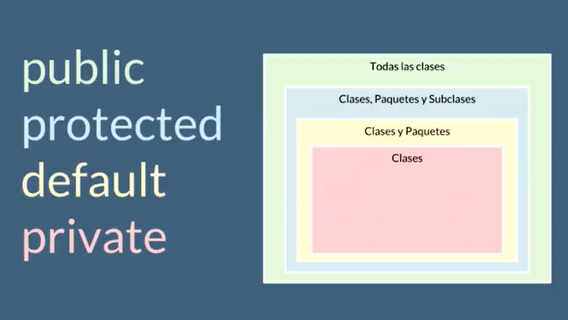
</div>

Para python

_ Protegido
__Privado

<div align="center">
  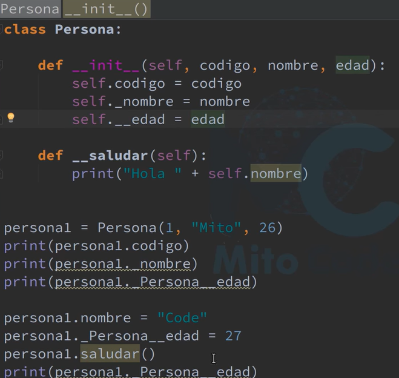
</div>

Setters y getters

<div align="center">
  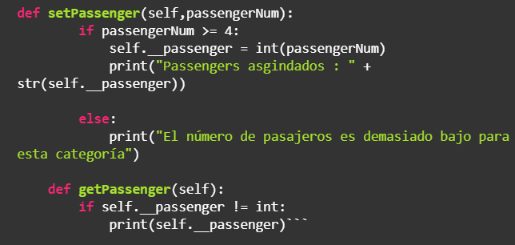
</div>