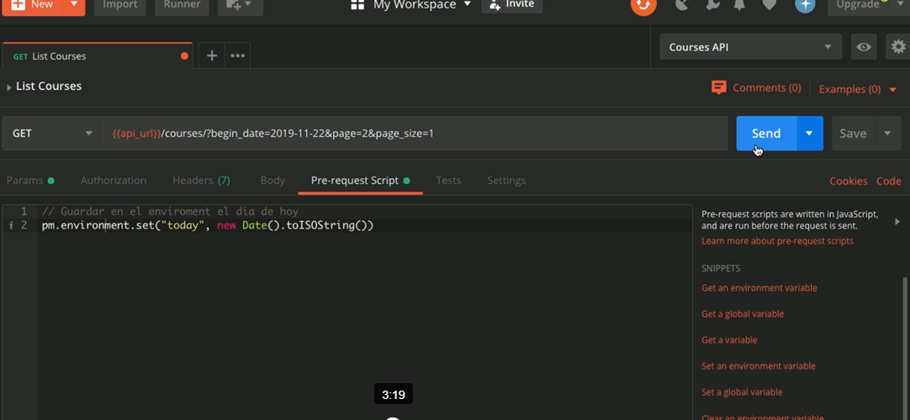
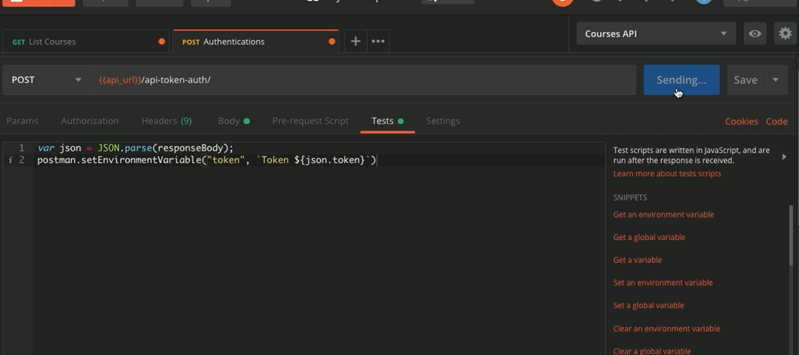
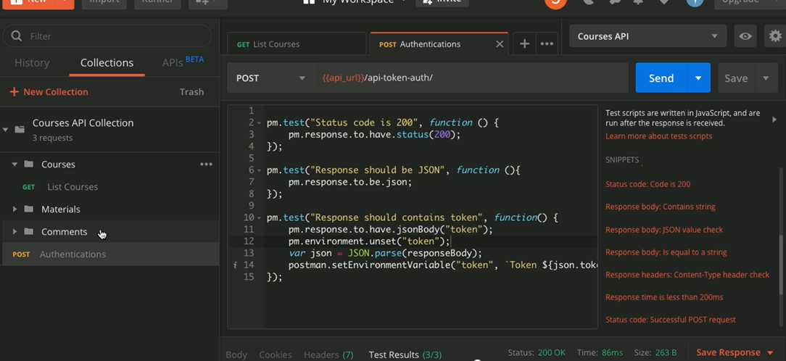

# Postman <!-- omit in toc -->

## Tabla de Contenido<!-- omit in toc -->
- [Introducción](#introducción)
- [Estructuras de las URLs](#estructuras-de-las-urls)
  - [Recurso](#recurso)
  - [Colecciones](#colecciones)
  - [URL](#url)
  - [CRUD](#crud)
  - [Endpoints](#endpoints)
  - [Recursos anidados](#recursos-anidados)
- [Postman](#postman)
  - [Funcionalidades](#funcionalidades)
  - [Automatización con JS](#automatización-con-js)
- [Alternativas a POSTMAN](#alternativas-a-postman)

# Introducción

> Un **protocolo** especifica reglas en la comunicacion entre dos entes, en este caso entre dos computudoras.

**HTTP (Hyper Text Transfer Protocol)** fue creado especificamente para la web.

Una de las cosas que especifica el protocolo HTTP son los **verbos**:

* **GET**: solicitar datos o algun recurso.
* **HEAD**: traer headers (como una peticion GET pero sin contenidos). Es util cuando vamos a utilizar APIs, para comprobar si lo que vamos a enviar esta correcto y puede ser procesado.
* **POST**: enviar datos a un recurso para la creación.
* **PUT**: reemplazar por completo un recurso.
* **PATCH**: reemplazar parcialmente un recurso.
* **DELETE**: eliminar un recurso.

Otra de las cosas que especifica el protocolo HTTP son los codigo de estado (status codes). Sirven para describir el estado de la peticion hecha al servidor.

Códigos de estado

* **1xx**: Indican que la peticion fue recibida y el servidor sigue trabajando en el proceso, es decir, no fue exitosa ni fue errónea, sino que esta siendo procesada aun.
* **2xx**: Indican que la peticion fue recibida y procesada correctamente.
* **3xx**: Indican que hay que tomar acciones adicionales para completar la solicitud. Por lo general estos codigos indican redireccion. 
  * Generalmente en los APIs no se usan redirecciones porque no contienen estados, es decir, toda la informacion esta contenida en una solicitud, no se guarda un estado en el servidor con una sesion por ejemplo.
* **4xx**: Indican errores del lado del cliente, por ejemplo: se hizo mal la solicitud, faltan datos, headers o cualquier otro error que pueda ocurrir.
* **5xx**: Indican errores del servidor. Suelen aparecer cuando existe un fallo en la ejecución en el servidor.

Los codigos mas comunes a la hora de interactuar con un API son:

* **200**: Todo esta OK.
* **201**: Todo OK cuando se hizo una solicitud POST, el recurso se creo y se guardo correctamente.
* **204**: Indica que la solicitud se completo correctamente pero no devolvio informacion. Es muy comun cuando se hacen peticiones con el verbo DELETE.
* **400**: Bad Request, algo esta mal en la peticion. Se nos olvido enviar un dato o algo relacionado. Por lo general la respuesta nos especifica cuales fueron los errores a la hora de hacer la peticion.
* **401**: Unauthorized, es decir, no estamos autorizados (autenticados) a realizar la peticion.
* **403**: Forbidden, yo no tengo acceso a ese recurso aunque este autenticado.
* **404**: Not Found, no existe el recurso que se esta intentando acceder.
* **500**: Interna Server Error, es un error que retorna el servidor cuando la solicitud no pudo ser procesada. Por lo general, si no tenemos acceso al backend, no tenemos control sobre los errores 500 que retorna un API.

# Estructuras de las URLs

En un API es importante tener bien estructuradas las rutas por las cuales se usarán cada uno de los endpoints que contiene. 

## Recurso

Es la instancia o la representación de un objeto o la representación de algo, tiene datos y operaciones asociadas a él. Por ejemplo: course, material y video son recursos que tenemos disponibles en el API con la que trabajaremos y podemos realizar operaciones sobre ellos: crear, actualizar y eliminar.

## Colecciones

Es un conjunto de recursos, por ejemplo: courses es una colección de course.

## URL

(Uniform Resource Locator) es la ruta en la cual puede ser ubicado un recurso y ejecutar las operaciones sobre él.

## CRUD

Siglas que hacen referencia a las operaciones básicas que se pueden ejecutar sobre un recurso:

* **C**: Create (crear)
* **R**: Read (leer)
* **U**: Update (actualizar)
* **D**: Delete (eliminar)

## Endpoints

Es el punto final de la comunicación con un ente, en este caso, un endpoint está asociado a una URL y a las operaciones que podemos ejecutar. Este término es muy utilizado en las APIs.

> Los endpoint definen operaciones que se quieren ejecutar sobre un recurso. Por ejemplo: si queremos un conjunto de operaciones CRUD sobre Cursos podríamos crear los siguientes endpoints:

* **/get-all-courses:** para obtener una colección de Cursos.
* **/add-new-course:** para crear un nuevo recurso de Cursos.
* **/delete-all-courses:** para eliminar todos los Cursos.

Y así sucesivamente. Pero, esto implicaría un problema. El API puede llenarse de endpoints que ejecutan una sola operación, esto no es escalable, significa que si por ejemplo el recurso Cursos pasa a llamarse Clases habría que actualizar absolutamente todas las URLs y asegurarse de ello puede convertirse en un dolor de cabeza.

Entonces, ¿cuál es la buena práctica en este caso?

El protocolo HTTP especifica una serie de verbos que indican acciones. **Lo ideal es que la operación que se ejecute sobre un recurso se obtenga a través del verbo HTTP de la petición y no que esté definido en el endpoint.** Por ejemplo:

* **/courses**: Dependiendo del verbo HTTP se ejecutará una operación en particular. Quedaría así:
  * **GET /courses**: trae la colección de Cursos.
  * **POST /courses**: crea un nuevo recurso de Cursos.
  * **DELETE /courses**: elimina todos los cursos.

De esta manera queda mucho más organizado un API. Pero, qué pasa si queremos traer no una colección de cursos como en los casos anteriores, sino un recurso en específico.

Por lo general cada recurso tiene un identificador único, un ID, es con esto que llamaremos a un endpoint para que nos retorne la información del recurso. Por ejemplo:

* **GET /courses/2/**: vemos que acá se le está pasando algo que en los endpoints anteriores no veíamos, es el número 2, ese es el identificador único, de esta manera el API sabe que tiene que buscar el curso con ID 2 y retornarlo.

Así sucesivamente con cada uno de los verbos, por ejemplo: casi nunca se hace una eliminación en masa en un API, como el ejemplo que tenemos más arriba donde se eliminan todos los cursos. Lo ideal es que se elimine un recurso individualmente y no una colección, igualmente pasa con la actualización.

## Recursos anidados

Hay veces en las que un recurso depende de otro recurso, por ejemplo, comentarios depende de materiales; usualmente en los APIs las anidaciones se hacen hasta dos niveles, es decir:

* **materials/1/comments**: estos son dos niveles
* **materials/1/comments/2/answers/:** son tres niveles, ahí lo ideal sería entonces separar el endpoint de comentarios y ejecutar comments/2/answers/

# Postman

Instala desde el sitio oficial

https://www.postman.com/downloads/

**Otras API públicas**
* Rick & Morty API
* Repository with Public APIs

## Funcionalidades

* Requests
  * Peticiones para apis
* Enviroments
  * Guardar variables
* Collections
  * Conjunto de requests
  * Creación de carpetas

## Automatización con JS

https://learning.postman.com/docs/postman/scripts/intro-to-scripts/

  

Pruebas automáticas

  

Validar status 200, que sean json la respuesta y que esté el token

  

Más ejemplos de pruebas automáticas

https://learning.postman.com/docs/postman/scripts/test-examples/

# Alternativas a POSTMAN

https://insomnia.rest
https://swagger.io