# Testing <!-- omit in toc -->

## Tabla de Contenido<!-- omit in toc -->
- [Introducción](#introducción)
  - [Aspectos por las que no se hacen pruebas](#aspectos-por-las-que-no-se-hacen-pruebas)
  - [Razones para hacer pruebas](#razones-para-hacer-pruebas)
  - [Proceso de pruebas del software y los estándares internacionales](#proceso-de-pruebas-del-software-y-los-estándares-internacionales)
  - [Ciclo de vida del software](#ciclo-de-vida-del-software)
  - [Proceso de pruebas del software: Calidad y Defectos](#proceso-de-pruebas-del-software-calidad-y-defectos)
  - [Principios del testing moderno](#principios-del-testing-moderno)
  - [Especialidades del testing](#especialidades-del-testing)
- [Testing](#testing)
  - [Presupuesto, Recursos, Tiempo y Actividades Clave](#presupuesto-recursos-tiempo-y-actividades-clave)
  - [Estrategía de pruebas](#estrategía-de-pruebas)
  - [Testing en desarrollo de software](#testing-en-desarrollo-de-software)
  - [Testing ágil](#testing-ágil)

# Introducción

¿Cuántas veces hemos sido usuarios de alguna app móvil y falla? ¿Cuántas veces hemos sido parte del desarrollo de un producto y el retrabajo se desborda por todas las fallas o defectos que contiene?.

**Las pruebas son una manera de explorar, experimentar, entenderlo, entre menos entiendas el productos que estas desarrollando más errores tendrá.** Las puedes hacer por cuestión de costo, prestigio o cuestiones legales.

**Tres aspectos a considerar:**

* Tenemos un problema o el resultado no es el esperado
* Nuestros costos se esta volviendo muy alto.
* Implicaciones legales o de estándares tecnológicos.

  

  

  

## Aspectos por las que no se hacen pruebas

* No son parte de la solución
* No siempre se entrega la evidencia al cliente
* Si una estructura o especificaciones son dificiles de mantener
* No hay tiempo, o nadie del equipo hace pruebas

## Razones para hacer pruebas

* Tenemos un problema o el resultado no es el esperado
* Costo alto o fuera de presupuesto
* Implicaciones legales o estándares tecnológicos

## Proceso de pruebas del software y los estándares internacionales

Para el proceso de pruebas es necesario contar con al menos 3 elementos que lograrán cumplir nuestros objetivos:

* **Metodología:** Es donde estableces el criterio o estrategia de cómo se llevaran acabo las pruebas.
* **Recursos:** Si quieres realizar pruebas y no estás preparado, con el tiempo esas carencias se pueden visualizar como defectos.
* **Herramientas:** Nos ayudarán a optimizar nuestro trabajo.

  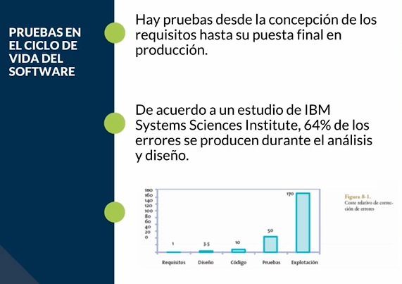

Es importante definir siempre

* **Definir la calidad del producto:** Si estas creando el software correctamente.
* **Calidad del proceso:** Si alguien de tu equipo no te especifica lo que quieres no vas a poder crear un producto que cubra sus necesidades.

Para garantizar la calidad del software

  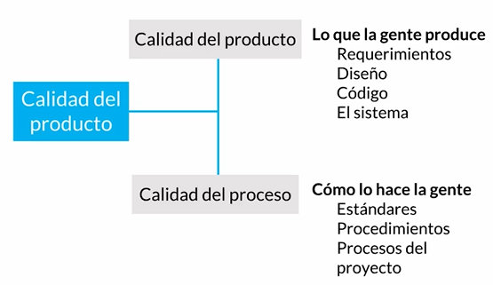

**Certificaciones, estándares y metodologías para**

* Individios
* Procesos
* Empresas
* Servicios/Productos = Software/Hardware
* Para tipo de industrias

**Estándares**

  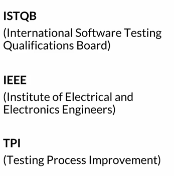

## Ciclo de vida del software

A lo largo del ciclo de vida del software se realizan distintas pruebas para **garantizar que este cumpla con los requerimientos** para los que fue diseñado y de la misma forma se encuentren **procesos de mejora y optimización** a medida que se desarrolla el software.

* Es necesario hacer **pruebas en todas las fases del desarrollo de software** ya que un error encontrado en una etapa tardía puede generar costos muy elevados.

* Errores detectados lo antes posible reducen los costos y son mucho más fáciles de corregir.

* El ciclo de vida permite que los errores se detecten lo antes posible y por lo tanto, permite a los desarrolladores concentrarse en la calidad del software, en los plazos de implementación y en los costos asociados.

El ciclo de vida básico de un software consta de los siguientes procedimientos:

  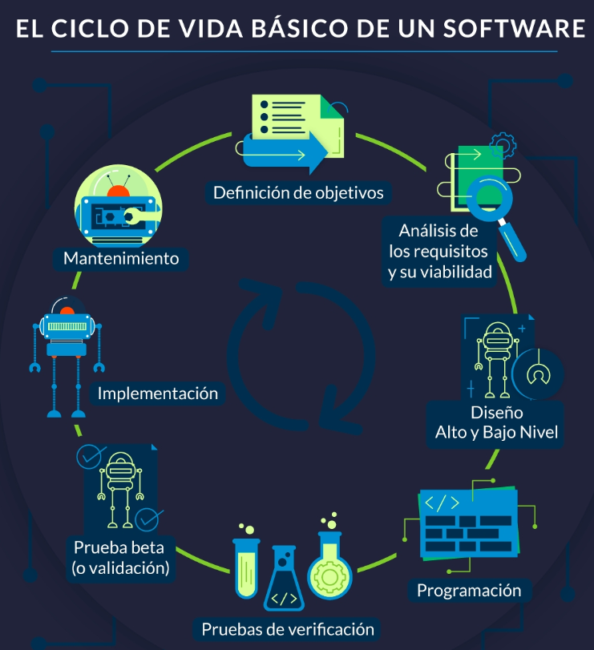

1. **Definición de objetivos**
En esta fase se define el **alcance general del software** y su papel dentro de una estrategia global o dentro del ecosistema que va a funcionar.

2. **Análisis de los requisitos y su viabilidad**
Se trata de recopilar la mayor cantidad de información posible para **evaluar la viabilidad del producto, encontrar posibles restricciones y analizar todos los requisitos del cliente.**

3. **Diseño**
**Alto nivel:** Se trata de realizar un diseño básico que **valide la arquitectura de la aplicación.**
**Bajo nivel:** Es una **definición detallada de la estructura de la aplicación basada en el diseño general.**

4. **Programación**
Es la **implementación de un lenguaje de programación** para crear las funciones definidas durante la etapa de diseño.

5. **Pruebas de verificación**
Aunque en todas las fases anteriores se hacen pruebas en esta fase se cubren: **pruebas de componentes, integrales y de sistema.**

6. **Prueba beta (o validación)**
Se hace para garantizar que el software cumple con las especificaciones originales o también se hacen las pruebas de aceptación.

7. **Implementación**
Se realiza una prueba del sistema implementado para **encontrar posibles fallas en la Implementación.**

8. **Mantenimiento**
Se hace para todos los procedimientos correctivos (mantenimiento correctivo) y a las actualizaciones secundarias del software (mantenimiento continuo), junto con la actualización de las pruebas.

Si hacemos las pruebas durante cada fase del ciclo de vida del software tendremos al final del ciclo un producto validado y robusto de acuerdo a las necesidades del cliente

## Proceso de pruebas del software: Calidad y Defectos

  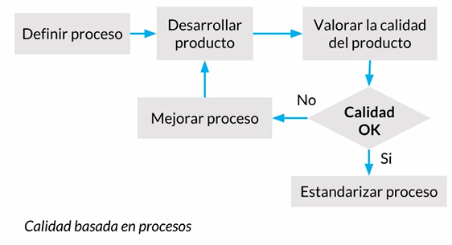

Todo lo anterior nos hace preguntarnos: **¿Qué es la calidad?**

La calidad es una percepción entre **lo deseado, analizado y lo que vamos a entregar**. **La calidad la define el cliente**, si esa persona esta satisfecha con lo entregado hasta ahí llega la calidad.

* **Verificación:** Es ir en cada etapa revisando que se cumpla lo propuesto por el cliente.
* **Validación:** Antes de entregar al cliente, validamos que efectivamente el conjunto de requerimientos esta siendo cumplido con lo entregado.

Siempre puede ocurrir

* **Anomalía:** Cualquier insatisfactoria condición. No es reproducible
* **Defecto:** No desempeña funciones
* **Fallo:** Incapacidad dentro de márgenes
* **Error:** Acción humana incorrecta

Ya entendimos que es necesario definir un proceso que asegure un buen desarrollo del producto, que los estándares o herramientas implementadas deben ayudar a cubrir las métricas definidas para entonces evaluar si el producto tiene el porcentaje o grado de calidad esperado.

  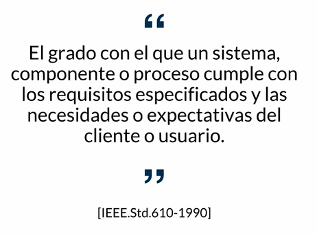

  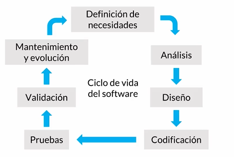

  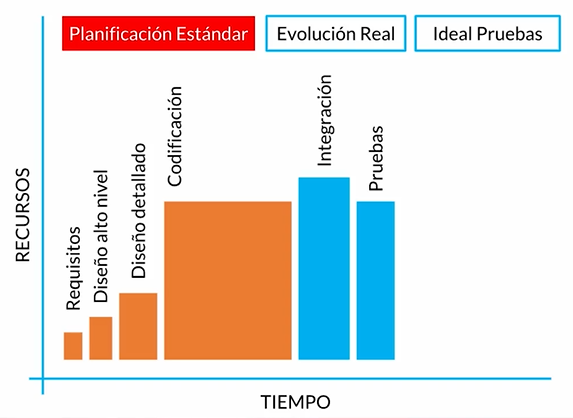

  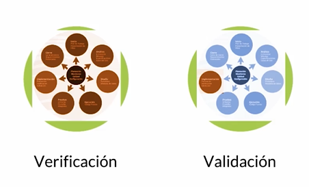

Ejemplo. Tablero automotriz

  

* Anomalia. Prende la luz de no hay gasolina de manera intermitente
* Defecto. El tablero falla de inicio
* Error. El usuario confunde lo que sucede en el tablero
* Fallo. El auto va en carretera, pero se mete en el agua. El auto funciona, pero no en esas condiciones

  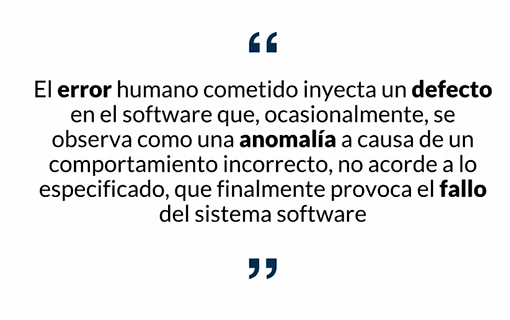

## Principios del testing moderno

Comentarios

> * Lo importante es el negocio
> * Hay que tener una distribución que permita manejar el riesgo del software
> * El cliente define la calidad
> * Se debe de contar con una extensa cantidad de datos de prueba

Los 7 principios

* **Nuestra prioridad es mejorar el negocio:** El producto que se va a entregar al cliente permitirá hacer funcionar el negocio. Si en algún momento no quieres hacerlo, estás poniendo en riesgo ese negocio porque si el producto no se vende o no es aceptado la empresa puede cerrar o puedes perder el trabajo.
* **Nosotros aceleramos el equipo y usamos modelos como Lean Thinking y Teoría de las Restricciones para ayudar a identificar, priorizar y mitigar cuellos de botella en el sistema:** Cuando queremos hacer algo, lo queremos hacer perfecto y eso puede ser demasiado. Deberías construir en base a procesos cortos para poder encontrar los defectos de una manera más rápida.
* **Nosotros somos la fuerza para la mejora continua, ayudando al equipo a adaptarse y optimizar para tener éxito, en lugar de proporcionar una red de seguridad para detectar fallas:** El cliente puede entender que el producto se va a liberar por fases, es importante que nosotros enfoquemos nuestras pruebas en cada una de esas fases. No tiene que ser todo al inicio y al final, debe haber una distribución que nos permita manejar el riesgo del software
* **Nos preocupamos profundamente acerca de la cultura de calidad en nuestro equipo, y asesoramos, lideramos y nutrimos el equipo para llevarlos a una cultura de calidad más madura:** Al inicio los testers eran personas desarrollando software y un día con tantos defectos y trabajo, separaron los roles para que así hubiese una persona dedicada a realizar las pruebas. El tester puede hacer recomendaciones de herramientas, mejorar el proceso o volverse un coach.
* **Nosotros creemos que el cliente es el único capaz de juzgar y evaluar la calidad de nuestro producto:** Si el cliente esta satisfecho con lo entregado y cumple las expectativas entonces has alcanzado la calidad deseada.
* **Nosotros usamos datos de manera extensa y profunda para entender los casos de uso del cliente y entonces cerrar huecos entre hipótesis del producto e impacto del negocio.**
* **Expandimos las habilidades de testing y el conocimiento en todo el equipo; entendemos que esto reduce o elimina la necesidad de una especialista dedicado al testing.**

El tester debe dominar varias areas necesita entender y tener toda la visión del producto y negocio. Saber sobre herramientas que optimicen el trabajo.

  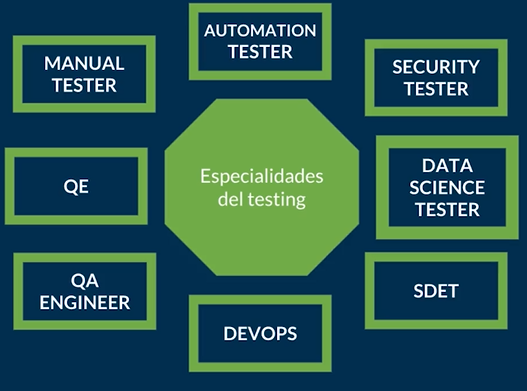

> **Lean Thinking**. Es una metodología que ayuda a estructurar procesos para maximizar la generación de valor con las actividades que se hacen, mientras se minimiza el desperdicio ("muda" es el término en japonés). Desperdicio se entiende principalmente como aquellas actividades que no agregan valor al producto final.

## Especialidades del testing

Hay muchas especialidades a la hora de hablar de testing y cada una de ellas tiene diferentes funciones y perspectivas que se incluyen en diferentes fases del proceso

* **Manual tester:** Nos ayuda a definir los casos de pruebas, establecer estrategias. También ejecuta, pero lleva lo necesario para que todos sepan qué hacer.
  * Pensamiento lateral, piensa fuera de la caja con una nueva perspectiva, agrega nuevos casos de usos y entiende muy bien al usuario.
* **Automation tester:** Se encarga de agilizar, acelerar el trabajo y actividades que nos quitan la oportunidad de encontrar más casos de usos.
  * Conoce de programación, no solo de forma básica, debe conocer como crear diseños de frameworks y soluciones. El código crece y las pruebas también, darle ese mantenimiento a las pruebas es un problema común.
* **Security tester:** Encargado para el área de seguridad. Debe ser alguien que aporte valor desde la perspectiva de la seguridad.
  * Protocolos, estándares, legalizaciones dependiendo de cada país y marca. Esta enfocado en prever ataques, virus, problemas de seguridad, acceso no autorizado. Profundizar en las técnicas y prácticas de seguridad.
* **Data science tester:** Con la manera en que crecen los datos en un proyecto, se necesita a alguien que los analice, agrupe y limpie estos datos.
  * Análisis y Limpieza de datos, omite tener un set de pruebas amplio donde la variedad va a permitir detectar defectos inesperados. Esto puede ser clave para que los resultados no sean falsos positivos
* **SDET:** Es la combinacion de un desarrollador que ya sabe hacer pruebas. Con la diferencia de automatiza y hace uso de herramientas que organizan la operación de la entrega de las pruebas. Esta persona se asegura de que las pruebas se ejecuten antes de liberar el código.
  * El programador ahora sabe hacer pruebas y conoce de herramientas que le permite entregarlas de una manera automatizada.
* **DevOps:** Conoce todo lo anterior y domina el conocimiento de automatizar el proceso, se asegura de una entrega continua.
  * Una automatización de la operación, Entrega Continua. Donde se entregan de forma más rápida las nuevas versiones.
* **QA Engineer:** Quality Assurance. Esta enfocado en el producto y en el proceso.
  * Procesos de Calidad
* **QE: Quality Engineer**. Es como un coach, acompaña en las politicas de calidad en la empresa o equipo.
  * Soluciones de estrategias de calidad.

  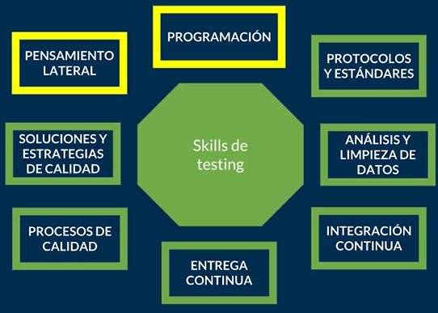

Los perfiles se encargan de:
* Organizar, define y mejora procesos
* Previenen y se anticipan
* Realizar estándares
* Conocer herramientas de automatización
* Tomar en cuenta la seguridad y proteger los datos
* Cuidar los datos
* Los desarrolladores manejan sus pruebas
* Cuidan la entrega continua
* Mejora el producto
* Mejora al equipo y organización

# Testing

## Presupuesto, Recursos, Tiempo y Actividades Clave

  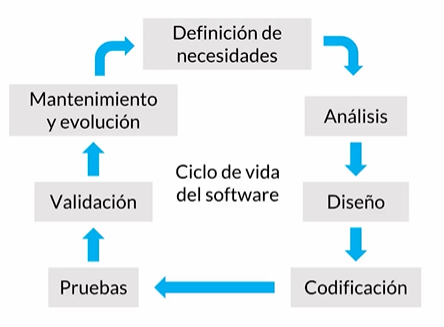

El testing se puede llevar en cada una de las etapas

* Analisis
  * Especificaciones de los requerimientos
  * Cuestionar los argumentos

  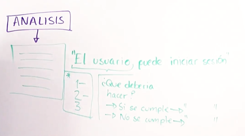

* Diseño
  * Match entre requerimientos y lo que se espera ver

  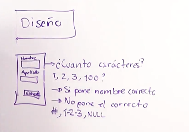

* Código (Arquitectura)
  * Módulos
  * Funciones
  * BD
    * CRUD

  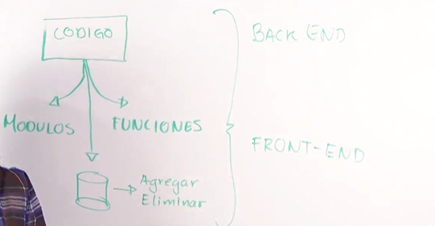

* Pruebas
  * Parte funcional
  * Verificación
  * Validación
  * Aceptación

  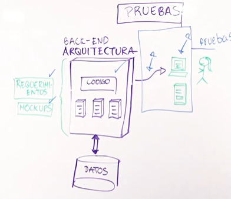

## Estrategía de pruebas

Las estrategias de prueba son aquellas que nos permiten conocer por donde comenzar. Por donde vamos a hacer las pruebas, planearlas, identificarlas. Para saber por donde comenzar podemos hacernos dos preguntas.

* ¿Qué problema tenemos actualmente?
* ¿O qué problemas debemos evitar?

Estructura lógica del plan
* Seguridad
* Arquitectura
* Performance
* Usabilidad
* Escalabilidad

Herramienta para aterrizar ideas
https://www.mindmup.com/

Diferentes pruebas

  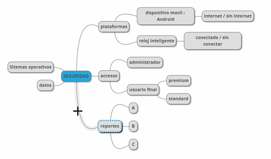

* ¿Qué problema tenemos?

  

Escenario de usabilidad

  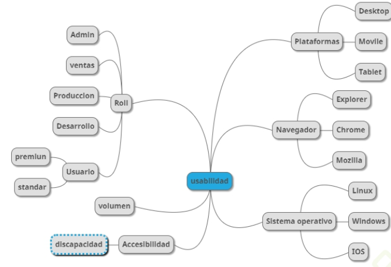

## Testing en desarrollo de software

**Testing:** Es la exploración de una idea, aprender a conocer como sucede el flujo, se generan datos, se llenan formularios. Esto y la exploración de pruebas nunca terminan, siempre hay nuevas formas de conocer como el usuario esta usando el software

**Checking:** Es cuando sabes qué esta pasando y te verificas que siga pasando. Como verificar una maleta antes de viajar para asegurarnos que guardamos todo.

* Solo se ejecutan si sucede algo
* Se ejecutan cada que… libero nuevo código o software.
* Se ejecutan de manera programada.

  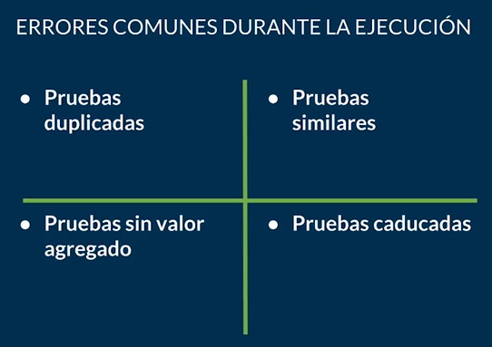

La automatización de pruebas consiste en el uso de **software especial** para controlar la ejecución de pruebas y la comparación entre los resultados obtenidos y los resultados esperados. Sin embargo, se trata de un checking repetitivo y automatizado.

**Desventajas del checking mal empleado**

* Pobre cobertura de pruebas
* Falta de actualización
* Mal manejo de versiones

**Ventajas del checking bien empleado** 

* Correr pruebas en paralelo o en múltiples plataformas
* Reducción de error humano
* Probar grandes cantidades de datos

Cuando ya queremos hablar de **integración continua** y **liberación continua**, entonces la automátización es la solución definitiva para la eficiencia del equipode desarrollo ágil y equipos DevOps

## Testing ágil

**Involucra a todos**, no solo en al tester, todos en el equipo son tester. La persona con este rol se asegura de la mayor cobertura de pruebas tomando en cuenta todas las necesidades que cada uno de los miembros del equipo también esta intentando hacer que funcione. El tester tiene que definir si se esta cumpliendo con los requerimientos funciones y los del equipo.

**Estrategias Ágiles:**

* El testing es de "todo el equipo"
* El testing puede ser independiente
* Integración continua
* Desarrollo guiado por pruebas (Test Driven Development)
* Desarrollo guiado por comportamiento (Behaviour Driven Development)
* Desarrollo guiado por las pruebas de aceptación (Acceptance Test Driven Development)

  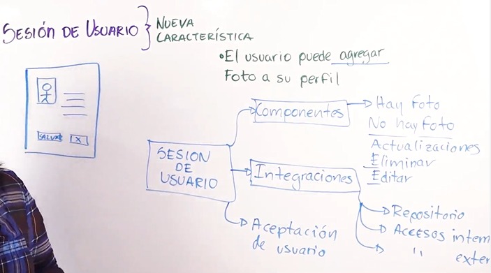

Las pruebas va a distintos niveles