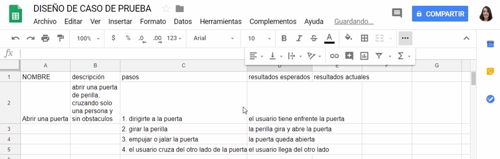
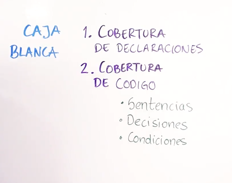
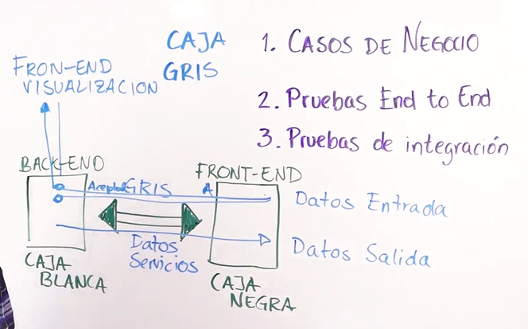
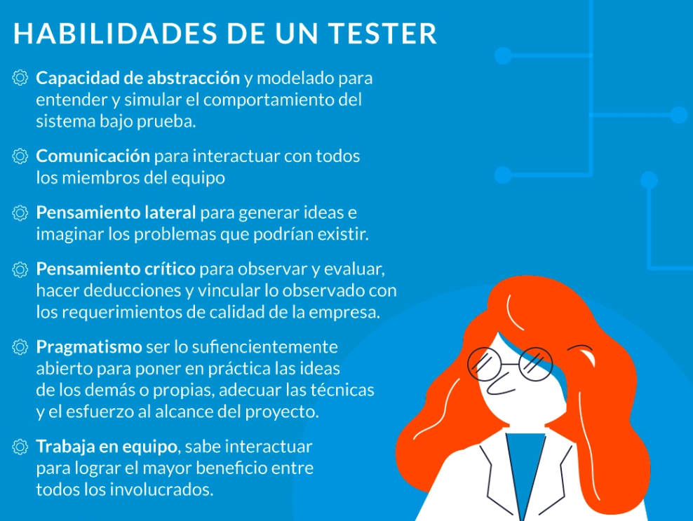
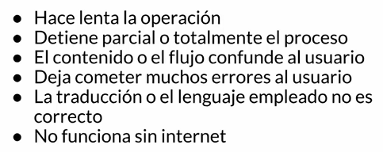
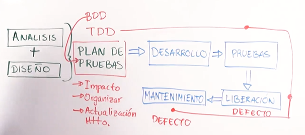
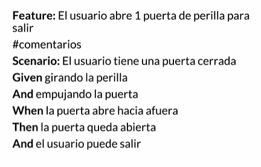

# Testing <!-- omit in toc -->

## Tabla de Contenido<!-- omit in toc -->
- [Introducción](#introducción)
  - [Aspectos por las que no se hacen pruebas](#aspectos-por-las-que-no-se-hacen-pruebas)
  - [Razones para hacer pruebas](#razones-para-hacer-pruebas)
  - [Proceso de pruebas del software y los estándares internacionales](#proceso-de-pruebas-del-software-y-los-estándares-internacionales)
  - [Ciclo de vida del software](#ciclo-de-vida-del-software)
  - [Proceso de pruebas del software: Calidad y Defectos](#proceso-de-pruebas-del-software-calidad-y-defectos)
  - [Principios del testing moderno](#principios-del-testing-moderno)
  - [Especialidades del testing](#especialidades-del-testing)
- [Testing](#testing)
  - [Presupuesto, Recursos, Tiempo y Actividades Clave](#presupuesto-recursos-tiempo-y-actividades-clave)
  - [Estrategía de pruebas](#estrategía-de-pruebas)
  - [Testing en desarrollo de software](#testing-en-desarrollo-de-software)
  - [Testing ágil](#testing-ágil)
  - [Niveles de pruebas de software](#niveles-de-pruebas-de-software)
  - [Tipos de pruebas de software](#tipos-de-pruebas-de-software)
  - [Pruebas estáticas y dinámicas](#pruebas-estáticas-y-dinámicas)
  - [Definición y diseño de pruebas](#definición-y-diseño-de-pruebas)
- [Gestión monitoreo y control](#gestión-monitoreo-y-control)
  - [Caja blanca, gris y negra](#caja-blanca-gris-y-negra)
  - [Monitoreo y Seguimiento](#monitoreo-y-seguimiento)
  - [Roles y responsabilidades](#roles-y-responsabilidades)
- [Gestión de BUGs](#gestión-de-bugs)
  - [Retrabajo](#retrabajo)
  - [Sistema de seguimiento de bugs](#sistema-de-seguimiento-de-bugs)
    - [Repositorio y monitore de defectos](#repositorio-y-monitore-de-defectos)
  - [Defectos y sugerencias](#defectos-y-sugerencias)
- [Depuración](#depuración)
  - [Técnicas de depuración](#técnicas-de-depuración)
  - [Pruebas de verificación](#pruebas-de-verificación)
- [Bases de la automatización de pruebas](#bases-de-la-automatización-de-pruebas)
  - [Automatización de pruebas](#automatización-de-pruebas)
    - [Frameworks](#frameworks)
  - [Gherkin](#gherkin)

# Introducción

¿Cuántas veces hemos sido usuarios de alguna app móvil y falla? ¿Cuántas veces hemos sido parte del desarrollo de un producto y el retrabajo se desborda por todas las fallas o defectos que contiene?.

**Las pruebas son una manera de explorar, experimentar, entenderlo, entre menos entiendas el productos que estas desarrollando más errores tendrá.** Las puedes hacer por cuestión de costo, prestigio o cuestiones legales.

**Tres aspectos a considerar:**

* Tenemos un problema o el resultado no es el esperado
* Nuestros costos se esta volviendo muy alto.
* Implicaciones legales o de estándares tecnológicos.

  

  

  

## Aspectos por las que no se hacen pruebas

* No son parte de la solución
* No siempre se entrega la evidencia al cliente
* Si una estructura o especificaciones son dificiles de mantener
* No hay tiempo, o nadie del equipo hace pruebas

## Razones para hacer pruebas

* Tenemos un problema o el resultado no es el esperado
* Costo alto o fuera de presupuesto
* Implicaciones legales o estándares tecnológicos

## Proceso de pruebas del software y los estándares internacionales

Para el proceso de pruebas es necesario contar con al menos 3 elementos que lograrán cumplir nuestros objetivos:

* **Metodología:** Es donde estableces el criterio o estrategia de cómo se llevaran acabo las pruebas.
* **Recursos:** Si quieres realizar pruebas y no estás preparado, con el tiempo esas carencias se pueden visualizar como defectos.
* **Herramientas:** Nos ayudarán a optimizar nuestro trabajo.

  

Es importante definir siempre

* **Definir la calidad del producto:** Si estas creando el software correctamente.
* **Calidad del proceso:** Si alguien de tu equipo no te especifica lo que quieres no vas a poder crear un producto que cubra sus necesidades.

Para garantizar la calidad del software

  

**Certificaciones, estándares y metodologías para**

* Individios
* Procesos
* Empresas
* Servicios/Productos = Software/Hardware
* Para tipo de industrias

**Estándares**

  

## Ciclo de vida del software

A lo largo del ciclo de vida del software se realizan distintas pruebas para **garantizar que este cumpla con los requerimientos** para los que fue diseñado y de la misma forma se encuentren **procesos de mejora y optimización** a medida que se desarrolla el software.

* Es necesario hacer **pruebas en todas las fases del desarrollo de software** ya que un error encontrado en una etapa tardía puede generar costos muy elevados.

* Errores detectados lo antes posible reducen los costos y son mucho más fáciles de corregir.

* El ciclo de vida permite que los errores se detecten lo antes posible y por lo tanto, permite a los desarrolladores concentrarse en la calidad del software, en los plazos de implementación y en los costos asociados.

El ciclo de vida básico de un software consta de los siguientes procedimientos:

  

1. **Definición de objetivos**
En esta fase se define el **alcance general del software** y su papel dentro de una estrategia global o dentro del ecosistema que va a funcionar.

2. **Análisis de los requisitos y su viabilidad**
Se trata de recopilar la mayor cantidad de información posible para **evaluar la viabilidad del producto, encontrar posibles restricciones y analizar todos los requisitos del cliente.**

3. **Diseño**
**Alto nivel:** Se trata de realizar un diseño básico que **valide la arquitectura de la aplicación.**
**Bajo nivel:** Es una **definición detallada de la estructura de la aplicación basada en el diseño general.**

4. **Programación**
Es la **implementación de un lenguaje de programación** para crear las funciones definidas durante la etapa de diseño.

5. **Pruebas de verificación**
Aunque en todas las fases anteriores se hacen pruebas en esta fase se cubren: **pruebas de componentes, integrales y de sistema.**

6. **Prueba beta (o validación)**
Se hace para garantizar que el software cumple con las especificaciones originales o también se hacen las pruebas de aceptación.

7. **Implementación**
Se realiza una prueba del sistema implementado para **encontrar posibles fallas en la Implementación.**

8. **Mantenimiento**
Se hace para todos los procedimientos correctivos (mantenimiento correctivo) y a las actualizaciones secundarias del software (mantenimiento continuo), junto con la actualización de las pruebas.

Si hacemos las pruebas durante cada fase del ciclo de vida del software tendremos al final del ciclo un producto validado y robusto de acuerdo a las necesidades del cliente

## Proceso de pruebas del software: Calidad y Defectos

  

Todo lo anterior nos hace preguntarnos: **¿Qué es la calidad?**

La calidad es una percepción entre **lo deseado, analizado y lo que vamos a entregar**. **La calidad la define el cliente**, si esa persona esta satisfecha con lo entregado hasta ahí llega la calidad.

* **Verificación:** Es ir en cada etapa revisando que se cumpla lo propuesto por el cliente.
* **Validación:** Antes de entregar al cliente, validamos que efectivamente el conjunto de requerimientos esta siendo cumplido con lo entregado.

Siempre puede ocurrir

* **Anomalía:** Cualquier insatisfactoria condición. No es reproducible
* **Defecto:** No desempeña funciones
* **Fallo:** Incapacidad dentro de márgenes
* **Error:** Acción humana incorrecta

Ya entendimos que es necesario definir un proceso que asegure un buen desarrollo del producto, que los estándares o herramientas implementadas deben ayudar a cubrir las métricas definidas para entonces evaluar si el producto tiene el porcentaje o grado de calidad esperado.

  

  

  

  

Ejemplo. Tablero automotriz

  

* Anomalia. Prende la luz de no hay gasolina de manera intermitente
* Defecto. El tablero falla de inicio
* Error. El usuario confunde lo que sucede en el tablero
* Fallo. El auto va en carretera, pero se mete en el agua. El auto funciona, pero no en esas condiciones

  

## Principios del testing moderno

Comentarios

> * Lo importante es el negocio
> * Hay que tener una distribución que permita manejar el riesgo del software
> * El cliente define la calidad
> * Se debe de contar con una extensa cantidad de datos de prueba

Los 7 principios

* **Nuestra prioridad es mejorar el negocio:** El producto que se va a entregar al cliente permitirá hacer funcionar el negocio. Si en algún momento no quieres hacerlo, estás poniendo en riesgo ese negocio porque si el producto no se vende o no es aceptado la empresa puede cerrar o puedes perder el trabajo.
* **Nosotros aceleramos el equipo y usamos modelos como Lean Thinking y Teoría de las Restricciones para ayudar a identificar, priorizar y mitigar cuellos de botella en el sistema:** Cuando queremos hacer algo, lo queremos hacer perfecto y eso puede ser demasiado. Deberías construir en base a procesos cortos para poder encontrar los defectos de una manera más rápida.
* **Nosotros somos la fuerza para la mejora continua, ayudando al equipo a adaptarse y optimizar para tener éxito, en lugar de proporcionar una red de seguridad para detectar fallas:** El cliente puede entender que el producto se va a liberar por fases, es importante que nosotros enfoquemos nuestras pruebas en cada una de esas fases. No tiene que ser todo al inicio y al final, debe haber una distribución que nos permita manejar el riesgo del software
* **Nos preocupamos profundamente acerca de la cultura de calidad en nuestro equipo, y asesoramos, lideramos y nutrimos el equipo para llevarlos a una cultura de calidad más madura:** Al inicio los testers eran personas desarrollando software y un día con tantos defectos y trabajo, separaron los roles para que así hubiese una persona dedicada a realizar las pruebas. El tester puede hacer recomendaciones de herramientas, mejorar el proceso o volverse un coach.
* **Nosotros creemos que el cliente es el único capaz de juzgar y evaluar la calidad de nuestro producto:** Si el cliente esta satisfecho con lo entregado y cumple las expectativas entonces has alcanzado la calidad deseada.
* **Nosotros usamos datos de manera extensa y profunda para entender los casos de uso del cliente y entonces cerrar huecos entre hipótesis del producto e impacto del negocio.**
* **Expandimos las habilidades de testing y el conocimiento en todo el equipo; entendemos que esto reduce o elimina la necesidad de una especialista dedicado al testing.**

El tester debe dominar varias areas necesita entender y tener toda la visión del producto y negocio. Saber sobre herramientas que optimicen el trabajo.

  

> **Lean Thinking**. Es una metodología que ayuda a estructurar procesos para maximizar la generación de valor con las actividades que se hacen, mientras se minimiza el desperdicio ("muda" es el término en japonés). Desperdicio se entiende principalmente como aquellas actividades que no agregan valor al producto final.

## Especialidades del testing

Hay muchas especialidades a la hora de hablar de testing y cada una de ellas tiene diferentes funciones y perspectivas que se incluyen en diferentes fases del proceso

* **Manual tester:** Nos ayuda a definir los casos de pruebas, establecer estrategias. También ejecuta, pero lleva lo necesario para que todos sepan qué hacer.
  * Pensamiento lateral, piensa fuera de la caja con una nueva perspectiva, agrega nuevos casos de usos y entiende muy bien al usuario.
* **Automation tester:** Se encarga de agilizar, acelerar el trabajo y actividades que nos quitan la oportunidad de encontrar más casos de usos.
  * Conoce de programación, no solo de forma básica, debe conocer como crear diseños de frameworks y soluciones. El código crece y las pruebas también, darle ese mantenimiento a las pruebas es un problema común.
* **Security tester:** Encargado para el área de seguridad. Debe ser alguien que aporte valor desde la perspectiva de la seguridad.
  * Protocolos, estándares, legalizaciones dependiendo de cada país y marca. Esta enfocado en prever ataques, virus, problemas de seguridad, acceso no autorizado. Profundizar en las técnicas y prácticas de seguridad.
* **Data science tester:** Con la manera en que crecen los datos en un proyecto, se necesita a alguien que los analice, agrupe y limpie estos datos.
  * Análisis y Limpieza de datos, omite tener un set de pruebas amplio donde la variedad va a permitir detectar defectos inesperados. Esto puede ser clave para que los resultados no sean falsos positivos
* **SDET:** Es la combinacion de un desarrollador que ya sabe hacer pruebas. Con la diferencia de automatiza y hace uso de herramientas que organizan la operación de la entrega de las pruebas. Esta persona se asegura de que las pruebas se ejecuten antes de liberar el código.
  * El programador ahora sabe hacer pruebas y conoce de herramientas que le permite entregarlas de una manera automatizada.
* **DevOps:** Conoce todo lo anterior y domina el conocimiento de automatizar el proceso, se asegura de una entrega continua.
  * Una automatización de la operación, Entrega Continua. Donde se entregan de forma más rápida las nuevas versiones.
* **QA Engineer:** Quality Assurance. Esta enfocado en el producto y en el proceso.
  * Procesos de Calidad
* **QE: Quality Engineer**. Es como un coach, acompaña en las politicas de calidad en la empresa o equipo.
  * Soluciones de estrategias de calidad.

  

Los perfiles se encargan de:
* Organizar, define y mejora procesos
* Previenen y se anticipan
* Realizar estándares
* Conocer herramientas de automatización
* Tomar en cuenta la seguridad y proteger los datos
* Cuidar los datos
* Los desarrolladores manejan sus pruebas
* Cuidan la entrega continua
* Mejora el producto
* Mejora al equipo y organización

# Testing

## Presupuesto, Recursos, Tiempo y Actividades Clave

  

El testing se puede llevar en cada una de las etapas

* Analisis
  * Especificaciones de los requerimientos
  * Cuestionar los argumentos

  

* Diseño
  * Match entre requerimientos y lo que se espera ver

  

* Código (Arquitectura)
  * Módulos
  * Funciones
  * BD
    * CRUD

  

* Pruebas
  * Parte funcional
  * Verificación
  * Validación
  * Aceptación

  

## Estrategía de pruebas

Las estrategias de prueba son aquellas que nos permiten conocer por donde comenzar. Por donde vamos a hacer las pruebas, planearlas, identificarlas. Para saber por donde comenzar podemos hacernos dos preguntas.

* ¿Qué problema tenemos actualmente?
* ¿O qué problemas debemos evitar?

Estructura lógica del plan
* Seguridad
* Arquitectura
* Performance
* Usabilidad
* Escalabilidad

Herramienta para aterrizar ideas
https://www.mindmup.com/

Diferentes pruebas

  

* ¿Qué problema tenemos?

  

Escenario de usabilidad

  

## Testing en desarrollo de software

**Testing:** Es la exploración de una idea, aprender a conocer como sucede el flujo, se generan datos, se llenan formularios. Esto y la exploración de pruebas nunca terminan, siempre hay nuevas formas de conocer como el usuario esta usando el software

**Checking:** Es cuando sabes qué esta pasando y te verificas que siga pasando. Como verificar una maleta antes de viajar para asegurarnos que guardamos todo.

* Solo se ejecutan si sucede algo
* Se ejecutan cada que… libero nuevo código o software.
* Se ejecutan de manera programada.

  

La automatización de pruebas consiste en el uso de **software especial** para controlar la ejecución de pruebas y la comparación entre los resultados obtenidos y los resultados esperados. Sin embargo, se trata de un checking repetitivo y automatizado.

**Desventajas del checking mal empleado**

* Pobre cobertura de pruebas
* Falta de actualización
* Mal manejo de versiones

**Ventajas del checking bien empleado** 

* Correr pruebas en paralelo o en múltiples plataformas
* Reducción de error humano
* Probar grandes cantidades de datos

Cuando ya queremos hablar de **integración continua** y **liberación continua**, entonces la automátización es la solución definitiva para la eficiencia del equipode desarrollo ágil y equipos DevOps

## Testing ágil

**Involucra a todos**, no solo en al tester, todos en el equipo son tester. La persona con este rol se asegura de la mayor cobertura de pruebas tomando en cuenta todas las necesidades que cada uno de los miembros del equipo también esta intentando hacer que funcione. El tester tiene que definir si se esta cumpliendo con los requerimientos funciones y los del equipo.

**Estrategias Ágiles:**

* El testing es de "todo el equipo"
* El testing puede ser independiente
* Integración continua
* Desarrollo guiado por pruebas (Test Driven Development)
* Desarrollo guiado por comportamiento (Behaviour Driven Development)
* Desarrollo guiado por las pruebas de aceptación (Acceptance Test Driven Development)

  

Las pruebas va a distintos niveles

## Niveles de pruebas de software

Vamos a ver diferentes estrategias de cómo podemos ir probando elementos por capas. **Componentes, estructuras, etc.**

* **Prueba de Componentes:** Componentes son aquellas cosas pequeñas que sueles ver en un video como el botón de pausa, volumen, adelantar, retroceder. Cada una de esas acciones son un componente.

* **Pruebas de integración:** Una aplicación tiene una serie de componentes que trabajando juntos forman un pequeño sistema, pero cuando tienes varios de estos sistemas necesitas integrarlos entre ellos.

* **Prueba de sistema:** Esta parte incluye que estás tomando en cuenta el contexto, no es lo mismo tener las mismas pruebas para iOS, Android y Web.

* **Pruebas de aceptación:** Si ya probamos que nuestro elemento o acción funcionan, estás pruebas nos aseguran con o sin el cliente que tiene cubierta todas las necesidades requeridas en el software. Es la última verificación.

## Tipos de pruebas de software

Necesitamos tener otra clasificación adicional. En los niveles sabemos la **profundidad de las pruebas**, pero en los tipos independientemente de su profundidad son las técnicas que vamos a usar para encontrar los defectos.

* **Pruebas funcionales:** Cómo funciona un sistema, qué debe estar haciendo, cómo está interactuando el usuario con él.

* **Pruebas no-funcionales:** El usuario puede estar experimentando otro tipo de cosas que aún funcionando puede tener la **sensación de lentitud, falta de legibilidad o claridad**. Esas características de **usabilidad** están asociadas a estas pruebas.

* **Pruebas estructurales:** Tienen que ver con la **tecnología y el stack** usado para construir nuestro producto. Nos tenemos que asegurarnos que nuestra base de datos o servidor funcionen de la manera correcta. Son conocidas como **pruebas de caja blanca**.

* **Prueba de manejo de cambios**: Es probar nuevamente un componente ya probado para verificar que no ha sido impactado por actualizaciones.

## Pruebas estáticas y dinámicas

Ya vimos los cuatro diferentes tipos de pruebas, pero estas también se separan en dos formas diferentes de trabajarlas.

* **Pruebas estáticas**: Muchas veces no son consideradas en los proyectos porque significa revisar código, documentación, verificar información documentada de la forma correcta.
  * Contratos, planes y calendarios del proyecto así como su presupuesto
  * El análisis de requerimientos
  * Especificaciones o reglas de negocio
    * Técnicos
    * Seguridad

* **Pruebas dinámicas**: Se enfocan en comportamientos externos visibles durante la ejecución del software.
  * Las definiciones de 
    * Historias de usuario
    * Criterios de aceptación
    * Mockups
  * El diseño de la arquitectura
  * Las pruebas (Testware), puntos de verificación CI
  * Guías de usuario
  * Evaluación/revisión del código

**Beneficios**
* Detectar y corregir defectos de manera más eficiente
* Identificar y priorizar la ejecución de pruebas en etapas posteriores
* Prevenir defectos
  * Que no son fácilmente detectables durante las pruebas dinámicas
  * Durante la etapa de análisis y diseño
* Cubrir aspectos como:
  * Inconsistencias, ambigueadades, contradicciones, definiciones inexactas, requerimientos redundantes
* Reducir el retrabajo e incrementar la productividad
* Reducir el costo y el tiempo
* Mejorar la comunicación entre todos los miembros del equipo

## Definición y diseño de pruebas

Esto es algo básico para cada tester. Hay varias cosas necesarias que debemos comprender y estar seguros de para qué lo hacemos.

Tu obligación y por lo que vas a brillar es porque sabes 

* Encontrar Problemas, 
> Si no encuentro problemas antes de que el producto sea entregado al cliente, entonces su testing ineficiente **Considerar circunstancias adversas u otros escenarios**

* Documentarlos 
> Si cuendo encuentras un problema no sabes documentar y reproducir los pasos correctos su testing genera retrabajo y sube el costo

* Comunicarlos. 
> Si como representante de calidad del producto no sabe argumentar y proteger los intereses del negocio o los clientes, entonces su testing no agrega valor

Es crucial documentar, diseñar y nuestros casos de prueba contengan la información necesaria para que se entienda el trabajo.

  

# Gestión monitoreo y control

## Caja blanca, gris y negra

Cuando no estamos refiriendo a una caja es la manera de observar el contenido de software.

**Negra:** No podemos observar cómo fue construida, no vemos el código, no sabemos su arquitectura, no tenemos nociones más que la interfaz que estamos interactuando.

* Partición de equivalencia
* Valores límite
* Tabla de decisiones
* Transición de estados
* Casos de usos

  

**Blanca:** Es como una caja de cristal, puedo ver todo lo que hay adentro e incluso puedo ser parte del equipo que desarrolla el software.

* Cobertura de declaración
* Cobertura de código
  * Sentencias
  * Decisiones
  * Condiciones

  

**Gris:** Pueden ser la integraciones, cómo fluye el código y puedo ver como se transmiten los datos a través de las redes.

* Casos de negocios
* Pruebas End-to-End
* Pruebas de integración

  

## Monitoreo y Seguimiento

Aunque parezca obvio que es necesario gestionar nuestro trabajo y darle seguimiento a las pruebas y ejecución, hay estudios donde las empresas no pueden hacer esto exitosamente.

**Gestión de Pruebas:**

**Planeación:** Definir los objetivos de las pruebas es muy importante, al no tener una estrategia clara termina causando una pobre cobertura de pruebas. Los elementos a considerar para una buena planeación son la estimación, recursos, el alcance y objetivo.

**Monitoreo y Control:** Durante el monitoreo lo que estamos buscando son esas *métricas que nos digan si estamos llevando avances o tenemos retrasos.* Son nuestras alertas cuando nuestro plan no se esta ejecutando.

**Análisis:** Incluye decidir cuáles son esas prioridades que nos ayudará a definir qué debemos probar.

**Diseño:** Normalmente cuándo estas iniciando las pruebas es necesario crear un mapa de ideas. Después de esto, puedes realizar el diseño a detalle de qué va a incluir cada caso de uso. 
* Casos de alto nivel 
* Diseñar y priorizar pruebas 
* Identificar el entorno de pruebas 
* Hacer una trazabilidad entre pruebas y sus condiciones.

**Implementación:** También nos aseguramos de contar con la estructura necesaria para realizar las pruebas, con un ambiente, datos y dónde documentar o realizar las pruebas.

**Ejecución:** En esta etapa los suites de pruebas se ejecutan de acuerdo al programa o el plan diseñado con anterioridad. Se suelen agrupar los casos de pruebas para que no estén desorganizado y podemos hacerles un buen seguimiento.

**Finalización:** Cuando queremos cerrar el ciclo de las pruebas, necesitamos saber qué porcentaje se cubrió, ejecutó, cuántos defectos se derivaron, aprender lecciones sobre el proceso.

## Roles y responsabilidades

Independientemente del rol, **un tester participa de todas las etapas del proceso de desarrollo de software**, colaborando para asegurar la máxima calidad del producto. Su perfil conjuga un conjunto de habilidades con el conocimiento del negocio, de la aplicación bajo prueba y de cómo planificar, diseñar, ejecutar y administrar las pruebas.

> "Un tester investiga un producto de software con el objetivo de obtener información acerca de su calidad y del valor que representa para quienes lo utilizan"

* **Especialista en pruebas manuales.** Entre las habilidades que debería de tener, es el pensamiento lateral, en la parte de organización, diseño y documentación, debería de ser el especialista en entender cuáles son los casos de uso que se van a llevar para cada área, debe de poder organizarse y asignar trabajo para sí mismo dependiendo las prioridades del negocio, los riesgos o el impacto.
  * Estrategia
  * Definición
  * Ejecución
  * Cobertura de pruebas para cumplir con los requerimientos
* **Especialista en pruebas técnicas.** Esta persona se tiene que encargar de estar siempre actualizada en las herramientas que le permitan acelerar el trabajo, mejorar el trabajo, búsqueda, continuo entrenamiento, ser autodidacta.
  * Acelera la capacidad de ejecusión de las pruebas
  * Implementa herramientas
  * Selecciona datos para las pruebas
  * Monitorea la ejecución de las pruebas
* **Líder del equipo de pruebas.** Gestiona el equipo y es un facilitador para las actividades a realizar, como apoyar con ambiente de pruebas, darle seguimiento a los defectos, revisar que los lineamientos se sigan.
  * Facilitador de servicios
  * Información
  * Herramientas para el equipo de pruebas
  * Estimar presupuestos, recursos y tiempos respecto al plan de desarrollo de software
* **Ingeniero de calidad.** Se dedica a la parte del proceso, es quien se encarga de establecer las políticas, mantener involucrados a los equipos, alineados a las prioridades del negocio; además que verifica que todo esto se cumpla sobre todo para la entrega del cliente.
  * Se involucra en el negocio
  * Busca reducir el error humano

  

# Gestión de BUGs

## Retrabajo

Es necesario **identificar cada uno de los roles y responsabilidades para después evaluar si se esta haciendo o no re trabajo**, es decir estamos utilizando tiempo que podría ser utilizado en otras actividades o sencillamente que no debería hacerse

También es necesario **medir el rendimiento de nuestro trabajo** y herramientas que nos permitan conocer paso a paso cómo vamos avanzado en el proceso de manera individual o en equipo.

**Acciones de control**
* Si identificamos un riesgo
* Falta de ambientes
* Si el criterio de salida no se cumple

**Prevenir escenarios o circunstancias**
* Resultados de las pruebas
* Desempeño del equipo de testing

**Retrabajo:** Es la principal causa del retraso, de que la estimación de tiempo falle, de que costos suban. Cuando estos suceden aumentamos exponencialmente el trabajo de todos

* Falta o mala documentación
* Falta de capacitación o dominio en las herramientas utilizadas
* Falta de capacitación o dominio en el software a desarrollar
* Falta de comunicación

## Sistema de seguimiento de bugs

La mala administración, malas prácticas o falta de seguimiento entorpece las tareas de todo el equipo sino que además sumamos el retrabajo en la mala documentación puede que nuestro proyecto se salga de presupuesto o tiempo.

**Razones por las que aparecen defectos:**

* Hay presión de tiempo en la entrega del software
* Descuidos en el diseño
* Inexperiencia o falta de conocimiento
* Falta de comunicación en los requerimientos
* Diseño complejo de código
* Desconocimiento de las tecnologías usadas

**Preguntas a realizar para construir un proceso de gestión de bugs:**

* ¿Qué debe de hacer la persona que encuentre el defecto?
* ¿En qué herramienta debe documentar el defecto?
* ¿Cómo vamos a almacenar la información?
* ¿Qué información requiere el equipo de desarrollo para poder resolver un defecto?
* ¿Cuáles son los estatus que se manejan para que fluya la resolución del defecto?
* ¿Cuáles son los criterios de aceptación de cierre del defecto?

  

### Repositorio y monitore de defectos

Una vez instaurado el proceso de gestión de bugs, también se debe precisar quién tiene acceso a los bugs y cuales son los permisos que tiene, por cuánto tiempo se almacenan, etc

## Defectos y sugerencias

Dependiendo del objetivo del proyecto podemos encontrar que no todos quieren que des sugerencias, solo encuentres defectos. Cosas que pongan en riesgo por costo, prestigio o calidad del producto.

* **Defectos**: Es aquello que no cumple los requerimientos funciones, de diseño, de arquitectura y es la consecuencia de un error humano en el código o la interpretación de la información.

* **Sugerencias**: Es cómo la experiencia del usuario se ve afectado. La lentitud del proyecto, la legibilidad, combinación de colores, la forma de navegar no es adecuada.

**Algunos ejemplos**

  

> Si la calidad la define el usuario final... sus sugerencias se vuelven defectos

Las sugerencias convertidas en defectos pueden ser actualizaciones de software

  

# Depuración

Hacer testing o depuración son dos actividades diferentes. Mientras el testing sirven para encontrar defectos, la depuración nos permitirá entender por qué esta sucediendo este defecto y que actividades están implicadas en el. Ambas pueden ir de la mano y son muy importantes.

**Debugger**: Es una herramienta que nos ayuda a encontrar todos estos errores ya sea de sintaxis, advertencias de seguridad, etc. Nos permite ejecutar línea por línea, detener la ejecución temporalmente, visualizar el contenido de las variables, cambiar el valor del entorno de ejecución para poder ver el efecto de una corrección en el programa.

**Beneficiados**

* **Programador:** Requiere cada vez que programa ir depurando lo que ejecuta y escriba para que cumpla con su objetivo
* **Tester**: Le ayuda a reducir el tiempo de análisis que después puede ser asignado para el desarrollador
* **Analista**: Puede ser para analisis de encontrar información de un historial sobre cómo se comporta un sistema.

**Objetivo**: Vamos a analizar cómo se comporta el sistema, cómo se transfieren los datos, cómo se procesa la información. Tenemos la capacidad de tener nuestro código en cualquier momento para conocer cómo funciona.

**Sintomas de errores**

* Obtención de salida incorrecta
* Realización de operaciones fuera de lo normal
* No finalización del programa (ciclos infinitos, p.ejem.)
* Caídas del programa

**El depurador (debugger) permite:**

* Ejecutar línea a línea
* Detener la ejecución temporalmente
  * En una línea de código concreta
  * Bajo determinadas condiciones
* Visualizar el contenido de las variables
* Cambiar el valor del entorno de ejecución para poder ver el efecto de una corrección en el programa

**Tipos de herramientas**

* Debugger
* Manual
* Local / Remota

**Herramientas**
* Mensajes de advertencia
* Estándares de compilación
* Verificación sintáctica y lógica

## Técnicas de depuración

Las técnicas de depuración deben ir cambiando de ser reactivas a ser preventivas. Debemos recordar que parte de los principios del testing moderno es tratar de ir corrigiendo nuestras técnicas, implementar mejores prácticas y hacer uso de mejores herramientas. El debugging debería ser la última técnica que utilizas.

**Técnicas de depuración:**

* **Debugging**: Observar valores de variables, detener temporalmente la aplicación.
* **Logs**: Hacer un vaciado de cómo las variables van cambiando y es más fácil rastrear la información.
* **Historial**: Agiliza la forma de monitorear y observar los comportamientos de nuestro software.     
  * Comparando valores
  * Agrupando información.
* **Reportes**: Observar anomalías, acelerar el tiempo de respuesta, prevenir ataques o fallas.

**Desventajas de no usar LOGS**

* Visibilidad nula de errores
* Metodología de trabajo no estándarizada
* Accesos e información desentralizada
* Incremento del tiempo de respuesta

**Ventajas de generar un historial/reporte**

* Aplicar técnicas de Machine Learning
* Mejorar la gestión y el control de la información
* Detectar amenazas de red o virus
* Prevenir fugas de información, así como comportamientos inadecuados

**Fase 1**: Encontrar el error
**Fase 2**: Corregir el error

**Pasos para depurar:**

* Ir al módulo que falla
* Establecer breakpoints
  * En asignación de valores
  * Procesamiento de valores
  * Cambio de estados
* Diseñar una **matrix de pruebas**
* Establecer los datos de prueba
* Comenzar a depurar

## Pruebas de verificación

Las pruebas de verificación **sirve para confirmar que un cambio se haya hecho o un defecto se haya corregido.** Queremos verificar que lo que estamos buscando está en los requerimientos o documentación.

**Pruebas de verificación**

Tratan de reproducir el escenario fallido con los dato usados. Pero sería un error usar los mismo datos para después asumir que el error fue corregido.
**Se buscan nuevos escenarios donde se utilicen valores relativos**. Como 

  * Otras plataformas
  * Otros sistemas operativos
  * Otros exploradores
  * Otros dispositivos

**Pruebas de regresión**

**La matrices de pruebas** cuando se implementan otros dispositivos u otros exploradores nos ayuda a tenerlos en cuenta nuestros puntos de verificación para que no sufran un impacto.

> La matrix de prueba nos funciona para casos donde no solo vemos los defectos sino que todo lo que ya funciona siga funcionando.

Nos ayuda a tener una claridad con los casos de prueba claves que pueden ser automatizados.

**Documentación**

* Comentarios en el código
* Documentación técnica
* Pruebas unitarias
* Pruebas específicas
* Matrices de pruebas
* Plan de pruebas

# Bases de la automatización de pruebas

## Automatización de pruebas

En esta unidad vamos a conocer las bases para la automatización de pruebas y podemos automatizar las siguientes tipos de pruebas.

* **Pruebas unitarias:** Tienen que ver con un pedazo de código que el desarrollador esta codificando, pero no tienen que ver con todo el flujo de negocio y proceso del software.

* **Pruebas de integración**: Cómo hacemos que el conjunto del equipo que libera pedacitos de software funcionen juntos y no hagan defectos adicionales.

* **Pruebas funcionales o de aceptación**: Estas pruebas no necesariamente forman parte de los requerimientos especificados por el cliente, una recomendación para automatizar estas pruebas es que deban cumplir con los requerimientos dados por el cliente.

### Frameworks

* **Test Driven Development:** El desarrollo va a estar enfocado haciendo primera las pruebas y después el código. Haciendo que el desarollo sea muy específico con la mayor cobertura y no pongamos líneas de código que no van a funcionar o no se usan.

  * Escribimos una prueba
  * Ejecutamos la prueba: Falla
  * Se escribe el código
  * Ejecutamos la prueba: Pasa

* **Behavior Driven Development**: Si primero vamos a escribir las pruebas, debemos hacerlo bien y usando un lenguaje sencillo, simple para que la prueba sirva al equipo para entender qué es lo que queremos hacer.

  

  

## Gherkin

Gherkin es un lenguaje de texto plano con estructura, usamos palabras que no son comandos pero permiten entender en un modo de pseudocódigo qué es lo que se tiene que hacer. Esta diseñado para ser fácil de aprender y ser entendido por todos.

**Ventajas**

* Simple
* Palabras claves o keywords
* Estandariza los casos de uso
* Reduce el tiempo de diseño

**Keywords**

* Feature
* Scenario
* Given, When, Then, And, But (steps)
* Background
* Scenario outline
* Excamples

  

