# Entrenamiento Google Cloud Platform <!-- omit in toc -->

## Tabla de Contenido<!-- omit in toc -->
- [Introducción](#introducción)
  - [Laboratorios oficiales de Google](#laboratorios-oficiales-de-google)
- [Computo en la nube](#computo-en-la-nube)
    - [La nube pública](#la-nube-pública)
    - [¿Por qué Google?](#por-qué-google)
  - [Opciones de cómputo en la nube](#opciones-de-cómputo-en-la-nube)
  - [Maquinas virtuales (Compute Engine)](#maquinas-virtuales-compute-engine)
    - [Laboratorios](#laboratorios)
  - [Plataforma como servicio (App Engine)](#plataforma-como-servicio-app-engine)
    - [Contenedores](#contenedores)
      - [Docker](#docker)
    - [Laboratorios](#laboratorios-1)
  - [Cómputo contenerizado (App Engine Flex)](#cómputo-contenerizado-app-engine-flex)
    - [Acceso a VPC](#acceso-a-vpc)
    - [Sabores de App Engine](#sabores-de-app-engine)
  - [Serverless](#serverless)
    - [Serverles y contenedores](#serverles-y-contenedores)
    - [Cloud functions](#cloud-functions)
      - [Evento detonador (Triggers)](#evento-detonador-triggers)
- [Continous Integration](#continous-integration)
- [Kubernetes](#kubernetes)
- [Machine learning](#machine-learning)

# Introducción

Apuntes del entrenamiento en Google - Platzi

  

  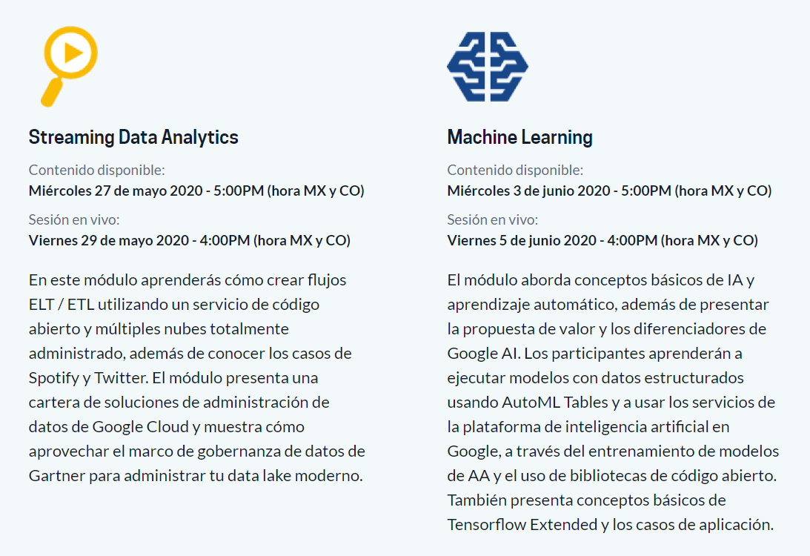

## Laboratorios oficiales de Google

Material oficial para realizar prácticas
https://www.qwiklabs.com/

# Computo en la nube

  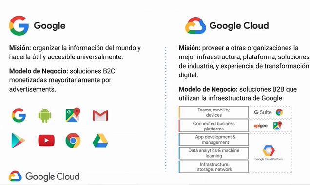

### La nube pública

Según NIST (Instituto Nacional de Estándares y Tecnología)

* Autoservicio bajo demanda
* Acceso de red amplio
* Recursos compartidos
* Elasticidad acelerada
* Medición de servicio
* Amigable con el ambiente* Energía renovable y huella de carbono 0

### ¿Por qué Google?

  

Compañia enfocada en IA

  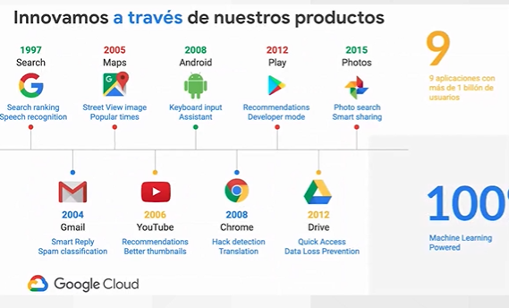

  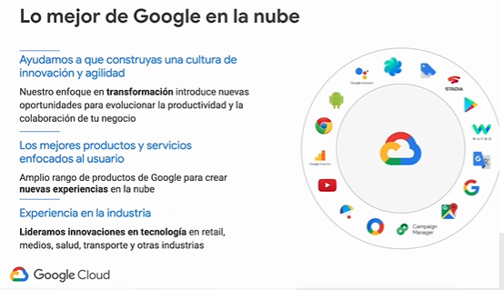

**Seguridad en multiples capas**

* Chips, servidores, almacenamiento, red y centros de datos a la medida
* Cifrado por defecto en tránsito y en descanso
* Una de las redes más extensas del mundo, minimizando el riesgo del internet público

130 puntos de presencia en más de 35 países que carga el 40% de Internet

  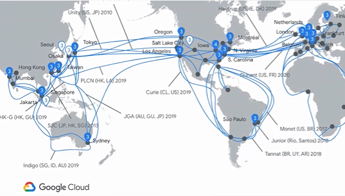

**Compromiso con el código libre**

Tecnología que más se adapte a tus necesidades

  

  

## Opciones de cómputo en la nube

  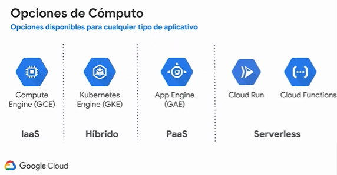

* **Compute engine.** Son maquinas virtuales
  * https://cloud.google.com/compute/?hl=es-419
* **Kubernetes.** Abstrae la infraestructura y las aplicaciones
  * https://cloud.google.com/kubernetes-engine?hl=es
* **App Engine.** Le damos el código y Google se encarga
  * https://cloud.google.com/appengine?hl=es-419
* **Cloud Run y Cloud Functions.** Serverless, funciones, microservicios que hacen cosas especificas
  * https://cloud.google.com/serverless?hl=es

  

## Maquinas virtuales (Compute Engine)

Permite crear maquinas virtuales predeterminadas y a la medida con diferentes modelos de consumo y precio

  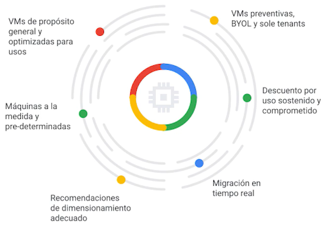

Google tiene inteligencia para poder reducir tus costos en maquinas virtuales y que está se pueda adaptar

  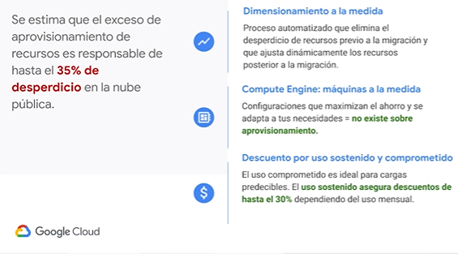

Acorde a tu aplicativo, cuenta con imagenes optimizadas para contenedores

  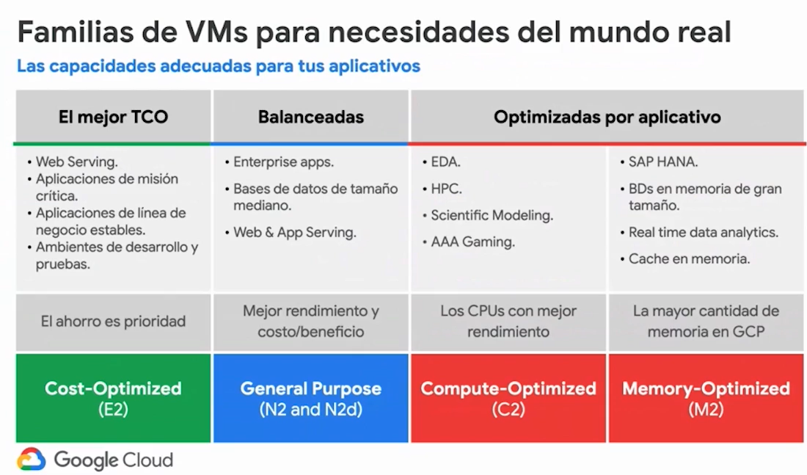

  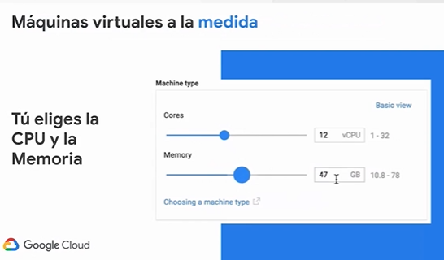

Cuentas con descuento sostenido por uso

  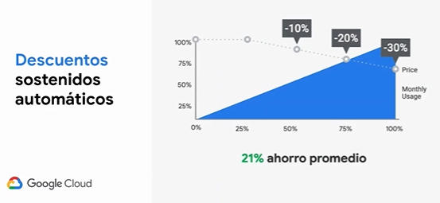

### Laboratorios

* Cómo crear una máquina virtual
* Compute Engine: Qwik Start - Windows
* Cómo comenzar a usar Cloud Shell y gcloud

## Plataforma como servicio (App Engine)

* Fue el primer servicio de computo en la nube de Google

  

Default service

  

**Que ofrece hoy**

* Auto escalamiento
* Bifurcación de tráfico
* Balanceo de carga global
* Alta disponibilidad
* SSL y Dominios
* Chequeos de Salud
* Cloud Task
* Monitoreo
* Logueo

  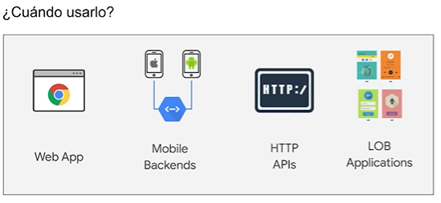

Despliega con un click

  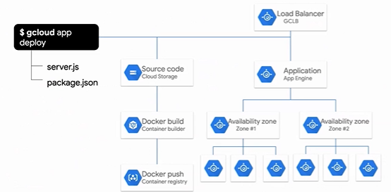

App engine viene en dos sabores
* Se puede crear con contenedores

  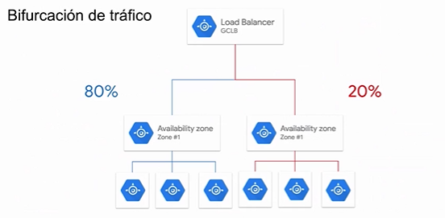

  

Maneja 320 billones de peticiones hoy en día

### Contenedores

Pasamos desde:
* Montar servidores propios en las empresas
* Virtualizar maquinas en multiples servidores con diferentes sistemas operativos
* Contenedor. En el que se virtualiza el S.O. otorgando portabilidad en cualquier sistema operativo, añadiendo ligeresa y simplicidad

  

Webinar: Modernizando su aplicación - una jornada desde el monolito a los microservicios

https://cloudonair.withgoogle.com/events/cloud-tech-solutions-es/watch?talk=talk-6

#### Docker

Docker es una tecnología que te permite construir, correr y monitorear contenedores. Los contenedores de Docker utilizan Containerd como runtime, hoy en día el estándar de la industria.

https://containerd.io/

  

Los contenedores usan el concepto de un sistema de capas, similar a los sistemas de versionamiento de código, para reutilizar capas base o comunes entre contenedores. Cuando necesitas actualizar una imagen, únicamente tienes que descargar las diferencias desde la última revisión.

  

Las instrucciones que definen estas capas están descritas en un archivo base. En el caso de Docker, en un Dockerfile. Cada instrucción presente en este archivo, por lo general, representa una capa adicional para tu contenedor.

Existen repositorios para que guardes de manera segura y escalable las imágenes de tus aplicaciones. Esto te da control de regresar a una versión previa en caso de alguna falla o regresión de funcionalidad. Es muy común que las organizaciones tengan repositorios privados de imágenes en donde almacenan tanto las imágenes base que los aplicativos utilizan (previamente validadas) como las imágenes de cada aplicación desplegada. En la nube de Google puedes utilizar Container Registry.

https://cloud.google.com/container-registry

Puedes desplegar un contenedor de Docker a cualquier host que tenga el runtime instalado, pero es muy común que a medida de que incrementa el número de contenedores a administrar, las organizaciones adopten orquestadores que les aligeren esta labor. 

El estándar en la industria es **Kubernetes**, creado por Google y donado como código libre a la CNCF hace unos años. Google continúa liderando el desarrollo de Kubernetes y ofrece una experiencia de entorno administrado, **Google Kubernetes Engine**, para que te enfoques en la creación de valor y no en la administración de Kubernetes.

  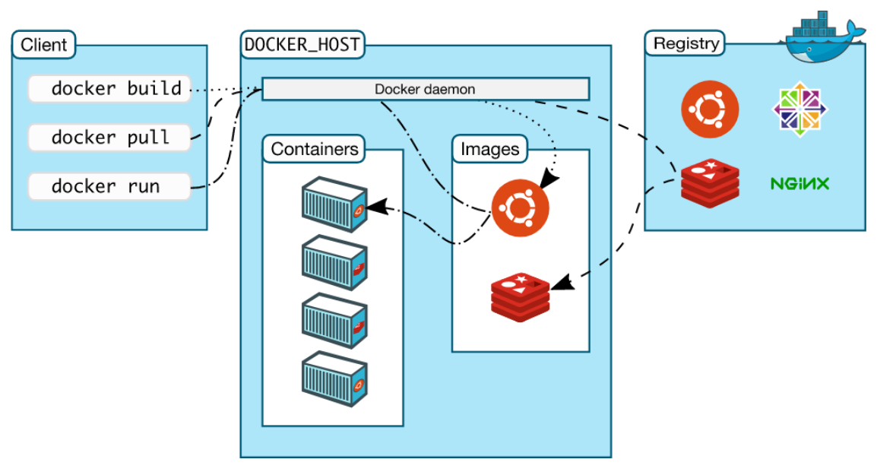

### Laboratorios

https://cloud.google.com/appengine/docs/standard/java11/runtime

https://cloud.google.com/appengine/docs/standard/java11/quickstart

## Cómputo contenerizado (App Engine Flex)

* Quiero instalar una libreria externa
* Quiero utilizar un lenguaje o runtime que no es soportado
* Quiero que mi código sea portable
* Quiero estandarizar los procesos de CI

### Acceso a VPC
* **Ambiente estándar**
  * Comunicación de una sola via por medio de un conector Serverless VPC access
* **Ambiente flexible**
  * Puedes especificaar la red en la que quieres desplegar tu servicio

### Sabores de App Engine
* **Ambiente estándar**
  * Runtimes específicos
  * Escala a cero y escala más rápida
  * Tu aplicación vive en una sandbox que restringe lo que se puede hacer
  * Despliegue en una sola zona. Si hay error se despliega en otra zona
* **Ambiente flexible**
  * Tu aplicación corre en un contenedor de Docker en una VM, que da más flexibilidad(escribir a disco, librerias, etc)
  * Minimo una instancia desplegada
  * Instanacias más grandes (CPU y memoria)
  * Utiliza grupos de instancias regionales, las instancias son distribuidas en múltiples regiones
  * Haciendo borrosa la línea del PaaS

Bifurcación de tráfico para diferentes versiones de despliegue

## Serverless

  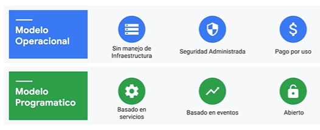

### Serverles y contenedores
* **Contenedores**
  * Cualquier lenguaje
  * Cualquier libreria
  * Cualquier binario
  * Ecosistema de imagenes base
  * Estandar de la industria

  

Es bueno combinar Serverless y contenedores

  

https://knative.dev/
https://cloud.google.com/run

* Knative es un cluster que ejecuta workloads sobre kebernetes
  * Opensource
  * Bloque Faas y Paas
  * Abstracción de cubernetes
  * Google corre todo en contenedores

### Cloud functions

* Permite construir y conectar servicios de la nube
* Orientado a eventos
* Ambiente totalmente administrado
* Pagas por lo que usas
* Escala automaticamente con el uso

  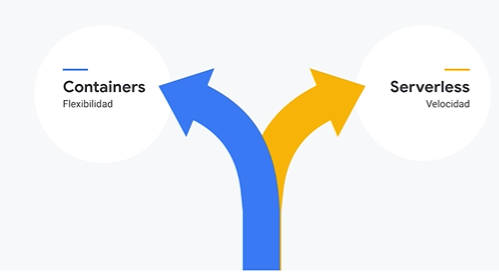

  

Son el pegamento en la nube

  

#### Evento detonador (Triggers)

Al almacenar un archivo

  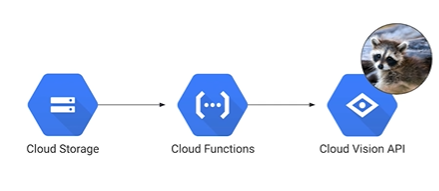

  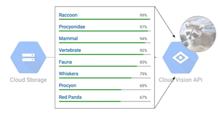

  

Mensajería empresarial asincrona

  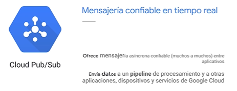

  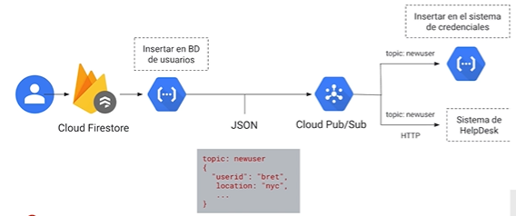

Para calendarización

  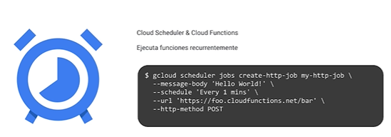

Controlar el escalamiento

  

  

Pool de conexiones a una Cloud functions, para que reutilize llamadas a la base de datos por ejemplo

  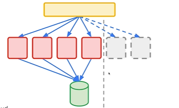

https://firebase.google.com/docs/functions

https://cloud.google.com/functions

# Continous Integration

# Kubernetes

# Machine learning