# Google Analytics <!-- omit in toc -->

> Básico de marketing

## Tabla de Contenido<!-- omit in toc -->
- [Introducción](#introducción)
  - [Conceptos base](#conceptos-base)
    - [Tenemos Cookies](#tenemos-cookies)
    - [Tipos de usuario y sesiones](#tipos-de-usuario-y-sesiones)
    - [Sesiones](#sesiones)
    - [En resumen](#en-resumen)
    - [Número de visitas a páginas y duración media de la sesión](#número-de-visitas-a-páginas-y-duración-media-de-la-sesión)
    - [Porcentaje de rebote](#porcentaje-de-rebote)
    - [Conceptos importantes](#conceptos-importantes)
- [Cuenta DEMO](#cuenta-demo)
- [Tu sitio con analytics](#tu-sitio-con-analytics)
  - [Tasa de conversión y micro-conversiones](#tasa-de-conversión-y-micro-conversiones)
  - [Reportes en GA](#reportes-en-ga)
    - [URL Tagging para campañas](#url-tagging-para-campañas)
    - [Entender cualquier sitio web](#entender-cualquier-sitio-web)

# Introducción

El embudo de ventas

  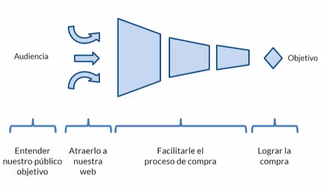

Esquema general

  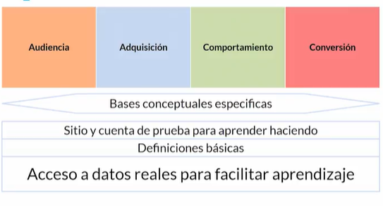

Examina un sitio web para saber que herramientas de analitica está usando

https://builtwith.com/es/

Sitio de prueba con datos publicos para Analytics

https://googlemerchandisestore.com

Crear una cuenta

https://analytics.google.com/

Esquema GA

  

## Conceptos base

### Tenemos Cookies

Usuarios es distinto de personas

  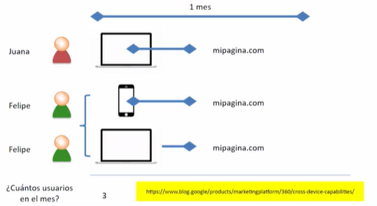

La suma de usuarios totales es distinto de usuarios totales

### Tipos de usuario y sesiones

* Nuevo
* Recurrentes

  

  

### Sesiones

  

  

### En resumen

  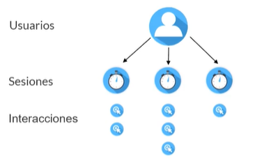

### Número de visitas a páginas y duración media de la sesión

  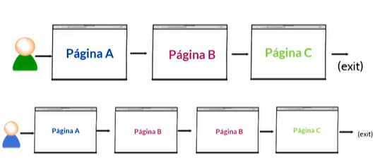

  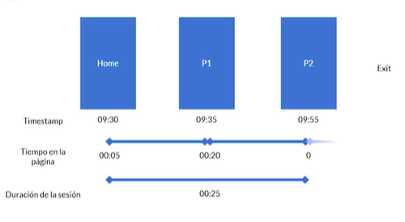

  

### Porcentaje de rebote

  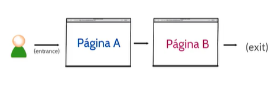

Entrada y salida de la sesión

Rebote misma entrada misma salida

  

  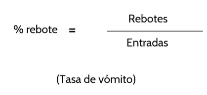

Páginas vistas, sesiones, rebotes, # de rebote

  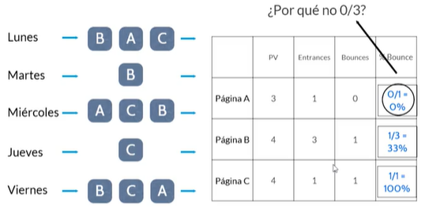

  

### Conceptos importantes

  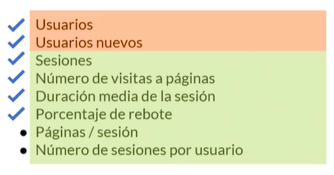

# Cuenta DEMO

https://googlemerchandisestore.com

  

https://support.google.com/analytics/answer/6367342?hl=es

# Tu sitio con analytics

Tag Assistant

https://chrome.google.com/webstore/detail/tag-assistant-by-google/kejbdjndbnbjgmefkgdddjlbokphdefk?hl=es

## Tasa de conversión y micro-conversiones

  

https://www.mercatitlan.com/blog/7-reportes-de-google-analytics-que-cualquier-marketer-deberia-saber

  

## Reportes en GA

  

  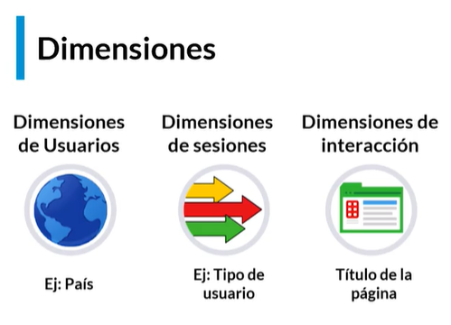

  

### URL Tagging para campañas

Para gestionar campañas de publicidad y estandarizar las URLs

https://ga-dev-tools.appspot.com/campaign-url-builder/

### Entender cualquier sitio web

https://www.similarweb.com

  

  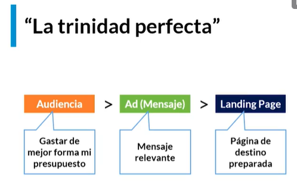

  

Planificación de medios

  

Optimizar las conversiones

  

Herramienta para optimizar conversiones, graba las acciones del usuario
Tag manager
https://www.inspectlet.com

Otra herramienta similar, pero que permite hacer heatmaps
https://www.hotjar.com

Probar A/B test

  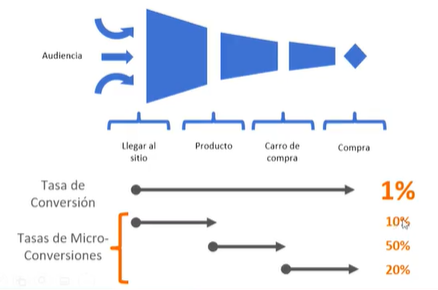

Modelos de atribución

  

Segmentos avanzados

  

https://supermetrics.com

Recursos

https://skillshop.exceedlms.com/student/path/2938?use_local=true
https://www.getonbrd.com
https://marketingplatform.google.com/about/

Más métricas

https://marketingplatform.google.com/about/

  

https://www.amazon.com.mx/dp/B00N95HZ92/ref=dp-kindle-redirect?_encoding=UTF8&btkr=1

  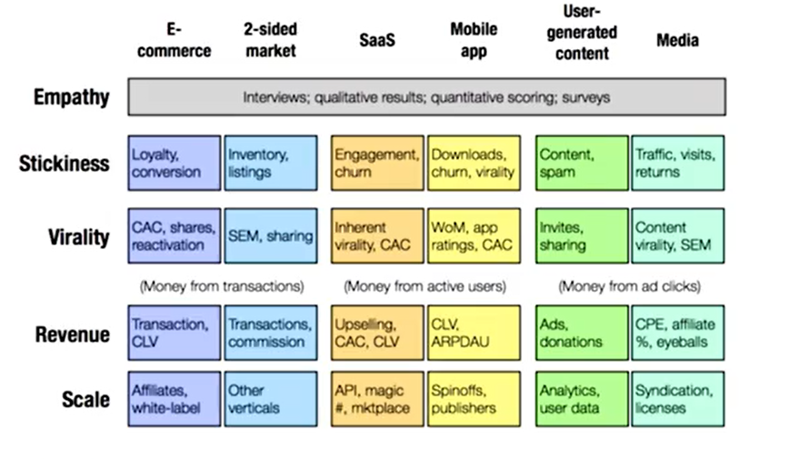

