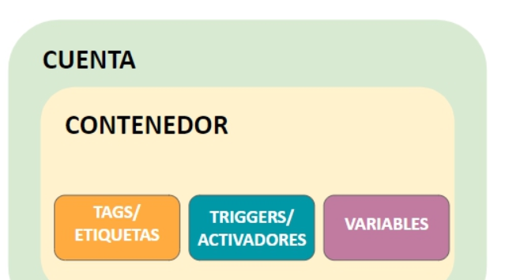
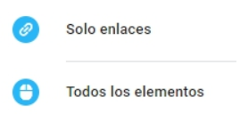
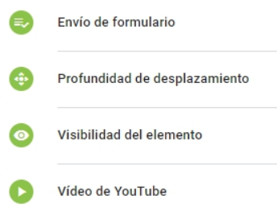
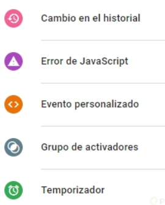
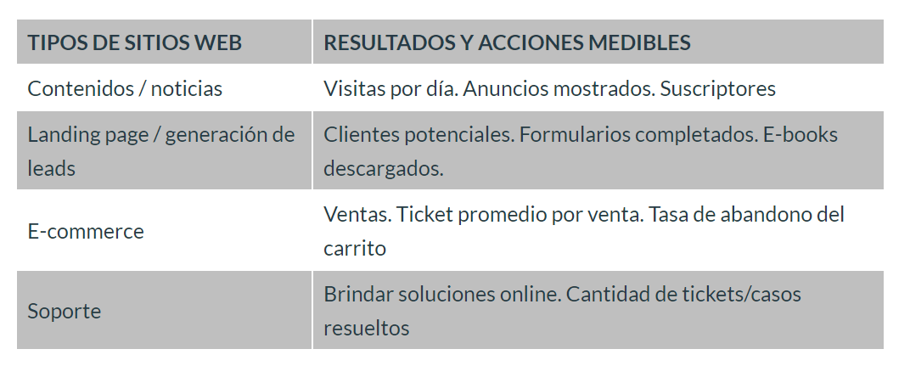

# Tag Manager <!-- omit in toc -->

> Básico de marketing

## Tabla de Contenido<!-- omit in toc -->
- [Introducción](#introducción)
- [Estrategía de implementación](#estrategía-de-implementación)
- [Crear una organización para tener el control](#crear-una-organización-para-tener-el-control)

# Introducción

Tag manager es un contenedor

  

Listado completo de etiquetas

https://support.google.com/tagmanager/answer/6106924?hl=es&ref_topic=3281056

Un trigger va a detectar cierto tipo de evento o acción generada en un sitio web, y le indicará a la etiqueta que se active. Considera que las etiquetas deben tener al menos un activador para poder accionarse.

Veamos los tipos de activadores que podemos utilizar con GTM:

Activador página vista:

  

Activador click:

  

Activador interacción del usuario:

  

Otro tipo de activadores:

  

# Estrategía de implementación

  

**Objetivo de la empresa:** incrementar ventas a través de su e-commerce, de bicicletas y accesorios para ciclismo, en un 5% de aquí a un año, en las provincias de Buenos Aires, Córdoba y Mendoza (Argentina).
**Táctica:** incrementar visitas al e-commerce a través de campañas de e-mail marketing y anuncios en Google Ads (red de búsqueda).
**Resultados y acciones medibles (por día):** número de usuarios registrados, número de ventas por producto, número de productos agregados al carrito, tasa de abandono del carrito, ticket promedio por venta de productos tipo “bicicleta”, ticket promedio por venta de productos tipo “accesorios”.

Otra variable que deberías considerar en tu plan de medición son los “segmentos”. Un segmento es un subconjunto de datos que nos brinda Google Analytics.

En este caso, deberíamos trabajar con los segmentos “datos demográficos de clientes” y “fuente”

Considera que la creación de un plan de medición te permitirá:

Crear un plan de implementación de etiquetas en el Tag Manager.
* Definir qué etiquetas incluir en el GTM y qué datos transferir desde las mismas.
* Disminuir el margen de error al momento de trabajar con analítica web.
* Optimizar los tiempos de trabajo.

# Crear una organización para tener el control 

https://support.google.com/marketingplatform/answer/9013751