# Algebra<!-- omit in toc -->

## Tabla de Contenido<!-- omit in toc -->
- [Importancia de las matemáticas](#importancia-de-las-matem%c3%a1ticas)
- [Conceptos Básicos](#conceptos-b%c3%a1sicos)
  - [Ley de los signos](#ley-de-los-signos)
  - [Signos de agrupación](#signos-de-agrupaci%c3%b3n)
  - [Ley de exponentes](#ley-de-exponentes)
  - [Lenguage algebraico y expresiones algebraicas](#lenguage-algebraico-y-expresiones-algebraicas)
    - [Reglas del lenguaje algebraico:](#reglas-del-lenguaje-algebraico)
- [Operaciones entre monomios](#operaciones-entre-monomios)
  - [Suma y resta](#suma-y-resta)
  - [Multiplicación](#multiplicaci%c3%b3n)
  - [División](#divisi%c3%b3n)
- [Productos notables](#productos-notables)
  - [Binomio al cuadrado](#binomio-al-cuadrado)
  - [Bionomio al cuadrado](#bionomio-al-cuadrado)
  - [Binomio a la n potencia](#binomio-a-la-n-potencia)
  - [Binomios conjugados](#binomios-conjugados)
- [Factorización](#factorizaci%c3%b3n)
  - [Factor común de monomios](#factor-com%c3%ban-de-monomios)
  - [Factor común por agrupación de términos](#factor-com%c3%ban-por-agrupaci%c3%b3n-de-t%c3%a9rminos)
    - [Trinomio cuadrado perfecto](#trinomio-cuadrado-perfecto)
  - [Diferencia de cuadrados perfectos](#diferencia-de-cuadrados-perfectos)
  - [TCP por adición y sustracción.](#tcp-por-adici%c3%b3n-y-sustracci%c3%b3n)
  - [Trinomio de la forma x^2+bx+c](#trinomio-de-la-forma-x2bxc)
- [Ecuaciones](#ecuaciones)
  - [Ecuaciones: Ecuaciones de primer grado](#ecuaciones-ecuaciones-de-primer-grado)
  - [Problemas de aplicación: Ecuaciones de primer grado.](#problemas-de-aplicaci%c3%b3n-ecuaciones-de-primer-grado)
  - [Sistemas de ecuaciones lineales](#sistemas-de-ecuaciones-lineales)
  - [Métodos de solución de problemas](#m%c3%a9todos-de-soluci%c3%b3n-de-problemas)
  - [Discriminantes en las Ecuaciones](#discriminantes-en-las-ecuaciones)
  - [Ecuaciones completas de segundo grado](#ecuaciones-completas-de-segundo-grado)
  - [Ecuaciones incompletas de segundo grado: Tipo 1](#ecuaciones-incompletas-de-segundo-grado-tipo-1)
  - [Ecuaciones lineales con fracciones](#ecuaciones-lineales-con-fracciones)

# Importancia de las matemáticas

https://www.youtube.com/watch?v=-TTtDlKkxIo

# Conceptos Básicos
En el álgebra usamos símbolos para representar las cantidades. Estos símbolos se pueden dividir en dos grupos:

- **Constantes:** Son cantidades que no cambian de valor, como el número **π** que siempre va a equivaler a 3,14 sin importar dónde estés. El número 100 siempre será 100.
- **Variables:** Son cantidades desconocidas y se representan mediante las últimas letras del alfabeto: u, v, w, x, y, z. Aunque puedes usar la letra o el símbolo que prefieras, no va a modificar los resultados. Estas cantidades pueden variar y somos nosotros quienes les damos valores.

Es importante que sepas que aunque las matemáticas son exactas, hay muchas maneras de llegar a un mismo resultado y el álgebra te da la libertad de explorar diferentes caminos y reglas para resolver problemas.

## Ley de los signos

Utilizamos en álgebra los mismos signos que en aritmética. Es importante repasar cómo se lee cada uno de estos y las diferentes maneras de expresarlos y escribirlos.

El signo es como tener un nombre y un apellido; así no veamos el signo antes de la variable o la constante, siempre estará allí.

* **Suma:** El signo para la suma es el “+”, que se lee más. También puede ser llamada “adición”.
> a + b se lee “a más b”
* **Resta:** El signo de la esta es “-”, que se lee menos. También puede ser llamada “sustracción”.
* a - b se lee “a menos b”
* **Multiplicación:** El signo de la multiplicación es “x” que se lee multiplicado por. También puede ser llamada “producto”.
> a x b se lee “a multiplicado por b”

Otra manera de representarla es:

> a.b equivale a “a x b”
(a)(b) equivale a “a x b”
ab equivale a “a x b”

* **División:** El signo de la división es “÷” que se lee dividido entre. También puede ser llamada “cociente”
> a ÷ b se lee “a entre b”

Otra manera de representarla es:
> a/b equivale a “a ÷ b”

Signos de relación: Utilizaremos estos signos para establecer la relación que existe entre dos cantidades:

=, entonces a=b se lee “a igual a b”
≠, entonces a≠b se lee “ a diferente a b”
, entonces a>b se lee “a mayor que b”
<, entonces a
≥, entonces a≥b se lee “a mayor o igual que”
≤, entonces a≤b se lee “a menor o igual que”

## Signos de agrupación

Los signos de agrupación nos van a ayudar bastante y serán de mucha ayuda para evitar cometer errores y mantener un orden. Los signos que conocemos son **paréntesis “()”, corchetes “[]” y llaves “{}”**.

Tienen un orden de jerarquía, entendiéndose que debe resolverse primero todo lo que esté encerrado en paréntesis, seguido de todo lo que esté entre corchetes y finalmente todo lo que esté encerrado en llaves.

## Ley de exponentes

Cuando tenemos cualquier expresión o elemento elevado a una potencia cualquiera, **al elemento lo llamamos base y al número pequeño que aparece encima de la base se le llama exponente.**

  

* La función de un exponente es **indicarnos cuántas veces se multiplica por sí misma nuestra base.**

* En un término que tenga una variable y una constante multiplicándose, hay que tener mucho cuidado el exponente a quién está afectando, ya que si está acompañando sólo a la constante, es ella quién será multiplicada por sí misma; si toda la expresión está encerrada en un paréntesis y la potencia está por fuera, entonces todo el término deberá ser elevado a la potencia indicada. En cambio si la potencia acompaña a la variable, sólo ésta será afectada.
* **Toda expresión que esté elevada a la cero** potencia dará como resultado “1”.
  

  

* **Multiplicación:** Cuando tenemos la misma base y exponentes iguales o diferentes. La regla es **sumar los exponentes.**
* **División:** Es más fácil expresar la división como una fracción porque identificamos nuestra base y su exponente. La regla es que al exponente del numerador (el que está arriba) le **restamos** el exponente que está en el denominador (el que está abajo).

  

* **Potencia de una potencia:** Tendremos una base elevada a una potencia y al mismo tiempo todo esto estará encerrado en un paréntesis y elevado a otra potencia. La regla consiste en multiplicar ambos exponentes.
* **Radicación:** Cambiamos de una raíz a una fracción y viceversa. Es importante saber que siempre que encontremos una expresión en forma de raíz es mejor pasarla a fracción para que se nos haga más fácil operarla. La regla consiste en que en exponente de la base va a ser nuestro numerador y el radical de nuestra raíz será el denominador.

## Lenguage algebraico y expresiones algebraicas

> **Lenguaje algebraico:** Conjunto de símbolos y reglas que se utilizan para la transmisión de ideas matemáticas.

### Reglas del lenguaje algebraico:

* Cada operación combinada en varias etapas tiene que estar precedida del **símbolo igual “=”**.
* Si el símbolo = está seguido por una raya de fracción, ésta debe aparecer a una altura intermedia entre las dos rayas del igual.
* El **número 1 puede omitirse** cuando está multiplicando a otro número o cuando actúa como exponente.
* **El símbolo de la multiplicación puede omitirse cuando a continuación del mismo aparecen unos paréntesis**, o cuando se indica el producto de dos variables (letras).

> **Expresión algebraica:** Combinación de números, letras y símbolos de operaciones matemáticas, que respeta las reglas del lenguaje algebraico.

  

# Operaciones entre monomios

## Suma y resta
Al momento de sumar o restar polinomios:

**Un polinomio se resuelve de la misma manera que un monomio**, sólo que teniendo en cuenta más términos.

La receta siempre es **ubicar primer términos semejantes**. Una vez ubicados, podrás sumar o restar dependiendo de lo que te pida el problema.

Es importante cuando se está restando expresar los polinomios entre signos de paréntesis para tener claro que el menos está afectando y cambiando el signo a todo lo que está dentro del paréntesis que va después de la resta.
Recuerda cambiar el signo únicamente a la expresión que estamos restando, la que está a la derecha.

  

## Multiplicación

Ten en cuenta cuando estás multiplicando:

**El número que acompaña a la variable (letra) o la precede es el coeficiente, que es una constante y multiplica a la variable.** Cuando se tienen expresiones de la misma base (misma letra), sus exponentes se suman.

  

## División

Ten en cuenta al momento de dividir entre monomios:

El coeficiente que acompaña a la variable se divide normalmente. **La ley de los exponentes nos dice que cuando dividimos expresiones con la misma base (letra), los exponentes se van a restar.** Al nominador se le resta el denominador.

  

# Productos notables

## Binomio al cuadrado

**Un binomio es aquél que cuenta con dos términos**, los cuales están **separados por signos**. Los podemos encontrar separados por paréntesis y nos indicará que todo lo que esté dentro del paréntesis va a estar elevado al cuadrado. La regla nos dice que **el resultado del binomio al cuadrado será el primer término al cuadrado** **más dos veces el primer término por el segundo término más el segundo término al cuadrado.**

Estas reglas siempre se cumplirán y no es necesario hacer las multiplicaciones, haciendo más fácil el resolver el problema.

El signo del medio de nuestro binomio al cuadrado será el primer signo de nuestro resultado. En el resultado siempre los signos del primer y tercer términos serán positivos.

Cuando estás elevando una fracción al cuadrado, tanto numerador como denominador serán elevados al cuadrado de manera independiente.

  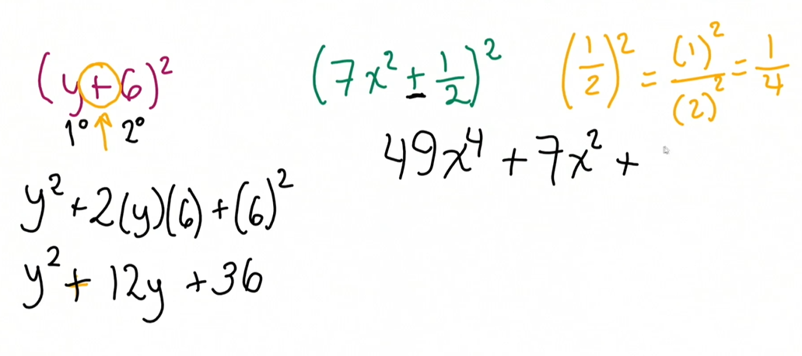

## Bionomio al cuadrado

Elevar al cuadrado a+b equivale a multiplicar este binomio por si mismo y tendremos:

  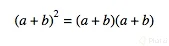

Realizando la operación tenemos

  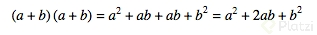

El cuadrado de dos cantidades es igual al cuadrado de la primera cantidad más el duplo de la primera cantidad por la segunda más el cuadrado de la segunda cantidad.

Escribir por simple inspección el resultado de:

  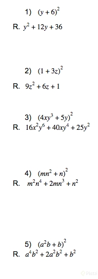

## Binomio a la n potencia

**Cuando elevamos un factor (como un binomio con dos términos) al cuadrado, quiere decir que vamos a multiplicar ese factor dos veces**, **al cubo se multiplicaría a sí mismo 3 veces y así.** Para hacer estas multiplicaciones más fáciles contamos con algo llamado el **triángulo de Pascal** que nos dará los coeficientes que vamos a tener en nuestros binomios elevados a x potencia.

> El triángulo de Pascal se realiza comenzando la primera línea (punta) con un 1, la segunda línea con dos términos (ambos unos), la tercera con un uno en cada esquina y en el medio la sumatoria de los términos de arriba y así consecutivamente cada línea.

  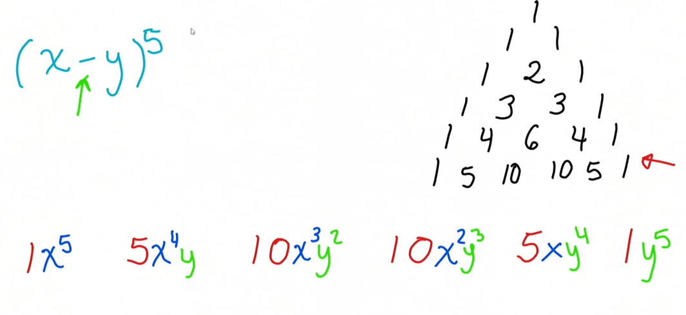

El exponente al cual está elevado nuestra expresión nos dará el valor máximo del grado de nuestras variables (lo cual se ve reflejado en los términos de las esquinas) Siempre que tengamos un signo negativo en nuestro binomio, los signos irán alternados (primero positivo) en el resultado.

## Binomios conjugados

Un **binomio es un producto entre dos términos** y c**onjugado quiere decir que tendremos los mismos términos del binomio en un lado como en el otro con signos contrarios (uno positivo y otro negativo)**

> La regla nos dice que al efectuar el producto entre estos términos tendremos una diferencia de cuadrados perfectos donde elevamos nuestro primer término al cuadrado menos el segundo término al cuadrado.

  

# Factorización

* **Factor:** Es aquello que nos resulta de un producto. Por ejemplo, si multiplicamos X por 3, un factor es X y el otro factor es 3. Un factor puede ser tanto una variable como una constante.
* **Común:** Todos los términos de muestro monomio tienen a este factor. A todos ellos podemos extraerles este factor común.
* **Monomio:** Es un sólo término con su respectivo signo.

> **Factorización:** Es hacer más pequeña nuestra expresión.

## Factor común de monomios

* Al factorizar con factor común monomio, **se debe buscar qué términos se repiten en cada una de las constantes o variables de nuestro monomio.**
* También se debe sacar como factor a nuestras constantes o números que acompañan a las letras o variables. Para hacer eso, se debe encontrar que todas las expresiones sean divisibles por un número. Ese número es el factor a sacar.

  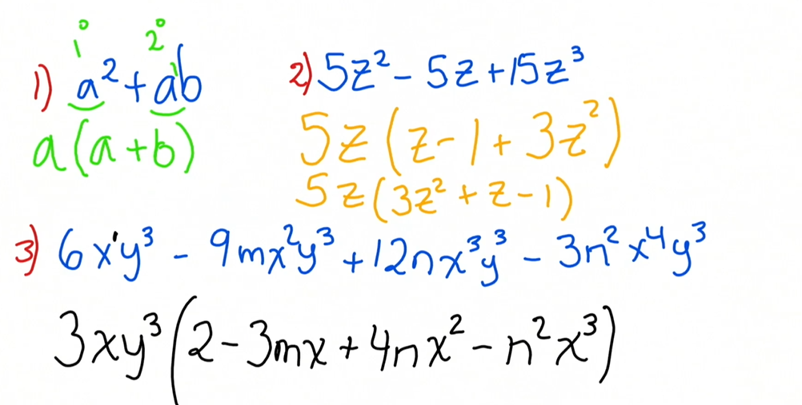

## Factor común por agrupación de términos

**Una agrupación de términos es un factor común polinomio.**

* Para factorizar primero debes saber **identificar cómo vas a formar los factores**. Aquí tratamos de conseguir dos factores o más en los que al multiplicarlos, obtenemos la expresión original.
* Se comienza haciendo un paso parecido al anterior caso, y es el de buscar qué factor común se puede sacar de un grupo de expresiones.
* **Es buena idea comenzar buscando las constantes que sean iguales** en un grupo de expresiones para sacarlas como factor.
* **Es importante que te fijes en los signos**, ya que dependiendo de cómo estén organizados en la expresión original, van a cambiar su orden en su equivalente factorizado.

> La factorización hace lo contrario a los productos notables.

  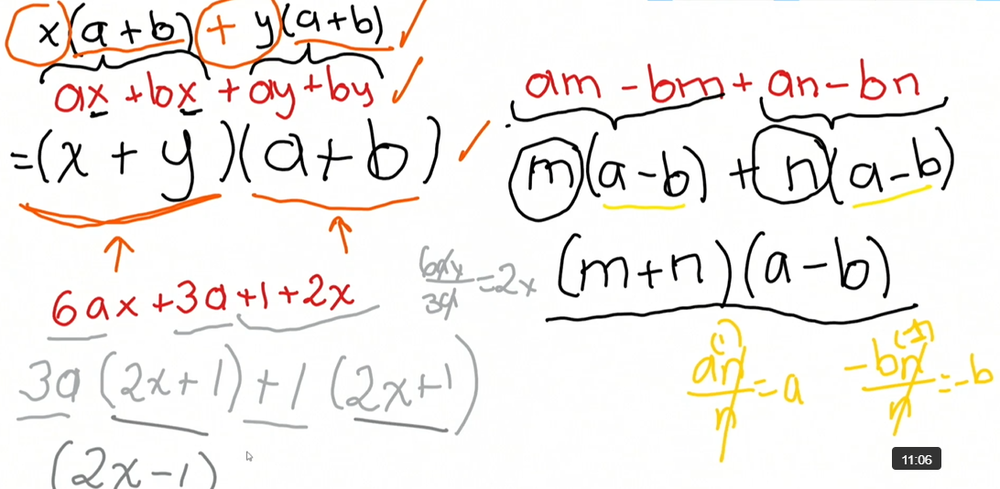

### Trinomio cuadrado perfecto

* Anteriormente aprendimos cómo resolver el binomio cuadrado. Ahora vamos a ir de reversa, factorizando hasta volver al binomio cuadrado.

Para realizar esta factorización:

Debemos verificar que se trate de un trinomio cuadrado perfecto:
* Debemos tener 3 términos, o sea un trinomio.
* Nuestro primer término y nuestro tercero (ordenando nuestro trinomio) tengan raíces cuadradas perfectas, estando las variables elevadas a exponentes pares.
* Multiplicamos el valor de la raíz del primer y tercer términos, todo eso multiplicado por dos. El resultado tiene que darnos lo mismo que el valor del segundo término de nuestro trinomio.
* Una vez adquieres experiencia sacando las raíces sin necesidad de operaciones algebraicas, basta con extraer las raíces, extraer el signo y elevarlo todo al cuadrado.

  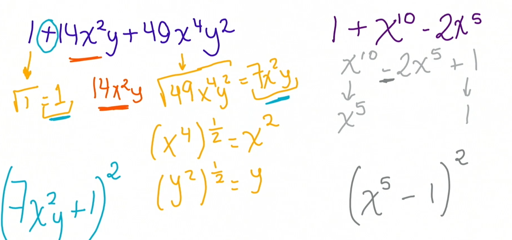

## Diferencia de cuadrados perfectos

Cuando una expresión no cede o se te dificulta el resolverla tienes que ir buscando e identificando qué tipo de expresión es, para elegir el caso de factorización adecuado.

* Puedes identificar fácilmente que es una diferencia de cuadrados perfectos porque los términos van a estar restando y cada uno elevado al cuadrado (que se le pueda sacar raíz cuadrada)
* Se resuelve encontrando las raíces, abriendo y cerrando un par de paréntesis y en ambos se colocan las raíces; el orden debe ser tal cual aparece en nuestra expresión original. Uno de los paréntesis va a llevar un más y otro un menos.
* Al factorizar vamos a tener binomios conjugados. Binomios porque son dos términos y conjugados porque uno de los términos tiene el signo positivo y otro el negativo.

  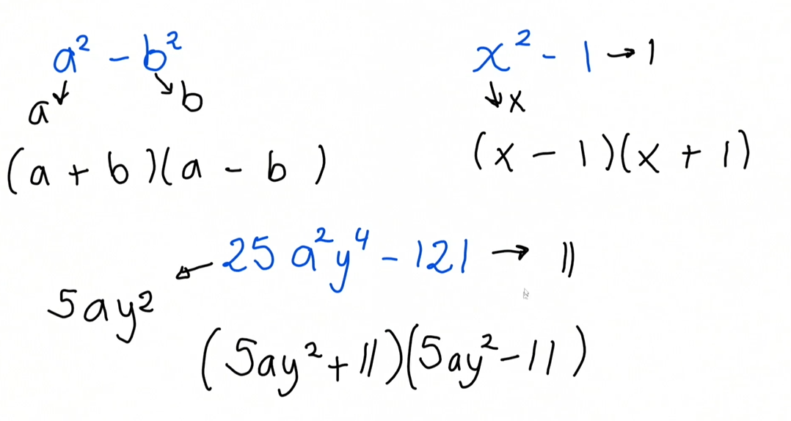

## TCP por adición y sustracción.

> El TCP por adición y sustracción también es conocido como el método para completar cuadrados. Este método es muy parecido al trinomio cuadrado perfecto con algunas diferencias en su segundo término.

Debemos verificar que tenemos un trinomio.

* El primer y segundo término deben tener una raíz cuadrada perfecta.
* En el segundo término es donde difiere este método con el del trinomio cuadrado perfecto puesto que no se cumple que su valor sea igual al primer y tercer término multiplicados por 2.
* Resolvemos el sistema como si fuera un trinomio cuadrado perfecto, y lo que nos haga falta para tener el segundo término completo (que cumpla las leyes del trinomio cuadrado perfecto) lo vamos a sumar y para no perder el equilibrio en el sistema, lo vamos a restar igualmente. Lo que ponemos lo tenemos que quitar.
* Factorizamos normalmente como un trinomio cuadrado perfecto, dejando por fuera del paréntesis resultante la parte que restamos en pasos anteriores al equilibrar el sistema.
* En muchos casos la expresión resultante será una diferencia de cuadrados perfectos, la cual podremos factorizar nuevamente.

Es recomendable dejar el sistema siempre en su mínima expresión.

  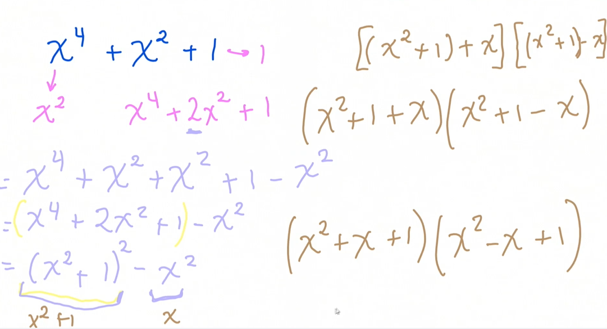

## Trinomio de la forma x^2+bx+c

Para este caso de factorización, **debemos tener mucho cuidado que nuestro primer término (que debe estar al cuadrado)**, no esté acompañado de una constante o número; adicional el segundo término debe tener un número acompañando la variable del primer término pero sin estar elevada al cuadrado; y el tercer término debe ser una constante sola.

* Debemos abrir dos factores o paréntesis. El primer término de cada paréntesis será la raíz cuadrada del primer término de nuestra expresión original.
* Debemos buscar factores de nuestro tercer término de la expresión original; es decir, números que multiplicados entre sí nos den el valor de ese término, teniendo en cuenta que si el término es negativo, uno de los factores debe ser positivo y el otro negativo y si es positivo, ambos factores deben ser positivos o negativos.
* Una vez tengamos los factores, debemos seleccionar los dos que sumados o restados, nos den el valor de la constante que está en el segundo término de la expresión original. Esos dos factores serán los que vayan en los segundos términos de cada uno de los dos paréntesis.

  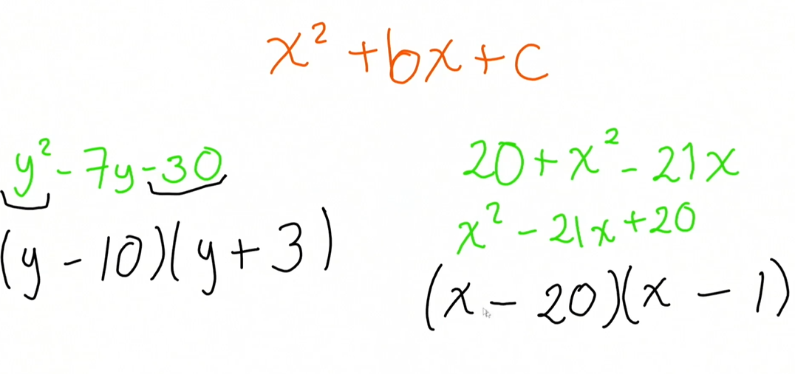

# Ecuaciones

* **Variable:** Son las últimas letras del alfabeto, nos muestran cantidades desconocidas.
* **Constantes:** No cambian nunca, su valor es fijo como los números constantes, racionales o a veces podemos usar letras como a y b.
* **Miembros:** Todo lo que esté antes del igual es el primer miembro y todo lo que esté después del igual será nuestro segundo miembro.
* **Términos:** Cada uno de los elementos de la ecuación separados por un signo.
* **Grado:** Es el exponente de mayor valor que tenemos en la ecuación.
Solución: Es el valor final de nuestra variable.
* **Ecuaciones Lineales:** Son aquellas que sólo tienen una incógnita y su grado mayor es 1. Nos describen una línea recta.
* **Ecuaciones de segundo grado o ecuaciones cuadráticas:** Serán ecuaciones de segundo grado y el saber factorizar nos ayudará mucho para resolverlas.

## Ecuaciones: Ecuaciones de primer grado

Para poder resolver ecuaciones de primer grado debemos hacer uso de la transposición. **La transposición consiste en que una operación se convierte en otra pasándola al otro lado de la igualdad.**

* Transposición de la suma: Pasa a restar al 2do miembro.
* Transposición de la resta: Pasa a sumar al 2do miembro.
* Transposición de la multiplicación: Pasa a dividir al 2do miembro.
* Transposición de la división: Pasa a multiplicar al 2do miembro.

> La finalidad con las ecuaciones es encontrar el valor de nuestras variables.

* Debemos identificar nuestra variable.
* Debemos dejar nuestras variables en el primer miembro (lado izquierdo de la igualdad) y las constantes en el segundo miembro (lado derecho de la igualdad)

Resolveremos la ecuación usando las transposiciones que necesitemos.

  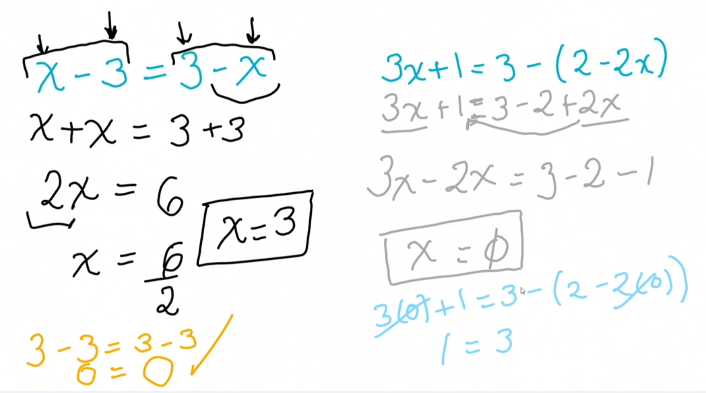

## Problemas de aplicación: Ecuaciones de primer grado.

Aunque este tipo de problemas podrían ser resueltos “al tanteo”, es más fácil, rápido y recomendable aprender a hacerlo resolviendo ecuaciones de primer grado porque es la base para poder resolver ecuaciones más complejas de grados superiores.

  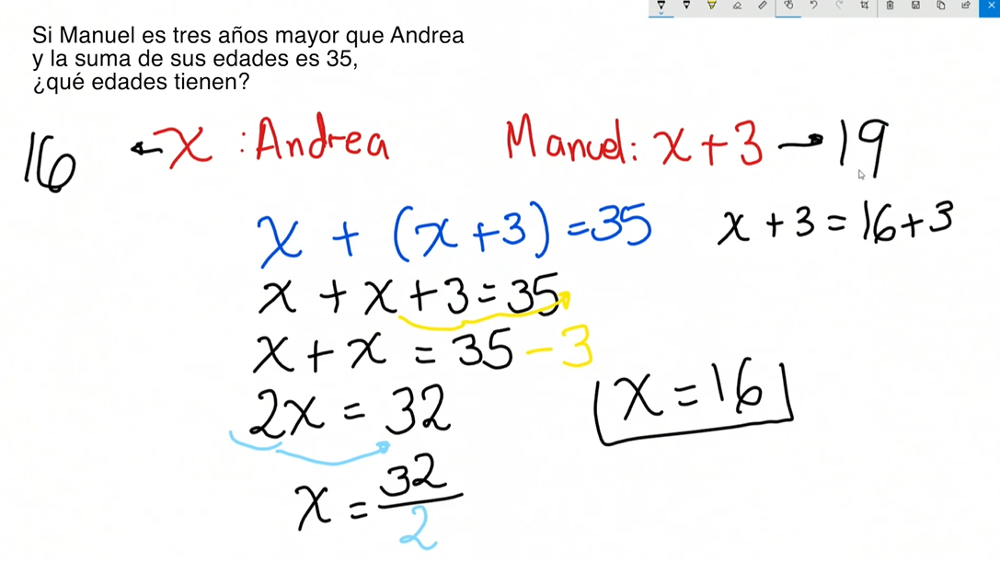

  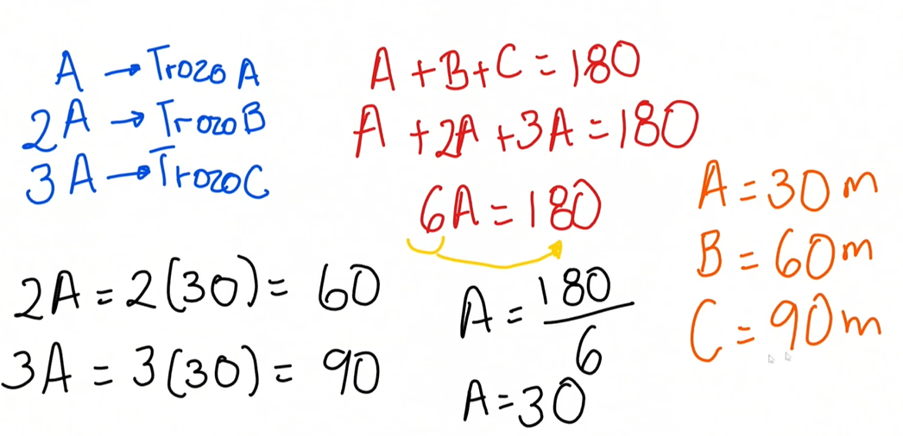

## Sistemas de ecuaciones lineales

**Cuando tenemos dos incógnitas o más**, estamos hablando de un sistema de ecuaciones. De acuerdo al número de incógnitas, tendremos como mínimo ese mismo número de ecuaciones para resolver el sistema.

## Métodos de solución de problemas

Solución de sistemas de ecuaciones:

* **Igualación:** Igualamos una ecuación con otra para obtener el resultado de una variable.
* **Sustitución:** Despejamos una variable para sustituirla en otra ecuación.
* **Eliminación:** Es comúnmente llamado de suma y resta porque eliminaremos al tiempo la misma variable en dos ecuaciones para obtener el resultado de la otra.
* **Gráfico:** Lo omitiremos porque no se utiliza más. Se ponen puntos, se dibujan rectas y donde se crucen, esa será la solución. Es un método bonito pero tardado, no se usa porque actualmente tenemos mejores herramientas.
* **Cramer:** Se resuelve a partir de determinantes y matrices.

> Para resolver una ecuación lineal, primero debemos identificar cuál es el método que mejor se adapta a nuestro sistema de ecuaciones.

> **Sustitución:** Se elige cuando se tiene una variable en una de las ecuaciones sin coeficiente.
  
  * Enumeramos las dos ecuaciones, siendo la primera la que tiene la variable sin coeficiente.
  * Despejamos la variable sin coeficiente de la ecuación número 1 y a la ecuación resultante la enumeraremos como 3.
  * En la ecuación 2, reemplazamos la variable que despejamos anteriormente. De esta manera obtendremos el equivalente de la otra variable.
  * Al tener el valor de una de las variables, podemos reemplazar su valor en cualquiera de las ecuaciones iniciales para obtener el valor de la que nos falta.

> Para confirmar que tenemos el resultado adecuado podemos reemplazar los valores de las variables en las ecuaciones iniciales y comprobar que se cumplan las igualdades.

  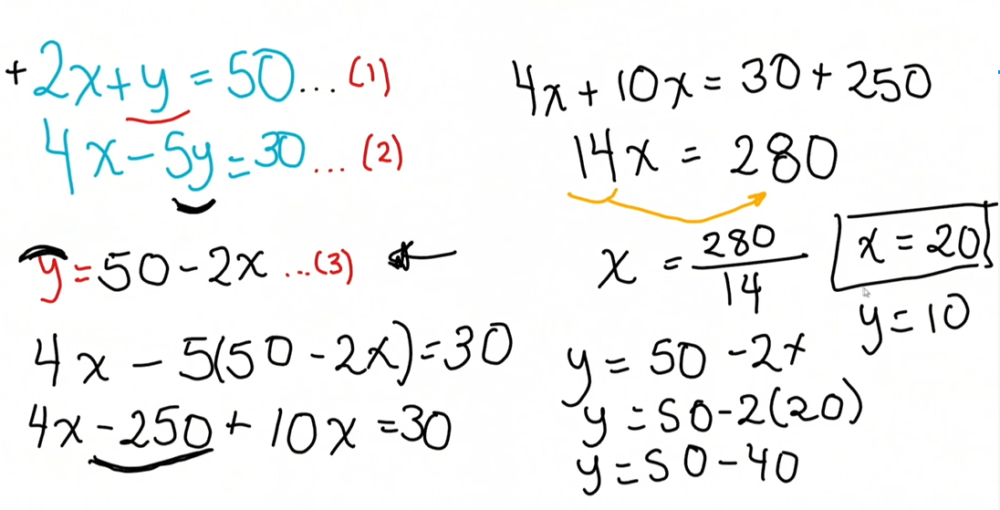

> **Eliminación:** Eliminaremos una variable ayudándonos de operaciones aritméticas.

* Elegimos la variable que en una de las ecuaciones aparezca con signo positivo y en la otra con signo negativo. O bien aquella variable que aparezca en una de las dos ecuaciones sin coeficiente.
* De la variable que elijamos, debemos identificar cuáles son sus coeficientes. Toda la ecuación 1 será multiplicada por el coeficiente de la variable de la segunda ecuación y toda la segunda ecuación será multiplicada por el coeficiente de la variable de la primera ecuación.
* Tendremos como resultado las ecuaciones 3 y 4, las cuales tendrán el mismo valor en la variable que elegimos pero con signos contrarios. Esto nos permite eliminar la variable de ambas ecuaciones.
* Sumamos la variable que quedó de las dos ecuaciones y también sus constantes. De ahí podemos despejar esta variable que queda y hallar su resultado
* Reemplazamos la variable que hallamos en cualquiera de nuestras ecuaciones iniciales y así obtenemos el resultado de la variable faltante.

> **Igualación:** Tenemos que establecer una igualdad entre la primera ecuación y la segunda.

* Elegimos una de las variables y la despejamos en ambas ecuaciones.
Igualamos la parte derecha del igual de ambas ecuaciones.
* Despejamos la variable que nos quedó en la ecuación resultante, hallando su valor.
* Reemplazamos el valor de la variable hallada en una de las ecuaciones iniciales para hallar el valor de la variable faltante.

  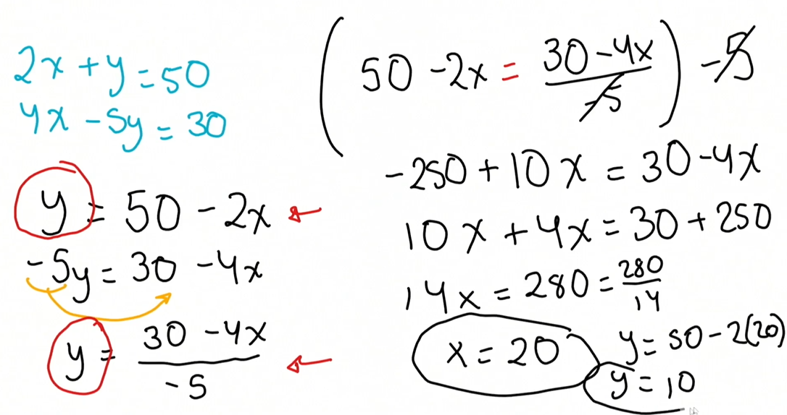

## Discriminantes en las Ecuaciones

**Una ecuación cuadrática es aquella que tiene variables de segundo grado.**

> Antes de resolver estas ecuaciones es muy útil que conozcas el discriminante el cual es igual al **coeficiente del segundo término al cuadrado menos 4 veces el coeficiente del primer término por el tercero.**

* Si el discriminante es positivo, la ecuación tiene dos soluciones.
* Si el discriminante es 0, la ecuación tiene una sola solución.
* Si el discriminante es negativo, no tiene soluciones reales, sólo imaginarias.
* El discriminante nos sirve porque nos ahorra al decirnos rápido si una ecuación tiene solución o no.

  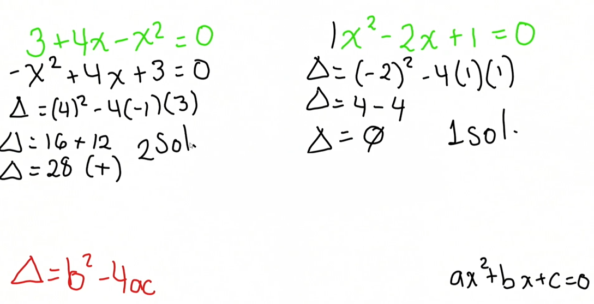

## Ecuaciones completas de segundo grado

> La fórmula general es la mejor herramienta para no cometer errores y aunque puede resultar enredada podremos aprenderla después de un tiempo. Nos sirve para encontrar las raíces o soluciones a nuestras ecuaciones cuadráticas (de segundo grado).

Podemos resolver todas las ecuaciones cuadráticas usando la fórmula general o por medio de factorización con trinomios cuadrados.

  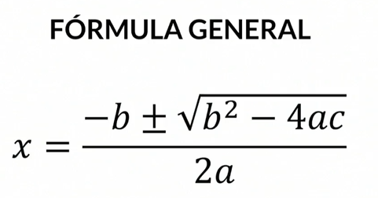

  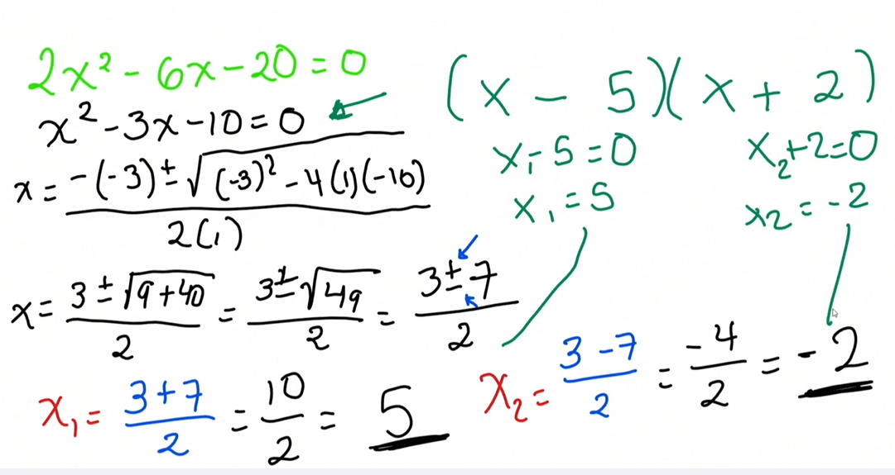

## Ecuaciones incompletas de segundo grado: Tipo 1

  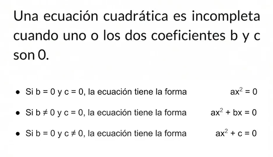

  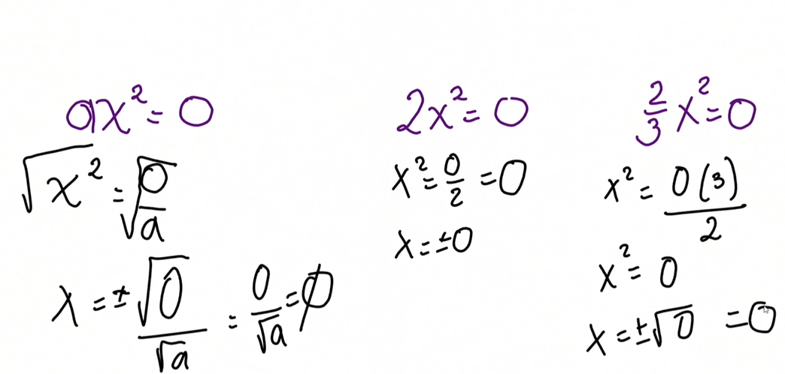

  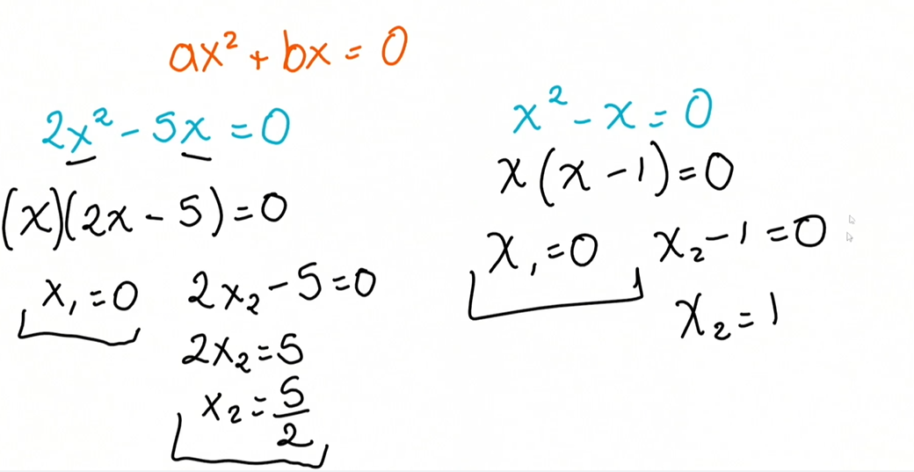

  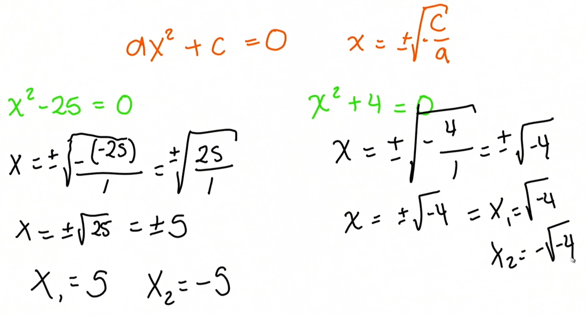

## Ecuaciones lineales con fracciones

  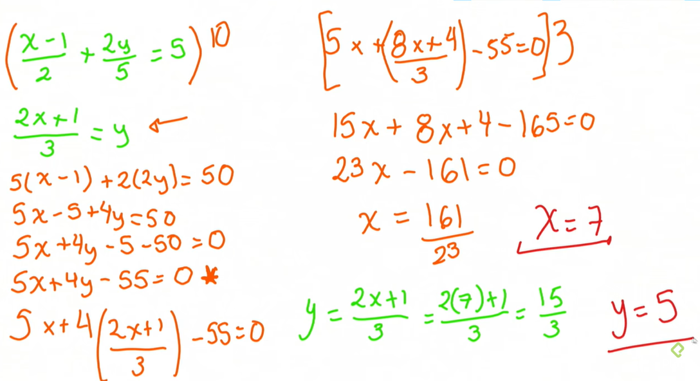

  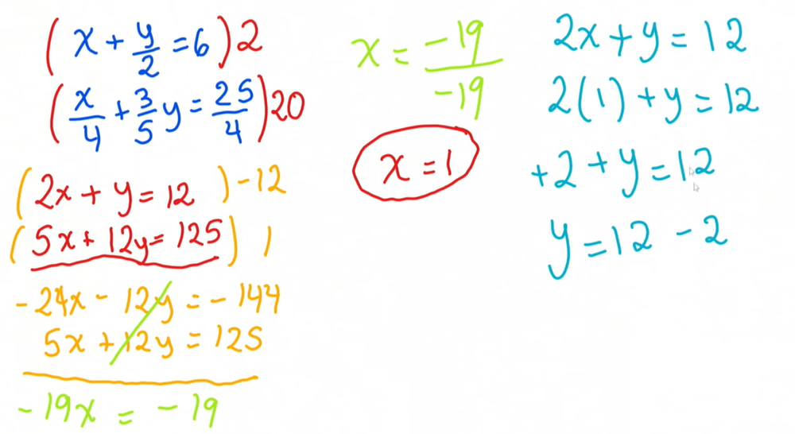

