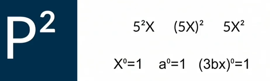
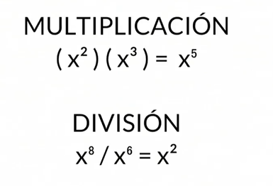
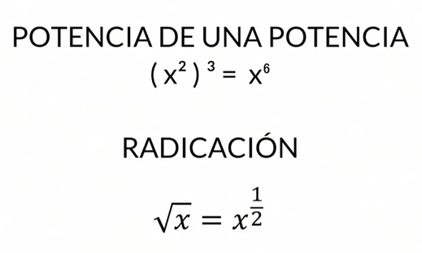
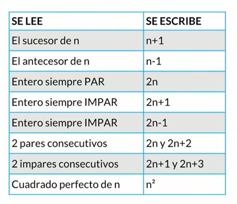
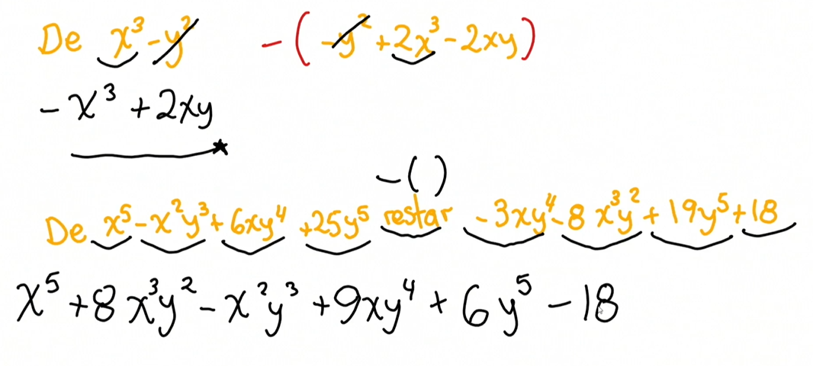
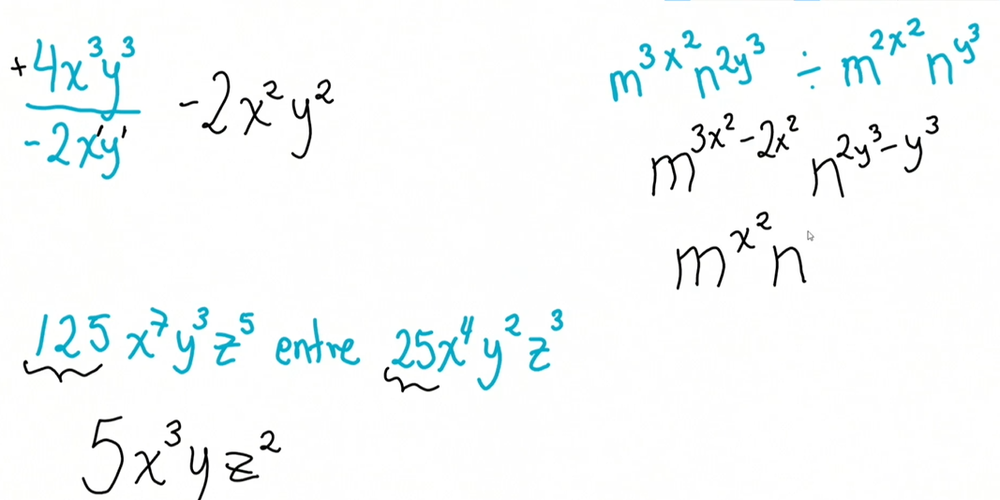

# Algebra<!-- omit in toc -->

## Tabla de Contenido<!-- omit in toc -->
- [Importancia de las matemáticas](#importancia-de-las-matem%c3%a1ticas)
- [Conceptos Básicos](#conceptos-b%c3%a1sicos)
  - [Ley de los signos](#ley-de-los-signos)
  - [Signos de agrupación](#signos-de-agrupaci%c3%b3n)
  - [Ley de exponentes](#ley-de-exponentes)
  - [Lenguage algebraico y expresiones algebraicas](#lenguage-algebraico-y-expresiones-algebraicas)
    - [Reglas del lenguaje algebraico:](#reglas-del-lenguaje-algebraico)
- [Operaciones entre monomios](#operaciones-entre-monomios)
  - [Suma y resta](#suma-y-resta)
  - [Multiplicación](#multiplicaci%c3%b3n)
  - [División](#divisi%c3%b3n)
- [Productos notables](#productos-notables)

# Importancia de las matemáticas

https://www.youtube.com/watch?v=-TTtDlKkxIo

# Conceptos Básicos
En el álgebra usamos símbolos para representar las cantidades. Estos símbolos se pueden dividir en dos grupos:

- **Constantes:** Son cantidades que no cambian de valor, como el número **π** que siempre va a equivaler a 3,14 sin importar dónde estés. El número 100 siempre será 100.
- **Variables:** Son cantidades desconocidas y se representan mediante las últimas letras del alfabeto: u, v, w, x, y, z. Aunque puedes usar la letra o el símbolo que prefieras, no va a modificar los resultados. Estas cantidades pueden variar y somos nosotros quienes les damos valores.

Es importante que sepas que aunque las matemáticas son exactas, hay muchas maneras de llegar a un mismo resultado y el álgebra te da la libertad de explorar diferentes caminos y reglas para resolver problemas.

## Ley de los signos

Utilizamos en álgebra los mismos signos que en aritmética. Es importante repasar cómo se lee cada uno de estos y las diferentes maneras de expresarlos y escribirlos.

El signo es como tener un nombre y un apellido; así no veamos el signo antes de la variable o la constante, siempre estará allí.

* **Suma:** El signo para la suma es el “+”, que se lee más. También puede ser llamada “adición”.
> a + b se lee “a más b”
* **Resta:** El signo de la esta es “-”, que se lee menos. También puede ser llamada “sustracción”.
* a - b se lee “a menos b”
* **Multiplicación:** El signo de la multiplicación es “x” que se lee multiplicado por. También puede ser llamada “producto”.
> a x b se lee “a multiplicado por b”

Otra manera de representarla es:

> a.b equivale a “a x b”
(a)(b) equivale a “a x b”
ab equivale a “a x b”

* **División:** El signo de la división es “÷” que se lee dividido entre. También puede ser llamada “cociente”
> a ÷ b se lee “a entre b”

Otra manera de representarla es:
> a/b equivale a “a ÷ b”

Signos de relación: Utilizaremos estos signos para establecer la relación que existe entre dos cantidades:

=, entonces a=b se lee “a igual a b”
≠, entonces a≠b se lee “ a diferente a b”
, entonces a>b se lee “a mayor que b”
<, entonces a
≥, entonces a≥b se lee “a mayor o igual que”
≤, entonces a≤b se lee “a menor o igual que”

## Signos de agrupación

Los signos de agrupación nos van a ayudar bastante y serán de mucha ayuda para evitar cometer errores y mantener un orden. Los signos que conocemos son **paréntesis “()”, corchetes “[]” y llaves “{}”**.

Tienen un orden de jerarquía, entendiéndose que debe resolverse primero todo lo que esté encerrado en paréntesis, seguido de todo lo que esté entre corchetes y finalmente todo lo que esté encerrado en llaves.

## Ley de exponentes

Cuando tenemos cualquier expresión o elemento elevado a una potencia cualquiera, **al elemento lo llamamos base y al número pequeño que aparece encima de la base se le llama exponente.**

  

* La función de un exponente es **indicarnos cuántas veces se multiplica por sí misma nuestra base.**

* En un término que tenga una variable y una constante multiplicándose, hay que tener mucho cuidado el exponente a quién está afectando, ya que si está acompañando sólo a la constante, es ella quién será multiplicada por sí misma; si toda la expresión está encerrada en un paréntesis y la potencia está por fuera, entonces todo el término deberá ser elevado a la potencia indicada. En cambio si la potencia acompaña a la variable, sólo ésta será afectada.
* **Toda expresión que esté elevada a la cero** potencia dará como resultado “1”.
  

  

* **Multiplicación:** Cuando tenemos la misma base y exponentes iguales o diferentes. La regla es **sumar los exponentes.**
* **División:** Es más fácil expresar la división como una fracción porque identificamos nuestra base y su exponente. La regla es que al exponente del numerador (el que está arriba) le **restamos** el exponente que está en el denominador (el que está abajo).

  

* **Potencia de una potencia:** Tendremos una base elevada a una potencia y al mismo tiempo todo esto estará encerrado en un paréntesis y elevado a otra potencia. La regla consiste en multiplicar ambos exponentes.
* **Radicación:** Cambiamos de una raíz a una fracción y viceversa. Es importante saber que siempre que encontremos una expresión en forma de raíz es mejor pasarla a fracción para que se nos haga más fácil operarla. La regla consiste en que en exponente de la base va a ser nuestro numerador y el radical de nuestra raíz será el denominador.

## Lenguage algebraico y expresiones algebraicas

> **Lenguaje algebraico:** Conjunto de símbolos y reglas que se utilizan para la transmisión de ideas matemáticas.

### Reglas del lenguaje algebraico:

* Cada operación combinada en varias etapas tiene que estar precedida del **símbolo igual “=”**.
* Si el símbolo = está seguido por una raya de fracción, ésta debe aparecer a una altura intermedia entre las dos rayas del igual.
* El **número 1 puede omitirse** cuando está multiplicando a otro número o cuando actúa como exponente.
* **El símbolo de la multiplicación puede omitirse cuando a continuación del mismo aparecen unos paréntesis**, o cuando se indica el producto de dos variables (letras).

> **Expresión algebraica:** Combinación de números, letras y símbolos de operaciones matemáticas, que respeta las reglas del lenguaje algebraico.

  

# Operaciones entre monomios

## Suma y resta
Al momento de sumar o restar polinomios:

**Un polinomio se resuelve de la misma manera que un monomio**, sólo que teniendo en cuenta más términos.

La receta siempre es **ubicar primer términos semejantes**. Una vez ubicados, podrás sumar o restar dependiendo de lo que te pida el problema.

Es importante cuando se está restando expresar los polinomios entre signos de paréntesis para tener claro que el menos está afectando y cambiando el signo a todo lo que está dentro del paréntesis que va después de la resta.
Recuerda cambiar el signo únicamente a la expresión que estamos restando, la que está a la derecha.

  

## Multiplicación

Ten en cuenta cuando estás multiplicando:

**El número que acompaña a la variable (letra) o la precede es el coeficiente, que es una constante y multiplica a la variable.** Cuando se tienen expresiones de la misma base (misma letra), sus exponentes se suman.

  

## División

Ten en cuenta al momento de dividir entre monomios:

El coeficiente que acompaña a la variable se divide normalmente. **La ley de los exponentes nos dice que cuando dividimos expresiones con la misma base (letra), los exponentes se van a restar.** Al nominador se le resta el denominador.

  

# Productos notables