# Cálculo multivariable<!-- omit in toc -->

## Tabla de Contenido<!-- omit in toc -->
- [Ecuaciones parametricas y coordenadas polares](#ecuaciones-parametricas-y-coordenadas-polares)
  - [Ejemplo](#ejemplo)
  - [Coordenadas polares](#coordenadas-polares)
  - [Curvas polares](#curvas-polares)
  - [Coordenadas cartesianas a coordenadas polares](#coordenadas-cartesianas-a-coordenadas-polares)
    - [Ejemplo](#ejemplo-1)
- [Geometria del espacio](#geometria-del-espacio)
  - [Sistemas tridimensionales de coordenadas](#sistemas-tridimensionales-de-coordenadas)
    - [Ejemplo](#ejemplo-2)
  - [Gráficas en tres dimensiones](#gráficas-en-tres-dimensiones)
  - [Distancia entre dos puntos en el espacio](#distancia-entre-dos-puntos-en-el-espacio)
- [Vectores y planos](#vectores-y-planos)
  - [¿Qué es un vector?](#qué-es-un-vector)
    - [Ejemplo](#ejemplo-3)
  - [Producto punto y producto cruz](#producto-punto-y-producto-cruz)
  - [Gráficación de un plano](#gráficación-de-un-plano)
    - [Ejercicio](#ejercicio)
- [Superficies cuadráticas](#superficies-cuadráticas)
  - [Elipsoide](#elipsoide)
  - [Hiperbole de una hoja](#hiperbole-de-una-hoja)
  - [Paraboloide Elíptico](#paraboloide-elíptico)
- [Funciones de varias variables](#funciones-de-varias-variables)
  - [¿Qué es una función de varias variables?](#qué-es-una-función-de-varias-variables)
  - [Derivadas de funciones vectoriales](#derivadas-de-funciones-vectoriales)
    - [Aplicaciones](#aplicaciones)
    - [Ejercicio de derivadas](#ejercicio-de-derivadas)
    - [Ejercicio 2](#ejercicio-2)
  - [Integrales de funciones vectoriales](#integrales-de-funciones-vectoriales)
    - [Integral de funciones vectoriales](#integral-de-funciones-vectoriales)
    - [Ejemplo](#ejemplo-4)
  - [Curvas de nivel](#curvas-de-nivel)
    - [Ejercicio de curvas de nivel](#ejercicio-de-curvas-de-nivel)
  - [Derivadas parciales](#derivadas-parciales)
    - [Ejemplo](#ejemplo-5)

https://www.geogebra.org/3d?lang=es

# Ecuaciones parametricas y coordenadas polares

Hasta el momento hemos trabajado con variables dependientes e independientes

* **Independiente:** X por que recibe un valor
* **Dependiente:** Y toma un valor dependiendo de X

  

Pero que pasa si queremos dibujar algo como: 

  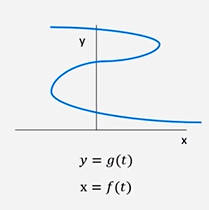

En este caso y tomaria varios valares, es ahí dónde recurrimos a una tercer variable

## Ejemplo

**t** es el parametro, por ello podemos decir que las ecuaciones son parametricas

  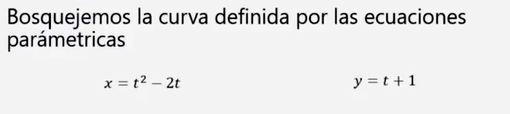

Asignemos variables a t y obtengamos x e y

  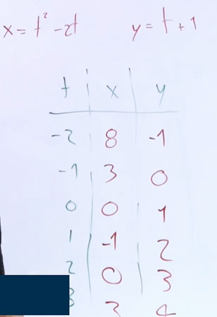

Podría representar el movimiento de una parabola

  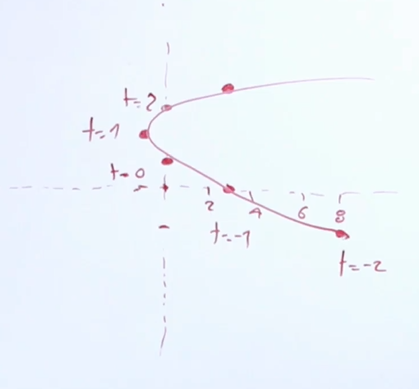

Despejamos y reemplazamos en la otra ecuación para resolver

  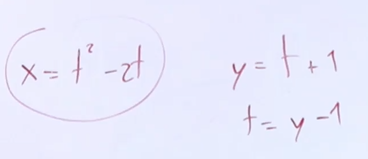

Sustituimos y resolvemos para encontrar la función de la parabola

  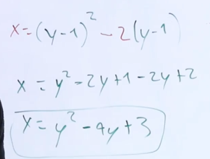

Muchas funciones de una variable se pueden representar como parametricas pero depende de como es que sea su forma

## Coordenadas polares

Sirven para representar un punto

  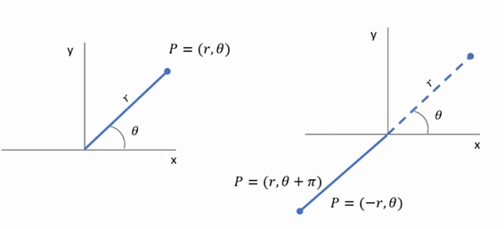

Para gráficar en coordenadas polares

  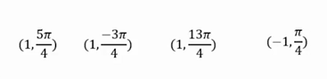

Hay que notar que los puntos se encuentran en radianes

  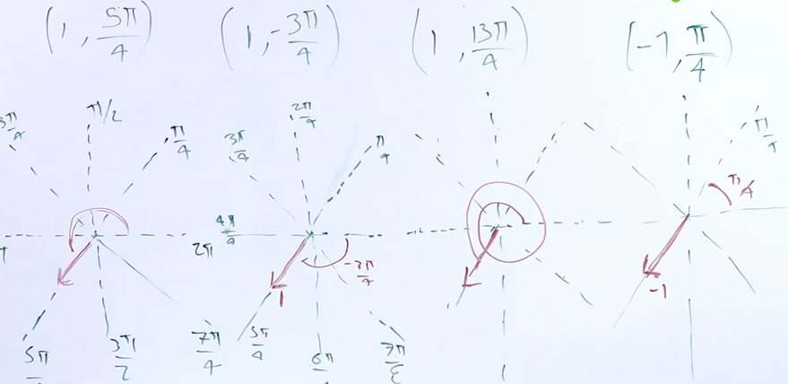

Para calcular un ángulo

  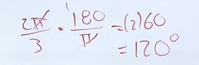

  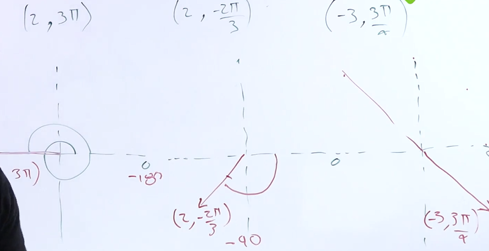

## Curvas polares

  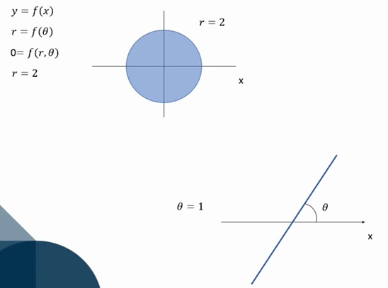

**¿Cómo representamos el coseno?**
Sabemos que va de 1 a -1 y alterna entre pi y 2pi

  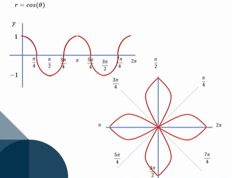

  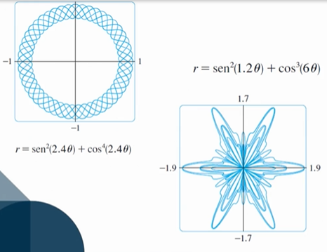

Conocidas ecuaciones de rosas, se escriben de la forma a cos(θ) o a sen(θ)

Donde n define el número de pétalos (Dependiendo si es par o impar). a definde la longitud del pétalo y la función sen o cos define la posición inicial del primer pétalo a graficar.

https://www.youtube.com/watch?v=MihZ6ogXU2g

  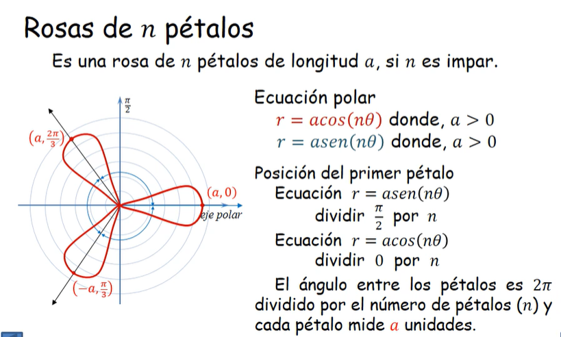

  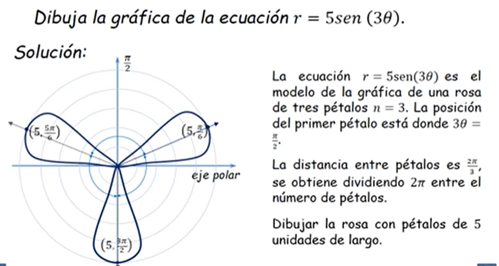

  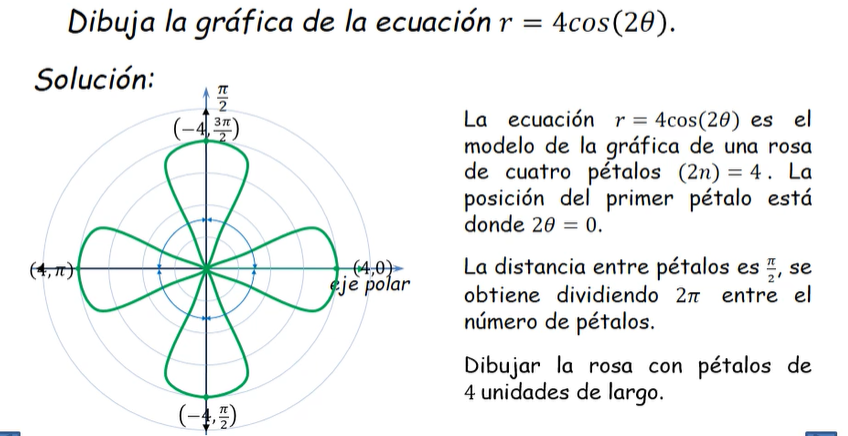

## Coordenadas cartesianas a coordenadas polares

  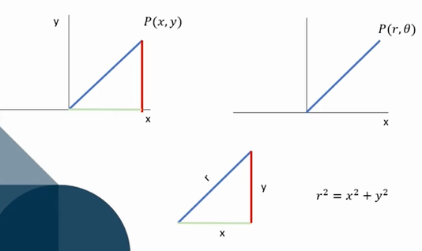

Propiedades trigonométricas (**Teorema de Pitagoras**)

  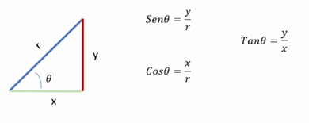

### Ejemplo

  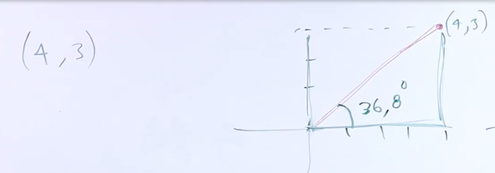

Para realizar la conversión

  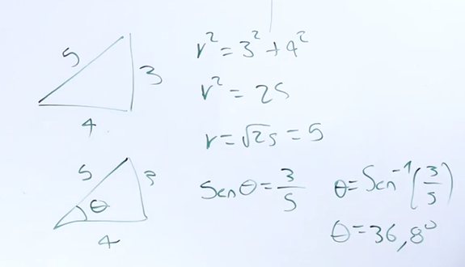

Se puede usar tanto seno, coseno o tangente para encontrar el angulo, se usa seno porque igual tenemos que tener la magnitud para poder expresar en coordenadas polares.

  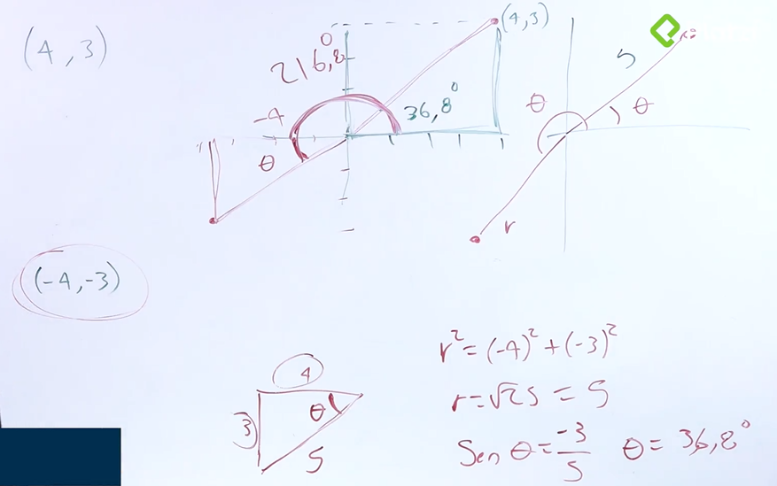

A la hora de pasar a coordenadas polares tenemos que tener en cuanta el signo de los puntos cartesianos, si son negativos obtendremos un angulo theta negativo y para encontrar su angulo equivalente en positivo tendremos que sumarle 180º grados.

# Geometria del espacio
## Sistemas tridimensionales de coordenadas

Estamos acostumbrados al plano de 2D con las coordenadas (x, y) pero al pasar a 3D tendremos tres coordenadas (x, y, z)

* En 2D tenemos el espacio dividido en 4 partes y por ello lo llamamos cuadrantes
* En 3D tenemos el espacio dividido en 8 unidades y los llamamos octantes

  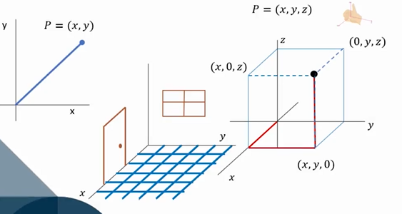

Tenemos octantes al hablar de tres dimensiones

  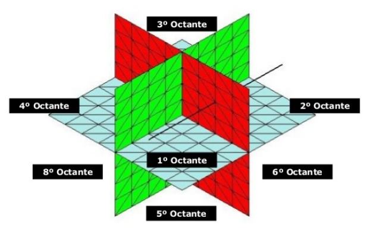

### Ejemplo

Viendo la representación de la coordenada desde distinta perspectiva

  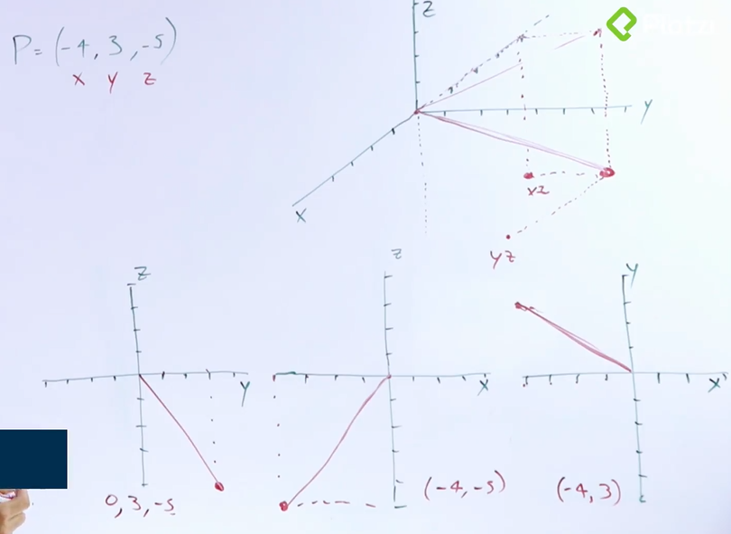

## Gráficas en tres dimensiones

  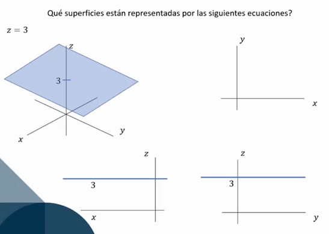

  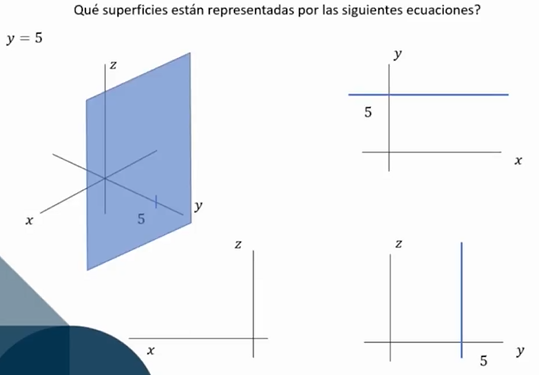

  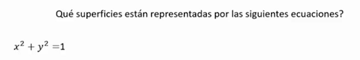

  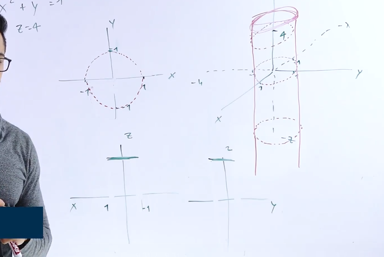

  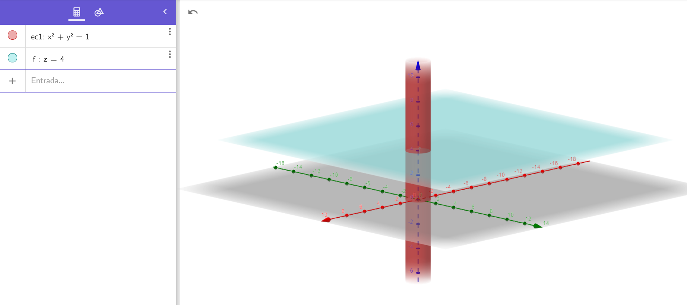

## Distancia entre dos puntos en el espacio

Distancia entre dos puntos

  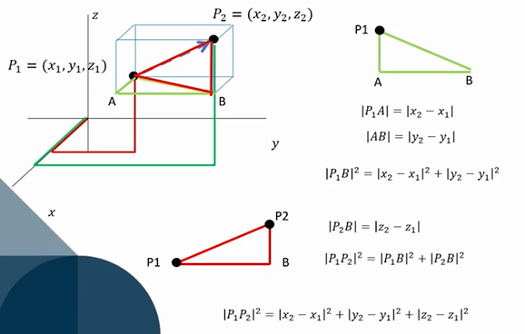

**Distancia entre dos puntos en el espacio**

Para obtener la distancias de dos puntos P1(x1, y1, z1) y P2(x2, y2, z2) en el espacio 3D utilizaremos las funciones trigonométricas de la figura que forman estos dos puntos

Para observar el desplazamiento en el espacio de los dos puntos en cada coordenada , sera con la diferencia de sus componente de P2 y P1 en Px(x2 -x1), Py(y2 - y1), Pz(z2- z1), de esta manera podemos dibujar una figura geometría para poder aplicar las funciones trigonométricas.

Una vez definida la figura geométrica hallaremos la distancia entre los dos puntos con el teorema de pitágoras

# Vectores y planos

## ¿Qué es un vector?

Es una línea dirigida a un punto, que necesita una magnitud (fuerza) y una dirección.

> Los vectores representan un cambio, furezas o velocidades

Un vector es un ente matemático que tiene magnitud y sentido

Para hallar la magnitud de un vector en 2D, A(a1, a2) lo obtendremos haciendo la raíz cuadrada de la suma de sus componentes al cuadrado, también conocido como el teorema de pitágoras

Para hallar la magnitud de un vector de 3D utilizaremos la misma relación trigonométrica que en 2D pero en vez de las suma al cuadrado de sus dos componentes ahora lo haremos de sus tres componentes

Los vectores unitarios son los vectores donde su magnitud es igual a 1, en 2D se representan con la letra (i, j) y en 3D (i, j, k)

  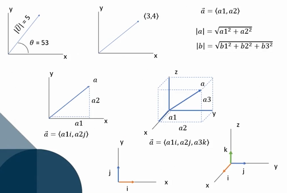

### Ejemplo

  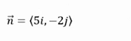

  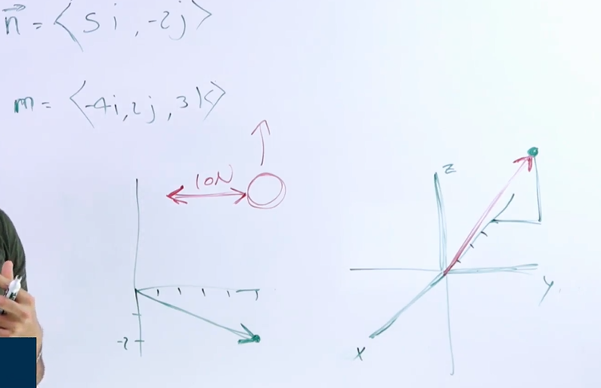

Situaciones dónde encontramos vectores

  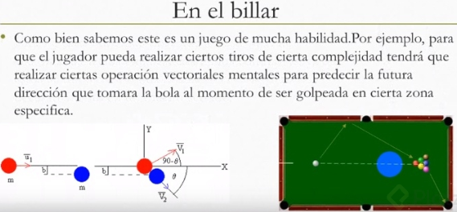

## Producto punto y producto cruz

El **Producto punto o producto escalar** es la multiplicación de dos vectores, donde multiplicaremos componente por componente y sumaremos el resultado, obtendremos un escalar o numero real.

Cuando tenemos dos vectores tenemos un angulo que los separa llamado angulo theta y el teorema del producto punto nos dice que ese producto punto va a ser igual a la magnitud de los dos vectores por el coseno de theta.

  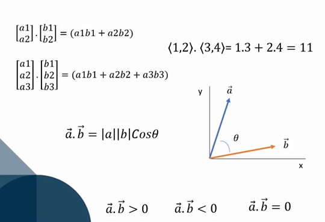

Dependiendo si el producto punto es mayor, menor o igual a cero obtendremos diferentes ángulos

* a·b > 0 -> angulo menor de 90º
* a·b < 0 -> angulo mayor de 90º
* a·b = 0 -> el angulo sera de 90º, los dos vectores serán ortogonales

El **producto cruz o producto vectorial**, la multiplicación se representa con una cruz(x) y solo es posible realizarlo a través de vectores en 3D,

La multiplicación de los dos vectores nos dará como resultado un tercer vector ortogonal a ambos vectores

  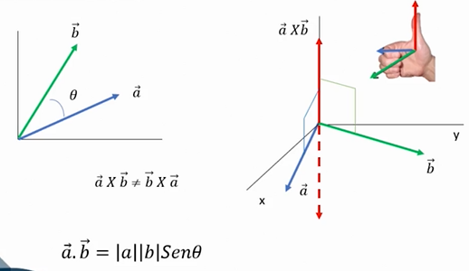

Tenemos que tener en cuanta la propiedad del producto cruz, no sera lo mismo multiplicar (a x b) que (b x a), no son conmutativos, el orden importa ya que nos dará vector distinto.

Para hallar el angulo entre los dos vectores sera igualando el producto cruz a la magnitud de los dos vectores por el seno de theta.

## Gráficación de un plano

Para hallar la ecuación de un plano necesitaremos dos cosas:

* Un vector que este en la superficie es decir, un vector que todos los puntos estén sobre el plano
* Un **vector normal (n)** o ortogonal a la superficie del plano

> Para vector usamos corchetes y para un punto parentesis
> El producto punto nos dice que si multiplico dos vectores y es cero, es normal y es mi ecuación vectorial del plano

  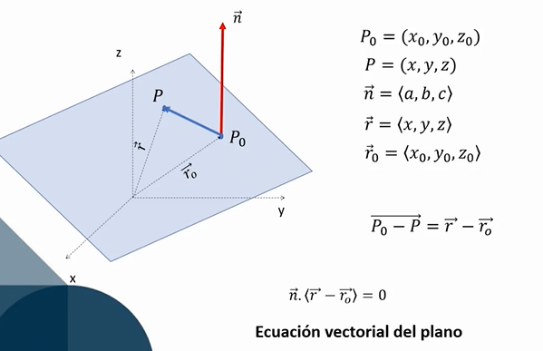

Tenemos tres ecuaciones

* Ecuación vectoria
* Ecuación escalar
* Ecuación lineal

  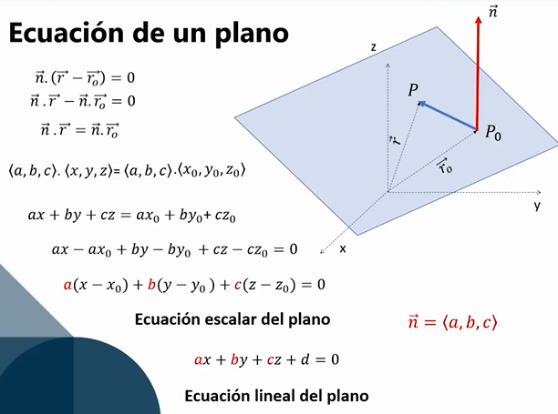

Función de dos variables
https://www.youtube.com/watch?v=ut_iqneq8EA

### Ejercicio

Gráficaremos un plano a partir de una ecuación

  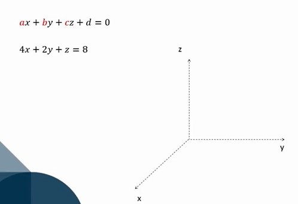

Agregamos valores para cuando x = 0, y = 0 y z = 0

  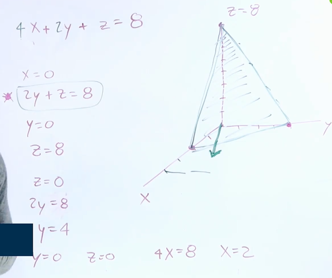

  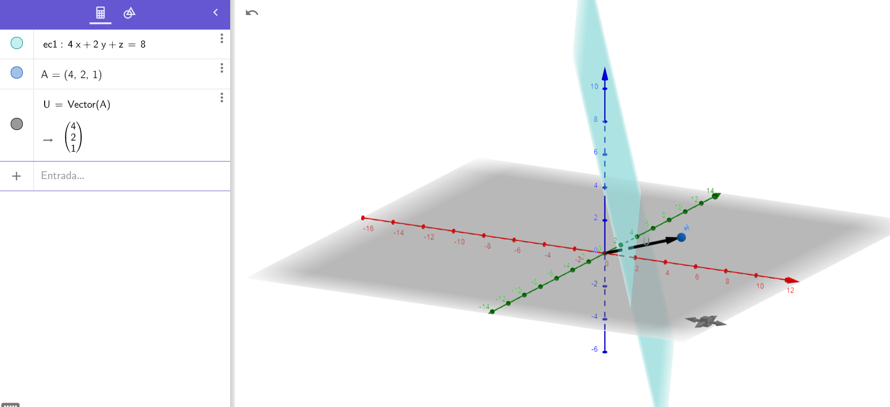

# Superficies cuadráticas

* Tienen variables elevadas al cuadrado
* Variables solas
* Coeficientes

  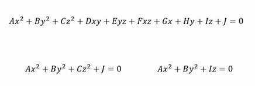

Las ecuaciones de superficies cuadráticas se caracterizan por estar formadas por polinomios que son la unión de monomios a partir de signos (+, -), estos monomios tienen variables que estarán elevados a la segunda potencia ej: 2x^2 o simplemente con la variable ej : 2x, el polinomio también contiene coeficientes que es un numero sin variable ej: 7
> ``2x^2 + 2x = 7 -> polinomio``

## Elipsoide

La ecuación de la elipsoide es un ejemplo de superficie cuadráticas ya que contiene variables elevadas al cuadrado y un coeficiente.

Si nos dan una ecuación con estas características podemos hacer arreglos hasta que sea igual a la ecuación de la elipsoide para proceder a gratificar la figura que obtendremos al sustituir los valores en la ecuación.

La ecuación del elipsoide es de la siguiente forma

  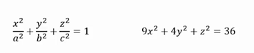

Para el plano yz

  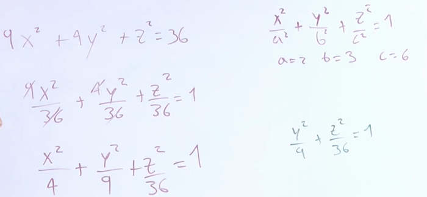

El gráfico es el siguiente

  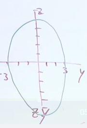

Para el plano xz

  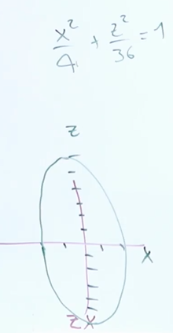

Para el plano xy

  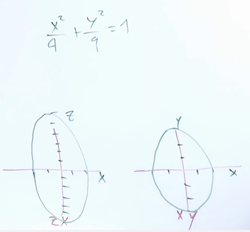

  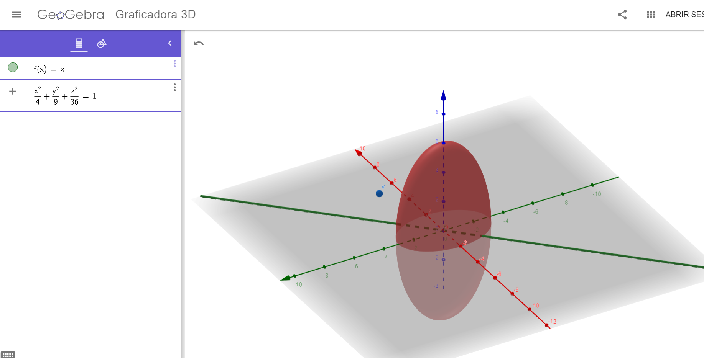

Este sería la representación de un balón de futbol americano

  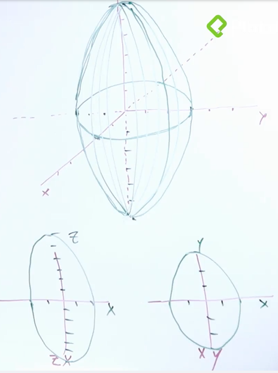

En machine learning estableces polinomios que cubran patrones de datos y determinadas características

Para el caso de un paciente puedes tener temperatura, peso, etc

  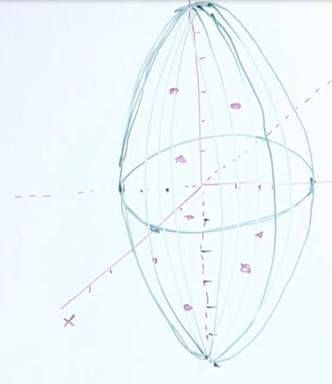

## Hiperbole de una hoja

  

Su gráfica es de la siguiente manera

  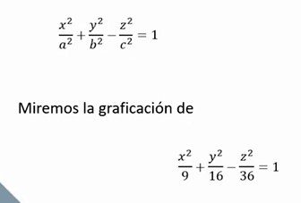

Si las ecuaciones tienen todas las componentes elevadas al cuadrado el eje es simétrico.

* Abre al eje positivo, al eje x en este caso
* a,b,c indica el desplazamiento al eje
* Asíntotas a las esquinas

Para el plano xy

  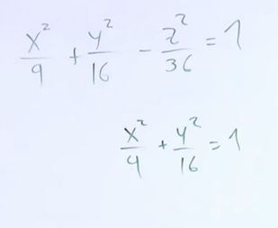

Para el plano xz

  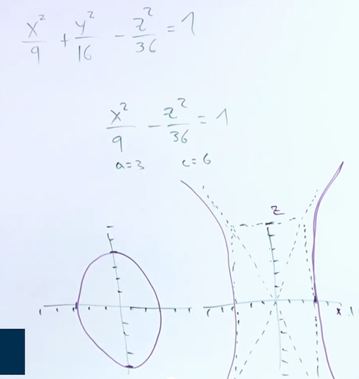

Para el plano yz

  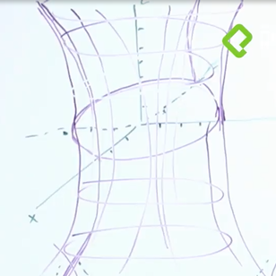

Para el plano tridimensional

  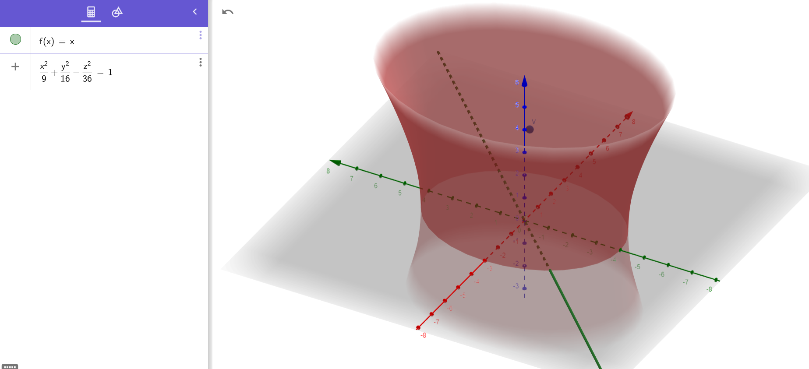

  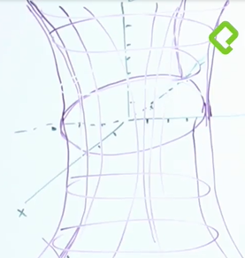

## Paraboloide Elíptico

  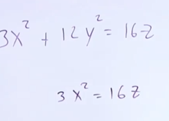

  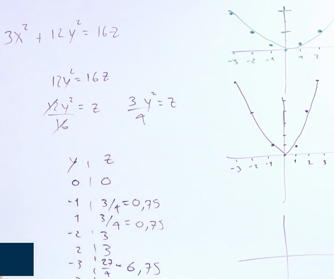

Para z = 3

  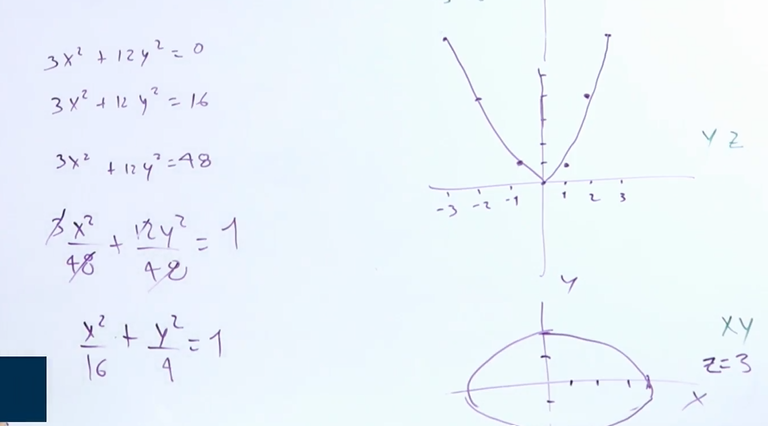

En 3 dimensiones

  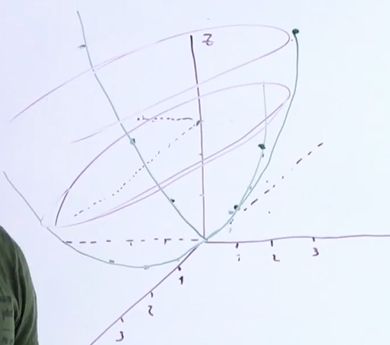

  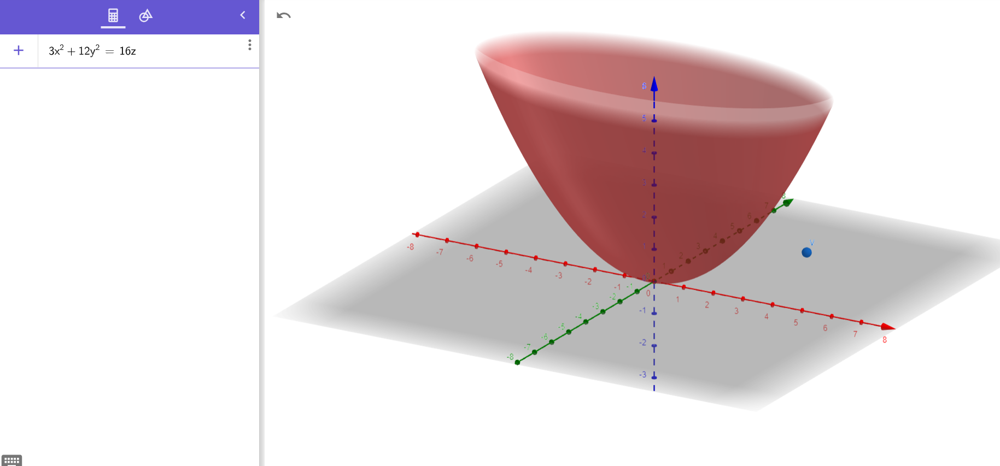

# Funciones de varias variables

## ¿Qué es una función de varias variables?

Un ejemplo de una función con varias variables sera la formula para calcular el volumen de un cilindro V = pi * r^2 * h, es una función de dos variables porque tenemos un volumen (V) que depende de dos variables, el radio ® y la altura (h)

  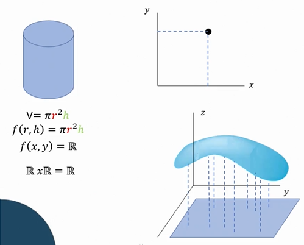

  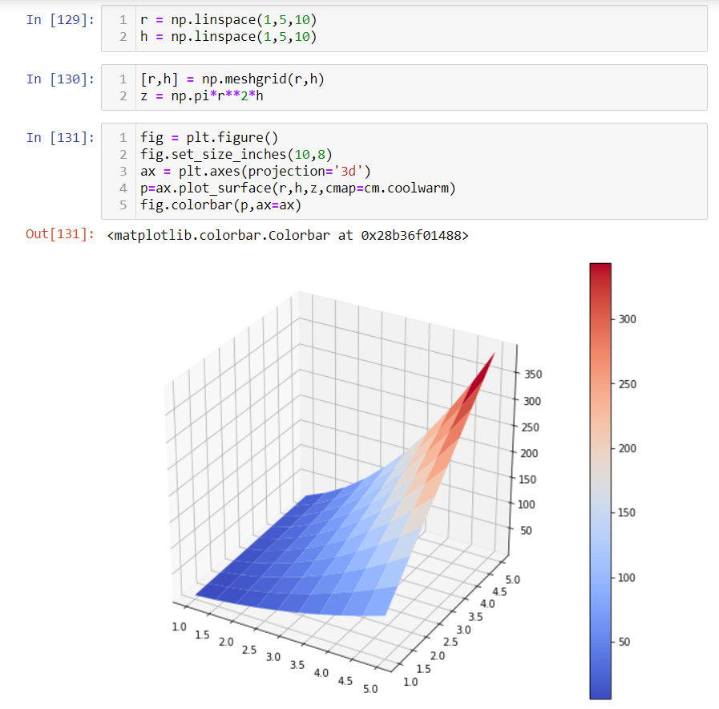

## Derivadas de funciones vectoriales

Si tenemos una función de (x) -> f(x), **la derivada de (x) va a ser la pendiente de la curva de nuestra función**, este concepto se utiliza para las funciones de varias variables.

  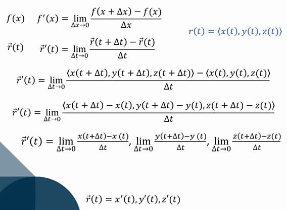

**Una función vectorial tiene varias variables y al desarrollar la derivada** de este tipo de función determinamos que la derivada de una función vectorial consistirá en sacar la derivada de los componentes de la función, o sea de sus variables.

  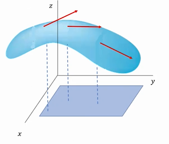

La finalidad de la derivada de una función vectorial es que **una vez resuelta la derivada obtenemos un vector tangente a la superficie**, si **calculamos la derivada en muchos puntos podríamos saber exactamente como se comporta la función.**

> **El vector tangente de la función nos permite saber como se va a comportar la función, como una predicción de lo que sera el siguiente punto.**

### Aplicaciones

Si tengo un dataset, puedo calcular una derivada en cada uno de ellos

  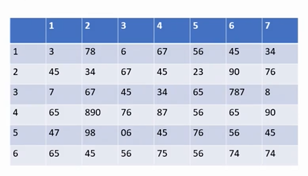

ya que se pueden ver como coordenadas y ver como se comportan los datos

  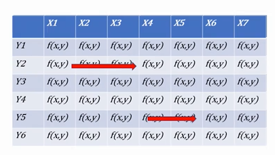

### Ejercicio de derivadas

Importante para hallar el vector tangente unitario se consigue **dividiendo el vector que obtenemos al darle un valor a (t) una vez resuelta la derivada,** entre la magnitud del vector.

La magnitud del vector se conseguía con la raíz de la suma de los valores del vector al cuadrado.

  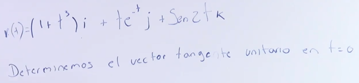

Derivando i, j y k

  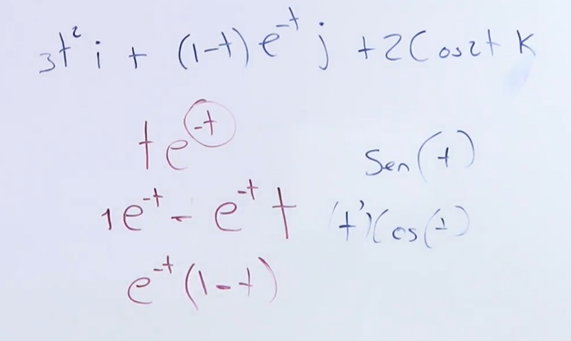

Para t = 0

  

Para encontrar el vector tangente unitario

  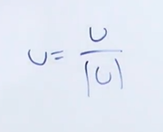

Para el vector unitario en 1

  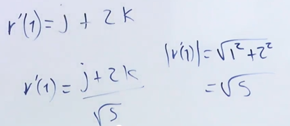

  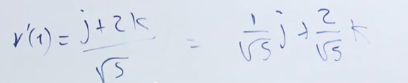

### Ejercicio 2

  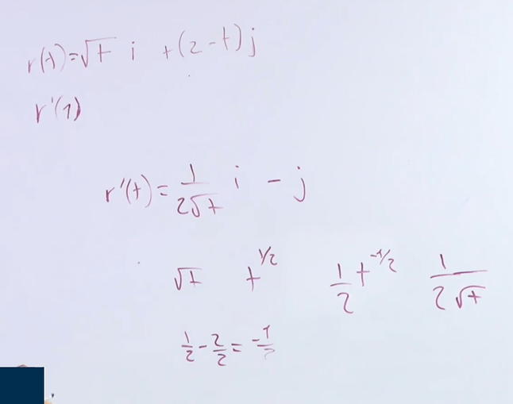

Derivando y obteniendo el valor en un punto con su tanjente nos da

  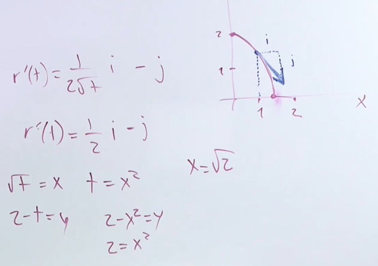

## Integrales de funciones vectoriales

https://www.youtube.com/watch?v=Ec-cGjh0Fr0&t=228s

**En la función de una sola variable tenemos una curva donde a cada punto de (x) le asignamos un punto a (y)**, queremos hallar el **área bajo la curva** que estará comprendida entre dos valores de (a) y (b)

Para hallar ese área la dividiremos en rectángulos mas pequeños, de un rectángulo **extraeremos su área y tendremos que hacer los mismo con todos los rectángulos para hallar ese área bajo la curva, haciendo el sumatorio de sus áreas.**

  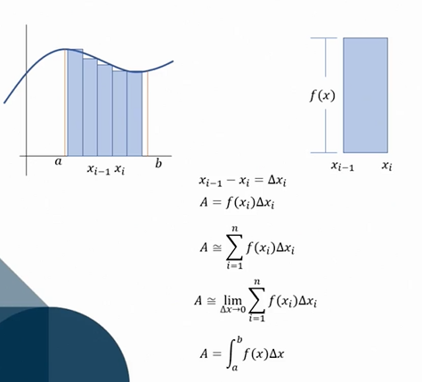

Pero si estos rectángulos son muy grandes el área va a quedar con ciertos espacios vacíos arriba en la curva, por eso el limite de la función tiene que tender a cero, para hallar cada vez rectángulos más pequeños para que el área sea cada vez mas precisa.

> El calculo de integrales sirve para hallar el área bajo la curva.

### Integral de funciones vectoriales

Al tener una función con varias variables utilizaremos el mismo proceso para calcular la integral de una función de una variable y lo aplicaremos para cada variable (i, j, k).

  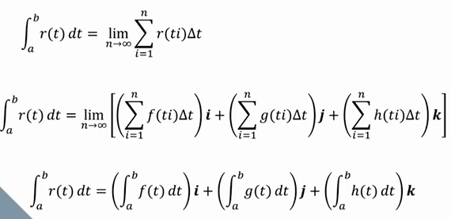

Todas y cada una de estas integrales se evaluaron desde los mismo puntos de (a) y (b), para así obtener el área bajo la curva de la función multivariable.

### Ejemplo

  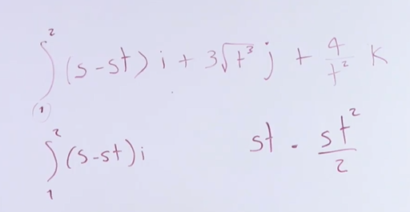

Integramos

  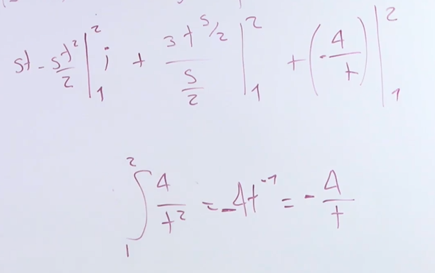

Evaluamos los limites

  

## Curvas de nivel

Utilizamos la estrategia de curvas de nivel para representar un figura continua de 3D en un gráfico de coordenadas 2D (x,y),

Nuestra figura la dividiremos en partes,(z1, z2, z3,…zn) al dividirla podremos representarla en nuestro gráfico (x,y)

  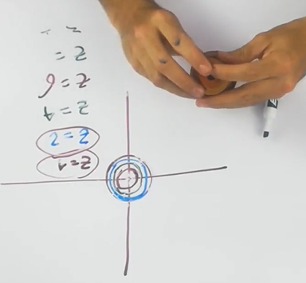

  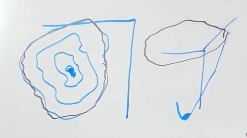

Lo que obtendremos serán curvas de nivel con determinados valores en (x,y) para unas determinadas (z), cuando vamos incrementando el valor en (z) vamos subiendo por la figura

Entre mas puntos evaluemos de nuestra función mas clara se volverá la variable

  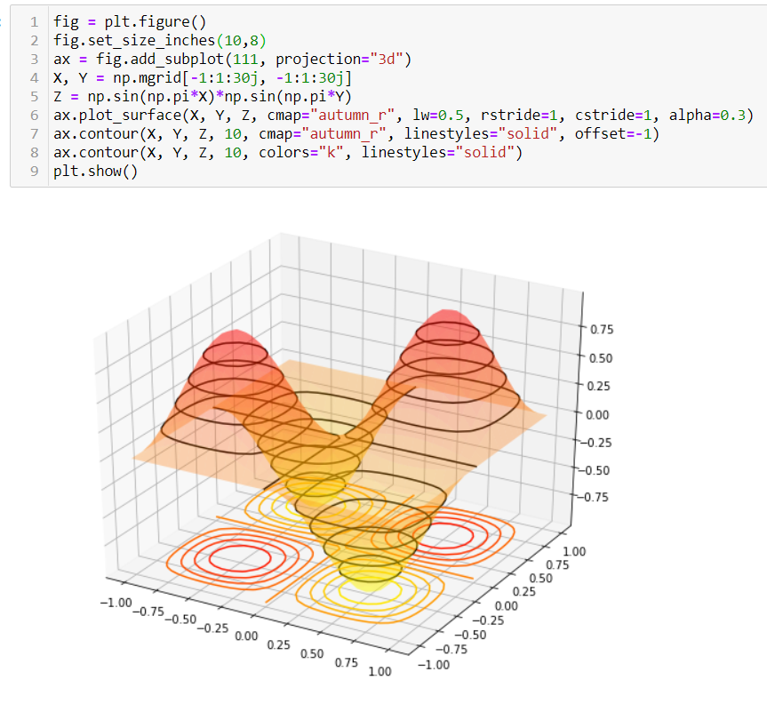

  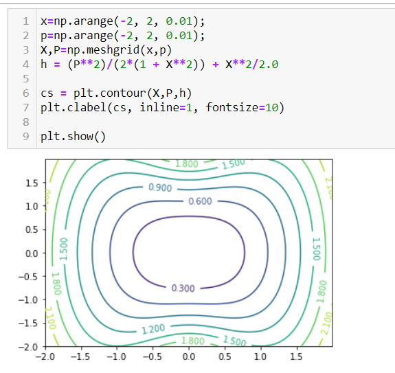

### Ejercicio de curvas de nivel

Las curvas de nivel nos sirve para poder representar figuras de 3D a 2D.

* Nuestra (z) es igual a la función con dos variables (x, y) -> f(x,y), pero vamos a llamar (k) a (z).
* Conforme vamos resolviendo la ecuación llegamos a la forma de una ecuación elipsoide.
* Una vez tenemos nuestra ecuación de la elipsoide empezamos a dar valores a (k) y vamos obteniendo diferentes formas de nuestras figura, cuantos mas valores le demos a (k) iremos avanzando a través de la figura.

  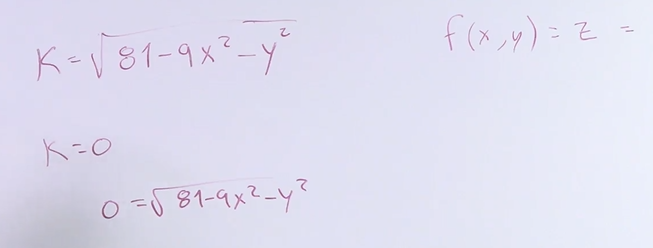

Para k = 0, pasamos la raíz al otro lado quedando raíz de zero

  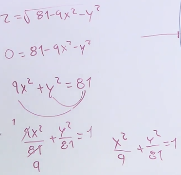

Para k = 2

  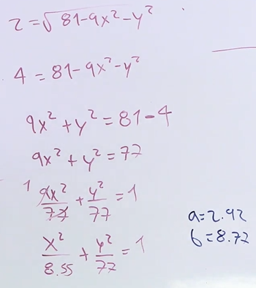

Para k = 6

  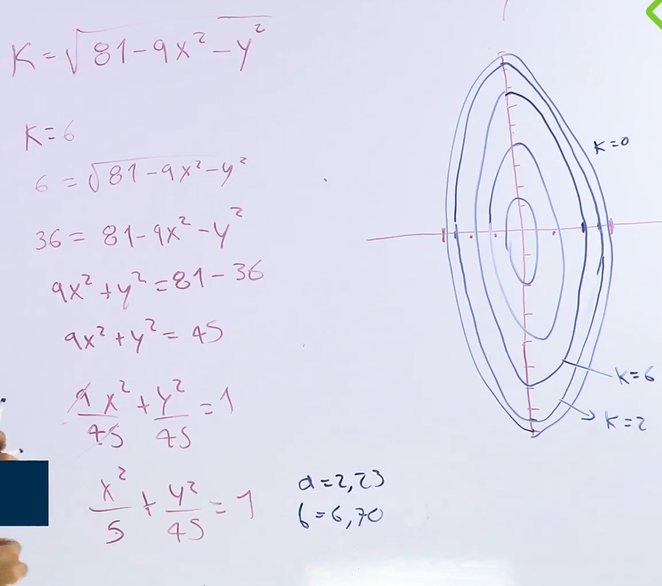

Resultado

  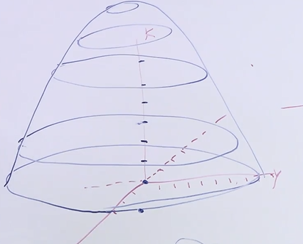

  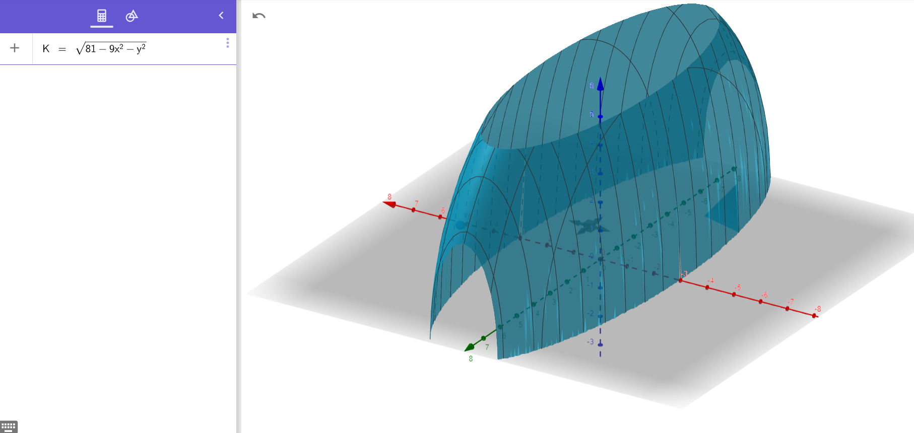

## Derivadas parciales

Tenemos un paraboloide que abre hacía abajo, representa como cambia la figura con respecto a x e y, obteniendo una recta paralela al eje

https://www.youtube.com/watch?v=RaR2g-h-WoI

  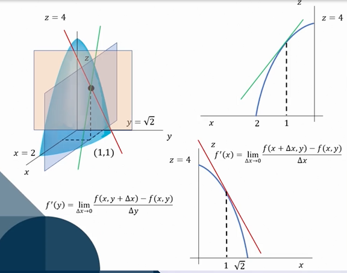

  

### Ejemplo

* **La derivada parcial respecto del eje (x)** Representara como cambia mi figura si mantengo a (y) como constante y vario con respecto a mi eje (x)
* **La derivada parcial respecto al eje (y)** Representara como cambia mi figura si mantengo a (x) como constante y vario con respecto a mi eje (y)

  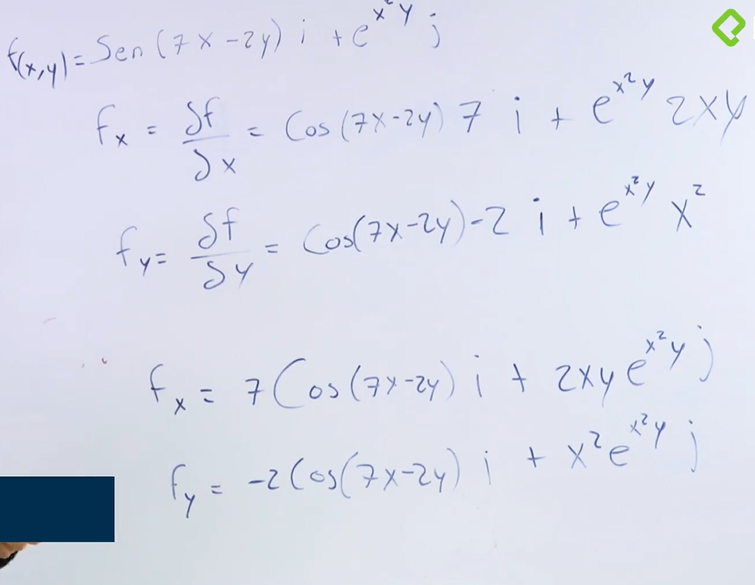

