# Ecuaciones diferenciales<!-- omit in toc -->

## Tabla de Contenido<!-- omit in toc -->
- [Introducción](#introducción)
  - [Ejemplos de aplicación](#ejemplos-de-aplicación)
  - [¿Qupe es una ecuación diferencial?](#qupe-es-una-ecuación-diferencial)
  - [¿Cuál es la variable dependiente y la variable independiente en una ecuación?](#cuál-es-la-variable-dependiente-y-la-variable-independiente-en-una-ecuación)
  - [¿Qué tipos de ecuaciones diferenciales podemos encontrar?](#qué-tipos-de-ecuaciones-diferenciales-podemos-encontrar)
  - [Orden y linealidad de una ecuación](#orden-y-linealidad-de-una-ecuación)
  - [¿Qué significa solucionar una ecuación diferencial?](#qué-significa-solucionar-una-ecuación-diferencial)
  - [Conceptos básicos de cálculo](#conceptos-básicos-de-cálculo)
    - [Relación Derivada-Integral](#relación-derivada-integral)
    - [Potencias con misma base](#potencias-con-misma-base)
    - [Propiedades trigonometricas](#propiedades-trigonometricas)
    - [Tablas de integrales](#tablas-de-integrales)
    - [Logaritmos](#logaritmos)
    - [Número e](#número-e)
    - [Propiedad ln](#propiedad-ln)
- [Ecuaciones diferenciales de primer orden](#ecuaciones-diferenciales-de-primer-orden)
  - [Ecuación separable](#ecuación-separable)
    - [Ejemplo](#ejemplo)
    - [Ejemplo de ecuación separable](#ejemplo-de-ecuación-separable)
    - [Saber si una ecuación es separable](#saber-si-una-ecuación-es-separable)
  - [Método de sustitución lineal](#método-de-sustitución-lineal)
    - [Ejemplo](#ejemplo-1)
    - [Ejemplo de sustitución lineal](#ejemplo-de-sustitución-lineal)
  - [Ecuaciones diferenciales exactas](#ecuaciones-diferenciales-exactas)
    - [Ejemplo](#ejemplo-2)
    - [Ejemplo 2](#ejemplo-2)
  - [Funciones Homogéneas ¿Cómo identificarlas?](#funciones-homogéneas-cómo-identificarlas)
    - [Ejemplo para comprobar si es homogenea](#ejemplo-para-comprobar-si-es-homogenea)
      - [Método por formula](#método-por-formula)
      - [Método por inspección](#método-por-inspección)
    - [Ejemplo de función homogenea](#ejemplo-de-función-homogenea)
  - [Ecuaciones con coeficientes lineales](#ecuaciones-con-coeficientes-lineales)
    - [Ejemplo de ecuación con coeficientes lineales](#ejemplo-de-ecuación-con-coeficientes-lineales)
  - [Qué es un factor integrante](#qué-es-un-factor-integrante)
      - [Caso 1](#caso-1)
      - [Caso 2](#caso-2)
      - [Caso 3](#caso-3)
    - [Ejemplo Factor integrante caso 1:](#ejemplo-factor-integrante-caso-1)
    - [Ejemplo Factor integrante caso 2:](#ejemplo-factor-integrante-caso-2)
    - [Ejemplo Factor integrante caso 3:](#ejemplo-factor-integrante-caso-3)
  - [Ecuaciones diferenciales lineales](#ecuaciones-diferenciales-lineales)
    - [Ejemplo de ecuaciones diferenciales lineales](#ejemplo-de-ecuaciones-diferenciales-lineales)
  - [Ejercicios](#ejercicios)
    - [Soluciones](#soluciones)
- [Ecuaciones diferenciales de segundo orden](#ecuaciones-diferenciales-de-segundo-orden)
  - [¿Qué es una solución linealmente independiente?](#qué-es-una-solución-linealmente-independiente)
  - [Ecuaciones lineales homogeneas de coeficientes constantes](#ecuaciones-lineales-homogeneas-de-coeficientes-constantes)
    - [Ejemplo](#ejemplo-3)
  - [Ecuaciones lineales homogéneas con raíces complejas](#ecuaciones-lineales-homogéneas-con-raíces-complejas)
    - [Ejemplo](#ejemplo-4)
  - [Ecuación diferencial no homogenea](#ecuación-diferencial-no-homogenea)
    - [Coeficientes indeterminados](#coeficientes-indeterminados)
    - [Ejemplo](#ejemplo-5)
    - [Variación de parametros (Determinante Wronskiano)](#variación-de-parametros-determinante-wronskiano)
    - [Ejemplo](#ejemplo-6)
  - [Ejercicios](#ejercicios-1)
- [Modelos matemáticos](#modelos-matemáticos)
  - [Crecimiento poblacional](#crecimiento-poblacional)
  - [Ejemplo de crecimiento poblacional](#ejemplo-de-crecimiento-poblacional)
  - [Segundo ejemplo de crecimiento poblacional](#segundo-ejemplo-de-crecimiento-poblacional)
  - [Ley de enfriamiento de Newton](#ley-de-enfriamiento-de-newton)
    - [Ejemplo](#ejemplo-7)
  - [Propagación de un virus](#propagación-de-un-virus)
  - [Más ejemplos de modelos matemáticos](#más-ejemplos-de-modelos-matemáticos)
  - [Ejercicios](#ejercicios-2)
- [Conceptos para la transformada de laplace](#conceptos-para-la-transformada-de-laplace)
  - [Integrales parciales](#integrales-parciales)
  - [Integrales impropias](#integrales-impropias)
- [Transformada de laplace](#transformada-de-laplace)
  - [Transformada de Laplace de una exponencial](#transformada-de-laplace-de-una-exponencial)
  - [Tablas de laplace](#tablas-de-laplace)
    - [Principales Transformadas](#principales-transformadas)
  - [Propiedades de la transformada](#propiedades-de-la-transformada)
  - [Ejemplo laplace](#ejemplo-laplace)

# Introducción

La ecuaciones diferenciales nos sirven para **crear modelos matemáticos de cosas que existen en la realidad que dependen de alguna variable como el tiempo**, un ejemplo de esto sería saber la variación en la temperatura de un objeto a lo largo de diferentes rangos de tiempo.

## Ejemplos de aplicación

  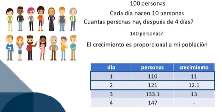

  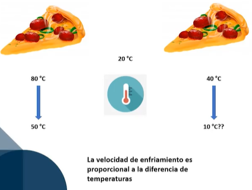

## ¿Qupe es una ecuación diferencial?

**Es la relación entre una función, una variable y su derivada.** Recordemos que una derivada representa una **razón de cambio**, y cuando hablamos de una función f(t) está refiriéndonos a que **cambia con el tiempo o alguna otra variable.**

Hay dos conceptos que debemos tener completamente claros antes de continuar a fondo con las ecuaciones diferenciales.

  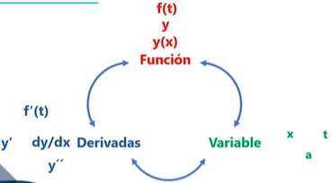

## ¿Cuál es la variable dependiente y la variable independiente en una ecuación?

Siempre que estemos derivando con respecto a una función, esa será nuestra variable dependiente.

  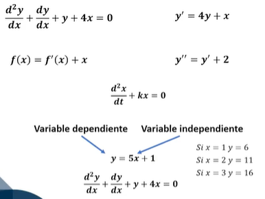

## ¿Qué tipos de ecuaciones diferenciales podemos encontrar?

* **Ecuaciones diferenciales ordinarias** **(EDO).** Estas ecuaciones son aquellas que **solo tienen una variable dependiente.**
* **Ecuaciones diferenciales parciales** **(EDP)**, estas son aquellas que cuentan con más de una variable independiente.

  

## Orden y linealidad de una ecuación

 También podemos clasificar las ecuaciones diferenciales de acuerdo con su orden y linealidad que tengan.

**El orden de una ecuación diferencial se refiere a la máxima derivada** que aparezca en una la ecuación.

  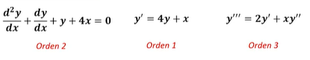

La **linealidad** se basa en la variable dependiente de una ecuación diferencial, si dicha variable no tiene ningún exponente significa que la ecuación es lineal, mientras que si tiene algún cambio exponencial entonces es una ecuación no lineal.

  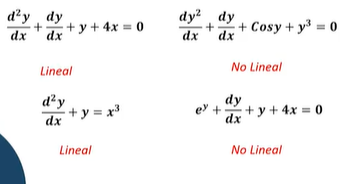

## ¿Qué significa solucionar una ecuación diferencial?

Mientras que en las ecuaciones normales su solución era encontrar un número que cumpliera la igualdad de la ecuación; **en las ecuaciones diferenciales se va a buscar una función o conjunto de función que cumpla la igualdad.**

> En ciertos problemas nos vamos a encontrar que una ecuación diferencial tiene alguna condición donde la función se le denota un valor, este valor es el valor inicial de una ecuación y nos servirá para encontrar soluciones específicas.

  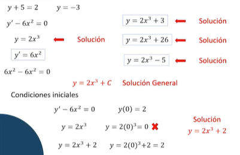

## Conceptos básicos de cálculo

Debemos de tener claros tres conceptos básicos que nos servirán de herramientas a la hora de adentrarnos en las ecuaciones diferenciales de primer orden.

  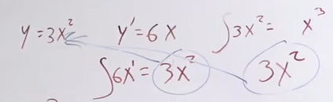

### Relación Derivada-Integral
Si tenemos la derivada de una función podemos integrar para obtener la función original, y si se tiene la integral de una función se deriva para obtener la función. La derivada y la integral son operaciones que se complementan entre sí.

### Potencias con misma base
Si tenemos potencias con misma base a la hora de multiplicar las potencias se suman, si se trata de dividir entonces las potencias se restarán y por último si el exponente es negativo se puede representar como una fracción de la base elevado al exponente en su valor positivo.

### Propiedades trigonometricas
 

  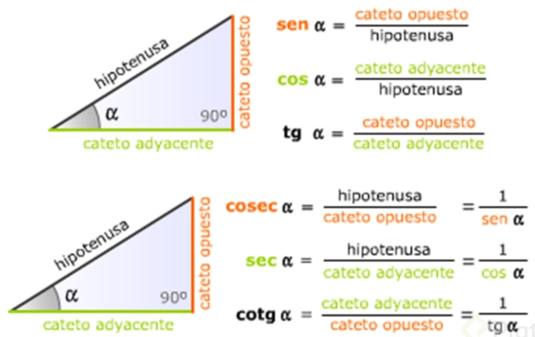

### Tablas de integrales

  

  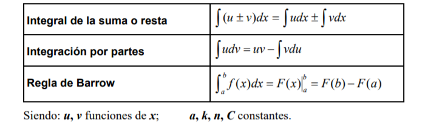

### Logaritmos

  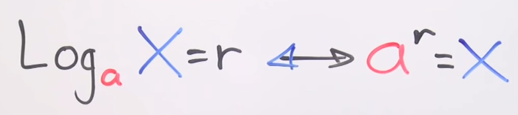

  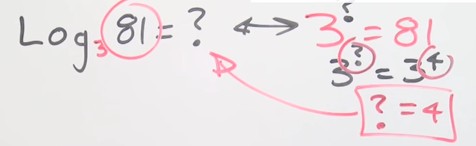

### Número e

  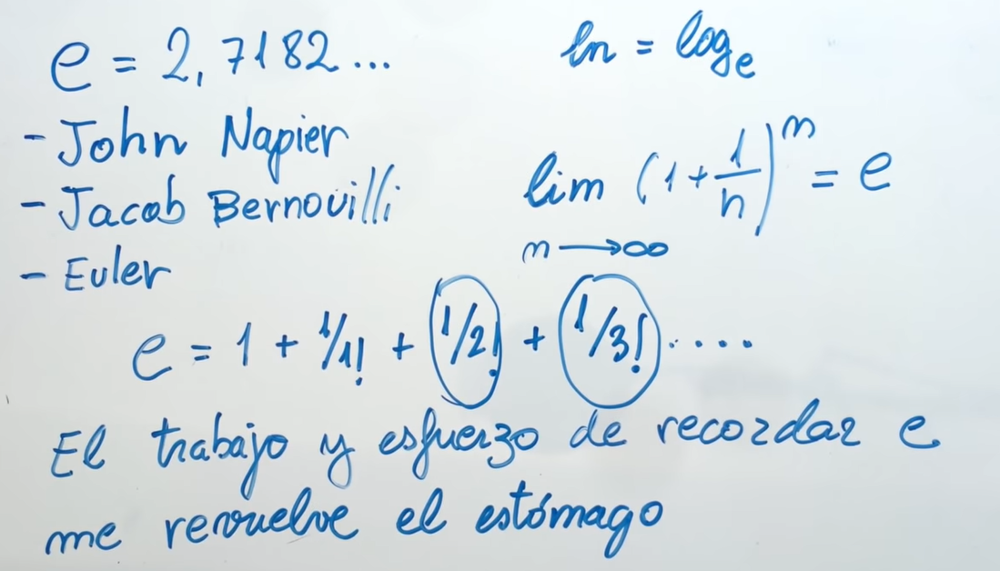

### Propiedad ln

  

Para poder eliminar el logaritmo natural de nuestra ecuación deberemos convertir este en la potencia de e. También, si tenemos alguna constante multiplicando a logaritmo natural entonces podemos representarlo como la potencia de dicho logaritmo.

  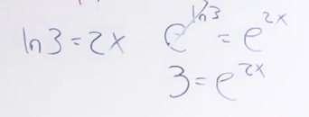

  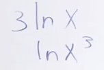

# Ecuaciones diferenciales de primer orden

## Ecuación separable

Como su nombre lo indica, **es aquella donde puedes separar a cada lado de tu ecuación todo lo que dependa de tu componente x y del otro lado todo lo que dependa de y**. Al final solo debes integrar cada lado para poder sacar su función. Cada lado estará constituido por una función y una derivada donde ambas dependen de la misma variable.

  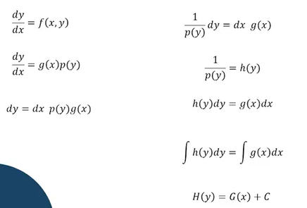

### Ejemplo

  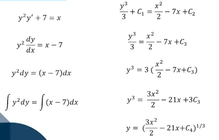

### Ejemplo de ecuación separable

Recordemos que la ecuación diferencial tiene una solución general, pero si cuentas con un valor inicial entonces ya contaras con una solución especifica.

**Lo primero a la hora de iniciar será expresar las derivadas como una división** en caso de no tenerlas así.

**Una vez separadas las variables nos quedaría integrar**, hacemos esto pues tenemos las derivadas y queremos buscar la función de esta.

> Recordemos que si tenemos la integral de una división donde una función se encuentra en el denominador y su derivada en la parte superior eso es igual a logaritmo natural de la función.

Propiedad

  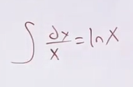

  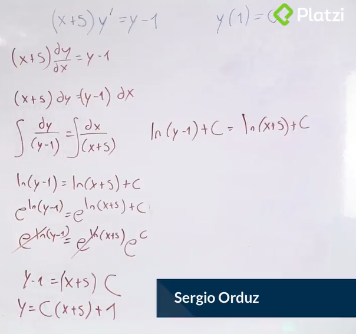

  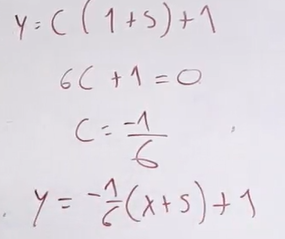

### Saber si una ecuación es separable

Existe un procedimiento que nos hará saber si una ecuación es separable, dicho procedimiento será bastante útil para aquellas ecuaciones donde no tenemos claro si es separable o no.

  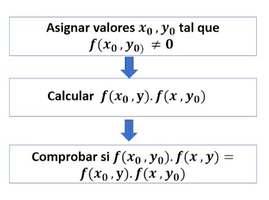

Los pasos son los siguientes:

* Asignamos valores a _**x**_ y _**y**_ de tal forma que nos de un valor diferente a 0.
* Vamos a calcular una nueva función donde multiplicaremos el resultado de nuestra función con el valor que asignamos a _**x**_ y la variable _**y**_ por el resultado de la función con la variable _**x**_ y el valor asignado a _**y**_.
* Por último, será comprobar si la función evaluada en el anterior paso es igual a multiplicar la función del primer paso por nuestra ecuación.

Si aplicamos estos pasos, además de saber si la ecuación es separable, obtendremos la separación de la ecuación.

  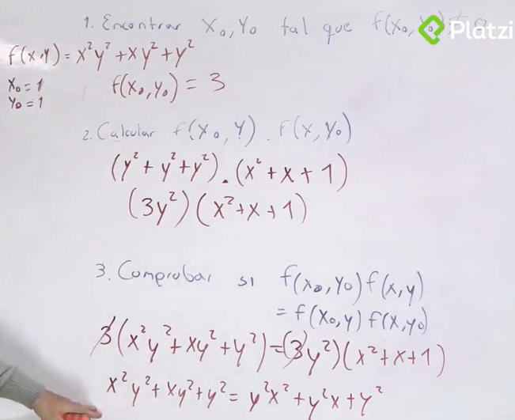

## Método de sustitución lineal

Este método es **aplicable a los casos donde la ecuación tiene a la derivada de un lado** y la función del otro.

> Este método consiste en **sustituir el polinomio de la derecha de la ecuación por una nueva variable.** Después, hallar la diferencial de esta nueva variable.

Una vez conseguida la derivada, dividiremos toda la ecuación por la derivada de x (dx) haciendo que se cancele dx. Con está nueva ecuación podemos despejar dy/dx y con ello reemplazarla en la ecuación principal.

Al final obtendremos una nueva ecuación separable, la cual ya sabemos resolver. Una vez resuelta tendremos que volver a sustituir valores con la ecuación original.

  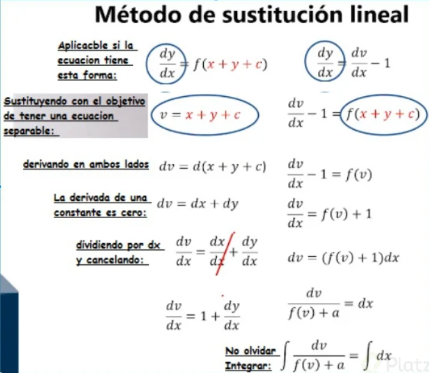

### Ejemplo

  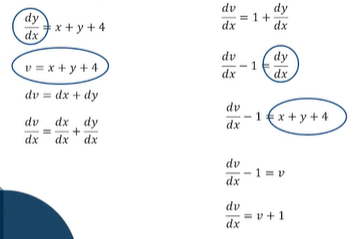

  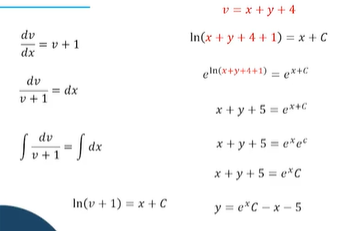

### Ejemplo de sustitución lineal

  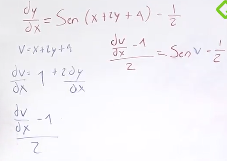

  

## Ecuaciones diferenciales exactas

Estas ecuaciones cumplen dos condiciones:

* Puedan ser representadas de la forma **M(x, y)dx + N(x, y)dy = 0**
* La derivada de M con respecto a la derivada de y sea igual a la derivada de N con la derivada de x
dM/dy = dN/dx

  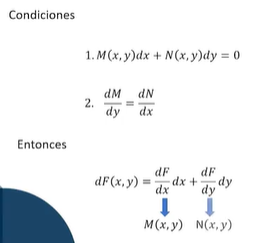

> Para resolver una ecuación exacta primero debemos verificar que, si sea una ecuación exacta, una vez verificada debemos integrar a M o a N.

* Una vez integrada M o N, debemos derivar a F con respecto a la otra variable que no integramos.
* Por último, integramos la ecuación para obtener nuestra solución.

### Ejemplo

1. **Verificar que la función es exacta**

  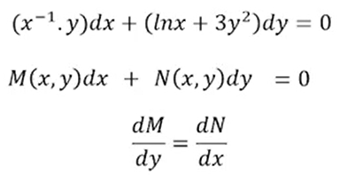

Derivando M respecto a y

  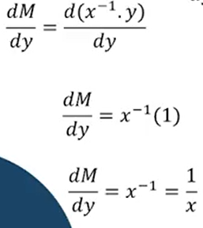

Derivando N respecto a x

  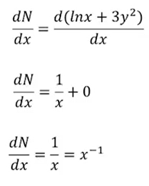

Comprobamos que ambos resultados son iguales

  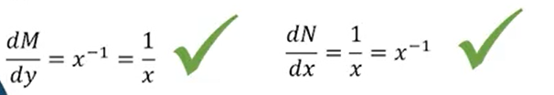

2. **Integrar a M o a N**

  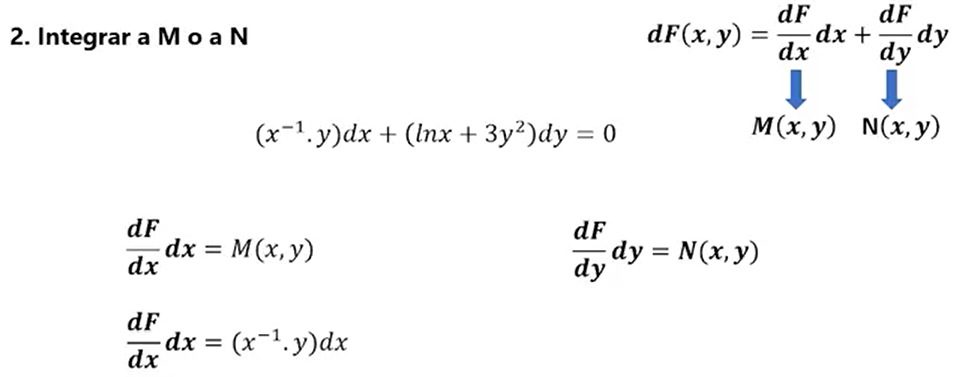

Elegimos la que sea más sencilla, en este caso **M**

  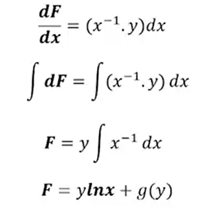

> g(y) es una constante que depende de y, por lo tanto cuando se derive será 0

3. **Derivar a F con respecto a la otra variable**

  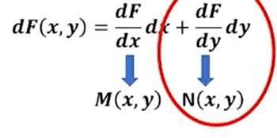

  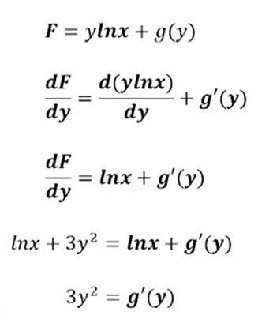

4. **Integrar para obtener la constante**

  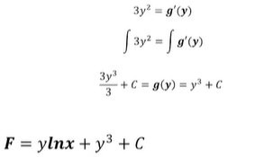

Finalmente obtenemos el resultado sustituyendo F por g(y)

### Ejemplo 2

  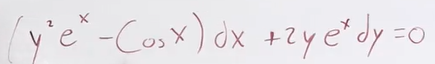

Identificar y escribir quien es M y quien N

  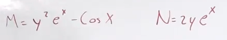

Si las derivadas son iguales, es exacta

  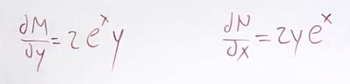

La expresión es igual, por lo tanto elegimos la que sea más fácil de integrar

  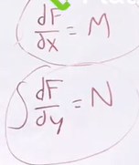

  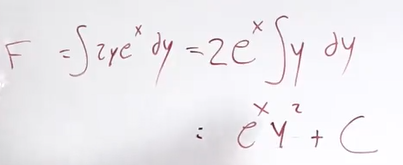

La constante es una función que depende de x

  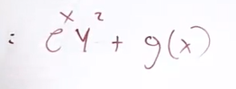

Derivamos con respecto a X

  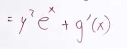

Esto, debe ser igual que M

  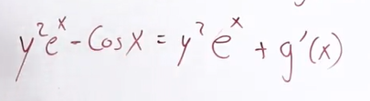

Simplificamos la expresión

  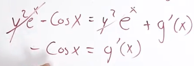

Volvemos a integrar

  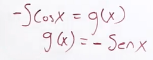

Finalmente completamos la función y obtenemos el resultado

  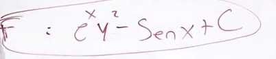

## Funciones Homogéneas ¿Cómo identificarlas?

**En caso de que tengamos una ecuación que no sea separable**, **ni se pueda realizar una sustitución lineal**, **ni sea una ecuación exacta entonces** chequemos si es una función homogénea.

Para identificar si una ecuación es homogénea contamos con dos métodos:

* **Aplicación de fórmula:** si tenemos la siguiente ecuación f(tx, ty) = tnf(x, y), entonces f(x, y) es homogénea de grado n.

  

* **Inspeccionar grados de términos:** si el grado de cada termino del polinomio es el mismo entonces la función es homogénea.

> Para solucionar una ecuación homogénea debemos seguir los siguientes pasos:

* Verificar que la función sea homogénea.
* Cambiamos una de las variables, _x_ la cambiamos por _yv_ si _M_ es más sencilla o _y_ la cambiamos por _xv_ si _N_ es más sencilla.
* Realizamos una sustitución, con ello obtendremos una derivada.
   Integramos para obtener la función.

  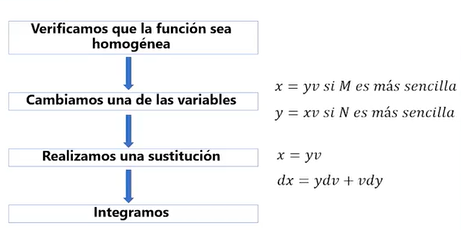

### Ejemplo para comprobar si es homogenea

  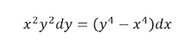

#### Método por formula

Reemplazamos con la formula

  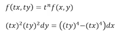

Solucionamos

  

Factorizamos

  

Como t**4 multiplica  a la función, por lo tanto es homogenea de grado 4

#### Método por inspección

Basta con mirar los exponentes

  

### Ejemplo de función homogenea

Recuerda que el método de solución de ecuaciones homogéneas lo que busca es realizar dos sustituciones para obtener al final una ecuación separable.

  

Realizamos una sustitución

  

  

Resolvemos

  

Multipliquemos los terminos por su factor

  

Simplificamos

  

Tenemos una ecuación separable

  

Resolvemos la acuación separable integrando

  

Eliminamos el logaritmo con un exponencial

  

Simplificamos y resolvemos

Sustituimos u de la sustitución que hicimos al inicio

  

Encontramos la función

  

## Ecuaciones con coeficientes lineales

Puede que te encuentres con una ecuación de coeficientes lineales.

Para reconocer esta ecuación veremos que al igual que las ecuaciones de sustitución lineal, la ecuación con coeficientes lineales **cuenta un x, y y una constante**, además los coeficientes que acompañan esas variables son constantes.

**La sustitución lineal nos funciona cuando tenemos un solo polinomio que reemplazar**, en este caso al encontrarnos con dos polinomios queda totalmente descartado el método de sustitución lineal.

  

Para resolver esta ecuación debemos reemplazar la variable x por una nueva variable más una constante, hacemos lo mismo con la variable y para poder obtener una ecuación homogénea y con ello poder buscar una ecuación separable que nos dará la solución.

  

### Ejemplo de ecuación con coeficientes lineales

Hacemos la traslación de ejes, ¿pero con qué valor?

  

Tenemos un sistema de ecuaciones

  

Por el método de eliminación, multiplicamos por -1

  

Nos queda una ecuación con una incognita

  

  

y obtenemos dx y dy

  

Ahora sustituimos en nuestra ecuación inicial

  

Simplificamos y nos queda una ecuación homogenea

  

Realizamos la sustitución

  

  

  

Separamos du de dw

  

simplificamos

  

De forma que tenemos una ecuación separable

  

Solucionando la ecuación separable

  

Integramos, para la segunda integral, multiplicamos arriba y abajo por 2

  

  

Simplificamos con los exponenciales

  

Reemplazamos w

  

Sustituimos en términos de x e y

  

## Qué es un factor integrante

Es un termino por el cual puedes multiplicar una ecuación para convertirla en una ecuación exacta.

Existen tres casos de factores integrantes:

* El factor integrante solo dependerá de _x_.
* El factor integrante solo dependerá de _y_.
* El factor integrante dependerá tanto de _x_ como de _y_.

  

**¿Qué pasa si múltiplicamos los términos por x?**

  

* **Caso 1:** El factor integrante solo depende de x
* **Caso 2:** El factor integrante solo depende de y
* **Caso 3:** El factor integrate depende de xy

#### Caso 1

  

#### Caso 2

  

#### Caso 3

  

### Ejemplo Factor integrante caso 1:

Nuestro primero paso será comprobar que la derivada parcial de M con respecto a y sea diferente a la derivada parcial de N con respecto a x.

Una vez demostrado el primer paso, para hallar el factor integrante aplicaremos la siguiente formula:
(dM/dy – dN/dx)/N = g(x)

Si el resultado de la función depende de X, entonces estamos hablando del primer caso en factores integrantes.

**Validamos que no es exacta**

  

**Aplicamos la formula y la ecuación**

  

  

Encontramos una ecuación exacta resultante de una no exacta

  

Nos queda resolver está ecuación

  

Integramos la que sea más fácil, en este caso N y obtenemos la función

  

Tenemos la función con una constante que depende de x

  

Tenemos nuestra función

  

Resolvemos  derivando f respecto a x

  

Igualamos con la otra ecuación

  

Reducimos

  

Volvemos a integrar para tener la función para obtener g(x)

  

Para la ecuación final sustituimos en nuestra función

### Ejemplo Factor integrante caso 2:

**Verificamos que se de tipo 2**

  

Aplicamos la formula y vemos que depende sólo de y

  

Sustituimos para obtener el factor integrante

  

  

Obtenemos un nuevo M y N

  

Verificamos si las derivadas son iguales

  

Vemos que es exacta y ahora tenemos una nueva ecuación diferencial, integramos N por ser más sencilla

  

Resolvemos la ecuación

  

### Ejemplo Factor integrante caso 3:

Validamos si es exacta caso por caso

Evaluando caso 1

  

Evaluando caso 2

  

Evaluamos caso 3, cumple y aplicamos la formula

  

Integramos para encontrar el factor integrante

  

Multipliquemos toda la ecuación

  

Vemos que podemos simplificar y obtenemos un nuevo m y n

  

Derivamos respecto a m y n y vemos que son iguales

  

Solución de la ecuación exacta

[Factor integrante](/learn/Matematicas/diferenciales/factorintegrantecaso3.pdf)

## Ecuaciones diferenciales lineales

El **factor integrante** además de ayudarnos a solucionar ecuaciones que en un principio no eran exactas, también nos ayudara a solucionar ecuaciones diferenciales lineales.

  

La ecuación diferencial lineal va a tener una función que multiplica por la derivada de y con respecto a la derivada de x, más una segunda función que multiplica a y todo esto que es igual a una tercera función, cada función va a depender de x.

Qué pasaría si

  

El primer paso es dividir todo sobre f1 y aplicamos el factor integrante

  

### Ejemplo de ecuaciones diferenciales lineales

Aplicamos lo siguiente

  

Para la siguiente ecuación, dividimos por x3

  

Obtenemos P y Q

  

Aplicamos la formula

  

Quitamos e y obtenemos el factor integrante

  

Resolvemos sustituyendo

  

## Ejercicios

  

  

  

  

  

  

### Soluciones

  

  

  

# Ecuaciones diferenciales de segundo orden

**Estas ecuaciones son aquellas donde está la segunda derivada de una función.** Existe un concepto muy importante: Soluciones linealmente independientes

## ¿Qué es una solución linealmente independiente?

Son aquellas donde **no existe ninguna constante por la que puedas multiplicar para obtener o llegar a otra solución.**

Una ecuación diferencial de segundo orden solo **tiene dos soluciones linealmente independientes**, o mejor dicho, **una solución diferencial de n orden solo tiene n soluciones linealmente independientes.**

**Las soluciones linealmente independientes de una ecuación diferencial de segundo orden juntas forman lo que se conoce como Combinación lineal**, la cual vendría siendo la solución general de la ecuación.

Evaluemos si y=ex es una solución de la ecuación encontrando primera, segunda derivada y reemplazando en la ecuación

  

Con una constante también es solución

  

Por lo tanto las ecuaciones de n orden tienen n soluciones independientes

  

## Ecuaciones lineales homogeneas de coeficientes constantes

Las ecuaciones lineales homogéneas **son aquellas que son igualadas a 0**. Para que sean de coeficientes constantes como su nombre lo indica, todos **los coeficientes de la ecuación deben de ser una constante y no una función.**

Para resolver este tipo de ecuaciones debemos **buscar su ecuación característica**, la solución a esta ecuación nos dará las constantes para nuestras soluciones linealmente independientes y con ello nuestra solución general.

  

Encontramos la ecuación catacterística

  

### Ejemplo

> Vemos una ecuación con **coeficientes constantes** ya que los terminos que acompañan a y no dependen de x, es **homogenea** por que es  igual a 0

  

Asumimos una solución

  

Intentamos encontrar una ecuación carácteristica

  

Verificamos con el procedimiento

  

Reemplazamos en la ecuación y factorizamos

  

Solucionamos la ecuación cuadrática con la chicharronera

  

Tenemos nuestras dos soluciones

  

La solución general seria

  

## Ecuaciones lineales homogéneas con raíces complejas

Al resolver ecuaciones lineales homogéneas podrá darse el caso donde sus soluciones **incluyan un término imaginario o letra i**, **el cual es dado por la raíz cuadrada de un número negativo.**

  

No se puede dejar una solución expresada con números imaginarios

  

### Ejemplo

  

  

La solución quedaría

  

Pero no podemos expresarla como número negativo por lo que aplicamos la formula

  

## Ecuación diferencial no homogenea

A este punto ya hemos aprendido como **resolver ecuaciones de n orden que sean homogéneas ósea que estén igualadas a 0**, **pero que pasa con aquellas donde están igualadas a alguna función o simplemente diferente de 0.**

Estas ecuaciones diferenciales no homogéneas **tienen una ecuación diferencial homogénea relacionada**, simplemente es una ecuación donde **vamos a anular la función** a la cual esta igualada nuestra ecuación o mejor dicho **igualarla a 0.**

  

El proceso para resolver una ecuación no homogénea es:

* Encontrar la solución general de la ecuación diferencial homogénea relacionada. Recuerda que encontrar la solución general primero debes hallar las soluciones linealmente independientes.
* Encontrar la solución particular para la ecuación diferencial no homogénea. Existen dos métodos para encontrar estas soluciones **Coeficientes Indeterminados** y **Variación de parámetros**.
* Por último, la solución de nuestra ecuación diferencial no homogénea será la suma de la solución del primer paso más la del segundo paso.

  

### Coeficientes indeterminados

Obtenemos la solución general

  

Para la solución particular

  

Los coeficientes indeterminados ya los tenemos

  

Tenemos nuestra solución particular

  

### Ejemplo

  

Solución general para la ecuación homogenea

  

Para la solución particular y realizamos nuestras dobles derivadas

  

Sustituimos la primera y segunda derivada en nuestra ecuación inicial y simplificamos

  

La igualdad debe cumplir que lo de la izquierda es = a lo de la derecha, resolvemos el sistema de ecuaciones

El coeficiente de seno y conseno debe ser igual al del otro lado

  

Ahora solo tenemos que hayar la solución general

  

Ejemplo con una exponencial

https://www.youtube.com/watch?v=-tsBMdiZ7oc

### Variación de parametros (Determinante Wronskiano)

  

Para encontrar u1 y u2 necesitamos encontrar lo siguiente

w wronskiano

  

El wronskiano es un determinante de la matriz de 2x2

  

### Ejemplo

  

Intercambio de constantes c x u

  

Obtenemos el Wrowskiano

  

Obtenemos el Wrowskiano

  

Encontramos u1 y u2

  

Obtenemos u1

  

  

Para u2

  

  

Ya tenemos todo para encontrar nuestra solución

  

  

Encontramos la solución

  

## Ejercicios

  

  

  

Soluciones

  

  

# Modelos matemáticos

Las ecuaciones diferenciales nos permiten modelar un fenomeno que depende del tiempo y que queremos conocer su comportamiento en el futuro

Se lee, la población en el primer año es de dos mil

  

**La derivada representa una razón de cambio, una velocidad asociada**

  

**¿Qué se necesita para hacer un modelo matemático?**

  

## Crecimiento poblacional

  

Consideramos el crecimiento - el decrecimiento

  

Generamos la ecuación considerando N-M como una constante

  

Nos queda una ecuación separable

  

## Ejemplo de crecimiento poblacional

1. Conocer el problema

> Crecimiento poblacional de usuarios de mi red social

2. Conocer las variables

> P = número de usuarios de mi red
> t = tiempo en años
> p(0) = 50, 000
> p(2) = 200, 000

Para obtener la constante de crecimiento

  

Con la ecuación ya podemos responder más preguntas

  

Para calcular el tiempo en el que llegara a los 500,000

  

¿Qué tanto debo de preparar mis servidores en 5 años?

  

## Segundo ejemplo de crecimiento poblacional

  

Resolvemos

  

  

¿Cuál es la población en 8 años del modelo?

  

¿En que momento llegara a 40,000 bloques?

  

## Ley de enfriamiento de Newton

  

Búscamos encontrar la ecuación

  

### Ejemplo

¿Cuál es la temperatura inicial de una cerveza?

  

  

Obtenemos una constante de calentamiento positiva, ya que lo estamos metiendo a una nevera

  

Generamos el modelo

  

Para encontrar el modelo

  

## Propagación de un virus

  

Por el método de ecuaciones separables

  

Generamos el modelo

  

Para t = 4 y p = 10

  

Obtenemos nuestra constante de crecimiento

  

¿En que momento toda la población va a ser infectada 1000?

  

Ponemos a prueba el mdelo

  

## Más ejemplos de modelos matemáticos

[Modelos matemáticos](/learn/Matematicas/diferenciales/modelosmatematicos.pdf)

## Ejercicios

1. ¿Cuánto dinero debes invertir para obtener en 5 años 6000000 COP si la tasa de interés es del 7% compuesto continuamente?

2. Una inversión de 300 dólares se capitaliza continuamente a una tasa de interés anual del 7,5% ¿Cuál será el valor de la inversión después de 72 meses?

3. El número de personas que viven en un pueblo es de 10000. Si después de una década hay 20000 personas. Calcule cuántas personas habrá a los 15 años (partiendo desde el inicio), y en qué momento se llegará a los 50000 habitantes.

4. En el año 2000 la población mundial era de 6.6 mil millones de personas con una tasa de crecimiento de 300 mil personas por día . Calcule con esa tasa de crecimiento cuántas personas se esperan para el 2018.

5. Si en una base de datos el número de datos se triplicó en 7 horas. ¿Cuánto tardó en duplicarse?

6. Una cadena de bloques crece a un ritmo de 20 bloques por hora cuando hay 400 bloques. ¿Cuántos bloques hay después de 5 horas? ¿En cuánto tiempo se duplicarán el número de bloques?

7. Actualmente tienes 1500 amigos en Facebook. Tu red de amigos de Facebook crece actualmente a una tasa de 10 amigos nuevos por semana, ¿cuánto tiempo tardarás en alcanzar el límite permitido de los 5000 amigos en Facebook?

8. Un cuerpo se calienta a 90° y se expone al aire libre con una temperatura de 13°. Si al cabo de una hora su temperatura es de 40° ¿En cuánto tiempo alcanzará los 23°?

  

  

# Conceptos para la transformada de laplace

## Integrales parciales

  

  

## Integrales impropias

  

# Transformada de laplace

https://www.youtube.com/watch?v=McSN9g7DbYA

Que es la trasformada de la place?
**Es una integral impropia de varias variables y que esta definida**. Cuando hablamos de la trasformada de laplace, es cuando ingresamos una función y obtenemos otra función.

  

Sabemos que la integral es

  

Para laplace

  

Cuando el limite es igual a infinito diverge, si tiene un valor decimos que converge

  

## Transformada de Laplace de una exponencial

  

## Tablas de laplace

[Tablas de transformada de laplace](/learn/Matematicas/diferenciales/tablasdelaplace.pdf)

### Principales Transformadas

Constante

  

Exponencial

  

Seno y coseno

  

  

## Propiedades de la transformada

* Producto por una constante
* Linealidad
* Traslación
* Derivada

  

  

  

  

## Ejemplo laplace

  

