# Matemáticas discretas<!-- omit in toc -->

## Tabla de Contenido<!-- omit in toc -->
- [Lógica](#lógica)
  - [¿Qué es la lógica?](#qué-es-la-lógica)
  - [¿Qué es una proposición o afirmación?](#qué-es-una-proposición-o-afirmación)
  - [Conectores lógicos](#conectores-lógicos)
  - [Tablas de verdad](#tablas-de-verdad)
    - [Ejemplo de tabla de verdad](#ejemplo-de-tabla-de-verdad)
  - [Circuitos lógicos](#circuitos-lógicos)
    - [¿Qué es un circuito lógico?](#qué-es-un-circuito-lógico)
    - [Ejercicios](#ejercicios)
- [Teoría de conjuntos](#teoría-de-conjuntos)
  - [Subconjuntos](#subconjuntos)
    - [Conjuntos especiales](#conjuntos-especiales)
  - [Operaciones entre conjuntos](#operaciones-entre-conjuntos)
  - [Nomenclatura](#nomenclatura)
  - [Representación gráfica de conjuntos](#representación-gráfica-de-conjuntos)
    - [Unión](#unión)
    - [Intersección](#intersección)
    - [Resta](#resta)
    - [Complemento](#complemento)
  - [Ley de Morgan: Unión de conjuntos](#ley-de-morgan-unión-de-conjuntos)
    - [1ra Ley](#1ra-ley)
    - [Segunda Ley](#segunda-ley)
    - [Comprobación gráfica](#comprobación-gráfica)
    - [Propiedades y teoremas](#propiedades-y-teoremas)
- [Teoría de grafos](#teoría-de-grafos)
  - [Tipos de grafos](#tipos-de-grafos)
  - [Grados, caminos, cadenas y ciclos](#grados-caminos-cadenas-y-ciclos)
    - [¿Qué es el grado de un vértice?](#qué-es-el-grado-de-un-vértice)
  - [Caminos y ciclos eulerianos](#caminos-y-ciclos-eulerianos)
  - [Caminos y ciclos hamiltonianos](#caminos-y-ciclos-hamiltonianos)
    - [Ejemplos de gráficos no hamiltonianos](#ejemplos-de-gráficos-no-hamiltonianos)
  - [Matriz de adyacencia](#matriz-de-adyacencia)
  - [Matriz de incidencia](#matriz-de-incidencia)
  - [Ejercicio con matrices](#ejercicio-con-matrices)
- [Arboles](#arboles)
  - [Tipos de árboles:](#tipos-de-árboles)
  - [Sub árboles, vértices terminales e internos](#sub-árboles-vértices-terminales-e-internos)
  - [Árbol de expansión mínimo](#árbol-de-expansión-mínimo)
  - [Árbol binario](#árbol-binario)
  - [Recorrido de árboles](#recorrido-de-árboles)
  - [Expresiones aritméticas](#expresiones-aritméticas)
    - [Ejercicio](#ejercicio)
    - [Ejercicio 2](#ejercicio-2)
- [Algoritmos](#algoritmos)
  - [Algoritmo de Prim](#algoritmo-de-prim)
  - [Algoritmo Dijkstra](#algoritmo-dijkstra)
  - [Algoritmo de Kruskal](#algoritmo-de-kruskal)
  - [Algoritmo de Fleury](#algoritmo-de-fleury)
  - [Algoritmo de flujo máximo](#algoritmo-de-flujo-máximo)

# Lógica
## ¿Qué es la lógica?

Es todo lo que tu cerebro piensa con base a lo que para ti es:
* Coherente, 
* Está estructurado 
* Tiene sentido.

> **Lógica proposicional**, que como su nombre lo indica se basa en proposiciones o afirmaciones.

## ¿Qué es una proposición o afirmación?

No es más que una sentencia, **oración o enunciado al cual le puedes dar algún de verdadero o falso**. Ni las preguntas, las órdenes y los deseos contaran como proposiciones.

  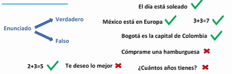

> En la lógica proposicional, nos interesa saber la relación que hay entre estas.

Existen dos tipos de proposiciones, las simples y las compuestas:

* Las **proposiciones simples** tienen un valor de **verdadero o falso**, son representadas por la letra p, q, r, s, t.
* Las **proposiciones compuestas** como su nombre lo indica están compuestas por proposiciones simples. 
  
Estas proposiciones **necesitan conectores lógicos** para unir las diferentes proposiciones simples que la integren.

Existen múltiples conectores lógicos, entre ellos se encuentran la **conjunción, disyunción, implicación, equivalencia y negación.**

  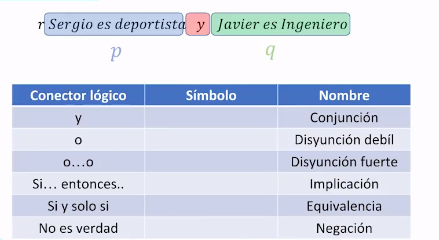

## Conectores lógicos

**El valor de verdad.** Así como una proposición simple puede tener un valor de verdadero o falso, las proposiciones complejas tienen un valor de verdad el cual puede ser verdadero o falso.

**Las opciones de valor de verdad** de una proposición compleja van a depender del numero de proposiciones simples que contenga

> Una forma rápida de calcular el numero de opciones es elevando 2 al número de proposiciones simples que contenga.

  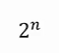

Esto nos servirá para evaluar una tabla de verdad, la cual nos va a mostrar el valor de verdad de una proposición compuesta.

> La tabla de verdad de una **Conjunción** nos muestra que, para que el valor de verdad de una conjunción sea verdadero ambas proposiciones simples deben ser verdaderas, si alguna es falsa o ambas son falsas entonces el valor de verdad será falso.

  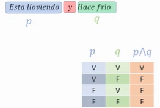

> Para **la Disyunción débil** si una de las proposiciones simples es verdadera entonces el valor de verdad será verdadero, si todas las proposiciones simples son falsas entonces el valor de verdad será falso. 

  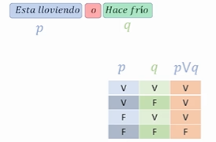

> Por otro lado, la **Disyunción fuerte** va a tener su valor de verdad verdadero solo cuando una de las proposiciones sea verdadera y la otra falsa, de otro modo el valor de verdad será falso.

  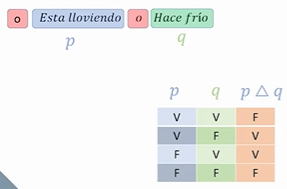

>El valor de verdad de un **Condicional** solamente será falso cuando la primera preposición sea verdadera y la segunda sea falsa, para los demás casos el valor de verdad será verdadero.

  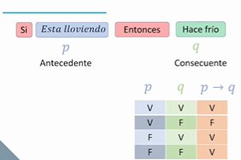

> **Bicondicional** tendrá valor de verdad verdadero solo cuando ambas preposiciones tengan el mismo valor de verdad, si alguna es falsa y la otra es verdadera entonces el valor de verdad de una tabla Bicondicional será falso.

  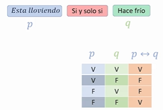

> Obtener el valor de verdad de la **Negación** es bastante fácil, si la preposición era verdadera entonces pasara a ser falso y viceversa.

  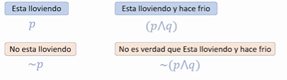

  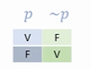

## Tablas de verdad

  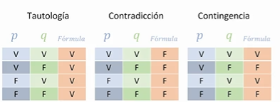

  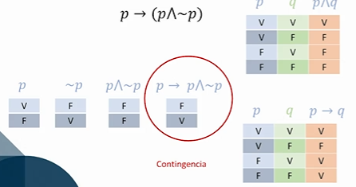

  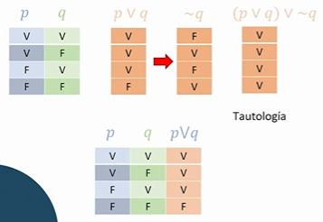

### Ejemplo de tabla de verdad

  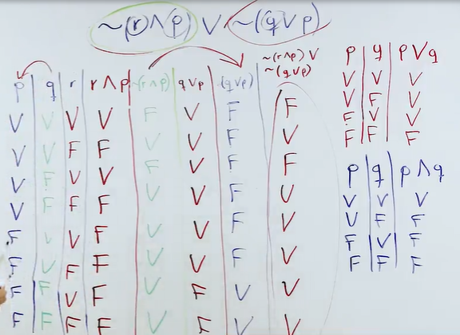

Lo primero que vamos a hacer para este ejercicio es identificar los conectores lógicos que se utilizan en nuestra primera proposición compleja de nuestro problema, luego anotaremos sus tablas de verdad para que nos sirvan de ayuda.

Para encontrar el valor de verdad en una proposición compuesta necesitas empezar a descomponerla en pequeñas partes y ayudarte de las tablas de verdad de los conectores lógicos. 

## Circuitos lógicos

### ¿Qué es un circuito lógico?

Es una serie de elementos que cumple las leyes de la lógica y que nos permite representar proposiciones complejas, cumpliendo las leyes de los circuitos eléctricos.

  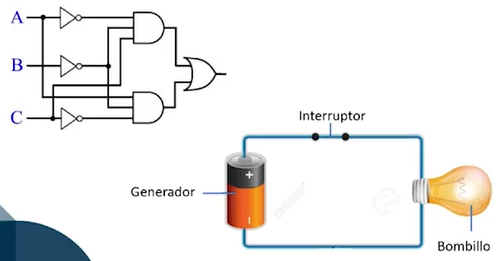

En un circuito eléctrico tenemos un generador que proporcionara energía a, por ejemplo, una bombilla. En este caso la energía pasara libremente siempre y cuando los interruptores que conformen dicho circuito estén todos cerrados.

  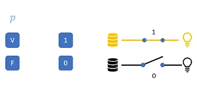

Así como en la lógica vemos que las **proposiciones pueden tener un valor de verdadero o falso**, **en un circuito un interruptor puede estar cerrado o abierto**, esto es igual que representar a verdadero como 1 y a falso como 0.

> Dentro de los circuitos, **el conector lógico de Conjunción es igual a un circuito en serie**. 

  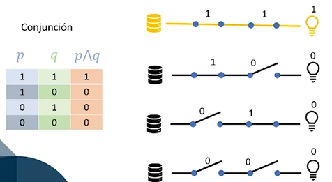

> Por otro lado, **la Disyunción se representa como un circuito en paralelo.**

  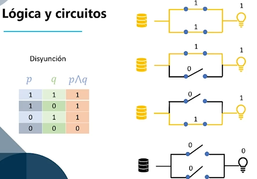

  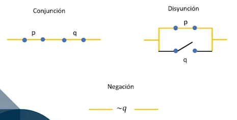

  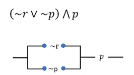

### Ejercicios

  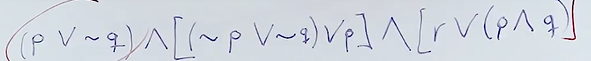

  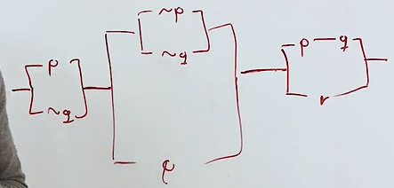

# Teoría de conjuntos

"Un conjunto lo podemos definir como un grupo de objetos, personas, o elementos unidos por una misma característica como por ejemplo sería el conjunto de números pares. 

> Dentro de un conjunto no importa el orden de los elementos ni si se repite alguno de ellos.

**En conjuntos es muy importante hablar sobre la relación de pertenencia**, esto indica si un objeto pertenece a algún conjunto, es representada por el símbolo **∈**. Mientras que cuando un objeto no pertenece a algún conjunto, usaremos el símbolo **∉**.

  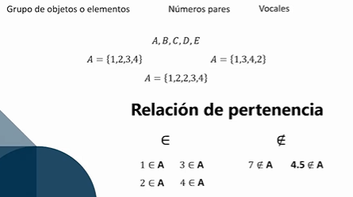

Podemos determinar un conjunto de dos diferentes formas:

* **Por extensión:** usada cuando conocemos cada elemento individualmente dentro del conjunto, nombramos cada elemento que integra el conjunto.
* **Por compresión:** nos sirve para describir solamente las cualidades de los elementos que integran el conjunto.

  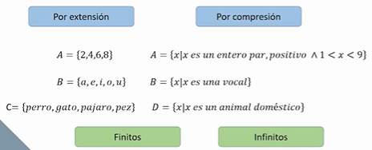

Por lo general cuando hablamos de conjuntos finitos los determinamos por extensión a menos que sean muy grandes; los conjuntos infinitos siempre vas a ser determinados por compresión.

> La cardinalidad es el número de elementos que integran un conjunto.

Un conjunto puede incluir dentro otro conjunto, a este ultimo se le llama subconjunto.

  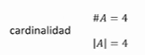

## Subconjuntos

  

### Conjuntos especiales

Al momento de hablar de conjuntos es necesario saber que existen algunos conjuntos especiales. 

* El primero es el **conjunto nulo**, es un conjunto donde no hay ningún elemento.
* Un **conjunto unitario** es integrado solo por un único elemento. 
* Por otro lado, el **conjunto universal** es aquel que este compuesto por todos los conjuntos que estés manejando.

  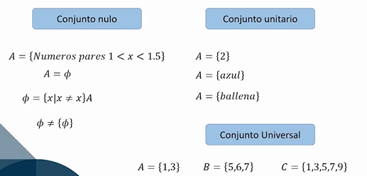

## Operaciones entre conjuntos

* Dentro de las operaciones entre conjuntos podemos encontrar la **Unión**, la cual representa **la adición de un conjunto A con el conjunto B.**
* La **Intersección** de dos conjuntos A y B son aquellos elementos que se encuentran tanto en A como en B.
* En la **Resta de conjuntos** a diferencia de la unión y la intersección, si importa el orden de los conjuntos, por ejemplo, la Resta de un conjunto B a un conjunto A retira los elementos que contiene B que se encuentran en el conjunto A.
* Por ultimo el **Complemento** de un conjunto son todos los elementos que le faltan al conjunto para volverse el conjunto universal.

  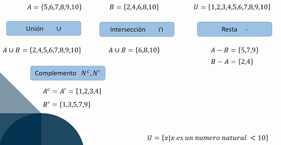

## Nomenclatura

* ⋃ Unión
* ⋂ Intersección
* – Resta
* ∈ Pertenencia
* ∉ No es un elemento de
* ⊂ Subconjunto estricto
* ⊃ Superconjunto estricto
* |A| Cardinalidad
* #A Cardinalidad
* Cª Complemento

## Representación gráfica de conjuntos

Cuando representamos gráficamente algún conjunto **utilizamos figuras geométricas como los círculos, cuadrados o triángulos.**

Representar gráficamente los conjuntos nos sirve mucho al momento de identificar las operaciones entre conjuntos.

El complemento de algún conjunto también puede ser expresado como la resta del conjunto al conjunto universal.

  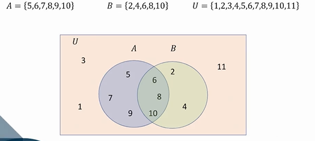

### Unión

  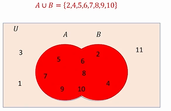

### Intersección

  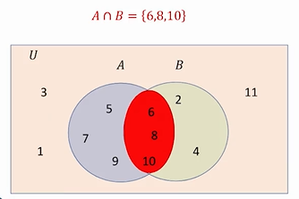

### Resta

  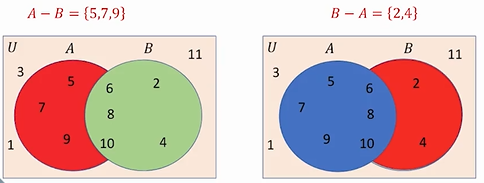

### Complemento

  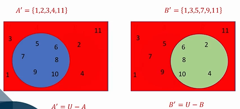

## Ley de Morgan: Unión de conjuntos

> Las leyes de Morgan establecen cuál es el resultado de negar una disyunción y una conjunción de proposiciones o variables proposicionales.

Representar gráficamente los conjuntos también nos sirve para **demostrar propiedades que se dan entre los conjuntos.** Vamos a ver si el complemento de la unión de dos conjuntos es igual a la unión del complemento de estos dos conjuntos, ¿Qué pasa si en lugar de buscar la unión de los complementos buscamos la intersección de estos?

  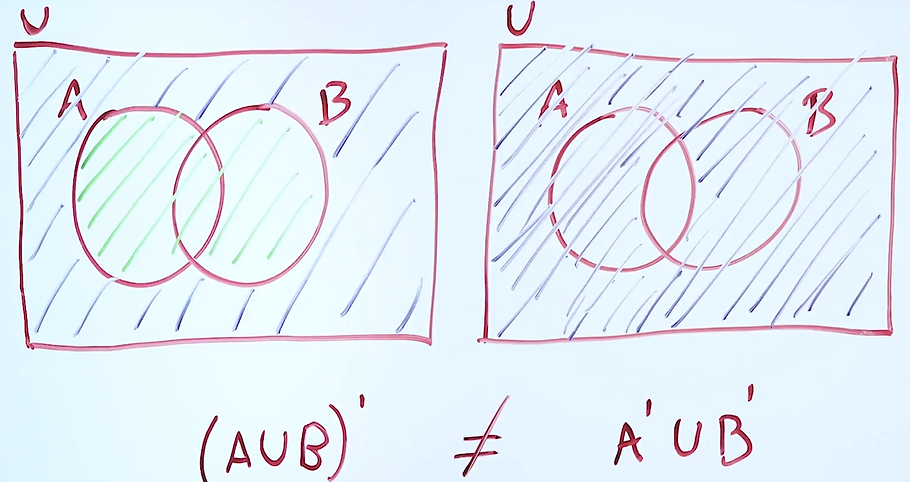

### 1ra Ley

El complemento de un producto de "n" variables es igual a la suma de los complementos de "n" variables. En otras palabras el complemento de dos o más variables a las que se les aplica la operación AND es equivalente a aplicar la operación OR.

  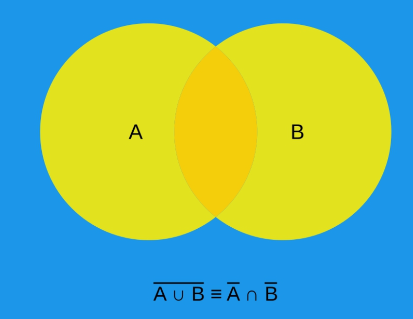

### Segunda Ley

El complemento de una suma de "n" variables es igual al producto de los complementos de "n" variables. En otras palabras el complemento de dos o más variables a las que se les aplica la operación OR es equivalente a aplicar la operación AND.

  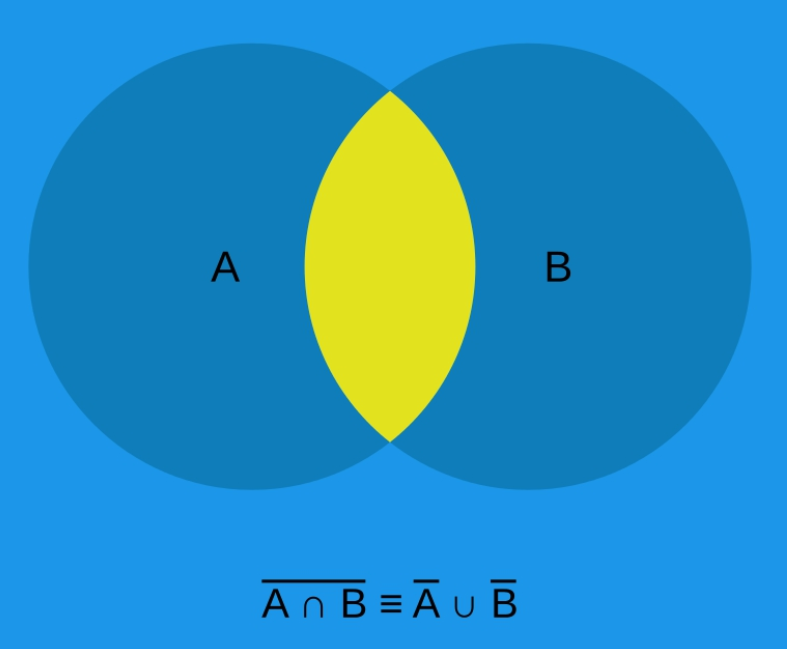

### Comprobación gráfica

  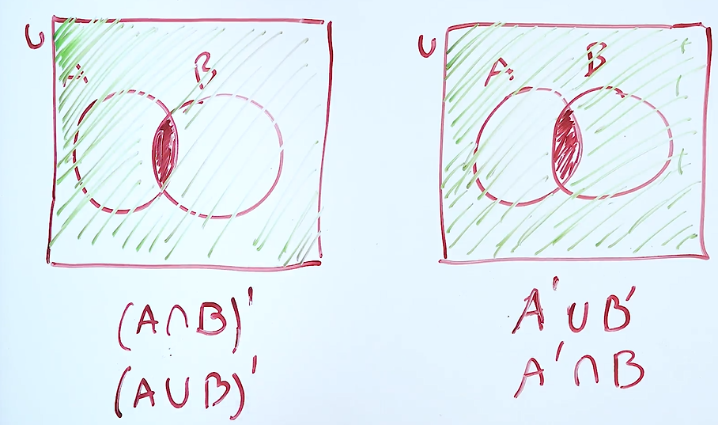

### Propiedades y teoremas

  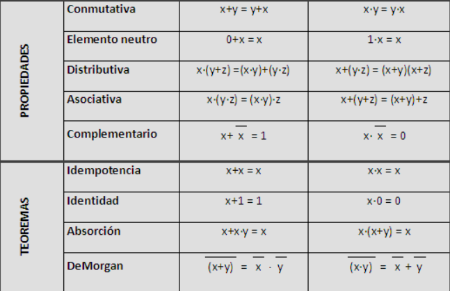

  

# Teoría de grafos

El concepto básico de un gráfico es, un modelo matemático que sirve para representar las **relaciones entre objetos de un conjunto**.

> **Un gráfico o grafo es un conjunto de vértices, o nodos, que están conectados a través de aristas, líneas o conexiones.**

  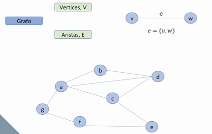

## Tipos de grafos

* **Nodo simple** donde tenemos los nodos y las conexiones gracias a las cuales nos podemos mover fácilmente a través del grafo.
* **El Multígrafo** tiene varias conexiones entre dos nodos, permitiendo tener dos rutas distintas para estos nodos.
* **Un Pseudografo** al igual que el multígrafo puede tener múltiples conexiones entre dos nodos y, además, una de estas conexiones puede partir y terminar en el mismo nodo.
* **El Grafo Ponderado** cuenta con un valor dentro de las conexiones, esto puede verse como el costo, o recurso, de una ruta de nodos.
* Por último, **el Grafo Dirigido** establece una dirección en las conexiones, **esta dirección se representa con una flecha**
* **El Multígrafo Dirigido** que cuenta con dirección en las conexiones y puede haber múltiples conexiones entre dos nodos.

  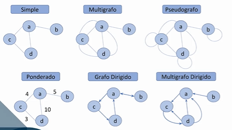

## Grados, caminos, cadenas y ciclos

### ¿Qué es el grado de un vértice?

> Es el número de aristas que tiene un nodo con otros nodos.

  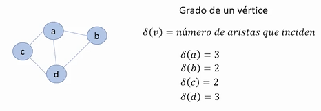

* Existe una propiedad matemática que nos dice que **la sumatoria de todos los grados de los vértices de un grafo es igual al doble de las aristas.**

  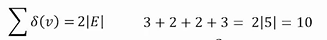

* Otra propiedad nos indica que **si tenemos más de dos vértices con grado impar es imposible recorrer de una sola vez todo el grafo sin repetir un camino.**

  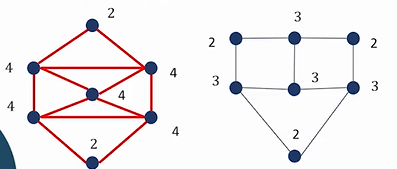

* **Una cadena es una sucesión de vértices y de conexiones entre sí.**

  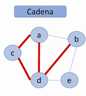

* Un camino a diferencia de una cadena es una **sucesión de vértices y conexiones donde no puedes repetir ningún vértice ni conexión** 

  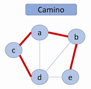

* **En un ciclo el vértice de inicio es igual al vértice donde termina.**

  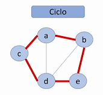

* La cadena cerrada es lo mismo solo que **el inicio y final son iguales, dónde inicia termina**

  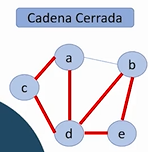

* **Un grafo conexo es aquel donde todos los nodos están unidos entre sí.**

  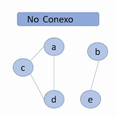

## Caminos y ciclos eulerianos

Un **camino** es una sucesión de vértices y conexiones donde no pasas dos veces por el mismo vértice, y un **ciclo** es una sucesión de vértices y conexiones donde el nodo de inicio es igual al nodo final.

> Pues un **Camino Euleriano** es aquel camino que recorre todo el grafo sin repetir una conexión, esto se cumplirá siempre y cuando un grafo no tenga más de dos vértices con grado impar.

> Un **Ciclo Euleriano** es aquel ciclo que recorre todo el grafo sin repetir una conexión, este se cumplirá solo cuando todos los vértices del grafo son grado par.

  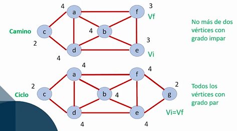

## Caminos y ciclos hamiltonianos

A diferencia de los caminos y ciclos eulerianos, los caminos y ciclos hamiltonianos **buscaran recorrer los nodos una sola vez sin importar el camino que utilicemos.**

Para afirmar que hay **un camino hamiltoniano se debe cumplir la condición donde la suma del grado de dos vértices es mayor o igual al número de vértices menos uno**, de otra forma puede que exista el camino hamiltoniano, pero no se podrá afirmar.

  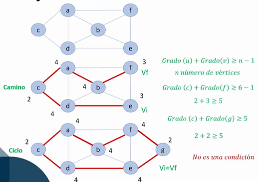

### Ejemplos de gráficos no hamiltonianos

> Si hay un camino hamiltoniano, pero no un ciclo, entonces el grafo no es hamiltoniano.

  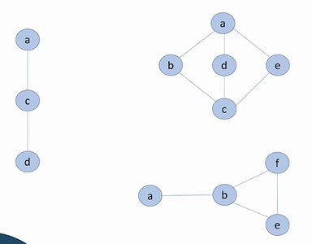

## Matriz de adyacencia

Dentro de la matriz **vamos a representar cada fila y columna con un nodo**, si existe una conexión entre dos nodos entonces colocaremos un uno en la celda correspondiente, si no existe una conexión colocaremos un cero. Si algún nodo tiene una conexión consigo mismo entonces colocaremos un 2.

> Al sumar todas las filas nos dará como resultado el grado de cada vértice.

**La matriz de adyacencia es una de las representaciones más utilizadas.**

  

## Matriz de incidencia

**Antes de construir una matriz de incidencia deberás darle un nombre o identificador a cada conexión de tu grafo.** Estas conexiones van a representar las columnas de tu matriz y los nodos van a representar las filas.

Colocaremos un 1 en las celdas donde una conexión incida en un nodo, si no incide en el nodo entonces colocaremos un 0.

  

  

## Ejercicio con matrices

  

Identificar si la matriz es simetrica o no

* Grafo dirigido = matriz asimétrica
* Grafo no dirigido = matriz simétrica

En la matriz de adyacencia asimétrica, si sumamos las filas de cada nodo nos dirá la cantidad de conexiones que inciden en el nodo, y si miramos las columna nos dirá sobre que nodo inciden los nodos.

  

Grafo resultante

  

# Arboles

Los árboles son un tipo de gráfica que tiene muchas aplicaciones en **Machine Learning, Ciencias de la computación y en la programación.** Un árbol representa una **estructura de datos**.

  

**Los Árboles nos permiten organizar o estructurar información.** Si tenemos un nodo A y un nodo B, solo existirá una conexión entre ellos.

  

Los árboles son usados frecuentemente para expresar **relaciones de jerarquía.**

  

  

## Tipos de árboles:

* **Libre:** no es claro cual es el nodo principal o nodo raíz dentro de este árbol.

  

* **Raíz:** se ve una estructura clara de los nodos. Todos parten de un mismo nodo.

  

* **Expansión:** es similar al grafo empoderado, la conexión entre los nodos tiene un recurso asociado.

  

* **Binario:** en cada uno de los niveles del árbol se tiene un máximo de dos conexiones.

  

Dentro de los árboles **existe el nivel y la altura**, los valores de estos cambiaran dependiendo del nodo que tomes como raíz.

* El nivel de un árbol es igual al **máximo nivel posible de un nodo**, el nivel de un nodo se define por el número de conexiones entre el nodo y la raíz más uno.
* **La altura de un árbol es igual al nivel del árbol más el nivel raíz**.

  

## Sub árboles, vértices terminales e internos

Un **subárbol** es una parte de un árbol que hace parte de un árbol más grande.

Un **vértice terminal** es aquel nodo que ya no tiene más hijos o donde el árbol ya no se expande. 

Por otro lado, los **vértices internos** son aquellos que tienen hijos.

  

## Árbol de expansión mínimo

Un árbol de expansión mínimo es aquel árbol que **partiendo de una raíz** pueda **conectar todos los vértices buscando los caminos de menor costo.** 

Para sacar el costo mínimo del árbol solo basta con ir sumando el valor que tiene cada conexión nivel por nivel, luego sumar todos los niveles.

  

## Árbol binario

Un árbol binario **es aquel donde tenemos un máximo de dos hijos** por cada uno de los vértices.

  

Existen dos tipos de arboles binarios: 

* El **árbol binario completo** donde cada uno de los vértices tiene sus dos ramas bien definidas o no tiene ninguna.
* El **árbol binario lleno** es aquel donde todos los nodos **llegan a un mismo punto y al final todas sus ramas son terminales.**

  

El árbol degenerado es donde la mayoría de sus nodos tienen solo un hijo.

  

> Un árbol binario es una estructura recursiva pues puede llamarse a si misma, puedes descomponerlo en partes más pequeñas.

  

## Recorrido de árboles

  

Al momento de representar un árbol debemos elegir **el orden en el cual vamos a recorrer dicho árbol.** Dependiendo de qué orden se elija será la forma en que se va a representar el árbol.

Existen tres formas de recorrer un árbol:

* **Pre orden**: se inicia leyendo el nodo raíz, luego se pasa al hijo izquierdo y por ultimo al derecho.
* **In orden**: inicia leyendo el hijo izquierdo, luego la raíz y por último el hijo derecho.
* **Pos orden**: comienza por el hijo izquierdo para posteriormente ir al hijo derecho y por último al nodo raíz.

  

## Expresiones aritméticas

Los árboles también nos sirven para **representar expresiones aritméticas**, para ello debe cumplir con las siguientes condiciones:

* Los vértices terminales son operandos.
* Los vértices internos son operadores.
* La raíz siempre debe ser un operador.

Así como vimos las diferentes formas para recorrer un árbol, las expresiones aritméticas tienen también sus propias formas:

* **Pre fijo**: raíz-izquierda-derecha
* **In fijo**: izquierda-raíz-derecha
* **Pos fijo**: izquierda-derecha-raíz

  

### Ejercicio

  

  

### Ejercicio 2

  

  

# Algoritmos

> Un algoritmo es una serie de pasos que nosotros seguiremos de acuerdo con una lógica.

## Algoritmo de Prim

El algoritmo de Prim **nos sirve para conectar todos los vértices a través de un árbol con el mínimo coste.** Para calcular el coste total del árbol debemos sumar el valor de todas las aristas conectadas.

El algoritmo de Prim nos indica que este se **termina cuando hemos conectado todos los vértices con n-1 aristas**, donde n es el número de vértices.

  

  

  

## Algoritmo Dijkstra

El algoritmo de Dijkstra **va a buscar la ruta optima o de menor coste entre dos vértices.**

Los pasos de este algoritmo son los siguientes:

* Asignar el valor infinito a cada nodo que no ha sido visitado.
* Mantener un registro de los nodos visitados.
* Calcular la distancia a cada nuevo nodo sumando la distancia anterior.
* Si la nueva distancia que se calculo es menor que la anterior entonces reemplazar en el nodo, sino dejar la anterior.
* Se finalizará cuando se llega al nodo final.

  

  

  

  

  

## Algoritmo de Kruskal

**El algoritmo de Kruskal al igual que el algoritmo de Prim sirve para buscar el árbol de expansión mínimo**, la diferencia es que el algoritmo de Kruskal inicia seleccionando la arista de menor valor y después en cada iteración se agrega la arista de menor valor del conjunto disponible.

  

  

  

## Algoritmo de Fleury

El algoritmo de Fleury **va a encontrar un ciclo euleriano**. Recordemos que un ciclo euleriano es un ciclo donde **inicias y terminas en el mismo punto**, pasando por todas las aristas una sola vez.

Los pasos que seguir son:

* Verificar grado del grafo.
* Realizar un circuito cerrado.
* En cada nueva iteración realizar un nuevo camino cerrado visitando aristas que no han sido visitadas.
* Reemplazar cada nuevo circuito en el inicial hasta visitar todas las aristas.

Para grados **pares**

  

  

Dependiendo del grado, unicamente pueden aparecer n/2 veces

  

## Algoritmo de flujo máximo

Habrá ocasiones donde no vamos a querer el coste mínimo, sino buscar el flujo máximo, para esas ocasiones nos servirá este algoritmo. **Para este algoritmo usaremos un grafo dirigido empoderado.**

Los pasos del algoritmo son los siguientes:

* Direccionar los flujos e iniciar en ceros.
* Obtener trayectorias buscando el mayor flujo.
* Escoger el menor flujo de la trayectoria, esto es la arista de menor valor dentro de tu camino que seleccionaste.
* Actualizar el gráfico con las capacidades mínimas, ósea, restando el valor de la arista del anterior paso a cada una de las aristas del camino.
* Buscar nueva trayectoria o camina en aumento y repetir hasta que no existan más.

  

  

