# Fundamentos de Matemáticas<!-- omit in toc -->

## Tabla de Contenido<!-- omit in toc -->
- [Enlaces de interés](#enlaces-de-inter%c3%a9s)
- [Aritmética](#aritm%c3%a9tica)
  - [Operadores básicos](#operadores-b%c3%a1sicos)
  - [Potenciación y sus propiedades](#potenciaci%c3%b3n-y-sus-propiedades)
  - [Radicación y sus propiedades](#radicaci%c3%b3n-y-sus-propiedades)
  - [Orden de operaciones](#orden-de-operaciones)
  - [Factorización](#factorizaci%c3%b3n)
  - [Recta numérica](#recta-num%c3%a9rica)
- [Álgebra básica](#%c3%81lgebra-b%c3%a1sica)
  - [Simbología](#simbolog%c3%ada)
  - [Propiedades de las ecuaciones](#propiedades-de-las-ecuaciones)
  - [Orden de despeje](#orden-de-despeje)
  - [Despejando exponentes y raíces en álgebra](#despejando-exponentes-y-ra%c3%adces-en-%c3%a1lgebra)
- [Polinomios](#polinomios)
  - [Simplificando polinomios](#simplificando-polinomios)
  - [La propiedad distributiva de la multiplicación](#la-propiedad-distributiva-de-la-multiplicaci%c3%b3n)
    - [Desarrollando polinomios](#desarrollando-polinomios)
- [Funciones](#funciones)
  - [Tabulación de funciones](#tabulaci%c3%b3n-de-funciones)
  - [Plano Cartesiano](#plano-cartesiano)
- [Gráficas](#gr%c3%a1ficas)
  - [Test línea vertical](#test-l%c3%adnea-vertical)
  - [Funciones lineales](#funciones-lineales)
  - [Todo se puede graficar](#todo-se-puede-graficar)
  - [Cómo identificar funciones lineales a partir de una ecuación](#c%c3%b3mo-identificar-funciones-lineales-a-partir-de-una-ecuaci%c3%b3n)

# Enlaces de interés
Reforzar las matemáticas
https://brilliant.org/
https://www.thatquiz.org/
https://www.geogebra.org/graphing?lang=es

# Aritmética
Es una rama de las matemáticas que estudia los números y las operaciones que se pueden realizar con ellos. Dentro de las operaciones que podemos realizar con los números encontramos cuatro operaciones básicas:

## Operadores básicos
- **Suma:** representada por el signo **+** esta operación se encarga de adicionar datos entre sí.
- **Resta:** representada por el signo **-** esta operación se encarga de substraer un número de otro. Esta operación es la operación inversa de la suma.
- **Multiplicación:** representada por los signos **x, * y ..** Esta operación se puede ver como una suma repetida.
- **División:** representada por los signos **/, - y ÷.** Esta operación consiste en formar grupos de elementos.

  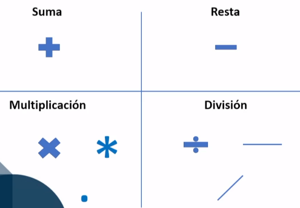
  <small>
Operadores básicos
</small>

Cada una de las operaciones se puede deshacer con su inversa

## Potenciación y sus propiedades
En la multiplicación teníamos un numero que se sumaba el numero de veces que indica el operando. Mientras que en la potenciación tenemos un numero que va a ser multiplicado la cantidad de veces que indique su exponente.

  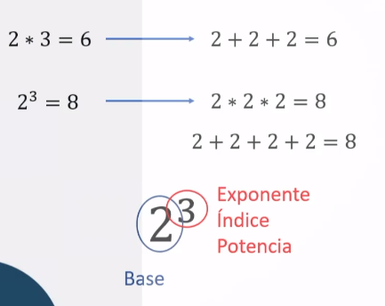
  <small>
Potencias
</small>

Podemos encontrar varias propiedades en las potencias, por ejemplo:

- En la multiplicación de dos potencias con misma base los exponentes se suman.
- En la división de dos potencias con misma base los exponentes se restan.
- Una potencia elevada a la cero da uno.
- Una potencia cuya base es cero siempre va a dar cero, no importa el exponente.

  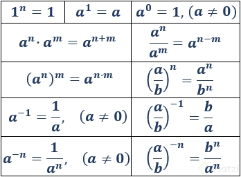
  <small>
Propiedades de los exponentes
</small>

## Radicación y sus propiedades
La operación inversa de la potenciación es la radicación, lo que va a hacer esta operación es buscar el número raíz o base que se debe multiplicar la cantidad de veces que indique el índice para obtener el radicando.

Si estamos buscando la raíz de una multiplicación podemos separar los términos en varias operaciones raíz y multiplicarlas.

  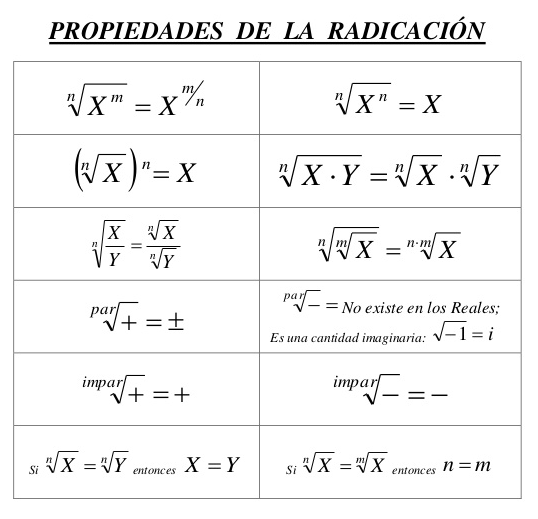
  <small>
Propiedades de la radicación
</small>

## Orden de operaciones

Las operaciones se deben resolver siguiendo un orden:

- Las que se encuentren dentro de **paréntesis y corchetes**.
- Las operaciones de **potencias y raíz**.
- Las operaciones de **multiplicación y división**.
- Por último, las operaciones de **suma y resta**.

## Factorización

La factorización consiste en el proceso de encontrar factores. **Para un numero X, los factores serán los números que al multiplicarse su resultado sea igual al número X.**

  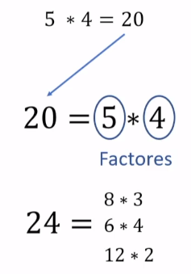
  <small>
Factores
</small>

Para facilitar el proceso de factorización debemos utilizar los números primos.

Los números primos son aquellos números cuyos únicos factores son el mismo número y el número 1.

> Los números primos, vienen de la palabra primero, y son la base para componer el resto de números que existen

  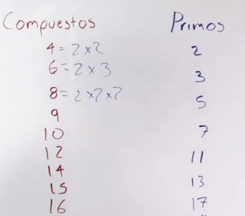
  <small>
Números primos
</small>

Podemos descomponer un número en números primos

  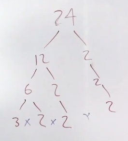
  <small>
Descomposición
</small>

  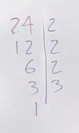
  <small>
Descomposición método 2
</small>

## Recta numérica
Los seres humanos somos muy visuales, por ello se tuvo la necesidad de graficar lo que se media, así nació la recta numérica.

En la recta numérica **se encuentran tanto los números positivos como negativos y en su centro se encuentra el cero**. Mientras más a la derecha se encuentre un número en la recta numérica, mayor va a ser su valor.

  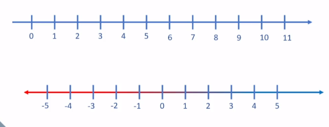
  <small>
La recta númerica
</small>

Los signos + y - tienen propiedades muy importantes:

- Signos diferentes dan negativo, por ejemplo, sumar un signo negativo te va a dar negativo. Par de signos iguales dan positivo, por ejemplo, restar un signo negativo te va a dar positivo.

# Álgebra básica

> Cuando tenemos una operación cuyo resultado no sabemos, este resultado lo representaremos con la letra x y se llamara variable.

**Una ecuación es una igualdad entre dos expresiones que contienen una o más variables.**

  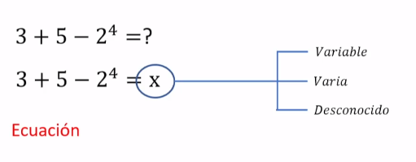
  <small>
Ecuaciones
</small>

Si tenemos dos ecuaciones distintas, **sus valores de x van a ser distintos**. Sin embargo, en un sistema de ecuaciones tendremos más de dos ecuaciones cuyo valor de x será igual.

> En una ecuación donde tenemos una misma variable x, no puede tomar valores distintos, en cambio si tenemos una variable x y una variable y estas pueden tener mismos valores y también distintos.

  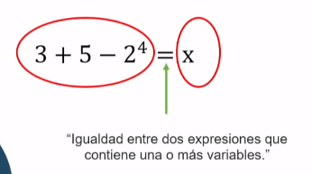
  <small>
Igualdades
</small>

## Simbología

En el álgebra seguiremos usando la simbología de la suma y resta, pero para la división y multiplicación habrá unos ligeros cambios. Para la división ya no se usará tanto el símbolo ÷, en su lugar usaremos una línea -. La multiplicación seguirá teniendo los símbolos x, . y *, pero se le va a añadir el poder representar una multiplicación encerrando sus factores en paréntesis: (2)(5) = 10

  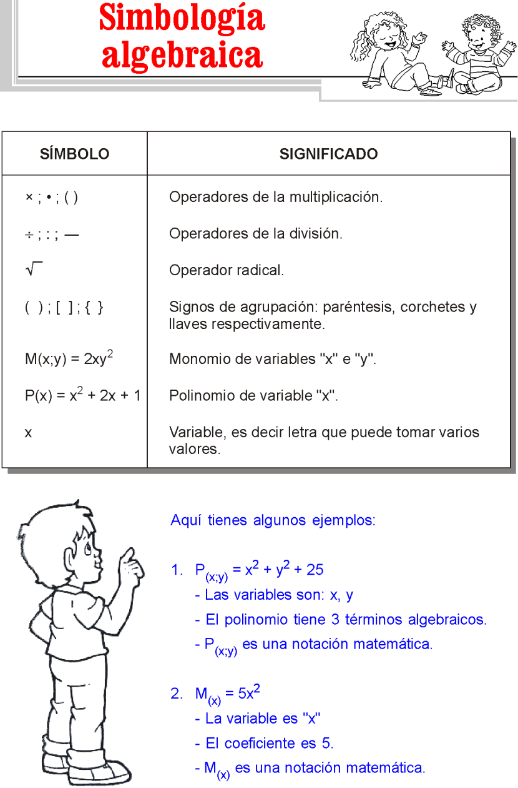
  <small>
Simbología
</small>

## Propiedades de las ecuaciones
Si una ecuación A es igual a una ecuación B, y esta a su vez es igual a una ecuación C, entonces A es igual a C.

>Para mantener la igualdad dentro de una ecuación si realizamos una operación de un lado, debemos realizar la misma operación del otro lado de la igualdad.

  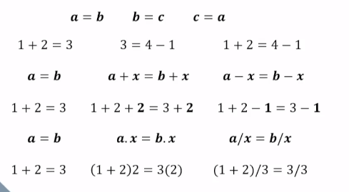
  <small>
Propiedades de las ecuaciones
</small>

## Orden de despeje
 Así como en aritmética empezábamos resolviendo los paréntesis y terminabas con las sumas, pero en una ecuación vamos a realizar el proceso al revés, iniciando por las sumas y terminando en los paréntesis.

 

  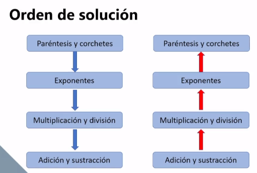
  <small>
Orden de solución de ecuaciones
</small>

## Despejando exponentes y raíces en álgebra
Cuando tenemos una raíz cuadrada de una variable en nuestra ecuación, solamente debemos elevar al cuadrado cada lado de la igualdad para obtener la solución.

 

  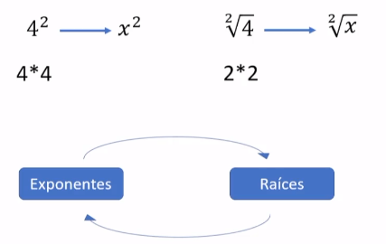
  <small>
Exponentes y raíces
</small>

En los casos que tenemos una variable elevada al cuadrado debemos aplicar raíz cuadrada a ambos lados de la igualdad, pero el resultado de la variable se deberá mostrar tanto positivo como negativo.

Las raíces se pueden expresar como fracciones
 

  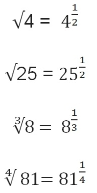
  <small>
Propiedad de las raíces
</small>

 

  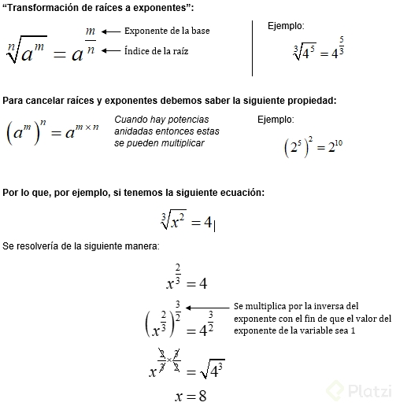
  <small>
De raíz a exponente
</small>

# Polinomios

La palabra poli significa múltiples o varios, mientras que nomio significa término, entonces polinomio son varios términos. 

>Un término es el conjunto de un coeficiente y una variable.

El grado de un polinomio estará determinado por el grado máximo de los exponentes. Mientras más grande sea el grado de un polinomio mayor será su complejidad.

 

  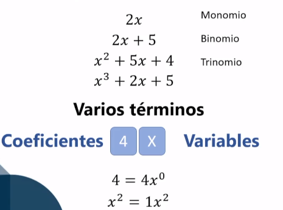
  <small>
Polinomios
</small>

## Simplificando polinomios
Los términos semejantes son aquellos que tienen misma variable y exponente, por ello se pueden sumar o restar. Podemos simplificar los polinomios buscando unir sus términos semejantes.

 

  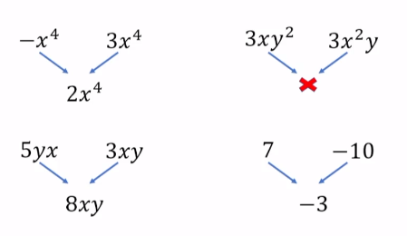
  <small>
Simplificar polinomios
</small>

## La propiedad distributiva de la multiplicación
Al momento de simplificar polinomios nos será de gran utilidad la propiedad distributiva. Esta propiedad en aritmética nos permite solucionar de dos maneras la siguiente expresión 3*(4+6) ya sea resolviendo primero la suma dentro del paréntesis y luego multiplicar, o multiplicando el número por cada componente de la suma y posteriormente sumar los resultados.

En álgebra en una expresión 3(x+6) no podemos sumar 6 a x, por ello hacemos uso de la propiedad distributiva para multiplicar 3 por cada uno de los componentes de la suma, dejando la siguiente expresión 3x+18.

 

  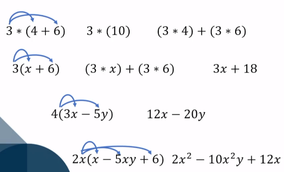
  <small>
Propiedad distributiva
</small>

De esta forma, las ecuaciones se pueden **factorizar**, etrayendo los números comúnes

 

  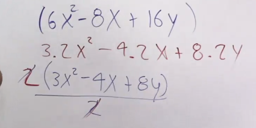
  <small>
Ejemplo de factorización
</small>

De esta forma si se pueden simplificar aún más las ecuaciones

### Desarrollando polinomios

 

  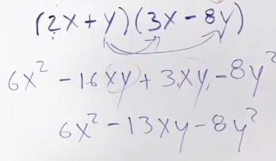
  <small>
Ejemplo de Desarrollo de polinomios
</small>

> Este tipo de ejercicios ayudan a desarrollar nuestra lógica

# Funciones

Para una función tendremos un valor de entrada y esta nos regresara un valor de salida diferente o igual, de acuerdo con lo que la función indique. Por cada valor de entrada va a haber solamente un valor de salida. Los datos de entrada de una función son llamados dominio, mientras que los datos de salida son llamados rango.

> Al momento de escribir funciones podemos usar la variable y, pero una forma más académica sería escribiendo f (x).

 

  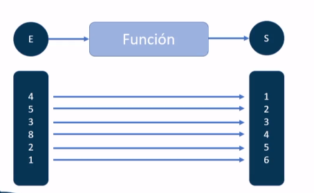
  <small>
Función
</small>

## Tabulación de funciones

Dentro de las funciones tenemos una variable dependiente e independiente. 

>La variable independiente por lo general es x pues es el valor que le damos de entrada, puede ser cualquier valor, mientras que en la variable dependiente su valor será igual al resultado de la función.

 

  
  <small>
Tabulación de funciones
</small>

## Plano Cartesiano
También podemos graficar las funciones, así como graficamos un número dentro de la recta numérica para graficar una función haremos uso de dos rectas numéricas. Una recta de forma horizontal representando los valores de x y una recta vertical representando los valores de y. Esto es el plano cartesiano.

El plano cartesiano se encuentra dividido en cuatro cuadrantes.

 

  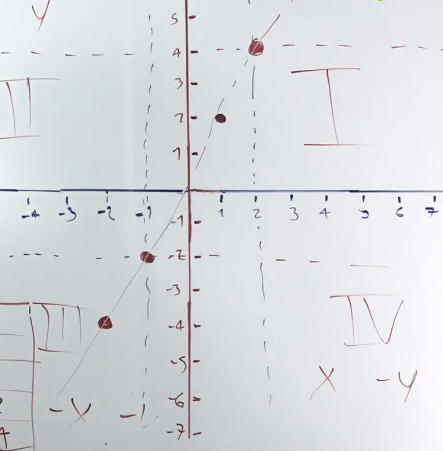
  <small>
Ejemplo de plano cartesiano
</small>

Cuando nos enseñan a dibujar los números sobre la recta, solo dibujamos la recta en horizontal. Pero cuando se empieza con las coordenadas, tenemos que dibujar el otro eje en perpendicular, cortando a la recta. **Ahí tenemos el significado de "abscisa", pues la palabra abscissa significa "línea cortada".**

Para el eje de ordenadas parece ser que hay dos versiones:
- **Ordinatae, que significa paralela**, y hace referencia a que para dibujar un punto hay que trazar una paralela a este eje por el lugar adecuado
- **Orthia**, que significa recto y hacia arriba.

Y por último... ¿qué ocurre en tres dimensiones? Aparece un nuevo eje, llamado eje Z. Tengo que reconocer que nunca me había planteado si este eje tenía nombre o no, y resulta que se llama **eje de COTAS.**

# Gráficas

## Test línea vertical
Recuerda que en una función por cada valor de x hay un valor de y. Para saber si tenemos una función o no solamente debemos realizar la prueba de línea vertical donde si un valor de x se cruza dos veces con un valor de y, entonces no es una función.

  
  <small>
Comprobar si es función o no
</small>

## Funciones lineales
Las funciones lineales las vamos a utilizar y ver de forma frecuente en nuestra vida cotidiana, estas funciones tienen la forma **y = mx donde m se llama pendiente.** La pendiente nos sirve para ver qué tan rápido crece o decrece nuestros valores de la función.

Mientras más grande sea el valor de la pendiente más se va a acercar a la línea vertical, pero nunca la va a tocar. Por otro lado, si nuestra pendiente tiene un valor menor a 1 y mayor a 0, se irá acercando a la línea horizontal del plano cartesiano.

  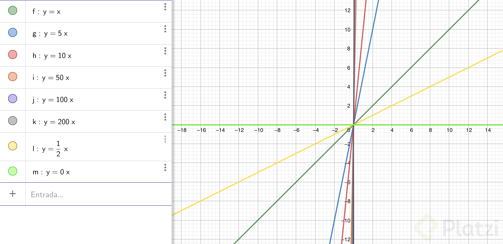
  <small>
Funciones lineales
</small>

## Todo se puede graficar
Si los valores de nuestra pendiente son negativos, entonces nuestra función tendrá valores en los cuadrantes II y IV.

> Hasta el momento todas nuestras funciones han pasado por el punto (0, 0),si queremos que no pasen por este punto solamente necesitamos que a nuestra función se le sume una constante. **y = mx +b**

  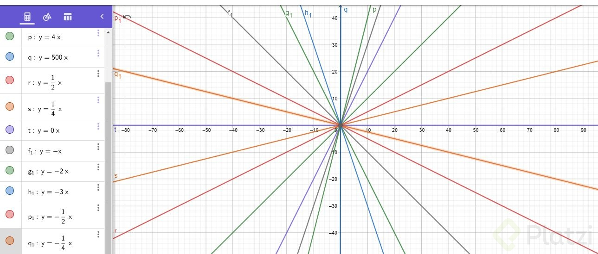
  <small>
Funciones lineales en todos los cuadrantes
</small>

## Cómo identificar funciones lineales a partir de una ecuación
Identificar si una función no es lineal a partir de su ecuación es bastante fácil, si la ecuación tiene algún exponente entonces ya no es una función lineal.